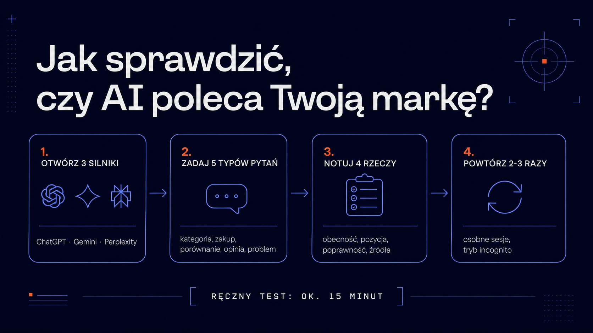

Z ChatGPT korzysta już ponad 10 milionów Polaków – tak wynika z badania Mediapanel Gemius/PBI z października 2025 roku. Według analizy OpenAI i NBER niemal co czwarta rozmowa z czatbotem dotyczy poszukiwania informacji: o produktach, usługach, firmach. Twoi klienci pytają więc sztuczną inteligencję, co kupić i komu zaufać – a Ty najprawdopodobniej nie wiesz, co słyszą w odpowiedzi. Tych rozmów nie zobaczysz w Google Analytics ani w Search Console. W tym przewodniku pokazujemy, jak w kwadrans samodzielnie sprawdzić, czy ChatGPT, Gemini i Perplexity polecają Twoją markę – i co zrobić, jeśli okaże się, że milczą albo mijają się z faktami.

## Dlaczego widoczność w AI nie pokrywa się z pozycjami w Google?

Pierwsza pozycja w Google nie gwarantuje, że ChatGPT wymieni Twoją firmę wśród polecanych. Modele językowe czerpią wiedzę z dwóch źródeł. Pierwsze to dane treningowe – statyczny zbiór tekstów, na których model się uczył, zamrożony w momencie tak zwanej daty odcięcia. Drugie to wyszukiwanie w czasie rzeczywistym: model dobiera bieżące źródła i na ich podstawie buduje odpowiedź.

I tu zaczynają się różnice. **Gemini** – korzysta z indeksu Google. **ChatGPT** – z włączonym wyszukiwaniem sięga m.in. po indeks Bing. **Perplexity** – utrzymuje własny indeks sieci. Każdy silnik widzi internet inaczej, więc marka świetnie widoczna w jednym może w ogóle nie istnieć w drugim.

Jest jeszcze drugi powód: odpowiedź AI to synteza, nie lista linków. Model wymienia dwie, trzy marki z nazwy, a reszta po prostu znika z pola widzenia użytkownika. Skalę tego zjawiska pokazuje [nasza analiza wpływu AI Overviews na ruch organiczny ponad 400 polskich stron](https://www.grupa-icea.pl/blog/jak-ai-overviews-zmienia-ruch-organiczny-analiza-danych-ponad-400-polskich-stron/) – nawet utrzymanie pozycji w wynikach nie chroni przed spadkiem kliknięć, gdy odpowiedź generuje AI.

Wniosek jest prosty: widoczność w AI trzeba mierzyć osobno. Klasyczny monitoring pozycji jej nie pokaże.

## Jak ręcznie sprawdzić markę w ChatGPT, Gemini i Perplexity?

Podstawowy test zajmie Ci około 15 minut. Otwórz trzy silniki – ChatGPT (z włączonym wyszukiwaniem), Gemini i Perplexity – i zadaj każdemu ten sam zestaw pytań. Ważne: nie pytaj wprost „czy znasz firmę X?", bo model grzecznościowo potwierdzi. Pytaj tak, jak pyta klient, który Cię jeszcze nie zna.

Skorzystaj z pięciu gotowych szablonów (podstaw własną branżę i lokalizację):

- **Odkrycie kategorii** – „Jakie firmy polecasz do [usługa, np. pozycjonowania stron] w Polsce? Wymień konkretne nazwy."
- **Zakup produktu** – „Szukam [produkt] dla [typ klienta, np. małej firmy B2B]. Co konkretnie polecasz i dlaczego?"
- **Porównanie** – „Porównaj [Twoja marka] z [główny konkurent]. Które rozwiązanie wybrać dla [scenariusz]?"
- **Opinia o marce** – „Co wiesz o firmie [Twoja marka]? Czym się zajmuje i jakie ma opinie?"
- **Problem klienta** – „Mam problem z [problem, który rozwiązuje Twój produkt]. Jak go rozwiązać i jakie narzędzia lub firmy mogą pomóc?"

Przy każdej odpowiedzi zanotuj cztery rzeczy:

| Co sprawdzasz | Na co zwrócić uwagę |
|---|---|
| Obecność | Czy marka w ogóle pada w odpowiedzi – spontanicznie, nie po dopytaniu |
| Pozycja | Czy jesteś wymieniany pierwszy, trzeci, czy na szarym końcu listy |
| Poprawność | Czy opis oferty jest aktualny – stare ceny i nieistniejące produkty to częsty problem |
| Źródła | Skąd model czerpie wiedzę – czy cytuje Twoją stronę, czy może katalog firm sprzed lat |

Dwa praktyczne nawyki podnoszą wiarygodność testu. Po pierwsze – testuj na wylogowanym koncie albo w trybie incognito, bo personalizacja i pamięć rozmów zafałszują wynik (model, który zna Cię z wcześniejszych rozmów, chętniej wspomni Twoją markę). Po drugie – każde pytanie zadaj dwa, trzy razy w osobnych sesjach. Odpowiedzi modeli potrafią się różnić między uruchomieniami i dopiero powtórzenia pokazują, co jest regułą, a co przypadkiem.

## Jakie pułapki czyhają na ręczne testowanie?

Ręczny test to dobry punkt startu, ale ma cztery ograniczenia, o których trzeba wiedzieć, zanim wyciągniesz wnioski.

**Niedeterminizm** – ten sam prompt może dać dziś inną odpowiedź niż jutro. Pojedyncze odpytanie to anegdota, nie pomiar. Dlatego liczy się powtarzalność serii, a nie jednorazowy wynik.

**Personalizacja** – ChatGPT i Gemini coraz mocniej dopasowują odpowiedzi do historii użytkownika. Wynik na Twoim koncie firmowym może wyglądać zupełnie inaczej niż u realnego klienta.

**Query fan-out** – nowoczesne silniki nie odpowiadają na Twoje pytanie wprost. W tle rozbijają je na dziesiątki własnych zapytań cząstkowych i syntetyzują wyniki. To oznacza, że o widoczności decydują frazy, których nigdy nie zobaczysz w żadnym narzędziu keyword research. Mechanizm opisaliśmy szczegółowo w artykule o [optymalizacji treści pod query fan-out](https://www.grupa-icea.pl/blog/optymalizacja-tresci-pod-query-fan-out/).

**Skala** – ręcznie sprawdzisz kilkanaście pytań na trzech silnikach. Realna mapa widoczności marki to setki kombinacji pytań, silników i powtórzeń. Tego się nie da utrzymać w arkuszu kalkulacyjnym dłużej niż miesiąc.

## Jakie narzędzia zautomatyzują monitoring marki w AI?

Część tej pracy można zautomatyzować bezpłatnie. W ramach Grupy ICEA rozwijamy [widocznosc.ai](https://widocznosc.ai/) – projekt poświęcony w całości widoczności marek w wyszukiwarkach AI, który udostępnia darmowe narzędzia diagnostyczne:

- **[Widoczność marki w AI](https://widocznosc.ai/narzedzia/brand-check/)** – odpytuje modele o Twoją markę i pokazuje, co o niej „wiedzą": jak ją opisują, z czym kojarzą i czy mijają się z faktami. Dobry odpowiednik ręcznego testu z poprzedniego rozdziału, tylko szybszy i powtarzalny.
- **[Analiza zapytań AI (query fan-out)](https://widocznosc.ai/narzedzia/fanout/)** – pokazuje, na jakie zapytania cząstkowe silnik rozbija pytanie z Twojej branży, jakie źródła odpytuje i które domeny cytuje. To odpowiedź na problem fan-outu: widzisz frazy, o których istnieniu nie miałeś pojęcia.

Oba narzędzia działają bez rejestracji i nadają się na pierwszy pomiar bazowy. Na rynku rośnie też segment płatnych platform do stałego monitoringu wzmianek w AI z alertami i analizą konkurencji – mają sens, gdy widoczność w AI staje się dla firmy regularnym wskaźnikiem, a nie jednorazowym audytem.

## Co zrobić, gdy AI nie zna Twojej marki albo myli fakty?

Brak marki w odpowiedziach to nie wyrok – to punkt wyjścia. Dziedzina, która zajmuje się budowaniem widoczności w silnikach generatywnych, nazywa się GEO (Generative Engine Optimization). Jeśli to dla Ciebie nowe pojęcie, dobre wprowadzenie znajdziesz w przewodniku [czym jest GEO](https://widocznosc.ai/geo/czym-jest-geo/).

W praktyce pracę zaczyna się od trzech kierunków:

- **Treść, którą da się zacytować** – modele wybierają źródła z konkretami: liczbami, definicjami, jasnymi odpowiedziami na pytania. Ogólnikowe teksty „o firmie" nie dają modelowi nic, co mógłby powtórzyć.
- **Dostępność techniczna** – boty AI muszą móc pobrać i odczytać Twoją stronę. Blokady w robots.txt, treść renderowana wyłącznie JavaScriptem czy brak danych strukturalnych potrafią wyciąć markę z indeksów, z których korzystają silniki odpowiedzi.
- **Wzmianki poza Twoją stroną** – modele ufają źródłom zewnętrznym: mediom branżowym, portalom opinii, raportom i zestawieniom. Marka, o której pisze tylko jej własna strona, jest dla AI mało wiarygodna.

Jeśli chcesz przejść przez ten proces metodycznie – od biblioteki zapytań testowych, przez pomiar, po plan naprawczy na 90 dni – skorzystaj z pełnego przewodnika [audyt widoczności marki w ChatGPT, Gemini i Perplexity krok po kroku](https://widocznosc.ai/geo/audyt-widocznosci-marki/). A jeśli wolisz, żeby zrobił to za Ciebie zespół, który mierzy widoczność marek w AI na co dzień – [skontaktuj się z nami](https://www.grupa-icea.pl/kontakt/), przygotujemy audyt GEO Twojej marki.

## FAQ – najczęstsze pytania o widoczność marki w AI

### Jak często sprawdzać, co AI mówi o mojej marce?

Minimum raz na kwartał, a w branżach konkurencyjnych raz w miesiącu. Modele są regularnie aktualizowane, a do ich indeksów stale trafiają nowe treści – również te publikowane przez Twoją konkurencję. Jednorazowy test pokazuje stan na dziś, ale nie wychwyci momentu, w którym konkurent zacznie wypierać Cię z odpowiedzi.

### Czy mogę wpłynąć na to, co ChatGPT mówi o mojej firmie?

Tak, choć nie bezpośrednio. Nie ma panelu, w którym „edytuje się" odpowiedzi modelu. Wpływasz na nie pośrednio: publikując konkretną, cytowalną treść, dbając o techniczną dostępność strony dla botów AI i budując wzmianki w źródłach zewnętrznych, którym modele ufają. To proces obliczony na miesiące, nie dni – dlatego im wcześniej zaczniesz, tym lepiej.

### Czym różni się widoczność w AI od pozycji w Google?

Pozycja w Google to miejsce na liście linków, z której użytkownik sam wybiera. Widoczność w AI to obecność w gotowej odpowiedzi – model wymienia kilka marek i to on decyduje które. Wysoka pozycja w Google pomaga (część silników korzysta z indeksów wyszukiwarek), ale nie wystarcza: liczy się też, czy treść nadaje się do zacytowania i czy marka pojawia się w wiarygodnych źródłach zewnętrznych.

### Ile kosztuje monitoring widoczności marki w AI?

Pierwszy pomiar zrobisz bezpłatnie: ręczny test to 15 minut pracy, a darmowe narzędzia takie jak [Widoczność marki w AI](https://widocznosc.ai/narzedzia/brand-check/) automatyzują odpytywanie modeli. Koszty pojawiają się przy stałym monitoringu na większą skalę – platformy enterprise rozliczają się abonamentowo – oraz przy profesjonalnym audycie z planem naprawczym, którego cena zależy od liczby fraz, rynków i silników.
