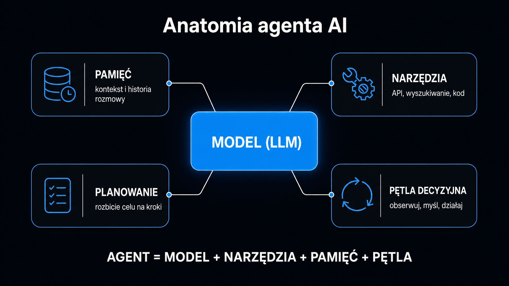

**Agent AI to nie chatbot z lepszym promptem, ale system, który planuje, wywołuje narzędzia i zapamiętuje wyniki aż do osiągnięcia celu.** Żeby ocenić, czy sprawdzi się w Twojej organizacji, musisz zrozumieć trzy filary jego architektury: narzędzia (czyli „ręce”), pamięć (czyli „kontekst operacyjny”) i pętlę decyzyjną (czyli „mózg”). Zanim powierzysz mu dostęp do CRM-u, bazy danych lub skrzynki mailowej, sprawdź mechanizmy działania pod spodem. Szerszy kontekst – czym agenci AI różnią się od klasycznych automatyzacji i kiedy warto po nie sięgać – znajdziesz w [przewodniku po agentach AI](/agenci-ai/przewodnik/).

## Narzędzia – jak agent działa w świecie zewnętrznym

LLM (Large Language Model, czyli duży model językowy) sam w sobie jest bezstanowy i odcięty od internetu. Żeby cokolwiek sprawdzić, zmienić lub wykonać, potrzebuje narzędzi. Mechanizm ich wywoływania to *tool calling* – agent generuje specjalny token, wstrzymuje przetwarzanie i czeka na wynik z zewnętrznego systemu, po czym włącza odpowiedź do swojego kontekstu roboczego.

Narzędzia to granica między modelem a rzeczywistością. Piszesz do agenta: „sprawdź, czy ta umowa jest podpisana”. On sam tego nie wie. Musi wywołać narzędzie do wyszukiwania w bazie dokumentów, odebrać wynik i dopiero wtedy sformułować odpowiedź.

Trzy główne kategorie narzędzi w produkcyjnych systemach agentowych:

- **Wyszukiwanie informacji** – zapytania do baz wektorowych (ang. *vector stores*), wyszukiwarek i API zewnętrznych serwisów, skąd agent pobiera dane potrzebne do wnioskowania
- **Zapis i modyfikacja stanu** – pisanie do baz danych, wysyłanie e-maili, tworzenie zgłoszeń (ticketów) w Jirze czy aktualizacja CRM; to operacje nieodwracalne, wymagające szczególnej ostrożności
- **Wykonanie kodu** – uruchamianie skryptów Python, poleceń powłoki i transformacji danych; najsilniejsze, a zarazem najbardziej ryzykowne uprawnienie

**Pionierski system MRKL (Modular Reasoning, Knowledge and Language) z 2022 roku pokazał, że modele o małej skali mają duże trudności z poprawną ekstrakcją argumentów do wywołań narzędzi.** Późniejszy Toolformer (Schick et al. 2023) rozwiązał ten problem przez uczenie samonadzorowane w zakresie korzystania z interfejsów programistycznych – na podstawie minimalnej liczby ludzkich przykładów. Współczesne GPT-5 czy Claude Opus 4.8 radzą sobie z tym znacznie lepiej, ale błędy w argumentach narzędziowych wciąż pozostają częstą przyczyną awarii agentów produkcyjnych.

Zanim wybierzesz framework agentowy, sprawdź [przewodnik po modelach LLM](/modele-llm/przewodnik/) pokazujący, które modele najlepiej radzą sobie z precyzją wywołań narzędziowych – to kryterium często ważniejsze niż ogólne parametry w benchmarkach.

## Pętla decyzyjna ReAct – myśl, działaj, obserwuj

Większość produkcyjnych agentów działa w paradygmacie ReAct (skrót od *Reasoning and Acting* – wnioskowanie i działanie). Zamiast planować wszystko z góry, agent w każdym kroku generuje trzy elementy: myśl (wewnętrzną analizę sytuacji), działanie (wywołanie narzędzia) i obserwację (wynik z zewnętrznego systemu). Następnie cykl się powtarza.

Formalnie stan agenta w kroku *t* to poprzedni stan plus nowa myśl, nowe działanie i nowa obserwacja. Taka pętla pozwala reagować na niespodziewane wyniki. Jeśli baza danych zwróci błąd, system spróbuje innego zapytania, zamiast ślepo kontynuować proces.

Cztery wzorce kontroli przepływu, które warto rozróżniać:

| Wzorzec | Charakterystyka | Typowe zastosowanie |
|---|---|---|
| Potok sekwencyjny | Predefiniowane kroki, bez możliwości korekty w trakcie | Powtarzalne procesy ETL, proste automatyzacje |
| Refleksja | Agent generuje odpowiedź, potem ją krytykuje i poprawia | Optymalizacja kodu, redagowanie treści |
| ReAct | Przeplatanie myślenia i wywoływania narzędzi w jednej pętli | Badania rynkowe, analiza danych w czasie rzeczywistym |
| Drzewo myśli (ToT) | Generowanie wielu alternatywnych hipotez, ocena i wybór najlepszej | Złożone planowanie, zadania wieloetapowe |

**ReAct to dominujący wzorzec w systemach produkcyjnych, ale ma swoją cenę – każde wywołanie narzędzia generuje opóźnienie i zużywa okno kontekstowe.** W zadaniach z długą historią interakcji limit tokenów wyczerpuje się błyskawicznie. Agenty działające przez wiele godzin lub dni bezwzględnie wymagają zewnętrznych mechanizmów kompresji historii.

Wzorzec Reflexion rozwiązuje inny problem: uczenie się na błędach. Gdy agent wykryje nieefektywną pętlę – na przykład wielokrotne wywołanie tego samego narzędzia z identycznym wynikiem – resetuje środowisko, generuje autorefleksję na podstawie historii niepowodzenia i zapisuje ją do pamięci roboczej. Kolejna próba korzysta już z tej lekcji jako twardego kontekstu.

LangGraph, jeden z najbardziej dojrzałych frameworków agentowych (wersja v0.4, 2026), modeluje przepływ agenta jako [grafy skierowane](https://pl.wikipedia.org/wiki/Graf_(matematyka) – wierzchołki to stany, a krawędzie to przejścia warunkowe. Taka architektura daje pełną kontrolę nad cyklami i punktami kontrolnymi (checkpoints), w których człowiek może zatwierdzić lub zablokować kolejny krok.

## Architektura pamięci – skąd agent wie, co już zrobił

Modele językowe są bezstanowe. Między sesjami nie pamiętają absolutnie niczego, a każde wywołanie API zaczyna się od pustego kontekstu. Produkcyjny agent musi to obejść, wykorzystując zewnętrzne systemy pamięci.

Sam RAG (Retrieval-Augmented Generation, czyli generowanie wspomagane wyszukiwaniem) tutaj nie wystarczy. Dostarcza on jedynie statyczny kontekst – pobiera fragmenty z bazy i wstrzykuje je do prompta. **Pełny system pamięci agentowej idzie o krok dalej: aktywnie decyduje, co zapisać, jak połączyć nowe informacje ze starymi i kiedy o czymś zapomnieć.**

Trójwarstwowy model pamięci stosowany w systemach produkcyjnych:

- **Pamięć epizodyczna** – chronologiczna kronika konkretnych zdarzeń, wywołań narzędzi i interakcji z użytkownikiem; dzięki niej agent może cofnąć się i sprawdzić, co robił w poprzedniej sesji
- **Pamięć semantyczna** – ustrukturyzowana wiedza o świecie, obejmująca fakty, reguły biznesowe i profile klientów; do złożonego wnioskowania sama baza wektorowa nie wystarczy, dlatego stosuje się tu grafy wiedzy (ang. *knowledge graphs*) zdolne do łączenia odległych encji
- **Pamięć stanu** – aktualny punkt w grafie realizacji zadania; zarządzanie nią wymaga transakcyjnych gwarancji spójności, co pozwala uniknąć konfliktów przy równoległych operacjach zapisu

<aside class="callout-fact">
  
✦

  

    
Ciekawostka

    
Eksperyment <strong>Generative Agents (Park et al. 2023)</strong> zasymulował interakcje społeczne w wirtualnym miasteczku z 25 agentami. Każdy agent ważył pamięć epizodyczną według trzech kryteriów: świeżości, ważności i trafności semantycznej. Model generował trzy kluczowe pytania na podstawie 100 ostatnich obserwacji, żeby wyodrębnić abstrakcyjne wnioski. Efekt – emergentne zachowania społeczne: dyfuzja plotek, pamięć relacyjna, wspólna koordynacja wydarzeń. <strong>Żaden z tych wzorców nie był zaprogramowany wprost – wyłonił się z architektury pamięci.</strong>

  

</aside>

Cykl życia wpisu w pamięci opiera się na trzech procesach: konsolidacji (usuwanie sprzecznych lub nadmiarowych faktów), wygaszaniu (starsze i rzadziej używane wpisy tracą wagę – zjawisko modelowane funkcją wykładniczą) oraz śledzeniu osi czasu (rejestrowanie, kiedy dany fakt uległ zmianie, żeby odróżnić poprzedni adres klienta od obecnego). Platforma Graphiti od firmy Zep to jedna z pierwszych implementacji tego trzeciego mechanizmu w środowisku open-source.

<aside class="callout-expert">
  

  

    
Opinia eksperta

    
W projektach, które wdrażamy w ICEA, najczęstszy błąd to traktowanie bazy wektorowej jako systemu pamięci agenta. Baza wektorowa to świetne narzędzie do wyszukiwania – ale nie zarządza cyklem życia wspomnień, nie łączy sprzecznych faktów i nie śledzi zmian w czasie. <strong>Agent oparty wyłącznie na RAG będzie działał dobrze w pierwszym tygodniu, a po miesiącu zacznie odpowiadać na podstawie przestarzałych danych, bo nie ma mechanizmu wygaszania nieaktualnych wpisów.</strong>

    
Michał Ziach · CTO, ICEA

  

</aside>

Jeśli budujesz system oparty na dokumentach firmowych, sprawdź [przewodnik po RAG](/rag/przewodnik/) wyjaśniający, jak zaprojektować warstwę pobierania danych, żeby agent dostawał trafne fragmenty zamiast szumu.

## Bezpieczeństwo pętli wykonawczej

Agent z dostępem do narzędzi zapisujących to potencjalny wektor ataku. Najgroźniejszy scenariusz to pośrednie wstrzykiwanie promptów (ang. *indirect prompt injection*), czyli złośliwe instrukcje ukryte w przetwarzanych danych. System czyta dokument PDF, tabelę z CRM-u lub historię repozytorium Git i natrafia na tekst, który całkowicie przejmuje kontrolę nad jego procesem wnioskowania.

Skutki bywają katastrofalne. Obejmują eksfiltrację danych, modyfikację konfiguracji systemu, a w przypadku agentów z dostępem do kodu – wykonanie dowolnych komend na serwerze.

Trzy warstwy ochrony, które w 2026 roku uznaje się za absolutnie obowiązkowe:

- **Izolacja środowiska wykonawczego** – agent myślący działa w oddzielnym procesie od agenta wykonującego akcje; narzędzia uruchamia się w efemerycznych, jednorazowych maszynach wirtualnych bez dostępu do surowych kluczy API
- **Lista dozwolonych połączeń wychodzących** – domyślne blokowanie ruchu wychodzącego z wyjątkiem zatwierdzonych domen; takie podejście uniemożliwia eksfiltrację danych przez zapytania DNS
- **Ochrona plików konfiguracyjnych** – pliki definiujące zachowanie systemu nie mogą być modyfikowane przez agenta, nawet w jego własnym obszarze roboczym

**Najniebezpieczniejszy wariant to agent działający bezpośrednio na maszynie produkcyjnej z pełnym dostępem do sieci – taki scenariusz wystawia sam proces na ryzyko przejęcia.**

Firma Ramp we wdrożeniu agenta programistycznego „Inspect” rozwiązuje ten problem, wykorzystując efemeryczne maszyny wirtualne na platformie Modal. Środowisko myślenia jest tam całkowicie oddzielone od środowiska działania. To wzorzec wart powielania w każdym systemie z dostępem do danych produkcyjnych.

## Frameworki – czego używać w 2026 roku

Wybór frameworku to decyzja architektoniczna, a nie tylko techniczna. Każde z narzędzi optymalizuje pracę pod zupełnie inny typ problemów.

Rynek frameworków agentowych w 2026 roku konsoliduje się wokół pięciu głównych opcji:

| Framework | Model orkiestracji | Mocna strona | Kiedy używać |
|---|---|---|---|
| LangGraph | Grafy stanów, przepływy warunkowe | Pełna kontrola nad cyklami, wbudowane punkty kontrolne | Złożona logika warunkowa, człowiek w pętli |
| CrewAI | Podejście oparte na rolach, agenty z zadaniami i tłem | Szybkie prototypowanie, czytelna abstrakcja biznesowa | Zespoły z podziałem na role automatyzujące procesy |
| AutoGen | Sieci konwersacyjne, komunikacja przez komunikaty | Izolacja i automatyczne uruchamianie kodu w Dockerze | Eksploracja badawcza, automatyczne programowanie |
| LlamaIndex | Przepływy zorientowane na dane, RAG-first | Najlepsze metody wyszukiwania hybrydowego | Analiza dużych wolumenów dokumentów |
| Semantic Kernel | Lekki SDK, spójność enterprise | Integracja z Azure, obsługa C#, Java i Python | Rozwiązania korporacyjne w ekosystemie Microsoft |

**LangGraph dominuje w systemach produkcyjnych wymagających audytowalności – każdy krok jest rejestrowany, co pozwala wycofać się do dowolnego punktu kontrolnego i zbadać proces decyzyjny agenta.** Dla branży finansowej czy prawnej to często twardy wymóg regulacyjny.

Z kolei CrewAI cechuje się znacznie wyższym zużyciem tokenów, ponieważ generuje rozbudowane konteksty fabularne dla każdego agenta. W środowisku z ograniczonym budżetem na API pierwszy rachunek może okazać się bolesnym zaskoczeniem.

Decyzja o architekturze zawsze zaczyna się od zrozumienia, jaką intencję użytkownika ma obsługiwać system. Zobacz [Przewodnik po promptach](/prompty/przewodnik/) wyjaśniający, jak projektować instrukcje systemowe, które kierują agentem precyzyjnie i bez zbędnych nawrotów pętli.

## Kiedy agent naprawdę ma sens?

Agenty nie nadają się do wszystkich zadań. Mają trzy twarde ograniczenia, które w 2026 roku nadal pozostają nierozwiązane.

Po pierwsze – wąskie gardło okna kontekstowego. Długa historia wywołań narzędzi zapełnia limit tokenów szybciej niż obszerny dokument. Systemy działające w trybie ciągłym przez wiele godzin wymagają aktywnego zarządzania kompresją historii.

Po drugie – podatność na błędy logiczne przy długim planowaniu. ChemCrow (Bran et al. 2023), agent do syntezy chemicznej integrujący 13 wyspecjalizowanych narzędzi, ujawnił tak zwany paradoks ewaluacyjny. Automatyczna ocena oparta na LLM wykazała równoważność wyników z surowym GPT-4, ale eksperci chemicy ocenili ChemCrow drastycznie lepiej pod kątem poprawności merytorycznej. **Model po prostu nie ma wystarczającej wiedzy domenowej, żeby poprawnie oceniać jakość własnych, wysoce specjalistycznych wyników.**

Po trzecie – ryzyko operacyjne przy narzędziach nieodwracalnych. Agent wysyłający e-maile lub modyfikujący bazę danych musi mieć wbudowany mechanizm zatwierdzania przez człowieka dla działań o wysokim ryzyku. To nie kwestia wygody, ale fundamentalnego bezpieczeństwa operacyjnego.

Wdrożenie agenta ma sens tylko wtedy, gdy zadanie jest wieloetapowe, wymaga pobierania danych z wielu źródeł i adaptacji do wyników pośrednich. W przypadku prostych operacji jednokrokowych znacznie lepszy, szybszy i tańszy będzie zwykły potok przetwarzania (pipeline) z modelem i predefiniowanymi narzędziami.

Jeśli chcesz sprawdzić, jak Twoja obecna infrastruktura treści wypada pod kątem gotowości na systemy agentowe i RAG, wykorzystaj narzędzie [Ocena cytowalności strony](/narzedzia/url-check/) analizujące strukturę strony pod kątem 8 czynników cytowalności w zaledwie 30 sekund.
