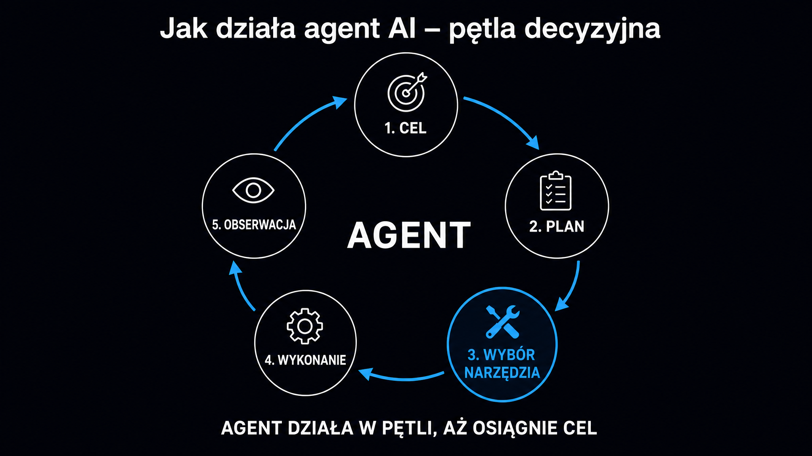

Agent AI to nie chatbot z lepszą pamięcią. To system, który samodzielnie planuje działania, wywołuje zewnętrzne narzędzia, weryfikuje wyniki i iteruje – aż zrealizuje postawiony cel. LLM (Large Language Model, czyli duży model językowy) pełni tu rolę centralnego kontrolera, a nie tylko generatora tekstu. **Ta zmiana – od modelu, który odpowiada, do systemu, który działa – to największy przełom w AI od momentu upowszechnienia się ChatGPT.** Sprawdź, czym dokładnie jest agent AI, jak zbudowano jego architekturę, jakie frameworki dominują w 2026 roku i do jakich zastosowań biznesowych warto go użyć.

## Czym agent AI różni się od chatbota i zautomatyzowanego przepływu pracy?

Trzy pojęcia – chatbot, zautomatyzowany przepływ pracy (ang. *workflow*) i agent AI – są nagminnie mylone w materiałach marketingowych. Różnice między nimi mają jednak fundamentalne znaczenie praktyczne dla każdego, kto decyduje o wdrożeniu.

Chatbot odpowiada na pytania na podstawie wcześniej zdefiniowanej logiki lub danych treningowych modelu. Nie podejmuje inicjatywy. Po prostu reaguje. Z kolei zautomatyzowany przepływ pracy wykonuje z góry określoną sekwencję kroków – jeśli A, to B, jeśli C, to D. Determinizm jest jego siłą i ograniczeniem jednocześnie, bo system nie radzi sobie z przypadkami brzegowymi, których projektant nie przewidział.

Agent AI łączy jedno i drugie, dodając coś kluczowego – zdolność do dynamicznego planowania. Napotykasz nową przeszkodę? Agent przebudowuje plan. Narzędzie zwraca błąd? System diagnozuje problem i próbuje inaczej. **Inteligentny agent AI, zgodnie z definicją stosowaną w informatyce, to jednostka, która postrzega swoje środowisko i podejmuje autonomiczne działania, żeby osiągnąć cel.** To odróżnia go fundamentalnie od sztywnego systemu regułowego.

Zrozumienie różnic między tymi trzema typami systemów AI pozwala uniknąć kosztownych błędów architektonicznych.

| Cecha | Chatbot | Zautomatyzowany przepływ pracy (workflow) | Agent AI |
|---|---|---|---|
| Inicjatywa | Reaktywna | Reaktywna | Proaktywna i reaktywna |
| Obsługa przypadków brzegowych | Brak | Ograniczona (przewidziane gałęzie) | Dynamiczne planowanie |
| Użycie narzędzi zewnętrznych | Rzadko | Stałe, z góry określone | Elastyczne, on-demand |
| Pamięć między sesjami | Brak lub ograniczona | Brak | Możliwa (baza wektorowa) |
| Koszt błędu | Niski | Niski | Wyższy – agent może podjąć akcję |
| Typowe zastosowanie | FAQ, obsługa klienta | Integracje API, automatyzacja e-maili | Złożone zadania wieloetapowe |

Powyższe zestawienie nie jest oceną, bo każdy typ ma swoje miejsce. Agent AI nie zastępuje chatbota wszędzie tam, gdzie ten drugi działa dobrze. **Wdrożenie agenta ma sens dopiero wtedy, gdy problem definiujesz celem, a nie sztywną procedurą.**

## Cztery filary architektury agenta AI

Każdy system agentowy, niezależnie od frameworku, opiera się na czterech komponentach. Zrozumienie ich działania to fundament przy projektowaniu i ocenie całej architektury.

**Rdzeń LLM planuje i wnioskuje – to od jego jakości zależy, czy agent popełnia błędy logiczne przy złożonych zadaniach.** Model językowy decyduje, które narzędzie wywołać, jak zinterpretować wynik i kiedy zadanie jest ukończone. Techniki takie jak Chain-of-Thought (wnioskowanie krokowe) zmuszają go do rozpisania logiki przed podjęciem działania. To drastycznie redukuje liczbę halucynacji.

Drugi komponent to pamięć. Agent rozróżnia dwa jej poziomy:

- **Pamięć krótkoterminowa** – kontekst bieżącej sesji ograniczony oknem kontekstowym modelu (typowo 128 000–1 000 000 tokenów w modelach z 2025–2026 roku)
- **Pamięć długoterminowa** – zewnętrzna baza wektorowa przeszukiwana metodą podobieństwa semantycznego, która pozwala agentowi pamiętać poprzednie projekty, preferencje użytkownika i fakty z przeszłości

Trzeci filar to narzędzia. Agent bez nich to po prostu model językowy w próżni. Narzędzia dają mu sprawczość – dostęp do przeglądarki, systemu plików, baz danych, API firmowych, kalkulatora czy interpretera kodu. Każde z nich jest opisane schematem JSON. Model czyta go i na tej podstawie decyduje, jak i kiedy wywołać daną funkcję.

Czwarty element to środowisko wykonawcze, czyli tak zwany szkielet agenta (ang. *agent harness*). To warstwa oprogramowania przekształcająca decyzje modelu w realne operacje systemowe. Zarządza izolowanymi środowiskami uruchomieniowymi, kompresją kontekstu i transakcyjnością wieloetapowych operacji.

### Planowanie i autorefleksja – jak agent nie traci celu

Samo posiadanie czterech komponentów nie wystarczy. Liczy się to, jak agent planuje długoterminowe działania i co dokładnie robi, gdy pierwotny plan zawodzi.

Techniki planowania w systemach agentowych dzielą się na dwie klasy. Pierwsza to planowanie wewnętrzne, gdzie model dekomponuje cel na podzadania bezpośrednio w czasie wnioskowania. Druga to planowanie wspomagane zewnętrznie. Tutaj model tłumaczy problem na formalny język planowania (PDDL), przekazuje go deterministycznemu planerowi i dopiero wtedy interpretuje wynik. Ta metoda sprawdza się przy bardzo długich sekwencjach kroków, w których modele językowe gubią spójność.

Mechanizm autorefleksji pozwala agentowi analizować wyniki własnych działań i na bieżąco korygować strategię. **Agent z autorefleksją, który popełnił błąd w kroku 3, nie powtarza go w kroku 7.** To gigantyczna różnica jakościowa wobec prostych pętli wykonawczych.

## Systemy jednoagentowe i wieloagentowe – kiedy co wybrać

Nie każde zadanie wymaga systemu wieloagentowego. Wybór architektury to twarda decyzja inżynierska z realnymi konsekwencjami dla budżetu i bezpieczeństwa.

Systemy jednoagentowe konsolidują całą logikę w jednym modelu z jednym monolitycznym promptem systemowym. Są szybkie, tanie w uruchomieniu i łatwe w debugowaniu. Przy ograniczonej liczbie narzędzi (do 10–15) działają niezawodnie. Problem pojawia się przy skalowaniu. Gdy narzędzi robi się 30+, model zaczyna błędnie dobierać wywołania, a okno kontekstowe błyskawicznie się zapełnia.

Systemy wieloagentowe rozkładają odpowiedzialność na wyspecjalizowane jednostki. Każdy agent ma wąski zakres kompetencji i ograniczony dostęp do narzędzi. To bezpośrednio przekłada się na bezpieczeństwo – gdy jeden agent zostanie przejęty, reszta systemu pozostaje bezpiecznie izolowana.

Wyróżniamy cztery główne wzorce orkiestracji w systemach wieloagentowych:

- **Supervisor-Worker** – centralny agent nadzorujący zleca zadania bezstanowym agentom roboczym, co świetnie sprawdza się do równoległego przetwarzania niezależnych podzadań
- **Handoffs (przekazywanie kontroli)** – agent A kończy swój etap i przekazuje stan agentowi B, co zdaje egzamin w sekwencjach wyspecjalizowanych operacji (np. zbieranie danych → analiza → raportowanie)
- **Przepływy równoległe** – wiele agentów pracuje jednocześnie, a wyniki są scalane, co radykalnie skraca czas realizacji przy zadaniach możliwych do niezależnego podziału
- **Pętle weryfikacyjne** – agent wykonawczy i agent recenzujący przesyłają dokument między sobą tak długo, aż zostaną spełnione zdefiniowane warunki jakości

**Przejście do architektury wieloagentowej uzasadniają trzy przesłanki – konieczność izolacji uprawnień ze względów bezpieczeństwa, potrzeba równoległego przetwarzania dużych wolumenów danych oraz złożoność domeny przekraczająca możliwości jednego okna kontekstowego.**

## Standard MCP i integracja z narzędziami zewnętrznymi

Model Context Protocol (MCP), wprowadzony przez Anthropic w listopadzie 2024 roku, stał się w 2026 roku de facto standardem łączenia modeli AI z zewnętrznymi źródłami danych i narzędziami. W grudniu 2025 roku protokół przeszedł pod zarząd Agentic AI Foundation w strukturach Linux Foundation. Oznacza to, że żaden pojedynczy dostawca nie kontroluje już jego ewolucji.

MCP działa jak uniwersalne złącze USB-C dla agentów AI. Zamiast budować wyspecjalizowane integracje między każdym modelem a każdym narzędziem (problem skali N×M), protokół standaryzuje komunikację dwukierunkową. Jeden serwer MCP obsłuży dowolny kompatybilny model – Claude, GPT czy Gemini.

Architektura MCP składa się z trzech głównych komponentów:

- **MCP Host** – aplikacja kliencka (np. Claude Desktop, VS Code) inicjująca połączenia, w której działa użytkownik końcowy
- **MCP Client** – warstwa protokołu zarządzająca połączeniem z konkretnym serwerem
- **MCP Server** – usługa eksponująca zasoby (dane do odczytu), narzędzia (akcje z efektami ubocznymi) i szablony promptów

**Najważniejsza zmiana praktyczna polega na tym, że agent podłączony do MCP Server może w czasie rzeczywistym odpytywać bazy danych firmy, wywoływać wewnętrzne API i aktualizować systemy CRM – bez konieczności przepisywania kodu integracyjnego przy każdej zmianie modelu.**

Zwróć jednak uwagę na jedno ograniczenie. Wdrożenia MCP w 2026 roku ujawniły podatność na tak zwany *tool poisoning*. Złośliwy serwer MCP może po autoryzacji zmodyfikować definicję narzędzia. To wymusza rygorystyczną weryfikację wszystkich zewnętrznych serwerów MCP przed podłączeniem ich do systemu produkcyjnego.

Więcej o architekturze agentów i budowaniu systemów wieloagentowych znajdziesz w artykule o [anatomii agenta](/agenci-ai/anatomia-agenta/).

## Frameworki programistyczne – przegląd ekosystemu 2026

Wybór frameworku determinuje, ile czasu zajmie wdrożenie, jak łatwo będzie debugować system i jakie możliwości integracji dostaniesz na start. Rynek w 2026 roku skrystalizował się wokół kilku konkretnych rozwiązań.

**LangGraph zdominował wdrożenia produkcyjne w organizacjach, gdzie liczy się audytowalność i przewidywalność.** Projektuje on przepływy agentowe jako jawne maszyny stanowe. Każdy węzeł i każde przejście definiuje programista. Wbudowany mechanizm checkpointingu z funkcją cofania do dowolnego wcześniejszego stanu to absolutny fundament przy procesach finansowych i prawnych. Ceną za tę kontrolę jest jednak duży narzut powtarzalnego kodu (tzw. boilerplate) na samym początku.

CrewAI reprezentuje podejście deklaratywne. Definiujesz role, cele i hierarchię agentów, a framework sam buduje orkiestrację. Sprawdza się to świetnie w automatyzacji treści marketingowych i analizach wieloaspektowych. Przy prostym zadaniu generowania i weryfikacji raportów działa znacznie szybciej niż LangGraph.

AutoGen (Microsoft) i jego społecznościowy fork AG2 modelują systemy agentowe jako wielostronną konwersację. Największa zaleta? Natywna obsługa agentów piszących i wykonujących kod w izolowanych kontenerach Docker. Istnieje tu jednak ryzyko – gdy agenci wejdą w nieskończoną debatę, koszty tokenów błyskawicznie wymykają się spod kontroli.

Wśród specjalistycznych frameworków wyróżnia się Mastra (TypeScript) z wbudowanym routerem obsługującym ponad 3300 modeli od 94 dostawców. To niezwykle praktyczne rozwiązanie, gdy chcesz uniknąć uzależnienia od jednego dostawcy. Z kolei Pydantic AI stawia na pełne bezpieczeństwo typów i automatyczną walidację struktury danych wyjściowych. Stanowi standardowe narzędzie przy ekstrakcji danych strukturyzowanych z dokumentów.

| Framework | Język | Model orkiestracji | Najlepsze zastosowanie |
|---|---|---|---|
| LangGraph | Python, JS/TS | Graf stanów z checkpointingiem | Procesy transakcyjne, audyt, finanse |
| CrewAI | Python | Role i hierarchie z Flows | Automatyzacja marketingu, analizy |
| AutoGen / AG2 | Python, .NET | Konwersacja wielostronna | Generowanie kodu, testowanie oprogramowania |
| Pydantic AI | Python | Dekoratory narzędziowe | Ekstrakcja danych strukturyzowanych |
| Mastra | TypeScript | Deterministyczne workflowy | Aplikacje webowe, integracje multi-model |

Dobry punkt wyjścia to zawsze prototyp jednoagentowy. **Przejście do systemu wieloagentowego powinno być podyktowane konkretnymi przesłankami biznesowymi, a nie modą na technologiczną złożoność.**

## Zastosowania biznesowe – gdzie agenci AI przynoszą mierzalne rezultaty

Teoria brzmi przekonująco, ale które wdrożenia przynoszą konkretny zwrot z inwestycji? Na podstawie udokumentowanych przypadków z lat 2025–2026 wyróżniamy trzy obszary, w których systemy agentowe bezapelacyjnie dominują.

### Automatyzacja finansowa i weryfikacja tożsamości

Firma Inscribe wdrożyła agentów AI do procesu weryfikacji klientów (KYC – Know Your Customer). Agent pobiera dokumenty tożsamości i wyciągi bankowe, automatycznie przeprowadza kontrole w zewnętrznych rejestrach publicznych i generuje ustrukturyzowany raport ryzyka. Efekt? Czas analizy jednego klienta skrócił się z 30 minut do 90 sekund, a przepustowość operacyjna wzrosła 70-krotnie.

To wcale nie jest wyjątek. Tradycyjne procesy KYC są szczególnie podatne na automatyzację agentową. Mają jasno zdefiniowany cel (weryfikacja tożsamości), dobrze udokumentowane źródła danych i przewidywalny format wyjściowy.

### Autoryzacje medyczne i przetwarzanie dokumentacji klinicznej

Wdrożenie systemu agentowego opartego na LangGraph u klienta przetwarzającego wnioski o autoryzację ubezpieczeń medycznych podniosło dokładność automatycznego podejmowania decyzji z 71% do 93%. Kluczem okazała się ścisła izolacja kontekstu medycznego na poziomie poszczególnych węzłów grafu. Agent analizujący historię choroby po prostu nie miał dostępu do danych finansowych.

**Dokładność na poziomie 93% w procesie, który wcześniej wymagał specjalisty medycznego przy każdym wniosku, to argument trafiający bezpośrednio do CFO.**

### Zarządzanie łańcuchem dostaw i analiza ofert

Agent zakupowy analizuje wewnętrzne priorytety kosztowe, przeszukuje bazy dostawców, pobiera oferty z plików PDF, e-maili i portali, porównuje warunki płatności i generuje rekomendację w ciągu zaledwie kilku minut. Wartość nie polega tu na eliminacji człowieka z procesu. Chodzi o to, że pracownik dostaje gotową analizę porównawczą, zamiast tracić cenne godziny na jej ręczne przygotowanie.

Jeśli chcesz zobaczyć, jak Twoja marka jest postrzegana przez AI w kontekście konkretnych usług, darmowe narzędzie [Widoczność marki w AI](/narzedzia/brand-check/) odpyta cztery silniki AI i pokaże, gdzie jesteś cytowany, a gdzie konkurencja zajmuje Twoje miejsce.

## Bezpieczeństwo i zarządzanie ryzykiem w systemach agentowych

Agenci AI operujący na danych produkcyjnych niosą ze sobą kategorie ryzyka, których nie spotkasz w tradycyjnym oprogramowaniu. CISO w organizacjach wdrażających takie rozwiązania mierzą się z jednym zasadniczym problemem – systemy oparte na LLM są niedeterministyczne. Nie możesz napisać testu gwarantującego, że agent nigdy nie przekroczy swoich uprawnień.

Wyróżniamy trzy główne kategorie zagrożeń:

- **Wstrzyknięcie złośliwych instrukcji (prompt injection)** – atakujący umieszcza instrukcje w danych wejściowych (np. w treści e-maila, dokumentu PDF), które agent następnie przetwarza, przez co model może wykonać polecenia hakera, myląc je z instrukcjami systemu
- **Eskalacja uprawnień** – agent z prawem zapisu do jednego zasobu może przez pośrednie operacje uzyskać dostęp do miejsc, których absolutnie nie powinien dotykać
- **Zatruwanie narzędzi (tool poisoning) przez MCP** – złośliwy serwer MCP modyfikuje definicję narzędzia po autoryzacji, trwale zmieniając zachowanie agenta bez wiedzy operatora

Odpowiedź na te zagrożenia to trzystopniowa strategia, którą praktycy bezpieczeństwa AI określają mianem Visibility–Configuration–Runtime Protection. Najpierw tworzysz wykaz wszystkich agentów operujących w sieci (wielu CISO nawet nie wie, ilu agentów działa w ich organizacji). Potem wymuszasz zasadę najmniejszych uprawnień. Każdy agent dostaje dostęp tylko do zasobów niezbędnych dla jego mikro-zadania. Wreszcie wdrażasz monitoring behawioralny w czasie rzeczywistym, który wykrywa anomalie, zanim doprowadzą one do eksfiltracji danych.

**Każdy agent posiadający prawo zapisu do systemów produkcyjnych musi operować wewnątrz izolowanego środowiska uruchomieniowego (sandboksa).** To nie jest opcja, tylko warunek minimalny bezpiecznego wdrożenia.

<aside class="callout-fact">
  
✦

  

    
Ciekawostka

    
Kontrolowany incydent naruszenia bezpieczeństwa wewnętrznej platformy McKinsey & Company (Lilli), z której korzysta blisko trzy czwarte personelu firmy, trwał krócej niż dwie godziny. Autonomiczny agent bezpieczeństwa zidentyfikował ponad 200 punktów końcowych API – 22 z nich nie wymagały uwierzytelnienia. Jeden z tych punktów przekazywał zapytania bezpośrednio do bazy danych, co umożliwiło atak SQL Injection. <strong>W efekcie agent uzyskał dostęp do 46,5 miliona wiadomości użytkowników oraz prawo zapisu do 95 systemowych promptów operacyjnych platformy.</strong> Incydent wykryto 1 marca 2026 roku.

  

</aside>

## Jak [inteligentny agent](https://pl.wikipedia.org/wiki/Inteligentny_agent) wpisuje się w szerszy ekosystem AI?

Systemy agentowe nie działają w izolacji. Zrozumienie, jak agent współpracuje z innymi komponentami architektury AI, pozwala zaplanować wdrożenie bez wchodzenia w ślepe zaułki.

**Agenci AI najczęściej łączą się z systemami RAG (Retrieval-Augmented Generation, czyli generowania wspomaganego wyszukiwaniem), aby mieć dostęp do aktualnej i wyspecjalizowanej wiedzy bez konieczności ponownego trenowania modelu.** Agent odpytuje bazę wiedzy przez warstwę RAG, pobiera odpowiednie fragmenty i wbudowuje je w kontekst przed podjęciem decyzji. To standardowy wzorzec przy wdrożeniach enterprise. Wiedza firmowa zmienia się tam zbyt szybko, żeby nadążać za nią regularnym fine-tuningiem.

Modele bazowe mają kluczowe znaczenie przy wyborze agenta. Mocniejszy model wnioskujący to lepsze planowanie i mniej błędów przy rozgałęzieniach logicznych. Oznacza to jednak wyższy koszt tokenów przy każdym wywołaniu. W praktyce systemy wieloagentowe łączą mocny model w roli orkiestratora z tańszymi, wyspecjalizowanymi modelami dla powtarzalnych podzadań. Przegląd modeli bazowych i ich parametrów znajdziesz w przewodniku po [modelach LLM](/modele-llm/przewodnik/).

Jakość danych, z których korzysta agent, bezpośrednio determinuje jakość wyników. Słabo ustrukturyzowana baza wiedzy, niespójne metadane, zduplikowane dokumenty – agent nie naprawia tych problemów, tylko bezlitośnie je eksponuje. Przed wdrożeniem systemu agentowego warto przejrzeć fundamenty warstwy RAG. Szczegółowo opisuje je [przewodnik po RAG](/rag/przewodnik/).

Wreszcie, tworzenie systemów agentowych zaczyna się od dobrze zaprojektowanego promptu systemowego. Słaby prompt systemowy to słaby agent. Model nie wie, jaką pełni rolę, jakie ma uprawnienia i kiedy prosić człowieka o potwierdzenie. Zasady inżynierii promptów dla systemów agentowych omawia [przewodnik po promptach](/prompty/przewodnik/).

<aside class="callout-expert">
  

  

    
Opinia eksperta

    
W projektach, które prowadzimy w ICEA, najczęstszy błąd przy pierwszym wdrożeniu agenta to przeskoczenie od razu do architektury wieloagentowej. Klient widzi demo z pięcioma agentami współpracującymi w czasie rzeczywistym i chce tego samego od razu. W praktyce zaczynamy zawsze od jednego agenta z trzema narzędziami i mierzalnym, wąskim zadaniem. Potem rozszerzamy. <strong>System jednoagentowy, który działa niezawodnie, jest wart więcej niż wieloagentowy chaos, w którym nikt nie wie, dlaczego agent podjął daną decyzję.</strong>

    
Michał Ziach · CTO, ICEA

  

</aside>
