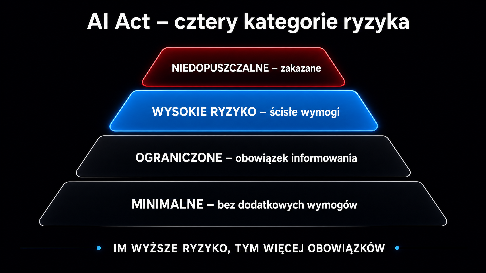

Zanim wdrożysz chatbota w swojej firmie, system rekrutacyjny oparty na algorytmie lub narzędzie do analizy klientów, musisz pamiętać, że podlegasz dwóm równoległym regulacjom: RODO (ang. GDPR – General Data Protection Regulation, czyli ogólne rozporządzenie o ochronie danych) i AI Act (unijne rozporządzenie w sprawie sztucznej inteligencji). Nie są to alternatywy – nakładają się i uzupełniają. Każda z nich odpowiada na inne pytanie: RODO reguluje, co robisz z danymi osobowymi, a AI Act ocenia ryzyko samego systemu AI. Pominięcie którejkolwiek to nie tylko ryzyko kary, ale też utrata kontroli nad tym, co Twoje narzędzia faktycznie robią z informacjami o ludziach.

## Dwie regulacje, jeden obowiązek

Większość firm wdrażających AI w Polsce popełnia ten sam błąd: traktuje RODO jako „stary temat" zamknięty lata temu, a AI Act jako przyszłościową regulację, która „jeszcze nie obowiązuje w całości". To prawda – AI Act wchodzi etapami (zakazy od lutego 2025 r., wymogi dla systemów wysokiego ryzyka z Annexu III pierwotnie od sierpnia 2026 r., przesunięte do 2 grudnia 2027 r. na mocy porozumienia Digital Omnibus z maja 2026 r., docelowo pełna struktura nadzoru). Ale oba reżimy obowiązują jednocześnie i art. 2 ust. 7 AI Act wprost potwierdza, że nowe przepisy nie zastępują RODO ani go nie ograniczają.

**Organizacja wdrażająca AI musi realizować obowiązki wynikające z obu rozporządzeń jednocześnie.** Ich wspólnym mianownikiem jest zasada ochrony danych już w fazie projektowania (Data Protection by Design and by Default), zapisana w art. 25 RODO. W praktyce oznacza to, że zanim uruchomisz system, musisz zadać sobie dwa pytania: jakie ryzyko dla danych stwarza to narzędzie (RODO) i w jakiej kategorii ryzyka AI mieści się jego zastosowanie (AI Act).

Według raportu UODO z 29 stycznia 2026 roku, aż 95,9% organizacji ocenia się jako nieprzygotowane lub niepewne w zakresie stosowania RODO w kontekście AI, a 58,5% uważa, że wykorzystywanie AI nie wiąże się z danymi osobowymi. To oznacza, że większość firm stoi właśnie przed tym przełomem – i warto go zrobić z głową.

## Kategorie ryzyka w AI Act – od czego zacząć

AI Act klasyfikuje systemy AI według czterostopniowej skali ryzyka. To ona wyznacza poziom obowiązków compliance. Poniższa tabela porządkuje kategorie, obowiązki i przykłady zastosowań biznesowych:

| Kategoria ryzyka | Przykłady zastosowań | Główne obowiązki |
|---|---|---|
| Zakazane praktyki | Systemy rozpoznawania emocji w miejscu pracy (nieterapeut.), socjalny scoring obywateli, manipulacja podprogowa | Całkowity zakaz od lutego 2025 r. – brak wyjątków |
| Wysokie ryzyko (Annex III) | Rekrutacja, ocena pracowników, scoring kredytowy, systemy edukacyjne, biometria | FRIA + DPIA, nadzór ludzki, logi operacyjne, rejestracja w bazie UE |
| Ograniczone ryzyko | Chatboty obsługi klienta, generatory treści syntetycznych, systemy rozpoznawania emocji (z wyłączeniami) | Obowiązek informacyjny – użytkownik musi wiedzieć, że rozmawia z AI |
| Minimalne ryzyko | Filtry spamu, rekomendacje filmów, narzędzia do korekty tekstu | Brak szczegółowych wymogów; kodeksy postępowania dobrowolne |

**Większość firm B2B i e-commerce, które wdrażają gotowe narzędzia AI od zewnętrznych dostawców, będzie klasyfikowana jako wdrożyciele (ang. deployers) na gruncie AI Act i jako administratorzy danych na gruncie RODO.** To kluczowe rozróżnienie – bo odpowiedzialność za zgodność operacyjną, legalność przetwarzania i realizację praw użytkowników spoczywa wtedy na Twojej organizacji, nie na dostawcy technologii.

Jeśli chcesz zrozumieć, jak konkretne modele językowe różnią się pod kątem możliwości i ograniczeń – [przewodnik po modelach LLM](/modele-llm/przewodnik/) tłumaczy architekturę od podstaw.

## Role prawne: kto jest kim w RODO i AI Act

Nakładanie się ról to jedno z największych źródeł chaosu w compliance AI. RODO operuje pojęciami administratora danych (decyduje o celach przetwarzania) i podmiotu przetwarzającego (procesora). AI Act wprowadza własny podział na dostawcę (ang. provider – kto stworzył lub wprowadził system na rynek) i wdrożyciela (ang. deployer – kto go używa w działalności).

Role nie nakładają się automatycznie. Firma kupująca licencję na narzędzie AI od zewnętrznego dostawcy jest typowo wdrożycielem w AI Act i administratorem danych w RODO. Firma budująca własny model i udostępniająca go innym jest dostawcą AI i może być jednocześnie administratorem lub procesorem zależnie od kontekstu.

Trzy rzeczy, które musi zrobić każda firma w roli administratora-wdrożyciela:

- **Rejestr Czynności Przetwarzania (art. 30 RODO)** – obowiązkowy niezależnie od wielkości firmy, gdy AI obsługuje dane osobowe w sposób ciągły. Zwolnienie dla firm poniżej 250 osób nie działa, jeśli przetwarzanie nie ma charakteru sporadycznego. Automatyczne analizy klientów, stały monitoring zapytań, regularne rekomendacje – wszystkie te procesy wykluczają incydentalność.
- **Umowa powierzenia przetwarzania (DPA)** – gdy korzystasz z zewnętrznego narzędzia AI (ChatGPT Enterprise, Claude API, Gemini Workspace), musisz mieć podpisaną DPA z dostawcą, która spełnia wymogi RODO. Darmowe lub konsumenckie wersje tych narzędzi standardowo jej nie zawierają.
- **Podstawa prawna przetwarzania** – AI nie tworzy nowej podstawy prawnej. Każde przetwarzanie danych osobowych przez system AI musi opierać się na konkretnej podstawie z art. 6 RODO: zgoda, umowa, prawnie uzasadniony interes lub inny wymieniony przepis.

Zanim wybierzesz narzędzie, sprawdź [przewodnik po wdrożeniu AI w firmie](/ai-w-biznesie/przewodnik/), który mapuje kroki od wyboru rozwiązania do uruchomienia.

## Shadow AI – cichy koszmar compliance

Jednym z największych zagrożeń nie jest kwestia, które narzędzie AI wybierzesz, ale to, czego nie kontrolujesz. Shadow AI to zjawisko nieautoryzowanego korzystania przez pracowników z darmowych, publicznych modeli sztucznej inteligencji w celach służbowych. Głośne incydenty wycieków kodu źródłowego i notatek biznesowych (Samsung, Amazon) dowodzą, że brak technicznej kontroli nad tym, co trafia do promptów, generuje krytyczne ryzyko.

**Problem nie leży w technologii – problem polega na tym, że 95% użytkowników darmowego ChatGPT nigdy nie wyłącza domyślnego trenowania modelu na ich danych.**

Polityka prywatności różni się diametralnie między wersjami konsumenckimi a biznesowymi. OpenAI ChatGPT w wersji darmowej domyślnie używa danych do trenowania; wersja Enterprise – nie. Claude (Anthropic) w wersji konsumenckiej zapisuje dane na serwerach dostawcy bez pełnej DPA; API z opcją `zero data retention` to eliminuje. DeepSeek w wersji chmurowej przechowuje dane na serwerach w Chinach – co stanowi naruszenie zasad transferu danych poza Europejski Obszar Gospodarczy (EOG) i jest bezpośrednio niezgodne z RODO.

Minimum, jakie powinna wdrożyć każda firma:

- **Techniczna blokada darmowych modeli AI** na poziomie sieci firmowej (systemy klasy CASB) z jednoczesnym udostępnieniem pracownikom autoryzowanych planów Enterprise z podpisaną DPA.
- **Systemy DLP (Data Loss Prevention)** – rozszerzenia lub programy typu agent na urządzeniach końcowych, które skanują prompty i blokują wysyłanie wrażliwych danych do formularzy AI.
- **Logi operacyjne** – art. 12 i 19 AI Act dla systemów wysokiego ryzyka wymagają automatycznego przechowywania logów przez co najmniej 6 miesięcy.

<aside class="callout-fact">
  
✦

  

    
Dane regulacyjne

    
Od lutego 2025 roku obowiązuje art. 4 AI Act nakładający na pracodawców obowiązek dbania o <strong>kompetencje personelu w zakresie AI (ang. AI literacy)</strong>. Nie jest to zalecenie – to formalny wymóg prawny. Pracownik operujący narzędziami AI musi posiadać wiedzę pozwalającą na ich bezpieczne, etyczne i zgodne z prawem użycie. Brak dokumentacji szkoleń to konkretne ryzyko w przypadku kontroli.

  

</aside>

## Ocena ryzyka: DPIA i FRIA – dwie analizy, jeden projekt

Dla systemów wysokiego ryzyka (kategoria Annex III AI Act) obowiązują dwie równoległe oceny ryzyka. Wiele firm próbuje je traktować oddzielnie i wykonuje dwa razy tę samą pracę. To błąd. Art. 27 ust. 4 AI Act wprost dopuszcza integrację obu procesów.

**DPIA** (Data Protection Impact Assessment, ocena skutków dla ochrony danych) to wymóg z art. 35 RODO. Skupia się wyłącznie na danych osobowych i prawach do prywatności. Obowiązuje każdego administratora, gdy przetwarzanie przy użyciu nowych technologii niesie za sobą wysokie ryzyko dla praw i wolności osób fizycznych – np. profilowanie klientów na dużą skalę.

**FRIA** (Fundamental Rights Impact Assessment, ocena skutków dla praw podstawowych) to wymóg z art. 27 AI Act. Obejmuje szerszy zakres: wszystkie prawa podstawowe (godność, równość, zakaz dyskryminacji), nie tylko prywatność. Dotyczy wdrożycieli będących organami publicznymi, podmiotami świadczącymi usługi publiczne lub instytucjami finansowymi.

Praktyczne podejście: użyj dojrzałego szablonu DPIA jako bazy i rozbuduj go o moduły FRIA badające wpływ społeczny algorytmu. Jedna procedura, podwójne pokrycie. Kluczowa różnica w metodologii FRIA – zakaz bilansowania ryzyka. Negatywnego wpływu na jedno prawo podstawowe (np. ryzyka dyskryminacji w algorytmie rekrutacyjnym) nie wolno rekompensować pozytywnymi efektami w innym obszarze (np. poprawą efektywności).

Artykuł [o tym, od czego zacząć wdrożenie AI](/ai-w-biznesie/od-czego-zaczac/) opisuje, jak przeprowadzić inwentaryzację systemów AI w firmie przed przystąpieniem do oceny ryzyka.

## Transparentność i obowiązki informacyjne

[Ogólne rozporządzenie o ochronie danych](https://pl.wikipedia.org/wiki/Og%C3%B3lne_rozporz%C4%85dzenie_o_ochronie_danych) od początku nakłada obowiązek przejrzystości wobec osób, których dane są przetwarzane. AI Act rozbudowuje ten obowiązek o specyficzne wymogi dla konkretnych klas systemów.

Najważniejsze reguły z art. 50 AI Act:

- **Chatboty i systemy bezpośredniej interakcji** – użytkownik musi wiedzieć, że rozmawia z AI. Obowiązek odpada tylko wtedy, gdy jest to oczywiste z kontekstu (np. głosowy asystent w aplikacji jednoznacznie oznaczonej jako AI).
- **Systemy generujące deepfake'i** (syntetyczne obrazy, audio, wideo) – pliki wyjściowe muszą być oznakowane w formacie czytelnym maszynowo, w sposób pozwalający na ich wykrycie jako sztucznie wygenerowanych; wyjątek stanowi twórczość artystyczna i satyra.
- **Systemy rozpoznawania emocji i kategoryzacji biometrycznej** – bezwzględny obowiązek informowania osób o ich działaniu, przetwarzanie zgodne z RODO.

Obowiązek informacyjny musi być realizowany najpóźniej w momencie pierwszej interakcji użytkownika z systemem. Klauzula na dole regulaminu nie wystarczy.

Warto też spojrzeć na zagadnienie przez pryzmat ROI – artykuł [o zwrocie z inwestycji w AI](/ai-w-biznesie/roi-z-ai/) pokazuje, jak compliance wpływa na koszty i harmonogram wdrożenia.

## Polski horyzont regulacyjny – KRiBSI i co to znaczy w praktyce

Polska aktywnie dostosowuje krajowy porządek prawny do AI Act. Rada Ministrów przyjęła projekt ustawy o systemach sztucznej inteligencji, którego głównym celem jest powołanie infrastruktury nadzorczej: **Komisji Rozwoju i Bezpieczeństwa Sztucznej Inteligencji (KRiBSI)**.

KRiBSI będzie niezależnym organem administracji państwowej obsługiwanym przez Ministerstwo Cyfryzacji. Jej przewodniczący jest powoływany przez Sejm za zgodą Senatu na 5-letnią kadencję. W skład Komisji wejdą przedstawiciele UOKiK, UKE, KNF i KRRiT. Do jej zadań należeć będzie prowadzenie postępowań, wydawanie decyzji o wycofaniu niezgodnych systemów z rynku i nakładanie kar.

Jedna kwestia ma tu kluczowe znaczenie. **Brak powołania KRiBSI nie zwalnia firm z przestrzegania bezpośrednio stosowanych przepisów AI Act.** Kary za stosowanie zakazanych praktyk obowiązują od lutego 2025 roku. Wymogi dla systemów ogólnego przeznaczenia (ang. GPAI – General Purpose AI) – od sierpnia 2025 roku. Polska ustawa nie przesuwa tych dat.

Projekt ustawy przewiduje odpłatne opinie indywidualne (opinie zgodności) wydawane przez KRiBSI (150 zł od odrębnego stanu faktycznego). Dla firm MŚP z wieloma procesami AI to niebagatelny koszt operacyjny, który warto wkalkulować w budżet compliance już teraz.

<aside class="callout-expert">
  

  

    
Opinia eksperta

    
W projektach wdrożeniowych, które obserwuję w ICEA, największy błąd to odkładanie compliance na fazę po uruchomieniu. Firmy wdrażają narzędzie, a potem próbują dopasować dokumentację. To droga przez mękę – znacznie trudniej przepisać politykę bezpieczeństwa pod gotowy system niż zaprojektować ją razem z nim. <strong>Godzina z prawnikiem przed wdrożeniem jest tańsza niż trzy miesiące prostowania błędów po audycie UODO.</strong> Zacznij od klasyfikacji systemu AI według kategorii ryzyka, określ swoje role prawne i dopiero wtedy wybierz narzędzie.

    
Mateusz Wiśniewski · Ekspert SEO/AI Search, ICEA

  

</aside>
