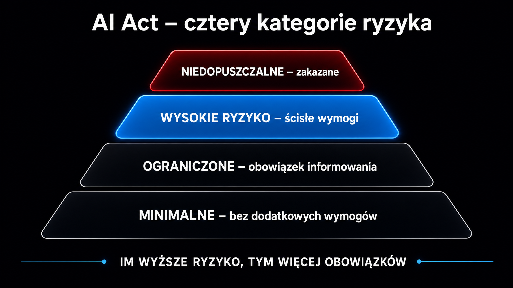

Zanim wdrożysz w firmie chatbota, algorytmiczny system rekrutacyjny czy narzędzie do analizy klientów, pamiętaj o dwóch równoległych regulacjach. Podlegasz pod RODO (ang. GDPR – General Data Protection Regulation, czyli ogólne rozporządzenie o ochronie danych) oraz AI Act (unijne rozporządzenie w sprawie sztucznej inteligencji). To nie są alternatywy. Nakładają się i uzupełniają. RODO reguluje, co robisz z danymi osobowymi. Z kolei AI Act ocenia ryzyko samego systemu AI. **Pominięcie którejkolwiek z tych ustaw to nie tylko ryzyko kary, ale też utrata kontroli nad tym, co Twoje narzędzia faktycznie robią z informacjami o ludziach.**

## Dwie regulacje, jeden obowiązek

Większość firm wdrażających AI w Polsce popełnia ten sam błąd. Traktują RODO jako „stary temat" zamknięty lata temu, a AI Act jako przyszłościową regulację, która „jeszcze nie obowiązuje w całości". To prawda – AI Act wchodzi etapami (zakazy od lutego 2025 r., kary od sierpnia 2025 r., wymogi dla systemów wysokiego ryzyka z Annexu III pierwotnie od sierpnia 2026 r., przesunięte do 2 grudnia 2027 r. przez pakiet Digital Omnibus, który wszedł w życie 27 lipca 2026 r.). Oba reżimy obowiązują jednak jednocześnie. **Art. 2 ust. 7 AI Act wprost potwierdza, że nowe przepisy nie zastępują RODO ani go nie ograniczają.**

**Organizacja wdrażająca AI musi realizować obowiązki wynikające z obu rozporządzeń jednocześnie.** Ich wspólnym mianownikiem jest zasada ochrony danych już w fazie projektowania (Data Protection by Design and by Default), zapisana w art. 25 RODO. W praktyce oznacza to jedno. Zanim uruchomisz system, musisz zadać sobie dwa pytania. Jakie ryzyko dla danych stwarza to narzędzie (RODO)? W jakiej kategorii ryzyka AI mieści się jego zastosowanie (AI Act)?

Według raportu UODO z 28 stycznia 2026 roku aż 95,9% badanych organizacji (w zdecydowanej większości z sektora publicznego) ocenia się jako niegotowe lub niepewne w zakresie stosowania RODO w kontekście AI. Co gorsza, 58,5% uważa, że wykorzystywanie AI nie wiąże się z danymi osobowymi, albo nie potrafi tego ocenić. Większość firm stoi właśnie przed technologicznym przełomem. Warto przejść przez niego z głową.

## Kategorie ryzyka w AI Act – od czego zacząć

AI Act klasyfikuje systemy AI według czterostopniowej skali ryzyka. To ona wyznacza poziom obowiązków compliance.

| Kategoria ryzyka | Przykłady zastosowań | Główne obowiązki |
|---|---|---|
| Zakazane praktyki | Systemy rozpoznawania emocji w miejscu pracy (nieterapeut.), socjalny scoring obywateli, manipulacja podprogowa | Całkowity zakaz od lutego 2025 r. – brak wyjątków |
| Wysokie ryzyko (Annex III) | Rekrutacja, ocena pracowników, scoring kredytowy, systemy edukacyjne, biometria | Nadzór ludzki, logi przechowywane min. 6 miesięcy, DPIA (gdy wymaga jej RODO); FRIA i rejestracja w bazie UE – tylko dla części wdrożycieli (m.in. organów publicznych) |
| Ograniczone ryzyko | Chatboty obsługi klienta, generatory treści syntetycznych, systemy rozpoznawania emocji (z wyłączeniami) | Obowiązek informacyjny – użytkownik musi wiedzieć, że rozmawia z AI |
| Minimalne ryzyko | Filtry spamu, rekomendacje filmów, narzędzia do korekty tekstu | Brak szczegółowych wymogów; kodeksy postępowania dobrowolne |

**Większość firm B2B i e-commerce, które wdrażają gotowe narzędzia AI od zewnętrznych dostawców, będzie klasyfikowana jako wdrożyciele (ang. deployers) na gruncie AI Act i jako administratorzy danych na gruncie RODO.** To kluczowe rozróżnienie. Odpowiedzialność za zgodność operacyjną, legalność przetwarzania i realizację praw użytkowników spoczywa wtedy na Twojej organizacji. Nie na dostawcy technologii.

Jeśli chcesz zrozumieć, jak konkretne modele językowe różnią się pod kątem możliwości i ograniczeń – [przewodnik po modelach LLM](/modele-llm/przewodnik/) tłumaczy architekturę od podstaw.

## Role prawne: kto jest kim w RODO i AI Act

Nakładanie się ról to jedno z największych źródeł chaosu w compliance AI. RODO operuje pojęciami administratora danych (decyduje o celach przetwarzania) i podmiotu przetwarzającego (procesora). AI Act wprowadza własny podział. Wyróżnia dostawcę (ang. provider – kto stworzył lub wprowadził system na rynek) i wdrożyciela (ang. deployer – kto go używa w działalności).

Role nie pokrywają się automatycznie. Firma kupująca licencję na narzędzie AI od zewnętrznego dostawcy jest typowo wdrożycielem w AI Act i administratorem danych w RODO. Z kolei organizacja budująca własny model i udostępniająca go innym staje się dostawcą AI. Może być jednocześnie administratorem lub procesorem zależnie od kontekstu.

Trzy rzeczy, które musi zrobić każda firma w roli administratora-wdrożyciela:

- **Rejestr Czynności Przetwarzania (art. 30 RODO)** – obowiązkowy niezależnie od wielkości firmy, gdy AI obsługuje dane osobowe w sposób ciągły. Zwolnienie dla firm poniżej 250 osób nie działa, jeśli przetwarzanie nie ma charakteru sporadycznego. Automatyczne analizy klientów, stały monitoring zapytań czy regularne rekomendacje wykluczają incydentalność.
- **Umowa powierzenia przetwarzania (DPA)** – gdy korzystasz z zewnętrznego narzędzia AI (ChatGPT Enterprise, Claude API, Gemini Workspace), musisz mieć podpisaną DPA z dostawcą. Dokument musi spełniać wymogi RODO. Darmowe lub konsumenckie wersje tych narzędzi standardowo go nie zawierają.
- **Podstawa prawna przetwarzania** – AI nie tworzy nowej podstawy prawnej. Każde przetwarzanie danych osobowych przez system AI musi opierać się na konkretnej podstawie z art. 6 RODO. Może to być zgoda, umowa, prawnie uzasadniony interes lub inny wymieniony przepis.

Zanim wybierzesz narzędzie, sprawdź [przewodnik po wdrożeniu AI w firmie](/ai-w-biznesie/przewodnik/), który mapuje kroki od wyboru rozwiązania do uruchomienia.

## Shadow AI – cichy koszmar compliance

Jednym z największych zagrożeń wcale nie jest to, które narzędzie AI wybierzesz. Prawdziwym problemem jest to, czego nie kontrolujesz. Shadow AI to zjawisko nieautoryzowanego korzystania przez pracowników z darmowych, publicznych modeli sztucznej inteligencji w celach służbowych. Głośne incydenty wycieków kodu źródłowego i notatek biznesowych (Samsung, Amazon) dowodzą jednego. **Brak technicznej kontroli nad tym, co trafia do promptów, generuje krytyczne ryzyko.**

**Problem nie leży w technologii – problem polega na tym, że w prywatnym, darmowym koncie to pracownik, a nie firma, decyduje o ustawieniach prywatności, w tym o zgodzie na trenowanie modelu na wklejonych danych.**

Polityka prywatności różni się diametralnie między wersjami konsumenckimi a biznesowymi. OpenAI ChatGPT w wersji darmowej domyślnie używa danych do trenowania. Wersja Enterprise – nie. Claude (Anthropic) w wersji konsumenckiej zapisuje dane na serwerach dostawcy bez pełnej DPA. API z opcją `zero data retention` całkowicie to eliminuje. Z kolei DeepSeek w wersji chmurowej przechowuje dane na serwerach w Chinach. Przekazanie tam danych osobowych to transfer poza Europejski Obszar Gospodarczy (EOG) do państwa bez decyzji stwierdzającej odpowiedni stopień ochrony – bez zabezpieczeń z rozdziału V RODO takie przetwarzanie jest niezgodne z prawem.

Minimum, jakie powinna wdrożyć każda firma:

- **Techniczna blokada darmowych modeli AI** – wdrożenie na poziomie sieci firmowej (systemy klasy CASB) z jednoczesnym udostępnieniem pracownikom autoryzowanych planów Enterprise z podpisaną DPA.
- **Systemy DLP (Data Loss Prevention)** – rozszerzenia lub programy typu agent na urządzeniach końcowych. Skanują prompty i blokują wysyłanie wrażliwych danych do formularzy AI.
- **Logi operacyjne** – system wysokiego ryzyka musi automatycznie rejestrować zdarzenia (art. 12 AI Act), a wdrożyciel ma obowiązek przechowywać te logi przez co najmniej 6 miesięcy (art. 26 ust. 6 AI Act).

<aside class="callout-fact">
  
✦

  

    
Dane regulacyjne

    
Od lutego 2025 roku obowiązuje art. 4 AI Act dotyczący <strong>kompetencji personelu w zakresie AI (ang. AI literacy)</strong>. Jego adresatami są dostawcy i wdrożyciele systemów AI. Pakiet Digital Omnibus, obowiązujący od 27 lipca 2026 roku, złagodził ten przepis – zamiast zapewniania określonego poziomu wiedzy firmy mają podejmować środki wspierające rozwój kompetencji personelu. Obowiązek nie zniknął, a udokumentowane szkolenia i wewnętrzne zasady korzystania z AI to najprostszy sposób, by wykazać jego realizację.

  

</aside>

## Ocena ryzyka: DPIA i FRIA – dwie analizy, jeden projekt

Przy systemach wysokiego ryzyka (kategoria Annex III AI Act) część organizacji musi przeprowadzić dwie równoległe oceny ryzyka. Wiele z nich traktuje je oddzielnie i wykonuje dwa razy tę samą pracę. To błąd. **Art. 27 ust. 4 AI Act wprost dopuszcza integrację obu procesów.**

**DPIA** (Data Protection Impact Assessment, ocena skutków dla ochrony danych) – to wymóg z art. 35 RODO. Skupia się wyłącznie na danych osobowych i prawach do prywatności. Obowiązuje każdego administratora, gdy przetwarzanie przy użyciu nowych technologii niesie za sobą wysokie ryzyko dla praw i wolności osób fizycznych (np. profilowanie klientów na dużą skalę).

**FRIA** (Fundamental Rights Impact Assessment, ocena skutków dla praw podstawowych) – to wymóg z art. 27 AI Act. Obejmuje znacznie szerszy zakres. Bada wpływ na wszystkie prawa podstawowe (godność, równość, zakaz dyskryminacji), a nie tylko na prywatność. Nie dotyczy jednak wszystkich systemów wysokiego ryzyka. Obowiązek mają wdrożyciele będący podmiotami prawa publicznego lub prywatnymi podmiotami świadczącymi usługi publiczne, a także wdrożyciele systemów do oceny zdolności kredytowej osób fizycznych oraz do oceny ryzyka i ustalania cen w ubezpieczeniach na życie i zdrowotnych (pkt 5 lit. b i c załącznika III). Wyłączone są systemy z obszaru infrastruktury krytycznej.

Praktyczne podejście? Użyj dojrzałego szablonu DPIA jako bazy i rozbuduj go o moduły FRIA badające wpływ społeczny algorytmu. Zyskujesz jedną procedurę i podwójne pokrycie. Kluczowa różnica w metodologii FRIA to zakaz bilansowania ryzyka. Negatywnego wpływu na jedno prawo podstawowe (np. ryzyka dyskryminacji w algorytmie rekrutacyjnym) nie wolno rekompensować pozytywnymi efektami w innym obszarze (np. poprawą efektywności).

Artykuł [o tym, od czego zacząć wdrożenie AI](/ai-w-biznesie/od-czego-zaczac/) opisuje, jak przeprowadzić inwentaryzację systemów AI w firmie przed przystąpieniem do oceny ryzyka.

## Transparentność i obowiązki informacyjne

[Ogólne rozporządzenie o ochronie danych](https://pl.wikipedia.org/wiki/Og%C3%B3lne_rozporz%C4%85dzenie_o_ochronie_danych) od początku nakłada obowiązek przejrzystości wobec osób, których dane są przetwarzane. AI Act rozbudowuje ten wymóg o specyficzne zasady dla konkretnych klas systemów.

Najważniejsze reguły z art. 50 AI Act:

- **Chatboty i systemy bezpośredniej interakcji** – użytkownik musi wiedzieć, że rozmawia z AI. Obowiązek odpada tylko wtedy, gdy jest to oczywiste z kontekstu (np. głosowy asystent w aplikacji jednoznacznie oznaczonej jako AI).
- **Systemy generujące deepfake'i** (syntetyczne obrazy, audio, wideo) – pliki wyjściowe muszą być oznakowane w formacie czytelnym maszynowo. Sposób znakowania musi pozwalać na ich wykrycie jako sztucznie wygenerowanych. Wyjątek stanowi twórczość artystyczna i satyra.
- **Systemy rozpoznawania emocji i kategoryzacji biometrycznej** – bezwzględny obowiązek informowania osób o ich działaniu. Przetwarzanie musi być zgodne z RODO.

**Obowiązek informacyjny musi być realizowany najpóźniej w momencie pierwszej interakcji użytkownika z systemem.** Klauzula na dole regulaminu nie wystarczy.

Warto też spojrzeć na zagadnienie przez pryzmat ROI. Artykuł [o zwrocie z inwestycji w AI](/ai-w-biznesie/roi-z-ai/) pokazuje, jak compliance wpływa na koszty i harmonogram wdrożenia.

## Polski horyzont regulacyjny – KRiBSI i co to znaczy w praktyce

Polska dostosowała krajowy porządek prawny do AI Act. Ustawa o systemach sztucznej inteligencji została uchwalona przez Sejm 3 lipca 2026 roku, podpisana przez Prezydenta w lipcu i opublikowana w Dzienniku Ustaw. Jej głównym celem jest powołanie infrastruktury nadzorczej – **Komisji Rozwoju i Bezpieczeństwa Sztucznej Inteligencji (KRiBSI)**.

KRiBSI to niezależny organ obsługiwany organizacyjnie przez Ministerstwo Cyfryzacji. Jej przewodniczący jest powoływany przez Sejm za zgodą Senatu na 5-letnią kadencję. W skład Komisji wchodzą przedstawiciele UOKiK, UKE, KNF i KRRiT. Według Ministerstwa Cyfryzacji przewodniczący ma zostać powołany w październiku 2026 roku, a cała Komisja ma rozpocząć działalność w listopadzie. Ustawodawca zrezygnował z nadawania KRiBSI uprawnień o charakterze zakazów i nakazów, takich jak wycofanie systemu z rynku.

Jedna kwestia ma tu kluczowe znaczenie. **Brak powołania KRiBSI nie zwalnia firm z przestrzegania bezpośrednio stosowanych przepisów AI Act.** Zakazy obowiązują od lutego 2025 roku, a przepisy o karach – od sierpnia 2025 roku (za zakazane praktyki do 35 mln euro lub 7% światowego rocznego obrotu). Z kolei wymogi dla systemów ogólnego przeznaczenia (ang. GPAI – General Purpose AI) – od sierpnia 2025 roku. Polska ustawa nie przesuwa tych dat.

Ustawa przewiduje opinie indywidualne wydawane przez KRiBSI, które mają dać firmom pewność co do poprawności rozwiązań. W projekcie skierowanym do Sejmu opinia była odpłatna (150 zł od odrębnego stanu faktycznego), natomiast mikro-, mali i średni przedsiębiorcy mogą bezpłatnie uczestniczyć w piaskownicy regulacyjnej. Przy wielu procesach AI warto uwzględnić koszt opinii w budżecie compliance.

<aside class="callout-expert">
  

  

    
Opinia eksperta

    
W projektach wdrożeniowych, które obserwuję w ICEA, największy błąd to odkładanie compliance na fazę po uruchomieniu. Firmy wdrażają narzędzie, a potem próbują dopasować dokumentację. To droga przez mękę – znacznie trudniej przepisać politykę bezpieczeństwa pod gotowy system niż zaprojektować ją razem z nim. <strong>Godzina z prawnikiem przed wdrożeniem jest tańsza niż trzy miesiące prostowania błędów po audycie UODO.</strong> Zacznij od klasyfikacji systemu AI według kategorii ryzyka, określ swoje role prawne i dopiero wtedy wybierz narzędzie.

    
Mateusz Wiśniewski · Ekspert SEO/AI Search, ICEA

  

</aside>
