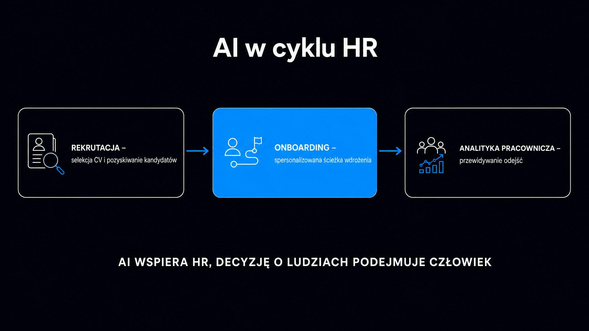

Według raportu SHRM State of AI in HR 2026 już 69% specjalistów HR korzysta z AI w rekrutacji, co stanowi skok z 51% w 2024 roku. Algorytmy przeglądają CV. Asystenci konwersacyjni umawiają rozmowy. Modele predykcyjne z wyprzedzeniem sygnalizują, który pracownik za trzy miesiące złoży wypowiedzenie. To nie jest pieśń przyszłości, lecz operacyjna codzienność, która przynosi konkretne obowiązki prawne. **Unijny AI Act (Rozporządzenie UE 2024/1689) klasyfikuje systemy AI stosowane w rekrutacji i zarządzaniu pracownikami jako systemy wysokiego ryzyka, wymuszając audyty, dokumentację i nadzór człowieka.** Zobacz, co sztuczna inteligencja realnie zmienia w działach kadr, jakie narzędzia warto wdrożyć i gdzie kryją się pułapki. Zrób to, zanim inspekcja pracy lub UODO zapukają do drzwi.

## Rekrutacja – selekcja CV i pozyskiwanie kandydatów

Najbardziej widoczny obszar zastosowań AI w HR to preselekcja aplikacji. Przy masowych procesach rekruter otrzymuje setki CV na jedno ogłoszenie. Algorytmy potrafią przefiltrować tę samą pulę w zaledwie kilka minut. **System błyskawicznie szereguje kandydatów według ich dopasowania do profilu stanowiska.**

Narzędzia do wstępnej selekcji CV działają na zasadzie [uczenia maszynowego](https://pl.wikipedia.org/wiki/Uczenie_maszynowe). Model trenowany na historycznych danych rekrutacyjnych uczy się, które cechy kandydatów korelowały z sukcesem na danym stanowisku. Platformy takie jak Workday, SAP SuccessFactors i Greenhouse oferują wbudowane moduły tej klasy. **HireVue idzie o krok dalej, łącząc analizę CV z oceną nagranych rozmów wideo.** Algorytm bada treść wypowiedzi oraz sygnały behawioralne, jednak finalną ocenę zawsze zatwierdza człowiek.

Drugi obszar transformacji to aktywne pozyskiwanie talentów (ang. *sourcing*) poza standardowymi portalami ogłoszeniowymi. Platformy takie jak Beamery, Eightfold AI czy SeekOut autonomicznie przeszukują LinkedIn, GitHub oraz inne publiczne bazy, budując profile kandydatów pasywnych. **Beamery łączy funkcje CRM z zarządzaniem talentami i analizą umiejętności, co pozwala budować relacje na długo przed otwarciem rekrutacji.** Z kolei LinkedIn Recruiter Hiring Assistant samodzielnie generuje spersonalizowane wiadomości na podstawie profilu odbiorcy, całkowicie eliminując ręczne pisanie.

### Mierzalne efekty i realne ograniczenia

Rynkowe dane wyraźnie wskazują na powtarzalne wzorce. **Sztuczna inteligencja skraca czas pozyskania pracownika (ang. *time-to-hire*) średnio o 50%, ucinając koszty rekrutacji o około 30% (raport hirebee.ai, 2025).** Na polskim podwórku już 58% firm wdrożyło algorytmy do selekcji wstępnej (HRstandard.pl, raport 2025).

Sukces nie przychodzi jednak z automatu. **Badanie Gartner z 2025 roku na próbie 114 liderów HR udowadnia, że 88% organizacji nie osiągnęło znaczących korzyści biznesowych z wdrożonych narzędzi AI.** Główny winowajca to brak integracji z istniejącymi systemami ATS oraz sztywnymi procesami decyzyjnymi w zespołach.

<aside class="callout-fact">
  
✦

  

    
Ciekawostka

    
Amazon wycofał swój wewnętrzny algorytm do selekcji CV po odkryciu, że systematycznie obniżał oceny kandydatek. Model był trenowany na CV dotychczasowych pracowników firmy – w 90% mężczyzn. Algorytm nauczył się traktować słowo "kobiece" (np. w nazwie organizacji studenckiej) jako sygnał negatywny. <strong>To klasyczny przykład stronniczości algorytmicznej wynikającej z błędu w danych treningowych, a nie z intencji projektantów.</strong>

  

</aside>

## Onboarding – od stosu dokumentów do spersonalizowanej ścieżki

Tradycyjny onboarding to zazwyczaj tydzień żmudnego wypełniania formularzy i sesja Q&A, której nikt nie pamięta po miesiącu. Tymczasem 45% działów HR korzysta już z narzędzi AI do wdrażania pracowników, a kolejne 25% zrobiło to w 2024 roku (infeedo.ai, raport 2026). Efekty widać czarno na białym. **Algorytmy skracają czas osiągnięcia pełnej produktywności przez nowo zatrudnioną osobę o około 40%.**

Jak to wygląda w praktyce? Microsoft Viva łączy moduły Viva Learning, Viva Engage i Viva Insights w spójną platformę, integrując się z ServiceNow czy Salesforce. Algorytm analizuje stanowisko, dynamikę zespołu oraz historię szkoleń. Na tej podstawie układa spersonalizowaną ścieżkę rozwoju. ServiceNow Employee Center z Now Assist idzie o krok dalej. Generatywna AI odpowiada na pytania nowicjusza w naturalnym trybie konwersacyjnym, zamiast odsyłać go do zakurzonych, statycznych baz wiedzy.

Sztuczna inteligencja wnosi największą wartość do onboardingu w trzech konkretnych obszarach:

- **Automatyzacja dokumentacji** – platformy takie jak WorkBright digitalizują formularze kadrowe (m.in. odpowiedniki I-9, umowy NDA), eliminując ręczne zbieranie podpisów i ryzyko błędów
- **Spersonalizowane szkolenia** – model rekomenduje moduły e-learningowe dopasowane do roli, tempa nauki i luk kompetencyjnych konkretnego pracownika
- **Wirtualny asystent HR** – chatbot oparty na danych wewnętrznych (polityki, regulaminy, procedury) odpowiada na typowe pytania w pierwszym miesiącu bez angażowania specjalistów HR

**Organizacje z dojrzałym onboardingiem notują 82% wyższy wskaźnik zatrzymania nowych pracowników i 70-procentowy wzrost produktywności w pierwszym roku.** Te dane nie wynikają wyłącznie z wdrożeń AI. Algorytmy stanowią jednak kluczowy katalizator, który drastycznie skraca czas potrzebny na osiągnięcie takich wyników.

## Analityka pracownicza – przewidywanie odejść i optymalizacja zespołów

Analityka pracownicza (ang. *people analytics*) to obszar, w którym sztuczna inteligencja dawno przestała być eksperymentem, stając się twardym narzędziem operacyjnym. **Obecnie 34% organizacji stosuje modele predykcyjne do prognozowania odejść pracowników, osiągając dokładność przewidywań rzędu 75–89% (SecondTalent, 2025).** Dojrzałe programy analityczne przynoszą średnio 367% zwrotu z inwestycji. Same modele przewidywania rotacji generują ten zwrot na imponującym poziomie 421%.

Mechanizm jest prosty. Model analizuje sygnały zaszyte w wewnętrznych systemach firmy. Bada wyniki ocen pracowniczych, wzorce aktywności w komunikatorach, tempo awansów, historię urlopów czy nawet długość przerw między odpowiedziami na maile. Na tej podstawie przypisuje każdemu zatrudnionemu wskaźnik ryzyka odejścia (ang. *flight risk score*). Dział HR zyskuje czas na interwencję, zanim na biurko trafi wypowiedzenie.

### Kluczowe metryki people analytics

Zestawienie tradycyjnego i opartego na sztucznej inteligencji podejścia do pomiaru kluczowych wskaźników HR stanowi doskonały punkt wyjścia do negocjacji z dostawcą oprogramowania:

| Metryka | Tradycyjnie | Z AI | Źródło danych |
|---|---|---|---|
| Czas pozyskania pracownika (*time-to-hire*) | 30–45 dni | 15–22 dni | Dane ATS, historia ofert |
| Dokładność prognoz rotacji | ~50% (intuicja) | 75–89% | Systemy HRMS, narzędzia do współpracy |
| Czas do pełnej produktywności | 8–12 miesięcy | 5–7 miesięcy | Dane onboardingowe, oceny wydajności |
| Koszt jednej rekrutacji | Wysoki, trudny do śledzenia | Redukcja o ~30% | Dane finansowe + ATS |

Poza prognozowaniem rotacji analityka HR obejmuje planowanie zatrudnienia (ang. *workforce planning*), mapowanie luk kompetencyjnych oraz optymalizację struktury zespołów. Platformy takie jak Visier czy SAP SuccessFactors People Analytics agregują rozproszone dane. Następnie wizualizują je w formie czytelnych kokpitów menedżerskich dla dyrektora HR i zarządu.

<aside class="callout-expert">
  

  

    
Opinia eksperta

    
W rozmowach z klientami ICEA najczęściej spotykam się z tym samym błędem: firma kupuje narzędzie people analytics, wprowadza do niego dane z systemu HRMS i oczekuje gotowych rekomendacji. Po kwartale okazuje się, że dane są niespójne – różne działy kodowały stanowiska inaczej, część rekrutacji była prowadzona poza ATS, a urlopy wpisywano ręcznie w Excelu. Model generuje wyniki, ale nikt im nie ufa. <strong>Przed zakupem jakiegokolwiek narzędzia analitycznego zrób tygodniowy audyt jakości danych – to najszybszy sposób, aby ocenić, czy w ogóle masz czym zasilić algorytm.</strong>

    
Mateusz Wiśniewski · Ekspert SEO/AI Search, ICEA

  

</aside>

## Ryzyka – stronniczość algorytmiczna i RODO

**Sztuczna inteligencja w kadrach generuje konkretne ryzyka prawne i etyczne, którymi musisz zarządzić przed wdrożeniem, a nie po fakcie.**

Stronniczość algorytmiczna (ang. *algorithmic bias*) to niebezpieczna tendencja modelu do systematycznego faworyzowania lub dyskryminowania określonych grup. Jeśli dane treningowe odzwierciedlają historyczne patologie – na przykład fakt, że przez dekadę na dane stanowisko zatrudniano wyłącznie mężczyzn – system uzna to za normę i zacznie ją powielać. Głośna wpadka Amazona to tylko wierzchołek góry lodowej. **W 2023 roku złożono pozew zbiorowy przeciwko Workday (kolejne etapy toczyły się w 2024 i 2025 roku), zarzucając algorytmom dyskryminację kandydatów ze względu na rasę, wiek i niepełnosprawność (sprawa Mobley v. Workday).**

RODO (Rozporządzenie UE 2016/679) chroni kandydatów i pracowników poprzez art. 22. **Przepis ten gwarantuje prawo, by nie podlegać decyzji opartej wyłącznie na zautomatyzowanym przetwarzaniu danych, jeśli wywołuje ona istotne skutki prawne.** Odrzucenie kandydatury to właśnie taki skutek. Kluczowe słowo to „wyłącznie”. Interwencja człowieka musi być realna, a nie sprowadzać się do bezrefleksyjnego klikania „zatwierdź” pod rekomendacją maszyny.

Obowiązki operacyjne przy każdym wdrożeniu AI w dziale kadr obejmują:

- **Ocenę skutków dla ochrony danych (DPIA)** – obowiązkową przy systematycznym monitorowaniu załogi lub automatycznym podejmowaniu decyzji kadrowych
- **Klauzulę informacyjną** – kandydat musi wiedzieć, że jego dane analizuje system AI, w jakim celu to robi i na jakiej podstawie prawnej
- **Zapewnienie prawa do wyjaśnienia** – na żądanie aplikanta firma musi wytłumaczyć logikę algorytmicznej decyzji (art. 22 ust. 3 RODO)
- **Weryfikację danych treningowych** – pracodawca ponosi pełną odpowiedzialność za dyskryminację algorytmiczną, nawet jeśli błąd leży po stronie zewnętrznego dostawcy oprogramowania
- **Zawarcie umowy powierzenia** – jeśli twórca narzędzia przetwarza dane kandydatów, niezbędna jest umowa powierzenia przetwarzania danych zgodna z art. 28 RODO

Szczegółowe omówienie ram prawnych, w tym instrukcję budowy wewnętrznej Polityki AI oraz wzory klauzul do umów z dostawcami, znajdziesz w artykule o [AI Act i RODO](/ai-w-biznesie/ai-act-rodo/).

## AI Act i HR – co zmienia się od grudnia 2027

**Unijny AI Act bezwzględnie klasyfikuje systemy AI stosowane w procesach rekrutacyjnych i zarządzaniu pracownikami jako systemy wysokiego ryzyka (Załącznik III, pkt 4).** Kategoria ta obejmuje narzędzia do selekcji CV, szeregowania kandydatów, analizy rozmów wideo, oceny pracowniczej oraz prognozowania rotacji.

Pełne stosowanie przepisów dla systemów wysokiego ryzyka z Annexu III (w tym AI w rekrutacji) przesunięto na 2 grudnia 2027 roku na mocy porozumienia Digital Omnibus z maja 2026. Do tego czasu każda organizacja korzystająca z takich rozwiązań musi:

- **Ocenę skutków dla praw podstawowych** – przeprowadzić audyt (ang. *Fundamental Rights Impact Assessment*, FRIA) przed wdrożeniem lub kontynuowaniem pracy z systemem
- **Ludzki nadzór** – zagwarantować kontrolę nad każdą decyzją kadrową z udziałem AI, przy czym nadzorca musi mieć realne kompetencje do podważenia werdyktu maszyny
- **Dokumentację techniczną** – prowadzić rejestr systemu, uwzględniający opis danych treningowych, metody testowania pod kątem stronniczości oraz wyniki tych weryfikacji
- **Obowiązek informacyjny** – powiadomić załogę lub jej przedstawicieli o fakcie wykorzystywania systemów AI wysokiego ryzyka

Warto pamiętać, że od 2 lutego 2025 roku obowiązuje całkowity zakaz rozpoznawania emocji kandydatów podczas rozmów kwalifikacyjnych. Platformy takie jak HireVue musiały usunąć tę funkcję lub drastycznie zmodyfikować architekturę modeli. **Naruszenie przepisów dla systemów wysokiego ryzyka grozi karą do 15 milionów euro lub 3% globalnego obrotu, a stosowanie zakazanych praktyk winduje stawkę do 35 milionów euro lub 7% obrotu.**

Szerszy kontekst regulacyjny, uwzględniający harmonogram wdrożenia AI Act dla poszczególnych kategorii systemów, szczegółowo opisuje [przewodnik po wdrożeniu AI](/ai-w-biznesie/przewodnik/). To lektura obowiązkowa dla każdego decydenta, który stawia pierwsze kroki w świecie sztucznej inteligencji.

## Jak wdrożyć AI w HR bez wpadki regulacyjnej?

Większość firm, które zderzyły się ze ścianą przy wdrażaniu AI w HR, popełniła ten sam błąd. Kupiły narzędzie, uruchomiły je i naiwnie założyły, że kwestie compliance leżą wyłącznie po stronie dostawcy. **Pracodawca zawsze pozostaje administratorem danych i ponosi pełną odpowiedzialność za skutki działania systemu, niezależnie od tego, kto napisał jego kod.**

Zanim uruchomisz jakiekolwiek narzędzie AI w dziale kadr, odhacz poniższą listę kontrolną:

- **Zidentyfikuj klasyfikację ryzyka** – ustal, czy narzędzie podejmuje lub wspiera decyzje rekrutacyjne, bo jeśli tak, to według AI Act prawdopodobnie wdrażasz system wysokiego ryzyka
- **Przeprowadź DPIA** – nie czekaj na wezwanie z UODO, tylko wykonaj ocenę skutków przed startem projektu, a nie po fakcie
- **Sprawdź dostawcę** – zażądaj dokumentacji technicznej modelu, źródeł danych treningowych i wyników testów na stronniczość (poważny partner udostępni je bez oporów)
- **Zaktualizuj procedury** – przygotuj nowe klauzule informacyjne, aneksy do umów powierzenia oraz regulamin pracy, zwłaszcza jeśli monitorujesz załogę przez AI
- **Przeszkol rekruterów** – ludzki nadzór to fikcja, jeśli pracownik HR nie rozumie mechaniki działania algorytmu i jego technicznych ograniczeń

Jeśli Twoja firma dopiero bada grunt i ocenia gotowość do wdrożeń AI w obszarze HR, sprawdź [Widoczność marki w AI](/narzedzia/brand-check/). Dowiesz się stamtąd, jak modele językowe postrzegają Twoją markę, zanim w ogóle zaczniesz integrować je wewnątrz organizacji.

Zwróć też uwagę na to, jak sztuczna inteligencja rewolucjonizuje obsługę klienta. Mechanizmy automatyzacji decyzji omówione w tekście o [AI w obsłudze klienta](/ai-w-biznesie/ai-w-obsludze-klienta/) są bliźniaczo podobne do tych z branży HR i podlegają identycznym rygorom prawnym. Jeśli natomiast chcesz zrozumieć techniczny fundament tych rozwiązań i sprawdzić, jak dokładnie działają modele językowe napędzające asystentów kadrowych, świetnym punktem wyjścia będzie [przewodnik po dużych modelach językowych](/modele-llm/przewodnik/).
