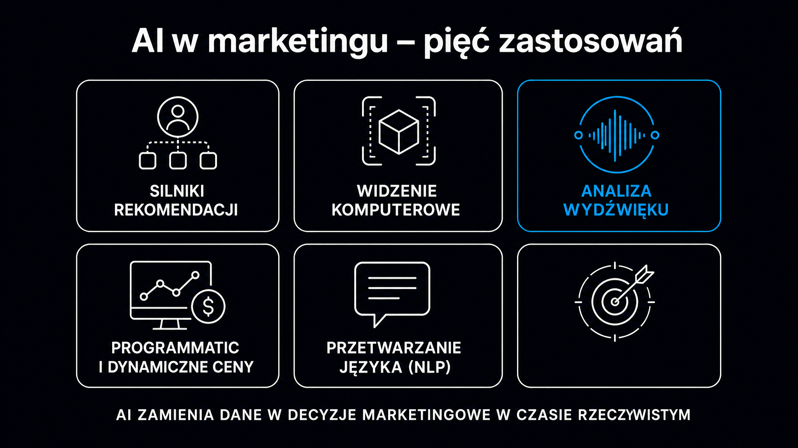

Generowanie tekstu to zaledwie ułamek tego, co AI robi dziś w marketingu. Algorytmy uczenia maszynowego napędzają 35% przychodów Amazona przez rekomendacje produktowe, redukują koszty obsługi klienta o równowartość 700 etatów (na przykładzie Klarny) i podnoszą konwersję kampanii wizualnych o 520% (Wickes na Pintereście). Jeśli Twój zespół marketingowy używa AI wyłącznie do pisania postów, tracisz dostęp do narzędzi, które Twoja konkurencja już testuje. Ten artykuł przedstawia rzeczywiste wdrożenia z konkretnymi liczbami – posegregowane według obszaru zastosowania.

## Silniki rekomendacji – jak AI decyduje, co zobaczysz

Personalizacja to dziś jeden z najlepiej udokumentowanych obszarów o najwyższym zwrocie z inwestycji w AI. Amazon generuje 35% całkowitych przychodów dzięki systemowi rekomendacji opartemu na analizie wzorców przeglądania i historii transakcji. Netflix twierdzi, że algorytm odpowiada za 80% odkrywanych przez użytkowników treści, co przekłada się na oszczędności rzędu 1 mld USD rocznie dzięki zmniejszeniu odpływu subskrybentów. Spotify AI DJ – wyspecjalizowany asystent tworzący playlisty i generujący spersonalizowany komentarz radiowy – przekroczył 50 mln użytkowników w ciągu pierwszego roku od uruchomienia na ponad 50 rynkach.

Podstawą tych systemów jest [uczenie maszynowe](https://pl.wikipedia.org/wiki/Uczenie_maszynowe) – techniki, które pozwalają algorytmom doskonalić się na podstawie danych behawioralnych bez ręcznego przeprogramowywania. W praktyce oznacza to analizę setek sygnałów jednocześnie: pora dnia, historia kliknięć, produkty porzucone w koszyku, dane demograficzne.

Dwa dominujące podejścia do budowania silników rekomendacji:

- **Filtrowanie kolaboratywne oparte na użytkownikach** – algorytm szuka podobieństwa między profilem aktywnego użytkownika a innymi użytkownikami; rekomenduje to, co lubią jego „cyfrowi bliźniacy". Skuteczne dla niespodziewanych odkryć, ale trudne do skalowania przy dużych bazach.
- **Filtrowanie oparte na produktach** – bada, które produkty są często kupowane razem lub oglądane sekwencyjnie. Macierz podobieństwa produktów zmienia się wolniej niż baza klientów, więc można ją przeliczać asynchronicznie – co drastycznie obniża koszty obliczeniowe w czasie rzeczywistym.

**Allegro, obsługujące ponad 20 mln aktywnych kupujących, wdrożyło architekturę dwuwieżową (Two-Tower), gdzie jedna sieć neuronowa koduje kontekst użytkownika, a druga – parametry produktów.** Stopień dopasowania oblicza się jako iloczyn skalarny obu wektorów – co pozwala przeszukać setki milionów ofert w milisekundach. Podobna architektura napędza YouTube'a, gdzie algorytm odpowiada za 70% całkowitego czasu oglądania.

Poniższa tabela zestawia wybrane wdrożenia z mierzalnymi efektami:

| Firma | Zastosowanie AI | Mierzalny efekt |
|---|---|---|
| Amazon | Rekomendacje produktowe (item-to-item) | 35% całkowitych przychodów |
| Netflix | Personalizacja kolejności treści + miniatur | 80% odkryć treści; ~1 mld USD oszczędności/rok |
| Zalando | Silnik personalizacji i asystent stylizacji | +13% produktów w koszyku |
| Spotify | AI DJ – spersonalizowane playlisty z komentarzem | 50 mln użytkowników w rok |

Jeśli chcesz ocenić, czy Twoja marka jest gotowa do budowania takiej infrastruktury danych, [przewodnik po AI w biznesie](/ai-w-biznesie/przewodnik/) opisuje kolejne kroki od audytu po wdrożenie.

## Widzenie komputerowe w sprzedaży – od wirtualnego przymierzania do autonomicznych sklepów

Systemy widzenia maszynowego skracają ścieżkę zakupową w sposób, którego żadne pole tekstowe nie zastąpi. Sephora Virtual Artist – narzędzie do wirtualnego nakładania makijażu oparte na skanowaniu twarzy z selfie – wygenerowało wzrost konwersji o 80% wśród użytkowników funkcji try-on i ponad 200 milionów dopasowań odcieni. ASOS Style Match, które pozwala wyszukiwać odzież na podstawie zdjęcia, skróciło czas odkrywania produktów o 35%, a zapytania wizualne odpowiadają już za ponad 10% zakupów w aplikacji. IKEA Kreativ umożliwia skanowanie przestrzeni mieszkalnej i wstawianie modeli mebli 3D w skali – efekt to dwukrotne wydłużenie sesji w aplikacji mobilnej.

Wickes, brytyjski sklep z materiałami budowlanymi, uruchomił kampanię opartą na Pinterest Performance+ – systemie automatycznie dobierającym kreacje produktowe na podstawie sygnałów wizualnych. Wynik: wzrost liczby kliknięć o 520% przy jednoczesnym spadku kosztu pozyskania o 77%.

To nie są eksperymenty. To wdrożenia produkcyjne z udokumentowanymi zwrotami z inwestycji.

### Żabka Nano – autonomiczny sklep bez kas i wag

Polska Grupa Żabka uruchomiła ponad 50 w pełni bezobsługowych placówek Żabka Nano – zostając liderem tego formatu w Europie. Zamiast czujników nacisku w półkach, technologia opracowana z firmą AiFi opiera się wyłącznie na widzeniu komputerowym zintegrowanym z chmurą Microsoft Azure.

Klient wchodzi do sklepu z kartą płatniczą lub kodem z aplikacji Żappka, system generuje jego wirtualny awatar 3D i śledzi interakcje z produktami. Dane te zasilają platformę Smart Store Analytics, która dostarcza marketerom:

- **Mapy cieplne ruchu** – które strefy sklepu przyciągają uwagę i jak długo klienci zatrzymują się przy ekspozytorach
- **Korelacje produktowe** – które produkty są oglądane sekwencyjnie, co bezpośrednio wpływa na decyzje o sąsiedztwie na półkach
- **Prognozowanie popytu z uwzględnieniem pogody** – system nakazuje przygotowanie konkretnej liczby ciepłych przekąsek na kilka godzin przed zmianą temperatury

**Kluczowe: architektura Privacy-by-Design wyklucza rozpoznawanie twarzy i dane biometryczne**, dzięki czemu Żabka Nano jest w pełni zgodna zarówno z RODO, jak i unijnym aktem w sprawie sztucznej inteligencji (AI Act).

## Analiza wydźwięku i automatyzacja obsługi klienta

Każda rozmowa z działem obsługi to nieustrukturyzowany strumień danych. Systemy analizy wydźwięku zamieniają go w użyteczne wskaźniki w czasie rzeczywistym.

Klarna wdrożyła asystenta AI zdolnego do autonomicznej obsługi wielokanałowej, odpowiadającego pracy 700 pełnoetatowych agentów. LPP – właściciel Reserved, Cropp i Mohito – zintegrowało platformę Genesys PureCloud z Google Dialogflow i repozytoriami danych (data lakes), co dało działom marketingu spójny dostęp do historii interakcji konsumenta ze wszystkimi markami grupy, eliminując silosy informacyjne między sprzedażą, obsługą i logistyką.

Nowoczesne systemy klasy Voice Analytics wychodzą poza prostą transkrypcję. Badają parametry akustyczne wypowiedzi – nagłe skoki częstotliwości głosu jako markery stresu, przyspieszenie mowy jako sygnał narastającej irytacji – i na tej podstawie proaktywnie sugerują przekazanie rozmowy konsultantowi z pełnym kontekstem problemu.

<aside class="callout-fact">
  
✦

  

    
Liczba do zapamiętania

    
Klarna ogłosiła, że ich asystent AI zastąpił pracę 700 agentów, jednocześnie skracając średni czas rozwiązania problemu z 11 do 2 minut. To nie jest eksperyment laboratoryjny – to dane operacyjne z wdrożenia produkcyjnego obsługującego kilkadziesiąt rynków.

  

</aside>

W kontekście GEO warto zauważyć, że treści budujące autorytet marki w AI Search muszą być spójne z tym, co klienci mówią o niej w kanałach obsługi. Jeśli Twoja marka zbiera negatywne opinie w recenzjach i transkryptach, modele językowe wychwytują też te sygnały. Jak to zmierzyć, opisuje [pozycjonowanie AI](/pozycjonowanie-ai/) – dyscyplina, która łączy klasyczne GEO z zarządzaniem percepcją marki w LLM-ach.

## Programmatic buying i dynamiczne ceny – AI zarządza budżetem mediowym

Zakup mediów w systemie RTB (ang. Real-Time Bidding, czyli licytacja reklam w czasie rzeczywistym) to środowisko, w którym decyzja o stawce musi zapaść w milisekundach. Żaden człowiek nie jest w stanie optymalnie zarządzać tysiącami jednoczesnych aukcji – stąd algorytmy.

Algorytmy bid shading (np. na platformie The Trade Desk) uczą się historycznych cen rozliczeniowych i na tej podstawie przewidują minimalną stawkę wystarczającą do wygrania danej odsłony. Efekt: ta sama ekspozycja przy niższych kosztach. Równolegle działają algorytmy tworzenia podobnych grup odbiorców (lookalike audience expansion) – na podstawie cech 50 000 lojalnych klientów system tworzy profile statystycznie podobnych użytkowników w sieciach Google i Meta.

Integracja danych pogodowych z systemem zakupowym to kolejny obszar udokumentowanych wyników: kampania promująca meble ogrodowe automatycznie intensyfikowała zakup mediów przy nagłym wzroście temperatury, a wycofywała budżet podczas ochłodzeń. Efekt zmierzony na jednym z wdrożeń: wzrost konwersji o 45% w porównaniu do statycznych harmonogramów.

**Dynamiczne ustalanie cen (dynamic pricing) to jeden z bardziej kontrowersyjnych obszarów**, ale też jeden z lepiej udokumentowanych. Sieci handlowe raportują wzrost marży od 1,5 do 2 punktów procentowych przy wdrożeniu modeli prognozowania popytu. Jednak błędy komunikacyjne mogą zrujnować efekty – co pokazała sieć Wendy's, kiedy w 2024 roku ogłosiła pilotaż dynamicznych cen w menu. Wystarczyło kilka dni negatywnych publikacji (w których media użyły sformułowania „surge pricing"), żeby zarząd wycofał się z niefortunnej komunikacji.

Trzy zasady bezpiecznego wdrożenia dynamicznych cen:

- **Sztywne korytarze cenowe** – algorytm działa wyłącznie w granicach zdefiniowanych przez komitet ds. wycen (np. minimalna marża 20%), nigdy poza nimi
- **Komunikacja jako rabat, nie podwyżka** – klienci akceptują wahania cen, jeśli widzą promocję w godzinach niskiego popytu, a nie dopłatę w godzinach szczytu
- **Ceny bezwzględne zamiast mnożników** – Uber potwierdził empirycznie, że zastąpienie mnożnika (np. „opłata x2,2") konkretną kwotą w złotych znacząco redukuje frustrację użytkowników

Więcej o liczeniu zwrotu z inwestycji w te narzędzia znajdziesz w artykule o [ROI z AI](/ai-w-biznesie/roi-z-ai/) – z metodologią wyliczania efektów dla różnych typów wdrożeń.

## AI w marketingu a przetwarzanie języka naturalnego – granica jest cieńsza, niż myślisz

Większość narzędzi opisanych w tym artykule – analiza wydźwięku, chatboty obsługi klienta, personalizacja e-maili i push notyfikacji – opiera się na [przetwarzaniu języka naturalnego](https://pl.wikipedia.org/wiki/Przetwarzanie_j%C4%99zyka_naturalnego) (NLP), czyli dziedzinie, która uczy maszyny rozumieć i generować tekst. To znaczy, że granica między „generowaniem treści" a „operacyjnym AI" jest umowna. System, który analizuje wydźwięk recenzji, używa tych samych fundamentów co model piszący opisy produktów.

Praktyczna konsekwencja: wdrożenia są bardziej modułowe, niż się wydaje. Jeśli masz już chatbota na stronie zbierającego dane z rozmów, masz też surowy materiał do analizy opinii i identyfikacji najczęstszych pytań klientów – co bezpośrednio przekłada się na tematy, które Twoja marka powinna poruszać.

<aside class="callout-expert">
  

  

    
Opinia eksperta

    
W projektach, które prowadzę w ICEA, najczęstszy błąd to traktowanie AI w marketingu jako zestawu osobnych narzędzi – jedno do reklam, drugie do treści, trzecie do obsługi klienta. W praktyce dane z każdego z tych kanałów powinny zasilać jeden model decyzyjny. Firma, która połączy dane z contact center z danymi reklamowymi i historią zakupów, ma realną przewagę nad tą, która optymalizuje każdy kanał w izolacji. <strong>Zacznij od jednego źródła danych, które masz już dziś, i zapytaj: co AI może zrobić z tym, co już zebrałem?</strong>

    
Mateusz Wiśniewski · Ekspert SEO/AI Search, ICEA

  

</aside>

## Od czego zacząć wdrożenie AI w marketingu

Wdrożenia opisane w tym artykule dotyczą firm od Amazona po Żabkę – ale fundamenty są dostępne dla każdej organizacji z danymi behawioralnymi klientów i budżetem na eksperyment.

Praktyczny punkt startowy dla zespołów marketingowych z ograniczonymi zasobami:

- **Analiza danych z istniejących kanałów** – zanim kupisz nowe narzędzie, sprawdź, czy Twój CRM lub platforma e-mailowa oferuje wbudowaną segmentację opartą na zachowaniu; wiele z nich ma funkcje AI ukryte w ustawieniach zaawansowanych
- **Jeden test A/B z dynamiczną personalizacją** – wybierz jeden element komunikacji (np. temat e-maila lub kolejność produktów na stronie głównej) i przetestuj wariant generowany przez algorytm w porównaniu ze statycznym; mierz przez 4 tygodnie
- **Monitorowanie wydźwięku z darmowych źródeł** – recenzje Google, komentarze w mediach społecznościowych, wyniki ankiet NPS to gotowy surowiec do analizy; narzędzia takie jak darmowe narzędzie [Widoczność marki w AI](/narzedzia/brand-check/) pokażą Ci, jak marka jest postrzegana przez modele AI – co jest bezpośrednio powiązane z tym, jak algorytmy rekomendacji ją kategoryzują
- **Audyt danych przed zakupem platformy** – najczęstszy błąd to zakup zaawansowanego systemu AI bez danych historycznych; silnik rekomendacji bez minimum 6 miesięcy historii transakcji działa jak nowa wyszukiwarka bez indeksu

Szczegółowy opis pierwszych kroków – od wyboru narzędzi po harmonogram wdrożenia – znajdziesz w artykule o [AI w sprzedaży](/ai-w-biznesie/ai-w-sprzedazy/), który skupia się na obszarach bezpośrednio napędzających przychód.
