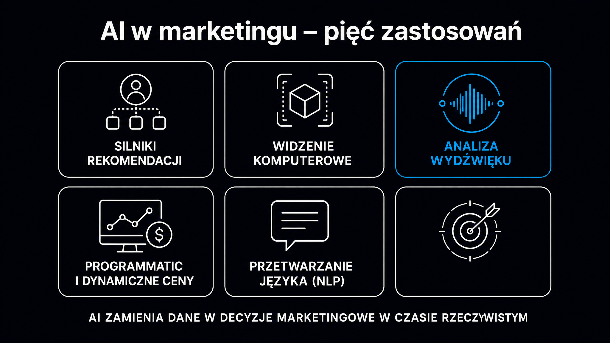

Generowanie tekstu to zaledwie ułamek tego, co AI robi dziś w marketingu. **Algorytmy uczenia maszynowego odpowiadają za ok. 70% czasu oglądania w YouTube, a asystent AI Klarny już w pierwszym miesiącu działania wykonywał pracę odpowiadającą 700 pełnym etatom.** Jeśli Twój zespół używa sztucznej inteligencji wyłącznie do pisania postów, tracisz przewagę. Konkurencja już testuje te rozwiązania. Zobacz, jak działają najważniejsze zastosowania – posegregowane według obszaru.

## Silniki rekomendacji – jak AI decyduje, co zobaczysz

Personalizacja to dziś jeden z najlepiej udokumentowanych obszarów o najwyższym zwrocie z inwestycji w AI. **Amazon, Netflix czy Spotify opierają na rekomendacjach znaczną część doświadczenia użytkownika – od listy produktów „kupione razem” po kolejność seriali i playlist.** Skalę zjawiska dobrze pokazuje YouTube: według szefa produktu serwisu rekomendacje AI odpowiadają tam za ok. 70% czasu oglądania. Spotify poszło o krok dalej i w 2023 roku uruchomiło AI DJ – asystenta, który układa spersonalizowaną playlistę i komentuje ją jak prezenter radiowy.

Podstawą tych systemów jest [uczenie maszynowe](https://pl.wikipedia.org/wiki/Uczenie_maszynowe) – techniki, które pozwalają algorytmom doskonalić się na podstawie danych behawioralnych bez ręcznego przeprogramowywania. W praktyce oznacza to analizę setek sygnałów jednocześnie. Pora dnia, historia kliknięć, produkty porzucone w koszyku, dane demograficzne. Wszystko to buduje kontekst.

Dwa dominujące podejścia do budowania silników rekomendacji to:

- **Filtrowanie kolaboratywne oparte na użytkownikach** – algorytm szuka podobieństwa między profilem aktywnego użytkownika a innymi użytkownikami. Rekomenduje to, co lubią jego „cyfrowi bliźniacy". Rozwiązanie skuteczne dla niespodziewanych odkryć, ale trudne do skalowania przy dużych bazach.
- **Filtrowanie oparte na produktach** – bada, które produkty są często kupowane razem lub oglądane sekwencyjnie. Macierz podobieństwa produktów zmienia się wolniej niż baza klientów. Można ją przeliczać asynchronicznie – co drastycznie obniża koszty obliczeniowe w czasie rzeczywistym.

**Duże platformy z milionami ofert często sięgają po architekturę dwuwieżową (Two-Tower), w której jedna sieć neuronowa koduje kontekst użytkownika, a druga – parametry produktów.** Stopień dopasowania oblicza się jako iloczyn skalarny obu wektorów. Ponieważ wektory produktów można przeliczyć z wyprzedzeniem, system przeszukuje ogromne katalogi w ułamku sekundy.

Poniższa tabela zestawia typowe zastosowania rekomendacji i wskaźniki, po których warto oceniać ich efekt:

| Zastosowanie AI | Przykład | Co mierzyć |
|---|---|---|
| Rekomendacje produktowe (item-to-item) | „Klienci kupili również” w e-commerce | Udział przychodu z rekomendacji, wartość koszyka |
| Personalizacja kolejności treści i miniatur | Serwisy streamingowe | Czas oglądania, odpływ subskrybentów |
| Asystent stylizacji | Moda online | Liczba produktów w koszyku, zwroty |
| Spersonalizowane playlisty z komentarzem | Spotify AI DJ | Czas słuchania, powroty do funkcji |

Jeśli chcesz ocenić, czy Twoja marka jest gotowa do budowania takiej infrastruktury danych, [przewodnik po AI w biznesie](/ai-w-biznesie/przewodnik/) opisuje kolejne kroki od audytu po wdrożenie.

## Widzenie komputerowe w sprzedaży – od wirtualnego przymierzania do autonomicznych sklepów

Systemy widzenia maszynowego skracają ścieżkę zakupową w sposób, którego żadne pole tekstowe nie zastąpi. **Wirtualne przymierzanie – np. nakładanie makijażu na selfie – pozwala klientowi sprawdzić produkt, zanim trafi on do koszyka.** Wyszukiwanie wizualne umożliwia znalezienie odzieży na podstawie zdjęcia, bez zgadywania, jak nazwać fason. Z kolei aplikacje meblowe pozwalają zeskanować pokój i wstawić do niego modele mebli 3D w skali.

Wszystkie te mechanizmy skracają drogę od inspiracji do zakupu i zmniejszają niepewność, która w e-commerce kończy się porzuconym koszykiem albo zwrotem.

### Żabka Nano – autonomiczny sklep bez kas

**Żabka rozwija sieć bezobsługowych sklepów Żabka Nano, w których inteligentne kamery rozpoznają, jakie produkty klient zdejmuje z półek.** Nie ma kas ani skanowania – płatność pobierana jest automatycznie po wyjściu.

Klient wchodzi do sklepu z kartą płatniczą lub kodem z aplikacji Żappka. System śledzi interakcje z produktami. Dane z takich sklepów mogą dostarczać marketerom:

- **Mapy cieplne ruchu** – które strefy sklepu przyciągają uwagę i jak długo klienci zatrzymują się przy ekspozytorach
- **Korelacje produktowe** – które produkty są oglądane sekwencyjnie, co bezpośrednio wpływa na decyzje o sąsiedztwie na półkach
- **Prognozowanie popytu z uwzględnieniem pogody** – model może podpowiadać, ile ciepłych przekąsek przygotować przed zmianą temperatury

**Kluczowe przy takich wdrożeniach jest projektowanie bez rozpoznawania twarzy i danych biometrycznych** – identyfikacja i kategoryzacja biometryczna istotnie podnoszą wymagania zarówno RODO, jak i unijnego aktu w sprawie sztucznej inteligencji (AI Act).

## Analiza wydźwięku i automatyzacja obsługi klienta

Każda rozmowa z działem obsługi to nieustrukturyzowany strumień danych. Systemy analizy wydźwięku zamieniają go w użyteczne wskaźniki w czasie rzeczywistym.

**Asystent AI Klarny w pierwszym miesiącu przeprowadził 2,3 mln rozmów – dwie trzecie czatów obsługi klienta – wykonując pracę odpowiadającą 700 pełnym etatom.** Duże grupy handlowe idą dalej i integrują platformy contact center z silnikami konwersacyjnymi oraz repozytoriami danych (data lakes). Dzięki temu marketing ma spójny dostęp do historii interakcji klienta ze wszystkimi markami grupy, a silosy informacyjne między sprzedażą, obsługą i logistyką znikają.

Nowoczesne systemy klasy Voice Analytics wychodzą poza prostą transkrypcję. Badają parametry akustyczne wypowiedzi – nagłe skoki częstotliwości głosu jako markery stresu, przyspieszenie mowy jako sygnał narastającej irytacji. Na tej podstawie proaktywnie sugerują przekazanie rozmowy konsultantowi z pełnym kontekstem problemu.

<aside class="callout-fact">
  
✦

  

    
Liczba do zapamiętania

    
Klarna ogłosiła, że jej asystent AI wykonuje pracę odpowiadającą 700 pełnym etatom, a średni czas rozwiązania sprawy spadł z 11 do poniżej 2 minut. To nie jest eksperyment laboratoryjny – to dane operacyjne z wdrożenia działającego całą dobę na 23 rynkach, w ponad 35 językach.

  

</aside>

W kontekście GEO warto zauważyć, że treści budujące autorytet marki w AI Search muszą być spójne z tym, co klienci mówią o niej w kanałach obsługi. **Jeśli Twoja marka zbiera negatywne opinie w recenzjach i transkryptach, modele językowe wychwytują też te sygnały.** Jak to zmierzyć, opisuje [pozycjonowanie AI](/pozycjonowanie-ai/) – dyscyplina, która łączy klasyczne GEO z zarządzaniem percepcją marki w LLM-ach.

## Programmatic buying i dynamiczne ceny – AI zarządza budżetem mediowym

Zakup mediów w systemie RTB (ang. Real-Time Bidding, czyli licytacja reklam w czasie rzeczywistym) to środowisko, w którym decyzja o stawce musi zapaść w milisekundach. Żaden człowiek nie jest w stanie optymalnie zarządzać tysiącami jednoczesnych aukcji – stąd algorytmy.

**Algorytmy bid shading (np. na platformie The Trade Desk) uczą się historycznych cen rozliczeniowych i na tej podstawie przewidują minimalną stawkę wystarczającą do wygrania danej odsłony.** Efekt to ta sama ekspozycja przy niższych kosztach. Równolegle działają algorytmy tworzenia podobnych grup odbiorców (lookalike audience expansion). Na podstawie cech 50 000 lojalnych klientów system tworzy profile statystycznie podobnych użytkowników w sieciach Google i Meta.

Kolejny obszar to integracja danych pogodowych z systemem zakupowym. Kampania promująca meble ogrodowe może automatycznie zwiększać zakup mediów przy nagłym wzroście temperatury, a wycofywać budżet podczas ochłodzeń – zamiast emitować reklamy według statycznego harmonogramu.

**Dynamiczne ustalanie cen (dynamic pricing) to jeden z bardziej kontrowersyjnych obszarów, ale też jeden z lepiej udokumentowanych.** Sieci handlowe łączą je z modelami prognozowania popytu, żeby chronić marżę i ograniczać straty na niesprzedanym towarze. Jednak błędy komunikacyjne mogą zrujnować efekty. Wystarczy, że klienci i media odczytają zapowiedź zmiennych cen jako „surge pricing”, czyli podwyżki w godzinach szczytu, a firma zamiast korzyści dostaje falę negatywnych publikacji i musi prostować komunikat.

Trzy zasady bezpiecznego wdrożenia dynamicznych cen to:

- **Sztywne korytarze cenowe** – algorytm działa wyłącznie w granicach zdefiniowanych przez komitet ds. wycen (np. minimalna marża 20%), nigdy poza nimi
- **Komunikacja jako rabat, nie podwyżka** – klienci akceptują wahania cen, jeśli widzą promocję w godzinach niskiego popytu, a nie dopłatę w godzinach szczytu
- **Ceny bezwzględne zamiast mnożników** – konkretna kwota w złotych podana z góry jest dla klienta czytelniejsza niż mnożnik (np. „opłata x2,2"), który trudno przeliczyć i łatwo odebrać jako karę

Więcej o liczeniu zwrotu z inwestycji w te narzędzia znajdziesz w artykule o [ROI z AI](/ai-w-biznesie/roi-z-ai/) – z metodologią wyliczania efektów dla różnych typów wdrożeń.

## AI w marketingu a przetwarzanie języka naturalnego – granica jest cieńsza, niż myślisz

Większość narzędzi opisanych w tym artykule – analiza wydźwięku, chatboty obsługi klienta, personalizacja e-maili i push notyfikacji – opiera się na [przetwarzaniu języka naturalnego](https://pl.wikipedia.org/wiki/Przetwarzanie_j%C4%99zyka_naturalnego) (NLP), czyli dziedzinie, która uczy maszyny rozumieć i generować tekst. To znaczy, że granica między „generowaniem treści" a „operacyjnym AI" jest umowna. **System, który analizuje wydźwięk recenzji, używa tych samych fundamentów co model piszący opisy produktów.**

Praktyczna konsekwencja jest taka, że wdrożenia są bardziej modułowe, niż się wydaje. Jeśli masz już chatbota na stronie zbierającego dane z rozmów, masz też surowy materiał do analizy opinii i identyfikacji najczęstszych pytań klientów. To bezpośrednio przekłada się na tematy, które Twoja marka powinna poruszać.

<aside class="callout-expert">
  

  

    
Opinia eksperta

    
W projektach, które prowadzę w ICEA, najczęstszy błąd to traktowanie AI w marketingu jako zestawu osobnych narzędzi – jedno do reklam, drugie do treści, trzecie do obsługi klienta. W praktyce dane z każdego z tych kanałów powinny zasilać jeden model decyzyjny. Firma, która połączy dane z contact center z danymi reklamowymi i historią zakupów, ma realną przewagę nad tą, która optymalizuje każdy kanał w izolacji. <strong>Zacznij od jednego źródła danych, które masz już dziś, i zapytaj: co AI może zrobić z tym, co już zebrałem?</strong>

    
Mateusz Wiśniewski · Ekspert SEO/AI Search, ICEA

  

</aside>

## Od czego zacząć wdrożenie AI w marketingu

Wdrożenia opisane w tym artykule dotyczą firm od Amazona po Żabkę. Fundamenty są jednak dostępne dla każdej organizacji z danymi behawioralnymi klientów i budżetem na eksperyment.

Praktyczny punkt startowy dla zespołów marketingowych z ograniczonymi zasobami to:

- **Analiza danych z istniejących kanałów** – zanim kupisz nowe narzędzie, sprawdź, czy Twój CRM lub platforma e-mailowa oferuje wbudowaną segmentację opartą na zachowaniu. Wiele z nich ma funkcje AI ukryte w ustawieniach zaawansowanych.
- **Jeden test A/B z dynamiczną personalizacją** – wybierz jeden element komunikacji (np. temat e-maila lub kolejność produktów na stronie głównej) i przetestuj wariant generowany przez algorytm w porównaniu ze statycznym. Mierz wyniki przez 4 tygodnie.
- **Monitorowanie wydźwięku z darmowych źródeł** – recenzje Google, komentarze w mediach społecznościowych, wyniki ankiet NPS to gotowy surowiec do analizy. Darmowe narzędzia takie jak [Widoczność marki w AI](/narzedzia/brand-check/) pokażą Ci, jak marka jest postrzegana przez modele AI. Jest to bezpośrednio powiązane z tym, jak algorytmy rekomendacji ją kategoryzują.
- **Audyt danych przed zakupem platformy** – najczęstszy błąd to zakup zaawansowanego systemu AI bez danych historycznych. Silnik rekomendacji bez minimum 6 miesięcy historii transakcji działa jak nowa wyszukiwarka bez indeksu.

Szczegółowy opis pierwszych kroków – od wyboru narzędzi po harmonogram wdrożenia – znajdziesz w artykule o [AI w sprzedaży](/ai-w-biznesie/ai-w-sprzedazy/), który skupia się na obszarach bezpośrednio napędzających przychód.
