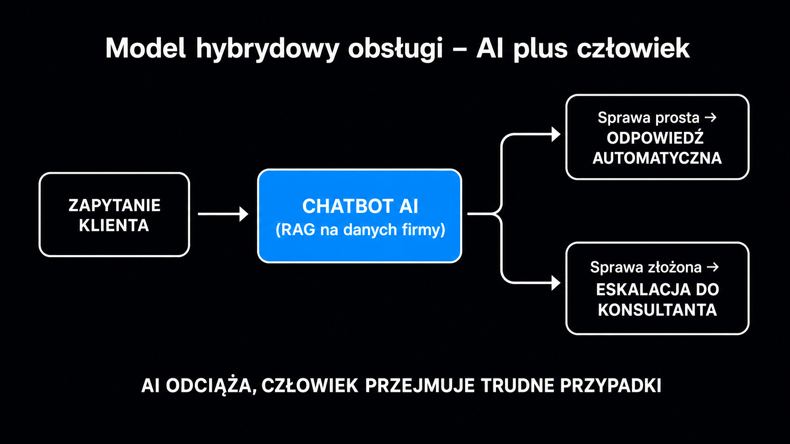

Chatboty oparte na dużych modelach językowych (LLM – Large Language Model) zmieniły obsługę klienta szybciej niż jakikolwiek wcześniejszy przełom technologiczny w tym obszarze. Klarna w ciągu jednego miesiąca zautomatyzowała 67% wszystkich zgłoszeń do obsługi klienta – pracę 700 konsultantów – i skróciła średni czas rozwiązania sprawy z 11 minut do poniżej 2 minut. To nie jest odległa przyszłość. To wynik, który firma opublikowała w lutym 2024 roku. Jeśli prowadzisz dział obsługi klienta i zastanawiasz się, od czego zacząć wdrażanie AI, ten artykuł pokazuje, jak działają systemy nowej generacji, gdzie tkwią ograniczenia i co zrobić, żeby wdrożenie zakończyło się sukcesem, a nie regresem do obsługi przez telefon.

## Ewolucja chatbotów – od drzewka opcji do modeli językowych

Chatboty pierwszej generacji, wdrażane masowo w polskim e-commerce około 2015 roku, działały na zasadzie sztywnych skryptów decyzyjnych. Klient klikał w gotowe przyciski, wybierał spośród kilku scenariuszy, a system odsyłał go do działu, który i tak musiał rozwiązać problem od zera. Takie rozwiązania obsługiwały co najwyżej 10–20% typowych zapytań. Każda zmiana asortymentu wymagała ręcznej aktualizacji skryptu – i najczęściej nie nadążała za rzeczywistością.

Lata 2022–2023 przyniosły pierwszą falę asystentów wspieranych przez AI. Firmy integrowały narzędzia z ekosystemami sprzedażowymi – sprzedaż krzyżowa przy pytaniach o produkt, finalizacja zamówień w oknie czatu. Prawdziwy przełom nastąpił jednak w latach 2024–2025, kiedy na szeroką skalę zaczęto wdrażać LLM-y zintegrowane z wyszukiwaniem informacji w czasie rzeczywistym.

Dzisiejszy standard to system, który rozumie intencję, pamięta kontekst rozmowy, odpytuje bazy firmowe i potrafi eskalować sprawę do człowieka z pełnym podsumowaniem konwersacji.

Różnice między pokoleniami systemów pokazuje ta tabela:

| Cecha | Chatbot skryptowy (2015–2020) | Asystent AI (2022–2023) | System LLM+RAG (2024+) |
|---|---|---|---|
| **Rozumienie języka** | Słowa kluczowe / przyciski | Intencja, NLU (rozumienie języka naturalnego) | Kontekst, złożone pytania wielozdaniowe |
| **Źródło wiedzy** | Statyczny skrypt | Baza FAQ, proste API | Dynamiczne pobieranie z firmowych baz danych |
| **Elastyczność** | Brak – każda zmiana = kodowanie | Ograniczona | Wysoka – uczenie bez przeprogramowania |
| **Obsługa zapytań** | 10–20% typowych | 40–60% | 70–85% bez interwencji człowieka |
| **Eskalacja do człowieka** | Manualna, bez kontekstu | Częściowo automatyczna | Automatyczna z pełnym podsumowaniem rozmowy |

## Jak działa RAG – chatbot na własnych danych firmy

Największym ograniczeniem czystych LLM-ów jest statyczna wiedza. Model wie to, czego nauczył się podczas treningu – i nic więcej. **Jeśli Twoja oferta zmieniła się wczoraj, model tego nie wie.** Rozwiązaniem jest architektura RAG (Retrieval-Augmented Generation), czyli generowanie wspomagane wyszukiwaniem.

[Przetwarzanie języka naturalnego](https://pl.wikipedia.org/wiki/Przetwarzanie_j%C4%99zyka_naturalnego) (NLP – Natural Language Processing) stanowi fundament, na którym RAG buduje swoją skuteczność. Mechanizm działa dwuetapowo. Najpierw system pobiera fragmenty dokumentów pasujące semantycznie do pytania klienta – nie przez dopasowanie słów, ale przez podobieństwo znaczeniowe. Następnie model generuje odpowiedź, opierając się wyłącznie na tych pobranych, zweryfikowanych fragmentach, a nie na ogólnej wiedzy treningowej.

W praktyce przekłada się to na kilka możliwości:

- **Asystent oparty na cenniku** – chatbot odpytuje aktualny cennik w czasie rzeczywistym i nigdy nie poda przestarzałej ceny.
- **Bot wewnętrzny dla pracowników** – przeszukuje procedury, regulaminy, dokumentację bez konieczności pamiętania, gdzie co leży (PKO Bank Polski wdrożył taki system dla 11 tysięcy pracowników pod nazwą szukAI).
- **Wsparcie posprzedażowe** – chatbot zna historię zamówień konkretnego klienta i może samodzielnie zainicjować zwrot lub wymianę.
- **Wielojęzyczna obsługa** – ten sam system obsługuje zapytania w różnych językach, pobierając fragmenty z jednej bazy wiedzy.

Aby zbudować taki system, dokumenty firmy dzielone są na mniejsze fragmenty, które następnie przekształcane są na wektory numeryczne – matematyczne reprezentacje znaczenia tekstu. System wyszukuje wektory semantycznie zbliżone do pytania klienta. To właśnie ta warstwa sprawia, że RAG rozumie pytanie sformułowane inaczej niż w dokumentacji, ale oznaczające to samo.

Jeśli chcesz zrozumieć, jak RAG działa od strony technicznej i jak wdrożyć go dla własnej firmy, [przewodnik po architekturze RAG](/rag/przewodnik/) wyjaśnia to krok po kroku – wraz z przykładami dla e-commerce i B2B SaaS.

## Model hybrydowy – kiedy AI musi przekazać sprawę człowiekowi

Najważniejsza lekcja z wdrożeń ostatnich dwóch lat brzmi tak: chatbot nie zastępuje całego działu obsługi. Zastępuje rutynę i zwalnia ludzi do zadań, które wymagają empatii i ludzkiego osądu.

Klarna przekonała się o tym boleśnie. System przez pierwsze miesiące radził sobie doskonale z FAQ, statusami zamówień i prostymi transakcjami. Ale zawodził w sytuacjach, w których klient był zdenerwowany, a problem był niestandardowy. Brak płynnej ścieżki eskalacji powodował, że klienci kręcili się w pętli rozmowy z botem zamiast trafić do konsultanta. CEO firmy przyznał publicznie, że nadmierna optymalizacja kosztowa obniżyła jakość obsługi. W 2025 roku firma przeprowadziła korektę – wróciła do modelu hybrydowego.

**Reguła brzmi: AI obsługuje to, co rutynowe i powtarzalne. Człowiek przejmuje to, co emocjonalne, niestandardowe i wymagające decyzji z konsekwencjami finansowymi.**

Dobrze zaprojektowana ścieżka eskalacji powinna spełniać kilka warunków:

- **Próg pewności modelu** – jeśli system nie jest wystarczająco pewny odpowiedzi, automatycznie przekazuje sprawę do człowieka, zamiast zgadywać.
- **Wykrywanie emocji** – słowa sygnalizujące frustrację lub pilność powinny wyzwalać eskalację niezależnie od treści merytorycznej pytania.
- **Pełny kontekst dla konsultanta** – człowiek przejmujący rozmowę dostaje jej całą historię, nie zaczyna od zera.
- **Brak pętli bez wyjścia** – klient zawsze musi mieć możliwość wyjścia z trybu chatbota do człowieka jednym kliknięciem.

<aside class="callout-fact">
  
✦

  

    
Dane rynkowe

    
Prognozy Gartnera wskazują, że do 2029 roku systemy konwersacyjne AI będą autonomicznie rozwiązywać do 80% typowych zgłoszeń obsługi klienta. Liderzy polskiego sektora bankowego już dziś skutecznie automatyzują dziesiątki milionów interakcji z wykorzystaniem asystentów AI. <strong>Firmy, które wdrożą model hybrydowy jako pierwsze w swojej niszy, zbudują przewagę operacyjną trudną do nadrobienia przez konkurencję.</strong>

  

</aside>

## Autonomiczni agenci – chatbot, który działa, nie tylko odpowiada

Chatboty RAG odpowiadają na pytania. Autonomiczni agenci AI robią coś więcej – samodzielnie wykonują zadania w imieniu klienta. To jakościowo inny poziom automatyzacji.

Agent AI działa w pętli decyzyjnej: generuje myśl (Thought), podejmuje działanie przez zewnętrzne API (Action) i analizuje wynik (Observation). Cykl powtarza się, aż zadanie jest ukończone. Bez konieczności zatwierdzania każdego kroku przez użytkownika.

Praktyczne zastosowania w obsłudze klienta:

- **Automatyczne zwroty** – agent sprawdza status zamówienia, weryfikuje warunki polityki zwrotów i inicjuje procedurę bez angażowania konsultanta.
- **Planowanie wizyt serwisowych** – agent sprawdza wolne terminy w kalendarzu firmy i rezerwuje termin bezpośrednio po ustaleniu go z klientem.
- **Monitoring posprzedażowy** – agent śledzi przesyłkę i proaktywnie informuje klienta o opóźnieniu, zanim ten zorientuje się, że paczka nie dotarła.
- **Obsługa reklamacji** – agent zbiera dokumentację, ocenia zgodność z warunkami gwarancji i przekazuje sprawę z gotowym raportem.

Kluczowy warunek skuteczności agenta to integracja z systemami firmy przez API. Agent bez dostępu do CRM, systemu zamówień i kalendarza jest agentem bezsilnym – może tylko pytać klienta o to, co firma i tak już wie.

Więcej o tym, jak modele LLM napędzają agentów AI i jakie architektury sprawdzają się w praktyce, znajdziesz w [przewodniku po LLM-ach](/modele-llm/przewodnik/).

## Wdrożenie krok po kroku – cztery etapy

Wdrożenie systemu AI w obsłudze klienta to nie projekt IT zakończony w dniu uruchomienia. To ciągły proces kalibracji. Firmy, które podchodzą do tego jak do jednorazowej instalacji, najczęściej lądują z botem, który frustruje klientów i wraca do szafy po sześciu miesiącach.

Ustrukturyzowany proces wdrożenia przebiega przez cztery etapy:

- **Etap 1 – Analiza i diagnostyka** – zanim wybierzesz narzędzie, zbierz dane: jakie pytania zadają klienci najczęściej, ile czasu zajmuje ich obsługa, gdzie są wąskie gardła. Analiza 50–100 historycznych rozmów ujawni wzorce, których nie widać w raportach.
- **Etap 2 – Wybór architektury i narzędzi** – dla małej firmy platforma bezkodowa z gotowym łącznikiem do CRM może wystarczyć; dla dużego działu obsługi z własną bazą dokumentów lepszy będzie własny system RAG zintegrowany przez API.
- **Etap 3 – Integracja i testy bezpieczeństwa** – połączenie chatbota z CRM wymaga weryfikacji zgodności z RODO, szczególnie jeśli system przetwarza dane osobowe klientów; przed uruchomieniem produkcyjnym przeprowadź testy A/B na 10–20% ruchu.
- **Etap 4 – Monitoring i optymalizacja** – loguj każdą rozmowę, mierz wskaźnik rozwiązania sprawy przy pierwszym kontakcie (FCR – First Contact Resolution) i regularnie aktualizuj bazę wiedzy systemu.

**Jeden błąd powtarza się w niemal każdym wdrożeniu: firma uruchamia chatbota, a potem zapomina o nim na rok.** System, którego baza wiedzy nie jest aktualizowana, szybko staje się źródłem błędnych informacji – i niszczy zaufanie klientów szybciej niż brak chatbota.

## Bezpieczeństwo danych i zgodność z RODO

Przetwarzanie danych klientów przez systemy AI podlega rygorystycznym wymogom RODO. To nie jest formalność – to realne ryzyko prawne i reputacyjne.

Trzy zasady, których przestrzeganie jest obowiązkowe:

- **Zakaz zasilania modeli publicznych danymi poufnymi** – dane klientów wprowadzone do publicznej wersji ChatGPT czy Gemini mogą trafić do materiałów treningowych dostawcy i być ujawnione innym użytkownikom; dla celów biznesowych stosuj wyłącznie środowiska prywatne lub API z umową DPA.
- **Ocena skutków (DPIA)** – przed każdym wdrożeniem systemu AI przetwarzającego dane osobowe konieczne jest przeprowadzenie oceny skutków dla ochrony danych zgodnie z art. 35 RODO; należy zdefiniować podstawę prawną przetwarzania i ją udokumentować.
- **Prawo do informacji i usunięcia danych** – systemy konwersacyjne muszą gwarantować klientom możliwość uzyskania informacji o tym, jakie dane są przetwarzane, oraz ich usunięcia na żądanie.

Szczególne wymogi nakłada art. 22 RODO dla systemów podejmujących zautomatyzowane decyzje z konsekwencjami prawnymi – np. automatyczna odmowa kredytu lub blokada konta. W tych przypadkach klient musi mieć zapewnioną możliwość ingerencji człowieka i odwołania się od decyzji algorytmu.

<aside class="callout-expert">
  

  

    
Opinia eksperta

    
Wdrożenia, które kończą się dobrze, mają jedną wspólną cechę: firma traktuje chatbota jako produkt, a nie projekt. Produkt ma właściciela, roadmapę i regularne aktualizacje. Projekt ma termin zakończenia i budżet zamknięty po wdrożeniu. <strong>Chatbot bez osoby odpowiedzialnej za jego jakość degraduje się w ciągu kilku miesięcy – baza wiedzy staje się nieaktualna, a klienci zaczynają omijać bota i dzwonią prosto do konsultanta.</strong> Zanim wdrożysz system AI, wyznacz wewnętrznego product ownera. To ważniejsze niż wybór platformy.

    
Mateusz Wiśniewski · Ekspert SEO/AI Search, ICEA

  

</aside>

## Jak mierzyć skuteczność chatbota AI

Błędem jest ocenianie chatbota wyłącznie przez pryzmat redukcji kosztów. Koszt operacyjny to jeden wskaźnik – ale firma, która obniżyła koszty ze szkodą dla satysfakcji klientów, dowiaduje się o tym ze wzrostu wskaźnika rezygnacji (churn) dopiero po kilku kwartałach.

Zestaw metryk, który daje pełny obraz:

- **FCR (First Contact Resolution)** – procent spraw rozwiązanych przy pierwszym kontakcie, bez potrzeby ponownego zgłoszenia; cel: powyżej 70%.
- **CSAT (Customer Satisfaction Score)** – ocena satysfakcji po rozmowie; systemy AI osiągają średnio 8,5/10, podczas gdy konsultanci telefoniczni – 6,2/10 (dane rynkowe 2024).
- **Czas do rozwiązania sprawy** – chatbot AI obsługuje zapytanie w czasie poniżej 1 minuty; dla porównania konsultant przez telefon – średnio 7–10 minut.
- **Wskaźnik eskalacji** – procent rozmów przekazywanych do człowieka; zbyt niski może oznaczać, że bot „odpycha" klientów zamiast eskalować do właściwego poziomu.
- **Wskaźnik porzucenia** – ile rozmów klienci kończą bez uzyskania odpowiedzi; wysoki wynik to sygnał, że baza wiedzy ma luki.

Jeśli chcesz sprawdzić, jak chatboty AI postrzegają Twoją markę i co mówią o niej w odpowiedziach na pytania klientów, darmowe narzędzie [Widoczność marki w AI](/narzedzia/brand-check/) odpyta cztery silniki AI i pokaże Twój profil widoczności w ciągu kilkudziesięciu sekund.

Pełny obraz zastosowań AI w biznesie – nie tylko w obsłudze klienta, ale też w sprzedaży i marketingu – znajdziesz w [przewodniku po AI w biznesie](/ai-w-biznesie/przewodnik/). Jeśli interesuje Cię konkretnie automatyzacja procesu sprzedażowego, artykuł o [AI w sprzedaży](/ai-w-biznesie/ai-w-sprzedazy/) pokazuje, jak modele językowe skracają cykl zakupowy. Zastosowania w komunikacji marki opisuje natomiast artykuł o [AI w marketingu](/ai-w-biznesie/ai-w-marketingu/).
