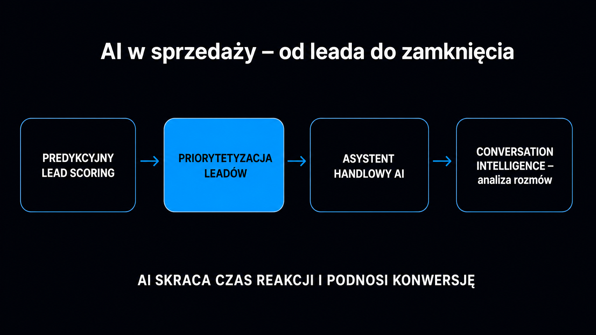

Sztuczna inteligencja zmieniła sprzedaż w sposób zauważalny i mierzalny: firmy, które wdrożyły predykcyjny lead scoring (automatyczną ocenę potencjału klientów przez algorytmy), skracają czas reakcji na zapytanie z przeciętnych 47 godzin do kilku minut, a wskaźnik wygranych transakcji rośnie średnio o 30%. Jeśli Twój zespół handlowy nadal ręcznie sortuje leady i pisze kolejne wiadomości (tzw. follow-upy) z szablonu – ten artykuł pokazuje, od czego zacząć, co wdrożyć i czego realnie oczekiwać.

## Czym jest lead scoring i dlaczego klasyczny model zawodzi

Lead scoring to system oceny punktowej, który decyduje, które kontakty zasługują na natychmiastowy telefon handlowca, a które wymagają dalszego „podgrzewania". Tradycyjna wersja – reguły statyczne, ręcznie ustalane progi – daje każdemu otwarciu e-maila te same 5 punktów, niezależnie od kontekstu. Efekt: handlowcy dzwonią do zimnych leadów i przepuszczają gorące.

**Predykcyjny lead scoring oparty na [uczeniu maszynowym](https://pl.wikipedia.org/wiki/Uczenie_maszynowe) zastępuje reguły modelem, który sam wykrywa wzorce korelacji ukryte przed ludzkim analitykiem.** Algorytm pobiera dane demograficzne (stanowisko, lokalizacja), firmograficzne (wielkość firmy, branża, przychody), behawioralne (aktywność na stronie, kliknięcia w kampaniach) i zewnętrzne sygnały intencji zakupowych – a następnie przypisuje każdemu kontaktowi dynamiczny wynik w skali 0–100.

Trzy przedziały scoringowe, które wyznaczają różne ścieżki działania:

- **Wysoki wynik (80–100 pkt.)** – silne sygnały zakupowe; kontakt gotowy do rozmowy handlowej, wymaga szybkiej reakcji
- **Średni wynik (50–79 pkt.)** – umiarkowane zainteresowanie; wymaga dalszej sekwencji edukacyjnej (nurturingowej) przed przekazaniem do sprzedaży
- **Niski wynik (0–49 pkt.)** – brak intencji lub zbyt wczesny etap ścieżki zakupowej; kontakt pozostaje w automatycznym lejku marketingowym

Model nie jest statyczny. Każda transakcja zamknięta lub przegrana dostarcza nowych danych treningowych. Gdy handlowcy systematycznie oznaczają wyniki – „wysoki scoring, ale brak konwersji" albo „niski scoring, ale kupił" – model jest na bieżąco douczany, a jego precyzja rośnie.

## Platformy scoringowe – co wybrać i ile to kosztuje

Wybór narzędzia zależy od skali operacji i gotowości technicznej zespołu. Poniższa tabela porządkuje najważniejsze opcje rynkowe.

| Platforma | Model licencjonowania | Koszt orientacyjny | Dla kogo |
|---|---|---|---|
| Google Analytics 4 | Freemium, wbudowany | Bez opłat (wersja podstawowa) | Startupy, testy koncepcji |
| HubSpot Predictive Scoring | Subskrypcja (w pakietach klasy Enterprise) | od ok. 5 000 do 15 000+ PLN/mies. | MŚP i duże organizacje z już wdrożonym HubSpotem |
| Salesforce Einstein | Per użytkownik (jako dodatek) | od 200 do 2 000+ PLN/użytk./mies. | Korporacje z CRM Salesforce |
| Własny model ML (data science) | Projekt/setup | 5 000–20 000 PLN jednorazowo | Firmy z wewnętrznym zespołem danych |
| DMSales | Subskrypcja, integracja z KRS/CEIDG | Wyceny indywidualne | Polskie firmy B2B, prospecting lokalny |

Sama technologia nie wystarczy. **Przed wdrożeniem scoringu zadbaj o higienę danych w CRM – duplikaty, puste pola i błędne przypisania branż bezpośrednio obniżają jakość i skuteczność działania modelu.** Pierwsze mierzalne korzyści pojawiają się po kilku miesiącach; pełna transformacja procesowa to horyzont 2–3 lat systematycznej pracy.

Jeśli chcesz porównać, jak Twoja marka wypada w kontekście AI i sprzedaży B2B, darmowy [brand check](/narzedzia/brand-check) w kilkadziesiąt sekund pokaże, jak jesteś postrzegany przez cztery silniki AI.

## Asystenci handlowi AI – co robią zamiast handlowca

Autonomiczny asystent handlowy (często nazywany AI SDR – Sales Development Representative) to nie chatbot na stronie. To system, który samodzielnie wykonuje wieloetapową sekwencję zadań: buduje profil prospekta, wysyła spersonalizowane wiadomości, buduje reputację konta e-mailowego, monitoruje odpowiedzi i inicjuje kolejne kontakty – bez angażowania człowieka do momentu, gdy lead wyrazi zainteresowanie rozmową.

Dlaczego czas reakcji jest tak ważny? **Kontakt z leadem w ciągu pierwszych 5 minut od rejestracji podnosi prawdopodobieństwo skutecznej kwalifikacji aż 21-krotnie w porównaniu z odpowiedzią po 30 minutach.** Tymczasem przeciętna firma reaguje po 47 godzinach. Asystent AI eliminuje tę przepaść, bo działa 24/7 bez opóźnień.

Praktyczne funkcje, które najczęściej wdraża się w polskich firmach B2B:

- **Automatyczna personalizacja wiadomości** – asystent dopasowuje ton i treść do branży, stanowiska i historii aktywności kontaktu
- **Rozgrzewanie domen (email warm-up)** – systematyczne rozsyłanie i obsługiwanie poczty, które buduje reputację domeny i zwiększa dostarczalność
- **Analiza sentymentu** – wykrywanie emocjonalnego zaangażowania rozmówcy w czasie rzeczywistym; 41% handlowców stosuje ją już regularnie
- **Automatyczne podsumowania CRM** – po każdej rozmowie system generuje notatkę i przypisuje zadania, bez ręcznego uzupełniania
- **Wieloetapowe sekwencje przypominające** – asystent pamięta, kiedy kontaktować się ponownie, i robi to automatycznie

<aside class="callout-fact">
  
✦

  

    
Dane

    
Firmy stosujące automatycznych asystentów handlowych odnotowują średnio 30% poprawę ogólnego wskaźnika wygranych transakcji. Szansa na skuteczną kwalifikację leada wzrasta 21-krotnie, gdy pierwszy kontakt nastąpi w ciągu zaledwie 5 minut od przesłania zgłoszenia. <strong>W jednym z polskich wdrożeń B2B połączono identyfikację firm odwiedzających stronę z aktywnym nawiązywaniem kontaktów na LinkedIn – liczba kwalifikowanych spotkań wzrosła z 15 do 45 miesięcznie.</strong>

  

</aside>

## Narzędzia Conversation Intelligence – analiza rozmów przez AI

Analityka konwersacyjna (Conversation Intelligence) to klasa narzędzi, które nagrywają, transkrybują i analizują rozmowy handlowe – spotkania wideo, telefony, prezentacje produktowe (tzw. demo). Model AI wskazuje ryzyka transakcyjne, ocenia zaangażowanie rozmówcy i generuje ustrukturyzowane notatki według ram metodologicznych takich jak BANT czy MEDDIC.

**Liderzy rynku enterprise, tacy jak Gong, automatyzują od 60 do 65% czynności administracyjnych handlowca** – to czas, który wraca z powrotem do sprzedaży. Demodesk transkrybuje rozmowy w 98 językach i według danych dostawcy pozwolił zespołom zaoszczędzić łącznie 6 700 godzin pracy administracyjnej. Na polskim rynku narzędzia głosowe – voiceboty natywnie obsługujące język polski, jak Sovva – to koszt od około 1 000 do kilku tysięcy PLN miesięcznie, co czyni je realną opcją dla MŚP, które nie potrzebują potężnego ekosystemu korporacyjnego.

Trzy scenariusze, w których analityka konwersacyjna zwraca się najszybciej:

- **Coaching sprzedażowy** – menedżer widzi, że w 80% przegranych transakcji brakuje kontaktu z decydentem po stronie klienta; wzorzec ten jest widoczny w danych i nie wymaga przesłuchiwania dziesiątek nagrań
- **Powtarzalne obiekcje** – system identyfikuje, że w 40% rozmów pojawia się ten sam zarzut dotyczący ceny; to wyraźny sygnał do przebudowy prezentacji sprzedażowej (tzw. pitch decka)
- **Onboarding nowych handlowców** – nowi pracownicy uczą się na transkrypcjach najlepszych rozmów, znacznie skracając czas własnego wdrożenia (ramp-up)

Więcej o tym, jak AI przetwarza dane klientów i gdzie kończy się automatyzacja, a zaczyna rola człowieka, znajdziesz w przewodniku po [AI w obsłudze klienta](/ai-w-biznesie/ai-w-obsludze-klienta).

## Polskie wdrożenia – co działa na lokalnym rynku

Polski rynek sprzedaży B2B ma własną specyfikę: RODO jako twarda rama prawna, integracja z rejestrami KRS/CEIDG jako źródło danych firmograficznych oraz relatywnie mała liczba dużych platform CRM z natywnym wsparciem dla polskiego języka.

Livespace CRM wdrożył pod koniec 2024 roku Asystenta AI, który analizuje konwersje na poszczególnych etapach lejka i streszcza notatki handlowców przekraczające 200 znaków. Ważna kwestia bezpieczeństwa: dane są przesyłane do modeli OpenAI przez interfejs API w trybie, który nie pozwala na wykorzystanie poufnych notatek do publicznego trenowania algorytmów. DMSales z kolei integruje się bezpośrednio z KRS i CEIDG, umożliwiając automatyczne filtrowanie firm i wykrywanie sygnałów intencji zakupowych bez wychodzenia poza polskie rejestry.

Studia przypadków z polskiego rynku potwierdzają, że efekty są wymierne:

- **Escola (software house)** – po ujednoliceniu procesów handlowych w Livespace CRM między trzema działami: wzrost przychodów o 180% rok do roku
- **iSymbiOZE (OZE)** – optymalizacja CRM i automatyzacja zadań: wzrost konwersji sprzedażowej o 60%
- **Dealer samochodowy** – asystent AI do kwalifikacji zapytań internetowych: skrócenie czasu reakcji o 90%, wzrost zamkniętych transakcji

To nie są wyniki z pilotażowych środowisk testowych. To wdrożenia produkcyjne.

<aside class="callout-expert">
  

  

    
Opinia eksperta

    
W projektach, które realizuję w ICEA, najczęstszy błąd to wdrażanie scoringu AI na brudnych danych CRM. Firmy spędzają tygodnie na konfiguracji modelu, a on i tak zwraca bezwartościowe dane, bo połowa rekordów ma puste pole „branża" albo trzy różne wersje nazwy tej samej firmy. <strong>Zanim zaczniesz rozmawiać z dostawcą platformy AI, zleć audyt danych CRM – to właśnie on decyduje o tym, czy wdrożenie zwróci się po 6 miesiącach, czy po 3 latach.</strong>

    
Mateusz Wiśniewski · Ekspert SEO/AI Search, ICEA

  

</aside>

## Zgodność z RODO i EU AI Act – czego nie pominąć

Systemy predykcyjnego scoringu i profilowania behawioralnego przetwarzają dane osobowe i mogą kwalifikować się jako systemy wysokiego ryzyka w rozumieniu unijnego rozporządzenia EU AI Act. To podwójny reżim prawny: RODO i AI Act działają równocześnie, a nie alternatywnie.

Trzy rzeczy, o które musisz zadbać przed startem produkcyjnym:

- **Minimalizacja danych (Art. 5 RODO)** – algorytm z natury chce więcej danych, prawo wymaga mniej; zdefiniuj z góry, które pola są niezbędne, i ogranicz zbieranie do tego zbioru
- **Aktywny nadzór ludzki (Art. 14 AI Act)** – system nie może podejmować kluczowych decyzji w pełni autonomicznie; musi istnieć mechanizm ręcznej interwencji (nadpisania decyzji) przez człowieka
- **Transparentność wobec klientów** – osoby wchodzące w interakcję z voicebotem lub chatbotem muszą wiedzieć, że rozmawiają z AI; brak informacji to naruszenie, za które grozi kara do 4% globalnego rocznego obrotu

Kary mogą się kumulować: do 7% obrotu za naruszenia AI Act plus do 4% za naruszenia RODO. Ignorowanie compliance to nie ryzyko abstrakcyjne – to konkretna ekspozycja finansowa.

Szerszy kontekst o tym, jak AI wpływa na strategie marketingowe i widoczność marek, opisuje przewodnik po [AI w marketingu](/ai-w-biznesie/ai-w-marketingu). Jeśli chcesz zrozumieć techniczne podstawy modeli, które napędzają te systemy, warto zacząć od [przewodnika po modelach LLM](/modele-llm/przewodnik) – to fundament, na którym stoi cała warstwa aplikacji sprzedażowych.
