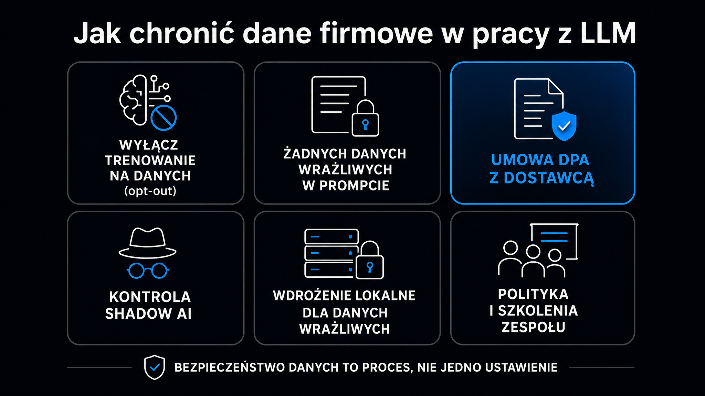

Każdy prompt, który Twój pracownik wkleja do ChatGPT, wędruje na serwery OpenAI – i domyślnie może tam zostać przez 30 dni. Badanie LayerX z 2025 roku wykazało, że 77% pracowników korzystających z AI w przedsiębiorstwach wklejało do chatbotów dane firmowe, a w 22% przypadków były to informacje poufne lub finansowe. Do tego dochodzi tzw. shadow AI (nieautoryzowane narzędzia AI, po polsku: ukryta sztuczna inteligencja), które według Menlo Security w 2025 roku wzrosło o 68% w ciągu roku. Ten artykuł wyjaśnia, gdzie naprawdę leżą ryzyka, jak działają polityki retencji danych u głównych dostawców, kiedy wybrać wdrożenie lokalne zamiast chmury i co powinna zawierać umowa DPA (Data Processing Agreement, czyli umowa o powierzeniu przetwarzania danych).

## Dlaczego LLM-y są nowym wektorem wycieku danych

Klasyczne narzędzia bezpieczeństwa – firewalle, DLP (systemy zapobiegania utracie danych), monitoring poczty – zostały zaprojektowane z myślą o innym środowisku. Dla nich ChatGPT lub Claude wygląda jak przeglądarka internetowa. Ruch wychodzi przez port 443 i jest szyfrowany protokołem TLS. Tradycyjne narzędzia widzą bezpieczne połączenie HTTPS, nie widzą natomiast, że wewnątrz przesyłany jest schemat bazy danych, kod źródłowy albo projekt umowy.

Incydent w firmie Samsung z marca 2023 roku pokazał mechanizm w działaniu. W ciągu mniej niż 20 dni trzech inżynierów popełniło trzy osobne błędy: jeden wkleił kod źródłowy oprogramowania do produkcyjnej bazy danych w poszukiwaniu poprawki błędu, drugi zoptymalizował za pomocą ChatGPT skrypty testowe zawierające zastrzeżone algorytmy, trzeci przesłał transkrypt wewnętrznego spotkania do podsumowania. Dane trafiły na serwery OpenAI, a warunki użytkowania z tamtego okresu pozwalały na ich wykorzystanie do trenowania modeli. Samsung odpowiedział natychmiastowym zakazem użycia zewnętrznych narzędzi AI.

**Dane z 2026 roku są równie niepokojące.** Raport Netskope wskazuje, że 47% pracowników używa narzędzi AI w pracy przez prywatne konta – poza jakimkolwiek nadzorem korporacyjnym. W przeciętnej organizacji liczba naruszeń polityki danych związanych z generatywną AI podwoiła się w ciągu roku i wynosi średnio 223 incydenty miesięcznie, za które odpowiada zaledwie 3% użytkowników.

Skutki finansowe są wymierne. Według badań Reco AI, 20% organizacji doświadczyło naruszenia bezpieczeństwa z powodu shadow AI, a przeciętny dodatkowy koszt takiego incydentu wyniósł 670 000 dolarów – oprócz podstawowych kosztów standardowego wycieku danych.

<aside class="callout-fact">
  
✦

  

    
Ciekawostka

    
Badanie Truffle Security z 2025 roku przeanalizowało pojedyncze zrzuty danych treningowych powszechnie używanego zbioru do uczenia modeli i znalazło ok. 12 000 aktywnych kluczy API i haseł – 63% z nich pojawiało się na wielu stronach. Oznacza to, że dane treningowe LLM-ów mogą zawierać poufne dane uwierzytelniające z publicznie dostępnych repozytoriów lub stron. <strong>Klucze API wklejone do publicznego repozytorium GitHub mogą trafić do korpusu treningowego – i zostać odtworzone przez model.</strong>

  

</aside>

## Polityki retencji danych – co mówi drobny druk

Zanim wdrożysz jakiekolwiek narzędzie AI w firmie, musisz wiedzieć, co dostawca robi z Twoimi danymi. Polityki różnią się znacząco między planami konsumenckimi a biznesowymi oraz między poszczególnymi dostawcami.

Poniższa tabela zestawia aktualne zasady retencji u czterech głównych dostawców. Dane obowiązują według stanu na maj 2026 roku:

| Dostawca | Plan konsumencki | Plan biznesowy / API | Zero Data Retention |
|---|---|---|---|
| OpenAI (ChatGPT) | Retencja do 30 dni w celach bezpieczeństwa; brak treningu na danych z API | Brak treningu na danych; retencja do 30 dni w celu monitorowania nadużyć | Dostępne w Enterprise Agreement (ZDR) |
| Anthropic (Claude) | Do 30 dni (lub do 5 lat w przypadku zgody na trening od września 2025 r.) | Brak treningu na danych z API; retencja do 7 dni (od września 2025 r.) | Dostępne na wniosek dla klientów Enterprise |
| Google (Gemini) | Modele bazowe (foundation models) domyślnie przechowują dane przez 24 h, wymagana zmiana ustawień | DPA dostępne za pośrednictwem Google Cloud; opcje przechowywania danych (data residency) w UE | Wymaga konfiguracji na poziomie projektu |
| Microsoft (Copilot) | Brak treningu na danych; ochrona na poziomie komercyjnych usług M365 | Enterprise Data Protection (EDP) automatycznie w M365 Copilot | Brak publicznego ZDR, ale EDP zapewnia izolację |

Kluczowy wniosek: **domyślne ustawienia rzadko oferują maksymalną ochronę.** Zerowa retencja danych (ang. Zero Data Retention, ZDR) – gwarancja, że dostawca nie przechowuje promptów ani odpowiedzi – wymaga negocjacji umownych i zwykle jest dostępna tylko w planach Enterprise Agreement.

Istnieje ważna różnica między retencją a treningiem. Większość dostawców już dawno przestała domyślnie trenować modele na danych klientów biznesowych. Problem polega na tym, że dane mimo to mogą być przechowywane przez 7–30 dni w celu monitorowania nadużyć – i właśnie w tym oknie może dojść do ich nieuprawnionego dostępu lub naruszenia.

### Co sprawdzić przed podpisaniem umowy

Zanim Twoja firma podpisze umowę z dostawcą LLM, podstawowa analiza due diligence obejmuje kilka obszarów:

- **Polityka treningu** – czy dostawca trenuje modele na danych z Twoich promptów? W przypadku API – zwykle nie, ale sprawdź to w warunkach pisemnych.
- **Okres retencji** – jak długo dane są przechowywane? Czy możesz skrócić ten okres lub wybrać ZDR?
- **Podwykonawcy (subprocesorzy)** – lista firm trzecich, którym dostawca przekazuje dane (hosting, CDN, moderacja treści).
- **Lokalizacja przetwarzania** – czy dane opuszczają EOG (Europejski Obszar Gospodarczy)?
- **Procedura obsługi żądań organów państwowych** – co dostawca robi, gdy otrzyma wezwanie sądowe lub nakaz od władz?

## Shadow AI – ryzyko, którego nie widać w logach

Shadow AI to używanie niezatwierdzonych narzędzi AI przez pracowników – często w dobrej wierze, w celu przyspieszenia pracy. Problem polega na tym, że 86% organizacji w badaniu Reco AI z 2025 roku przyznało, że nie ma wglądu w przepływy danych AI wewnątrz firmy.

**Skala zjawiska jest większa, niż sądzisz.** Menlo Security raportuje 68-procentowy wzrost shadow AI w 2025 roku. Blackfog Research odkryło, że 60% pracowników podejmowałoby ryzykowne decyzje dotyczące bezpieczeństwa danych, żeby dotrzymać terminów. Zaledwie odsetek organizacji ma wypracowane procedury wykrywania shadow AI.

Typowy scenariusz: specjalista ds. marketingu tworzy konto na Claude.ai przy użyciu prywatnego adresu e-mail, wkleja brief klienta i dane z CRM, żeby szybciej przygotować prezentację. Z perspektywy działu IT wygląda to jak normalny ruch HTTPS. Z perspektywy RODO to nieuprawnione powierzenie danych osobowych klientów podmiotowi trzeciemu bez umowy DPA.

Jak reagować bez represji:

- **Stwórz białą listę zatwierdzonych narzędzi** – i aktywnie ją komunikuj. Pracownicy używają shadow AI, bo nie wiedzą o alternatywach lub alternatywy są dla nich zbyt skomplikowane.
- **Wdrożenie rozwiązań korporacyjnych** – ChatGPT Enterprise, Claude for Teams lub Microsoft Copilot z EDP eliminują problem kont prywatnych; dane przepływają przez zarządzane środowisko (tenant).
- **Szkolenia kontekstowe** – nie „zakaz używania AI", ale „oto jak używać AI bezpiecznie w naszej firmie".
- **Monitoring ruchu sieciowego** – serwer pośredniczący (proxy) z inspekcją TLS pozwala zobaczyć, które domeny AI odwiedzają pracownicy.

## Umowa DPA i wymagania RODO

Każde przekazanie danych osobowych do zewnętrznego dostawcy AI wymaga umowy DPA (Data Processing Agreement, czyli umowy o powierzeniu przetwarzania danych osobowych) zgodnej z art. 28 RODO. Dotyczy to zarówno Claude API, jak i ChatGPT Enterprise, Gemini API oraz Microsoft Copilot.

DPA i DPIA to nie formalności. Urząd ICO (brytyjski organ ochrony danych) nałożył w lutym 2026 roku karę 247 590 funtów na firmę MediaLab.AI (właściciela platformy Imgur) m.in. za przetwarzanie danych dzieci bez weryfikacji wieku i zgody rodziców oraz bez przeprowadzenia oceny skutków dla ochrony danych (DPIA, ang. Data Protection Impact Assessment).

Umowa DPA z dostawcą LLM powinna zawierać co najmniej:

- **Opis czynności przetwarzania** – jakie dane, w jakim celu i przez jaki okres są przetwarzane.
- **Zakaz użycia danych do treningu modeli** – potwierdzony pisemnie, nie tylko w polityce prywatności.
- **Lista podwykonawców (subprocesorów)** – z prawem do sprzeciwu wobec zmian.
- **Standardowe klauzule umowne (SCC)** – jeśli dane opuszczają EOG, np. przy korzystaniu z serwerów w USA.
- **Procedury obsługi żądań podmiotów danych** – jak dostawca obsłuży żądanie dostępu lub usunięcia danych.
- **Obowiązki przy naruszeniu** – w jakim czasie dostawca musi poinformować o incydencie (RODO wymaga 72 godzin).

[Pseudonimizacja](https://pl.wikipedia.org/wiki/Pseudonimizacja) danych przed przekazaniem ich do LLM to dodatkowa warstwa ochrony: zamiast podawać imię i nazwisko klienta, podajesz kod „Klient_A". Model wykonuje zadanie, a Ty zachowujesz kontrolę nad kluczem do rzeczywistych danych.

<aside class="callout-expert">
  

  

    
Opinia eksperta

    
W projektach AI, które wdrażamy w ICEA, pierwsza weryfikacja zawsze dotyczy tego, co w ogóle trafia do promptu. Zaskakująco dużo firm wkleja do modelu dane klientów, takie jak imię, nazwisko i numer zamówienia – bo tak jest najszybciej. Tymczasem wystarczą dwa kroki: mapowanie identyfikatorów przed wysłaniem i odwrotne mapowanie po odpowiedzi. Model działa równie dobrze na Kliencie_001, jak i na Janie Kowalskim. <strong>Pseudonimizacja to najtańsza inwestycja w zgodność z przepisami (compliance), jaką możesz zrobić przy pracy z LLM – i jednocześnie ta, o której zapomina 90% firm.</strong>

    
Mateusz Wiśniewski · Ekspert SEO/AI Search, ICEA

  

</aside>

## Chmura vs. wdrożenie lokalne – gdzie leżą granice

Wybór między modelem chmurowym (API OpenAI/Anthropic/Google) a infrastrukturą lokalną (ang. on-premise) to dziś jedna z kluczowych decyzji architektonicznych dla firm przetwarzających wrażliwe dane.

Podstawowa zasada brzmi: chmura to szybkość i niski koszt startowy, rozwiązanie on-premise to suwerenność danych i przewidywalny koszt przy dużej skali.

Porównanie najważniejszych wymiarów:

- **Suwerenność danych** – modele lokalne (np. Llama 3, Mistral, Qwen) przetwarzają dane wyłącznie w infrastrukturze firmy; żaden prompt nie opuszcza sieci wewnętrznej.
- **Koszt tokenów** – uruchomienie modelu z otwartymi wagami (open-weight) lokalnie może być nawet 18-krotnie tańsze per milion tokenów niż API komercyjne przy dużej skali.
- **Jakość modelu** – modele open-source nadal ustępują GPT-4o czy Claude 3.5 Sonnet w zadaniach wymagających złożonego wnioskowania; luka maleje, ale istnieje.
- **Infrastruktura** – wdrożenie on-premise wymaga znaczących nakładów: serwery GPU (np. NVIDIA A100 lub H100), MLOps, zarządzanie aktualizacjami modeli.
- **Zgodność z przepisami (compliance)** – rozwiązanie on-premise naturalnie spełnia wymogi art. 25 RODO (privacy by design); zgodność z RODO obejmuje przede wszystkim lokalizację przetwarzania i dostęp do danych.

**Znaczna część infrastruktury AI w ściśle regulowanym sektorze finansowym działa już poza chmurą publiczną.** To nie ideologia, to kalkulacja: bank, który przetwarza miliony zapytań dziennie, musi kontrolować zarówno koszty, jak i lokalizację danych klientów.

Podejście hybrydowe coraz częściej jest odpowiedzią dla firm ze środkowej półki: wrażliwe dane i produkcja – on-premise, zadania o niskim ryzyku i eksperymenty – API w chmurze. Dobra architektura [RAG (generowania wspomaganego wyszukiwaniem)](/rag/przewodnik/) pozwala połączyć oba światy: baza wektorowa z dokumentami firmowymi działa lokalnie, a model odpytuje ją bez konieczności wysyłania surowych danych.

## Jak zbudować politykę bezpieczeństwa AI w organizacji

Firmy, które nie mają formalnej polityki użycia AI, tworzą środowisko, w którym pracownicy działają według własnego wyczucia. Zaledwie połowa przedsiębiorstw ma jakiekolwiek formalne zasady regulujące użycie narzędzi AI.

Polityka bezpieczeństwa AI nie musi być dokumentem liczącym 80 stron. Dobry punkt startowy to pięć konkretnych decyzji:

- **Biała lista narzędzi** – lista zatwierdzonych platform z informacją, do jakich zadań i danych wolno ich używać (np. Claude for Teams: OK dla redakcji treści, NIE dla danych klientów bez pseudonimizacji).
- **Klasyfikacja danych** – podział danych firmowych na poziomy wrażliwości i mapowanie ich na dozwolone narzędzia AI (dane publiczne → dowolne API; dane klientów → tylko zatwierdzone API z DPA lub rozwiązanie on-premise).
- **Zasada minimalizacji w promptach** – pracownicy nie przekazują do modelu więcej danych, niż jest to niezbędne do wykonania zadania; żadnych numerów PESEL, NIP, pełnych zestawów danych klientów.
- **Centralne środowisko (tenant) AI** – zamiast kont prywatnych, organizacja wykupuje licencję enterprise i zarządza dostępem przez SSO (Single Sign-On).
- **Regularne audyty** – kwartalny przegląd narzędzi faktycznie używanych przez pracowników i porównanie z białą listą.

Kwestię zgodności z regulacjami (compliance) – wymagania AI Act i RODO, w tym harmonogram obowiązków – szczegółowo omawia artykuł [AI Act i RODO](/ai-w-biznesie/ai-act-rodo/). Warto go przeczytać równolegle, bo polityka bezpieczeństwa AI jest praktyczną implementacją tamtych wymogów prawnych.

Jeśli planujesz wdrożenie LLM i chcesz sprawdzić, jak marka Twojej firmy wygląda w odpowiedziach modeli generatywnych zanim przejdziesz do architektury danych, darmowe narzędzie [Widoczność marki w AI](/narzedzia/brand-check/) odpyta cztery silniki AI o Twoją markę i pokaże aktualny stan widoczności – przydatny punkt odniesienia przed większymi inwestycjami.

Decyzje dotyczące bezpieczeństwa danych i wyboru modelu wdrożenia są nierozłącznie związane z szerszą strategią AI. Kompletny przegląd modeli dostępnych w latach 2025–2026 i ich parametrów znajdziesz w [przewodniku po modelach LLM](/modele-llm/przewodnik/) – w tym omówienie różnic między modelami otwartymi a komercyjnymi, które mają bezpośrednie przełożenie na decyzje o środowisku on-premise.
