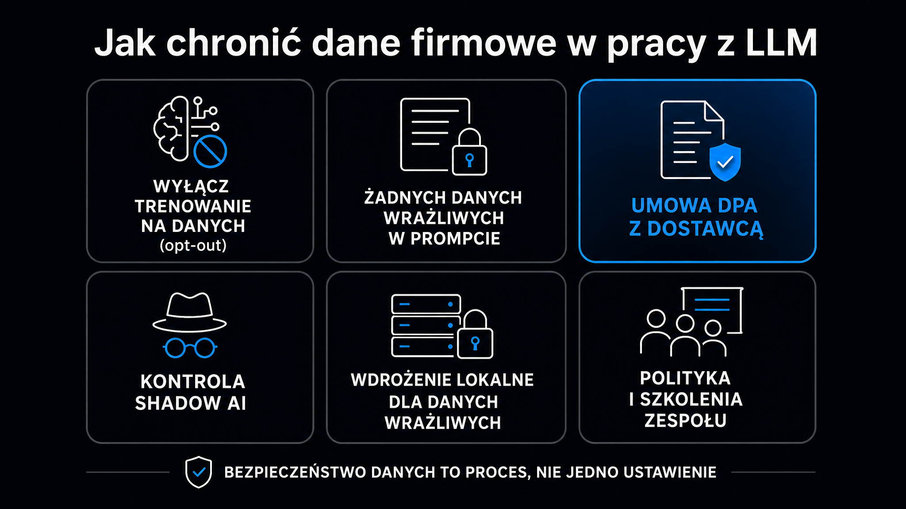

Każdy prompt, który Twój pracownik wkleja do ChatGPT, wędruje na serwery OpenAI – i domyślnie może tam zostać przez 30 dni. **Raport LayerX z 2025 roku wskazuje, że 77% pracowników wkleja dane do promptów generatywnej AI, a 82% takich operacji odbywa się z kont niezarządzanych przez firmę.** Do tego dochodzi tzw. shadow AI (nieautoryzowane narzędzia AI, po polsku: ukryta sztuczna inteligencja). Ten artykuł wyjaśnia, gdzie naprawdę leżą ryzyka, jak działają polityki retencji danych u głównych dostawców, kiedy wybrać wdrożenie lokalne zamiast chmury i co powinna zawierać umowa DPA (Data Processing Agreement, czyli umowa o powierzeniu przetwarzania danych).

## Dlaczego LLM-y są nowym wektorem wycieku danych?

Klasyczne narzędzia bezpieczeństwa – firewalle, DLP (systemy zapobiegania utracie danych), monitoring poczty – zaprojektowano z myślą o zupełnie innym środowisku. Dla nich ChatGPT lub Claude wygląda jak zwykła przeglądarka internetowa. Ruch wychodzi przez port 443 i jest szyfrowany protokołem TLS. **Tradycyjne systemy widzą bezpieczne połączenie HTTPS, ale nie dostrzegają, że wewnątrz przesyłany jest schemat bazy danych, kod źródłowy albo projekt umowy.**

Incydent w firmie Samsung z marca 2023 roku świetnie pokazał ten mechanizm w działaniu. W ciągu zaledwie 20 dni trzech inżynierów popełniło trzy osobne błędy. Jeden wkleił kod źródłowy oprogramowania do produkcyjnej bazy danych, szukając poprawki. Drugi zoptymalizował za pomocą ChatGPT skrypty testowe zawierające zastrzeżone algorytmy. Trzeci przesłał transkrypt wewnętrznego spotkania do podsumowania. Dane trafiły na serwery OpenAI, a ówczesne warunki użytkowania pozwalały na ich wykorzystanie do trenowania modeli. **W maju 2023 roku Samsung wprowadził tymczasowy zakaz korzystania z generatywnej AI na firmowych urządzeniach.**

Dane z 2026 roku są równie niepokojące. **Raport Netskope Cloud and Threat Report 2026 wskazuje, że 47% użytkowników generatywnej AI korzysta z prywatnych aplikacji AI – poza nadzorem firmy.** W przeciętnej organizacji liczba naruszeń polityki danych związanych z generatywną AI podwoiła się w ciągu roku. Wynosi średnio 223 incydenty miesięcznie, za które odpowiada zaledwie 3% użytkowników.

Skutki finansowe są bardzo wymierne. **Według raportu IBM Cost of a Data Breach 2025 co piąta organizacja doświadczyła naruszenia bezpieczeństwa z powodu shadow AI, a wysoki poziom shadow AI podnosił koszt naruszenia średnio o ok. 670 000 dolarów.**

<aside class="callout-fact">
  
✦

  

    
Ciekawostka

    
Badanie Truffle Security z 2025 roku przeanalizowało pojedyncze zrzuty danych treningowych powszechnie używanego zbioru do uczenia modeli i znalazło ok. 12 000 aktywnych kluczy API i haseł – 63% z nich pojawiało się na wielu stronach. Oznacza to, że dane treningowe LLM-ów mogą zawierać poufne dane uwierzytelniające z publicznie dostępnych repozytoriów lub stron. <strong>Klucze API wklejone do publicznego repozytorium GitHub mogą trafić do korpusu treningowego – i zostać odtworzone przez model.</strong>

  

</aside>

## Polityki retencji danych – co mówi drobny druk

**Zanim wdrożysz jakiekolwiek narzędzie AI w firmie, musisz wiedzieć, co dostawca robi z Twoimi danymi.** Polityki różnią się znacząco między planami konsumenckimi a biznesowymi oraz między poszczególnymi dostawcami.

Poniższa tabela zestawia aktualne zasady retencji u czterech głównych dostawców. Dane obowiązują według stanu na wrzesień 2026 roku:

| Dostawca | Plan konsumencki | Plan biznesowy / API | Zero Data Retention |
|---|---|---|---|
| OpenAI (ChatGPT) | Historia czatów przechowywana do usunięcia; rozmowy mogą służyć do trenowania, dopóki nie wyłączysz tej opcji; czaty tymczasowe usuwane po 30 dniach | API: brak treningu na danych; logi monitorowania nadużyć do 30 dni | Dla API po akceptacji OpenAI (ZDR) |
| Anthropic (Claude) | Do 30 dni (lub do 5 lat w przypadku zgody na trening od września 2025 r.) | Brak treningu na danych z API; standardowo usuwanie w ciągu 30 dni | Dostępne po uzgodnieniu z Anthropic |
| Google (Gemini) | Aktywność domyślnie przechowywana 18 miesięcy i może służyć do ulepszania modeli; po wyłączeniu aktywności czaty przechowywane 72 h | Gemini API (płatny poziom): brak użycia promptów do ulepszania produktów, opcjonalne logi do 55 dni; DPA i opcje lokalizacji danych w UE przez Google Cloud | Wymaga konfiguracji na poziomie projektu |
| Microsoft (Copilot) | Brak treningu na danych; ochrona na poziomie komercyjnych usług M365 | Enterprise Data Protection (EDP) automatycznie w M365 Copilot | Brak publicznego ZDR, ale EDP zapewnia izolację |

**Kluczowy wniosek jest prosty: domyślne ustawienia rzadko oferują maksymalną ochronę.** Zerowa retencja danych (ang. Zero Data Retention, ZDR) – gwarancja, że dostawca nie przechowuje promptów ani odpowiedzi – wymaga negocjacji umownych i zwykle jest dostępna tylko w planach Enterprise Agreement.

Istnieje ważna różnica między retencją a treningiem. Większość dostawców już dawno przestała domyślnie trenować modele na danych klientów biznesowych. **Problem polega na tym, że dane mimo to mogą być przechowywane przez kilkadziesiąt dni (zwykle do 30) w celu monitorowania nadużyć – i właśnie w tym oknie może dojść do ich nieuprawnionego dostępu lub naruszenia.**

### Co sprawdzić przed podpisaniem umowy?

Zanim Twoja firma podpisze umowę z dostawcą LLM, podstawowa analiza due diligence obejmuje kilka kluczowych obszarów:

- **Polityka treningu** – czy dostawca trenuje modele na danych z Twoich promptów? W przypadku API zwykle nie, ale sprawdź to w warunkach pisemnych.
- **Okres retencji** – jak długo dane są przechowywane? Czy możesz skrócić ten okres lub wybrać ZDR?
- **Podwykonawcy (subprocesorzy)** – lista firm trzecich, którym dostawca przekazuje dane (hosting, CDN, moderacja treści).
- **Lokalizacja przetwarzania** – czy dane opuszczają EOG (Europejski Obszar Gospodarczy)?
- **Procedura obsługi żądań organów państwowych** – co dostawca robi, gdy otrzyma wezwanie sądowe lub nakaz od władz?

## Shadow AI – ryzyko, którego nie widać w logach

Shadow AI to używanie niezatwierdzonych narzędzi AI przez pracowników – często w dobrej wierze, w celu przyspieszenia pracy. **Problem polega na tym, że dział IT zwykle nie ma wglądu w to, jakie dane trafiają do takich narzędzi.**

Skala zjawiska jest znacznie większa, niż sądzisz. **Choć według Netskope odsetek użytkowników korzystających z prywatnych aplikacji AI spadł w ciągu roku z 78% do 47%, liczba naruszeń polityki danych związanych z generatywną AI w tym samym czasie się podwoiła.**

Typowy scenariusz. Specjalista ds. marketingu tworzy konto na Claude.ai przy użyciu prywatnego adresu e-mail. Wkleja brief klienta i dane z CRM, żeby szybciej przygotować prezentację. Z perspektywy działu IT wygląda to jak normalny ruch HTTPS. **Z perspektywy RODO to nieuprawnione powierzenie danych osobowych klientów podmiotowi trzeciemu bez umowy DPA.**

Jak reagować bez represji:

- **Stwórz białą listę zatwierdzonych narzędzi** – i aktywnie ją komunikuj. Pracownicy używają shadow AI, bo nie wiedzą o alternatywach lub alternatywy są dla nich zbyt skomplikowane.
- **Wdrożenie rozwiązań korporacyjnych** – ChatGPT Enterprise, Claude for Teams lub Microsoft Copilot z EDP eliminują problem kont prywatnych, a dane przepływają przez zarządzane środowisko (tenant).
- **Szkolenia kontekstowe** – nie „zakaz używania AI", ale „oto jak używać AI bezpiecznie w naszej firmie".
- **Monitoring ruchu sieciowego** – serwer pośredniczący (proxy) z inspekcją TLS pozwala zobaczyć, które domeny AI odwiedzają pracownicy.

## Umowa DPA i wymagania RODO

**Każde przekazanie danych osobowych do zewnętrznego dostawcy AI wymaga umowy DPA (Data Processing Agreement, czyli umowy o powierzeniu przetwarzania danych osobowych) zgodnej z art. 28 RODO.** Dotyczy to zarówno Claude API, jak i ChatGPT Enterprise, Gemini API oraz Microsoft Copilot.

DPA i DPIA (ang. Data Protection Impact Assessment, ocena skutków dla ochrony danych) to nie tylko puste formalności – brak umowy powierzenia to naruszenie art. 28 RODO, za które odpowiada administrator.

Umowa DPA z dostawcą LLM powinna zawierać co najmniej:

- **Opis czynności przetwarzania** – jakie dane, w jakim celu i przez jaki okres są przetwarzane.
- **Zakaz użycia danych do treningu modeli** – potwierdzony pisemnie, nie tylko w polityce prywatności.
- **Lista podwykonawców (subprocesorów)** – z prawem do sprzeciwu wobec zmian.
- **Standardowe klauzule umowne (SCC)** – jeśli dane opuszczają EOG, np. przy korzystaniu z serwerów w USA.
- **Procedury obsługi żądań podmiotów danych** – jak dostawca obsłuży żądanie dostępu lub usunięcia danych.
- **Obowiązki przy naruszeniu** – w jakim czasie dostawca musi poinformować o incydencie (RODO wymaga 72 godzin).

[Pseudonimizacja](https://pl.wikipedia.org/wiki/Pseudonimizacja) danych przed przekazaniem ich do LLM to dodatkowa warstwa ochrony. Zamiast podawać imię i nazwisko klienta, podajesz kod „Klient_A". **Model wykonuje zadanie, a Ty zachowujesz pełną kontrolę nad kluczem do rzeczywistych danych.**

<aside class="callout-expert">
  

  

    
Opinia eksperta

    
W projektach AI, które wdrażamy w ICEA, pierwsza weryfikacja zawsze dotyczy tego, co w ogóle trafia do promptu. Zaskakująco dużo firm wkleja do modelu dane klientów, takie jak imię, nazwisko i numer zamówienia – bo tak jest najszybciej. Tymczasem wystarczą dwa kroki: mapowanie identyfikatorów przed wysłaniem i odwrotne mapowanie po odpowiedzi. Model działa równie dobrze na Kliencie_001, jak i na Janie Kowalskim. <strong>Pseudonimizacja to najtańsza inwestycja w zgodność z przepisami (compliance), jaką możesz zrobić przy pracy z LLM – i jednocześnie ta, o której wiele firm zapomina.</strong>

    
Mateusz Wiśniewski · Ekspert SEO/AI Search, ICEA

  

</aside>

## Chmura vs. wdrożenie lokalne – gdzie leżą granice

**Wybór między modelem chmurowym (API OpenAI/Anthropic/Google) a infrastrukturą lokalną (ang. on-premise) to dziś jedna z kluczowych decyzji architektonicznych dla firm przetwarzających wrażliwe dane.**

Podstawowa zasada brzmi prosto. Chmura to szybkość i niski koszt startowy, natomiast rozwiązanie on-premise to suwerenność danych i przewidywalny koszt przy dużej skali.

Porównanie najważniejszych wymiarów:

- **Suwerenność danych** – modele lokalne (np. Llama 3, Mistral, Qwen) przetwarzają dane wyłącznie w infrastrukturze firmy, a żaden prompt nie opuszcza sieci wewnętrznej.
- **Koszt tokenów** – przy dużej i stałej skali uruchomienie modelu z otwartymi wagami (open-weight) lokalnie może obniżyć koszt miliona tokenów względem komercyjnego API, ale opłaca się dopiero po uwzględnieniu kosztu sprzętu i utrzymania.
- **Jakość modelu** – modele open-source nadal ustępują flagowcom pokroju GPT-5.6 Sol czy Claude Opus 5 w zadaniach wymagających złożonego wnioskowania (luka maleje, ale wciąż istnieje).
- **Infrastruktura** – wdrożenie on-premise wymaga znaczących nakładów, takich jak serwery GPU (np. NVIDIA A100 lub H100), MLOps i zarządzanie aktualizacjami modeli.
- **Zgodność z przepisami (compliance)** – rozwiązanie on-premise naturalnie spełnia wymogi art. 25 RODO (privacy by design), a zgodność z RODO obejmuje tu przede wszystkim lokalizację przetwarzania i dostęp do danych.

**Znaczna część infrastruktury AI w ściśle regulowanym sektorze finansowym działa już poza chmurą publiczną.** To nie ideologia, to czysta kalkulacja. Bank, który przetwarza miliony zapytań dziennie, musi kontrolować zarówno koszty, jak i lokalizację danych klientów.

Podejście hybrydowe coraz częściej staje się odpowiedzią dla firm ze środkowej półki. Wrażliwe dane i produkcja zostają on-premise, natomiast zadania o niskim ryzyku i eksperymenty trafiają do API w chmurze. **Dobra architektura [RAG (generowania wspomaganego wyszukiwaniem)](/rag/przewodnik/) pozwala połączyć oba światy: baza wektorowa z dokumentami firmowymi działa lokalnie, a model odpytuje ją bez konieczności wysyłania surowych danych.**

## Jak zbudować politykę bezpieczeństwa AI w organizacji?

**Firmy, które nie mają formalnej polityki użycia AI, tworzą środowisko, w którym pracownicy działają wyłącznie według własnego wyczucia.** Według IBM aż 63% organizacji, które doświadczyły naruszenia, nie ma polityki zarządzania AI albo dopiero ją tworzy.

Polityka bezpieczeństwa AI wcale nie musi być dokumentem liczącym 80 stron. Dobry punkt startowy to pięć konkretnych decyzji:

- **Biała lista narzędzi** – lista zatwierdzonych platform z informacją, do jakich zadań i danych wolno ich używać (np. Claude for Teams: OK dla redakcji treści, NIE dla danych klientów bez pseudonimizacji).
- **Klasyfikacja danych** – podział danych firmowych na poziomy wrażliwości i mapowanie ich na dozwolone narzędzia AI (dane publiczne → dowolne API; dane klientów → tylko zatwierdzone API z DPA lub rozwiązanie on-premise).
- **Zasada minimalizacji w promptach** – pracownicy nie przekazują do modelu więcej danych, niż jest to absolutnie niezbędne do wykonania zadania (żadnych numerów PESEL, NIP, pełnych zestawów danych klientów).
- **Centralne środowisko (tenant) AI** – zamiast kont prywatnych, organizacja wykupuje licencję enterprise i zarządza dostępem przez SSO (Single Sign-On).
- **Regularne audyty** – kwartalny przegląd narzędzi faktycznie używanych przez pracowników i porównanie ich z białą listą.

Kwestię zgodności z regulacjami (compliance) – wymagania AI Act i RODO, w tym harmonogram obowiązków – szczegółowo omawia artykuł [AI Act i RODO](/ai-w-biznesie/ai-act-rodo/). Warto go przeczytać równolegle, ponieważ polityka bezpieczeństwa AI to w gruncie rzeczy praktyczna implementacja tamtych wymogów prawnych.

Jeśli planujesz wdrożenie LLM, warto sprawdzić, jak marka Twojej firmy wygląda w odpowiedziach modeli generatywnych, zanim w ogóle przejdziesz do architektury danych. **Darmowe narzędzie [Widoczność marki w AI](/narzedzia/brand-check/) odpyta cztery silniki AI o Twoją markę i pokaże aktualny stan widoczności.** To niezwykle przydatny punkt odniesienia przed większymi inwestycjami.

Decyzje dotyczące bezpieczeństwa danych i wyboru modelu wdrożenia są nierozłącznie związane z szerszą strategią AI. Kompletny przegląd modeli dostępnych w latach 2025–2026 i ich parametrów znajdziesz w [przewodniku po modelach LLM](/modele-llm/przewodnik/). Obejmuje on omówienie różnic między modelami otwartymi a komercyjnymi, które mają bezpośrednie przełożenie na decyzje o środowisku on-premise.
