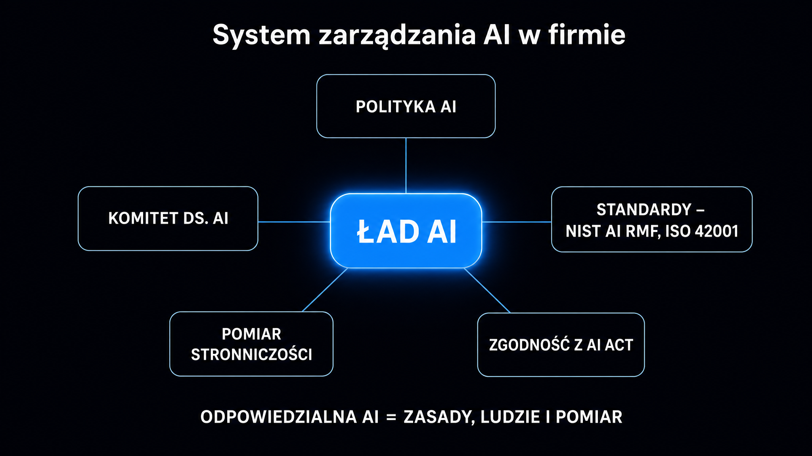

99% organizacji z badania EY (2025) odnotowało straty finansowe przez ryzyka związane z AI. Prawie dwie trzecie z nich przekroczyły milion dolarów. Jednocześnie 77% firm deklaruje budowę programów zarządzania sztuczną inteligencją, ale zaledwie 36% wdrożyło sformalizowane ramy. Luka między deklaracjami a działaniem jest ogromna. Zobacz, czym jest odpowiedzialna sztuczna inteligencja (ang. *responsible AI*) w praktyce firmowej. Dowiesz się, jakie polityki musisz napisać, kto powinien za nie odpowiadać i jak AI Act wyznacza ramy, których po prostu nie możesz zignorować.

## Czym jest odpowiedzialna sztuczna inteligencja i dlaczego nie jest to kwestia PR?

Odpowiedzialna AI to zestaw zasad, procesów i mechanizmów kontrolnych. Zapewniają one, że systemy sztucznej inteligencji działają zgodnie z wartościami Twojej firmy, prawem i oczekiwaniami interesariuszy. To nie slogan. **To konkretna lista decyzji – kto może wdrożyć model, jakie dane wolno mu przetwarzać, kto weryfikuje wyniki i co się dzieje w przypadku błędu.**

Microsoft, Google i IBM opublikowały własne zestawy zasad odpowiedzialnej AI. Różnią się detalami, ale zawsze opierają na sześciu fundamentach:

- **Uczciwość** – system nie faworyzuje ani nie dyskryminuje grup na podstawie płci, rasy, wieku czy miejsca zamieszkania.
- **Transparentność** – użytkownicy wiedzą, że mają do czynienia z AI, a decyzje algorytmu są wyjaśnialne (ang. *explainable AI*, w skrócie XAI).
- **Odpowiedzialność** – zawsze istnieje konkretna osoba lub jednostka odpowiedzialna za skutki działania systemu.
- **Bezpieczeństwo i niezawodność** – system działa przewidywalnie i nie generuje szkód w nieprzewidzianych warunkach.
- **Ochrona prywatności** – dane osobowe przetwarzane są zgodnie z RODO i wyłącznie w niezbędnym zakresie.
- **Inkluzywność** – system jest zaprojektowany tak, by nie wykluczać użytkowników z powodów technicznych lub społecznych.

**Gartner szacuje, że 85% projektów AI kończy się niepowodzeniem lub błędnymi wynikami – nie z powodu awarii technicznych, lecz przez problemy z etyką, transparentnością lub zarządzaniem danymi.** To oznacza jedno. Ramy etyczne są dziś równie ważne, co infrastruktura chmurowa.

## Stronniczość algorytmów – gdzie tkwi ryzyko i jak je mierzyć

Stronniczość algorytmiczna (ang. *algorithmic bias*) to systematyczny błąd systemu AI, który prowadzi do niesprawiedliwego traktowania określonych grup. Skąd się bierze? Pojawia się, gdy dane treningowe odzwierciedlają historyczne nierówności. Występuje też wtedy, gdy zestaw cech wejściowych zawiera zmienne zastępcze (np. kod pocztowy jako proxy statusu majątkowego) albo gdy model testowano wyłącznie na jednej grupie demograficznej.

Przykłady z praktyki są dobrze udokumentowane. Algorytm rekrutacyjny Amazona, wycofany w 2018 roku, dyskryminował kobiety, bo uczył się na życiorysach historycznie zdominowanych przez mężczyzn. **Z kolei systemy oceny zdolności kredytowej w USA systematycznie gorzej wyceniały ryzyko w dzielnicach zamieszkałych przez mniejszości etniczne – nawet po usunięciu rasy z zestawu cech.**

Stronniczość algorytmiczna przybiera różne formy w zależności od branży. Zobacz, w jakich obszarach biznesowych to zjawisko występuje najczęściej i jakimi wskaźnikami możesz je zmierzyć.

| Obszar | Typowe ryzyko stronniczości | Metryki kontrolne |
|---|---|---|
| Rekrutacja i HR | Dyskryminacja ze względu na płeć, wiek, pochodzenie | Parytety odrzuceń dla poszczególnych grup demograficznych |
| Ocena kredytowa | Proxy cech chronionych (kod pocztowy, zawód) | Wskaźnik zróżnicowanego wpływu (ang. *disparate impact ratio*, DI ≥ 0,8) |
| Obsługa klienta | Gorsze odpowiedzi dla określonych języków lub dialektów | Wskaźnik rozwiązanych problemów dla poszczególnych języków/regionów |
| Diagnostyka medyczna | Niedoreprezentowanie grup w danych treningowych | Czułość i swoistość dla poszczególnych grup demograficznych |
| Moderacja treści | Asymetryczne decyzje dla różnych grup | Wyniki fałszywie pozytywne dla poszczególnych kategorii treści |

Narzędzia do pomiaru stronniczości, takie jak [wyjaśnialna sztuczna inteligencja](https://pl.wikipedia.org/wiki/Wyja%C5%9Bnialna_sztuczna_inteligencja) (XAI – Explainable AI) metodami SHAP (Shapley Additive Explanations) i LIME (Local Interpretable Model-agnostic Explanations), pozwalają zidentyfikować wagi poszczególnych zmiennych. Dzięki nim wiesz, które cechy wejściowe mają największy wpływ na decyzję modelu. To absolutny punkt wyjścia każdego audytu.

**Audyt stronniczości to nie jednorazowe zadanie, ale proces ciągłego monitorowania.** Modele ulegają dryfowi (ang. *model drift*) wraz ze zmianą danych rzeczywistych. Model oceniający ryzyko kredytowe w 2023 roku może być stronniczy w 2026, ponieważ struktura rynku pracy drastycznie zmieniła się na skutek automatyzacji.

<aside class="callout-fact">
  
✦

  

    
Ciekawostka

    
Stanford AI Index 2025 odnotował wzrost liczby incydentów AI o 56% rok do roku – do rekordowych 233 udokumentowanych przypadków szkód. Większość z nich dotyczyła dyskryminacji algorytmicznej, prywatności lub dezinformacji. <strong>Żaden z tych incydentów nie był spowodowany awarią techniczną modelu – każdy wynikał z błędów w procesie zarządzania ryzykiem.</strong>

  

</aside>

## Jak stworzyć politykę AI od zasad po dokument operacyjny?

Polityka AI (ang. *AI policy*) to wewnętrzny dokument firmowy. Określa on reguły korzystania, wdrażania i nadzorowania systemów sztucznej inteligencji. Nie myl jej z ogólnymi wartościami korporacyjnymi. **Polityka AI musi być w pełni operacyjna – ma odpowiadać na pytania, które Twoi pracownicy zadają w poniedziałek rano.**

Struktura skutecznej polityki AI obejmuje pięć kluczowych sekcji:

- **Zakres i definicje** – co firma rozumie pod pojęciem „system AI", które narzędzia podlegają polityce (w tym narzędzia SaaS z wbudowaną sztuczną inteligencją, jak CRM z asystentem), a które są z niej wyłączone.
- **Klasyfikacja ryzyka** – wewnętrzna matryca ryzyka inspirowana kategoriami AI Act. Wskazuje, które zastosowania są zakazane (np. scoring pracowniczy na podstawie emocji), które wymagają oceny skutków, a które wdrożysz bez dodatkowej weryfikacji.
- **Wymagania przed wdrożeniem** – twarda lista kontrolna. Obejmuje ocenę ryzyka, testy stronniczości, weryfikację umowy z dostawcą pod kątem praw do danych oraz powołanie właściciela systemu.
- **Nadzór w trybie ciągłym** – jak często przeprowadzasz przeglądy modelu, kto zatwierdza zmiany wersji i w jaki sposób dokumentujesz incydenty.
- **Prawa pracowników i klientów** – procedura odwołania od decyzji algorytmicznej, prawo do informacji o użyciu AI oraz bezpieczny kanał zgłaszania zastrzeżeń.

Zacznij od prostego, dwustronicowego dokumentu. Rozbudowuj go przy okazji każdego nowego wdrożenia. **Polityka, która nigdy nie zostaje przeczytana, bo ma 80 stron, jest całkowicie bezużyteczna.** Znacznie lepiej sprawdzi się krótki dokument z procedurami egzekwowanymi przy każdym nowym projekcie.

Jeśli chcesz wiedzieć, jak polityka AI łączy się z obowiązkami wynikającymi z RODO, sprawdź artykuł [AI Act i RODO](/ai-w-biznesie/ai-act-rodo/). Omawiamy w nim te dwa reżimy prawne i dostarczamy gotową listę kontrolną zgodności.

## Komitet ds. AI – kto powinien w nim zasiadać

Zarządzanie sztuczną inteligencją (ang. *AI governance*) to nie zadanie wyłącznie dla działu IT. Badania EY z 2025 roku pokazują, że niemal połowa spółek z Fortune 100 włączyła nadzór nad ryzykiem AI do zakresu obowiązków zarządu. Z kolei według raportu Sedgwick z tego samego okresu, 70% dyrektorów z Fortune 500 deklaruje posiadanie komitetu ds. ryzyka AI. **Jednocześnie zaledwie 14% firm ocenia się jako gotowe do pełnego wdrożenia AI w środowisku produkcyjnym.**

Ten rozdźwięk bierze się z błędu strukturalnego. Firmy powołują komitety, ale nie wyposażają ich w realne uprawnienia. Komitet ds. AI bez prawa weta wobec wdrożeń to po prostu ciało doradcze bez zębów.

Prawidłowo zorganizowany komitet musi spełniać konkretne warunki:

- **Mieć skład przekrojowy** – IT, prawo, dział zgodności, HR, finanse i przynajmniej jeden przedstawiciel operacyjny z każdego pionu korzystającego z AI.
- **Spotykać się co najmniej raz na kwartał** – z formalnym protokołem i listą otwartych decyzji.
- **Dysponować mandatem do blokowania wdrożeń** – każdy nowy system AI o ryzyku umiarkowanym lub wyższym musi przejść przez komitet przed uruchomieniem.
- **Raportować bezpośrednio do zarządu** – bez przebijania się przez cztery warstwy organizacyjne.

Co z firmami bez zasobów na osobny komitet? Alternatywą jest rozszerzenie mandatu istniejącego komitetu audytu lub ryzyka o specyficzną agendę AI. Deloitte i Harvard Business Review rekomendują jednak, by w ciągu 12–18 miesięcy docelowo wyodrębnić nadzór AI. Zakres decyzji jest po prostu zbyt szeroki i zbyt dynamiczny, żeby na stałe doczepić go do już przeciążonego organu.

Zajrzyj też do pełnego omówienia struktury AI Center of Excellence w [przewodniku wdrożenia AI](/ai-w-biznesie/przewodnik/). Komitet ds. AI to zaledwie jeden z elementów znacznie szerszej architektury organizacyjnej.

<aside class="callout-expert">
  

  

    
Opinia eksperta

    
W projektach, które prowadzimy w ICEA, firmy najczęściej pytają: czy komitet ds. AI to nie przerost formy nad treścią dla organizacji 50-osobowej? Odpowiedź jest jedna: powołaj chociaż trójosobową grupę roboczą – prawnik, osoba techniczna, decydent z biznesu – i zapisz jej mandat w polityce AI. To wystarczy na start. <strong>Brak formalnego nadzoru nie redukuje ryzyka – przesuwa odpowiedzialność na przypadkowe osoby, które nie wiedziały, że ją ponoszą.</strong>

    
Mateusz Wiśniewski · Ekspert SEO/AI Search, ICEA

  

</aside>

## Ramowe standardy zarządzania – NIST AI RMF i ISO 42001

Nie musisz wymyślać systemu zarządzania od zera. Dwa standardy dominują globalne podejście do zarządzania ryzykiem AI. Są one dziś de facto wymagane przy współpracy z klientami korporacyjnymi lub podczas aplikowania o zamówienia publiczne.

**NIST AI RMF 1.0** (ang. *AI Risk Management Framework*, opublikowany przez amerykański Narodowy Instytut Standardów i Technologii w 2023 roku) organizuje zarządzanie ryzykiem wokół czterech głównych funkcji:

- **Govern** – ustanowienie kultury, procesów i odpowiedzialności za ryzyko AI w całej organizacji.
- **Map** – identyfikacja kontekstu, interesariuszy i potencjalnych szkód konkretnego systemu AI.
- **Measure** – analiza, ocena i śledzenie ryzyk przy użyciu mierzalnych wskaźników.
- **Manage** – priorytetyzacja i wdrożenie działań ograniczających ryzyko, połączone z regularną weryfikacją ich skuteczności.

W lipcu 2024 roku NIST opublikował GenAI Profile. To rozszerzenie ram dostosowane bezpośrednio do dużych modeli językowych (LLM) i agentów sztucznej inteligencji. Uwzględnia ono ryzyko halucynacji, niezamierzonego ujawnienia danych oraz manipulacji przez wstrzyknięcie promptów (ang. *prompt injection*).

**ISO/IEC 42001:2023** to pierwszy na świecie standard systemu zarządzania sztuczną inteligencją (AI management system standard) z możliwością certyfikacji zewnętrznej. Działa analogicznie do ISO 27001 dla bezpieczeństwa informacji. KPMG International uzyskało certyfikację ISO 42001 jako pierwsza z Wielkiej Czwórki firm audytorskich pod koniec 2025 roku. Z kolei Miro jest jedną z pierwszych firm SaaS, która może pochwalić się takim dokumentem.

Wybór odpowiedniego standardu zależy od dojrzałości Twojej organizacji. Zobacz zestawienie obu podejść, które ułatwi Ci wyznaczenie punktu wyjścia.

| Aspekt | NIST AI RMF 1.0 | ISO/IEC 42001:2023 |
|---|---|---|
| Certyfikacja zewnętrzna | Nie | Tak |
| Koszt wdrożenia | Niski (dobrowolny, bezpłatny) | Wyższy (audyt, certyfikacja) |
| Zasięg geograficzny | USA + globalny | Globalny |
| Szczegółowość wymagań | Średnia | Wysoka (wymogi dokumentacji) |
| Optymalny dla | Organizacji startujących z zarządzaniem AI | Firm potrzebujących certyfikatu |

Dla polskich firm z sektora MŚP rekomendujemy proste podejście. Zacznij od NIST RMF jako mapy myślowej i bazy dla polityki wewnętrznej. Certyfikację ISO 42001 rozważ po 12–18 miesiącach, gdy system zarządzania będzie już wdrożony i udokumentowany. **Aż 76% organizacji w badaniu CSA z 2025 roku planowało wdrożyć ramy oparte na ISO 42001.** To jasny sygnał – certyfikat staje się rynkowym standardem zaufania, a nie tylko miłym dodatkiem.

## AI Act jako ramy zarządzania – co musisz wiedzieć przed sierpniem 2026

AI Act (Rozporządzenie UE 2024/1689) wszedł w życie 1 sierpnia 2024 roku. To pierwsze na świecie kompleksowe prawo regulujące sztuczną inteligencję. Nie traktuj go wyłącznie jako zbioru zakazów. To gotowa instrukcja zarządzania ryzykiem AI, którą łatwo przekujesz w wewnętrzne procesy.

**Harmonogram obowiązków dla zdecydowanej większości polskich firm wygląda następująco:**

- **2 lutego 2025** – zakaz systemów o nieakceptowalnym ryzyku (systemy manipulacji podprogowej, scoring społeczny obywateli, systemy rozpoznawania emocji w miejscu pracy). Wchodzi też obowiązek zapewnienia kompetencji pracownikom obsługującym AI.
- **2 sierpnia 2025** – obowiązki dla dostawców modeli ogólnego przeznaczenia (GPAI – General Purpose AI). Obejmują dokumentację techniczną, przestrzeganie prawa autorskiego i publikowanie informacji o danych treningowych. Firmy używające zewnętrznych modeli LLM jako bazy swoich produktów wchodzą w zakres regulacji.
- **2 sierpnia 2026** – pierwotny termin pełnego stosowania przepisów dla systemów wysokiego ryzyka (rekrutacja, ocena kredytowa, diagnostyka medyczna, edukacja), przesunięty do **2 grudnia 2027** (Digital Omnibus, maj 2026). Za naruszenia wymogów grożą kary do 15 mln EUR lub 3% globalnego obrotu (35 mln EUR lub 7% w przypadku praktyk zakazanych).

AI Act klasyfikuje systemy sztucznej inteligencji na czterech poziomach ryzyka. Dla typowej firmy B2B kluczowe znaczenie mają dwa z nich:

- **Wysokie ryzyko** – systemy w HR (automatyczna preselekcja kandydatów), ocena zdolności kredytowej oraz systemy decyzyjne w ubezpieczeniach. Wymagają oceny skutków dla praw podstawowych (FRIA – Fundamental Rights Impact Assessment), rejestracji w bazie UE i nadzoru człowieka nad każdą decyzją.
- **Ryzyko ograniczone** – chatboty i asystenci. Nakładają obowiązek informowania użytkownika o kontakcie z AI oraz znakowania generowanych treści.

W Polsce nadzór nad regulacjami AI Act ma sprawować Komisja Rozwoju i Bezpieczeństwa Sztucznej Inteligencji (KRiBSI). Jej powołanie przewiduje projekt ustawy przyjęty przez Radę Ministrów w marcu 2026 roku (obecnie w toku prac legislacyjnych). Komisja uzyska uprawnienia do prowadzenia postępowań, wydawania nakazów wycofania systemów z rynku i nakładania dotkliwych sankcji finansowych.

Dla firm wdrażających AI w obszarach wysokiego ryzyka minimalne wymagania AI Act to de facto instrukcja zbudowania polityki AI. **Jeśli potraktujesz wymagania AI Act jako listę kontrolną, zyskasz gotowy szkielet systemu zarządzania dla całej organizacji.**

Zanim zlecisz wdrożenie zewnętrznemu dostawcy, sprawdź, jak Twoja marka wypada dziś w silnikach AI. Narzędzie [Widoczność marki w AI](/narzedzia/brand-check/) odpyta w 30 sekund cztery modele językowe i pokaże, co dokładnie widzą o Twojej firmie. Zrozumienie tego, co algorytmy mówią o Twoim biznesie, to fundament transparentności i odpowiedzialnego zarządzania reputacją.

## Jak wdrożyć system zarządzania krok po kroku w pierwszym miesiącu?

Zarządzanie AI wcale nie musi startować jako wielomiesięczny projekt. Firmy, które skutecznie budują ład wokół sztucznej inteligencji, zwykle zaczynają od jednego tygodnia intensywnej pracy. Dopiero potem wdrażają kolejne procesy.

Twój praktyczny plan na pierwsze cztery tygodnie wygląda tak:

- **Tydzień 1 – inwentaryzacja** – stwórz listę wszystkich narzędzi AI używanych w firmie (łącznie z pluginami do Office, CRM z AI i chatbotami wsparcia). Dla każdego z nich określ: kto jest właścicielem, jakie dane przetwarza i czy dostawca podpisał umowę powierzenia danych.
- **Tydzień 2 – klasyfikacja ryzyka** – przypisz każde narzędzie do odpowiedniej kategorii ryzyka AI Act. Zidentyfikuj systemy wymagające natychmiastowej uwagi (np. automatyczne decyzje HR, scoring).
- **Tydzień 3 – polityka i właściciel** – przygotuj pierwszy szkic wewnętrznej polityki AI (wystarczą dwie strony: zakres, zasady, procedura wdrożenia, kanał zgłaszania zastrzeżeń). Wskaż konkretną osobę jako tymczasowego właściciela procesu.
- **Tydzień 4 – powołanie grupy roboczej** – zorganizuj pierwsze spotkanie przekrojowej grupy (IT, prawo i biznes). Zatwierdźcie politykę i ustalcie cykl kwartalnych przeglądów.

To absolutne minimum. Nie rozwiązuje wszystkich problemów, ale tworzy widoczną strukturę odpowiedzialności. **Bez tej struktury każde wdrożenie AI generuje ukryte ryzyko, które eksploduje dopiero w chwili poważnego incydentu.**

Osobny artykuł o tym, jak [bezpieczeństwo danych LLM](/ai-w-biznesie/bezpieczenstwo-danych-llm/) łączy się z polityką AI, szczegółowo omawia kwestię ochrony danych firmowych przekazywanych do zewnętrznych modeli językowych. Przeczytaj go koniecznie przed podpisaniem umowy z jakimkolwiek dostawcą.

Chcesz zrozumieć, jak duże modele językowe działają od środka, zanim wprowadzisz je do firmy? Świetnym punktem startowym będzie [przewodnik po modelach LLM](/modele-llm/przewodnik/). Znajdziesz tam rzetelne porównanie architektur i możliwości najważniejszych modeli dostępnych na rynku.
