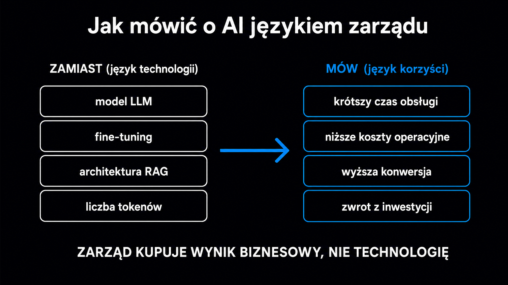

Badanie McKinsey State of AI (listopad 2025) ujawniło niepokojący podział: 88% organizacji używa już AI w co najmniej jednym obszarze, ale tylko 5,5% firm można nazwać prawdziwymi liderami czerpiącymi z niej wartość – to te organizacje, które odnotowują ponadpięcioprocentowy wpływ AI na wynik operacyjny (EBIT). Reszta gdzieś utknęła. Najczęściej nie z powodu złej technologii, lecz dlatego, że inicjatywa nigdy nie uzyskała pełnego poparcia zarządu. Jeśli masz przekonanie, że AI może coś zmienić w Twojej firmie, ale nie wiesz, jak przeprowadzić tę rozmowę z decydentami – ten artykuł pokazuje, od czego zacząć, jakim językiem mówić i jakie liczby przygotować.

## Dlaczego zarząd blokuje projekty AI

Zarząd nie odrzuca AI, bo nie lubi technologii. Odrzuca projekty ze względu na ich słabe uzasadnienie finansowe, nieokreślone ryzyko i plany pozbawione mierzalnych wyników.

[Globalne badanie członków rad nadzorczych przeprowadzone przez firmę McKinsey](https://www.mckinsey.com/capabilities/mckinsey-technology/our-insights/the-ai-reckoning-how-boards-can-evolve) pokazało, że 66% z nich ma „ograniczoną lub żadną wiedzę" o AI, a u co trzeciej AI w ogóle nie pojawia się w porządku obrad. Jednocześnie badanie MIT CISR z 2025 roku udokumentowało, że firmy z radami nadzorczymi i zarządami kompetentnymi w dziedzinie AI osiągają zwrot z kapitału własnego wyższy o 10,9 punktu procentowego od średniej branżowej. Ta luka między ignorowaniem tematu a korzyściami finansowymi to właśnie Twoje pole do argumentacji.

Problem polega na tym, że większość osób odpowiedzialnych za temat AI w firmie przynosi na spotkanie z zarządem coś w rodzaju entuzjazmu połączonego z demonstracją technologii. To nie działa. **Zarząd myśli kategoriami ryzyka, kapitału i zwrotu – i dokładnie w tym języku należy mówić.**

Trzy powody, dla których projekty AI nie przechodzą przez zarząd:

- **Brak mierzalnych wyników** – prezentacja skupia się na możliwościach technologii, nie na konkretnych liczbach, które powinny drgnąć w wynikach finansowych firmy.
- **Brak wyznaczonego właściciela biznesowego** – projekt jest przypisany do specjalisty bez uprawnień decyzyjnych i budżetu; zarząd nie widzi, kto odpowiada za ostateczny wynik.
- **Rozmyta analiza ryzyka** – ryzyka są albo całkowicie pominięte, albo zbagatelizowane; zarząd nie wie, co się stanie, gdy pilotaż nie wypali.

<aside class="callout-fact">
  
✦

  

    
Ciekawostka

    
Tylko 21% aktywnych użytkowników AI w organizacjach przyznaje, że technologia ta przyniosła wyraźną, mierzalną wartość (Deloitte, 2025). Mimo to 91% firm planuje zwiększyć inwestycje w AI w bieżącym roku. <strong>Oznacza to, że większość organizacji wydaje więcej na coś, czego wartości jeszcze nie zmierzyła – i to jest właśnie ten argument, który przemawia do ostrożnego dyrektora finansowego (CFO).</strong>

  

</aside>

## Język korzyści zamiast języka technologii

Najtrudniejsza zmiana mentalna to przejście od opisu narzędzia do opisu efektu. Zarząd nie musi rozumieć, jak działają [metryki oceny](https://pl.wikipedia.org/wiki/Kluczowy_wska%C5%BAnik_efektywno%C5%9Bci) modelu generatywnego – musi zobaczyć, który wskaźnik KPI w jego firmie ma szansę się poprawić i o ile.

Prosty test: jeśli w swojej prezentacji używasz słów takich jak „model", „prompt", „LLM" lub „generatywna AI" bez natychmiastowego przetłumaczenia ich na skutek biznesowy – tracisz uwagę sali.

Zamiana języka technicznego na język biznesowy wygląda w praktyce tak:

| Język technologii (ZŁY) | Język korzyści (DOBRY) |
|---|---|
| „Wdrożymy LLM do obsługi klienta" | „Skrócimy czas pierwszej odpowiedzi o 40%, co przełoży się na wzrost NPS o X punktów" |
| „Automatyzujemy przetwarzanie dokumentów przez AI" | „Uwalniamy czas odpowiadający 3 etatom (80% czasu przeznaczanego dotychczas na ręczną weryfikację) – oszczędność 240 tys. zł rocznie" |
| „System AI będzie rekomendował produkty" | „Podnosimy średnią wartość koszyka o 15% w segmencie klientów powracających" |
| „Wdrożenie modelu RAG w bazie wiedzy" | „Czas wdrożenia nowego konsultanta skraca się z 6 tygodni do 10 dni" |
| „AI analizuje dane operacyjne w czasie rzeczywistym" | „Wykrywamy awarie maszyn 48 godzin wcześniej – oszczędność na jednym przestoju to 120 tys. zł" |

**Każde zdanie techniczne musi mieć parę: skutek + liczba + horyzont czasowy.** Bez tego zarząd operuje wyobraźnią, nie faktami, i naturalnie przechodzi do trybu obrony budżetu.

Konkretna struktura zdania, które działa: „Dzięki [mechanizm w jednym słowie] zmniejszymy [miernik] z [X] do [Y], co da [wartość w PLN lub %] w [horyzont]." To jest zdanie, które CFO rozumie w pierwszych dziesięciu sekundach.

## Jak zbudować business case, który przeżyje salę zarządową

Uzasadnienie biznesowe (ang. *business case*) dla projektu AI nie różni się strukturą od uzasadnienia dla każdej innej inwestycji – różni się tylko tym, że wymaga dodatkowej warstwy: analizy ryzyka specyficznego dla AI. Vantage Point i Deloitte zgodnie wskazują, że zarządy zatwierdzają projekty AI przede wszystkim wtedy, gdy widzą trzy rzeczy: wiarygodność założeń finansowych, jasność odpowiedzialności i zdefiniowane punkty decyzyjne.

Sprawdzony szkielet business case dla AI składa się z sześciu sekcji.

### Diagnoza problemu – mierzalny ból

Zacznij od liczby, która boli. Nie od wizji AI. Przykłady konkretnych punktów startowych:

- **Czas** – ile godzin tygodniowo dany zespół poświęca na zadanie, które jest powtarzalne i oparte na danych.
- **Koszt błędów** – ile kosztują firmę błędy manualne w danym procesie (zwroty, reklamacje, kary regulacyjne).
- **Utracona sprzedaż** – ilu potencjalnych klientów odpada z powodu wolnej reakcji lub braku personalizacji.
- **Koszty rotacji** – ile kosztuje wdrożenie (onboarding) pracownika w danej roli i jak AI może skrócić ten czas.

### Propozycja rozwiązania – konkretna, nie ogólnikowa

Opisz mechanizm jednym zdaniem. Następnie natychmiast podaj zakres wdrożenia: jakie dane, jakie systemy, jakie procesy. Zarząd musi wiedzieć, że projekt ma granice – że nie jest projektem „transformacji AI całej firmy", lecz konkretną interwencją z datą startu i datą oceny wyników.

### Scenariusze finansowe – trzy, nie jeden

Badania McKinsey i Vantage Point wskazują, że prezentacja z pojedynczą wartością ROI jest dla zarządu sygnałem ostrzegawczym. Wiarygodny business case zawiera trzy scenariusze:

- **Ostrożny (konserwatywny)** – zakładający wolniejsze przyswajanie narzędzia przez użytkowników i wyższe niż planowane koszty integracji; tu zwrot następuje po 24–36 miesiącach.
- **Bazowy** – realistyczne założenia z pilotażu; tu zwrot w 12–18 miesiącach.
- **Optymistyczny** – jeśli adaptacja przebiega zgodnie z planem i unikamy jednego istotnego ryzyka; zwrot w 6–10 miesiącach.

Deloitte odnotowuje, że większość organizacji osiąga satysfakcjonujący zwrot z typowego projektu AI w przedziale od 2 do 4 lat. Tylko 6% widzi zwrot w ciągu roku. Wbudowanie tej informacji w prezentację – zamiast jej ukrywania – buduje wiarygodność wobec ostrożnego CFO.

### Pełny koszt posiadania (TCO)

Najczęstszy błąd, który niszczy wiarygodność przed zarządem: budżet uwzględnia licencję narzędzia AI, ale pomija:

- **Czyszczenie i strukturyzację danych** – bez tego model nie działa.
- **Integrację z istniejącymi systemami** (CRM, ERP, bazy danych).
- **Szkolenia zespołu** – zarząd dostaje „koszty ukryte" jako niespodziankę w połowie projektu.
- **Stały monitoring modelu** – następuje dryf modeli (ang. *model drift*), dlatego wymagają one opieki technicznej.

Uwzględnij wszystko w prezentacji. Zarząd, który odkryje ukryte koszty po zatwierdzeniu projektu, nie zatwierdzi kolejnego.

<aside class="callout-expert">
  

  

    
Opinia eksperta

    
W projektach prowadzonych w ICEA widzę jeden powtarzający się wzorzec: osoba odpowiedzialna za AI przychodzi na spotkanie zarządu z prezentacją narzędzia, a nie z prezentacją problemu. Zarząd pyta wtedy „a ile to kosztuje?" i rozmowa kończy się na liczbie licencji. Prawidłowa kolejność to: ból biznesowy, zmierzony koszt tego bólu, propozycja mechanizmu, scenariusze finansowe – i dopiero na końcu, jako odpowiedź na pytanie CFO, koszty wdrożenia. <strong>Jeśli zaczniesz od ceny, zarząd ocenia cenę. Jeśli zaczniesz od problemu wartego 800 tys. zł rocznie, zarząd ocenia proporcję – i projekt ma szansę.</strong>

    
Mateusz Wiśniewski · Ekspert SEO/AI Search, ICEA

  

</aside>

## KPI, które zarząd rozumie i akceptuje

Nie każdy wskaźnik sukcesu projektu AI nadaje się do komunikacji na poziomie zarządu. Metryki techniczne – dokładność modelu, precyzja klasyfikatora, opóźnienie (latencja) API – są ważne dla zespołu wdrożeniowego, ale zarząd powinien monitorować wskaźniki, które bezpośrednio przekładają się na wynik finansowy lub strategiczny.

Praktyczny zestaw KPI dla poszczególnych poziomów:

- **Poziom operacyjny** – czas cyklu procesu (przed wdrożeniem AI i po nim), liczba obsłużonych przypadków na pracownika, wskaźnik błędów manualnych; mierzone tygodniowo w pierwszych 90 dniach pilotażu.
- **Poziom finansowy** – zaoszczędzone roboczogodziny × stawka, koszt obsługi jednego klienta, wartość zapobiegniętych błędów; mierzone miesięcznie i porównywane z punktem bazowym sprzed wdrożenia.
- **Poziom strategiczny** – NPS po wdrożeniu asystenta AI, wskaźnik retencji klientów, czas wdrożenia nowych pracowników; mierzone kwartalnie.

**Kluczowa zasada: każdy KPI musi mieć zmierzony punkt bazowy z okresu PRZED wdrożeniem.** Zarząd, który nie widzi pomiaru „przed", nie może ocenić efektu „po". Jeśli nie masz tych danych – pierwszym krokiem wdrożenia jest ich zebranie, a nie uruchamianie modelu.

Informacje o tym, jak szczegółowo kalkulować zwrot i budować szablony finansowe dla poszczególnych obszarów, znajdziesz w artykule o [ROI z AI](/ai-w-biznesie/roi-z-ai) – z gotowymi wzorami dla obsługi klienta, marketingu i produkcji.

## Jak prezentować ryzyko bez straszenia

Zarząd, który nie widzi ryzyk w prezentacji, sam je sobie wyobraża – i zwykle wyobraża je sobie bardziej katastrofalnie niż rzeczywistość. Pokazanie ryzyk wraz ze sposobami ich ograniczania (mitygacji) jest lepszym rozwiązaniem niż ich ukrycie.

Pięć kategorii ryzyka, które zarząd zawsze analizuje, i sposób ich przedstawienia:

- **Ryzyko danych** – dane mogą być niekompletne lub niespójne; mitygacja: audyt danych przed uruchomieniem pilotażu, zdefiniowane kryteria jakości danych wejściowych.
- **Ryzyko braku adaptacji** – pracownicy mogą nie korzystać z narzędzia; mitygacja: pilotaż z wybraną grupą użytkowników, szkolenia, przypisanie odpowiedzialności liderowi danego działu.
- **Ryzyko regulacyjne** – przetwarzanie danych osobowych podlega RODO i unijnemu Aktowi o Sztucznej Inteligencji (AI Act, Rozporządzenie UE 2024/1689); mitygacja: ocena skutków dla ochrony danych (DPIA) w fazie projektowania, a nie po wdrożeniu.
- **Ryzyko techniczne** – integracja z przestarzałymi systemami (tzw. *legacy*) może potrwać dłużej; mitygacja: faza audytu API przed złożeniem oferty budżetowej.
- **Ryzyko dostawcy** – zmiana warunków licencjonowania lub wycofanie modelu; mitygacja: klauzule umowne, testowanie alternatyw w fazie pilotażu.

Szczegółowe omówienie obowiązków z AI Act i RODO w kontekście polskich firm zawiera artykuł [AI Act i RODO](/ai-w-biznesie/ai-act-rodo) – warto dołączyć go do pakietu materiałów przed spotkaniem z zarządem.

Ważne: ryzyko „niewdrożenia" też musi paść wprost. Jeśli konkurenci inwestują w AI, a firma stoi w miejscu – to jest to decyzja strategiczna z konsekwencjami, a nie jej brak. **Zarząd powinien aktywnie decydować o tempie wdrażania, a nie unikać decyzji przez odkładanie tematu.**

## Jak przeprowadzić pierwszą rozmowę z zarządem – lista kontrolna

Zanim wejdziesz na salę, odpowiedz pisemnie na te pytania. Jeśli nie możesz odpowiedzieć na którekolwiek z nich – masz lukę, którą zarząd z pewnością odkryje.

Przygotowanie merytoryczne:

- **Który jeden proces** boli najbardziej i ma zmierzony koszt tego bólu?
- **Kto jest właścicielem** inicjatywy – z budżetem i uprawnieniami decyzyjnymi?
- **Jakie trzy liczby** w raportach finansowych firmy mają drgnąć i o ile?
- **Jaki jest punkt bazowy** każdego KPI, mierzony dziś, przed wdrożeniem?
- **Ile wynosi TCO** w horyzoncie 12 miesięcy – z kosztami danych, integracji i szkoleń?

Zarządzanie rozmową:

- **Zacznij od problemu**, nie od technologii – pierwsze trzy slajdy nie mogą zawierać słowa „AI".
- **Podaj scenariusz ostrożny jako główny** – optymistyczny potraktuj jako bonus; CFO ufa pesymistom.
- **Zaproponuj pilotaż** z datą oceny wyników, jasnym budżetem i jednym konkretnym miernikiem sukcesu.
- **Odpowiedz z góry** na pytanie „a co jeśli nie zadziała?" – bez tego pytanie pada z sali i rozkłada cały plan.

Po spotkaniu z zarządem, pierwszym praktycznym krokiem jest sprawdzenie, jak Twoja marka jest już postrzegana przez systemy AI – darmowy [brand check](/narzedzia/brand-check) odpyta cztery silniki AI w 30 sekund i pokaże stan widoczności. To dane, które możesz przywołać w kolejnym raporcie jako punkt wyjścia do analizy efektów zewnętrznych.

## Co dalej po zatwierdzeniu przez zarząd

Zatwierdzenie projektu to dopiero początek. Pierwsze 30 dni po decyzji zarządu są krytyczne – tu decyduje się, czy projekt wejdzie w fazę pilotażu z odpowiednim rozpędem, czy ugrzęźnie w wewnętrznych uzgodnieniach.

Trzy natychmiastowe kroki po zatwierdzeniu:

- **Wyznacz właściciela** z formalnymi uprawnieniami – nie „AI Championa" bez budżetu, lecz osobę decyzyjną w danym procesie, która odpowiada za wynik KPI.
- **Zmierz punkt bazowy** – jeśli tego nie zrobiłeś przed spotkaniem z zarządem, zrób to teraz; bez twardej liczby „przed" nie udowodnisz efektu „po".
- **Uruchom pilotaż w 4 tygodnie** – mały zakres, jeden wybrany zespół, jedna metryka; lepiej pokazać szybki dowód wartości niż prowadzić wielomiesięczne przygotowania, które tracą dynamikę i niosą za sobą ryzyko odwołania budżetu przez zmianę priorytetów.

Artykuł [od czego zacząć wdrożenie AI](/ai-w-biznesie/od-czego-zaczac) opisuje metodykę audytu gotowości organizacyjnej – to dobry materiał uzupełniający po zatwierdzeniu inicjatywy przez zarząd.

Jeśli Twój projekt dotyczy widoczności marki lub marketingu cyfrowego, sprawdź też, jak [pozycjonowanie AI](/pozycjonowanie-ai) wpływa na percepcję marki przez systemy LLM – bo każda zmiana w firmie zostawia ślad w tym, jak algorytmy ją opisują.
