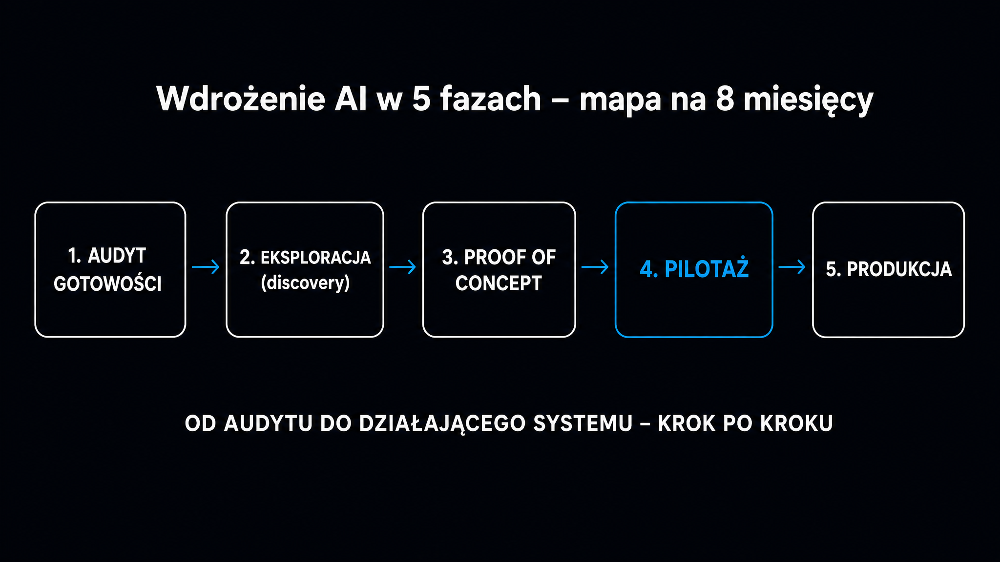

Według badania McKinsey z 2026 roku już prawie dziewięć na dziesięć firm korzysta z AI w co najmniej jednym obszarze. Jednocześnie według S&P Global Market Intelligence aż 42% organizacji porzuciło w 2025 roku większość swoich inicjatyw AI – najczęściej z powodu kosztów oraz obaw o prywatność i bezpieczeństwo danych. **Porażka nie jest wpisana w technologię, lecz wynika z braku struktury.** Ta mapa drogowa pokazuje pięć faz, które przeprowadzą Cię od „nie wiem, od czego zacząć" do działającego systemu. Niezależnie od tego, czy prowadzisz 50-osobową firmę produkcyjną, czy 500-osobowy dział marketingu.

## Zanim cokolwiek kupisz – audyt gotowości

Najczęstszy błąd to zakup narzędzia AI, zanim firma dowie się, czy jej dane, procesy i ludzie są na to gotowi. Efekt? Projekt utyka po dwóch miesiącach. Nagle okazuje się, że historyczne dane leżą w arkuszu Excel, którego nikt nie aktualizował od roku.

Przed zaangażowaniem budżetu przeprowadź audyt pięciu warstw.

- **Dane** – czy wiesz, gdzie fizycznie znajdują się informacje dotyczące tego procesu? Algorytmy [uczenia maszynowego](https://pl.wikipedia.org/wiki/Uczenie_maszynowe) potrzebują czystych, spójnych zbiorów o horyzoncie minimum 12 miesięcy. Rozproszenie w silosach informacyjnych lub brak regularnych aktualizacji uniemożliwia trenowanie jakiegokolwiek modelu predykcyjnego.
- **Dojrzałość procesów** – czy proces, który chcesz zautomatyzować, ma jednoznaczne wejście i mierzalne wyjście? AI nie naprawia chaosu operacyjnego, tylko wzmacnia to, co już działa.
- **Infrastruktura IT** – jaka jest polityka transferu danych poza sieć lokalną? Jeśli planujesz wdrożenia lokalne (on-premises), sprawdź parametry obliczeniowe serwerów.
- **Kompetencje i zarządzanie zmianą** – czy masz osobę, która potrafi przełożyć mechanikę modelu na język biznesowy? Brak takiego „tłumacza AI" to jedna z najczęstszych przyczyn odrzucenia technologii przez zespół.
- **Zgodność z przepisami** – czy system będzie przetwarzał dane osobowe? Jeśli tak, zaangażuj inspektora ochrony danych (IOD) już teraz, a nie po uruchomieniu.

**Wynik audytu to nie ocena, lecz mapa.** Każda słaba warstwa wskazuje konkretne działanie naprawcze, które musisz zakończyć przed przejściem do fazy eksploracji.

## Faza eksploracji (discovery) – znajdź właściwy scenariusz użycia

Najsłabszy punkt wielu projektów AI to zły punkt startowy. Bywa zbyt ambitny (pełna automatyzacja obsługi klienta w trzy miesiące) albo zbyt ogólny (chcemy „być bardziej AI"). **Faza eksploracji trwa zazwyczaj od 2 do 6 tygodni i ma jeden cel: wybrać jeden konkretny proces, dla którego zdefiniujesz mierzalny cel.**

### Mapowanie stanu obecnego (As-Is)

Zacznij od rozpisania wybranego procesu krok po kroku. Notuj, co go inicjuje, które działy biorą w nim udział oraz jakie systemy (ERP, CRM) są w nim wykorzystywane. Zaznacz, gdzie pojawiają się opóźnienia lub praca ręczna. Szukaj miejsc, w których pracownicy mówią „to zależy" – tam kryją się zadania oparte na zbyt subiektywnej ocenie dla AI, więc wdrożenie nie przyniesie pożądanego efektu.

### Kryteria doboru pierwszego projektu

Najlepsze pierwsze projekty AI mają kilka wspólnych cech:

- **Powtarzalność** – ten sam typ zadania powtarza się kilkadziesiąt razy dziennie lub tygodniowo.
- **Duży wolumen dokumentów lub danych wejściowych** – klasyfikacja faktur, kierowanie zgłoszeń, analiza rozmów handlowych.
- **Jasna metryka sukcesu** – czas obsługi zgłoszenia, procent błędów, liczba reklamacji. Coś, co zmierzysz przed i po wdrożeniu.
- **Integracja z istniejącymi systemami** – preferuj procesy, w których dane są już w CRM lub ERP, bo minimalizujesz w ten sposób ryzyko techniczne.

Rezultat tej fazy to karta projektu MVP ze zdefiniowanymi wskaźnikami KPI – zarówno wiodącymi (np. dokładność klasyfikacji przez model), jak i wynikowymi (np. redukcja czasu cyklu procesowego).

## Trzy strategie technologiczne – budować, kupować czy integrować?

Zanim zaczniesz PoC (Proof of Concept, czyli dowód słuszności koncepcji), odpowiedz na jedno pytanie: czy ten proces stanowi „sekretną recepturę" Twojej firmy? Odpowiedź determinuje strategię.

Poniższa tabela porządkuje trzy podejścia według kluczowych parametrów:

| Parametr | Budowa własna (Build) | Zakup gotowego SaaS (Buy) | Integracja w istniejącym systemie (Embed) |
|---|---|---|---|
| Kontrola nad danymi | Pełna | Ograniczona – dane w chmurze dostawcy | Brak – zależność od polityki dostawcy |
| Czas uruchomienia | Długi (pełen cykl projektowy) | Średni (integracja API, czyszczenie danych) | Natychmiastowy (aktywacja w panelu) |
| Koszty długoterminowe | Wysokie nakłady początkowe, niskie koszty zmienne | Rosnące koszty subskrypcji, ryzyko uzależnienia od dostawcy (vendor lock-in) | Doliczane do licencji stanowiskowej |
| Kiedy stosować | Proces unikatowy, przewaga konkurencyjna | Standardowy proces (HR, finanse, obsługa) | Szybkie testy, brak zasobów IT |

**Modele subskrypcyjne SaaS mają ukryty koszt, który widać dopiero po dwóch latach.** Marże dostawców AI SaaS są pod presją ze względu na koszty wnioskowania (inferencji) modeli. Te wydatki systematycznie przenoszą na klientów. Zanim podpiszesz kontrakt na 3 lata, przelicz scenariusz przy 30-procentowym wzroście ceny subskrypcji.

Trzecia ścieżka to platformy PaaS (Platform-as-a-Service), takie jak Microsoft Power Platform. Pozwalają tworzyć własne rozszerzenia z gotowych komponentów bez ryzyka długu technologicznego. To często najlepsza opcja dla firm z istniejącym środowiskiem Microsoft lub Salesforce.

## PoC i pilotaż – dwie fazy, które większość firm myli

To jeden z najkosztowniejszych błędów w projektach AI: traktowanie PoC i pilotażu jak dwóch nazw tej samej rzeczy. Tymczasem to odrębne fazy o zupełnie różnych celach.

**PoC (Proof of Concept) trwa od 4 do 8 tygodni i ma jedno zadanie: sprawdzić, czy algorytm technicznie działa na Twoich danych.** Przeprowadzasz go w odizolowanym środowisku testowym, z niskim budżetem. Wynik jest zero-jedynkowy. Algorytm osiąga minimalną akceptowalną dokładność (np. 90% dla klasyfikacji anomalii) albo nie. PoC nie dostarcza danych biznesowych, a jedynie potwierdza lub obala hipotezę techniczną.

Pilotaż to zupełnie inna historia. Trwa od 3 do 6 miesięcy, angażuje rzeczywistych użytkowników końcowych i mierzy, jak technologia integruje się z codzienną pracą. Dopiero pilotaż dostarcza twardych danych do uzasadnienia biznesowego (business case). Pokazuje rzeczywiste oszczędności czasu, redukcję błędów i zmianę wskaźników KPI.

**Liderzy AI stosują proporcję 10-20-70.** Według BCG kierują tylko 10% zasobów na algorytmy, 20% na technologię i dane, a aż 70% na ludzi i przebudowę procesów operacyjnych.

## Mapa drogowa na 8 miesięcy – faza po fazie

Poniżej pełna sekwencja, której możesz użyć jako szablonu. Każda faza ma konkretny rezultat (produkt końcowy) – jeśli go nie ma, nie przechodzisz dalej.

### Faza 1 – Diagnostyka i edukacja (miesiąc 1)

Przeprowadź audyt pięciu warstw gotowości opisanych wyżej. Równolegle uruchom program szkoleń z zakresu kompetencji AI (AI Literacy) dla pracowników. To nie tylko dobra praktyka – art. 4 unijnego rozporządzenia AI Act (Rozporządzenie UE 2024/1689), stosowany od 2 lutego 2025 roku, dotyczy kompetencji personelu korzystającego z AI. Po zmianach wprowadzonych przez Digital Omnibus firmy mają wspierać rozwój tych kompetencji, a nie gwarantować ich określony poziom – szkolenia pozostają najprostszym sposobem, by wykazać takie działania.

**Rezultat:** Raport wskaźnika gotowości na AI (AI Readiness Score), plan szkoleń, powołanie interdyscyplinarnego komitetu sterującego.

### Faza 2 – Eksploracja i selekcja scenariusza użycia (miesiąc 2)

Mapuj procesy, wytypuj kandydatów i oceń każdego według czterech kryteriów: efekt biznesowy, złożoność integracji, jakość danych oraz ryzyko operacyjne. Sklasyfikuj wybrany scenariusz użycia zgodnie z kategoriami ryzyka AI Act. Wyklucz praktyki zakazane, a następnie wstępnie określ wymagania dla systemów wysokiego lub ograniczonego ryzyka.

**Rezultat:** Karta projektu MVP z KPI i wstępnym uzasadnieniem biznesowym (ROI).

### Faza 3 – Wybór strategii i PoC (miesiące 3–4)

Podejmij decyzję Buduj/Kup/Zintegruj na bazie analizy całkowitego kosztu posiadania (TCO) i unikalności procesu. Uruchom eksperymentalny model w kontrolowanym środowisku na danych rzeczywistych. Wdróż procedury maskowania danych wrażliwych przesyłanych do zewnętrznych API.

**Rezultat:** Raport techniczny zamknięcia PoC – decyzja o kontynuacji lub odrzuceniu (GO/NO-GO).

### Faza 4 – Pilotaż i wdrożenie ładu danych (miesiące 5–7)

Zintegruj model z CRM/ERP przez API lub platformę PaaS. Udostępnij narzędzie grupie testowej i monitoruj adopcję. Wdróż mechanizmy ładu danych dla AI (AI Data Governance): śledzenie pochodzenia danych (data lineage), audyt jakości, kontrola dostępu. Dla systemów ograniczonego ryzyka (chatboty, generatory treści) uruchom wymagane obowiązki informacyjne wobec użytkowników.

**Rezultat:** Zweryfikowany model ROI z rzeczywistymi danymi i zatwierdzona polityka ładu danych.

### Faza 5 – Skalowanie w środowisku produkcyjnym (miesiąc 8+)

Przejście na pełną skalę produkcyjną oznacza automatyzację douczania modeli (MLOps) i ciągłą optymalizację kosztów infrastruktury. Systemy wysokiego ryzyka (np. AI w rekrutacji, ocenie zdolności kredytowej) muszą spełnić pełne wymogi AI Act przed 2 grudnia 2027 roku (termin przesunięty z sierpnia 2026 przez Digital Omnibus z maja 2026). Obejmuje to nadzór człowieka, dokumentację techniczną i rejestrację w unijnej bazie danych. Kary za naruszenia wymogów dla systemów wysokiego ryzyka sięgają 15 mln euro lub 3% globalnego rocznego obrotu (wyższe kary, rzędu 35 mln euro lub 7%, dotyczą wprost praktyk zakazanych).

**Rezultat:** Stabilny ekosystem AI generujący mierzalny wpływ na rachunek zysków i strat (P&L) przy zerowym poziomie naruszeń regulacyjnych.

<aside class="callout-fact">
  
✦

  

    
Dane z badań

    
BCG w badaniu z 2024 roku wskazało, że tylko 26% firm potrafi wyjść poza etap pilotaży i wygenerować wymierną wartość z AI. Liderzy stosują zasadę 10-20-70 w podziale zasobów: <strong>10% na algorytmy, 20% na technologię i dane, a 70% na ludzi i procesy.</strong> Technologia to najmniejsza część równania.

  

</aside>

## Jak liczyć zwrot z inwestycji w AI?

Większość projektów AI nie upada dlatego, że technologia zawodzi. Upada, bo nikt nie zmierzył, co właściwie miało działać. **Zanim uruchomisz pilotaż, zmapuj dwa zestawy liczb.**

Po stronie kosztów (CAPEX + OPEX) uwzględnij:

- **Koszty jednorazowe** – audyt gotowości, tworzenie modelu lub licencja, integracja API/ERP, szkolenia.
- **Koszty bieżące** – infrastruktura chmurowa, licencje, monitoring, wsparcie techniczne, douczanie modeli.

Po stronie korzyści przelicz wszystko na konkretne pozycje rachunku zysków i strat. Nie pisz „zaoszczędzimy czas". Pokaż konkret: „redukcja o 2 etaty (FTE) w dziale obsługi przez automatyzację klasyfikacji zgłoszeń = 180 tys. zł rocznie". Dla produkcji: zmniejszenie odsetka odrzutów o 1,5 punktu procentowego przy wolumenie 10 000 sztuk miesięcznie. To są liczby, które zarząd potrafi ocenić.

Jeśli chcesz sprawdzić, czy Twoja marka pojawia się w odpowiedziach AI, zanim zainwestujesz w content marketing oparty na AI, darmowe narzędzie [Widoczność marki w AI](/narzedzia/brand-check/) odpyta cztery silniki AI. Pokaże Ci Twój obecny udział głosu (Share of Voice) na tle kategorii.

**Nie zaczynaj od dużego projektu.** Zacznij od jednego procesu, jednej grupy użytkowników i jednej mierzalnej metryki. Sukces pierwszego wdrożenia to jedyny dowód, który przekona organizację do kolejnego kroku. Żadne teoretyczne uzasadnienie biznesowe tego nie zastąpi.

## Regulacje, których nie możesz zignorować

AI Act to nie tylko kary za naruszenia. To także ramy prawne, które wymuszają dobry projekt od samego początku. Klasyfikacja ryzyka jest prosta:

- **Ryzyko nieakceptowalne** – systemy zakazane bezwzględnie (social scoring, biometryczna klasyfikacja osób w przestrzeni publicznej). Zakaz obowiązuje od 2 lutego 2025 roku.
- **Wysokie ryzyko** – AI w rekrutacji, medycynie, infrastrukturze krytycznej, edukacji, ocenie zdolności kredytowej. Pełne obowiązki compliance dla systemów z załącznika III przesunięte do 2 grudnia 2027 roku (Digital Omnibus, maj 2026).
- **Ryzyko ograniczone** – chatboty, generatory treści, systemy rekomendacji. Obowiązek informacyjny: użytkownik musi wiedzieć, że rozmawia z maszyną.
- **Ryzyko minimalne** – filtry spamu, proste automatyzacje. Brak dodatkowych obostrzeń.

Polska ma już ustawę o systemach sztucznej inteligencji, która wdraża AI Act – podpisał ją Prezydent w lipcu 2026 roku. Głównym organem nadzoru jest niezależna Komisja Rozwoju i Bezpieczeństwa Sztucznej Inteligencji (KRiBSI). Śledzenie jej wytycznych jest kluczowe, jeśli budujesz systemy w kategorii wysokiego ryzyka.

Jeśli budujesz lub optymalizujesz content marketing z elementami AI, warto równolegle zadbać o widoczność marki w odpowiedziach modeli językowych (LLM). Zakres prac i metodykę opisuje strona [pozycjonowania w AI (AIO)](/pozycjonowanie-ai/). To naturalne rozszerzenie każdej strategii biznesowej.

<aside class="callout-expert">
  

  

    
Opinia eksperta

    
W projektach, przy których pracuję w ICEA, największy problem nie leży w technologii – leży w braku właściciela procesu po stronie klienta. Ktoś musi wiedzieć, jak działa ten jeden konkretny proces lepiej niż ktokolwiek inny w firmie. Bez tej osoby każdy audyt w fazie eksploracji zamienia się w zabawę w głuchy telefon. <strong>Pierwsza rekomendacja przed jakimkolwiek wdrożeniem AI jest zawsze ta sama: wyznacz właściciela procesu z mandatem do podejmowania decyzji, a nie tylko do uczestniczenia w spotkaniach.</strong>

    
Mateusz Wiśniewski · Ekspert SEO/AI Search, ICEA

  

</aside>

## Decyzja: zewnętrzny consulting czy własny zespół?

To pytanie pojawia się na każdym etapie. Odpowiedź zależy od jednego parametru: czy masz w firmie osobę łączącą wiedzę o mechanice modeli matematycznych z realnymi celami biznesowymi?

Na polskim rynku ta rola nazywa się „tłumaczem AI" (AI translator) i należy do rzadkości. Już same wynagrodzenia specjalistów data science – od juniora do seniora – to znaczący, stały koszt miesięczny. Jeśli ta rola nie jest Twoją podstawową działalnością (core business), zatrudnianie własnego zespołu na pierwszą fazę wdrożenia jest zazwyczaj droższe niż skorzystanie z zewnętrznego consultingu na czas PoC i pilotażu.

Własny zespół wewnętrzny ma sens od momentu skalowania w środowisku produkcyjnym, gdy system wymaga ciągłego douczania, monitoringu i integracji z codziennymi operacjami. MLOps Engineer odpowiada za automatyzację procesów wdrażania modeli, wersjonowanie i optymalizację kosztów infrastruktury obliczeniowej. **To rola, która zwraca się wtedy, gdy masz co najmniej dwa działające systemy AI na produkcji.**

Strategię i zwrot z inwestycji w AI dla firmy omawia szczegółowo artykuł o [ROI z AI](/ai-w-biznesie/roi-z-ai/). Warto przeczytać go przed rozmową z zarządem o budżecie. Jeśli na Twojej liście jest też zgodność z regulacjami RODO i AI Act w ramach jednego procesu, sprawdź osobny artykuł o [AI Act i RODO](/ai-w-biznesie/ai-act-rodo/).

**Wdrożenie AI w firmie to projekt organizacyjny z komponentem technologicznym, a nie odwrotnie.** Zacznij od procesu, a nie od narzędzia. Skup się na jednej warstwie, zamiast transformować cały dział. Zmierz efekt, zanim pójdziesz dalej. Wszystko inne to tylko szczegóły.
