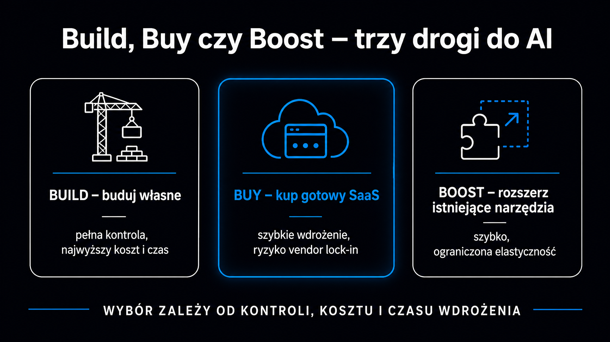

Globalne wydatki na sztuczną inteligencję przekroczą w 2026 roku 2,52 biliona dolarów – a mimo to 56% dyrektorów generalnych przyznaje, że wdrożenia AI nie przyniosły ani wzrostu przychodów, ani redukcji kosztów (PwC Global CEO Survey, Davos 2026). Ten rozdźwięk nie bierze się z braku ambicji. Wynika z braku planu. Ten przewodnik pokazuje, od czego zacząć, jak wybrać właściwy model pozyskania technologii, gdzie AI przynosi mierzalny zwrot i jak uniknąć prawnych pułapek – zanim podpiszesz pierwszą umowę z dostawcą.

## Dlaczego większość wdrożeń AI utknęła w pół drogi

Tylko co piąta inicjatywa AI (20%) osiąga mierzalny zwrot z inwestycji. Jedna na pięćdziesiąt (2%) przynosi wartość o charakterze naprawdę transformacyjnym. Dane IDC są jeszcze ostrzejsze: na każde 33 zbudowane prototypy zaledwie 4 trafiają do środowiska produkcyjnego – to 88-procentowy wskaźnik porażki na etapie skalowania.

Gartner określa ten problem jako „dolinę rozczarowania". Firmy budują pilotaż, pilotaż działa w kontrolowanych warunkach, a potem projekt napotyka barierę organizacyjną – brakuje właściciela, procesów, danych lub zgody zarządu na kolejne nakłady. **McKinsey szacuje, że tylko 30% projektów AI przekracza fazę pilotażową.**

Przyczyny są trzy i powtarzają się niezależnie od branży:

- **Brak osadzenia w procesach** – system AI wdrożony obok istniejącego procesu, nie zamiast jego wadliwej części; ludzie wracają do starych nawyków po kilku tygodniach
- **Nierealistyczny harmonogram ROI** – kierownictwo oczekuje efektów w 3 miesiące; rzeczywisty cykl od pilotażu do produkcji to 6–18 miesięcy
- **Chaos danych** – firmy próbują wdrożyć AI na nieustrukturyzowanych, niespójnych danych; działa zasada *garbage in, garbage out* w każdym modelu

Tę trzecią przyczynę Gartner nazywa „human mess" – nieformalnym, nieudokumentowanym środowiskiem operacyjnym, gdzie wiedza tkwi w głowach pojedynczych pracowników, a procesy działają tylko dlatego, że konkretna osoba pamięta, jak to zawsze robiono. Próba automatyzacji takiego środowiska kończy się wdrożeniem, które przyspiesza chaos zamiast go eliminować.

### Profil lidera a tempo transformacji

BCG AI Radar 2026 wyodrębnił trzy archetypy organizacji wdrażających AI, które dobrze porządkują skalę aspiracji wobec zasobów:

| Profil (BCG AI Radar 2026) | Udział w rynku | Charakterystyka |
|---|---|---|
| Naśladowcy (Followers) | 15% | Ograniczone pilotaże, oczekiwanie na ruchy konkurencji, niskie poczucie własnych kompetencji |
| Pragmatycy (Pragmatists) | 70% | Aktywne inwestycje w ludzi i technologię; CEO poświęca średnio 7 godzin tygodniowo na naukę AI |
| Pionierzy (Trailblazers) | 15% | Głęboka transformacja operacyjna całej organizacji; ponad 75% personelu objętych szkoleniami AI |

Większość organizacji startuje jako Pragmatycy. Kluczowe pytanie to nie „czy wdrożyć AI", lecz „od którego procesu zacząć, żeby wynik był mierzalny w 90 dni".

## Jak wybrać model pozyskania technologii – Build, Buy czy Boost

Tradycyjny podział na „kupuję gotowe" albo „buduję od zera" w realiach AI jest niewystarczający. Współczesne systemy AI składają się z warstw: modelu bazowego, bazy wektorowej, warstwy orkiestracji agentów i interfejsów integracyjnych. **Decyzja o modelu pozyskania technologii determinuje strukturę kosztów i elastyczność operacyjną firmy na wiele lat.**

Trzy ścieżki w skrócie:

- **Kup gotowe (Buy)** – narzędzie w modelu SaaS, szybkie uruchomienie, dostawca odpowiada za infrastrukturę i aktualizacje modelu; sprawdza się w standardowych procesach wsparcia (obsługa delegacji, tłumaczenia, kategoryzacja zgłoszeń)
- **Wzbogać model własnym kontekstem (Boost)** – zewnętrzny model bazowy zasilony wewnętrzną bazą wiedzy przez architekturę RAG (generowanie wspomagane wyszukiwaniem) lub dostrajanie parametrów; wyższy koszt operacyjny, ale unikalne odpowiedzi oparte na danych firmy
- **Buduj od podstaw (Build)** – własne modele trenowane i utrzymywane in-house; rekomendowane wyłącznie, gdy system AI stanowi rdzeń własności intelektualnej lub gdy firma podlega ekstremalnym wymogom suwerenności danych

Tabela decyzyjna ułatwia wybór ścieżki:

| Kryterium | Kup gotowe (Buy) | Wzbogać model (Boost) | Buduj od podstaw (Build) |
|---|---|---|---|
| Czas do uruchomienia | Dni–tygodnie | 1–3 miesiące | 12–24 miesiące |
| Kontrola nad danymi | Niska (chmura dostawcy) | Wysoka (własna baza RAG) | Pełna (on-premise) |
| Wymagane kompetencje | Podstawowe | Średnie (inżynierowie integracji) | Bardzo wysokie (MLOps, data science) |
| Struktura kosztów | Niski CapEx, stały OpEx | Średni CapEx, zmienny OpEx API | Bardzo wysoki CapEx |
| Ryzyko uzależnienia (lock-in) | Wysokie (polityka dostawcy) | Umiarkowane | Brak zewnętrznego |

McKinsey podaje, że budowa autorskiego rozwiązania zajmuje średnio 12–18 miesięcy – i niemal zawsze kończy się tym, że gotowy system jest już technologicznie przestarzały w chwili uruchomienia. Dla zdecydowanej większości polskich firm z sektora MŚP i średnich przedsiębiorstw (mid-market) wariant **Boost** daje najlepszy kompromis między unikalną wartością a czasem wdrożenia.

<aside class="callout-fact">
  
✦

  

    
Ciekawostka

    
Średni koszt uruchomienia jednej inicjatywy opartej na generatywnej AI wynosi dziś 1,9 miliona dolarów – bez kosztów stałego utrzymania infrastruktury. Mimo to tylko 7% dyrektorów finansowych deklaruje wysoki poziom zwrotu z inwestycji w swoim pionie. <strong>Firmy zaliczane do grupy „AI Vanguard" (12% rynku) łączy jedna cecha: CEO jest bezpośrednim sponsorem inicjatyw AI i poświęca temu co najmniej 7 godzin tygodniowo.</strong>

  

</aside>

## Gdzie AI przynosi mierzalne efekty – przegląd zastosowań

Wdrożenie AI w dowolnym obszarze to nie projekt IT – to zmiana procesu. Dlatego punktem wyjścia nie jest „jaki model wybrać", lecz „który proces boli najbardziej i ma wystarczającą powtarzalność, żeby AI miała co optymalizować".

Badanie Capgemini z czerwca 2025 roku (1607 menedżerów, organizacje o przychodach powyżej 1 mld dolarów) pokazuje wyraźnie, że najwyższy zwrot osiągają obszary z dużą powtarzalnością zadań i ustrukturyzowanymi danymi. Zestawienie mierzalnych efektów per obszar:

| Obszar | Zastosowanie AI | Kluczowa metryka |
|---|---|---|
| Zarządzanie personelem | Automatyzacja preselekcji CV, spersonalizowane ścieżki szkoleń | ROI 2,1x (Capgemini 2025) |
| Obsługa klienta | Asystenci głosowi (IVA) zintegrowani z CRM/ERP | Skrócenie czasu pierwszej odpowiedzi o 37%, czasu rozwiązania o 52% |
| Zarządzanie zapasami | Analityka predykcyjna w prognozowaniu popytu | Wzrost dokładności prognoz o 35–42% |
| Produkcja przemysłowa | Predykcyjne utrzymanie ruchu (Predictive Maintenance) | Redukcja nieplanowanych przestojów o 50%, spadek kosztów serwisu o 20–30% |
| Marketing B2B | Ocena potencjału leadów (scoring), personalizacja kampanii | Wzrost konwersji na „gorące" szanse sprzedażowe |

### Obsługa klienta – najszybszy ROI

Wdrożenie zintegrowanych z systemami SAP lub Oracle asystentów konwersacyjnych w contact center pozwala na natychmiastowe pobieranie danych transakcyjnych. Automatyczna transkrypcja i analiza tonu rozmów kategoryzuje zgłoszenia pod kątem pilności, eliminując błędy przy ręcznym przekazywaniu między działami. **To właśnie obsługa klienta daje najkrótszy cykl zwrotu – pierwsze mierzalne efekty widać w 6–10 tygodni od wdrożenia.**

### Produkcja – największa dźwignia

Dane Światowego Forum Ekonomicznego potwierdzają: predykcyjne utrzymanie ruchu ogranicza nieplanowane przestoje produkcyjne nawet o 50%. Wdrożenie systemów AI przy produkcji modelu Airbus A350 zaowocowało 33-procentowym wzrostem wydajności linii i 70-procentową skutecznością automatycznego dopasowania usterek do sprawdzonych historycznie rozwiązań.

### Logistyka i zwroty

Koszty obsługi zwrotów pochłaniają w branży detalicznej do 7% przychodów brutto. Agenci AI wyposażeni w moduły komputerowej analizy obrazu weryfikują stan towaru na podstawie zdjęć przesłanych przez aplikację klienta – eliminując żmudną ręczną weryfikację i wychwytując nadużycia przy zwrotach (return fraud).

## Od pilotażu do produkcji – plan wdrożenia krok po kroku

Przejście od eksperymentu do systemu produkcyjnego to najsłabsze ogniwo większości projektów AI. Praktyczna metodologia 7-etapowego wdrożenia, sprawdzona w projektach MŚP i firmach średniej wielkości, wygląda następująco:

1. **Bezpłatna konsultacja (30 min)** – diagnoza przydatności AI w konkretnym kontekście firmy; bez ofert handlowych, skupiona na stratach czasowych i używanych narzędziach
2. **Audyt procesów (2–3 godz.)** – wywiad z kluczowymi decydentami mapujący przepływy zadań, wąskie gardła i gotowość API systemów firmy
3. **Oferta z harmonogramem (24 godz.)** – precyzyjny zakres integracji, wycena i kamienie milowe
4. **Faza budowy (1–12 tygodni)** – prace inżynieryjne w tygodniowych sprintach, każdy sprint kończy się 30-minutowym demo z klientem
5. **Szkolenia zespołu (1–5 sesji)** – praktyczne warsztaty z obsługi asystentów, zasad bezpieczeństwa i podstaw inżynierii promptów
6. **Iteracja produkcyjna (2–4 tygodnie)** – dostrajanie systemu na podstawie rzeczywistych danych i uwag użytkowników końcowych
7. **Wsparcie powdrożeniowe (opcjonalnie retainer)** – abonamentowa opieka, aktualizacje modeli, monitoring dryfu modeli (model drift)

Kluczowy wniosek z etapów 4–6: **nie wdrażaj AI na nieuporządkowanych procesach**. Przed uruchomieniem kodu zmierz i wyeliminuj „ludzki chaos" – nieformalne ścieżki decyzyjne, wiedzę plemienną uwięzioną w mailach, ręczne weryfikacje bez logiki. AI przyspiesza to, co już istnieje. Jeśli proces jest zepsuty, skutkuje to szybszym powielaniem błędów.

Do właściwego przeprowadzenia takiego projektu potrzebny jest sponsor na poziomie zarządu oraz wyznaczony właściciel wewnętrzny – niekoniecznie techniczny, ale decyzyjny. To jest minimum organizacyjne, bez którego każdy pilotaż staje się wiecznym pilotażem.

Zanim zlecisz wdrożenie zewnętrznemu dostawcy, sprawdź, jak Twoja marka jest widoczna dzięki [pozycjonowaniu w AI](/pozycjonowanie-ai/) – bo każde wdrożenie AI w firmie zmienia też to, jak algorytmy LLM postrzegają markę na zewnątrz.

## Jak zbudować AI Center of Excellence (CoE)

Gdy AI przestaje być eksperymentem i staje się narzędziem operacyjnym w kilku pionach jednocześnie, firmy napotykają nowy problem: brak koordynacji standardów, duplikowanie integracji i nieskoordynowane budżety. Odpowiedzią jest **AI Center of Excellence (CoE)**, czyli Centrum Doskonałości AI – wyspecjalizowana jednostka, która instytucjonalizuje sztuczną inteligencję jako trwałą zdolność organizacji, na wzór istniejących komórek ds. cyberbezpieczeństwa lub architektury chmurowej.

Prawidłowe CoE opiera się na sześciu warstwach:

- **Strategia i wizja** – 12-miesięczna mapa drogowa (roadmapa), kryteria priorytetyzacji projektów, mierzalne wskaźniki sukcesu
- **Nadzór i odpowiedzialne AI** – standardy zarządzania danymi, ocena ryzyka prawnego, monitorowanie stronniczości modeli (bias), zgodność z RODO i AI Act
- **Dane i infrastruktura** – rurociągi danych, zarządzanie bazami wektorowymi, bezpieczeństwo, hosting modeli
- **Fabryka zastosowań** – warsztaty identyfikacji potrzeb, punktowa ocena wykonalności (scoring), przejście PoC → pilotaż → produkcja
- **Integracja i dostarczanie** – wpięcie modeli w CRM, ERP, systemy pracy, dashboardy operacyjne
- **Ludzie i adopcja** – kultura gotowości technologicznej, szkolenia z zakresu kompetencji AI (AI literacy), zarządzanie zmianą

### 6-miesięczny plan uruchomienia CoE

Budowa CoE nie musi trwać lat. Realistyczny harmonogram dla organizacji zatrudniającej 100–500 osób:

| Miesiąc | Zadanie kluczowe |
|---|---|
| 1 | Sformułowanie wizji, pozyskanie sponsorów zarządowych, opublikowanie Karty CoE, rekrutacja 3 pierwszych ról |
| 2 | Ocena gotowości danych, wdrożenie podstawowych rurociągów, wybór dostawcy chmury (Azure/AWS/GCP), wytyczne odpowiedzialnej AI |
| 3 | Warsztaty odkrywania potrzeb w pionach, punktacja pomysłów (wartość vs wykonalność), wybór 3 priorytetowych projektów |
| 4 | Budowa pilotażu, integracja z narzędziami wybranego zespołu, szkolenie użytkowników, pomiar wskaźników bazowych |
| 5 | Skalowanie pilotażu do produkcji, dashboardy monitoringu, procedury przeciwdziałające dryfowi modeli |
| 6 | Przegląd efektów finansowych, plan na kolejne 12 miesięcy, rozszerzenie o 2 nowe obszary |

Gdy organizacja osiągnie wysoką skalę wdrożeń, model scentralizowany CoE staje się wąskim gardłem. Wówczas zaleca się przejście do modelu doradczego – zadania inżynieryjne trafiają do interdyscyplinarnych zespołów produktowych, a CoE koncentruje się wyłącznie na standardach bezpieczeństwa, szablonach i strategii. Więcej o tym, jak [duże modele językowe](/modele-llm/przewodnik/) wpływają na architekturę takich decyzji, omawia osobny przewodnik po LLM.

<aside class="callout-expert">
  

  

    
Opinia eksperta

    
W projektach, które prowadzimy w ICEA, najczęstszy błąd nie jest techniczny – jest organizacyjny. Firmy powołują "AI Championa" na poziomie specjalisty, bez uprawnień decyzyjnych i budżetu. Pierwsze trzy tygodnie mijają na oczekiwaniu na zgody. Potem projekt grzęźnie. <strong>Jeśli projekt AI nie ma właściciela z uprawnieniami do powiedzenia "robimy to" bez konsultacji z pięcioma działami, nie uruchamiaj go – strata czasu i kapitału jest gwarantowana.</strong>

    
Mateusz Wiśniewski · Ekspert SEO/AI Search, ICEA

  

</aside>

## Jak liczyć zwrot z inwestycji – ROI i TCO dla projektów AI

Każda decyzja o finansowaniu projektu AI powinna opierać się na twardej kalkulacji pełnego kosztu posiadania (TCO – Total Cost of Ownership). Częsty błąd: budżet uwzględnia licencję i koszt tokenów API, ale pomija czyszczenie danych, integrację systemów, szkolenia i ciągły monitoring modeli pod kątem dryfu.

Formuła ROI dla projektów AI powinna sumować trzy filary korzyści:

- **Redukcja kosztów** – zaoszczędzony czas pracy w godzinach × stawka, ograniczenie błędów manualnych, niższe koszty obsługi powtarzalnych procesów
- **Wzrost przychodów** – przyspieszona konwersja leadów, mniejszy wskaźnik odpływu klientów (churn), lepsza personalizacja oferty
- **Mitygacja ryzyka** – ograniczenie kar z tytułu błędów regulacyjnych, mniejsze koszty zwrotów i reklamacji, szybsza reakcja na awarie maszyn

Dane Capgemini wskazują na systematyczne różnice w ROI zależnie od obszaru. Zarządzanie personelem osiąga 2,1x zwrot, obsługa klienta – 1,7x, łańcuch dostaw i finanse – po 1,5x. To nie są przypadkowe liczby: wszystkie te obszary mają wspólną cechę – wysoki stopień powtarzalności zadań i dobrze ustrukturyzowane dane wejściowe.

### Zasada 70-20-10

BCG i McKinsey zgodnie wskazują na rozkład zasobów charakterystyczny dla liderów wdrożeń AI. **70% nakładów powinno trafiać na ludzi i procesy** – szkolenia z zakresu kompetencji AI (AI literacy), optymalizację struktur organizacyjnych i zarządzanie zmianą. Infrastruktura techniczna pochłania 20% budżetu. Same algorytmy i modele – zaledwie 10%.

Ten rozkład jest kontrintuicyjny. Decydenci chcą wydawać na modele, bo modele są widoczne. Tymczasem największą dźwignią jest zdolność organizacji do wchłonięcia zmiany.

W kontekście mierzenia zwrotu z AI warto sprawdzić nasz artykuł o [ROI z AI](/ai-w-biznesie/roi-z-ai/) – z gotowymi szablonami kalkulacji dla projektów obsługi klienta, marketingu i produkcji.

## Regulacje, które musisz znać – AI Act i RODO

Ignorowanie ram prawnych naraża na kary sięgające 35 milionów euro lub 7% globalnego rocznego obrotu. **Compliance nie jest opcją dodatkową – jest warunkiem koniecznym każdego wdrożenia AI w Polsce i Unii Europejskiej.** Projekty AI podlegają jednoczesnemu stosowaniu przepisów RODO i unijnego Aktu o Sztucznej Inteligencji (AI Act, Rozporządzenie UE 2024/1689).

### AI Act – harmonogram i kategorie ryzyka

AI Act wszedł w życie 1 sierpnia 2024 roku i wprowadza stopniowy harmonogram obowiązków. Dla decydenta kluczowe daty to:

- **2 lutego 2025** – zakaz systemów o nieakceptowalnym ryzyku (manipulacja podprogowa, scoring społeczny, rozpoznawanie emocji w miejscach pracy); obowiązek budowania kompetencji pracowników w zakresie AI
- **2 sierpnia 2025** – obowiązki dla dostawców modeli ogólnego przeznaczenia (GPAI): dokumentacja techniczna, przestrzeganie prawa autorskiego, publikowanie podsumowań danych treningowych
- **2 sierpnia 2026** – pełne stosowanie większości przepisów systemowych, w tym sankcji finansowych i powołania organów nadzoru

AI Act kategoryzuje systemy AI w czterech poziomach ryzyka. Dwa z nich są krytyczne dla polskich firm:

- **Wysokie ryzyko** – systemy w rekrutacji (selekcja CV), ocenie zdolności kredytowej, diagnostyce medycznej; wymagają oceny skutków dla praw podstawowych (FRIA), audytu danych treningowych i nadzoru człowieka nad każdą decyzją
- **Ryzyko ograniczone** – chatboty obsługi klienta; obowiązek poinformowania użytkownika, że rozmawia z AI, i maszynowego oznaczenia generowanych treści

W Polsce nadzór nad rynkiem AI będzie sprawować **Komisja Rozwoju i Bezpieczeństwa Sztucznej Inteligencji (KRiBSI)**, powołana zgodnie z projektem ustawy przyjętym przez Radę Ministrów 31 marca 2026 roku. Komisja zyska uprawnienia do prowadzenia postępowań, wydawania decyzji o natychmiastowym wycofaniu systemów z rynku i nakładania sankcji finansowych.

### RODO a wdrożenia AI

Przetwarzanie danych osobowych przez systemy AI wymaga osobnej analizy prawnej. Sześć obszarów kontrolnych, które każdy projekt AI musi przejść przed uruchomieniem:

1. Metryka narzędzia AI – karta informacyjna z nazwą modelu bazowego i dokumentacją techniczną
2. Podstawa prawna przetwarzania – precyzyjne określenie, czy przetwarzanie opiera się na prawnie uzasadnionym interesie, umowie czy zgodzie
3. Umowa z dostawcą – weryfikacja, czy dostawca ma prawo douczać model na danych wprowadzonych przez firmę; jeśli tak – wymóg testu kompatybilności i zgody administratora (wytyczne CNIL)
4. Automatyczne podejmowanie decyzji – jeśli pracownik lub klient bezkrytycznie akceptuje wynik AI, warunki art. 22 RODO są spełnione; konieczna zgoda i prawo do interwencji człowieka
5. Bezpieczeństwo danych – uwierzytelnianie wieloskładnikowe (MFA), logi systemowe, odrębne konta administracyjne
6. Ocena skutków (DPIA) – obowiązkowa przy systematycznym monitoringu pracowników, automatycznym podejmowaniu decyzji lub zastosowaniu nowych technologii; wynik trafia do Rejestru Czynności Przetwarzania

Szczegółowe omówienie obowiązków compliance, w tym jak zbudować wewnętrzną Politykę AI, zawiera artykuł [AI Act i RODO](/ai-w-biznesie/ai-act-rodo/).

## Od czego zacząć jutro rano

Firmy, które skutecznie wdrożyły AI (12% rynku określanych jako „AI Vanguard"), nie zrobiły tego przez przypadek. Łączy je kilka powtarzalnych wzorców:

- **Osobiste przywództwo CEO** – dyrektor generalny jest głównym sponsorem i buduje własne kompetencje technologiczne; to nie jest zadanie do delegowania w całości
- **Bezwzględna priorytetyzacja** – zamiast dziesiątek rozproszonych pilotaży, koncentracja na 3–5 scenariuszach o najwyższym potencjale zwrotu i najmniejszym ryzyku regulacyjnym
- **Dyscyplina finansowa TCO** – każdy projekt mierzy pełny koszt posiadania; CFO egzekwuje uwzględnienie kosztów danych, integracji i monitoringu – nie tylko licencji
- **Compliance od pierwszego dnia** – Inspektor Ochrony Danych jest stałym członkiem zespołu wdrożeniowego od etapu projektowania, nie od etapu audytu po wdrożeniu
- **Eliminacja chaosu przed kodem** – organizacja mapuje i porządkuje procesy, zanim uruchomi model; AI wzmacnia to, co zastaje, nie naprawia dezorganizacji

Narzędzie [generowania wspomaganego wyszukiwaniem](https://pl.wikipedia.org/wiki/Retrieval-augmented_generation) (RAG – Retrieval-Augmented Generation), które jest sercem modelu Boost, działa tylko tak dobrze, jak dobrze są ustrukturyzowane firmowe zasoby wiedzy. Jeśli dokumentacja procesów, cenniki i procedury są chaotyczne, model będzie generował chaotyczne odpowiedzi.

Praktyczny punkt startowy dla każdej organizacji niezależnie od wielkości:

- **Wybierz jeden powtarzalny proces** z wysoką częstotliwością wykonania i niskim ryzykiem regulacyjnym (obsługa klienta, preselekcja dokumentów, kategoryzacja danych)
- **Zmierz punkt bazowy** – ile czasu zajmuje ręcznie, ile kosztuje błąd, jaki jest aktualny wskaźnik satysfakcji lub dokładności
- **Uruchom pilotaż w 4 tygodnie** – z jasnym właścicielem, wyznaczonym budżetem i metryką sukcesu mierzalną po 60 dniach produkcji
- **Decyduj na podstawie danych, nie wrażeń** – jeśli pilotaż nie pokazuje mierzalnego efektu po 8 tygodniach, przeprowadź retrospektywę, zanim zwiększysz nakłady

Jeśli chcesz sprawdzić, jak Twoja marka jest postrzegana przez systemy AI, zanim uruchomisz wewnętrzne wdrożenia, [Widoczność marki w AI](/narzedzia/brand-check/) odpyta w 30 sekund cztery silniki AI i pokaże aktualny stan widoczności. Dobrym uzupełnieniem jest też lektura artykułu [od czego zacząć wdrożenie AI](/ai-w-biznesie/od-czego-zaczac/) – jeśli jesteś na samym początku drogi i chcesz wyjść od konkretnej metodyki audytu gotowości.

## Często zadawane pytania o wdrożenie AI w firmie

### Jaki budżet potrzebny jest na pierwsze wdrożenie AI?

Zakres jest bardzo szeroki. Proste wdrożenie oparte na gotowych narzędziach SaaS (model Buy) kosztuje od kilkuset złotych miesięcznie w abonamencie. Projekt z własną integracją systemową i bazą wiedzy RAG (model Boost) dla firmy 5–30 osób to wydatek rzędu 4000–15 000 PLN jednorazowo plus koszt tokenów API. Wdrożenia korporacyjne z głębokimi integracjami ERP/CRM i własnym CoE – od 50 000 PLN w górę.

### Czy firma bez działu IT może wdrożyć AI?

Tak – i to jest jeden z powodów, dla których model Buy i Boost są popularne w MŚP. Nowoczesne platformy AI nie wymagają programistów do obsługi. Wymagają jednak kogoś, kto zna dobrze procesy firmy i potrafi ocenić, czy wyniki modelu są poprawne. Wiedza dziedzinowa jest ważniejsza niż kompetencja techniczna.

### Jak długo trwa typowe wdrożenie?

Proste wdrożenie narzędzia SaaS (np. asystent do obsługi maili) – 1–3 tygodnie. Projekt z integracją CRM i bazą wiedzy RAG – 5–10 tygodni. Wdrożenie obejmujące pełne szkolenia, iterację produkcyjną i monitoring – 12–16 tygodni. Wbudowanie AI do procesów strategicznych z wynikami transformacyjnymi – 6–18 miesięcy.

### Kiedy warto nie wdrażać AI?

Gdy proces jest nieudokumentowany i zależy od nieformalnej wiedzy kilku osób. Gdy brakuje danych – lub dane są niespójne i nieoznaczone. Gdy w organizacji nie ma wyznaczonego właściciela z uprawnieniami do podejmowania decyzji o zmianie procesu. W tych warunkach wdrożenie AI nie przyniesie efektów i wygeneruje frustrację po obu stronach.
