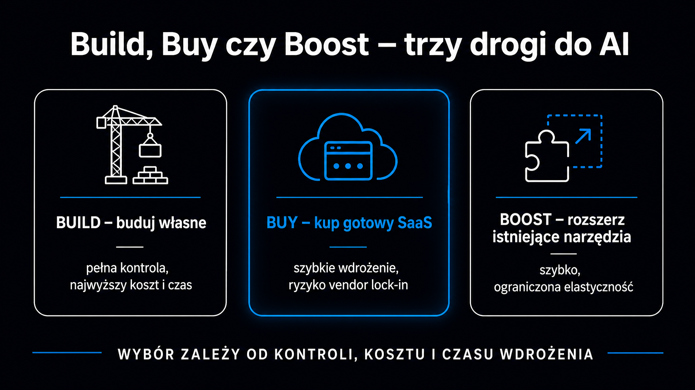

**Według BCG AI Radar 2026 firmy mają w tym roku podwoić wydatki na AI – z 0,8% do 1,7% przychodów – a mimo to wiele z nich wciąż nie potrafi przenieść pilotaży do codziennej pracy.** Ten rozdźwięk nie bierze się z braku ambicji. Wynika z braku planu. Zobacz, od czego zacząć, jak wybrać właściwy model pozyskania technologii, gdzie AI przynosi mierzalny zwrot i jak uniknąć prawnych pułapek – zanim podpiszesz pierwszą umowę z dostawcą.

## Dlaczego większość wdrożeń AI utknęła w pół drogi?

Mierzalny zwrot z inwestycji osiąga tylko część inicjatyw AI. **Dane IDC i Lenovo są wymowne: na każde 33 zbudowane prototypy zaledwie 4 trafiają do środowiska produkcyjnego – to 88-procentowy wskaźnik porażki na etapie skalowania.**

To klasyczna „dolina rozczarowania". Firmy budują pilotaż. Działa on świetnie w kontrolowanych warunkach. Potem projekt napotyka barierę organizacyjną – brakuje właściciela, procesów, danych lub zgody zarządu na kolejne nakłady.

Przyczyny są trzy i powtarzają się niezależnie od branży:

- **Brak osadzenia w procesach** – system AI wdrożony obok istniejącego procesu, a nie zamiast jego wadliwej części; ludzie wracają do starych nawyków po kilku tygodniach
- **Nierealistyczny harmonogram ROI** – kierownictwo oczekuje efektów w 3 miesiące; rzeczywisty cykl od pilotażu do produkcji to 6–18 miesięcy
- **Chaos danych** – firmy próbują wdrożyć AI na nieustrukturyzowanych, niespójnych danych; działa zasada *garbage in, garbage out* w każdym modelu

Tę trzecią przyczynę często określa się jako „ludzki chaos" (ang. *human mess*) – nieformalne, nieudokumentowane środowisko operacyjne. Wiedza tkwi tu w głowach pojedynczych pracowników. Procesy działają tylko dlatego, że konkretna osoba pamięta, jak to zawsze robiono. **Próba automatyzacji takiego środowiska kończy się wdrożeniem, które przyspiesza chaos zamiast go eliminować.**

### Profil lidera a tempo transformacji

BCG AI Radar 2026 wyodrębnił trzy archetypy prezesów (CEO) wdrażających AI, które dobrze porządkują skalę aspiracji wobec zasobów:

| Profil (BCG AI Radar 2026) | Udział wśród CEO | Charakterystyka |
|---|---|---|
| Naśladowcy (Followers) | 15% | Ograniczone pilotaże, oczekiwanie na ruchy konkurencji, niskie poczucie własnych kompetencji |
| Pragmatycy (Pragmatists) | 70% | Aktywne inwestycje w ludzi i technologię; CEO poświęca ok. 7 godzin tygodniowo na sprawy AI |
| Pionierzy (Trailblazers) | 15% | Głęboka transformacja operacyjna całej organizacji; blisko trzy czwarte personelu objętego szkoleniami AI |

Większość organizacji startuje jako Pragmatycy. **Kluczowe pytanie to nie „czy wdrożyć AI", lecz „od którego procesu zacząć, żeby wynik był mierzalny w 90 dni".**

## Jak wybrać model pozyskania technologii: Build, Buy czy Boost?

Tradycyjny podział na „kupuję gotowe" albo „buduję od zera" w realiach AI jest niewystarczający. Współczesne systemy AI składają się z warstw. Mamy tu model bazowy, bazę wektorową, warstwę orkiestracji agentów i interfejsy integracyjne. **Decyzja o modelu pozyskania technologii determinuje strukturę kosztów i elastyczność operacyjną firmy na wiele lat.**

Trzy ścieżki w skrócie:

- **Kup gotowe (Buy)** – narzędzie w modelu SaaS, szybkie uruchomienie, dostawca odpowiada za infrastrukturę i aktualizacje modelu; sprawdza się w standardowych procesach wsparcia (obsługa delegacji, tłumaczenia, kategoryzacja zgłoszeń)
- **Wzbogać model własnym kontekstem (Boost)** – zewnętrzny model bazowy zasilony wewnętrzną bazą wiedzy przez architekturę RAG (generowanie wspomagane wyszukiwaniem) lub dostrajanie parametrów; wyższy koszt operacyjny, ale unikalne odpowiedzi oparte na danych firmy
- **Buduj od podstaw (Build)** – własne modele trenowane i utrzymywane in-house; rekomendowane wyłącznie, gdy system AI stanowi rdzeń własności intelektualnej lub gdy firma podlega ekstremalnym wymogom suwerenności danych

Tabela decyzyjna ułatwia wybór ścieżki:

| Kryterium | Kup gotowe (Buy) | Wzbogać model (Boost) | Buduj od podstaw (Build) |
|---|---|---|---|
| Czas do uruchomienia | Dni–tygodnie | 1–3 miesiące | 12–24 miesiące |
| Kontrola nad danymi | Niska (chmura dostawcy) | Wysoka (własna baza RAG) | Pełna (on-premise) |
| Wymagane kompetencje | Podstawowe | Średnie (inżynierowie integracji) | Bardzo wysokie (MLOps, data science) |
| Struktura kosztów | Niski CapEx, stały OpEx | Średni CapEx, zmienny OpEx API | Bardzo wysoki CapEx |
| Ryzyko uzależnienia (lock-in) | Wysokie (polityka dostawcy) | Umiarkowane | Brak zewnętrznego |

Budowa autorskiego rozwiązania trwa zwykle ponad rok. Przy obecnym tempie rozwoju modeli istnieje realne ryzyko, że gotowy system będzie już technologicznie przestarzały w chwili uruchomienia. **Dla zdecydowanej większości polskich firm z sektora MŚP i średnich przedsiębiorstw (mid-market) wariant Boost daje najlepszy kompromis między unikalną wartością a czasem wdrożenia.**

<aside class="callout-fact">
  
✦

  

    
Ciekawostka

    
W badaniu BCG AI Radar 2026 blisko trzy czwarte prezesów wskazało siebie jako głównego decydenta w sprawach AI – dwa razy więcej niż rok wcześniej. <strong>Najbardziej zdecydowani liderzy, Pionierzy (ok. 15% CEO), przeszkolili już około trzech czwartych swoich pracowników.</strong>

  

</aside>

## Gdzie AI przynosi mierzalne efekty?

Wdrożenie AI w dowolnym obszarze to nie projekt IT – to zmiana procesu. **Dlatego punktem wyjścia nie jest „jaki model wybrać", lecz „który proces boli najbardziej i ma wystarczającą powtarzalność, żeby AI miała co optymalizować".**

Najlepiej sprawdzają się obszary z dużą powtarzalnością zadań i ustrukturyzowanymi danymi. Badanie Capgemini z 2025 roku (1500 menedżerów z 14 krajów) pokazuje przy tym, że dojrzałość danych to wąskie gardło – wysoką dojrzałość danych i infrastruktury deklaruje mniej niż co piąta organizacja. Zestawienie obszarów i metryk, które warto mierzyć:

| Obszar | Zastosowanie AI | Metryka do mierzenia |
|---|---|---|
| Zarządzanie personelem | Automatyzacja preselekcji CV, spersonalizowane ścieżki szkoleń | Czas obsadzenia stanowiska, koszt rekrutacji |
| Obsługa klienta | Asystenci głosowi (IVA) zintegrowani z CRM/ERP | Czas pierwszej odpowiedzi, czas rozwiązania zgłoszenia |
| Zarządzanie zapasami | Analityka predykcyjna w prognozowaniu popytu | Dokładność prognoz, poziom zapasów |
| Produkcja przemysłowa | Predykcyjne utrzymanie ruchu (Predictive Maintenance) | Nieplanowane przestoje, koszty serwisu |
| Marketing B2B | Ocena potencjału leadów (scoring), personalizacja kampanii | Konwersja leadów na szanse sprzedażowe |

### Obsługa klienta – najszybszy ROI

Wdrożenie zintegrowanych z systemami SAP lub Oracle asystentów konwersacyjnych w contact center pozwala na natychmiastowe pobieranie danych transakcyjnych. Automatyczna transkrypcja i analiza tonu rozmów kategoryzuje zgłoszenia pod kątem pilności. Eliminuje to błędy przy ręcznym przekazywaniu spraw między działami. **To właśnie obsługa klienta zwykle daje najkrótszy cykl zwrotu – pierwsze mierzalne efekty często widać już w pierwszych tygodniach po wdrożeniu.**

### Produkcja – największa dźwignia

**Predykcyjne utrzymanie ruchu pozwala wykrywać zapowiedzi awarii, zanim maszyna stanie – i ograniczać nieplanowane przestoje produkcyjne.** Systemy AI pomagają też dopasowywać zgłaszane usterki do rozwiązań, które sprawdziły się w przeszłości, co skraca diagnozę.

### Logistyka i zwroty

**Koszty obsługi zwrotów to w handlu detalicznym istotna pozycja w rachunku wyników.** Agenci AI wyposażeni w moduły komputerowej analizy obrazu weryfikują stan towaru na podstawie zdjęć przesłanych przez aplikację klienta. Eliminuje to żmudną ręczną weryfikację i wychwytuje nadużycia przy zwrotach (return fraud).

## Od pilotażu do produkcji – plan wdrożenia krok po kroku

Przejście od eksperymentu do systemu produkcyjnego to najsłabsze ogniwo większości projektów AI. Praktyczna metodologia 7-etapowego wdrożenia, sprawdzona w projektach MŚP i firmach średniej wielkości, wygląda następująco:

1. **Bezpłatna konsultacja (30 min)** – diagnoza przydatności AI w konkretnym kontekście firmy; bez ofert handlowych, skupiona na stratach czasowych i używanych narzędziach
2. **Audyt procesów (2–3 godz.)** – wywiad z kluczowymi decydentami mapujący przepływy zadań, wąskie gardła i gotowość API systemów firmy
3. **Oferta z harmonogramem (24 godz.)** – precyzyjny zakres integracji, wycena i kamienie milowe
4. **Faza budowy (1–12 tygodni)** – prace inżynieryjne w tygodniowych sprintach, każdy sprint kończy się 30-minutowym demo z klientem
5. **Szkolenia zespołu (1–5 sesji)** – praktyczne warsztaty z obsługi asystentów, zasad bezpieczeństwa i podstaw inżynierii promptów
6. **Iteracja produkcyjna (2–4 tygodnie)** – dostrajanie systemu na podstawie rzeczywistych danych i uwag użytkowników końcowych
7. **Wsparcie powdrożeniowe (opcjonalnie retainer)** – abonamentowa opieka, aktualizacje modeli, monitoring dryfu modeli (model drift)

Kluczowy wniosek z etapów 4–6: nie wdrażaj AI na nieuporządkowanych procesach. Przed uruchomieniem kodu zmierz i wyeliminuj „ludzki chaos" – nieformalne ścieżki decyzyjne, wiedzę plemienną uwięzioną w mailach, ręczne weryfikacje bez logiki. AI przyspiesza to, co już istnieje. **Jeśli proces jest zepsuty, wdrożenie skutkuje szybszym powielaniem błędów.**

Do właściwego przeprowadzenia takiego projektu potrzebny jest sponsor na poziomie zarządu oraz wyznaczony właściciel wewnętrzny – niekoniecznie techniczny, ale decyzyjny. **To jest minimum organizacyjne, bez którego każdy pilotaż staje się wiecznym pilotażem.**

Zanim zlecisz wdrożenie zewnętrznemu dostawcy, sprawdź, jak Twoja marka jest widoczna dzięki [pozycjonowaniu w AI](/pozycjonowanie-ai/) – bo każde wdrożenie AI w firmie zmienia też to, jak algorytmy LLM postrzegają markę na zewnątrz.

## Jak zbudować AI Center of Excellence (CoE)?

Gdy AI przestaje być eksperymentem i staje się narzędziem operacyjnym w kilku pionach jednocześnie, firmy napotykają nowy problem. Pojawia się brak koordynacji standardów, duplikowanie integracji i nieskoordynowane budżety. **Odpowiedzią jest AI Center of Excellence (CoE), czyli Centrum Doskonałości AI – wyspecjalizowana jednostka, która instytucjonalizuje sztuczną inteligencję jako trwałą zdolność organizacji.** Działa to na wzór istniejących komórek ds. cyberbezpieczeństwa lub architektury chmurowej.

Prawidłowe CoE opiera się na sześciu warstwach:

- **Strategia i wizja** – 12-miesięczna mapa drogowa (roadmapa), kryteria priorytetyzacji projektów, mierzalne wskaźniki sukcesu
- **Nadzór i odpowiedzialne AI** – standardy zarządzania danymi, ocena ryzyka prawnego, monitorowanie stronniczości modeli (bias), zgodność z RODO i AI Act
- **Dane i infrastruktura** – rurociągi danych, zarządzanie bazami wektorowymi, bezpieczeństwo, hosting modeli
- **Fabryka zastosowań** – warsztaty identyfikacji potrzeb, punktowa ocena wykonalności (scoring), przejście PoC → pilotaż → produkcja
- **Integracja i dostarczanie** – wpięcie modeli w CRM, ERP, systemy pracy, dashboardy operacyjne
- **Ludzie i adopcja** – kultura gotowości technologicznej, szkolenia z zakresu kompetencji AI (AI literacy), zarządzanie zmianą

### 6-miesięczny plan uruchomienia CoE

Budowa CoE nie musi trwać lat. Realistyczny harmonogram dla organizacji zatrudniającej 100–500 osób:

| Miesiąc | Zadanie kluczowe |
|---|---|
| 1 | Sformułowanie wizji, pozyskanie sponsorów zarządowych, opublikowanie Karty CoE, rekrutacja 3 pierwszych ról |
| 2 | Ocena gotowości danych, wdrożenie podstawowych rurociągów, wybór dostawcy chmury (Azure/AWS/GCP), wytyczne odpowiedzialnej AI |
| 3 | Warsztaty odkrywania potrzeb w pionach, punktacja pomysłów (wartość vs wykonalność), wybór 3 priorytetowych projektów |
| 4 | Budowa pilotażu, integracja z narzędziami wybranego zespołu, szkolenie użytkowników, pomiar wskaźników bazowych |
| 5 | Skalowanie pilotażu do produkcji, dashboardy monitoringu, procedury przeciwdziałające dryfowi modeli |
| 6 | Przegląd efektów finansowych, plan na kolejne 12 miesięcy, rozszerzenie o 2 nowe obszary |

Gdy organizacja osiągnie wysoką skalę wdrożeń, model scentralizowany CoE staje się wąskim gardłem. Wówczas zaleca się przejście do modelu doradczego. Zadania inżynieryjne trafiają do interdyscyplinarnych zespołów produktowych. **CoE koncentruje się wtedy wyłącznie na standardach bezpieczeństwa, szablonach i strategii.** Więcej o tym, jak [duże modele językowe](/modele-llm/przewodnik/) wpływają na architekturę takich decyzji, omawia osobny przewodnik po LLM.

<aside class="callout-expert">
  

  

    
Opinia eksperta

    
W projektach, które prowadzimy w ICEA, najczęstszy błąd nie jest techniczny – jest organizacyjny. Firmy powołują "AI Championa" na poziomie specjalisty, bez uprawnień decyzyjnych i budżetu. Pierwsze trzy tygodnie mijają na oczekiwaniu na zgody. Potem projekt grzęźnie. <strong>Jeśli projekt AI nie ma właściciela z uprawnieniami do powiedzenia "robimy to" bez konsultacji z pięcioma działami, nie uruchamiaj go – strata czasu i kapitału jest gwarantowana.</strong>

    
Mateusz Wiśniewski · Ekspert SEO/AI Search, ICEA

  

</aside>

## Jak liczyć zwrot z inwestycji (ROI i TCO) w projektach AI?

**Każda decyzja o finansowaniu projektu AI powinna opierać się na twardej kalkulacji pełnego kosztu posiadania (TCO – Total Cost of Ownership).** Częsty błąd to budżet uwzględniający licencję i koszt tokenów API, ale pomijający czyszczenie danych, integrację systemów, szkolenia i ciągły monitoring modeli pod kątem dryfu.

Formuła ROI dla projektów AI powinna sumować trzy filary korzyści:

- **Redukcja kosztów** – zaoszczędzony czas pracy w godzinach × stawka, ograniczenie błędów manualnych, niższe koszty obsługi powtarzalnych procesów
- **Wzrost przychodów** – przyspieszona konwersja leadów, mniejszy wskaźnik odpływu klientów (churn), lepsza personalizacja oferty
- **Mitygacja ryzyka** – ograniczenie kar z tytułu błędów regulacyjnych, mniejsze koszty zwrotów i reklamacji, szybsza reakcja na awarie maszyn

Zwrot z AI różni się zależnie od obszaru. **Najszybciej zwracają się obszary o wspólnej cesze – wysokim stopniu powtarzalności zadań i dobrze ustrukturyzowanych danych wejściowych**, takie jak obsługa klienta, kadry czy finanse.

### Zasada 70-20-10

BCG wskazuje na rozkład zasobów charakterystyczny dla liderów wdrożeń AI. **Aż 70% zasobów trafia u nich na ludzi i procesy – szkolenia z zakresu kompetencji AI (AI literacy), optymalizację struktur organizacyjnych i zarządzanie zmianą.** Technologia i dane pochłaniają 20%. Same algorytmy i modele – zaledwie 10%.

Ten rozkład jest kontrintuicyjny. Decydenci chcą wydawać na modele, bo modele są widoczne. **Tymczasem największą dźwignią jest zdolność organizacji do wchłonięcia zmiany.**

W kontekście mierzenia zwrotu z AI warto sprawdzić nasz artykuł o [ROI z AI](/ai-w-biznesie/roi-z-ai/) – z gotowymi szablonami kalkulacji dla projektów obsługi klienta, marketingu i produkcji.

## Regulacje, które musisz znać – AI Act i RODO

Ignorowanie ram prawnych naraża na kary sięgające 35 milionów euro lub 7% globalnego rocznego obrotu. **Compliance nie jest opcją dodatkową – jest warunkiem koniecznym każdego wdrożenia AI w Polsce i Unii Europejskiej.** Projekty AI podlegają jednoczesnemu stosowaniu przepisów RODO i unijnego Aktu o Sztucznej Inteligencji (AI Act, Rozporządzenie UE 2024/1689).

### AI Act – harmonogram i kategorie ryzyka

AI Act wszedł w życie 1 sierpnia 2024 roku i wprowadza stopniowy harmonogram obowiązków. Dla decydenta kluczowe daty to:

- **2 lutego 2025** – zakaz systemów o nieakceptowalnym ryzyku (manipulacja podprogowa, scoring społeczny, rozpoznawanie emocji w miejscach pracy); art. 4 o kompetencjach pracowników w zakresie AI (po Digital Omnibus – obowiązek wspierania rozwoju kompetencji, a nie gwarantowania ich poziomu)
- **2 sierpnia 2025** – obowiązki dla dostawców modeli ogólnego przeznaczenia (GPAI): dokumentacja techniczna, przestrzeganie prawa autorskiego, publikowanie podsumowań danych treningowych
- **2 sierpnia 2026** – pełne stosowanie większości przepisów systemowych (sankcje finansowe, organy nadzoru); obowiązki dla systemów wysokiego ryzyka z Annexu III przesunięto jednak do 2 grudnia 2027 (porozumienie Digital Omnibus, maj 2026)

AI Act kategoryzuje systemy AI w czterech poziomach ryzyka. Dwa z nich są krytyczne dla polskich firm:

- **Wysokie ryzyko** – systemy w rekrutacji (selekcja CV), ocenie zdolności kredytowej, diagnostyce medycznej; wymagają m.in. zarządzania jakością danych treningowych, dokumentacji i nadzoru człowieka, a ocena skutków dla praw podstawowych (FRIA) dotyczy części podmiotów stosujących – m.in. przy ocenie zdolności kredytowej i w podmiotach publicznych
- **Ryzyko ograniczone** – chatboty obsługi klienta; obowiązek poinformowania użytkownika, że rozmawia z AI, i maszynowego oznaczenia generowanych treści

W Polsce nadzór nad rynkiem AI sprawuje Komisja Rozwoju i Bezpieczeństwa Sztucznej Inteligencji (KRiBSI), powołana ustawą o systemach sztucznej inteligencji podpisaną przez Prezydenta w lipcu 2026 roku. **Komisja ma uprawnienia do prowadzenia postępowań, wydawania decyzji o natychmiastowym wycofaniu systemów z rynku i nakładania sankcji finansowych.**

### RODO a wdrożenia AI

Przetwarzanie danych osobowych przez systemy AI wymaga osobnej analizy prawnej. Sześć obszarów kontrolnych, które każdy projekt AI musi przejść przed uruchomieniem:

1. Metryka narzędzia AI – karta informacyjna z nazwą modelu bazowego i dokumentacją techniczną
2. Podstawa prawna przetwarzania – precyzyjne określenie, czy przetwarzanie opiera się na prawnie uzasadnionym interesie, umowie czy zgodzie
3. Umowa z dostawcą – weryfikacja, czy dostawca ma prawo douczać model na danych wprowadzonych przez firmę; jeśli tak – wymóg testu kompatybilności i zgody administratora (wytyczne CNIL)
4. Automatyczne podejmowanie decyzji – jeśli człowiek bezkrytycznie zatwierdza wynik AI, decyzja może zostać uznana za zautomatyzowaną w rozumieniu art. 22 RODO; wtedy potrzebna jest jedna z podstaw z art. 22 ust. 2 (umowa, przepis prawa lub wyraźna zgoda) i prawo do interwencji człowieka
5. Bezpieczeństwo danych – uwierzytelnianie wieloskładnikowe (MFA), logi systemowe, odrębne konta administracyjne
6. Ocena skutków (DPIA) – obowiązkowa przy systematycznym monitoringu pracowników, automatycznym podejmowaniu decyzji lub zastosowaniu nowych technologii; wynik trafia do Rejestru Czynności Przetwarzania

Szczegółowe omówienie obowiązków compliance, w tym jak zbudować wewnętrzną Politykę AI, zawiera artykuł [AI Act i RODO](/ai-w-biznesie/ai-act-rodo/).

## Od czego zacząć jutro rano

Firmy, które skutecznie wdrażają AI, nie robią tego przez przypadek. Łączy je kilka powtarzalnych wzorców:

- **Osobiste przywództwo CEO** – dyrektor generalny jest głównym sponsorem i buduje własne kompetencje technologiczne; to nie jest zadanie do delegowania w całości
- **Bezwzględna priorytetyzacja** – zamiast dziesiątek rozproszonych pilotaży, koncentracja na 3–5 scenariuszach o najwyższym potencjale zwrotu i najmniejszym ryzyku regulacyjnym
- **Dyscyplina finansowa TCO** – każdy projekt mierzy pełny koszt posiadania; CFO egzekwuje uwzględnienie kosztów danych, integracji i monitoringu – nie tylko licencji
- **Compliance od pierwszego dnia** – Inspektor Ochrony Danych jest stałym członkiem zespołu wdrożeniowego od etapu projektowania, nie od etapu audytu po wdrożeniu
- **Eliminacja chaosu przed kodem** – organizacja mapuje i porządkuje procesy, zanim uruchomi model; AI wzmacnia to, co zastaje, nie naprawia dezorganizacji

Narzędzie [generowania wspomaganego wyszukiwaniem](https://pl.wikipedia.org/wiki/Retrieval-augmented_generation) (RAG – Retrieval-Augmented Generation), które jest sercem modelu Boost, działa tylko tak dobrze, jak dobrze są ustrukturyzowane firmowe zasoby wiedzy. **Jeśli dokumentacja procesów, cenniki i procedury są chaotyczne, model będzie generował chaotyczne odpowiedzi.**

Praktyczny punkt startowy dla każdej organizacji niezależnie od wielkości:

- **Wybierz jeden powtarzalny proces** – szukaj wysokiej częstotliwości wykonania i niskiego ryzyka regulacyjnego (obsługa klienta, preselekcja dokumentów, kategoryzacja danych)
- **Zmierz punkt bazowy** – ile czasu zajmuje ręcznie, ile kosztuje błąd, jaki jest aktualny wskaźnik satysfakcji lub dokładności
- **Uruchom pilotaż w 4 tygodnie** – z jasnym właścicielem, wyznaczonym budżetem i metryką sukcesu mierzalną po 60 dniach produkcji
- **Decyduj na podstawie danych, nie wrażeń** – jeśli pilotaż nie pokazuje mierzalnego efektu po 8 tygodniach, przeprowadź retrospektywę, zanim zwiększysz nakłady

Jeśli chcesz sprawdzić, jak Twoja marka jest postrzegana przez systemy AI, zanim uruchomisz wewnętrzne wdrożenia, [Widoczność marki w AI](/narzedzia/brand-check/) odpyta w 30 sekund cztery silniki AI i pokaże aktualny stan widoczności. Dobrym uzupełnieniem jest też lektura artykułu [od czego zacząć wdrożenie AI](/ai-w-biznesie/od-czego-zaczac/) – jeśli jesteś na samym początku drogi i chcesz wyjść od konkretnej metodyki audytu gotowości.
