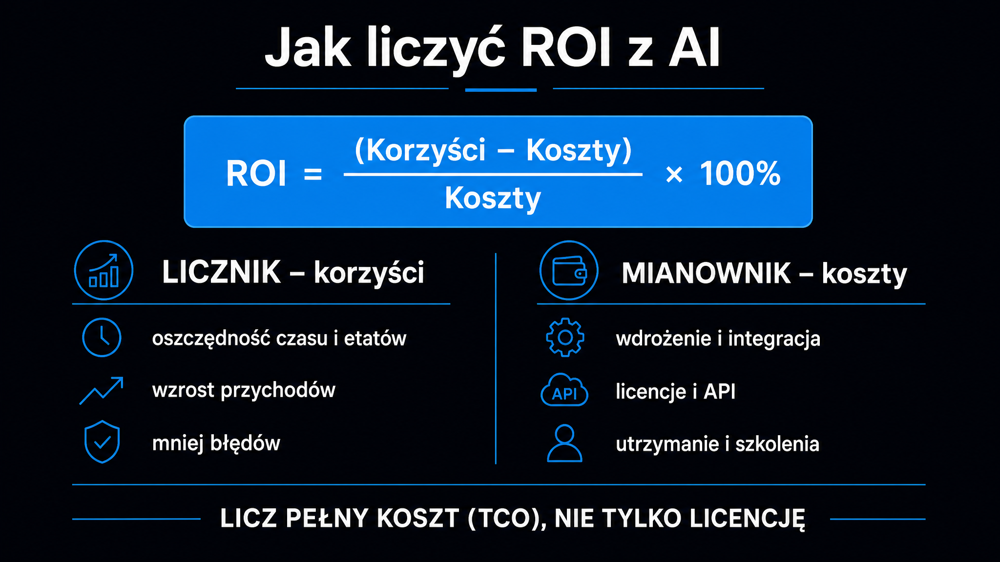

Kalkulacja ROI (Return on Investment, czyli wskaźnika zwrotu z inwestycji) z wdrożenia AI to jedno z najtrudniejszych wyzwań, z jakimi przychodzą do nas firmy. Jednocześnie to absolutny priorytet. Raport MIT NANDA z 2025 roku wskazuje, że mimo 30–40 mld dolarów zainwestowanych w generatywną AI aż 95% organizacji nie uzyskuje z niej żadnego mierzalnego zwrotu. Często problem nie leży w samej technologii, lecz w wyborze procesów oraz w sposobie liczenia kosztów i korzyści. **Poznaj konkretne ramy analityczne: od wzoru na ROI, przez strukturę kosztów całkowitych (TCO), po trzy przykładowe scenariusze kalkulacji.**

## Dlaczego klasyczna formuła ROI nie wystarcza?

Tradycyjne podejście do oceny inwestycji IT opiera się na prostym równaniu. Liczysz korzyści netto minus koszty całkowite, dzielisz przez koszty całkowite i mnożysz przez 100%. W przypadku AI ta formuła to zaledwie punkt wyjścia, a nie gotowa odpowiedź.

**Wdrożenie AI różni się od zakupu oprogramowania biurowego pod trzema kluczowymi względami.** Korzyści nie są liniowe – rosną wraz z jakością danych i adaptacją narzędzi przez pracowników, często gwałtownie przyspieszając w drugim i trzecim roku. Szacunki kosztów całkowitych często mijają się z rzeczywistością – według badania opisanego przez CIO.com 85% organizacji myli się w nich o ponad 10%, a blisko co czwarta o 50% i więcej – bo firmy uwzględniają licencje, ale pomijają integrację, szkolenia i utrzymanie modeli. Ponadto część wartości ma charakter strategiczny i nie trafia do rachunku zysków i strat w krótkim terminie.

Pełna kalkulacja ROI z AI wymaga zatem trzech warstw analizy, a nie jednej liczby. Horyzont czasowy i typ pomiaru dla każdej z nich wymagają ścisłego uporządkowania.

| Warstwa ROI | Horyzont czasowy | Kluczowe wskaźniki (KPI) |
|---|---|---|
| ROI zrealizowany | 18–36 miesięcy | Bezpośrednie oszczędności kadrowe, marża brutto, ROI % |
| ROI trendu | 3–12 miesięcy | Czas cyklu procesu, wskaźnik adaptacji narzędzia, dokładność modeli |
| ROI zdolności | Ciągły | Dojrzałość danych, kompetencje zespołu, redukcja długu technicznego |

Według badania IBM z 2025 roku tylko 25% inicjatyw AI przyniosło oczekiwany zwrot. Reszta buduje wartość, której nie widać w arkuszu kalkulacyjnym po 12 miesiącach. **Zanim więc pokażesz CFO jedną liczbę, upewnij się, że mierzysz właściwą warstwę.**

## Składniki ROI – co wchodzi do licznika i mianownika

Zanim zaczniesz liczyć, zdefiniuj dokładnie, co zaliczasz do korzyści, a co do kosztów. To właśnie tutaj najczęściej pojawiają się błędy fałszujące ostateczny wynik.

Korzyści netto to suma trzech strumieni wartości:

- **Oszczędności operacyjne** – zaoszczędzony czas pracy zespołu, zredukowana liczba błędów, niższe koszty obsługi procesów powtarzalnych
- **Wzrost przychodów** – wyższe konwersje dzięki personalizacji, skrócony czas wprowadzenia produktu na rynek, dodatkowe źródła sprzedaży uruchomione przez AI
- **Uniknięte koszty** – zapobieganie awariom (predykcyjne utrzymanie ruchu), ograniczona rotacja pracowników, mniejsze ryzyko regulacyjne

**Każdy z tych strumieni wymaga osobnej kwantyfikacji – łączenie ich w jedną ogólną kwotę „oszczędności" to jeden z najczęstszych błędów w prezentacjach dla zarządu.**

Po stronie kosztów uwzględnij pełny [całkowity koszt posiadania](https://pl.wikipedia.org/wiki/Total_cost_of_ownership) (TCO – Total Cost of Ownership). Firmy zazwyczaj biorą pod uwagę koszty licencji i infrastruktury, ale nagminnie pomijają inne aspekty:

- **Integracja i wdrożenie** – połączenie z istniejącymi systemami CRM, ERP, bazami danych; często jedna z największych pozycji budżetu projektu
- **Zarządzanie danymi** – porządkowanie, oznaczanie i utrzymanie danych treningowych; bez dobrej jakości danych model nie działa
- **Utrzymanie modeli (MLOps)** – regularne ponowne trenowanie wskutek zjawiska dryfu danych, monitoring dokładności, aktualizacje
- **Zmiana kulturowa i szkolenia** – czas menedżerów, koszty onboardingu, opór wewnętrzny, który wyraźnie wydłuża zwrot przy automatyzacji zdezorganizowanych procesów
- **Kadry specjalistyczne** – zatrudnienie specjalistów (np. analityków danych, inżynierów ML) lub koszty konsultingu zewnętrznego przez cały cykl życia systemu

## Jak krok po kroku liczyć ROI?

Zanim uruchomisz model finansowy, zrób jedno. Zmierz stan wyjściowy. Bez punktu odniesienia (ang. baseline) nie udowodnisz korzyści. Sprawdź czas trwania procesu, liczbę błędów i koszt obsługi transakcji – zanim wdrożysz AI.

Następnie wybierz metodę kalkulacji. Oto cztery podejścia stosowane w praktyce:

- **Analiza kosztów i korzyści z okresem zwrotu** – najprostsza metoda, idealna dla szybkich wdrożeń o niskiej złożoności; liczysz, po ilu miesiącach nakłady się zwracają
- **Wartość bieżąca netto (NPV)** – rekomendowana dla wieloletnich programów; uwzględnia zmianę wartości pieniądza w czasie, dyskontuje przyszłe przepływy stopą opartą na WACC
- **Metodologia TEI (Total Economic Impact)** – opracowana przez Forrester Research; wycenia też elastyczność biznesową i wartość opcji strategicznych, wykraczając poza twarde wskaźniki księgowe
- **Zrównoważona karta wyników (KPI Scorecard)** – łączy perspektywę finansową z operacyjną i obszarem kompetencji; użyteczna, gdy projekt ma wielu interesariuszy o różnych priorytetach

**Dla projektów pilotażowych najlepsza jest analiza kosztów i korzyści z wyraźnie określonym horyzontem 18 miesięcy.** Z kolei dla strategicznych transformacji na poziomie całej firmy wybierz NPV lub TEI.

## Trzy przykładowe scenariusze kalkulacji

Teoria nabiera znaczenia dopiero przy konkretnych liczbach. Przeanalizujmy trzy hipotetyczne scenariusze wdrożeń, które pokazują różne profile ROI. Kwoty i odsetki są ilustracyjne – służą pokazaniu sposobu liczenia, a nie są danymi z konkretnych wdrożeń.

### Predykcyjne utrzymanie ruchu – przemysł

Przedsiębiorstwo produkcyjne z 50 maszynami CNC generuje roczne straty z nieplanowanych przestojów rzędu 1 200 000 PLN. System oparty na czujnikach i modelach predykcyjnych AI redukuje awarie o 45%, przynosząc 540 000 PLN oszczędności rocznie. Koszty startowe (CAPEX) wynoszą 350 000 PLN, roczne utrzymanie (OPEX) – 60 000 PLN.

ROI w pierwszym roku wynosi: (540 000 – 60 000 – 350 000) / 350 000 × 100% = 37%. Okres zwrotu to: 350 000 PLN / 480 000 PLN = ok. 8,7 miesiąca. **To przykład wdrożenia, w którym ROI jest czytelny już w pierwszym roku – bo koszty awarii precyzyjnie zmierzono przed startem prac.**

### Redukcja odpływu klientów – SaaS

Wydawca oprogramowania z 10 000 klientów i rocznym przychodem 1 200 USD na klienta notuje 8% odpływ (churn), co oznacza 960 000 USD straconego przychodu rocznie. System AI do analizy predykcyjnej zachowań użytkowników redukuje churn o 25%, ratując 200 klientów. Nakłady startowe wynoszą 200 000 USD, a roczny OPEX: 80 000 USD.

Roczne korzyści netto to: 240 000 – 80 000 = 160 000 USD. Okres zwrotu: 200 000 / 160 000 = 15 miesięcy. Z kolei ROI od drugiego roku wynosi ok. 57%. **To typowy scenariusz dla firm SaaS, gdzie najcenniejsza jest możliwość precyzyjnego zmierzenia wartości klienta przed wdrożeniem i po nim.**

### Automatyzacja obsługi zgłoszeń – instytucja finansowa

Duża instytucja finansowa wdraża system konwersacyjny AI, który przejmuje 40% wolumenu zgłoszeń bez angażowania konsultantów. Roczne oszczędności sięgają 1 400 000 USD. Nakłady łączne (CAPEX + OPEX pierwszego roku) to 400 000 USD.

ROI w pierwszym roku wynosi: (1 400 000 – 400 000) / 400 000 × 100% = 250%. Uwolnieni konsultanci nie zostają zwolnieni – trafiają do zadań o wyższej wartości dodanej. **To kluczowy element zmiany kulturowej, który minimalizuje opór wewnętrzny i przyspiesza adaptację rozwiązania.**

<aside class="callout-fact">
  
✦

  

    
Benchmark

    
Studia TEI (Total Economic Impact) firmy Forrester są zamawiane przez dostawców technologii i opisują wdrożenia u wybranych klientów – wysokie wartości ROI z takich raportów traktuj więc jako górną granicę, a nie średnią rynkową. <strong>Wspólny mianownik wdrożeń z wysokim ROI: precyzyjnie zmierzony punkt wyjściowy i jasne KPI finansowe przed startem projektu.</strong>

  

</aside>

## Siedem błędów, które zawyżają lub zaniżają ROI

Znając ramy analityczne i przykłady, nadal łatwo wpaść w pułapki metodologiczne. Zwróć uwagę na błędy, które najczęściej fałszują kalkulacje:

- **Uwzględnianie wyłącznie kosztów licencji** – pomijanie kosztów integracji, szkoleń i utrzymania modeli prowadzi do zaniżenia TCO – nawet o kilkadziesiąt procent
- **Założenie stuprocentowej automatyzacji** – systemy AI zwykle przejmują tylko część procesu; reszta wciąż wymaga nadzoru człowieka
- **Brak punktu odniesienia** – bez zmierzenia stanu przed wdrożeniem nie ma dowodu na korzyści
- **Ocena tylko po 12 miesiącach** – pierwsze miesiące to faza uczenia i integracji; wartość ujawnia się w latach 2–3
- **Automatyzacja chaosu** – wdrożenie AI w nieuporządkowanym, niestandardowym procesie wyraźnie wydłuża zwrot
- **Miękkie KPI bez przeliczenia** – brak satysfakcji pracowników przekłada się na realne koszty rotacji; przelicz je na złotówki lub zostaw poza kalkulacją
- **Porównanie do zera, nie do alternatywy** – zestawienie z kosztem rekrutacji dodatkowego zespołu lub droższego oprogramowania często czyni ROI z AI oczywistym

**Najsilniejszy argument w prezentacji dla CFO to koszt braku działania – ile firma traci miesięcznie, zostając przy obecnym procesie.**

## Jak prezentować ROI zarządowi?

Nawet najlepszy model finansowy może nie przejść zatwierdzenia, jeśli zostanie źle zaprezentowany. Wdrożenie wymaga odpowiedniej narracji.

Zacznij od scenariusza pesymistycznego i zadaj pytanie: „Czy nawet przy tych konserwatywnych założeniach projekt ma sens?". Pozytywna odpowiedź na trudniejsze pytanie sprawia, że scenariusz realistyczny staje się oczywistym sukcesem.

Wdrożenie pilotażowe (Proof of Concept) z budżetem poniżej 100 000 PLN, ograniczone do jednego procesu i z twardymi KPI po 90 dniach, jest znacznie łatwiejsze do zatwierdzenia niż wielomilionowy program transformacji. **Walidacja pilotażu to naturalny mandat do pełnego wdrożenia.**

Pamiętaj o benchmarkach branżowych. Informacja, że bezpośredni konkurent uruchomił podobny system i skrócił czas obsługi zamówień o 30%, wywiera presję decyzyjną skuteczniejszą niż najdokładniejszy model DCF.

Jeśli chcesz zobaczyć, jak Twoja marka jest widoczna w odpowiedziach AI – co bezpośrednio przekłada się na przychody w kanale AI Search – darmowe narzędzie [Widoczność marki w AI](/narzedzia/brand-check/) odpyta cztery silniki AI i pokaże Twój aktualny udział głosu w kategorii.

<aside class="callout-expert">
  

  

    
Opinia eksperta

    
W projektach, które prowadzimy w ICEA, widzę jeden wzorzec: firmy, które potrafią udowodnić ROI z AI, zaczęły mierzyć procesy, zanim rozpoczęły wdrożenie. Nie po to, żeby zbierać dane – po to, żeby mieć punkt odniesienia (ang. baseline). Bez niego każda prezentacja wyników dla zarządu to słowo przeciwko słowu. <strong>Pierwsze dwie godziny projektu warto poświęcić na jedno pytanie: jak dziś mierzymy proces, który AI ma poprawić? Jeśli nie znamy odpowiedzi, przed jakimkolwiek wdrożeniem powinniśmy zacząć właśnie od tego.</strong>

    
Mateusz Wiśniewski · Ekspert SEO/AI Search, ICEA

  

</aside>

## Polska specyfika – ulgi podatkowe, które poprawiają ROI

W polskich realiach ostateczny ROI z inwestycji w AI można podnieść, korzystając z dwóch instrumentów podatkowych. Warto uwzględnić je w kalkulacji już na etapie planowania, a nie po fakcie.

Ulga B+R (badawczo-rozwojowa) pozwala podatnikom PIT i CIT na dodatkowe odliczenie kosztów kwalifikowanych od podstawy opodatkowania. Zaliczają się do nich m.in. wynagrodzenia personelu badawczego, koszty aparatury i licencji. Prace nad rozwojem algorytmów uczenia maszynowego mogą zostać uznane za działalność badawczo-rozwojową, jeśli mają charakter twórczy i prowadzą do nowych rozwiązań – samo wdrożenie gotowego narzędzia zwykle tego warunku nie spełnia.

Preferencja IP Box umożliwia z kolei opodatkowanie dochodu z kwalifikowanego prawa własności intelektualnej (autorskie prawo do kodu źródłowego lub algorytmu) stawką 5% zamiast 19%. Kod lub algorytm musi być utworem chronionym prawem autorskim, więc AI może pełnić tylko rolę narzędzia wspomagającego, a kluczowe decyzje projektowe podejmuje człowiek. Firma musi też prowadzić szczegółową ewidencję i dokumentację wkładu twórczego programistów.

**W praktyce oba instrumenty mogą wyraźnie poprawić wynik kalkulacji i skrócić okres zwrotu – ich zastosowanie w konkretnym projekcie warto potwierdzić z doradcą podatkowym.**

Pełne pozycjonowanie marki w kanale AI Search – z mierzalnym wpływem na przychody – to usługa, która wychodzi poza samą kalkulację ROI. Więcej o tym, co dokładnie obejmuje, przeczytasz w opisie [pozycjonowania AI](/pozycjonowanie-ai/) oraz w artykule o [ROI z GEO](/geo/roi-z-geo/), gdzie omawiamy zwrot z optymalizacji widoczności marki w silnikach AI.

Jeśli dopiero zaczynasz przygodę z AI w firmie i szukasz pierwszych kroków przed kalkulacją ROI, [przewodnik wskazujący, od czego zacząć](/ai-w-biznesie/od-czego-zaczac/) opisuje kolejność decyzji i zasobów niezbędnych przed uruchomieniem pierwszego projektu. Szerszy kontekst – w tym to, jak AI zmienia marketing i generowanie leadów – znajdziesz w artykule o [AI w marketingu](/ai-w-biznesie/ai-w-marketingu/).
