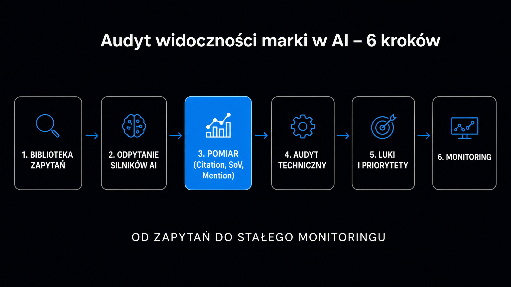

Jeśli Twoja marka nie pojawia się w odpowiedziach ChatGPT, Gemini czy Perplexity na pytania z Twojej branży, tracisz klientów bez żadnego sygnału w Google Analytics. Szacuje się, że już 37% zapytań zakupowych zaczyna się od konwersacji z modelem językowym, a tradycyjna analityka tych interakcji w ogóle nie rejestruje. Audyt widoczności marki w silnikach generatywnych – czyli GEO (Generative Engine Optimization) – to dziś tak samo obowiązkowy punkt kontrolny jak klasyczny audyt SEO. Ten przewodnik przeprowadza Cię przez cały proces krok po kroku: od przygotowania zestawu zapytań testowych, przez ocenę wyników, po pierwsze konkretne działania optymalizacyjne.

## Dlaczego standardowe SEO nie pokazuje problemu?

Klasyczne narzędzia monitoringu – Google Search Console, Ahrefs, Semrush – mierzą kliknięcia z listy wyników. Problem polega na tym, że użytkownik pytający ChatGPT o najlepsze oprogramowanie CRM dla agencji marketingowej nigdy nie trafi do Search Console. Nie kliknie żadnego linku, jeśli odpowiedź AI wyda mu się wystarczająca.

**To zjawisko nosi nazwę zero-click presence – marka jest wzmiankowana lub pomijana w syntezie AI bez żadnego ruchu rejestrowanego przez tradycyjną analitykę.** Badanie 5W AI Visibility Index z 2026 roku, analizujące 104 marki z sektora finansowego w USA, wykazało, że rekomendacje generowane przez ChatGPT, Claude, Perplexity i Gemini uległy gwałtownej standaryzacji – wąska grupa liderów zdominowała przestrzeń rekomendacyjną, pozostałe marki zniknęły z odpowiedzi praktycznie zupełnie.

Drugi problem to mechanizm, który decyduje o cytowaniu. Modele AI korzystają z dwóch źródeł wiedzy: statycznej bazy treningowej (dane sprzed daty odcięcia) oraz dynamicznego systemu [RAG (Retrieval-Augmented Generation)](https://pl.wikipedia.org/wiki/Retrieval-augmented_generation), czyli generowania odpowiedzi wzbogaconego o wyszukiwanie w czasie rzeczywistym. Perplexity odpytuje własny indeks, Gemini opiera się na Google, ChatGPT z włączonym wyszukiwaniem korzysta z Bing. Jeśli Twoja strona jest technicznie niedostępna dla botów AI albo treść jest zbyt ogólna, żeby model mógł ją zacytować jako konkretny fakt – nie pojawisz się ani w jednym, ani w drugim źródle.

<aside class="callout-fact">
  
✦

  

    
Ciekawostka

    
Platforma Stripe stworzyła wyspecjalizowane stanowisko AEO/GEO Marketing Manager z rocznym budżetem wynagrodzeń od 143 400 do 215 200 dolarów. <strong>Cel tego stanowiska to nie tylko widoczność marki, ale optymalizacja struktury witryny pod autonomiczne agenty AI realizujące zadania zakupowe w imieniu użytkowników – bez udziału człowieka w procesie decyzyjnym.</strong>

  

</aside>

## Krok 1 – Zbuduj bibliotekę zapytań testowych

Zanim odpytasz jakikolwiek model, musisz wiedzieć, na jakie pytania Twoja marka powinna pojawiać się w odpowiedziach. To fundament całego audytu – bez dobrego zestawu zapytań testowych wyniki będą przypadkowe.

Optymalny zestaw liczy od 20 do 50 pytań. Nie opieraj się na wolumenie słów kluczowych z Google Search Console – tam nie znajdziesz zapytań konwersacyjnych, które użytkownicy wpisują w ChatGPT. Skorzystaj z trzech źródeł.

Pierwsze źródło to zapytania w formie pytań z Search Console – wyeksportuj je i filtruj po słowach: „jak", „które", „co to", „kiedy". Drugie to rozmowy z działem sprzedaży i supportem – to oni słyszą realne pytania klientów przed zakupem. Trzecie to sugestie autouzupełniania Google dla głównych fraz branżowych – one odzwierciedlają intencje konwersacyjne.

Podziel gotowy zestaw na cztery kategorie intencji:

- **Odkrycie kategorii** – pytania ogólnobranżowe, np. „jakie narzędzie do monitoringu marki wybrać dla firmy B2B?"; testują, czy marka pojawia się wśród polecanych opcji
- **Porównanie** – pytania zestawiające Cię z konkretnym konkurentem, np. „różnice między X a Y – co lepsze dla e-commerce?"; pokazują, jak model pozycjonuje Twoją ofertę
- **Intencja decyzyjna** – pytania edukacyjne przed zakupem, np. „jak krok po kroku wdrożyć automatyzację newsletterów?"; weryfikują obecność marki w treściach poradnikowych
- **Autorytet i zaufanie** – pytania bezpośrednio o markę, np. „co klienci sądzą o obsłudze klienta w firmie X?"; wykrywają halucynacje i przestarzałe opisy

## Krok 2 – Przeprowadź właściwe odpytywanie modeli

Sam zestaw pytań to za mało. Odpowiedzi modeli generatywnych cechuje wysoka zmienność – ta sama fraza wpisana dwa razy może dać dwie różne odpowiedzi. Badanie Gemini z 2024 roku pokazało, że wskaźnik zmienności odpowiedzi dla identycznych zapytań wynosi od 40% do 60% w skali miesięcznej.

Żeby uzyskać stabilną miarę, każdy prompt uruchamiaj co najmniej trzy razy w różnych sesjach i dniach tygodnia. Wyczyść historię rozmów i wyloguj się z konta przed każdą serią – personalizacja sesji zaburza wyniki. Testuj na trzech silnikach: ChatGPT (z włączonym wyszukiwaniem), Gemini i Perplexity.

Dla każdego zapytania notuj:

- czy marka pojawia się w odpowiedzi (tak/nie)
- w jakiej pozycji na liście polecanych opcji (1., 2., 3.+)
- jak opisany jest produkt lub usługa – czy opis jest aktualny i poprawny
- skąd model cytuje wiedzę – czy podaje źródła, jeśli tak, to jakie

Jeden dodatkowy test, który wiele ujawnia: uruchom to samo zapytanie raz z włączonym wyszukiwaniem sieciowym, raz z wyłączonym. Jeśli marka pojawia się tylko przy włączonym wyszukiwaniu – Twoja obecność opiera się wyłącznie na bieżącym RAG, a nie na danych treningowych. To sygnał, że marka jest za słabo reprezentowana w długoterminowej pamięci modelu.

## Krok 3 – Oceń wyniki według kluczowych metryk

Surowe obserwacje z odpytywania modeli trzeba przełożyć na liczby. Bez pomiaru nie ma zarządzania – i nie ma też możliwości oceny, czy działania poprawiają sytuację.

Poniższa tabela zbiera trzy podstawowe metryki stosowane w audytach GEO wraz z definicjami i sposobem pomiaru:

| Metryka | Definicja | Jak mierzyć | Co uznać za dobry wynik |
|---|---|---|---|
| Citation Rate (wskaźnik cytowań) | Procent zapytań z zestawu testowego, w których odpowiedź AI zawiera markę lub URL | Liczba odpowiedzi ze wzmianką / całkowita liczba odpytań × 100 | >30% dla lidera niszy |
| Share of Voice (SoV, udział głosu) | Procentowy udział cytowań Twojej marki wśród wszystkich cytowań w odpowiedziach na dany zestaw zapytań | Cytowania marki / wszystkie cytowania marek × 100 | Wyższy niż u 1 kluczowego konkurenta |
| Mention Rate (wskaźnik wzmianek) | Jak często marka pojawia się z imienia w odpowiedziach AI, nawet bez cytowania ani linka | Liczba odpowiedzi z wymienioną nazwą marki / całkowita liczba odpytań × 100 | Punkt odniesienia – mierz co 2 tygodnie |

**Pomiar SoV ma sens tylko w zestawieniu z konkurencją.** Odpytaj te same pytania, ale tym razem szukaj, ile razy pojawiają się 3–4 Twoich bezpośrednich konkurentów. Różnica między Twoim SoV a SoV lidera to właśnie luka widoczności, którą audyt ma zidentyfikować.

Darmowy [Widoczność marki w AI](/narzedzia/brand-check/) odpyta cztery silniki AI o Twoją markę i pokaże, jak jesteś postrzegany na tle kategorii – bez konieczności ręcznego odpytywania każdego modelu osobno.

## Krok 4 – Audyt techniczny dostępności dla botów AI

Wyniki odpytywania modeli to obraz widoczności. Audyt techniczny wyjaśnia, dlaczego widoczność jest taka, a nie inna – i co da się naprawić najszybciej.

### Plik robots.txt i boty AI

Pierwsza i najczęstsza przyczyna niewidoczności to zablokowanie botów AI w pliku `robots.txt` – często nieintencjonalne. Sprawdź, czy żadna z reguł `Disallow` nie dotyczy botów: `GPTBot` (OpenAI), `ChatGPT-User` (OpenAI), `PerplexityBot` (Perplexity), `Google-Extended` (Google) i `ClaudeBot` (Anthropic). Błędy w konfiguracji zapory Cloudflare potrafią blokować część tych botów bez jakiegokolwiek wpisu w `robots.txt`.

Narzędzie [Dostęp botów AI](/narzedzia/ai-bots-check/) weryfikuje, które boty AI mają dostęp do Twojej domeny i sygnalizuje niezamierzone blokady.

### Renderowanie JavaScript i dostępność treści

Modele AI nie renderują JavaScriptu tak jak przeglądarka. Jeśli kluczowe treści – cenniki, tabele porównawcze, opisy produktów – ładują się wyłącznie po inicjalizacji skryptów po stronie klienta, bot AI widzi pustą stronę. Wymagany standard to renderowanie po stronie serwera (SSR) lub generowanie statyczne (SSG).

Sprawdź, co widzi bot: wyświetl źródło strony przez `Ctrl+U` w przeglądarce i poszukaj kluczowych akapitów treści w surowym HTML. Jeśli ich tam nie ma – bot AI też ich nie widzi.

### Logi serwera – rzeczywista aktywność botów

Logi dostępu (`access.log`) w serwerze Apache lub Nginx rejestrują każdą wizytę bota AI z dokładnym adresem URL, datą i user-agentem. Regularne zliczanie wpisów `PerplexityBot`, `GPTBot` i `ClaudeBot` daje Ci obraz, jak często Twoja strona jest faktycznie odpytywana jako źródło RAG – nawet gdy użytkownik końcowy nie kliknie żadnego linku.

<aside class="callout-expert">
  

  

    
Opinia eksperta

    
W audytach GEO przeprowadzanych w ICEA najczęstszy problem techniczny to nieintencjonalne blokowanie GPTBot przez reguły Cloudflare WAF – właściciel strony nie wie, że to się dzieje, bo ruch botów AI nie jest widoczny w GA4. Drugi z kolei problem to treść ładowana przez JavaScript: strony wyglądają świetnie w przeglądarce, ale bot widzi szkielet HTML bez żadnych danych. <strong>Sprawdzenie robots.txt i wyłączenie blokady GPTBot to pierwsze działanie po każdym audycie – efekt w postaci pierwszych cytowań pojawia się już po 2–4 tygodniach od odblokowania.</strong>

    
Piotr Wicenciak · SEO Operations Manager, ICEA

  

</aside>

## Krok 5 – Analiza luk i priorytetyzacja działań

Masz teraz dwa zestawy danych: wyniki widoczności (metryki) i wyniki techniczne. Zestawiając je, identyfikujesz dwa różne rodzaje luk.

**Luki techniczne** – marka w ogóle nie jest dostępna dla botów lub treść jest niemożliwa do wyodrębnienia przez modele. Naprawa przynosi efekty szybko, często w ciągu 2–4 tygodni. Do tej kategorii należą: odblokowanie botów w `robots.txt`, naprawa renderowania JS, wdrożenie `llms.txt`, dodanie danych strukturalnych JSON-LD.

**Luki merytoryczne** – marka jest technicznie dostępna, ale treść jest zbyt ogólna, żeby model mógł ją zacytować jako konkretny fakt. Naprawa wymaga przepisania kluczowych stron. Badanie [Aggarwal et al. (KDD 2024)](https://arxiv.org/abs/2311.09735) z Princeton University wykazało, że cytowanie autorytatywnych źródeł zewnętrznych podnosi wskaźnik cytowań o 40%, dodanie danych statystycznych o 37%, a cytowania ekspertów o 30%. To nie są wzrosty marginalne – to różnica między pomijaną a regularnie cytowaną stroną.

Priorytety ustal według stosunku efektu do nakładu pracy:

1. Odblokuj boty AI w `robots.txt` – 30 minut, efekt pewny
2. Wdróż `llms.txt` z opisem marki i kluczowych stron – 2 godziny
3. Dodaj JSON-LD `Organization` i `FAQPage` do głównych stron ofertowych – 1 dzień
4. Przepisz 3–5 priorytetowych stron: statystyki z datą i źródłem, nagłówki jako pytania, bloki 200–400 słów
5. Zbuduj sygnały zewnętrzne: wzmianki w mediach branżowych, forach, raportach

Pełne omówienie strategii GEO znajdziesz w [przewodniku po Generative Engine Optimization](/geo/przewodnik/), a jeśli chcesz zrozumieć, skąd modele czerpią wiedzę o cytowaniu – wyjaśnia to artykuł o [tym, jak LLM-y cytują źródła](/geo/jak-llm-cytuja-zrodla/).

## Krok 6 – Stały monitoring i harmonogram re-audytu

Jednorazowy audyt daje punkt startowy. Widoczność w AI zmienia się dynamicznie – modele są aktualizowane, nowe treści konkurentów wchodzą do indeksów, a zmienność odpowiedzi sięga 40–60% miesięcznie. Bez regularnego pomiaru nie wiesz, czy idziesz w górę czy w dół.

Ustal trzyszczeblowy rytm pomiaru:

- **Co 2 tygodnie** – ręczne sprawdzenie próby 10 najważniejszych zapytań ze stałego zestawu testowego; notuj Citation Rate i wszelkie zmiany w opisie marki
- **Co miesiąc** – pełne odpytanie całego zestawu 20–50 pytań; porównaj SoV z poprzednim miesiącem i z konkurentami; sprawdź logi serwera pod kątem aktywności botów
- **Co kwartał** – pełny re-audyt techniczny: `robots.txt`, renderowanie, JSON-LD, spójność danych o marce w różnych miejscach w sieci; porównaj z benchmarkiem z pierwszego audytu

Zmienność odpowiedzi to zjawisko normalne – nie reaguj na każde wahnięcie. Reaguj na trend: jeśli Citation Rate spada przez dwa kolejne miesiące, szukaj przyczyny. Jeśli rośnie – identyfikuj, która ze zmian to spowodowała, i skaluj tę taktykę.

Do monitorowania SoV w sposób zautomatyzowany warto rozważyć wyspecjalizowane platformy. Nightwatch od wersji mid-tier (od 32 USD miesięcznie) śledzi jednocześnie pozycje w LLM i wyniki tradycyjne. Otterly AI (od 29 USD miesięcznie) generuje automatyczne alerty przy negatywnym sentymencie i wykrytych halucynacjach. Jeśli szukasz czegoś prostszego do oceny, zanim zaangażujesz budżet – [Widoczność marki w AI](/narzedzia/brand-check/) pozwoli Ci zobaczyć punkt startowy bez żadnych kosztów.
