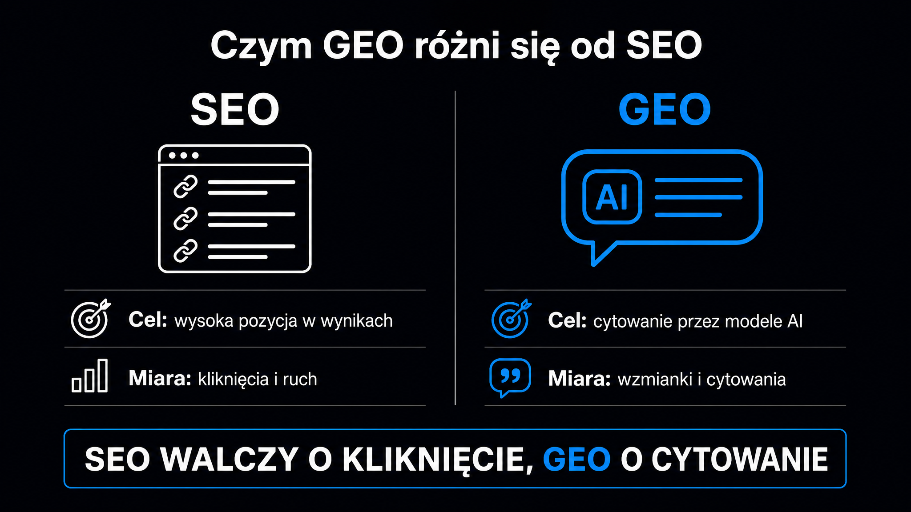

GEO, czyli *Generative Engine Optimization* (optymalizacja pod kątem generatywnych silników wyszukiwania), to odpowiedź na jedno z ważniejszych pytań współczesnego marketingu: dlaczego Twoja marka znika z odpowiedzi ChatGPT, Perplexity czy Google AI Overviews, mimo że świetnie radzi sobie w tradycyjnym Google? Badanie [Aggarwala i in. (KDD 2024)](https://arxiv.org/abs/2311.09735) z Princeton University jako pierwsze zmierzyło empirycznie, które cechy treści zwiększają szansę na cytowanie przez duże modele językowe. Odpowiedź zaskoczyła wielu specjalistów SEO: klasyczne zabiegi pozycjonowania nie działają, a część z nich – jak nasycanie tekstów słowami kluczowymi – wyraźnie obniża widoczność w modelach LLM.

## Czym GEO różni się od SEO i AEO

Przez ponad dwie dekady optymalizacja dla wyszukiwarek oznaczała w praktyce jedno: walkę o pozycję na liście linków. Wpisujesz frazę, Google renderuje ranking z dziesięcioma wynikami, Ty optymalizujesz stronę, żeby wspiąć się wyżej. AEO (*Answer Engine Optimization*, optymalizacja pod silniki odpowiedzi) poszło o krok dalej – celem stała się pozycja zero, czyli bezpośrednia odpowiedź wyświetlana nad wynikami organicznymi.

GEO zmienia zasady gry. Tu nie chodzi o zajęcie miejsca w rankingu. Chodzi o to, żeby Twoja treść – Twoje dane, definicje, cytowania – znalazła się wewnątrz syntetyzowanej odpowiedzi, którą LLM (*Large Language Model*, czyli duży model językowy) generuje w czasie rzeczywistym. Użytkownik nie widzi dziesięciu linków do wyboru. Widzi jeden spójny tekst, który model skleił z kilkunastu źródeł jednocześnie.

Trzy dyscypliny i ich kluczowe cechy porządkuje poniższa tabela. Warto traktować ją jako punkt wyjścia, a nie sztywną granicę – w praktyce obszary te się przenikają:

| Czynnik | Tradycyjne SEO | AEO | GEO |
|---|---|---|---|
| **Główny cel** | Kliknięcie z listy wyników | Odpowiedź bezpośrednia (pozycja zero) | Cytowanie wewnątrz syntezy AI |
| **Typ zapytania** | Frazy 2–5 słów | Pytania głosowe i tekstowe | Konwersacyjne, złożone (20+ słów) |
| **Co decyduje o sukcesie treści** | Słowa kluczowe, backlinki | Bloki Q&A, struktura FAQ | Gęstość faktograficzna, cytowania, autorytet |
| **Jak mierzyć efekty** | Pozycja SERP, ruch organiczny | Wyświetlenie bezpośredniej odpowiedzi | Citation Rate, Share of Voice (SoV) |
| **Rola linków zewnętrznych** | Kluczowa | Średnia | Niska – liczy się wzmianka, nie link |

**GEO nie zastępuje SEO – nadbudowuje się na nim.** Modele AI chętniej cytują strony, które mają silną pozycję organiczną, ponieważ wysoka pozycja w Google koreluje z tym, że bot z systemem RAG w ogóle trafi na Twoją witrynę podczas pobierania danych. Jednak sama dobra pozycja w Google nie gwarantuje obecności w odpowiedzi AI.

## Jak LLM-y pobierają i cytują treść

Zanim zaczniesz optymalizować pod kątem GEO, musisz zrozumieć mechanizm, który decyduje o tym, czyja treść trafia do odpowiedzi modelu.

Większość nowoczesnych silników AI – Perplexity, Google AI Overviews, Microsoft Copilot – opiera się na architekturze RAG. [Generowanie wspomagane wyszukiwaniem](https://pl.wikipedia.org/wiki/Retrieval-augmented_generation) (ang. *Retrieval-Augmented Generation*) polega na tym, że model w momencie zapytania dynamicznie przeszukuje sieć, pobiera fragmenty stron i na ich podstawie generuje spójną odpowiedź. Twoja strona musi być technicznie dostępna dla botów AI i zawierać treść łatwą do pobrania oraz wyekstrahowania.

Drugi mechanizm to dane treningowe. ChatGPT bez dostępu do wyszukiwarki (w trybie bazowym) oraz Claude opierają wiedzę na tym, co model przyswoił przed datą graniczną wiedzy (ang. *cutoff date*) – i co uznał za wiarygodne źródło. Tutaj obecność w odpowiedziach zależy od tego, czy Twoja marka była cytowana, linkowana i wzmiankowana w treściach, które trafiły do korpusu treningowego.

### Jak model wybiera fragment do zacytowania

Silniki RAG nie czytają strony jak człowiek – od nagłówka do stopki. Dzielą tekst na fragmenty o długości 200–400 słów, zamieniają je na reprezentacje wektorowe (ang. *embeddings*) i wyszukują te partie, które semantycznie najlepiej odpowiadają zapytaniu. Ma to poważną konsekwencję praktyczną: **nie wystarczy mieć „dobry artykuł" – każdy jego fragment musi samodzielnie odpowiadać na jedno konkretne pytanie**.

Trzy właściwości fragmentu, które podnoszą szansę na jego wybór przez model:

- **Samodzielność** – fragment zawiera definicję, tezę lub dane bez konieczności czytania reszty artykułu; model musi móc wyciąć go z kontekstu i nadal go rozumieć.
- **Gęstość faktograficzna** – liczby, daty, nazwy własne, cytowania źródeł; coś, co model może bezpiecznie powtórzyć jako fakt bez ryzyka halucynacji.
- **Zgodność z nagłówkiem** – nagłówek sformułowany jak pytanie, a bezpośrednio pod nim odpowiedź na to pytanie (zasada BLUF: *Bottom Line Up Front* – najważniejsza informacja na początku sekcji).

### Dostęp techniczny – warunek wstępny

Aby w ogóle mieć szansę na widoczność, musisz sprawdzić, czy boty AI mają dostęp do Twojej strony. `GPTBot`, `ClaudeBot`, `PerplexityBot` – każdy z nich weryfikuje plik `robots.txt` przed wejściem na witrynę. Błędy w konfiguracji firewalla lub niepoprawne reguły w `robots.txt` blokują część tych botów bez wiedzy właściciela domeny.

<aside class="callout-fact">
  
✦

  

    
Ciekawostka

    
Badanie Princeton (Aggarwal i in., KDD 2024) przetestowało 9 taktyk optymalizacji na benchmarku GEO-bench złożonym z 10 000 zapytań z 25 dziedzin. Tradycyjne nasycanie słowami kluczowymi – standard SEO sprzed dekady – nie tylko nie pomagało, ale <strong>bezpośrednio przyczyniało się do spadku wskaźnika cytowalności o 8%, a w testach na Perplexity nawet o 10%</strong>. Modele AI klasyfikują takie teksty jako treści niskiej jakości i eliminują je z procesu generowania odpowiedzi.

  

</aside>

## Co empirycznie działa – wyniki badania Princeton KDD 2024

Badanie Aggarwala i współautorów z Princeton University oraz IIT Delhi to pierwszy duży akademicki test zjawiska GEO. W jego ramach stworzono GEO-bench – zestaw 10 000 zapytań z 25 dziedzin, testowanych na systemach symulujących wyszukiwarki wspomagane AI (takie jak Microsoft Copilot i Perplexity AI).

Do pomiaru widoczności badacze użyli dwóch wskaźników. Pierwsza miara – PAWC (liczba słów ze źródła w syntezie skorygowana o pozycję) – zlicza słowa z Twojej strony, które znalazły się w odpowiedzi modelu, ważąc je pozycją: im wcześniej w tekście, tym wyżej. Druga miara – SI (subiektywne wrażenie) – ocenia jakościowo wpływ źródła na spójność i unikalność wygenerowanej odpowiedzi.

Wyniki testowania wybranych taktyk:

- **Cytowania ekspertów** – wzrost PAWC o 30–41%; gotowe, autorytatywne moduły, które model może bezpiecznie powtórzyć bez ryzyka błędu.
- **Statystyki i dane liczbowe** – wzrost o 30–31%; liczby są łatwiejsze do ekstrakcji przez algorytmy modeli niż opisy narracyjne.
- **Linkowanie do źródeł zewnętrznych** – wzrost o 28%; modele są trenowane w taki sposób, aby treści z przypisami bibliograficznymi traktować jako bardziej wiarygodne.
- **Optymalizacja płynności tekstu** – wzrost o 28%; brak błędów językowych zmniejsza utrudnienia w przetwarzaniu tekstu przez model.
- **Autorytatywny, encyklopedyczny ton** – wzrost o 10%; styl zbliżony do Wikipedii działa na model jak sygnał wysokiej wiarygodności.

**Najważniejsze odkrycie badania dotyczy mniejszych stron: witryny z pozycji 5–10 w Google, które zastosowały statystyki i cytowania, zwiększały swoją widoczność w LLM-ach nawet o 115%.** To wynik wyższy niż w przypadku liderów rankingu organicznego, którzy z tych taktyk nie skorzystali. Słabsza pozycja SEO nie wyklucza silnej pozycji GEO.

<aside class="callout-expert">
  

  

    
Opinia eksperta

    
W audytach GEO przeprowadzanych w ICEA najczęstszy problem to strony z doskonałym SEO – silnym profilem linków, wysokimi pozycjami – ale treścią pisaną pod algorytm Google sprzed 2020 roku: ogólnikowe opisy, zero liczb, zero cytowań. Dla modelu językowego taka strona jest bezużyteczna jako źródło, bo nie ma z niej co wyciągnąć bez ryzyka halucynacji. <strong>Pierwsza rekomendacja po audycie jest zawsze ta sama: zanim przepiszesz stronę od zera, dodaj trzy liczby z datą i jedno zdanie z nazwą badania do każdej sekcji H2 – wpływ na wskaźnik Citation Rate widać w ciągu 3–4 tygodni.</strong>

    
Piotr Wicenciak · SEO Operations Manager, ICEA

  

</aside>

## Jak mierzyć widoczność w AI – podstawowe metryki

Klasyczne narzędzia SEO – Google Search Console, Ahrefs, Semrush – nie mierzą widoczności w LLM-ach. Do GEO potrzebne są inne dane i zupełnie inne podejście do analityki.

Trzy metryki, które stosujemy w ICEA jako punkt wyjścia każdego audytu:

- **Citation Rate (wskaźnik cytowań)** – odsetek zapytań z zestawu testowego, w których odpowiedź AI zawiera Twoją markę lub URL; to podstawowa miara obecności w modelach językowych.
- **Share of Voice (SoV, udział w dyskusji)** – jaki odsetek wszystkich cytowań w danej niszy trafia do Twojej marki w stosunku do konkurencji; mierzony na konkretnym zestawie 20–50 zapytań branżowych.
- **Mention Rate (wskaźnik wzmianek)** – ile razy marka pojawia się z nazwy w odpowiedziach AI, nawet bez linka; istotne dla budowania rozpoznawalności przed etapem decyzyjnym klienta.

**Jak mierzyć to w praktyce bez specjalistycznego narzędzia:** wybierz 20–30 pytań, które Twoi klienci zadają w ChatGPT lub Perplexity. Odpytuj modele regularnie – na przykład co dwa tygodnie – w czystym środowisku przeglądarki (bez historii konwersacji i personalizacji). Notuj, ile odpowiedzi zawiera nazwę Twojej firmy. To Twój punkt startowy do oceny efektów optymalizacji.

Darmowe narzędzie [brand check](/narzedzia/brand-check) odpyta cztery silniki AI o Twoją markę i pokaże wynik na tle danej kategorii bez konieczności ręcznego sprawdzania każdego modelu z osobna.

Jeśli chcesz sprawdzić, jak konkretna podstrona wypada pod kątem cytowalności, narzędzie [URL check](/narzedzia/url-check) przeanalizuje ją pod kątem kluczowych czynników GEO w kilkadziesiąt sekund.

## Pierwsze kroki – co zrobić, zanim zaczniesz tworzyć treść

Wdrażanie GEO to proces wieloetapowy. Zacznij od podstaw technicznych – bez nich nawet najlepsza treść nie dotrze do modelu.

Trzy działania, od których zaczyna się każdy [audyt widoczności marki](/geo/audyt-widocznosci-marki) w ICEA:

1. **Sprawdź dostęp dla botów AI** – przejrzyj plik `robots.txt` i upewnij się, że `GPTBot`, `ClaudeBot` oraz `PerplexityBot` nie są blokowane; błędy w tym miejscu całkowicie wykluczają Cię z systemów RAG.
2. **Dodaj lub zaktualizuj `llms.txt`** – ten plik tekstowy w katalogu głównym podpowiada botom AI, co na Twojej stronie jest najważniejsze, bez konieczności indeksowania setek podstron; szczegóły implementacji opisuje nasz artykuł o [llms.txt](/geo/llms-txt).
3. **Przebuduj jedną kluczową stronę** – wybierz podstronę generującą największy ruch lub mającą kluczowe znaczenie biznesowe i zoptymalizuj ją: sformułuj nagłówki jako pytania, dodaj statystyki z datą i źródłem, podziel tekst na bloki po 200–400 słów i uwzględnij cytowania ekspertów.

Po stronie technicznej efekty odblokowania botów widać zazwyczaj w ciągu 2–4 tygodni. Pierwsze mierzalne wzrosty wskaźnika *Citation Rate* po przebudowie treści pojawiają się zwykle po 6–8 tygodniach. To znacznie szybszy cykl niż w tradycyjnym SEO, gdzie na efekty pozycjonowania czeka się często miesiącami.

Jeśli chcesz uniknąć najczęstszych pułapek, które spowalniają efekty – i przede wszystkim tych, które aktywnie szkodzą witrynie – przeczytaj artykuł o [najczęstszych błędach w GEO](/geo/najczestsze-bledy-geo).

## FAQ – najczęstsze pytania o GEO

### Czy GEO zastępuje SEO?

Nie – i to bardzo ważne rozróżnienie. GEO działa w innej płaszczyźnie niż SEO, ale obie dyscypliny wzajemnie się wzmacniają. Silna pozycja organiczna zwiększa szanse, że bot RAG w ogóle trafi na Twoją stronę podczas pobierania danych. Z drugiej strony: sama dobra pozycja w Google nie gwarantuje cytowania w AI. Dobrze zoptymalizowana pod GEO treść może generować cytowania nawet z pozycji 5–10 w wyszukiwarce, co potwierdza badanie z Princeton.

### Jak szybko widać efekty GEO?

Pierwsze efekty techniczne (odblokowanie botów, plik `llms.txt`) pojawiają się w ciągu 2–4 tygodni. Pierwsze mierzalne wzrosty *Citation Rate* po zoptymalizowaniu kluczowych stron widać po 6–8 tygodniach. Pełne efekty strategii GEO to zazwyczaj horyzont 4–6 miesięcy systematycznej pracy.

### Czym różni się GEO od AEO?

AEO (*Answer Engine Optimization*) ma na celu wyświetlenie krótkiej odpowiedzi bezpośrednio w oknie wyszukiwarki (pozycja zero, *Featured Snippet*). Celem GEO jest natomiast cytowanie wewnątrz syntetyzowanej odpowiedzi AI – znacznie dłuższej, złożonej i łączącej wiedzę z kilkunastu źródeł. GEO świetnie obsługuje zapytania konwersacyjne i złożone, podczas gdy AEO skupia się na krótkich i jednoznacznych.

### Od czego zacząć, jeśli mam ograniczone zasoby?

Od trzech kroków: sprawdź dostęp dla botów AI (w `robots.txt`), dodaj plik `llms.txt` i przebuduj jedną – generującą największy ruch – podstronę według zasad GEO. Zmierz *Citation Rate* przed zmianami i po nich. To wystarczy, aby zobaczyć pierwsze efekty i uzasadnić kolejne inwestycje. Pełną metodologię, którą stosujemy od audytu po optymalizację, opisuje nasz [przewodnik po GEO](/geo/przewodnik).
