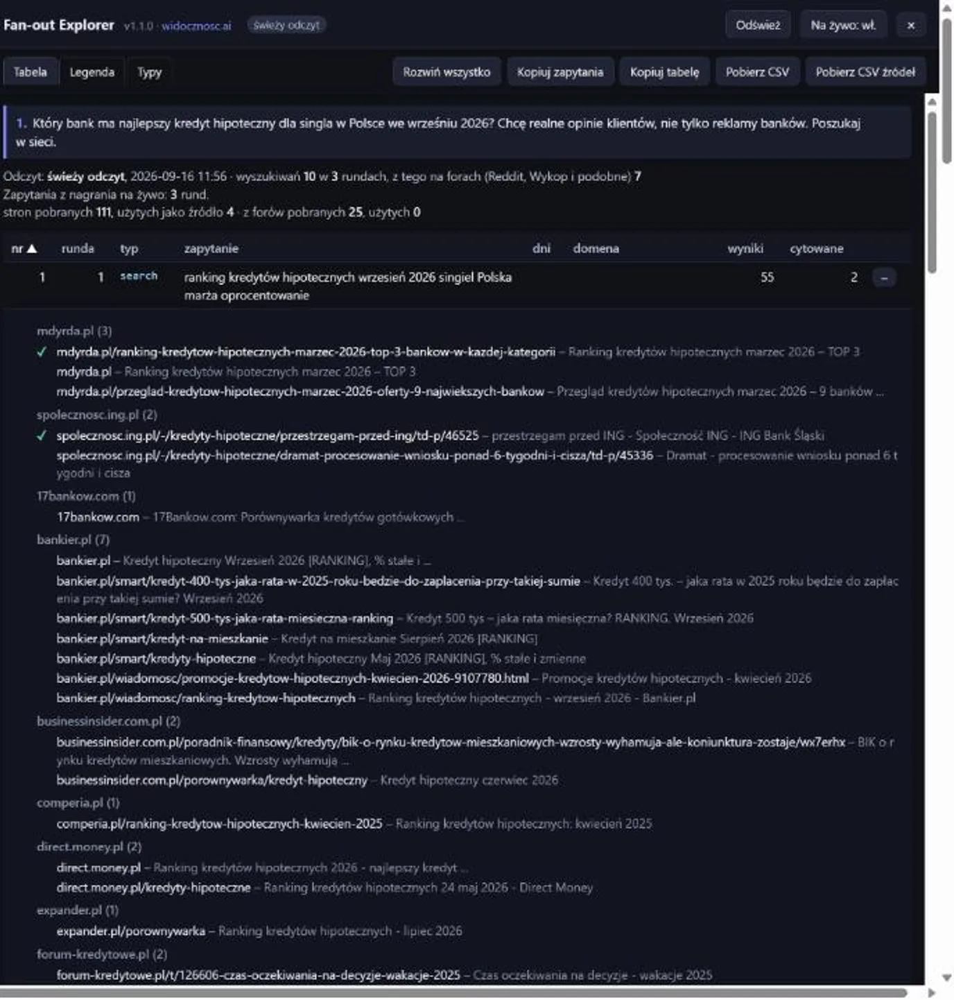
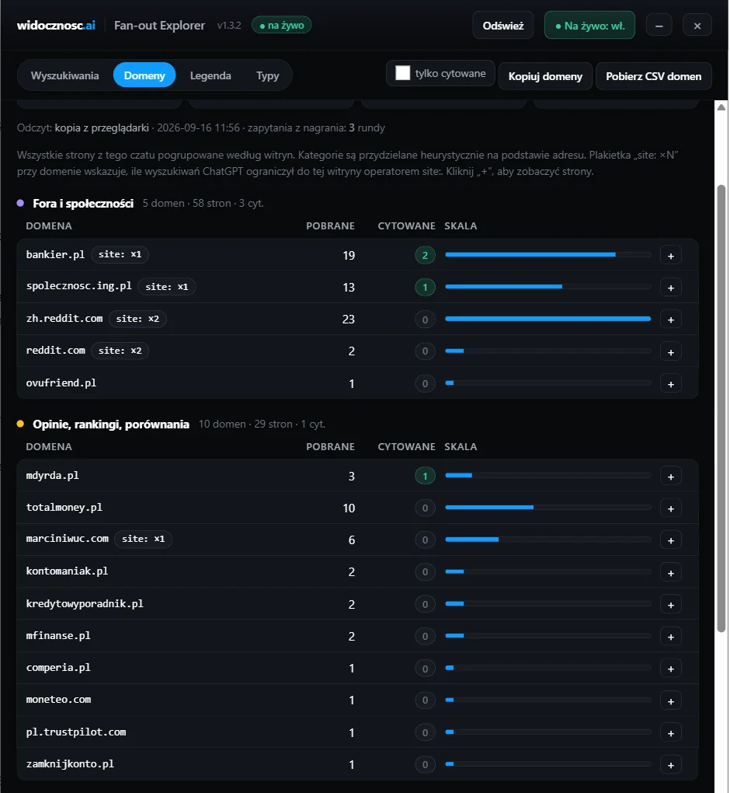
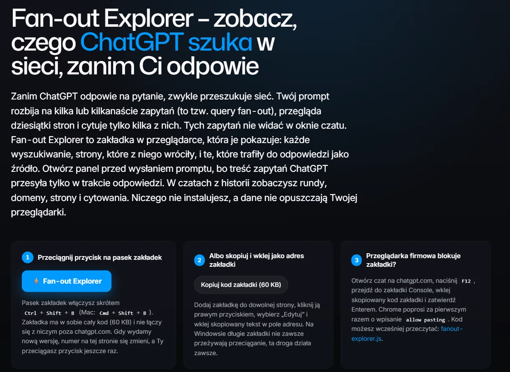

Kiedy ChatGPT korzysta z wyszukiwania, odpowiadając na pytanie o kredyt, laptop albo agencję SEO, może zmienić Twoją frazę. **Rozbija prompt na kilka do kilkunastu zapytań, wysyła je partiami, analizuje wyniki z dziesiątek stron i cytuje zaledwie kilka.** Ten proces to [query fan-out](/geo/query-fan-out/), który od dłuższego czasu jest w SEO głośnym tematem, głównie za sprawą narzędzi pozwalających śledzić go na żywo. Zbudowaliśmy własne rozwiązanie, dostosowane do języka polskiego, i sprawdziliśmy sześć polskich promptów. Poniżej znajdziesz narzędzie, dane i wnioski dla marki, która chce być cytowana w odpowiedziach AI.

## Skąd ten temat i co zrobiliśmy inaczej

Impuls dały trzy narzędzia z rynku anglojęzycznego, które zadebiutowały w 2026 roku. Suganthan Mohanadasan opisał, że ChatGPT przeszukuje Reddit z parametrami przedziału czasowego (ang. time window) 365 i 3650 dni, po czym udostępnił rozszerzenie <a href="https://fanoutfox.com/" target="_blank" rel="nofollow noopener noreferrer">FanoutFox</a>. Nati Elimelech zbudował <a href="https://en.natielimelech.com/tools/chatgpt-query-fan-out-chrome-extension" target="_blank" rel="nofollow noopener noreferrer">rozszerzenie do Chrome</a> z eksportem do CSV. Orit Mutznik stworzyła własny bookmarklet <a href="https://www.oritmutznik.com/" target="_blank" rel="nofollow noopener noreferrer">Fanout Explorer</a>, czyli jeden przycisk na pasku zakładek, niewymagający instalacji. Wszystkie trzy przechwytują dane, które ChatGPT i tak wysyła do przeglądarki.

Nasz [Fan-out Explorer](/narzedzia/fanout-explorer/) został dostosowany do polskich realiów wyszukiwania. Po pierwsze, osobno liczy fora i serwisy z opiniami, z których korzystają polscy internauci: Wykop, GoWork, Reddita oraz Quorę, która od 2019 roku ma polską wersję. Po drugie, pokazuje zapytania także w czatach z historii, więc nie trzeba pamiętać o otwarciu panelu przed promptem. Po trzecie, po wpisaniu domeny od razu mówi, czy Twoja marka trafiła do wyników, cytowań i treści odpowiedzi.

## Co pokazuje panel

Po kliknięciu zakładki w oknie czatu, z prawej strony otwiera się panel. Na górze widnieje Twój prompt i podsumowanie: ile wyszukiwań zarejestrowano w ilu rundach, ile stron zostało zwróconych, ile z nich ChatGPT pokazał jako źródło, a osobno te same statystyki dla forów. Strony przypisujemy do forów na podstawie dopasowania adresu, więc mogą pojawiać się błędy. Niżej znajduje się tabela, w której jeden wiersz odpowiada jednemu zarejestrowanemu zapytaniu lub całej rundzie, jeśli treść zapytań nie jest dostępna:

- **runda** – ChatGPT szuka partiami. Wysyła kilka zapytań, analizuje wyniki i często generuje kolejną partię. Numer rundy mówi, na którym etapie procesu powstało zapytanie.
- **zapytanie** – dokładne słowa wysłane do wyszukiwarki, łącznie z operatorem `site:` i cudzysłowami.
- **domena** – witryna wskazana operatorem `site:` w zapytaniu. Pokazuje, gdzie model postanowił szukać w tej rozmowie; nie jest miarą zaufania do witryny.
- **wyniki** – ile stron zostało zwróconych. Wyniki są zapisywane raz na rundę, więc zapytania z jednej partii bez ograniczenia domeny dzielą wspólną pulę.
- **cytowane** – ile stron z puli przypisanej do wiersza zostało oznaczonych jako cytowane w odpowiedzi. Zero oznacza brak cytowania; obecność strony w wynikach nie dowodzi przeczytania jej pełnej treści.

Przy `site:` panel filtruje pulę rundy po domenie. Te same strony i cytowania mogą pojawiać się w kilku wierszach — nie sumuj ich, aby obliczyć liczbę unikalnych stron w czacie.

Ikona plusa przy wierszu rozwija listę stron pogrupowaną według witryny, ze znacznikiem wyboru (ang. check mark) przy każdej zacytowanej. Kolumny, których w danym czacie nie ma (np. okno czasowe w dniach, którego ChatGPT już nie podaje), panel ukrywa automatycznie. Cztery przyciski eksportu pozwalają wyeksportować zapytania do narzędzi słów kluczowych, pobrać tabelę do arkusza kalkulacyjnego oraz wygenerować pliki CSV z wyszukiwaniami i źródłami (z informacją o cytowaniu). Wszystkie dane pozostają w Twojej przeglądarce.

Panel na czacie o kredycie hipotecznym: kafelki podsumowania i lista stron z pierwszego wyszukiwania.

Druga zakładka, **Domeny**, zbiera wszystkie strony z czatu z podziałem na witryny: ile adresów URL znalazło się w wynikach, ile zostało zacytowanych i w ilu wyszukiwaniach ChatGPT ograniczył się do tej witryny operatorem `site:`. Witryny są wstępnie pogrupowane w siedem kategorii:

- fora i społeczności,
- opinie i rankingi,
- sklepy i platformy handlowe (marketplace),
- media,
- dokumentacja producentów,
- instytucje,
- strony firm i marek.

Z tą klasyfikacją warto pamiętać o dwóch rzeczach:

- **Przypisanie po adresie** – kategoria wynika z adresu strony, nie z jej treści, więc traktuj ją jako pierwsze sortowanie. W praktyce i tak od razu widać, czy w danej kategorii model czerpie wiedzę z forów, rankingów czy stron producentów.
- **Filtr „tylko cytowane”** – zostawia witryny, które trafiły do odpowiedzi. Bez filtra widać też te obecne w wynikach, ale bez cytowania, czyli często ciekawszą listę.

Zakładka Domeny: witryny z tego samego czatu pogrupowane w kategorie.

### Czy Twoja firma jest w cytowaniach

Pod zakładkami panelu jest pole **„Twoja marka”**. Wpisz w nim domenę albo nazwę firmy (kilka wartości rozdziel przecinkami, np. `grupa-icea.pl, ICEA`). Nad tabelą pojawi się ramka z trzema odpowiedziami:

- **W wynikach** – czy ChatGPT pobrał strony z Twojej domeny i ile ich było.
- **Cytowana** – czy któraś z nich trafiła do odpowiedzi jako źródło.
- **Wymieniona w odpowiedzi** – czy nazwa albo domena marki pojawia się w tekście odpowiedzi, nawet bez linku.

Pod spodem panel wypisuje zapytania, w których puli wyników znalazły się Twoje strony, oraz same adresy, a w tabeli i zakładce Domeny podświetla wiersze marki. Dwie uwagi. ChatGPT zapisuje wyniki dla całej rundy, więc przy kilku zapytaniach w jednej rundzie nie da się wskazać, które z nich zwróciło Twoją stronę. Nazwa jest szukana w adresie, tytule strony i tekście odpowiedzi, dlatego krótkie, popularne słowa mogą dać fałszywe trafienia – domena jest pewniejsza. Wpis zostaje zapamiętany w przeglądarce, więc przy kolejnych czatach wystarczy otworzyć panel.

## Jak zainstalować i kiedy kliknąć

Instalacja polega na przeciągnięciu przycisku ze strony narzędzia [Fan-out Explorer](/narzedzia/fanout-explorer/) na pasek zakładek. W systemie Windows długie kody zakładek nie zawsze działają poprawnie po przeciągnięciu, dlatego dostępna jest też metoda polegająca na ręcznym skopiowaniu kodu do pola adresu zakładki. Jeśli zakładki są zablokowane, ale masz dostęp do narzędzi deweloperskich, możesz uruchomić kod przez konsolę.

Zakładkę można kliknąć przed wysłaniem promptu albo w dowolnym czacie z historii. **Panel czyta rozmowę z tego samego adresu, z którego pobiera ją aplikacja ChatGPT, a te dane zawierają treść zapytań także w zapisanych czatach.** Przy włączonym trybie „na żywo” panel czeka, aż ChatGPT skończy odpowiadać, i dopiero wtedy odczytuje rozmowę. Nie pobiera jej w trakcie generowania, bo zbyt częste odczyty ChatGPT blokuje błędem 429.

Strona narzędzia z trzema sposobami instalacji bookmarkletu.

## Sześć polskich promptów, sześć różnych fan-outów

Wszystkie testy przeprowadzono 16 września 2026 roku na koncie Free, z wykorzystaniem modelu GPT-5.6. Jeden prompt na czat, bez historii, bez pamięci między rozmowami. W przypadku porównania CRM-ów zachowały się wyniki i cytowania bez treści zapytań. To przykłady pojedynczych sesji, a nie pomiar częstotliwości zachowań ChatGPT.

### Kredyt hipoteczny dla singla, „chcę realne opinie klientów”

Prompt zawierał prośbę o najlepszy kredyt hipoteczny dla singla we wrześniu 2026 roku oraz o realne opinie zamiast reklam. ChatGPT wygenerował 10 zapytań w 3 rundach, pobrał 111 stron i zacytował 4 z nich.

| Runda | Zapytanie | Domena | Strony | Cytowane |
|---|---|---|---|---|
| 1 | ranking kredytów hipotecznych wrzesień 2026 singiel Polska marża oprocentowanie | – | 55 | 2 |
| 1 | kredyt hipoteczny wrzesień 2026 opinie klientów bank PKO Pekao ING Santander Millennium mBank | – | 55 | 2 |
| 1 | forum kredyt hipoteczny opinie ING PKO Pekao Santander Millennium mBank 2026 | – | 55 | 2 |
| 1 | kredyt hipoteczny singiel zdolność banki 2026 opinie klientów | – | 55 | 2 |
| 2 | site:reddit.com/r/Polska kredyt hipoteczny Pekao ING PKO … opinie 2026 | reddit.com | 24 | 0 |
| 2 | site:bankier.pl/forum kredyt hipoteczny Pekao ING PKO … opinie 2026 | bankier.pl | 12 | 2 |
| 2 | site:spolecznosc.ing.pl kredyt hipoteczny 2026 opinie procesowanie | spolecznosc.ing.pl | 11 | 0 |
| 2 | site:reddit.com kredyt hipoteczny ING Pekao PKO singiel zdolność 2026 | reddit.com | 24 | 0 |
| 3 | site:marciniwuc.com "WRZESIEŃ 2026" "singiel" kredyt hipoteczny | marciniwuc.com | 2 | 0 |
| 3 | "wrzesień 2026" "singiel" "kredyt hipoteczny" ING Pekao PKO | – | 11 | 0 |

Trzy rzeczy rzucają się w oczy. Model zachował miesiąc i rok podane w prompcie oraz dopisał nazwy sześciu banków. W drugiej rundzie zawęził wyszukiwanie do Reddita, forum Bankiera i społeczności ING, co pasuje do prośby o opinie. Reddit pojawił się w wynikach, ale nie został zacytowany. Trzecia runda zawiera próbę trafienia w konkretny blog finansowy z frazą w cudzysłowie; do tego wiersza panel przypisał dwie strony i zero cytowań.

Tabela odtwarza zapis z dnia testu. Wiersz społeczności ING pokazuje zero cytowań, choć lista źródeł końcowej odpowiedzi obejmuje wątek z tej witryny. Bez surowego eksportu nie rozstrzygamy tej rozbieżności ani dokładnego udziału forów w cytowaniach. Ograniczenie domeny w zapytaniu również nie oznacza, że każdy wynik z tej domeny pochodzi z jej forum.

Według zapisanej listy źródeł w odpowiedzi znalazły się: ranking z mdyrda.pl z marca 2026, dwa artykuły Bankiera o kredytach na wrzesień 2026 oraz wątek „przestrzegam przed ING” ze społeczności banku. **Ten przykład wskazuje miejsca do analizy: rankingi, publikacje finansowe i społeczności klientów.** Pokazuje też, że miesiąc w zapytaniu nie gwarantuje aktualności każdego cytowanego źródła.

### Agencja SEO w Poznaniu dla sklepu z meblami

Ten prompt dotyczy nas bezpośrednio, więc pokazuję go bez retuszu. Prośba o agencję z opiniami klientów i opisami realizacji (case study) wygenerowała 9 zapytań w 2 rundach, 103 strony i 11 cytowań.

Pierwsza runda to trzy ogólne zapytania w stylu „agencja SEO Poznań opinie klienci case study e-commerce meble”. Zwrócono 32 strony, a zacytowane zostały trzy opisy realizacji dla sklepów meblowych: z neseo.pl, non.agency i rezulto.pl. Widać tu dopasowanie do branży wskazanej w prompcie.

Druga runda wygląda zupełnie inaczej. ChatGPT wypisał sześć nazw agencji i dla każdej wysłał zapytanie w cudzysłowie: „Widoczni”, „Semcore”, „Sempire”, „NON.agency”, „mplace” i „ICEA”, każde z dopiskiem „opinie klienci SEO Poznań”. Z 72 stron zacytował 8: profil Sempire na Clutch, strony z realizacjami Semcore, Sempire i Widocznych oraz trzy adresy grupa-icea.pl, w tym opis realizacji i ofertę pozycjonowania sklepów.

To ważna obserwacja z tej sesji. **W drugiej rundzie model zaczął szukać konkretnych marek po nazwie z dopiskiem „opinie”.** Wśród cytowanych źródeł znalazły się własne opisy realizacji oraz profil na Clutch. Serwisy opinii, takie jak aleo.com czy opiniak.com, pojawiły się w wynikach, ale nie zostały zacytowane. Brak nazwy agencji w drugiej rundzie oznacza brak osobnego zapytania o nią w tej sesji; nadal może ona pojawić się w wynikach zapytań ogólnych.

### Laptop do 4000 zł, trzy modele i gdzie najtaniej

Prompt produktowy pokazał inną kolejność: już pierwsze zapytania zawierały trzy konkretne modele laptopów. Sam fan-out nie wyjaśnia, na jakiej podstawie model je wybrał. Pierwsza runda to trzy zapytania: „Lenovo IdeaPad Slim 5 … cena Polska wrzesień 2026” i analogiczne dla Asusa oraz Acera, bez ani jednego cytowania. Druga runda zawęziła wyszukiwanie do trzech sklepów: `site:x-kom.pl`, `site:morele.net` i `site:mediaexpert.pl`. Cytowane zostały strony z Morele i Media Expert; z x-kom w wynikach było dziesięć stron, ale żadna nie została zacytowana.

W tej sesji osobne zapytania z operatorem `site:` dotyczyły trzech sklepów. **Kolumna „domena” pokazuje, gdzie model sprawdzał ofertę tych laptopów — to punkt wyjścia do analizy obecności produktów w sklepach.** Nie dowodzi, że inne sklepy nie mogą pojawić się w kolejnej odpowiedzi.

### Czy warto pozycjonować stronę pod ChatGPT

Prompt informacyjny z naszej niszy wygenerował jedną rundę i cztery zapytania, wszystkie po angielsku, mimo polskiego promptu. Trzy z nich były ograniczone do konkretnych domen: openai.com, developers.google.com i bing.com/webmasters. Z 55 stron ChatGPT zacytował 7 i wszystkie pochodziły ze źródeł pierwotnych: sekcji FAQ dla wydawców w pomocy OpenAI, przewodnik Google po optymalizacji pod AI, wpisy z bloga Google Search Central i dokumentacja raportów AI w Bing Webmaster Tools. Ponad 40 stron agencji i blogów SEO pojawiło się w wynikach, ale żadna nie została zacytowana.

W tej odpowiedzi o AI Search **model zacytował wyłącznie źródła producentów wyszukiwarek**. To wskazówka do testowania tematów, w których agencja może dostarczyć własne dane: porównań narzędzi, kosztów, realizacji czy procesów.

### Shoper kontra WooCommerce i porównanie CRM-ów

Dwa prompty porównawcze przyniosły różne wyniki. Porównanie Shopera i WooCommerce z prośbą o ceny wygenerowało cztery zapytania o cenniki, hosting i opinie, 47 stron oraz 4 cytowania (z cyberfolks.pl i niepoddawajsie.pl). W porównaniu trzech systemów CRM z prośbą o opinie użytkowników pojawiły się platformy Reddit, G2 i Capterra: ze 100 stron zacytowanych zostało 10, w tym pięć wątków z Reddita i cennik Livespace. Dla CRM nie nagraliśmy treści zapytań, więc analizujemy tu wyniki i cytowania.

W tej próbie Reddit był cytowany w odpowiedzi o CRM, a nie o kredycie czy agencjach. **Obok Reddita warto sprawdzać publikacje branżowe, społeczności klientów i platformy opinii, takie jak Clutch.** Sześć sesji nie wystarcza, aby ustalić stałą hierarchię tych źródeł.

## Co z tego wynika dla marki

Sześć promptów to za mało na pełną statystykę, ale wystarczająco dużo, by wypracować metodę. Oto, co uwzględniamy w audytach widoczności w AI (GEO):

1. **Sprawdzaj, jak zapytania zmieniają się między rundami.** W przykładzie agencji druga runda zawierała nazwy marek z dopiskiem „opinie”, a w przykładzie laptopów — domeny sklepów. Cytowania mogą pochodzić również z pierwszej rundy.
2. **Kolumna „domena” pokazuje witryny wskazane operatorem `site:`.** W naszych przykładach były to sklepy dla laptopów, fora dla kredytów i dokumentacja producentów dla pytań o AI. Obecność konkurencji może wskazywać obszar do analizy, ale brak Twojej domeny w tej kolumnie nie wyklucza jej z wyników. Panel nie identyfikuje dostawcy wyszukiwania ani indeksu, z którego pochodzi dany wynik.
3. **Obecność w wynikach i cytowanie to dwa różne sygnały.** Jeśli strona pojawia się w wynikach bez cytowania, sprawdź jej dopasowanie do pytania oraz źródła wybrane w odpowiedzi. Jeśli nie pojawia się wcale, zbadaj też indeksowanie i dostęp dla botów. Fan-out Explorer pokazuje te sytuacje, ale sam nie ustala przyczyny ani nie potwierdza przeczytania pełnej strony.
4. **Sprawdzaj różne warianty promptu.** W naszych przykładach prośby o opinie wiązały się z obecnością forów i serwisów opinii, a pytania o ceny — ze sklepami i producentami. Monitoring powinien uwzględniać oba warianty; ta próba nie dowodzi, że model zawsze zachowa się tak samo.
5. **Ten sam prompt za miesiąc może wygenerować inny fan-out.** Eksport zawiera datę i identyfikator czatu, więc porównanie dwóch sesji sprowadza się do zestawienia dwóch plików.

Warto też wiedzieć, czego w danych nie ma. W sprawdzonych nowych czatach nie były dostępne typ wyszukiwania ani parametr przedziału czasowego w dniach; w starszych rozmowach panel nadal może je pokazać. Dostępne są wyniki dla każdej rundy oraz treść zapytania i domena z operatora `site:`. W porównawczej sesji z trybem Thinking ten sam prompt o CRM wygenerował na koncie Business 11 rund i 230 stron, a na koncie Free – 2 rundy i 100 stron. To porównanie dwóch sesji na różnych kontach, więc nie izoluje wpływu samego trybu Thinking.

## Prosty proces do powtarzania co miesiąc

1. Wypisz 10 promptów, które wpisują Twoi klienci, w dwóch wariantach: z prośbą o opinie i bez.
2. Dla każdego otwórz pusty czat, wyślij prompt i po odpowiedzi kliknij zakładkę (albo otwórz panel wcześniej z włączonym trybem „na żywo”).
3. Skopiuj zapytania do listy fraz. Pamiętaj, że to frazy, które wygenerował model (LLM), a nie tradycyjne narzędzie SEO.
4. Posortuj tabelę według domen i zapisz, do których witryn model zawęził wyszukiwanie (użył operatora `site:`).
5. Sprawdź wiersze forów i wiersze z nazwami marek w cudzysłowie.
6. Pobierz plik CSV ze źródłami i zarchiwizuj go z odpowiednią datą.
7. Wpisz swoją domenę w polu „Twoja marka” i sprawdź ramkę nad tabelą. Jeśli wróciły w wynikach, ale nie zostały zacytowane, porównaj ich dopasowanie do pytania z cytowanymi źródłami. Sprawdź, czy treść odpowiada na zarejestrowane zapytania.
8. Jeśli Twoich stron nie ma w wynikach wcale, a konkurencja jest, sprawdź ich indeksowanie w Google Search Console i Bing Webmaster Tools oraz to, czy robots.txt nie blokuje bota OAI-SearchBot.
9. Za miesiąc powtórz proces i porównaj wyniki.

Jeśli wolisz szybki test bez logowania do ChatGPT, na widocznosc.ai dostępna jest też [Analiza zapytań AI](/narzedzia/fanout/), która pyta model przez API i pokazuje zapytania pomocnicze oraz cytowane domeny. Bookmarklet analizuje dane rzeczywistej rozmowy na Twoim koncie chatgpt.com. Wyniki obu narzędzi mogą się różnić. A jeśli chcesz, żeby to, co pokazuje tabela, zamienić w plan treści i cytowań, zobacz, jak pracujemy nad [pozycjonowaniem w ChatGPT](/pozycjonowanie-ai/chatgpt/).
