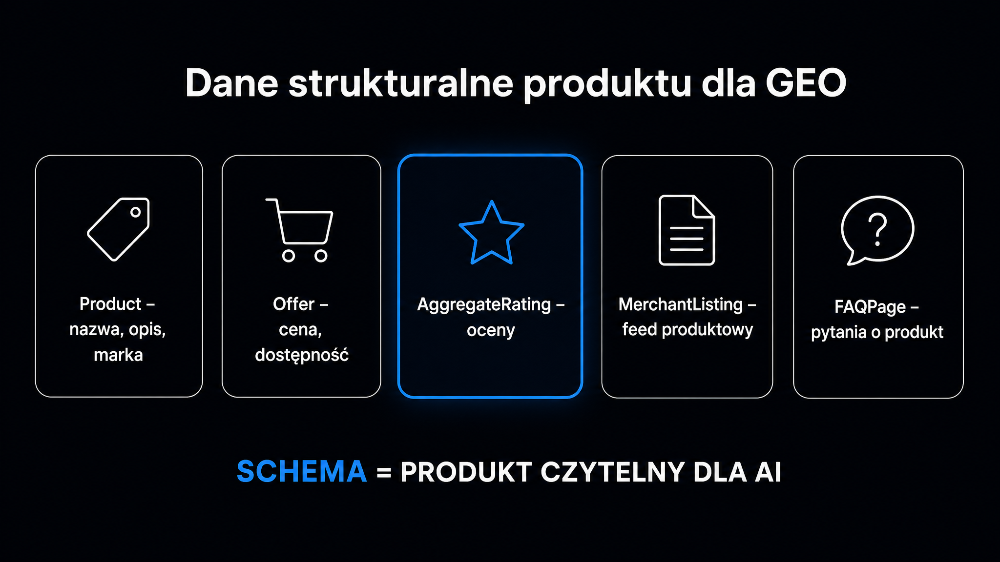

Kiedy klient zadaje w ChatGPT pytanie: „jakie słuchawki bezprzewodowe do 400 zł są najlepsze?", model nie przegląda rankingów Google. Pobiera fragmenty stron uznane przez boty za wiarygodne, wyciąga z nich dane i skleja odpowiedź w kilka sekund. Jeśli Twój sklep nie trafi do tego zestawienia, po prostu nie istniejesz dla kupującego. **GEO (Generative Engine Optimization, czyli optymalizacja pod generatywne silniki wyszukiwania) to zestaw taktyk, dzięki którym Twoje produkty trafiają do odpowiedzi AI, a nie tylko do tradycyjnych wyników wyszukiwania.** Zobacz, co konkretnie zmienić w strukturze strony, opisach i warstwie danych, żeby wskaźnik cytowań (Citation Rate) ruszył w górę.

## Dlaczego e-commerce musi myśleć inaczej niż klasyczne SEO?

Sklepy internetowe mają z GEO specyficzny problem, nieznany serwisom contentowym. Strona produktowa musi jednocześnie sprzedawać (przekonujący opis, zdjęcia, CTA), spełniać wymogi SEO (frazy kluczowe, linkowanie wewnętrzne) i być czytelna dla bota AI (ustrukturyzowane fakty, dane liczbowe, jednoznaczne encje). W praktyce te trzy zadania często się wykluczają.

Tradycyjny opis produktu wygląda zazwyczaj tak: „Nasze słuchawki to doskonałe połączenie jakości i stylu, które zadowoli wymagających melomanów". Dla modelu językowego to zdanie jest puste. Brakuje w nim liczb, specyfikacji i twardych faktów. **Silniki RAG (Retrieval-Augmented Generation, czyli generowanie wspomagane wyszukiwaniem) szukają fragmentów gotowych do zacytowania, dlatego bezlitośnie ignorują marketingowe ogólniki.**

Gartner prognozuje, że do końca 2026 roku 25% tradycyjnego ruchu z wyszukiwarek organicznych przejmą narzędzia konwersacyjne. W e-commerce ta zmiana uderza ze zdwojoną siłą. Decyzje zakupowe coraz częściej zapadają wewnątrz interfejsu AI, zanim użytkownik w ogóle kliknie link do sklepu.

### Dwie bariery, przez które musi przejść Twój produkt

Modele językowe weryfikują każde źródło dwuetapowo, zanim włączą je do odpowiedzi:

- **Etap pobierania danych** – bot AI (GPTBot, ClaudeBot, PerplexityBot) musi technicznie dostać się do strony, pobrać treść i uznać ją za indeksowalną. Witryny oparte wyłącznie na dynamicznym JavaScripcie są dla tych crawlerów całkowicie niewidoczne.
- **Etap syntezy** – model decyduje, czy strona jest wystarczająco wiarygodna, żeby zacytować jej fragment. Kluczową rolę odgrywa tu gęstość faktów, spójność danych i zewnętrzny autorytet encji.

Pokonanie obu barier wymaga zupełnie innych działań. Wiele sklepów odpada już na starcie. Sprawdź, czy Twoje strony produktowe są poprawnie indeksowane przez boty AI, wykorzystując narzędzie [Ocena cytowalności strony](/narzedzia/url-check/). Narzędzie to w 30 sekund ocenia cytowalność pod kątem najważniejszych czynników technicznych.

## Strona produktowa zoptymalizowana pod cytowanie

Badanie [Aggarwal et al. (KDD 2024)](https://arxiv.org/abs/2311.09735) z Princeton University udowodniło, że precyzyjna modyfikacja treści podnosi widoczność w modelach LLM (ang. Large Language Models, czyli dużych modelach językowych) o 30–40%. Wystarczyło dodać statystyki, zewnętrzne cytowania i autorytatywny język. Dla stron z niskim autorytetem domenowym efekt okazał się wręcz spektakularny. Wzrost sięgał tam 115%.

Kluczowym mechanizmem jest tu gęstość faktów. **Model AI ekstrahuje z Twojej strony fragmenty o długości 200–400 słów i zamienia je w wektory numeryczne (tzw. osadzenia, ang. embeddings).** Wygrywa ten wycinek tekstu, który dostarcza konkretnych danych, a nie snuje marketingową opowieść. Zobacz, jak to wygląda w praktyce na karcie produktu.

### Opis produktu – przepisz go pod konkret

Zamiast pisać „doskonałe słuchawki dla wymagających", użyj konkretu. „Czas pracy na baterii wynosi 28 godzin przy włączonej aktywnej redukcji szumów (ANC); przy wyłączonym ANC – 36 godzin. Latencja Bluetooth 5.3 to 40 ms, co eliminuje opóźnienia podczas oglądania wideo".

Każde z tych zdań niesie ładunek informacyjny, który model powtórzy w odpowiedzi na pytania: „ile godzin działa na baterii?" czy „czy nadają się do filmów?". **Zasada BLUF (kluczowa informacja na początku) jest bezwzględna – pierwsze 100–150 słów sekcji to strefa, z której AI najchętniej wyciąga cytaty.** Nie buduj napięcia przed puentą. Od razu uderzaj najważniejszymi parametrami.

Zawsze stosuj strukturę odwróconej piramidy:

- **Specyfikacja techniczna w pierwszym akapicie** – wymiary, waga, moc, kompatybilność oraz jednoznaczne jednostki miar.
- **Zastosowanie praktyczne** – dla kogo sprzęt jest przeznaczony, w jakim kontekście się sprawdzi i jakie ma ograniczenia.
- **Warunki zakupu i wsparcia** – gwarancja, czas dostawy, zasady zwrotów. Model AI wbudowany w Google AI Overviews aktywnie weryfikuje spójność tych informacji z plikiem Google Merchant Center.

### Nagłówki jako pytania

Silnik AI rozszczepia zapytanie użytkownika na wiele podzapytań syntetycznych (ang. *query fan-out*). Następnie szuka fragmentów odpowiadających każdemu z nich z osobna. Jeśli nagłówek H2 na stronie kategorii brzmi „Słuchawki bezprzewodowe", model po prostu nie wie, na jaki problem ten tekst odpowiada.

Zmień ten sam nagłówek na „Które słuchawki bezprzewodowe do 400 zł mają najlepszą redukcję szumów?". Wtedy model dopasuje Twój fragment do dziesiątek wariantów pytań o zbliżonym sensie. **To banalna modyfikacja, która bezpośrednio winduje Citation Rate.**

<aside class="callout-fact">
  
✦

  

    
Ciekawostka

    
Marka ubezpieczeń samochodowych zoptymalizowała strony produktowe pod GEO – dodała przejrzyste tabele porównawcze, definicyjne sekcje FAQ i usunęła żargon marketingowy. Po sześciu miesiącach liczba jej cytowań w Google AI Overviews wzrosła o <strong>447%. Nie zmieniła przy tym ani jednego backlinku – efekt pochodził wyłącznie ze zmian struktury treści.</strong>

  

</aside>

## Dane strukturalne – klucz do Google Shopping Graph

Wyniki Google AI Overviews dla zapytań zakupowych zasila Shopping Graph, obejmujący ponad 50 miliardów produktów. Dane spływają do niego dwoma kanałami. Pierwszy to Google Merchant Center, drugi to znaczniki JSON-LD w kodzie witryny. Jakakolwiek rozbieżność między nimi – inna cena na stronie, inny stan magazynowy w GMC – bezwzględnie wyklucza ofertę z rekomendacji AI.

**Dane strukturalne JSON-LD to nie opcjonalny dodatek, ale warunek konieczny, żeby Google AI w ogóle rozważyło Twój produkt jako kandydata do odpowiedzi.** Modele AI opierają się na [ontologiach informatycznych](https://pl.wikipedia.org/wiki/Ontologia_(informatyka)) – formalnych reprezentacjach pojęć i relacji między nimi. Standard schema.org pełni funkcję takiej właśnie ontologii dla całej sieci.

Każdy typ schematu odpowiada na zupełnie inne zapytanie użytkownika. Wdrożenie samego `Product` bez `FAQPage` i `MerchantListing` oznacza optymalizację zaledwie połowy potencjału sklepu.

| Typ schematu JSON-LD | Kluczowe właściwości | Wpływ na widoczność AI |
|---|---|---|
| `Product` | `brand`, `gtin`, `model`, `aggregateRating`, `color`, `material` | Definiuje encję produktu w grafie wiedzy; umożliwia dopasowanie do zapytań o cechy fizyczne. |
| `MerchantListing` | `price`, `priceCurrency`, `availability`, `shippingDetails` | Przesyła dane handlowe do Google Shopping Graph; warunek indeksacji w AI Overviews zakupowych. |
| `FAQPage` | `mainEntity`, `Question`, `acceptedAnswer` | Umożliwia ekstrakcję odpowiedzi definicyjnych bezpośrednio w wynikach AI. |
| `HowTo` | `step`, `tool`, `totalTime` | Pozycjonuje produkt w zapytaniach „jak użyć", „jak zainstalować", „jak dobrać". |
| `Organization` | `legalName`, `logo`, `sameAs`, `contactPoint` | Łączy sklep ze zweryfikowaną encją biznesową; podnosi zaufanie modelu do źródła. |

Szczegółowy przewodnik po implementacji JSON-LD wraz z przykładami dla różnych typów podstron znajdziesz w artykule o [schema.org i danych strukturalnych](/geo/schema-org-dane-strukturalne/).

## Autorytet encji – jak AI decyduje, czy Ci zaufać

Silniki generatywne nigdy nie cytują stron, którym nie ufają. Zaufanie budują jednak zupełnie inaczej niż klasyczny Google PageRank. W GEO liczy się autorytet encji (Entity Authority), czyli spójność i szerokość informacji o marce w zewnętrznych źródłach.

Podczas syntezy odpowiedzi modele AI weryfikują, czy dana informacja powtarza się w wielu niezależnych miejscach. Niepodlinkowane wzmianki o marce na forach takich jak Reddit, w recenzjach czy artykułach prasowych budują gęstą mapę semantyczną. Model interpretuje ją jako silny sygnał wiarygodności. **To odpowiednik tradycyjnych backlinków, z tą różnicą, że liczy się samo wystąpienie nazwy w odpowiednim kontekście, a nie fizyczny odnośnik.**

<aside class="callout-expert">
  

  

    
Opinia eksperta

    
W audytach sklepów internetowych, które przeprowadzamy w ICEA, najczęściej wykrywamy ten sam problem: sklep ma silne SEO i dobrą pozycję organiczną, ale strony produktowe zawierają wyłącznie opisowy tekst sprzedażowy – zero liczb, zero specyfikacji w ustrukturyzowanej formie, zero zewnętrznych cytowań. Dla silnika RAG taka strona to czarna skrzynka. <strong>Pierwsza rekomendacja po audycie jest zawsze ta sama: dodaj konkretne parametry techniczne do pierwszego akapitu każdej strony produktowej i uzupełnij JSON-LD – efekty w Citation Rate pojawiają się już po 4–6 tygodniach.</strong>

    
Mateusz Wiśniewski · Ekspert SEO/AI Search, ICEA

  

</aside>

### Spójność danych jako sygnał GEO

Modele językowe czerpiące z wielu źródeł błyskawicznie wychwytują wszelkie rozbieżności. Jeśli cena na Twojej stronie różni się od tej w artykule porównawczym na portalu branżowym, algorytm potraktuje to jako błąd. W efekcie całkowicie pominie Twój produkt w syntezie.

**Najczęstsze źródła niespójności w e-commerce to stary cennik na portalach afiliacyjnych, różne nazwy modeli w opisach oraz rozbieżne dane gwarancyjne.** Zanim zaczniesz tworzyć nową treść pod GEO, przeprowadź rygorystyczny audyt spójności danych w sieci. To znacznie szybsza dźwignia wzrostu niż pisanie kolejnych artykułów.

### Budowanie zewnętrznego zaplecza źródłowego

W słowniku GEO termin „zaplecze źródłowe" (ang. *source stack*) oznacza zbiór zewnętrznych miejsc, w których marka występuje jako wiarygodne źródło. W branży e-commerce skup się na kilku kluczowych obszarach:

- **Niezależne recenzje produktów** – portale branżowe i agregatory opinii (Ceneo, Allegro Opinie, Trusted Shops). Model AI traktuje oceny użytkowników jako twardy sygnał walidacji jakości.
- **Odpowiedzi na forach i w społecznościach** – komentarze eksperckie na platformach Reddit, Quora czy w grupach na Facebooku, gdzie marka pojawia się w odpowiedzi na konkretne pytanie zakupowe.
- **Obecność w bazach danych encji** – Wikidata oraz Google Business Profile z kompletem informacji. Spójna tożsamość korporacyjna na wszystkich platformach to absolutny fundament autorytetu encji.
- **Cytowania w prasie branżowej** – nawet najkrótsze wzmianki w artykułach o trendach rynkowych budują sąsiedztwo współcytowań. Z takich sygnałów chętnie korzystają Perplexity i Google AI Overviews.

Sprawdź swój aktualny poziom widoczności w AI. [audyt widoczności marki](/geo/audyt-widocznosci-marki/) dokładnie opisuje metodologię, którą stosujemy w ICEA do oceny autorytetu encji i Citation Rate dla sklepów internetowych.

## Strony kategorii i treści poradnikowe

Karta produktu to nie jedyny obszar działań GEO w e-commerce. Strony kategorii i poradniki zakupowe stanowią często znacznie skuteczniejszy punkt wejścia dla cytowań. Dlaczego? Bo idealnie odpowiadają na pytania porównawcze i rekomendacyjne, a to one dominują w konwersacjach z botami.

Zapytanie „które słuchawki bezprzewodowe poleca ChatGPT?" rzadko prowadzi do pojedynczego produktu. Prowadzi do treści, która ujmuje temat szerzej. Musi zawierać porównanie kilku modeli, tabelę z parametrami oraz jasne wskazanie, dla kogo dany sprzęt będzie odpowiedni. **Sklep dysponujący poradnikiem z konkretnymi danymi i strukturą pytanie-odpowiedź wygrywa takie zapytanie nawet wtedy, gdy jego klasyczne SEO ustępuje konkurencji.**

### Co powinna zawierać strona kategorii pod GEO?

Wzorcowe wdrożenie to strona kategorii, która nie tylko listuje asortyment, ale proaktywnie odpowiada na dylematy kupującego poprzez:

- **Tabelę porównawczą** – minimum 3 modele z kolumnami określającymi cenę, kluczowy parametr i grupę docelową. W komórkach umieszczaj twarde dane, a nie marketingowe hasła.
- **Sekcję FAQ** – 4–5 pytań w formie nagłówków H3 z bezpośrednią odpowiedzią w pierwszym zdaniu (zasada BLUF). Format `FAQPage` w JSON-LD pozwala na ekstrakcję tych odpowiedzi wprost do wyników AI.
- **Bloki użycia** – konkretne scenariusze zakupowe. Przykład: „Jeśli szukasz słuchawek do biegania z GPS, wybierz modele X lub Y, bo mają certyfikat IPX5 i ważą poniżej 32 g".

Więcej o budowaniu takiej struktury treści na poziomie całego sklepu dowiesz się z [przewodnik GEO](/geo/przewodnik/). Znajdziesz tam omówienie mechanizmu rozszczepienia zapytania oraz strategię budowania autorytetu tematycznego.

## Jak mierzyć efekty GEO w sklepie?

Klasyczne narzędzia analityczne nie pokażą Ci, ile razy ChatGPT polecił Twój produkt. GEO wymaga zupełnie innych metryk i dedykowanego oprogramowania.

Zacznij od śledzenia trzech podstawowych wskaźników:

- **Citation Rate (wskaźnik cytowań)** – procent zapytań testowych, w których odpowiedź AI zawiera nazwę sklepu lub URL. Mierz go regularnie (co dwa tygodnie) na zestawie 20–30 zapytań zakupowych z Twojej niszy.
- **Share of Voice (udział w widoczności)** – odsetek wszystkich cytowań AI w kategorii produktowej, który trafia do Ciebie w porównaniu do konkurencji. To bezpośredni wskaźnik pozycji marki w ekosystemie AI.
- **Mention Rate (wskaźnik wzmianek)** – liczba wystąpień nazwy sklepu lub produktu w odpowiedziach AI bez aktywnego linka. To niezwykle ważny sygnał budowania rozpoznawalności w modelach LLM.

Wyspecjalizowane narzędzia do monitoringu GEO dla e-commerce to między innymi Azoma (Amazon Rufus, ChatGPT, Gemini), Profound (ponad 10 silników AI, głęboka analiza autorytetu encji) oraz Goodie AI (automatyczna korekcja halucynacji modeli, generator schematu). Przy wyborze platformy zweryfikuj jedno kluczowe kryterium. Czy system odróżnia cytowania (link do strony) od wzmianek (sama nazwa)? **To fundamentalna różnica, która decyduje o trafności całego pomiaru.**

Niezależnie od wybranej platformy, zacznij od pomiaru manualnego. Wybierz 20 pytań, które Twoi klienci wpisują w ChatGPT lub Perplexity. Odpytaj je w trybie incognito (bez personalizacji) i zanotuj, ile odpowiedzi uwzględnia Twój sklep. Ten punkt startowy da Ci solidną bazę do oceny późniejszych efektów optymalizacji.

## Harmonogram wdrożenia – co zrobić w pierwszych 90 dniach

GEO dla e-commerce wdrożysz etapami, bez konieczności przebudowy całego sklepu. Każdy krok przynosi samodzielny efekt, więc pierwsze wyniki zobaczysz jeszcze przed zakończeniem pełnego cyklu optymalizacyjnego.

| Etap | Działania | Oczekiwany efekt |
|---|---|---|
| Tydzień 1–2 | Weryfikacja dostępu botów AI (`robots.txt`, `GPTBot`, `ClaudeBot`), bazowy pomiar Citation Rate | Pełna widoczność dla botów RAG |
| Tydzień 3–4 | Wdrożenie JSON-LD (`Product`, `MerchantListing`) na 10 najważniejszych stronach produktowych | Indeksacja danych w Google Shopping Graph |
| Miesiąc 2 | Przepisanie opisów produktów na model: specyfikacja w pierwszym akapicie, nagłówki jako pytania, parametry z jednostkami | Pierwsze wzrosty Citation Rate (+10–20%) |
| Miesiąc 3 | Przebudowa 3–5 stron kategorii z tabelami porównawczymi i FAQ, dodanie `FAQPage` w JSON-LD | Cytowania w odpowiedziach porównawczych AI |
| Miesiąc 4+ | Audyt spójności danych w sieci, budowanie zewnętrznego zaplecza źródłowego (recenzje, wzmianki, PR) | Wzrost Share of Voice o 30–50% vs. punkt startowy |

Pierwsze efekty techniczne – po odblokowaniu botów i wdrożeniu JSON-LD – pojawiają się w ciągu 2–4 tygodni. Mierzalne wzrosty Citation Rate po przepisaniu opisów to horyzont 6–8 tygodni. Z kolei pełne korzyści ze strategii zewnętrznej wymagają 3–4 miesięcy systematycznej pracy.

Żeby skrócić czas diagnozy, sprawdź widoczność swojej marki w modelu AI już teraz. Darmowe narzędzie [Widoczność marki w AI](/narzedzia/brand-check/) odpyta cztery silniki AI i pokaże aktualne cytowania. Zrobisz to bez konieczności żmudnego, manualnego testowania każdego bota z osobna.
