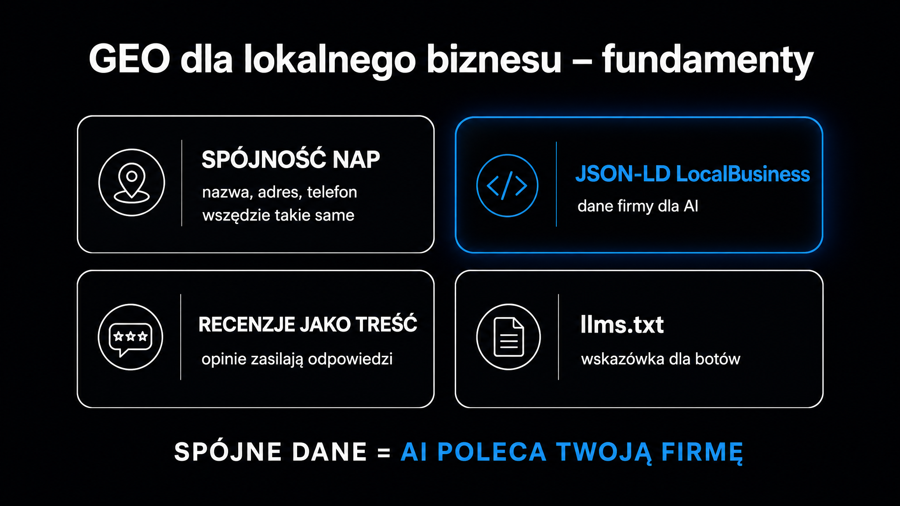

Gdy użytkownik pyta ChatGPT „który dentysta na Mokotowie przyjmuje w sobotę", model nie otwiera Google Maps – syntetyzuje odpowiedź z tego, co zdążył zaindeksować i czemu ufa. Jeśli Twoja firma nie jest dobrze opisana w sposób maszynowo czytelny, nie masz żadnej szansy znaleźć się w tej odpowiedzi. **GEO (Generative Engine Optimization, czyli optymalizacja pod generatywne silniki wyszukiwania) to zestaw konkretnych działań, które zmieniają ten stan rzeczy** – i dla biznesów lokalnych jest on szczególnie pilny, bo Gartner prognozuje 25-procentowy spadek tradycyjnego ruchu z wyszukiwarek do końca 2026 roku na rzecz narzędzi konwersacyjnych.

## Dlaczego lokalne SEO nie wystarcza

Tradycyjne lokalne SEO optymalizuje trzy rzeczy: bliskość geograficzną, liczbę recenzji i profil linków. Algorytm Google Maps rozumie te sygnały, bo działa na zasadzie rankingu. Asystenci AI działają inaczej.

**ChatGPT, Perplexity AI czy Google AI Mode nie generują listy linków – budują narrację z wielu źródeł jednocześnie.** Model szuka podmiotów, które potrafi pewnie zidentyfikować, opisać ich specjalizację i zarekomendować bez ryzyka błędu. Firmy z niekompletnym lub niespójnym profilem cyfrowym są pomijane – nie z wrogości, lecz dlatego, że model nie może im ufać.

Kluczowa różnica polega na tym, co modele AI traktują jako sygnał wiarygodności. W klasycznym local SEO liczy się liczba gwiazdek. W GEO liczy się zawartość tekstowa recenzji, spójność danych kontaktowych we wszystkich katalogach oraz maszynowo czytelna struktura strony. Ruch przekierowywany z systemów AI cechuje się trzykrotnie wyższym wskaźnikiem zaangażowania niż klasyczny ruch organiczny – to dane ze źródeł branżowych zebrane w 2025 roku.

Poniższa tabela porządkuje, czym różni się logika obu podejść. Traktuj ją jako punkt wyjścia do audytu własnych działań:

| Czynnik | Klasyczne local SEO | GEO dla biznesu lokalnego |
|---|---|---|
| Główny sygnał lokalizacji | Bliskość geograficzna, profil GBP | Spójność danych NAP w całej sieci |
| Format wyjściowy | Lista linków, wizytówka | Narracyjna odpowiedź z cytowaniem firmy |
| Co liczy się w recenzjach | Średnia gwiazdek | Zawartość tekstowa – nazwy usług, dzielnica, opis |
| Kluczowa warstwa techniczna | Metatagi, słowa kluczowe | JSON-LD schema, `llms.txt`, SSR/SSG |
| Jak mierzyć sukces | Pozycja w Local 3-Pack | Citation Rate, Share of Voice (SoV) |

## Jak asystenci AI decydują, kogo polecić

Żeby skutecznie zoptymalizować stronę pod kątem GEO, musisz rozumieć mechanizm selekcji. Są dwa główne sposoby, w jakie model „dowiaduje się" o Twojej firmie.

Pierwszy to generowanie wspomagane wyszukiwaniem ([RAG – Retrieval-Augmented Generation](https://pl.wikipedia.org/wiki/Retrieval-augmented_generation)). Silniki takie jak Perplexity AI czy Google AI Overviews w momencie zapytania aktywnie przeczesują internet, pobierają fragmenty stron i na ich podstawie generują odpowiedź. Tu liczy się techniczna dostępność Twojej strony oraz to, czy treść jest łatwa do wyekstrahowania.

Drugi mechanizm to dane treningowe. Modele oparte na parametrach zgromadzonych przed datą odcięcia (cutoff date) polecają marki, które były wzmiankowane w wiarygodnych źródłach – lokalnych portalach, branżowych katalogach, forach. Brak obecności w tych źródłach = brak w odpowiedziach.

### Co sprawia, że model porzuca Twój wpis na rzecz konkurencji

Modele językowe redukują niepewność. Jeśli dane kontaktowe Twojej firmy różnią się między stroną a profilem Google a katalogiem branżowym, model rozpoznaje sprzeczność i wycofuje się. **Badania projektu Google AGREE (NAACL 2024) pokazały, że nawet drobne rozbieżności – różny zapis ulicy, różny numer telefonu – eliminują firmę z syntetyzowanej odpowiedzi jako potencjalne źródło błędu.**

Wolne strony to kolejny problem. Strona ładująca się powyżej 5 sekund może zostać porzucona przez bota RAG, zanim zdąży pobrać treść – model wtedy rozszerza poszukiwania na inne źródła i tam natrafia na konkurencję.

### Małe firmy mają przewagę

Tu pojawia się dobra wiadomość. Badanie Princeton University (Aggarwal et al., KDD 2024, [arxiv.org/abs/2311.09735](https://arxiv.org/abs/2311.09735)) wykazało, że witryny z pozycji 5–10 w Google, które wdrożyły statystyki i cytowania źródeł, zwiększały widoczność w LLM o 115,1%. Więcej niż domeny z pozycji 1–3, które tego nie zrobiły. **GEO to jedna z niewielu taktyk marketingowych, w której mniejszy gracz z dobrze opisanymi danymi może wyprzedzić regionalnego lidera.**

<aside class="callout-fact">
  
✦

  

    
Ciekawostka

    
Badanie Princeton (KDD 2024) przetestowało 9 taktyk optymalizacji treści na zestawie 10 000 zapytań z 25 dziedzin. Tylko 5 z 9 taktyk przyniosło istotny wzrost widoczności w LLM. Keyword stuffing – klasyczny zabieg SEO – nie tylko nie pomagał, ale aktywnie obniżał wskaźnik cytowań. <strong>Strony o niskim autorytecie domenowym, które dodały cytowania i dane liczbowe, zwiększyły widoczność w modelach AI o 115,1%.</strong>

  

</aside>

## Spójność encji – fundament lokalnego GEO

Zanim zaczniesz zmieniać stronę, uporządkuj dane wokół niej. Algorytmy AI nie czytają witryny jak człowiek – łączą fakty, nazwy i relacje w encje, czyli obiekty wiedzy osadzone w grafie. Jeśli te połączenia są poszarpane, model woli nie ryzykować rekomendacji.

Trzy kroki do spójności encji, które wdrożysz w ciągu jednego dnia roboczego:

- **Unifikacja NAP** – nazwa firmy, adres i numer telefonu muszą być zapisane identycznie na stronie, w profilu Google Business Profile (GBP), w katalogach branżowych i w mediach społecznościowych. Każda wersja „ul. Marszałkowska 12" vs. „Marszałkowska 12 lok. 1" to sygnał niespójności.
- **Trzy do pięciu twierdzeń faktograficznych** – sformułuj proste zdania opisujące specjalizację, lokalizację i unikalną propozycję wartości. Unikaj metafor i własnego żargonu marketingowego; używaj terminologii zakorzenionej w publicznych bazach wiedzy.
- **Profil `sameAs` w schemacie** – powiąż swoją stronę z zewnętrznymi identyfikatorami: profilem Wikidata, kontem LinkedIn, profilem GBP. Modele używają tych powiązań do weryfikacji tożsamości.

### Dane strukturalne – JSON-LD dla lokalnego biznesu

Implementacja schematu `LocalBusiness` w formacie JSON-LD to najszybsza dźwignia w GEO dla firm lokalnych. Dobre wdrożenie eliminuje dwuznaczność i pozwala modelowi na bezpośrednią ekstrakcję kluczowych właściwości bez konieczności parsowania HTML. Szczegółowy przewodnik po implementacji, z przykładami dla różnych typów działalności, znajdziesz w artykule o [schema.org i danych strukturalnych](/geo/schema-org-dane-strukturalne/).

Najważniejsze właściwości, które musisz wypełnić:

- **`@type`** – precyzyjny podtyp działalności: `Restaurant`, `Dentist`, `Plumber`, `RealEstateAgent`, a nie ogólny `LocalBusiness`
- **`name`** – oficjalna nazwa rejestrowa, identyczna z GBP i dokumentami firmy
- **`address`** – pełne dane geolokalizacyjne ze strukturą `PostalAddress`
- **`geo`** – współrzędne GPS w `GeoCoordinates`; modele używają ich do odpytywania w kontekście lokalizacji
- **`openingHoursSpecification`** – precyzyjne godziny z podziałem na dni tygodnia; zapytania takie jak „który mechanik pracuje w niedzielę" trafiają dokładnie w tę właściwość
- **`sameAs`** – tablica URL-i potwierdzających tożsamość firmy w zewnętrznych bazach

## Treść, którą AI chce zacytować

Spójność danych to warunek konieczny, ale niewystarczający. Model cytuje konkretne zdania, a nie całe strony. Tu pojawia się zasada wczesnego sygnalizowania kluczowych informacji (front-loading): **pierwsze 100–200 słów każdej sekcji to strefa, z której asystenci AI najczęściej wyciągają fragmenty do syntezy.**

Silniki RAG rozbijają zapytanie użytkownika na wiele podzapytań (z ang. query fan-out) i wyszukują fragmenty odpowiadające każdemu z nich osobno. Artykuł pisany jako ciągła narracja jest trudny do pocięcia. Artykuł z wyraźnymi blokami 200–400 słów, gdzie każdy blok odpowiada na jedno pytanie – jest ekstrahowalny.

### Recenzje jako treść GEO

Recenzje Google to niedoceniany zasób w kontekście GEO dla firm lokalnych. Tekst opinii jest indeksowany przez silniki RAG i może pojawić się w syntetyzowanej odpowiedzi. Warto aktywnie nakłaniać klientów do pisania recenzji zawierających:

- nazwę konkretnej usługi (np. „wymiana opon zimowych", nie „świetna obsługa"),
- nazwę dzielnicy lub ulicy,
- opis przebiegu usługi z konkretnym detalem.

**Recenzja „Wymiana opon w 40 minut, ekipa z Woli, polecam Mateuszowi z Ochoty" jest wielokrotnie bardziej wartościowa dla modelu AI niż „Fachowa obsługa, 5 gwiazdek".**

### Konwersacyjne FAQ

Sekcja FAQ na stronie to idealne miejsce na wdrożenie logiki GEO. Pytania powinny brzmieć jak zapytania wpisywane do ChatGPT: „Ile kosztuje czyszczenie kanalizacji w Warszawie?", „Czy gabinet przyjmuje w weekend?". Odpowiedzi muszą zaczynać się od twardej deklaracji: ceny, godziny, zasady – nie od „Zależy to od…".

Jeśli chcesz sprawdzić, jak Twoja strona wypada pod kątem cytowalności w modelach AI, narzędzie [Widoczność marki w AI](/narzedzia/brand-check/) odpyta cztery silniki AI o Twoją markę i pokaże aktualny obraz widoczności.

<aside class="callout-expert">
  

  

    
Opinia eksperta

    
W audytach, które przeprowadzam dla lokalnych firm w ICEA, najczęściej spotykam ten sam wzorzec: strona jest zadbana wizualnie, GBP aktywny, recenzje przyzwoite – ale schematu JSON-LD albo nie ma, albo zawiera on ogólny typ LocalBusiness bez podtypu. Model AI nie potrafi jednoznacznie sklasyfikować firmy i woli pominąć ją w odpowiedzi. <strong>Zmiana @type z LocalBusiness na Restaurant lub Dentist plus dodanie openingHoursSpecification to jedna godzina pracy, która potrafi podwoić Citation Rate w ciągu 4–6 tygodni.</strong>

    
Piotr Wicenciak · SEO Operations Manager, ICEA

  

</aside>

## Plik `llms.txt` – instrukcja dla agentów AI

Standard `llms.txt` to prosty plik tekstowy w formacie Markdown, umieszczany w katalogu głównym domeny. Modele AI i agenty RAG mogą go odczytać, żeby zrozumieć strukturę oferty bez konieczności indeksowania setek podstron. Dla lokalnego biznesu to rozwiązanie szczególnie cenne – redukuje szum i zapobiega halucynacjom na temat zakresu usług.

Plik powinien zawierać:

- **Krótki opis** – czym firma się zajmuje, w jednym–dwóch zdaniach
- **Listę głównych usług** z linkami do podstron
- **Dane lokalizacyjne** – dokładny adres, obsługiwane dzielnice i miasta
- **Dane kontaktowe** – telefon, e-mail, godziny pracy
- **Sekcję `Optional`** – linki do cennika, zespołu, realizacji, certyfikatów

Porównanie ekosystemu plików konfiguracyjnych pokazuje, że `llms.txt` wypełnia niszę, której inne standardy nie pokrywają:

| Plik | Cel | Format | Odbiorca |
|---|---|---|---|
| `robots.txt` | Kontrola dostępu botów | Dyrektywy tekstowe | Googlebot, Bingbot i inne crawlery |
| `sitemap.xml` | Pełna mapa URL serwisu | XML | Wyszukiwarki indeksujące |
| `llms.txt` | Skondensowany kontekst marki | Markdown | Modele LLM, agenty RAG, asystenci AI |

Analiza logów serwerowych pokazuje, że wdrożenie `llms.txt` nie podnosi natychmiast pozycji w klasycznych wyszukiwarkach, ale zmniejsza opóźnienie odpytywania przez systemy AI i eliminuje błędy atrybucji – model, który przeczytał Twój plik `llms.txt`, wie, że jesteś hydraulikiem z Pragi, a nie fryzjerem z Woli.

Pełny [przewodnik po GEO](/geo/przewodnik/) opisuje szerszy kontekst techniczny i strategię 6-miesięczną.

## Jak mierzyć widoczność w wyszukiwaniu konwersacyjnym

Klasyczne narzędzia SEO – Google Search Console, Ahrefs, Semrush – nie mierzą widoczności w LLM. Do tego potrzebujesz innego zestawu danych i innej metodyki.

Trzy metryki, które wdrożyliśmy w ICEA jako podstawę pomiaru dla lokalnych klientów:

- **Citation Rate (wskaźnik cytowań)** – procent zapytań z Twojego zestawu testowego, w których odpowiedź AI zawiera nazwę firmy lub URL; bazowy sygnał obecności
- **Share of Voice (SoV, udział głosu)** – jaki procent wszystkich cytowań w danej kategorii lokalnej trafia do Twojej marki, a jaki do konkurentów; mierzone na zestawie 20–50 zapytań reprezentujących Twoją niszę
- **Mention Rate (wskaźnik wzmianek)** – ile razy firma pojawia się z nazwy w odpowiedziach AI bez bezpośredniego linka; ważne dla budowania rozpoznawalności jako encji w modelu

### Jak zbudować zestaw testowy dla firmy lokalnej

Nie potrzebujesz 150 zapytań na start. Wystarczy 20–30 pytań sformułowanych tak, jak wpisują je Twoi klienci w ChatGPT lub Perplexity. Dla gabinetu stomatologicznego w Warszawie przykładowy zestaw wygląda tak:

- zapytania brandowe: „Kto jest głównym stomatologiem w gabinecie X?", „Jakie godziny przyjęć ma klinika Y?"
- zapytania kategorialne: „Poleć dobrego implantologa na Mokotowie"
- zapytania problemowe: „Co zrobić, gdy ząb mądrości boli w weekend w Warszawie?"
- zapytania porównawcze: „Który gabinet dentystyczny na Ursynowie ma lepsze opinie?"

Odpytuj regularnie – co dwa tygodnie, w trybie prywatnym bez personalizacji. Sprawdź, ile odpowiedzi zawiera Twoją markę. To jest Twój punkt startowy i Twój KPI.

Jeśli chcesz zobaczyć, jak Twoja strona jest aktualnie oceniana pod kątem struktury i gotowości do cytowania, [audyt widoczności marki](/geo/audyt-widocznosci-marki/) opisuje metodologię, którą stosujemy w ICEA przy pierwszym badaniu klientów.

## Kolejność wdrożenia – 4 tygodnie do pierwszych efektów

GEO dla małego biznesu lokalnego nie wymaga wielomiesięcznego projektu. **Pierwsze mierzalne efekty – wzrost Citation Rate o 10–20% – pojawiają się po 4–6 tygodniach od wdrożenia poprawek technicznych i treściowych.** Oto sekwencja, którą polecamy klientom:

**Tydzień 1 – fundament danych.** Zweryfikuj i ujednolić NAP we wszystkich miejscach w sieci. Dodaj lub popraw schemat JSON-LD z pełnym `@type` i `openingHoursSpecification`. Odblokuj boty AI w `robots.txt` (sprawdź, czy `GPTBot`, `ClaudeBot` i `PerplexityBot` nie są przypadkowo blokowane).

**Tydzień 2 – pliki dla modeli AI.** Stwórz `llms.txt` z opisem firmy, usługami, lokalizacją i godzinami. Jeden plik, 30–50 linii Markdown. Dodaj `sameAs` do schematu JSON-LD, wskazując na GBP, LinkedIn i Wikidata, jeśli masz wpis.

**Tydzień 3 – przebudowa treści.** Przepisz opisy usług według zasady wczesnego sygnalizowania kluczowych informacji. Każda strona usługowa zaczyna się od jednego–dwóch zdań bezpośredniej odpowiedzi na intencję użytkownika. Dodaj konwersacyjne FAQ z cenami i godzinami w pierwszym zdaniu odpowiedzi.

**Tydzień 4 – pomiar i korekta.** Odpytaj 20–30 zapytań testowych w ChatGPT i Perplexity. Oceń Citation Rate. Sprawdź, czy schemat JSON-LD jest poprawnie parsowany (Google Rich Results Test). Wdróż korekty. Zaplanuj kolejny cykl za dwa tygodnie.

Więcej o tym, jak optymalizacja GEO przekłada się na sklepy i serwisy internetowe, opisuje artykuł o [GEO dla e-commerce](/geo/geo-dla-ecommerce/).

## Często zadawane pytania

### Czy GEO dla lokalnego biznesu zastępuje Google Business Profile?

Nie. GBP pozostaje podstawą w klasycznym wyszukiwaniu lokalnym i w Google Maps. GEO to warstwa uzupełniająca – przygotowuje stronę i dane marki na to, żeby modele AI mogły zaufać firmie i ją polecić. W praktyce GBP i GEO wzajemnie się wzmacniają: dobrze wypełniony GBP z linkiem do strony ze schematem JSON-LD podnosi spójność encji.

### Od czego zacząć, jeśli mam ograniczone zasoby?

Od trzech kroków w tej kolejności: zunifikuj NAP, dodaj schemat JSON-LD z precyzyjnym `@type`, stwórz `llms.txt`. Łącznie to około 3–4 godziny pracy i nie wymaga zewnętrznych narzędzi. Dopiero po tym mierz Citation Rate i planuj kolejne działania.

### Czy recenzje Google naprawdę wpływają na GEO?

Tak, ale nie liczba gwiazdek – zawartość tekstowa. Silniki RAG indeksują tekst recenzji i mogą go zacytować w odpowiedzi. Recenzja zawierająca nazwę usługi, lokalizację i konkretny opis pomaga modelowi zrozumieć, czym firma się naprawdę zajmuje i w jakim kontekście lokalnym działa.

### Jak długo trzeba czekać na efekty?

Poprawki techniczne (odblokowanie botów, `llms.txt`) przynoszą efekty w 2–4 tygodnie. Wzrost Citation Rate po przepisaniu treści pojawia się po 4–8 tygodniach. Stabilny wzrost Share of Voice w niszowych zapytaniach lokalnych to perspektywa 3–4 miesięcy systematycznej pracy.
