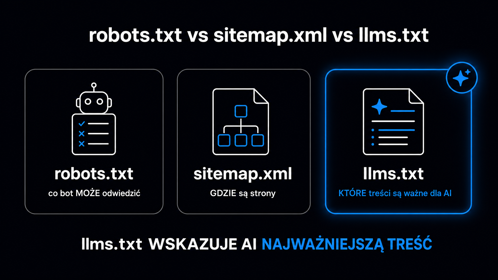

Plik `llms.txt` to lekki dokument w formacie [Markdown](https://pl.wikipedia.org/wiki/Markdown) umieszczany w katalogu głównym serwera, który wskazuje botom AI i autonomicznym agentom, co na Twojej stronie jest najważniejsze – bez konieczności przeczesywania setek podstron i renderowania kodu JavaScript. Standard zaproponował we wrześniu 2024 roku Jeremy Howard, współtwórca fast.ai i Answer.AI, a jego szerokie przyjęcie na rynku nastąpiło w listopadzie 2024 roku, gdy platforma Mintlify automatycznie wygenerowała te pliki dla tysięcy klientów – w tym dla firm takich jak Anthropic, Cursor i ElevenLabs. **Jeśli Twoja strona obsługuje programistów, oferuje API lub chce być gotowa na nadchodzący ekosystem autonomicznych agentów zakupowych, `llms.txt` to jeden z najtańszych kroków, jakie możesz dziś zrobić.**

## Czym jest `llms.txt` i dlaczego nie jest to kolejny `robots.txt`

Standard `robots.txt` liczy sobie trzy dekady. Informuje boty indeksujące, jakich ścieżek nie odwiedzać. Plik `sitemap.xml` wskazuje z kolei, które adresy URL istnieją. `llms.txt` robi coś zupełnie innego – zamiast kontrolować dostęp, dostarcza kontekst semantyczny. To mapa kluczowych zasobów witryny opisana ludzkim językiem, którą duży model językowy (LLM – *Large Language Model*) może przetworzyć błyskawicznie, zamiast pobierać i analizować kod HTML dziesiątek podstron.

Obok pliku głównego `/llms.txt` specyfikacja przewiduje uzupełniający plik `/llms-full.txt` – skonsolidowane repozytorium wiedzy łączące całe strony dokumentacyjne lub ofertowe w jeden liniowy dokument pozbawiony menu, CSS i reklam. Systemy RAG (*Retrieval-Augmented Generation*, czyli generowanie wspomagane wyszukiwaniem) mogą przetworzyć takie repozytorium jednym zapytaniem HTTP zamiast kilkudziesięciu.

Poniższa tabela porównuje trzy standardy – warto je traktować jako uzupełniające się warstwy, a nie standardy konkurencyjne:

| Atrybut | `robots.txt` | `sitemap.xml` | `llms.txt` |
|---|---|---|---|
| **Główny odbiorca** | Boty indeksujące wyszukiwarek (Googlebot, Bingbot) | Parsery XML wyszukiwarek | LLM-y, agenty autonomiczne, systemy RAG, środowiska IDE z AI |
| **Format** | Zwykły tekst, dyrektywy Allow/Disallow | XML z metadanymi o priorytecie | Markdown – hierarchiczna struktura semantyczna |
| **Cel** | Kontrola dostępu, zapobieganie przeciążeniu serwera | Kompletna lista adresów URL | Skondensowany kontekst, eliminacja szumu HTML |
| **Status** | Standard IETF (RFC 9309) | Powszechnie akceptowany | Nieoficjalny standard społeczności |

**`llms.txt` nie zastępuje żadnego ze starszych standardów** – nakłada na nie warstwę semantyczną przydatną dla maszyn wnioskujących, nie dla tradycyjnych botów indeksujących.



## Jak wygląda poprawna struktura pliku

Specyfikacja opiera się na hierarchii składni Markdown z kilkoma bezwzględnymi wymogami. Dokument musi być zapisany w kodowaniu UTF-8. W pierwszej linii musi znajdować się nagłówek pierwszego stopnia – jedyny element bezwzględnie wymagany przez specyfikację. Bezpośrednio pod nim umieszcza się blok cytatu z precyzyjnym opisem działalności, bez języka marketingowego i wyolbrzymień.

Poniżej znajduje się przykładowa struktura dla agencji SEO oferującej narzędzia SaaS:

```markdown
# widocznosc.ai

> Platforma GEO i AEO dla marketerów B2B: audyty widoczności marki w ChatGPT, Claude, Gemini i Perplexity, analiza wskaźnika cytowań (Citation Rate) oraz narzędzia techniczne do optymalizacji pod LLM-y.

## Narzędzia

- [Brand Check](https://widocznosc.ai/narzedzia/brand-check): Sprawdza, jak cztery silniki AI opisują Twoją markę na tle kategorii. Zwraca wynik procentowy i gotowe rekomendacje.
- [AI Bots Check](https://widocznosc.ai/narzedzia/ai-bots-check): Weryfikuje, które boty AI mają dostęp do domeny i czy robots.txt nie blokuje ich przypadkowo.
- [URL Check](https://widocznosc.ai/narzedzia/url-check): Analizuje stronę pod kątem 8 czynników cytowalności w LLM-ach w 30 sekund.

## Przewodniki

- [GEO – kompletny przewodnik](https://widocznosc.ai/geo/przewodnik): Czym jest GEO, wyniki badania Princeton KDD 2024, metryki Citation Rate i Share of Voice, strategia wdrożenia na 6 miesięcy.
- [Boty AI – przewodnik](https://widocznosc.ai/geo/boty-ai-przewodnik): Lista user-agentów GPTBot, ClaudeBot, PerplexityBot. Konfiguracja robots.txt i zarządzanie dostępem.
- [llms.txt – wdrożenie](https://widocznosc.ai/geo/llms-txt): Specyfikacja formatu, przykładowa struktura, instrukcja wdrożenia na Cloudflare Pages i Nginx.

## Opcjonalne

- [Polityka prywatności](https://widocznosc.ai/polityka-prywatnosci): Informacje o przetwarzaniu danych osobowych.
- [Changelog narzędzi](https://widocznosc.ai/changelog): Historia aktualizacji platformy.
```

Kilka reguł technicznych, które decydują o poprawności analizy składniowej:

- **Nagłówek H1** – tylko jeden, pierwsza linia pliku, to nazwa marki lub projektu.
- **Blok cytatu (`>`)** – bezpośrednio pod H1, syntetyczny opis bez przymiotników wartościujących.
- **Sekcje H2** – grupują linki tematycznie; każda pozycja zawiera absolutny adres HTTPS i mikrostreszczenie.
- **Sekcja `## Opcjonalne`** – modele operujące w trybie ograniczonego okna kontekstowego pomijają linki z tej sekcji; trafiają tu polityki prywatności, changelogi, archiwa.
- **Host-scoping** – plik umieszczony pod `example.com/llms.txt` obejmuje wyłącznie tę domenę; subdomeny wymagają osobnych plików.

<aside class="callout-fact">
  <div class="callout-icon">✦</div>
  <div class="callout-body">
    <div class="callout-label">Ciekawostka</div>
    <p>Testy przeprowadzone przez agencję OtterlyAI wykazały, że na ponad 62 000 zapytań ze strony botów AI zaledwie 0,1% dotyczyło pliku llms.txt. Głównym botem wykazującym aktywność był BuiltWith – skaner inwentaryzacyjny, a nie silnik wnioskujący. Dane te tłumaczą, dlaczego John Mueller z Google porównał ten standard do przestarzałego znacznika meta keywords – <strong>z punktu widzenia tradycyjnego SEO korelacja z cytowaniami wynosi zero.</strong></p>
  </div>
</aside>

## Kiedy `llms.txt` ma sens, a kiedy nie

To jest pytanie, które dzieli rynek – i odpowiedź zależy od tego, kto jest Twoim faktycznym odbiorcą.

**Google Search oficjalnie odrzucił ten standard.** Reprezentujący firmę John Mueller wskazał ryzyko tzw. *AI cloakingu* – sytuacji, w której boty otrzymują idealnie zoptymalizowany plik tekstowy, a użytkownicy końcowi widzą inną treść. Badania SE Ranking potwierdzają brak korelacji między obecnością `llms.txt` a cytowaniami w ChatGPT czy Gemini. Jeśli Twój cel to wyłącznie widoczność w AI Overviews od Google lub w odpowiedziach ChatGPT w trybie przeglądarkowym – ten plik nie zmieni Twoich statystyk GEO.

Zupełnie inaczej sytuacja wygląda w ekosystemie deweloperskim. Środowiska takie jak Cursor, Windsurf czy Bolt.new natywnie pobierają `llms.txt` przy mapowaniu zewnętrznych bibliotek. Brak tego pliku zmusza asystentów AI do chaotycznego pobierania kodu HTML, co drastycznie zwiększa zużycie tokenów i pogarsza jakość generowanego kodu. Jeśli Twój produkt jest biblioteką, API lub platformą dokumentacji – ten plik jest praktycznie obowiązkowy.

Najsilniejszy argument za wdrożeniem to Google Lighthouse 13.3. Wersja ta wprowadziła eksperymentalną kategorię audytów **Agentic Browsing**, oceniającą gotowość witryny do obsługi autonomicznych agentów realizujących zadania bezpośrednio na stronach. Obecność poprawnego `llms.txt` jest jednym z czynników oceny dojrzałości agentowej serwisu.

Trzy scenariusze, w których wdrożenie jest opłacalne – i jeden, w którym możesz je pominąć:

- **Tak, wdrożyć** – firma technologiczna lub dostawca API: kosztem zbliżonym do zera drastycznie poprawiasz komfort programistów korzystających z Twojej dokumentacji w asystentach AI.
- **Tak, wdrożyć** – platforma e-commerce z myślą o przyszłości: autonomiczne agenty zakupowe (*shopping agents*) działające w przeglądarkach będą pobierać `llms.txt`, zanim wykonają akcję na stronie.
- **Tak, wdrożyć** – każda witryna, która chce pozytywnie przejść audyt Agentic Browsing w Lighthouse 13.3.
- **Można pominąć** – landing page bez komponentu deweloperskiego lub technicznego, gdzie celem jest wyłącznie widoczność w tradycyjnym SEO i AI Overviews Google.

## Jak wdrożyć krok po kroku

Samo napisanie pliku to mniej niż połowa pracy. Serwer musi go poprawnie serwować – z właściwym typem MIME i nagłówkami ułatwiającymi wykrywanie zasobów.

### Krok 1 – napisz plik zgodny ze specyfikacją

Zacznij od sekcji, które faktycznie odwiedzają boty: strony produktowe, dokumentacja API, kluczowe przewodniki. Opisy po myślniku mają być mikrostreszczeniami – odpowiedzią na pytanie, jakie konkretne problemy użytkownika rozwiązuje dany zasób. Unikaj przymiotników marketingowych; modele wykazują wyższą precyzję wnioskowania przy twardych danych liczbowych i konkretnych parametrach technicznych.

Gotowy plik umieść jako `public/llms.txt` (Astro, Next.js, Nuxt) lub w katalogu głównym serwera plików statycznych.

### Krok 2 – skonfiguruj nagłówki HTTP dla wykrywania zasobów

Boty AI mogą wykryć dostępność pliku bez odpytywania domeny „na ślepo", jeśli serwer dołącza odpowiednie nagłówki HTTP. Konfiguracja dla Nginx:

```nginx
server {
    add_header Link "</llms.txt>; rel=\"llms-txt\", </llms-full.txt>; rel=\"llms-full-txt\"" always;
    add_header X-Llms-Txt "/llms.txt" always;

    location = /llms.txt {
        default_type text/plain;
        charset utf-8;
    }
}
```

Na Cloudflare Pages nagłówki konfigurujesz w pliku `_headers` w katalogu głównym:

```
/*
  Link: </llms.txt>; rel="llms-txt"
  X-Llms-Txt: /llms.txt
```

### Krok 3 – zadbaj o negocjację zawartości (opcjonalnie, ale warte rozważenia)

Zaawansowane podejście polega na tym, że boty mogą żądać wersji Markdown dowolnego adresu URL przez nagłówek `Accept: text/markdown`. Serwer odpowiednio kieruje żądanie i zamiast kodu HTML zwraca czysty plik `.md`. W przypadku żądań nieobsługiwanych typów dokumentów serwer zwraca kod HTTP 406 (*Not Acceptable*). To znacznie wykracza poza podstawowe wdrożenie, ale warto znać ten mechanizm, jeśli budujesz architekturę pod kątem pełnej kompatybilności agentowej.

<aside class="callout-expert">
  <div class="callout-icon"></div>
  <div class="callout-body">
    <div class="callout-label">Opinia eksperta</div>
    <p>W projektach, które prowadzimy w ICEA, wdrożenie llms.txt zajmuje zazwyczaj 2–3 godziny łącznie z plikiem llms-full.txt. Najczęstszy błąd to opisywanie zasobów językiem marketingowym – „innowacyjna platforma", „kompleksowe rozwiązanie". Modele językowe ignorują takie opisy albo traktują je jako szum. <strong>Pisz tak, jakbyś uzupełniał dokumentację API: nazwa zasobu, co robi, jakie pytanie rozwiązuje – zero przymiotników.</strong></p>
    <div class="callout-author">Michał Ziach · CTO, ICEA</div>
  </div>
</aside>

## Wzorce organizacyjne – jak duże firmy strukturyzują swoje pliki

Firmy, które wdrożyły ten standard, wypracowały kilka podejść architektonicznych. Wybór zależy od skomplikowania ekosystemu informacyjnego:

- **Index + Full Export** – lekki indeks `/llms.txt` odsyłający do skonsolidowanego `/llms-full.txt`; optymalny podział dla asystentów czatowych (pobierają indeks) i systemów RAG (pobierają pełny eksport); stosowany przez Anthropic, Perplexity, LangGraph.
- **Product-First** – struktura zorganizowana wokół linii produktowych i kluczowych scenariuszy wdrożeniowych; intuicyjna nawigacja dla modeli próbujących dopasować produkt do zapytania; stosowana przez platformy Vercel i Mintlify.
- **API-Centric Catalog** – kategoryzacja oparta na zasobach API, metodach autoryzacji i schematach danych; pozwala modelom konstruować zapytania do API bez pobierania setek podstron; stosowana przez Stripe i ElevenLabs.
- **Workflow-First** – układ zorientowany na cykl życia dewelopera: konfiguracja, wdrożenie, rozwiązywanie problemów; stosowany przez Cursor, Windsurf, Bolt.new.
- **Orientation-Focused** – architektura głęboko segmentowana pionowo lub podzielona na osobne pliki dla różnych technologii; rozwiązuje problem orientacji w ogromnych ekosystemach; stosowana przez Cloudflare i Supabase.

Dla prostych witryn firmowych optymalny jest wzorzec *Product-First*. Dla rozbudowanych serwisów deweloperskich standardem staje się podejście *Index + Full Export*.

## Narzędzia, które generują `llms.txt` automatycznie

Ręczne utrzymywanie spójności pliku przy dynamicznie zmieniającej się strukturze serwisu jest kosztowne. Dlatego warto znać narzędzia, które automatyzują ten etap:

- **llmstxt by Firecrawl** – pobiera `sitemap.xml` i generuje plik na podstawie głębokiego przeszukiwania stron; dobry punkt startowy dla serwisów bez dokumentacji w repozytorium.
- **aircodelabs/llms-txt-generator** – generuje pliki dokumentacyjne kodu źródłowego i uruchamia lokalny serwer MCP (*Model Context Protocol*), umożliwiający integrację z Cursorem i Claude Desktop.
- **llmrefs.com Generator** – platforma SaaS przeprowadzająca automatyczny audyt domeny; używa modelu generatywnego do napisania mikrostreszczenia dla każdego linku.
- **llm-docs-builder** – optymalizuje surowe pliki Markdown pod systemy RAG i automatycznie kompiluje plik indeksowy; przydatny w projektach opartych na statycznych generatorach stron.

Dla projektów z dużą częstotliwością aktualizacji – dokumentacje techniczne, platformy SaaS z regularnie zmienianą ofertą – zaleca się integrację generatora CLI bezpośrednio do potoku CI/CD. Dzięki temu plik serwowany maszynom nigdy nie prezentuje nieaktualnego stanu wiedzy o systemie.

## Czy `llms.txt` wpływa na cytowania w AI?

Bezpośrednio – nie, przynajmniej na razie. Badania i dane z logów serwerowych są jednoznaczne: tradycyjne wyszukiwarki i systemy generujące AI Overviews nie pobierają tego pliku przy konstruowaniu odpowiedzi. Jeśli Twoim jedynym celem jest poprawa wskaźnika cytowań (*Citation Rate*) w ChatGPT czy Gemini, tutaj największe znaczenie mają [inne czynniki cytowalności](/geo/jak-llm-cytuja-zrodla) – gęstość faktograficzna treści, dane strukturalne schema.org, spójność informacji w sieci.

`llms.txt` gra natomiast wyraźną rolę pośrednią. Po pierwsze, asystenci kodowania – Cursor, Copilot, Claude – pobierają ten plik natywnie przy mapowaniu Twojej biblioteki lub API, co zwiększa jakość kodu generowanego przez użytkowników Twojego produktu. Po drugie, pozytywny wynik audytu Agentic Browsing w Lighthouse 13.3 zabezpiecza widoczność witryny w przeglądarkach, które w kolejnych latach będą realizowały zakupy i wyszukiwały oferty w imieniu użytkowników.

**Koszt wdrożenia wynosi kilka godzin pracy.** Bezpośrednie korzyści są niszowe, ale korzyść z gotowości agentowej może się okazać decydująca w perspektywie 18–24 miesięcy. To stosunek nakładu pracy do potencjalnych korzyści, który warto ocenić samodzielnie.

Jeśli chcesz sprawdzić, czy Twoja strona jest już teraz dostępna dla botów AI – `GPTBot`, `ClaudeBot`, `PerplexityBot` – narzędzie [ai-bots-check](/narzedzia/ai-bots-check) weryfikuje konfigurację `robots.txt` i dostęp botów w kilkanaście sekund. To dobry punkt startowy przed wdrożeniem `llms.txt`, bo nie ma sensu budować mapy zasobów dla botów, które i tak są zablokowane na poziomie serwera. Szerszy kontekst techniczny – dlaczego każdy z tych botów ma inny user-agent i jak nimi zarządzać – opisuje [przewodnik po botach AI](/geo/boty-ai-przewodnik). Natomiast jeśli chcesz zrozumieć, jakie czynniki faktycznie decydują o cytowaniach Twojej marki w LLM-ach, zacznij od [przewodnika GEO](/geo/przewodnik) – tam znajdziesz wyniki badania Princeton KDD 2024 i konkretne taktyki z mierzalnymi efektami.

## Często zadawane pytania o `llms.txt`

### Czy `llms.txt` zastępuje `robots.txt`?

Nie. To zupełnie różne mechanizmy z różnymi odbiorcami. `robots.txt` kontroluje dostęp botów indeksujących do zasobów serwera – jest standardem oficjalnym od 1994 roku, ratyfikowanym przez IETF w RFC 9309. `llms.txt` dostarcza semantyczny kontekst modelom językowym i agentom AI. Oba pliki powinny istnieć równolegle; jeden nie wyklucza drugiego.

### Co powinno znaleźć się w sekcji `## Opcjonalne`?

Linki do zasobów drugorzędnych – polityka prywatności, regulamin, changelogi, archiwa, strony czysto pomocnicze. Modele operujące w trybie ograniczonego okna kontekstowego (np. podczas szybkiej analizy w czasie rzeczywistym) są instruowane, żeby całkowicie pominąć linki z tej sekcji. Dzięki temu bot może przetworzyć sedno oferty bez tracenia tokenów na treści nieistotne dla zadania.

### Czy subdomeny potrzebują osobnych plików?

Tak. Plik `llms.txt` obowiązuje wyłącznie dla domeny, na której jest umieszczony, zgodnie z RFC 3986 (Host-Scoping). Plik pod `example.com/llms.txt` nie obejmuje `shop.example.com` ani `docs.example.com`. Każda subdomena reprezentująca odrębny produkt powinna serwować własny plik.

### Czy mogę wdrożyć `llms.txt` na Shopify?

Tak, ale przez przekierowanie CDN. Prześlij plik jako zasób statyczny w panelu administracyjnym (Zawartość → Pliki), skopiuj wygenerowany adres URL CDN, a następnie w Nawigacji utwórz przekierowanie `/llms.txt` → ten adres URL. Agenty AI odpytujące domenę główną zostaną prawidłowo przekierowane do zasobu.
