Twoja strona prawdopodobnie już teraz pojawia się w odpowiedziach, które ChatGPT, Perplexity czy Copilot generują dla Twoich klientów. Pytanie brzmi: występujesz tam jako cytowane źródło, czy stanowisz jedynie tło dla konkurencji? Jeszcze do niedawna znalezienie odpowiedzi na to pytanie wymagało subskrypcji narzędzia za kilkaset dolarów miesięcznie. To się właśnie zmieniło. **9 lipca 2026 roku Microsoft uruchomił w Clarity funkcję Topic Insights, która mierzy wkład Twoich treści w odpowiedzi AI i podpowiada, jakie kroki podjąć – całkowicie za darmo.** W tym przewodniku pokażę Ci, jak skonfigurować to narzędzie, trafnie zinterpretować wyniki i zrozumieć jego ograniczenia.

## Czym jest Topic Insights – i czym różni się od Citations

Microsoft Clarity to znane, darmowe narzędzie do analizy map ciepła. W 2026 roku jego możliwości rozszerzyły się jednak o analitykę [GEO](/geo/czym-jest-geo/). Najpierw, w maju, pojawiła się funkcja **Citations**, pokazująca, w których odpowiedziach AI Twoja domena figuruje jako źródło. Topic Insights to jej naturalne rozwinięcie. Narzędzie to analizuje surowe dane o cytowaniach i grupuje je w kategorie tematyczne kluczowe dla Twojego biznesu.

Różnicę najłatwiej ująć w ten sposób – Citations odpowiada na pytanie „czy i gdzie jestem cytowany”, podczas gdy Topic Insights podpowiada, „co z tą wiedzą zrobić”. **Zamiast prostej listy pojedynczych wzmianek otrzymujesz pełny obraz danej kategorii tematycznej – uwzględniający Twoją pozycję, działania konkurencji oraz konkretne braki w treściach.**

Raport analizuje każdy temat w czterech wymiarach:

- **Visibility (widoczność)** – jak często modele AI cytują Twoją domenę w danym temacie i jaki jest Twój udział w ogólnym autorytecie tej kategorii.
- **Influence (wpływ)** – jak duża część finalnej odpowiedzi AI faktycznie opiera się na Twoich materiałach. To znacznie głębsza metryka niż samo „pojawienie się” w źródłach.
- **Competition (konkurencja)** – które domeny pojawiają się obok Twojej, jak często to robią i w jakich obszarach mają nad Tobą przewagę.
- **Opportunities (szanse)** – uporządkowana według priorytetów lista luk tematycznych i pytań, przy których tracisz ruch na rzecz rywali, uzupełniona o sugestie dalszych działań.

### AI Visibility ma trzy obszary

Topic Insights to najnowszy, lecz nie jedyny element rozbudowywanego menu **AI Visibility**. Znajdziesz w nim trzy raporty, które wspólnie obrazują pełny cykl obecności Twojej strony w ekosystemie AI:

- **Bot Activity** – pokazuje, jak boty AI fizycznie odwiedzają Twoją witrynę. Ponieważ dane pochodzą z logów serwerowych, funkcja ta wymaga podłączenia obsługiwanej sieci CDN (np. Cloudflare, Amazon CloudFront, Fastly, Azure Front Door lub Akamai). Jeśli korzystasz z WordPressa, najnowsza wtyczka Clarity włącza tę opcję automatycznie, bez konieczności ręcznej integracji z CDN. Warto pamiętać, że sama wizyta bota nie gwarantuje jeszcze cytowania – to jedynie informacja, że Twoja strona jest dla niego dostępna.
- **Citations** – wspomniany wcześniej pomiar rzeczywistych cytowań w odpowiedziach AI. To warstwa mówiąca o tym, „czy już mnie cytują”.
- **Topic Insights** – tematyczna analiza z rekomendacjami, której poświęcony jest ten poradnik. To warstwa, która odpowiada na pytanie, „co z tym zrobić?”.

Do korzystania z Topic Insights nie potrzebujesz integracji z siecią CDN – jest ona wymagana wyłącznie w przypadku Bot Activity. Miej na uwadze, że podłączenie CDN może wiązać się z dodatkowymi kosztami u dostawcy (w zależności od ruchu i wybranego planu). Wyjątek stanowi Akamai – Microsoft zaznacza, że ten dostawca nie nalicza opłat wykraczających poza Twój obecny abonament.

<aside class="callout-fact">
  
✦

  

    
Ciekawostka

    
Wyspecjalizowane platformy o podobnej funkcjonalności – takie jak Profound czy Semrush AIO – kosztują od około 99 USD miesięcznie, a pakiety dla dużych firm to wydatek rzędu tysięcy dolarów. Microsoft udostępnia pomiar wkładu treści w odpowiedzi AI zupełnie za darmo, i to w narzędziu, z którego korzystają już miliony witryn. <strong>To jedno z największych obniżeń bariery wejścia do optymalizacji GEO od momentu pojawienia się AI Overviews.</strong>

  

</aside>

## Zanim zaczniesz – czego potrzebujesz

Topic Insights nie zadziała od razu po zalogowaniu. Ponieważ jest to funkcja oparta na module Citations, najpierw musisz skonfigurować fundamenty. **Zajmie to zaledwie kilkanaście minut, ale bez tego kroku nie zobaczysz żadnych danych.**

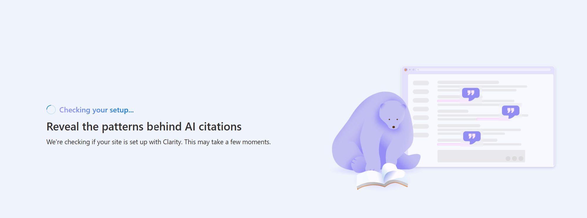

Ekran startowy przy pierwszej weryfikacji Citations w Microsoft Clarity.

Na start potrzebujesz dwóch rzeczy:

- **Projektu w Microsoft Clarity** – utworzonego dla domeny, którą chcesz analizować. Konto jest darmowe i nie wymaga podpinania karty płatniczej.
- **Zweryfikowanej własności domeny** – możesz to zrobić na trzy sposoby: wklejając kod śledzenia Clarity na stronie, łącząc konto z Google Search Console (GSC) lub korzystając z Bing Webmaster Tools (BWT).

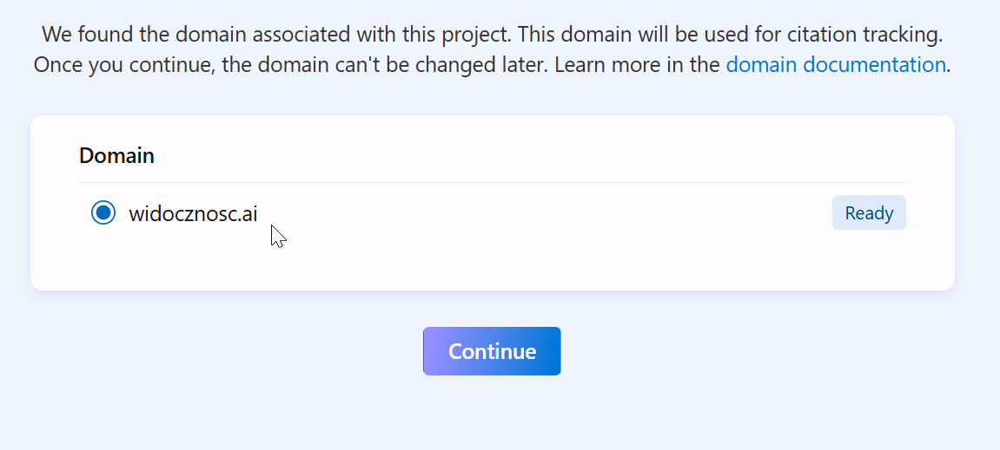

Potwierdzenie domeny projektu w Microsoft Clarity.

Ekran weryfikacji pojawi się przy pierwszym wejściu w panel AI Visibility. Clarity automatycznie wykryje domenę projektu, a Twoim zadaniem będzie jedynie potwierdzenie jej przyciskiem „Continue”. Kliknięcie przycisku „Continue” wymaga uprawnień administratora. Jeśli ich nie posiadasz, przycisk będzie nieaktywny.

Pamiętaj też, że dane nie pojawią się natychmiast. Clarity potrzebuje czasu na odpytanie modeli i zebranie reprezentatywnej próbki odpowiedzi. Pierwszy rzetelny raport zobaczysz zazwyczaj po kilku dniach, a nie tego samego popołudnia.

## Krok po kroku – jak uruchomić pierwszy raport

Po pomyślnej weryfikacji domeny rozwiń menu **AI Visibility** w panelu Clarity. Na początku prawdopodobnie zobaczysz tam tylko dwie pozycje:

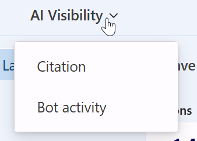

Menu AI Visibility przed uruchomieniem Topic Insights.

Przetestowałem ten proces na żywo podczas pisania tego poradnika. Mimo zweryfikowanej domeny, menu w naszym projekcie wyświetlało wyłącznie **Citation** oraz **Bot activity**. Opcja **Topic insights** (oznaczona tagiem BETA) pojawiła się dopiero po kliknięciu w raport Citation – system wyświetlił tam baner z przyciskiem „Explore topic insights”. Nie musisz więc czekać na globalną aktualizację kont, wystarczy jedno kliknięcie:

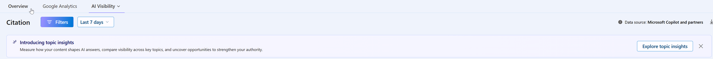

Baner „Explore topic insights” w raporcie Citation.

Po jego kliknięciu menu **AI Visibility** wzbogaci się o trzecią pozycję:

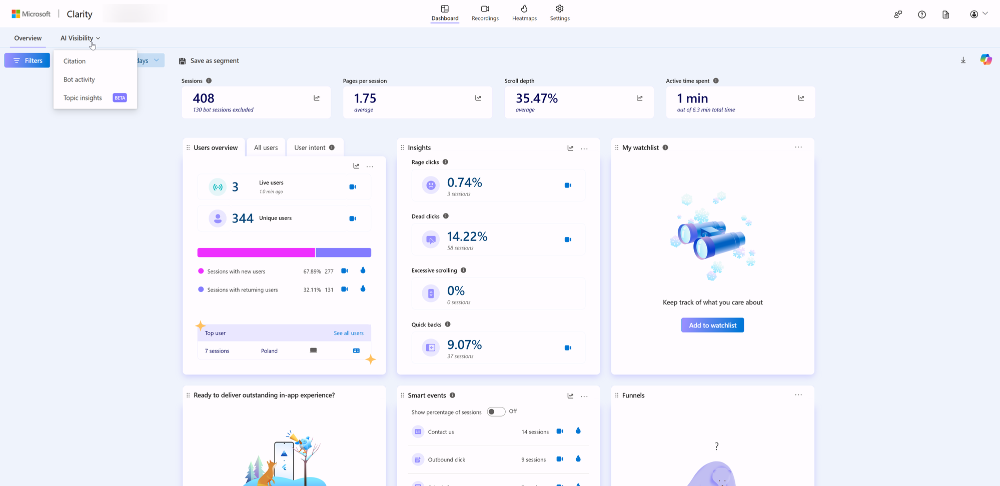

Menu AI Visibility po aktywacji Topic Insights.

Wybierz **Topic insights** (lub kliknij bezpośrednio w przycisk na banerze). Zobaczysz ekran powitalny, na którym możesz skorzystać z gotowych szablonów lub stworzyć własny zestaw promptów od podstaw:

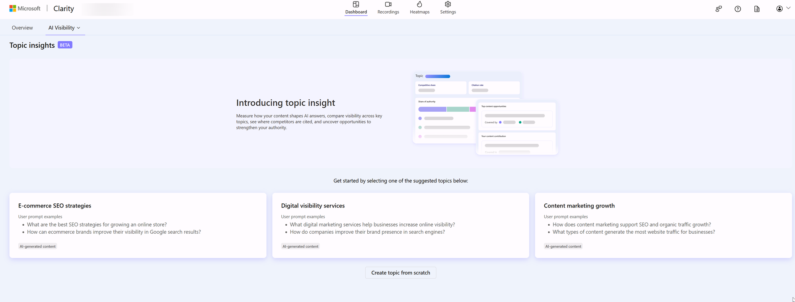

Ekran startowy Topic Insights z gotowymi szablonami tematów.

Wybór gotowego szablonu (np. „E-commerce SEO strategies”) automatycznie wypełnia formularz anglojęzycznymi promptami wygenerowanymi przez AI:

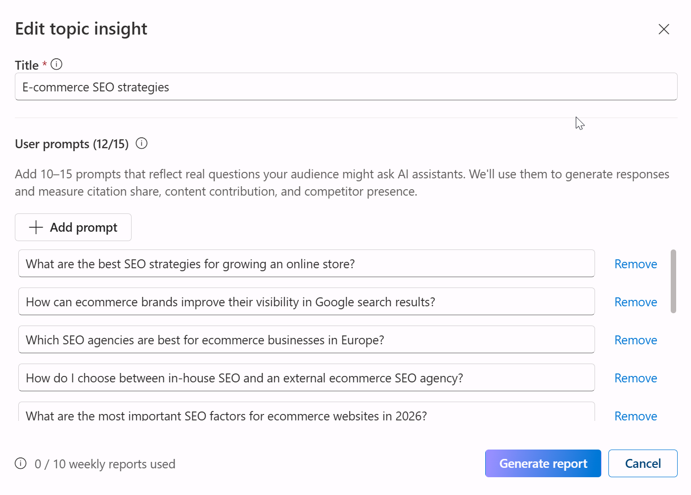

Automatycznie wygenerowane prompty dla szablonu „E-commerce SEO strategies”.

To wygodne rozwiązanie na start. Największą wartość uzyskasz jednak, klikając **Create topic from scratch** i wprowadzając własne, polskie zapytania. Dokładnie tak postąpiliśmy w przypadku witryny widocznosc.ai:

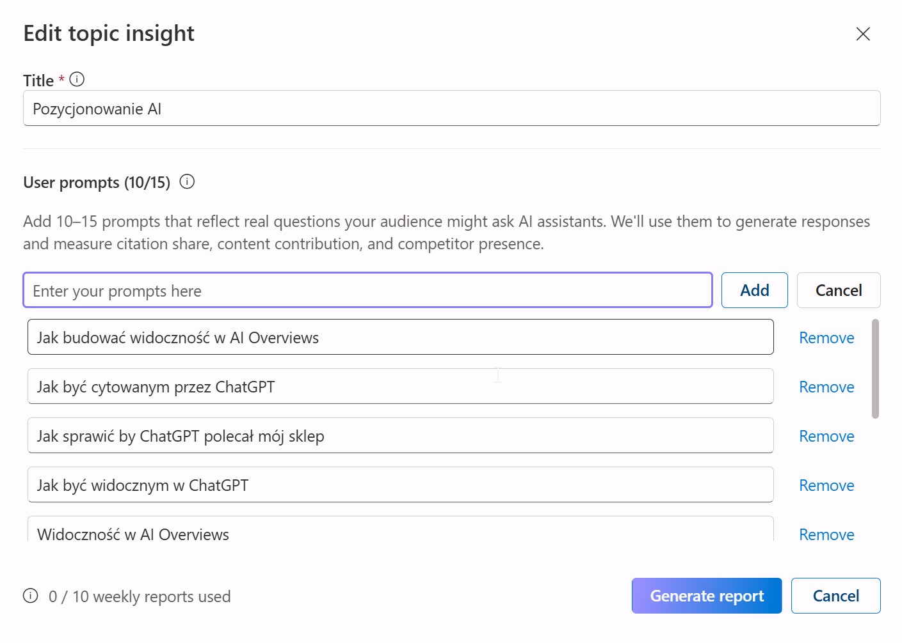

Własny temat „Pozycjonowanie AI” z polskimi promptami.

Konfiguracja sprowadza się do wypełnienia dwóch pól: **Title** (nazwa tematu – w naszym przypadku „Pozycjonowanie AI”) oraz **User prompts** (od 10 do 15 pytań sformułowanych z perspektywy klienta, np. „jak budować widoczność w AI Overviews” czy „jak sprawić, by ChatGPT polecał mój sklep”). Im wierniej odwzorujesz naturalny język swoich odbiorców, tym trafniejszy będzie raport. Warto w tym miejscu przeanalizować historię zapytań, wnioski z rozmów z działem obsługi klienta lub skorzystać z mechanizmu [query fan-out](/geo/query-fan-out/), który obrazuje, jak jedno ogólne zapytanie rozgałęzia się na szereg bardziej szczegółowych.

Po kliknięciu **Generate report** system zaczyna odpytywać model językowy, analizować wygenerowane odpowiedzi i identyfikować cytowane w nich źródła. Widoczny u dołu formularza licznik („0 / 10 weekly reports used”) ułatwia kontrolowanie cotygodniowego limitu zapytań.

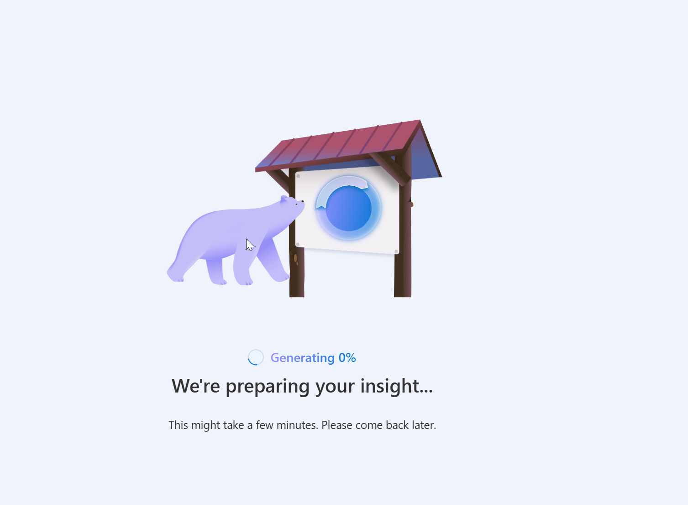

Generowanie pierwszego raportu Topic Insights.

Niezależnie od tworzenia tematu, pamiętaj o zweryfikowaniu listy konkurentów w zakładce **Edit competitors**. To od niej zależy, czy w raporcie pojawi się wskaźnik „Competitive share”, czy jedynie wartość N/A. **Podejdź do definiowania konkurencji szeroko.** Uwzględnij nie tylko bezpośrednich rywali biznesowych, ale również portale branżowe, wydawców i serwisy poradnikowe, które często dominują w wynikach AI, nawet jeśli w klasycznym wyszukiwaniu SEO ustępują Ci miejsca.

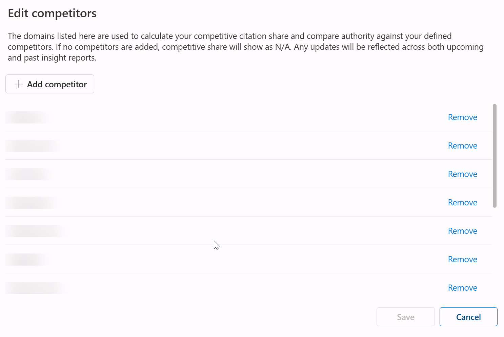

Panel Edit competitors w Microsoft Clarity.

Microsoft zaznacza, że bez zdefiniowania rywali wskaźnik „Competitive share” pozostanie pusty. Co istotne, każda aktualizacja tej listy skutkuje ponownym przeliczeniem już wygenerowanych raportów, więc nie musisz od razu wpisywać wszystkich konkurentów.

Warto też wiedzieć, że raz skonfigurowany temat nie jest jednorazowy. Clarity automatycznie generuje kolejny raport co tydzień, licząc od daty poprzedniego uruchomienia – w panelu widać to jako datę bieżącego raportu i etykietę „Next run” obok przycisku „Generate new report”. Każdy taki raport trafia do historii razem z datą, użytym modelem AI i odnośnikiem do zestawu promptów, na którym się opierał.

## Jak czytać cztery wymiary raportu

Wygenerowany raport składa się z czterech powiązanych ze sobą perspektyw. Kluczem do sukcesu jest umiejętność przełożenia każdej z nich na konkretne decyzje biznesowe.

**Visibility** traktuj jako swój udział w rynku cytowań dla danego tematu. Wysoka widoczność oznacza, że modele językowe regularnie powołują się na Twoją domenę w danej kategorii. Niska wskazuje, że praktycznie nie istniejesz w odpowiedziach AI – nawet jeśli w tradycyjnych wynikach Google zajmujesz czołowe pozycje. **Ta rozbieżność to jedno z najczęstszych zaskoczeń podczas wdrażania projektów GEO.**

Pierwszy raport Topic Insights dla widocznosc.ai – dane jeszcze zerowe.

Powyżej widzisz nasz pierwszy raport wygenerowany dla widocznosc.ai – celowo prezentujemy go bez upiększania. Główne wskaźniki pokazują zera, ponieważ temat został dopiero utworzony i Clarity nie zdążyło jeszcze zebrać historii cytowań. Mimo to, sekcja *Share of authority* już działa, pokazując realny rozkład sił w kategorii (widać tu m.in. domeny google.com i hubspot.com). Z kolei sekcja *Your top content to AI responses* uczciwie informuje o braku danych („No top content available”). Dokładnie takiego widoku powinieneś się spodziewać przy pierwszym uruchomieniu. Prawdziwa wartość narzędzia ujawnia się dopiero po kilku cyklach zbierania danych.

Żeby dać Ci pełniejszy obraz tego, jak wygląda raport po zebraniu danych, poniżej znajdziesz oficjalny przykład z bloga Microsoft Clarity – konto demonstracyjne „Tailwind Traders” i temat „Electric bicycles”:

Przykładowy, dojrzały raport z oficjalnego bloga Microsoft Clarity (konto demo).

Ten zrzut dobrze pokazuje różnicę w szczegółowości między dwiema dolnymi sekcjami raportu. „Top content opportunities” – czyli luki, które wypełnia konkurencja – wskazuje tylko domenę rywala (np. „Covered by: Zava Bikes, Contoso”), bez linku do konkretnej strony. Za to „Your top content to AI responses” pokazuje już dokładny adres Twojej własnej podstrony (np. „/guides/electric-bicycles”), która trafiła do odpowiedzi AI. Atrybucja na poziomie URL-a działa więc tylko w jedną stronę – dla Twoich treści tak, dla treści konkurencji nie. Data raportu i etykieta „Next run” w rogu ekranu to wspomniany wcześniej, cotygodniowy rytm automatycznego odświeżania.

**Influence** uzupełnia to, czego nie oddaje sama widoczność. Możesz być często cytowany, ale pełnić jedynie rolę tła dla innych źródeł. **Wysoki wpływ oznacza, że Twoje treści stanowią fundament odpowiedzi AI – model opiera na nich swój wywód, a nie tylko wymienia Cię w przypisach.** Dla marek budujących [autorytet tematyczny (topical authority)](/geo/topical-authority/), jest to absolutnie kluczowa metryka.

**Competition** pokazuje, kto pojawia się obok Ciebie w wynikach AI. W tej sekcji powinieneś szukać dwóch rzeczy: domen, które regularnie Cię wyprzedzają, oraz zagadnień, w których brylują konkretni rywale. Jeśli jeden konkurent dominuje w pytaniach o trwałość produktu, a inny przy pytaniach o cenę, otrzymujesz gotową mapę obszarów do zagospodarowania. W skali całej marki ten mechanizm określamy mianem [share of voice](/geo/share-of-voice/).

**Opportunities** to najważniejsza część raportu, ze względu na którą warto w ogóle z niego korzystać. Zamiast surowych liczb otrzymujesz priorytetyzowaną listę luk tematycznych – pytań i zagadnień, w których tracisz ruch na rzecz konkurencji, wzbogaconą o sugestie działań. **To gotowy backlog treści – narzędzie nie mówi po prostu „pisz więcej”, ale wskazuje konkretnie: „napisz o tym, ponieważ w tych odpowiedziach AI brakuje Twojej marki”.**

## Grounding queries – co AI naprawdę odpytuje

Pod warstwą wizualną raportu kryje się szczegół, który łatwo przeoczyć, a który doskonale wyjaśnia mechanikę działania modeli AI. Clarity prezentuje tzw. **grounding queries** (zapytania kotwiczące). Są to frazy, które silnik AI faktycznie wysyła do wyszukiwarki przed wygenerowaniem odpowiedzi. Daje to unikalny wgląd w procesy zachodzące „pod maską”. Użytkownik zadaje jedno pytanie, ale model rozbija je na kilka węższych zapytań i to na ich podstawie dobiera źródła.

Dla specjalisty GEO to bezcenna wiedza. **Jeśli zauważysz, że model rozbija ogólne zapytanie o „najlepsze buty do biegania” na szczegółowe kwestie dotyczące amortyzacji, wagi i opinii maratończyków, wiesz dokładnie, jakie sekcje i informacje musisz zawrzeć na swojej stronie, aby sztuczna inteligencja w ogóle wzięła Cię pod uwagę.** To idealnie spina teorię o tym, [jak LLM-y cytują źródła](/geo/jak-llm-cytuja-zrodla/), z praktyką tworzenia treści.

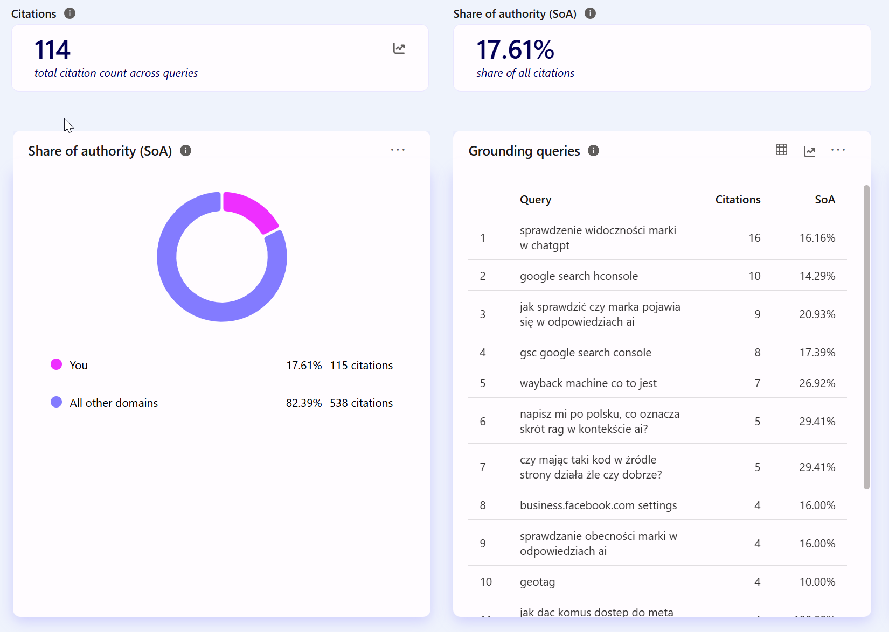

Grounding queries w panelu Citation dla widocznosc.ai.

Powyżej znajduje się zrzut ekranu z naszego projektu. Mechanizm *grounding queries*, na którym bazuje Topic Insights, działa już teraz w module Citations. Widać tu zarówno trafne zapytania (np. „sprawdzenie widoczności marki w chatgpt”), jak i pewien szum informacyjny, niezwiązany bezpośrednio z naszą marką. To całkowicie normalne zjawisko przy małej próbce danych, o którym warto pamiętać podczas analizy własnych raportów.

W samym raporcie możesz też otworzyć okno **View User Prompt**, które rozbija wszystkie zdefiniowane przez Ciebie prompty na dwie grupy: cytowane i niecytowane. To szybki sposób, by zobaczyć, które konkretnie pytania w ogóle przebiły się do odpowiedzi AI – narzędzie wciąż jednak nie pokazuje, na jakiej stronie akurat wtedy zostałeś zacytowany.

<aside class="callout-expert">
  

  

    
Opinia eksperta

    
Narzędzie jest na rynku zaledwie od kilku dni, brakuje nam więc danych historycznych, które moglibyśmy zestawić z realnym ruchem czy logami serwerowymi. To pierwsza zasada, o której musisz pamiętać: przy nowo utworzonym temacie początkowe wskaźniki będą bliskie zera, nie traktuj ich więc jak wyroczni. Jednak już po pierwszym uruchomieniu widać, gdzie ukryta jest największa wartość. <strong>Nie tkwi ona w samych liczbach, lecz w zestawieniu listy Opportunities z grounding queries. Otrzymujesz nie abstrakcyjny wykres, a konkretną instrukcję wskazującą, jaki fragment tekstu musisz dopisać, by model zechciał Cię zacytować.</strong> Skuteczność tych rekomendacji będziemy mogli ocenić dopiero po kilku pełnych cyklach analitycznych.

    
Tomasz Czechowski · Head of SEO, ICEA

  

</aside>

## Gdzie Topic Insights ma ograniczenia – szczery komentarz

Udostępnienie tak zaawansowanego narzędzia analitycznego za darmo to bez wątpienia przełomowy krok ze strony Microsoftu. Aby jednak mądrze z niego korzystać, musisz mieć świadomość jego ograniczeń. W przeciwnym razie łatwo o błędne wnioski.

Zacznijmy od podstaw – skąd w ogóle biorą się „odpowiedzi AI” analizowane w raporcie? Topic Insights nie odpytuje w czasie rzeczywistym ChatGPT, Gemini czy Google AI Overviews. Narzędzie opiera się na odpowiedziach generowanych przez model **GPT-5.3**, zintegrowany z technologią **Web IQ**. Jest to zestaw interfejsów wyszukiwania, zaprezentowany przez Microsoft w czerwcu 2026 roku, który dostarcza modelom nie całe dokumenty, a jedynie wyselekcjonowane fragmenty (pasaże) i ustrukturyzowane „dowody”. **W praktyce oznacza to, że analizujesz spójną, powtarzalną symulację stworzoną w „ekosystemie Microsoftu”, a nie dokładny zapis tego, co w danej sekundzie wygeneruje użytkownikowi inny silnik AI.** To bardzo wartościowe, ale wciąż tylko przybliżenie.

Do tego dochodzi sześć przyziemnych ograniczeń:

- **Status beta** – Microsoft otwarcie przyznaje, że jest to narzędzie do monitoringu trendów, a jego rekomendacje nie gwarantują stuprocentowej dokładności ani natychmiastowych wyników biznesowych. Traktuj te dane jako drogowskaz, a nie wyrocznię.
- **Limit 10 raportów tygodniowo na projekt** – pula ta wystarcza do monitorowania najważniejszych obszarów, ale wymaga dyscypliny. Rozdrabnianie limitu na dziesiątki bardzo wąskich zapytań sprawi, że szybko go wyczerpiesz.
- **Zależność od jakości promptów** – wartość raportu jest wprost proporcjonalna do jakości pytań, które zdefiniujesz. Nietrafione i niereprezentatywne zapytania wygenerują zafałszowany obraz całej kategorii.
- **Lista konkurentów wspólna dla całego projektu, nie dla pojedynczego tematu** – konkurenci zdefiniowani przy jednym temacie są widoczni też we wszystkich pozostałych tematach w tym samym projekcie. To problem, jeśli różne linie produktowe albo tematy realnie rywalizują z innymi firmami – i tak trzeba pogodzić się z jedną, wspólną listą.
- **Historia raportów bez wykresu trendu** – każdy kolejny raport w historii to osobna karta z datą, wskaźnikami i modelem AI, ale narzędzie nie rysuje linii łączącej je w czasie. Porównanie tygodnia do tygodnia oznacza więc ręczne przeklikiwanie się między kartami, a nie rzut oka na wykres.
- **Brak wglądu w treść samej odpowiedzi AI** – widzisz metryki i podsumowanie powodu cytowania, ale nie faktyczne zdanie czy kontekst, w jakim model Cię przywołał. Utrudnia to precyzyjne dostrojenie treści wyłącznie na podstawie raportu.

Te ograniczenia nie powinny zniechęcać Cię do korzystania z Topic Insights – mają jedynie uczyć krytycznego podejścia do danych. Do bardziej zaawansowanych zadań i tak będziesz musiał wykorzystać płatne platformy (np. gdy zależy Ci na emulacji realnych sesji w wielu silnikach jednocześnie, analizie źródeł na poziomie pojedynczego URL-a czy generowaniu zaawansowanych raportów dla zarządu). Zestawienie rozwiązań dopasowanych do różnej skali biznesu znajdziesz w moim [przeglądzie narzędzi do monitorowania wzmianek w LLM-ach](/geo/narzedzia-monitoring-wzmianek/).

## Jak wdrożyć Topic Insights w procesy GEO

Sam raport nie poprawi Twojej widoczności – liczy się to, jakie działania na jego podstawie podejmiesz. Najlepsze efekty osiągniesz, traktując Topic Insights jako początkowy, diagnostyczny etap szerszej strategii, a nie cel sam w sobie.

W praktyce najlepiej sprawdza się następujący schemat:

1. Wygeneruj raport dla 2–3 kluczowych obszarów biznesowych i wypisz z sekcji *Opportunities* luki tematyczne o najwyższym priorytecie.
2. Przeanalizuj te braki w kontekście *grounding queries* – dla każdej luki wynotuj, jakich dokładnie podzapytań używa model w wyszukiwarce.
3. Przekształć te wnioski w backlog treści – stwórz nowe sekcje, uzupełnij dane (pamiętając o datach i źródłach) i odpowiedz na pytania, których do tej pory brakowało na stronie.
4. Po wdrożeniu zmian odczekaj kilka tygodni, a następnie ponownie wygeneruj raport, by ocenić, jak zmienił się Twój udział w cytowaniach.

Taki cykl optymalizacyjny przynosi największe korzyści, gdy jest częścią szerszych działań. Topic Insights trafnie punktuje, *gdzie* wypadasz słabo w odpowiedziach AI, ale pełny obraz sytuacji – obejmujący również kwestie techniczne, których Clarity nie analizuje – zapewni Ci dopiero kompleksowy [audyt widoczności marki w AI](/geo/audyt-widocznosci-marki/). **To właśnie audyt wykaże, czy słabe wyniki są efektem braków w treści, blokowania botów, czy może problemów z renderowaniem elementów opartych na JavaScript.**

## Topic Insights – od pomiaru do przewagi

Topic Insights nie jest magicznym sposobem na automatyczny wzrost widoczności w AI. To jednak coś znacznie cenniejszego – darmowy i wiarygodny punkt wyjścia w dziedzinie, w której do niedawna za każdy pomiar trzeba było słono zapłacić. Narzędzie to dostarcza Ci trzech kluczowych elementów:

- obrazu Twojego udziału w cytowaniach,
- mapy działań konkurencji w podziale na zagadnienia,
- gotowej listy luk tematycznych do wypełnienia.

Reszta zależy już tylko od Ciebie. Uruchom raport dla najważniejszego tematu w Twojej branży, przeanalizuj sekcję *Opportunities* i wybierz pierwszą lukę, którą zamierzasz wypełnić. A jeśli wolisz najpierw zorientować się w swojej obecnej sytuacji, skorzystaj z narzędzia do [darmowego sprawdzania widoczności marki w AI](/narzedzia/brand-check/) – uzyskasz pierwsze wyniki w kilka minut, bez konieczności zakładania konta.
