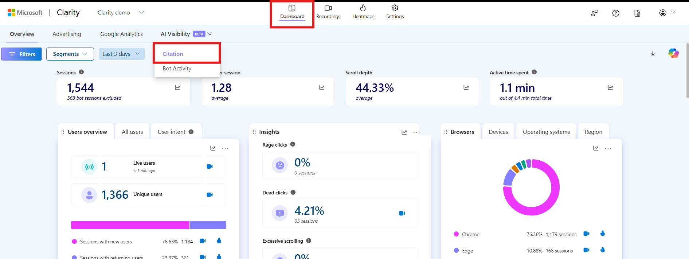
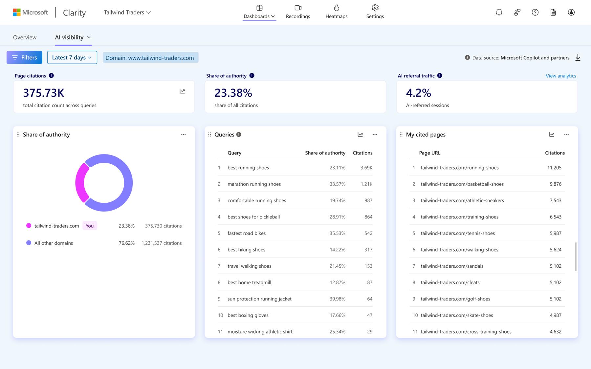

Twoja strona prawdopodobnie już teraz bierze udział w odpowiedziach, które ChatGPT, Perplexity czy Copilot generują dla Twoich klientów. Pytanie tylko, czy jako cytowane źródło – czy jako tło dla konkurencji. Przez ostatni rok odpowiedź na to pytanie wymagała subskrypcji narzędzia za kilkaset dolarów miesięcznie. To się właśnie zmieniło. 9 lipca 2026 roku Microsoft uruchomił w Clarity funkcję **Topic Insights**, która mierzy wkład Twoich treści w odpowiedzi AI i podpowiada, co z tym zrobić – całkowicie za darmo. W tym przewodniku pokażę Ci, jak ją uruchomić, jak czytać jej raporty i – co równie ważne – gdzie kończy się jej wiarygodność.

## Czym jest Topic Insights – i czym różni się od Citations

Microsoft Clarity znasz zapewne jako darmowe narzędzie do map ciepła i nagrań sesji. W 2026 roku panel rozrasta się jednak w stronę [GEO](/geo/czym-jest-geo/). Najpierw, w maju, pojawiła się funkcja **Citations**, która pokazuje, w których odpowiedziach AI Twoja domena figuruje jako źródło. Topic Insights to jej naturalne rozwinięcie: bierze surowe dane o cytowaniach i porządkuje je wokół tematów, którymi na co dzień żyje Twój biznes.

Różnicę najłatwiej ująć tak: Citations odpowiada na pytanie „czy i gdzie jestem cytowany", a Topic Insights na pytanie „co mam z tym zrobić". Zamiast listy pojedynczych odpowiedzi dostajesz obraz całej kategorii tematycznej – z Twoją pozycją, konkurencją i konkretnymi lukami.

Raport opisuje każdy temat w czterech wymiarach:

- **Visibility (widoczność)** – jak często Twoja domena jest cytowana w odpowiedziach dotyczących danego tematu i jaki masz udział w ogólnym autorytecie kategorii.
- **Influence (wpływ)** – jak duża część finalnej odpowiedzi AI faktycznie opiera się na Twoich treściach; to głębsza metryka niż samo „pojawienie się".
- **Competition (konkurencja)** – które domeny są cytowane obok Ciebie, jak często i gdzie mają nad Tobą przewagę.
- **Opportunities (szanse)** – konkretne, uszeregowane według priorytetów luki: tematy i pytania, przy których tracisz na rzecz konkurencji, wraz z sugestią kierunku działania.

<aside class="callout-fact">
  
✦

  

    
Ciekawostka

    
Wyspecjalizowane platformy, które robią dokładnie to samo – Profound czy Semrush AIO – startują od ok. 99 USD miesięcznie, a wersje enterprise idą w tysiące. Microsoft udostępnia pomiar wkładu treści w odpowiedzi AI za darmo, w narzędziu, z którego korzystają już miliony witryn. <strong>To jedno z największych obniżeń bariery wejścia do GEO, jakie miało miejsce od czasu pojawienia się AI Overviews.</strong>

  

</aside>

## Zanim zaczniesz: czego potrzebujesz

Topic Insights nie działa „od zera po zalogowaniu". To nadbudowa nad Citations, więc najpierw musisz uruchomić fundament. Zajmuje to kilkanaście minut, ale bez tych kroków nie zobaczysz żadnych danych.

Do startu potrzebujesz trzech rzeczy:

- **Projektu w Microsoft Clarity** – założonego dla domeny, którą chcesz badać. Konto Clarity jest darmowe i nie wymaga karty.
- **Zweryfikowanej własności strony** – przez wklejenie kodu śledzenia Clarity na stronie albo integrację z popularnym CMS-em. Bez potwierdzenia własności funkcje AI Visibility pozostają zablokowane.
- **Włączonej funkcji Citations** – to przełącznik w sekcji AI Visibility. Po jego aktywacji Clarity zaczyna zbierać dane o cytowaniach, na których Topic Insights buduje swoje raporty.

Ten krok warto zapamiętać: domenę wskazujesz raz i **nie da się jej później zmienić**. Jeśli pod jednym projektem Clarity masz podpiętych kilka domen, upewnij się, że zaznaczasz właściwą, zanim potwierdzisz wybór.

Dane nie pojawiają się jednak natychmiast. Clarity potrzebuje czasu, żeby odpytać modele i zebrać reprezentatywną próbkę odpowiedzi, więc pierwszy sensowny raport zobaczysz zwykle po kilku dniach zbierania sygnałów, a nie tego samego popołudnia.

## Krok po kroku: jak uruchomić pierwszy raport

Gdy funkcja Citations jest włączona, przejdź do rozwijanego menu **AI Visibility** w panelu Clarity – to stąd uruchamiasz Topic Insights. Cały proces sprowadza się do zdefiniowania trzech rzeczy: tematu, zapytań (promptów) i konkurencji.

*Źródło: [Microsoft Learn – dokumentacja Clarity](https://learn.microsoft.com/en-us/clarity/ai-visibility/ai-citations).*

Zwróć uwagę na tag **BETA** obok „AI Visibility" – to nieprzypadkowe. Uczciwie: w chwili pisania tego poradnika menu w naszym własnym projekcie (grupa-icea.pl) pokazywało wyłącznie **Citation** i **Bot activity** – bez pozycji Topic Insights, mimo włączonych Citations. Microsoft wdraża dostęp do świeżo ogłoszonej (9 lipca 2026 roku) funkcji stopniowo, więc u Ciebie ta pozycja może pojawić się później niż na innych kontach. Kroki poniżej opieramy na oficjalnej dokumentacji Microsoftu – gdy funkcja odblokuje się w Twoim projekcie, interfejs powinien wyglądać dokładnie tak.

Zacznij od **tematu**. To nie jest pojedyncze słowo kluczowe, lecz obszar, wokół którego chcesz mierzyć swoją pozycję – na przykład „buty do biegania na długie dystanse" albo „systemy ERP dla produkcji". Dobrze dobrany temat jest na tyle wąski, żeby odpowiedzi AI były porównywalne, ale na tyle szeroki, żeby obejmował cały wachlarz pytań klientów.

Następnie definiujesz **reprezentatywne prompty (zapytania)**. To sedno całej metody. Topic Insights nie zgaduje, jak ludzie pytają AI o Twoją kategorię – to Ty mu to mówisz. Wpisujesz pytania sformułowane tak, jak zadałby je Twój klient: „które buty do biegania są najtrwalsze", „co wybrać przy problemach z kolanami", „najlepsze systemy ERP dla średniej firmy". Im wierniej odwzorujesz prawdziwy język klientów, tym trafniejszy będzie raport. To dobry moment, żeby sięgnąć do historii zapytań, rozmów z działem obsługi albo mechanizmu [query fan-out](/geo/query-fan-out/), który pokazuje, jak jedno pytanie rozgałęzia się w wiele podpytań.

Na koniec wskazujesz **konkurencję** – domeny, z którymi chcesz się porównywać. Możesz podać oczywistych rywali rynkowych, ale realną wartość daje dopisanie tych, którzy wygrywają w wynikach AI, choć w klasycznym SEO w ogóle ich nie widzisz. To często wydawcy, portale poradnikowe i serwisy branżowe, a nie Twoi bezpośredni konkurenci sprzedażowi.

Po zatwierdzeniu Clarity odpytuje model językowy, ocenia wygenerowane odpowiedzi, wychwytuje w nich cytowane domeny i strony, a następnie mierzy, ile każde źródło wnosi do finalnej odpowiedzi. Wyniki agreguje na poziomie tematu – i dopiero ta agregacja ujawnia wzorce, których nie zobaczysz, patrząc na pojedyncze odpowiedzi.

## Jak czytać cztery wymiary raportu

Gotowy raport to nie jeden wskaźnik, lecz cztery powiązane perspektywy, a klucz tkwi w tym, żeby każdą z nich przełożyć na decyzję.

**Visibility** czytaj jako swój udział w rynku cytowań danego tematu. Wysoka widoczność oznacza, że modele regularnie sięgają po Twoją domenę, gdy odpowiadają w tej kategorii. Niska – że w praktyce nie istniejesz w tej rozmowie, nawet jeśli w Google zajmujesz wysokie pozycje. Ta rozbieżność jest jednym z najczęstszych zaskoczeń, jakie widzimy w projektach.

*Źródło: [Microsoft Clarity Blog](https://clarity.microsoft.com/blog/topic-insights-announcement/) – zrzut promocyjny z danymi demonstracyjnymi fikcyjnej marki „Tailwind Traders", nie dane rzeczywistego klienta.*

**Influence** dopowiada to, czego Visibility nie ujmuje. Możesz być cytowany często, ale zawsze jako jedno z pięciu źródeł w tle. Wysoki wpływ oznacza, że to właśnie Twoja treść stanowi trzon odpowiedzi – że model buduje wywód na Twoich zdaniach, a nie tylko dorzuca Cię do listy. Markom, które budują [autorytet tematyczny](/geo/topical-authority/), zależy właśnie na tym wymiarze.

**Competition** pokazuje, kto stoi obok Ciebie w odpowiedziach. Tu szukasz dwóch rzeczy: nazw domen, które regularnie Cię wyprzedzają, oraz tematów, w których dany rywal dominuje. Jeśli jedna domena wygrywa przy pytaniach o trwałość produktu, a inna przy pytaniach o cenę, masz gotową mapę frontów, na których musisz zawalczyć. W skali całej marki ten sam mechanizm nazywamy [share of voice](/geo/share-of-voice/).

**Opportunities** to część, dla której warto uruchamiać cały raport. Zamiast surowych liczb dostajesz uszeregowaną według priorytetów listę luk – pytań i podtematów, przy których tracisz cytowania na rzecz konkurencji, wraz z sugestią kierunku. To gotowy backlog treści: nie „napisz więcej", tylko „napisz o tym, bo tu realnie Cię brakuje w odpowiedziach AI".

## Grounding queries: co AI naprawdę odpytuje

Pod warstwą raportu kryje się detal, który łatwo przeoczyć, a który dużo mówi o mechanice cytowań. Clarity pokazuje tak zwane **grounding queries** – zapytania ugruntowujące, które silnik AI faktycznie wysyła do wyszukiwarki, zanim zbuduje odpowiedź. To rzadki wgląd w to, co dzieje się „pod maską": użytkownik zadaje jedno pytanie, ale model w tle rozbija je na kilka konkretnych zapytań i dopiero na ich podstawie pobiera źródła.

Dla praktyka GEO to złoto. Jeśli widzisz, że model rozbija pytanie o „najlepsze buty do biegania" na zapytania o amortyzację, wagę i opinie po przebiegnięciu maratonu, wiesz dokładnie, jakie sekcje i jakie dane musi zawierać Twoja strona, żeby w ogóle wejść w pole widzenia. To domyka pętlę między tym, [jak LLM-y cytują źródła](/geo/jak-llm-cytuja-zrodla/), a tym, co konkretnie masz na stronie umieścić.

*Źródło: [Microsoft Clarity Blog](https://clarity.microsoft.com/blog/understanding-your-influence-ai-citations/) – zrzut oficjalnej dokumentacji, dane demonstracyjne „Tailwind Traders".*

Ten sam mechanizm grounding queries, na którym opiera się Topic Insights, działa już dziś w warstwie Citations – to właśnie stąd Twoje dane trafiają później do raportów tematycznych.

<aside class="callout-expert">
  

  

    
Opinia eksperta

    
Darmowe narzędzie kusi, żeby traktować jego liczby jak wyrocznię – a to najszybsza droga do złych decyzji. W ICEA używamy Topic Insights jako soczewki, nie jako werdyktu: raport świetnie wskazuje <em>kierunek</em> – które tematy oddajemy konkurencji – ale wartość powstaje dopiero wtedy, gdy zestawimy go z realnym ruchem i logami serwera. <strong>Najcenniejsza w tym raporcie jest lista Opportunities połączona z grounding queries: to nie abstrakcyjny wskaźnik, tylko konkretna instrukcja, jaką sekcję dopisać na stronie, żeby model miał co zacytować.</strong>

    
Tomasz Czechowski · Head of SEO, ICEA

  

</aside>

## Gdzie Topic Insights ma ograniczenia – szczery komentarz

Fakt, że Microsoft oddaje taki pomiar za darmo, to spora rzecz. Ale żeby korzystać z niego rozsądnie, musisz wiedzieć, czego on nie mierzy – bo tu łatwo o kosztowne nieporozumienie.

Zacznijmy od tego, skąd w ogóle biorą się „odpowiedzi AI" w tym raporcie. Topic Insights nie odpytuje na żywo ChatGPT, Gemini ani Google AI Overviews. Ocenia odpowiedzi generowane przez model **GPT-5.3**, ugruntowany w warstwie **Web IQ** – zestawie interfejsów wyszukiwania, który Microsoft zapowiedział na konferencji BUILD w czerwcu 2026 roku i który zwraca modelom nie całe dokumenty, lecz pasaże i ustrukturyzowane „obiekty dowodowe". W praktyce patrzysz więc na spójną, powtarzalną symulację „świata Microsoftu", a nie na dokładny zrzut tego, co w danej sekundzie odpowie użytkownikowi konkretny silnik. To bardzo wartościowe przybliżenie – ale wciąż przybliżenie.

Do tego dochodzą trzy przyziemne ograniczenia:

- **Status beta.** Sam Microsoft opisuje funkcję jako narzędzie do monitoringu kierunkowego i zastrzega, że rekomendacje nie gwarantują dokładności ani konkretnych wyników. Traktuj liczby jako trend, nie jako prawdę absolutną.
- **Limit 10 raportów tygodniowo na projekt.** To wystarcza do pilnowania kilku kluczowych tematów, ale wymusza dyscyplinę w wyborze tego, co śledzisz. Rozdrabnianie limitu na dziesiątki wąskich promptów szybko go wyczerpie.
- **Zależność od jakości Twoich promptów.** Raport jest tak dobry, jak reprezentatywne pytania, które w nim zdefiniujesz. Źle dobrane zapytania dają mylący obraz kategorii.

Nie są to powody, żeby z narzędzia zrezygnować – to powody, żeby czytać je z głową. Do części zadań i tak sięgniesz po rozwiązania płatne: gdy potrzebujesz emulacji realnych sesji w wielu silnikach naraz, weryfikacji źródeł na poziomie pojedynczego URL-a albo raportowania zarządowi w cyklu miesięcznym. Które z nich mają sens przy Twojej skali, omawiam w [przeglądzie narzędzi do monitorowania wzmianek w LLM-ach](/geo/narzedzia-monitoring-wzmianek/).

## Jak wdrożyć Topic Insights w procesy GEO

Sam raport nie zmieni Twojej widoczności – zmieni ją dopiero to, co z nim zrobisz. Najwięcej wyciągniesz, traktując Topic Insights jako pierwszy, diagnostyczny etap większego procesu, a nie jako cel sam w sobie.

W praktyce sprawdza się prosty rytm:

1. Uruchom raport dla 2–3 najważniejszych tematów biznesowych i wynotuj z sekcji Opportunities luki o najwyższym priorytecie.
2. Zestaw te luki z grounding queries: dla każdej luki zapisz, jakie konkretne podpytania model wysyła do wyszukiwarki.
3. Przełóż to na backlog treści – nowe sekcje, dane z datą i źródłem, odpowiedzi na pytania, których dziś na stronie brakuje.
4. Po wdrożeniu odczekaj kilka tygodni i wygeneruj raport ponownie, porównując udział cytowań przed i po.

Ten cykl działa najlepiej, gdy nie stoi w próżni. Topic Insights doskonale wskazuje, *gdzie* wypadasz słabo w odpowiedziach AI, ale pełny obraz – łącznie z częścią techniczną, której Clarity nie widzi – daje dopiero [audyt widoczności marki w AI](/geo/audyt-widocznosci-marki/). To on odpowie, czy problemem jest brak treści, czy może zablokowany bot albo treść ładowana dopiero przez JavaScript.

## Podsumowanie: od pomiaru do przewagi

Topic Insights nie jest magicznym przyciskiem, który winduje widoczność w AI. Jest czymś rzadszym: darmowym, wiarygodnym punktem startowym w dziedzinie, w której do niedawna każdy pomiar kosztował. Daje Ci trzy rzeczy, których wcześniej za darmo nie było – obraz Twojego udziału w cytowaniach, mapę konkurencji w podziale na tematy i konkretną listę luk do zasypania.

Reszta zależy od Ciebie. Uruchom raport dla swojego najważniejszego tematu, przeczytaj Opportunities i wybierz jedną lukę, którą zasypiesz jako pierwszą. A jeśli chcesz najpierw zobaczyć, od jakiego punktu startujesz, [darmowe sprawdzenie widoczności marki w AI](/narzedzia/brand-check/) pokaże Ci to w kilka minut, bez zakładania żadnego konta.
