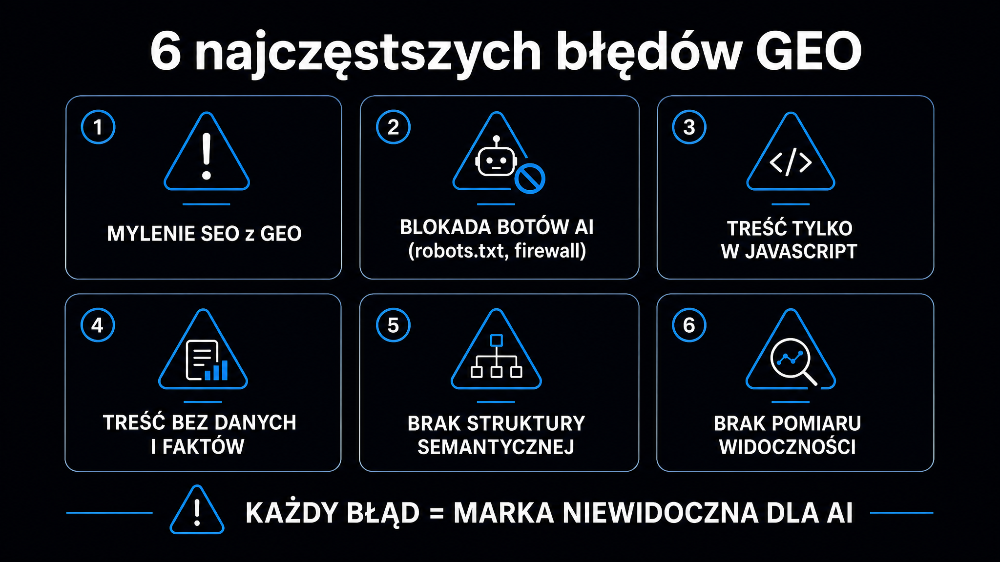

Aż 73% firm nie dysponuje żadnym narzędziem do mierzenia widoczności swojej marki w odpowiedziach AI – a mimo to ich zespoły aktywnie „optymalizują pod kątem LLM-ów", kopiując reguły klasycznego SEO do zupełnie innego systemu. To prosta droga do niewidzialności. GEO (Generative Engine Optimization, czyli optymalizacja pod generatywne silniki wyszukiwania) rządzi się własną logiką: liczy się nie pozycja rankingowa, lecz to, czy Twoja treść trafia do syntezy, którą model buduje w czasie rzeczywistym. Poniżej opisuję błędy, które widzę najczęściej w audytach, wraz z konkretnymi krokami naprawczymi.

## Błąd 1 – mylenie SEO z GEO

Tradycyjne SEO ocenia domeny przez pryzmat profilu linków i pozycji rankingowych. LLM-y (Large Language Models, czyli duże modele językowe) działają inaczej: analizują fragmenty tekstu, zamieniają je na reprezentacje wektorowe (tzw. osadzenia lub embeddingi – wielowymiarowe liczbowe reprezentacje znaczenia) i wyszukują te fragmenty, które semantycznie najlepiej odpowiadają na zadane pytanie. Wysoka pozycja w Google nie przekłada się automatycznie na cytowanie przez ChatGPT czy Perplexity.

Badanie [Aggarwal et al. (KDD 2024)](https://arxiv.org/abs/2311.09735) z Princeton University, przetestowane na benchmarku GEO-bench złożonym z 10 000 zapytań, pokazało wprost: **strony z niskim autorytetem domenowym, które zastosowały statystyki i cytowania źródeł, zwiększały widoczność w LLM-ach o 115% – pokonując liderów SEO, którzy tych elementów nie mieli**. To fundamentalna zmiana reguł gry.

Cztery pary pojęć, które pomagają odróżnić obie dyscypliny:

- **Słowa kluczowe vs reprezentacje wektorowe** – SEO liczy wystąpienia frazy; LLM ocenia semantyczną bliskość całego fragmentu do zapytania.
- **Pozycja rankingowa vs włączenie do syntezy** – zamiast miejsca na liście liczy się to, czy Twój fragment trafił do wygenerowanej odpowiedzi.
- **Profil linków vs wzorce cytowań** – w GEO wiarygodność buduje się przez linkowanie do zewnętrznych badań, nie tylko przez pozyskiwanie backlinków.
- **Ruch organiczny vs Share of Voice** – wskaźnik cytowań (Citation Rate) i udział w dyskusji (Share of Voice, SoV) zastępują samą liczbę wizyt.

### Upychanie słów kluczowych – efekt odwrotny do zamierzonego

Upychanie słów kluczowych (keyword stuffing) to jedno z najcenniejszych „osiągnięć" starego SEO, które w GEO aktywnie szkodzi. Kiedy tekst wielokrotnie powtarza tę samą frazę bez budowania głębokich relacji pojęciowych, wektor (embedding) reprezentujący dany fragment kurczy się semantycznie – model traktuje go jak zduplikowany, bezużyteczny rekord. Benchmark Princeton potwierdził to empirycznie: keyword stuffing był jedyną taktyką, która obniżała wskaźnik cytowalności.

Zamiast tego: buduj treść wokół precyzyjnych faktów, dat, liczb i relacji przyczynowo-skutkowych. Każdy fragment po 200–400 słów powinien samodzielnie odpowiadać na jedno konkretne pytanie – bez konieczności czytania reszty artykułu.

<aside class="callout-fact">
  
✦

  

    
Ciekawostka

    
Badanie Princeton KDD 2024 przetestowało 9 taktyk optymalizacji treści. Spośród nich tylko 5 przynosiło statystycznie istotny wzrost widoczności. Keyword stuffing – standard klasycznego SEO – był jedyną taktyką, która aktywnie <strong>obniżała wskaźnik cytowalności. Cytowania ekspertów i dane liczbowe podnosiły go natomiast o 30–41%.</strong>

  

</aside>

## Błąd 2 – błędna konfiguracja robots.txt i blokowanie botów AI

Około 40% technicznych audytów GEO ujawnia problematyczne konfiguracje pliku `robots.txt`. Najczęstszy scenariusz: administrator, przestraszony doniesieniami o masowym pobieraniu treści przez systemy AI, blokuje wszystkich agentów zawierających w nazwie słowo „Bot" lub „AI". Skutek jest odwrotny od zamierzonego – witryna znika z odpowiedzi ChatGPT, Perplexity i Google AI Overviews.

Boty AI dzielą się na dwie zasadniczo różne klasy, które wymagają odmiennej polityki dostępu:

| Klasa bota | Przykłady | Rola | Zalecana polityka |
|---|---|---|---|
| Boty wyszukiwawcze i użytkownika | `OAI-SearchBot`, `PerplexityBot`, `ChatGPT-User` | Pobieranie treści w czasie rzeczywistym, prezentacja odpowiedzi z linkiem do Twojej strony | `Allow` – blokada = zero ruchu referencyjnego |
| Boty treningowe | `GPTBot`, `ClaudeBot`, `Google-Extended`, `CCBot` | Masowe indeksowanie zasobów do budowy baz wiedzy modeli offline | `Disallow` – wysokie zużycie transferu, brak bezpośredniego ruchu |

Zablokowanie `OAI-SearchBot` eliminuje Cię z wyników ChatGPT Search. Zablokowanie `PerplexityBot` – z Perplexity AI. Obie te pomyłki często nie są widoczne w standardowych raportach analitycznych, bo nie generują błędów 4xx na poziomie serwera. Sprawdź, czy Twoje boty mają dostęp, korzystając z narzędzia [Dostęp botów AI](/narzedzia/ai-bots-check/) – weryfikuje ono konfigurację `robots.txt` i faktyczną dostępność dla poszczególnych agentów.

### Cloudflare i niewidzialna blokada na brzegu sieci

Osobna pułapka czeka na strony hostowane za sieciami dostarczania treści (CDN), szczególnie za Cloudflare. Moduł „AI Scrapers and Crawlers" po aktywowaniu blokuje ruch botów AI bezpośrednio na brzegu sieci, zwracając błąd `403 Forbidden` – zanim bot w ogóle dotrze do serwera i przeczyta plik `robots.txt`. **Twoja poprawnie skonfigurowana reguła robots.txt staje się wówczas nieistotna – bot nigdy jej nie zobaczy.**

Weryfikacja wymaga ręcznego sprawdzenia nagłówków odpowiedzi CDN dla znanych user-agentów botów, a nie samego pliku konfiguracyjnego.

## Błąd 3 – renderowanie po stronie klienta (CSR) jako niewidzialna ściana

Większość botów AI używanych w systemach [generowania wspomaganego wyszukiwaniem](https://pl.wikipedia.org/wiki/Retrieval-augmented_generation) (RAG – Retrieval-Augmented Generation) pobiera wyłącznie surowy kod HTML zwrócony przez serwer i nie uruchamia interpretera JavaScript. Jeśli Twoja witryna opiera się na renderowaniu po stronie klienta (Client-Side Rendering, CSR) – gdzie kluczowe tabele porównawcze, opisy produktów czy cenniki ładują się dynamicznie po uruchomieniu skryptów – bot AI zobaczy pusty szablon HTML bez żadnej treści merytorycznej.

**Informacje schowane za interakcjami użytkownika – rozwijane akordeony, zakładki wymagające kliknięcia, kalkulatory, ekrany logowania – są dla botów AI całkowicie niedostępne.** Jeśli chcesz, żeby dana treść była cytowana, musi być w pełni widoczna w kodzie HTML zaraz po załadowaniu strony, bez symulowania zdarzeń przeglądarkowych.

Wymagany standard techniczny to renderowanie po stronie serwera (SSR) lub generowanie statyczne (SSG). Coraz więcej platform CMS oferuje te tryby domyślnie lub jako przełączalną opcję – warto zweryfikować, jak skonfigurowana jest Twoja witryna, zanim zaczniesz optymalizować treść.

## Błąd 4 – treść bez danych i bez autorytatywnych cytowań

To najczęstszy błąd treściowy, który widzę w audytach. Strona ma dobre pozycje SEO, solidny profil linków, przyzwoity ruch – ale treść wygląda jak napisana pod algorytm Google'a sprzed 2020 roku: ogólnikowe opisy, zero liczb, zero dat, każde twierdzenie to opinia bez podstawy źródłowej.

Dla modelu językowego taka strona jest bezużyteczna jako źródło cytowania. Modele są trenowane, żeby treści opatrzone przypisami do zewnętrznych źródeł traktować jako bardziej wiarygodne. Badanie Princeton zmierzyło to precyzyjnie: **dodanie cytowań źródeł i danych liczbowych podnosi wskaźnik cytowalności o 30–41%**. Autorytatywny, encyklopedyczny ton (styl zbliżony do Wikipedii) dodaje kolejne 10–20%.

Trzy praktyczne działania, które możesz wdrożyć w ciągu jednego dnia roboczego:

- **Dane liczbowe z datą i źródłem** – zamiast „rynek rośnie" napisz „rynek rośnie o 23% rok do roku (Gartner 2025)"; liczby są łatwiejsze do wyekstrahowania przez parsery wektorowe niż narracyjne opisy.
- **Cytowania ekspertów lub badań** – każda sekcja H2 powinna zawierać przynajmniej jedno twierdzenie z nazwanym źródłem; nie musisz linkować do każdego – wystarczy wymienić nazwę badania i rok.
- **Unikanie dwuznaczności encji** – zamiast „ostatniej aktualizacji algorytmu" napisz „Google March 2024 Core Update"; precyzyjne nazwy własne umożliwiają modelowi poprawne odwzorowanie pojęcia w grafach wiedzy.

Artykuł [Jak LLM-y cytują źródła](/geo/jak-llm-cytuja-zrodla/) tłumaczy mechanizm selekcji fragmentów do cytowania – warto przeczytać go przed przepisywaniem priorytetowych podstron.

<aside class="callout-expert">
  

  

    
Opinia eksperta

    
W audytach GEO prowadzonych przeze mnie w ICEA największe zaskoczenie budzi zawsze ten sam wynik: strona z pozycji 5–8 w Google, która ma dobrze opracowaną strukturę danych i cytowania badań, pojawia się w odpowiedziach ChatGPT częściej niż lider rankingu z ogólnikową treścią. <strong>Pierwsza rekomendacja po każdym audycie jest prosta: dodaj trzy liczby z datą i jedno zdanie z nazwą badania do każdej sekcji H2 – wpływ na wskaźnik cytowań (Citation Rate) widać zwykle po 3–4 tygodniach.</strong>

    
Piotr Wicenciak · SEO Operations Manager, ICEA

  

</aside>

## Błąd 5 – brak struktury semantycznej dostępnej dla botów

LLM-y nie czytają strony jak człowiek – dzielą tekst na fragmenty po 200–400 słów, konwertują je na reprezentacje wektorowe i wyszukują te, które pasują do danego podzapytania. Tekst pisany jako jeden długi ciągły blok narracyjny utrudnia ten podział i drastycznie obniża szanse na wybranie konkretnego fragmentu.

Dobre wzorce strukturyzacji treści pod GEO:

- **Nagłówki jako pytania** – H2 i H3 sformułowane jak zapytanie użytkownika, a bezpośrednio pod nimi odpowiedź w pierwszym zdaniu (zasada wczesnego sygnalizowania kluczowych informacji).
- **Tabele porównawcze** – model może wyciągnąć pojedynczy wiersz tabeli jako samodzielną, precyzyjną odpowiedź; szczególnie skuteczne dla cenników i zestawień narzędzi.
- **Listy z definicjami** – format `**Termin** – opis` tworzy naturalną parę pojęcie-wyjaśnienie, którą parsery wektorowe łatwo ekstrahują.
- **Bloki semantyczne** – każdy fragment po 200–400 słów powinien zawierać definicję, tezę lub dane bez konieczności czytania reszty artykułu; samodzielność to klucz.

### Kluczowe informacje poza zasięgiem botów – PDF-y i obrazy z danymi

Publikowanie ważnych danych wyłącznie w plikach PDF lub jako grafiki bez tekstu alternatywnego to kolejna techniczna bariera. PDF nie ma czytelnej struktury semantycznej HTML (hierarchii nagłówków, tagów sekcji), co drastycznie obniża precyzję wyekstrahowanych danych. Dane w obrazach bez atrybutu `alt` są dla botów AI niewidoczne – model nie potrafi ich odczytać.

Standardem minimum jest czysta hierarchia HTML: tagi `<article>`, `<section>`, nagłówki od H1 do H3, dane strukturalne JSON-LD. Szczegółowy przewodnik po implementacji danych strukturalnych obejmuje artykuł o [schema.org i danych strukturalnych](/geo/schema-org-dane-strukturalne/) – z przykładami dla różnych typów stron.

## Błąd 6 – brak pomiaru i niewidzialny ślepy punkt

Ostatni błąd jest paradoksalnie najpoważniejszy: 73% organizacji w ogóle nie mierzy swojej widoczności w odpowiedziach AI. Bez tego wskaźnika każda optymalizacja to strzelanie w ciemno.

Trzy metryki, od których warto zacząć monitoring:

- **Citation Rate (wskaźnik cytowań)** – procent zapytań z zestawu testowego, w których odpowiedź AI zawiera Twoją markę lub URL; obliczysz go ręcznie, odpytując 20–30 zapytań co dwa tygodnie.
- **Share of Voice (SoV, udział w dyskusji)** – jaki procent cytowań w danej niszy trafia do Twojej marki, a jaki do konkurentów; wymagana regularna analiza zestawu 20–50 zapytań.
- **Mention Rate (wskaźnik wzmianek)** – ile razy marka pojawia się w odpowiedziach bez linka; ważny dla budowania rozpoznawalności w LLM-ach.

Praktyczny punkt startowy: wybierz 20 pytań, które Twoi klienci wpisują w ChatGPT lub Perplexity. Odpytuj je co dwa tygodnie w czystej sesji przeglądarki bez personalizacji. To Twój bazowy wskaźnik cytowań przed wdrożeniem jakichkolwiek zmian. Pełny [przewodnik po GEO](/geo/przewodnik/) opisuje metodologię pomiaru i 6-miesięczny horyzont wdrożenia.

Jeśli chcesz zobaczyć punkt startowy szybciej, narzędzie [Ocena cytowalności strony](/narzedzia/url-check/) analizuje Twoją stronę pod kątem cytowalności i wskazuje konkretne elementy do poprawy – bez konieczności manualnego testowania.

## FAQ

### Czy blokowanie GPTBot wyklucza mnie z wyników ChatGPT?

Nie całkowicie – ale blokowanie `GPTBot` (bota treningowego) to co innego niż blokowanie `OAI-SearchBot` (bota wyszukiwawczego). `GPTBot` zbiera dane do trenowania modeli offline. `OAI-SearchBot` pobiera treści w czasie rzeczywistym, żeby ChatGPT Search mógł cytować Twoją stronę użytkownikom. Możesz bezpiecznie blokować `GPTBot`, jednocześnie zezwalając na `OAI-SearchBot` – i to jest zalecana konfiguracja dla większości wydawców.

### Jak szybko widać efekty po poprawieniu treści?

Pierwsze mierzalne wzrosty Citation Rate pojawiają się zwykle po 3–6 tygodniach od opublikowania przepisanych stron. Boty wyszukiwawcze (np. `PerplexityBot`) mają krótsze cykle indeksowania niż Googlebot – tygodniowe lub nawet codzienne. Efekty związane z danymi treningowymi (modele offline) pojawiają się dopiero po aktualizacji modeli, co może zająć kilka miesięcy.

### Co ważniejsze – techniczne fundamenty czy treść?

Oba są niezbędne, ale mają różne priorytety. Jeśli Twój `robots.txt` blokuje boty wyszukiwawcze, najlepsza treść i tak nie zostanie zacytowana – napraw technikę najpierw. Jeśli strona jest technicznie dostępna, ale treść to ogólnikowe opisy bez danych, bot wejdzie, pobierze fragmenty i nie wybierze ich przy generowaniu odpowiedzi. Obie warstwy muszą działać jednocześnie.

### Czy GEO ma sens dla małych firm z niskim autorytetem domeny (DA)?

Tak – i badanie Princeton pokazuje, że małe marki z niskim autorytetem domenowym, które wdrożyły statystyki i cytowania, zyskują proporcjonalnie więcej niż liderzy rynku. Więcej o tym mechanizmie opisuje artykuł [czym jest GEO](/geo/czym-jest-geo/) – wraz z przykładami z małych nisz B2B.
