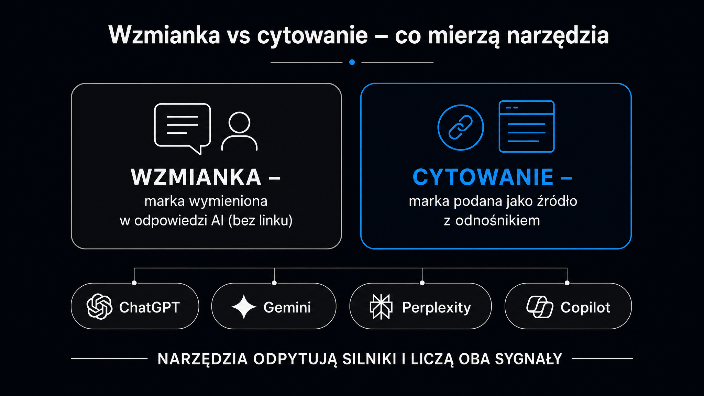

Twoja marka prawdopodobnie już teraz pojawia się w odpowiedziach ChatGPT, Gemini czy Perplexity – i prawie na pewno nie wiesz, co tam jest napisane. To nie jest abstrakcyjny scenariusz: [duże modele językowe](https://pl.wikipedia.org/wiki/Du%C5%BCy_model_j%C4%99zykowy) (LLM, z ang. *Large Language Models*) odpowiadają na dziesiątki milionów pytań zakupowych dziennie, rekomendując produkty, porównując dostawców i opisując marki własnymi słowami. Monitoring tych wzmianek to dziś tak samo podstawowy obowiązek jak śledzenie recenzji w Google Maps. Rynek narzędzi do tego celu rozwinął się błyskawicznie – od prostych skanerów po platformy klasy korporacyjnej (enterprise). Ten artykuł porządkuje tę przestrzeń i pomaga wybrać narzędzie odpowiednie do Twojej skali i budżetu.

## Wzmianka a cytowanie – różnica, która ma znaczenie

Zanim przejdziemy do narzędzi, warto uporządkować terminologię. Dwa pojęcia brzmią podobnie, ale mierzą zupełnie różne rzeczy i wymagają innych działań optymalizacyjnych.

**Wzmianka AI** (*AI Mention*) to sytuacja, gdy model wymienia nazwę Twojej marki lub produktu w odpowiedzi, ale nie zamieszcza przy tym żadnego linku. Marka pojawia się jako element narracji – np. „wśród popularnych rozwiązań B2B SaaS wymieniane są X, Y i Z" – bez odesłania do konkretnej strony. To sygnał rozpoznawalności.

**Cytowanie AI** (*AI Citation*) to zasadnicza różnica. Model opatruje twierdzenie o Twojej marce aktywnym odnośnikiem do konkretnego adresu URL, z którego pobrał informację. Cytowanie oznacza, że Twoja treść była bezpośrednim źródłem odpowiedzi AI.

Dlaczego jest to ważne przy wyborze narzędzia? Ponieważ większość tańszych platform mierzy wyłącznie wzmianki i tworzy z nich wykres „widoczności". Jeśli decydujesz się na wydatek kilkuset złotych miesięcznie na monitoring, sprawdź, czy narzędzie rozróżnia te dwie formy – i czy raportuje je osobno. **Tylko 7,2% domen internetowych potrafi jednocześnie generować cytowania w LLM-ach i w Google AI Overviews** – to dane z analizy branżowej przeprowadzonej w maju 2026 roku. Reszta albo ma jedno, albo drugie, albo żadne.

Kilka pojęć, których będziesz używać na co dzień:

- **Share of Voice (SoV, udział w dyskusji)** – jaki procent cytowań w Twojej kategorii trafia do Twojej marki w porównaniu z konkurencją; mierzony na zestawie kilkudziesięciu zapytań.
- **Citation Rate (wskaźnik cytowań)** – odsetek odpowiedzi AI na zadany zestaw zapytań, w których Twoja marka pojawia się z linkiem zwrotnym.
- **Mention Rate (wskaźnik wzmianek)** – łączna częstotliwość pojawiania się nazwy marki, bez rozróżnienia na cytowanie i wzmiankę.

## Jak działają silniki monitorujące

Technicznie nie jest to proste zadanie. [Duże modele językowe](https://pl.wikipedia.org/wiki/Du%C5%BCy_model_j%C4%99zykowy) generują odpowiedzi probabilistycznie – każde wywołanie tego samego zapytania może przynieść nieco inny wynik. **Dlatego jednorazowy audyt „co ChatGPT mówi o mojej marce" ma zerową wartość statystyczną.** Liczą się uśrednione wyniki z dziesiątek powtórzeń w czasie.

Na rynku ukształtowały się dwa podejścia do zbierania danych:

- **Wykorzystanie API** – narzędzie wysyła zapytania bezpośrednio do oficjalnych interfejsów programistycznych (OpenAI API, Anthropic API, Google Gemini API). Rozwiązanie to jest szybkie, tanie i skalowalne. Wadą jest to, że API zwraca surowy tekst – bez elementów dynamicznych, reklam ani wyników lokalnych, które widzi rzeczywisty użytkownik w przeglądarce.
- **Emulacja sesji przeglądarki** – narzędzie symuluje pełną sesję użytkownika, renderuje JavaScript i przechwytuje dokładną odpowiedź z interfejsu webowego. Jest to droższe i wolniejsze, ale daje realny obraz tego, co widzi klient. Tak działają m.in. Profound, Otterly.ai i Hall AI.

Dodatkowe wyzwanie to tzw. luka atrybucyjna. Gdy ChatGPT lub Claude odsyła użytkownika na stronę docelową, usuwa nagłówki odsyłające HTTP (*referer headers*). Twoja analityka w Google Analytics 4 rejestruje ten ruch jako bezpośredni – bez żadnej informacji o AI jako źródle. Narzędzia monitorujące rozwiązują ten problem metodami korelacyjnymi, zestawiając harmonogram zapytań próbnych z logami serwera.

<aside class="callout-fact">
  
✦

  

    
Ciekawostka

    
W środowisku Microsoft Copilot zaledwie 10% najlepiej pozycjonowanych domen gromadzi <strong>17,6 raza więcej cytowań niż pozostałe 90% witryn łącznie</strong>. Koncentracja widoczności w LLM-ach jest drastycznie wyższa niż w tradycyjnym SEO – i dlatego wejście do tej górnej dziesiątki wymaga aktywnego, ciągłego monitoringu, a nie jednorazowego audytu.

  

</aside>

## Przegląd platform – tabela porównawcza

Rynek narzędzi do monitorowania wzmianek w AI dzieli się na cztery segmenty: rozwiązania enterprise, platformy wyspecjalizowane w e-commerce i GEO, narzędzia do monitorowania mediów oraz budżetowe skanery zwinne. Poniższa tabela zbiera kluczowe parametry operacyjne głównych platform. Ceny podano w USD (stan na maj 2026 r.).

| Narzędzie | Fokus i segment | Monitorowane modele AI | Cena od / mies. | Wyróżnik techniczny |
|---|---|---|---|---|
| **Semrush AIO** | Enterprise, SoV+SEO | ChatGPT, Claude, Google AIO | $99 + bazowa subskrypcja | Baza 261 mln promptów, analiza zapytań pogłębiających (follow-up queries) |
| **Profound** | Enterprise, reputacja i bezpieczeństwo danych | ChatGPT, Claude, Google AIO, Perplexity | od $99 (enterprise – wycena indywidualna) | Citation Provenance Engine, SOC 2 Type II, emulacja sesji |
| **Hall AI** | E-commerce, agencje SEO | 8 modeli: ChatGPT, Gemini, Claude, Perplexity, Copilot, Meta AI, DeepSeek, Google AIO | Lite gratis; płatne od $199 | Śledzenie sesji crawlerów w czasie rzeczywistym, monitoring SKU |
| **Brand24 + Chatbeat** | Social listening + LLM | ChatGPT, Gemini, Claude, Perplexity, Grok, DeepSeek, Copilot, Google AIO | Zależy od pakietu Brand24 | Monitoring źródeł danych (input) i odpowiedzi AI (output), wykrywanie dezinformacji |
| **Riff Analytics** | Agencje, marki średniej wielkości | ChatGPT, Gemini, Claude, Perplexity, Grok, DeepSeek, Llama | $49 (Starter) / $199 (Pro) | Analiza luki cytowań w 5 minut, gotowe URL-e konkurencji |
| **Serpstat LLM Monitor** | Małe firmy, freelancerzy | ChatGPT, Claude, Gemini, Perplexity + ponad 100 modeli niszowych | Plan darmowy; Pro $39 | System kredytów Pay As You Go, alerty o zmianie narracji |
| **Mangools AI Search Watcher** | Użytkownicy pakietu Mangools | ChatGPT, Gemini, Claude, Grok, Llama, Mistral | W cenie pakietu ($37,70–$97,70 rocznie) | Wielokrotna weryfikacja każdego zapytania dla dokładniejszych danych |
| **Otterly.AI** | Targetowanie geograficzne | Google AIO, ChatGPT, Perplexity | Plan darmowy; płatne $29–$422 | Emulacja sesji webowej, precyzyjne kierowanie na lokalizację |
| **Allmond** | Agencje, SaaS, e-commerce | ChatGPT, Claude, Gemini, Perplexity (67 krajów) | $29 (Starter) / $199 (Pro) | Dane z realnych konwersacji, monitoring na poziomie konkretnych promptów |

## Narzędzia enterprise – kiedy mają sens

Semrush AIO i Profound operują w zupełnie innej lidze niż reszta tabeli – i nie chodzi wyłącznie o cenę. To rozwiązania przeznaczone dla marek, które muszą raportować widoczność AI zarządowi, działają w sektorach regulowanych prawnie lub zarządzają portfolio kilkudziesięciu produktów jednocześnie.

**Semrush AIO wyróżnia się dostępem do bazy 261 milionów monitorowanych promptów użytkowników** – to daje kontekst statystyczny nieosiągalny dla małych platform. Narzędzie śledzi też zapytania pogłębiające (*follow-up queries*), czyli sprawdza, czy marka utrzymuje się w odpowiedziach AI, gdy użytkownik doprecyzowuje intencję: od ogólnego „najlepsze oprogramowanie do zarządzania projektami" do konkretnego „najlepsze dla zespołu zdalnego do 10 osób". To ważne, ponieważ zniknięcie marki z wyników na etapie drugiego lub trzeciego pytania to sygnał problemu z autorytetem tematycznym.

Profound koncentruje się na innym problemie – weryfikacji źródeł. Jego silnik Citation Provenance Engine identyfikuje ze 100-procentową dokładnością, które konkretne adresy URL posłużyły modelowi jako podstawa do opisu Twojej marki. W sektorach takich jak finanse, ubezpieczenia czy ochrona zdrowia, gdzie nieprecyzyjna odpowiedź AI może naruszać przepisy, ta funkcja ma wymierną wartość prawną.

Przed wyborem platformy enterprise warto najpierw zrozumieć aktualny stan widoczności marki – [audyt widoczności marki](/geo/audyt-widocznosci-marki/) pokazuje, od czego zacząć i jakie dane są potrzebne, by uzasadnić zakup droższego narzędzia.

## Narzędzia do e-commerce – Hall AI i jego warstwa crawlerów

Hall AI wyróżnia się jedną funkcją, której nie ma żaden inny gracz w tym zestawieniu: modułem Agent Analytics, który śledzi w czasie rzeczywistym sesje botów indeksujących na stronie klienta. Narzędzie rejestruje adres IP i ciąg identyfikacyjny (User-Agent) każdego bota – GPTBot, ClaudeBot, PerplexityBot – i pozwala zobaczyć, które podstrony faktycznie odwiedzają modele AI, a które pomijają.

Dla e-commerce dochodzi moduł Conversational Commerce, który śledzi pozycje konkretnych jednostek produktowych (SKU) w odpowiedziach zakupowych chatbotów. **Narzędzie sprawdza nie tylko to, czy marka jest wymieniana, ale też który dystrybutor – Amazon, Allegro, sklep producenta – jest wskazywany jako zalecane miejsce zakupu.** To informacja bezpośrednio przekładająca się na decyzje handlowe.

Jedynym realnym mankamentem Hall AI jest przepaść cenowa między planem Lite (gratis, 25 zapytań, raporty tygodniowe) a Starter ($199/miesiąc). Dla małej agencji lub firmy B2B bez rozbudowanego katalogu produktów bariera ta jest zbyt wysoka.

## Monitoring mediów i AI jednocześnie – Brand24 z modułem Chatbeat

Brand24 rozwiązuje inny problem niż pozostałe narzędzia: bada nie tylko to, co modele AI mówią o marce (*output*), ale też jakie treści w internecie kształtują te odpowiedzi (*input*). Moduł Chatbeat wysyła testowe zapytania do chatbotów, a równolegle platforma monitoruje Reddita, fora dyskusyjne, sekcje komentarzy, blogi i media społecznościowe.

To podejście ma logiczne uzasadnienie: wątki na Reddicie, recenzje na G2 czy artykuły eksperckie na Forbesie to bezpośrednie źródła, z których Perplexity czerpie informacje przy udzielaniu odpowiedzi. Jeśli Brand24 wskazuje, że konkretny wątek na Reddicie jest cytowany przez AI, to sygnał, że warto zainwestować w budowanie obecności właśnie tam.

**Mechanizm Influential Creator Discovery identyfikuje konkretnych autorów i wątki, na które bezpośrednio powołują się modele AI.** To narzędzie do precyzyjnego docierania do liderów opinii kształtujących bazy wiedzy LLM, a nie do masowych kampanii influencer marketingowych. Zrozumienie, jak modele AI decydują o cytowaniu źródeł, jest kluczowe – szczegółowo opisuje to artykuł o tym, [jak LLM cytują źródła](/geo/jak-llm-cytuja-zrodla/).

<aside class="callout-expert">
  

  

    
Opinia eksperta

    
W projektach, które prowadzimy w ICEA, często widzimy marki zaskoczone tym, że ich flagowy produkt jest opisywany przez ChatGPT z błędną ceną lub przestarzałą specyfikacją. Powód jest prosty: model nauczył się tego z artykułu sprzed dwóch lat, który wciąż indeksuje. Żadne narzędzie monitorujące tego nie naprawi – ale każde pozwoli Ci ten błąd wykryć. <strong>Pierwszym krokiem po wdrożeniu monitoringu nie jest optymalizacja widoczności, ale audyt błędów merytorycznych: co modele AI mówią o Twojej marce nieprawdziwego i skąd to pochodzi.</strong>

    
Tomasz Czechowski · Head of SEO, ICEA

  

</aside>

## Budżetowe narzędzia zwinne – kiedy wystarczą

Nie każda firma potrzebuje platformy za $500 miesięcznie. Serpstat LLM Brand Monitor, Mangools AI Search Watcher, Allmond i Otterly.AI pokrywają podstawowe potrzeby w zakresie monitoringu za ułamek kosztu rozwiązań klasy enterprise.

Kilka wskazówek, jak dokonać wyboru między nimi:

- **Serpstat** – jeśli zależy Ci na szerokim pokryciu (ponad 100 modeli, w tym niszowe), elastyczności budżetu (model Pay As You Go) i błyskawicznym wdrożeniu. Plan Pro za $39 to najtańszy pełnopłatny monitoring na tym rynku.
- **Mangools AI Search Watcher** – jeśli już używasz pakietu Mangools do SEO; narzędzie jest dodawane bezpłatnie. Unikalna funkcja wielokrotnej weryfikacji każdego zapytania eliminuje błędy wynikające z probabilistycznego charakteru LLM i daje statystycznie stabilne wyniki.
- **Allmond** – jeśli obsługujesz klientów w wielu krajach; platforma monitoruje 67 rynków geograficznych, raportując różnice w tym, jak marka jest opisywana w poszczególnych regionach.
- **Otterly.AI** – jeśli priorytetem są Google AI Overviews i kierowanie na lokalizację; narzędzie emuluje pełną sesję przeglądarki, więc wynik jest bliski temu, co widzi użytkownik w konkretnym mieście.

**Wspólne ograniczenie wszystkich budżetowych narzędzi to brak technicznej analizy struktury kodu i danych schema.org.** Powiedzą Ci, że Twoja marka nie jest cytowana, ale nie wskażą, dlaczego konkretna podstrona jest pomijana przez boty AI.

Zanim sięgniesz po płatną platformę, przetestuj punkt startowy: darmowe narzędzie [Widoczność marki w AI](/narzedzia/brand-check/) odpyta cztery silniki AI o Twoją markę i pokaże, jak jest ona opisywana na tle kategorii – bez rejestracji, w minutę. To wystarczy, żeby ocenić skalę problemu i zdecydować, który pakiet narzędzi jest uzasadniony.

## Jak wdrożyć monitoring krok po kroku

Samo uruchomienie narzędzia to nie koniec procesu – to jego początek. Wyniki mają sens tylko wtedy, gdy masz stały zestaw zapytań próbnych i metodologię ich oceny.

Trzy kategorie zapytań, które warto zdefiniować na start:

- **Zapytania kategoryczne** – ogólne pytania branżowe, w których marka może się pojawić jako jedna z rekomendacji (np. „najlepsze oprogramowanie do zarządzania projektami dla e-commerce").
- **Zapytania porównawcze** – bezpośrednie zestawienia z konkurentami (np. „[Twoja marka] vs [konkurent] – co wybrać?"); tu najczęściej pojawiają się błędy merytoryczne.
- **Zapytania brandowe** – pytania wprost o markę lub produkt (np. „co to jest [Twoja marka]?", „ile kosztuje [produkt X]?"); bazowy test tego, co modele wiedzą.

Uruchamiaj każdy prompt minimum dwa razy przy jednorazowym audycie, a w monitoringu ciągłym – raz w tygodniu na tym samym zestawie. Wyniki zapisuj z datą, żebyś po 6 tygodniach mógł ocenić trend. Pełny kontekst strategiczny, w jakim monitoring wzmianek wpisuje się w GEO, opisuje artykuł o [zwrocie z inwestycji w GEO](/geo/roi-z-geo/) – z metodologią mierzenia efektów w czasie.

Jeśli monitoring wykaże niską widoczność, następnym krokiem jest zrozumienie, skąd model czerpie informacje o Twojej kategorii. Punkt wyjścia to [przewodnik GEO](/geo/przewodnik/) – pełna mapa dyscypliny z sześciomiesięcznym planem wdrożenia.
