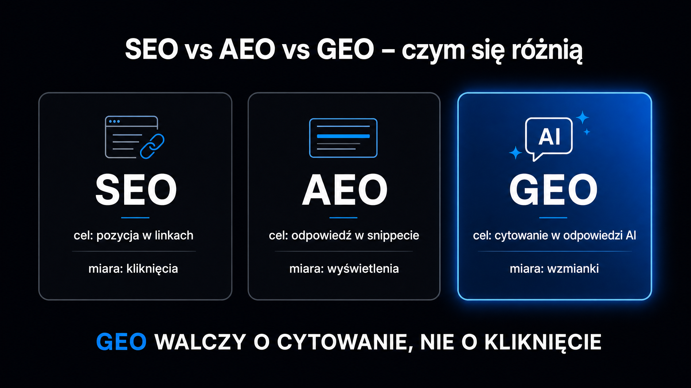

GEO, czyli Generative Engine Optimization (optymalizacja pod generatywne silniki wyszukiwania), to dyscyplina, która mierzy i poprawia obecność Twojej marki w odpowiedziach ChatGPT, Perplexity, Google AI Overviews i podobnych narzędzi. To nie jest „SEO dla AI" – to osobna logika, odrębne metryki i inne taktyki. Badanie [Aggarwal et al. (KDD 2024)](https://arxiv.org/abs/2311.09735) z Princeton University udokumentowało po raz pierwszy, że konkretne elementy treści – statystyki, cytowania ekspertów, autorytatywny ton – podnoszą widoczność w LLM o 30–115%, podczas gdy klasyczne zabiegi SEO nie przynoszą żadnego efektu albo wręcz szkodzą. Jeśli Twoja marka dziś nie pojawia się w odpowiedziach AI, ten przewodnik pokazuje, dlaczego tak jest i co z tym zrobić.

## Czym GEO różni się od SEO i AEO

Przez dwie dekady optymalizacja pod wyszukiwarki oznaczała jedno: walkę o pozycję na liście niebieskich linków. Wpisujesz frazę, Google generuje ranking, Ty optymalizujesz stronę, żeby wspinać się wyżej. AEO (Answer Engine Optimization) poszło o krok dalej – chodziło o zajęcie tzw. pozycji zero, czyli bezpośredniej odpowiedzi nad wynikami.

GEO przenosi grę na inny poziom. Nie chodzi tu o zajęcie pozycji w rankingu, ale o to, żeby Twoja treść – Twoje dane, definicje, cytowania – znalazła się wewnątrz syntetyzowanej odpowiedzi, którą model językowy generuje w czasie rzeczywistym. Użytkownik nie widzi listy linków. Widzi jeden spójny tekst, który sztuczna inteligencja skleiła z kilkunastu źródeł.

Trzy dyscypliny porządkuje poniższa tabela – warto traktować ją jako punkt wyjścia, a nie sztywną granicę:

| Czynnik | Tradycyjne SEO | AEO | GEO |
|---|---|---|---|
| **Główny cel** | Kliknięcie z listy wyników | Odpowiedź na pytanie (pozycja zero) | Cytowanie w syntezie AI |
| **Typ zapytania** | Frazy 2–5 słów | Pytania głosowe i tekstowe | Konwersacyjne, złożone (20+ słów) |
| **Co liczy się w treści** | Strona jako całość, słowa kluczowe | Bloki Q&A, ustrukturyzowana odpowiedź | Gęste faktograficznie fragmenty do ekstrakcji |
| **Jak mierzyć sukces** | Pozycja SERP, ruch organiczny | Wyświetlenie bezpośredniej odpowiedzi (direct answer) | Citation Rate, Share of Voice |
| **Rola backlinków** | Kluczowa | Średnia | Niska – liczy się wzmianka, nie link |

**Gartner prognozuje, że do 2026 roku wolumen zapytań w tradycyjnych wyszukiwarkach spadnie o 25% na rzecz narzędzi konwersacyjnych.** Z kolei dane Wall Street Journal z połowy 2025 roku pokazują, że już 5,6% wszystkich desktopowych wyszukiwań w USA odbywa się za pośrednictwem LLM (Large Language Model, czyli dużego modelu językowego) jako podstawowego narzędzia. To nie jest odległa przyszłość – to aktualna zmiana, którą widać już w analityce.

## Jak LLM-y pobierają i cytują treść

Zanim zaczniesz optymalizować, musisz zrozumieć mechanizm. Istnieją dwa główne sposoby, dzięki którym model może „dowiedzieć się" czegoś o Twojej marce.

Pierwszy to [generowanie wspierane wyszukiwaniem](https://pl.wikipedia.org/wiki/Retrieval-augmented_generation) (RAG – Retrieval-Augmented Generation). Silniki takie jak Perplexity AI czy Google AI Overviews w momencie zapytania dynamicznie przeczesują internet, pobierają fragmenty stron i na ich podstawie generują odpowiedź. Twoja strona musi być technicznie dostępna dla botów AI i zawierać treść łatwą do pobrania oraz wyodrębnienia.

Drugi mechanizm to dane treningowe. ChatGPT w wariancie offline i Claude opierają wiedzę na tym, co model zobaczył przed datą odcięcia (cutoff date) – i co uznał za wiarygodne źródło. W tym przypadku obecność w odpowiedziach zależy od tego, czy Twoja marka była cytowana, linkowana i wspominana w treściach, które trafiły do zbioru treningowego.

W praktyce obie ścieżki wymagają tego samego fundamentu: treści gęstej od danych, ustrukturyzowanej i wiarygodnej.

### Jak model decyduje, co zacytować

Silniki RAG nie czytają strony tak jak człowiek. Dzielą tekst na fragmenty (ang. *chunks*) o długości 200–400 słów, zamieniają je na wektory zanurzeń (ang. *embeddings*) i wyszukują te fragmenty, które semantycznie najlepiej pasują do zapytania. Oznacza to, że **nie wystarczy mieć „dobrego artykułu" – każdy fragment musi samodzielnie odpowiadać na jedno konkretne pytanie**.

Trzy właściwości fragmentu zwiększające szansę na wybranie przez silnik to:

- **Samodzielność** – fragment zawiera definicję, tezę lub dane bez konieczności czytania reszty artykułu.
- **Gęstość faktograficzna** – liczby, daty, nazwy własne, cytowania źródeł; coś, co model może powtórzyć jako „fakt".
- **Spójność z nagłówkiem** – nagłówek sformułowany jako pytanie, a bezpośrednio pod nim odpowiedź (zasada BLUF, czyli kluczowa informacja na początku).

### Boty AI i dostęp techniczny

Aby w ogóle brać udział w grze, musisz sprawdzić, czy boty AI mają możliwość przeczesywania Twojej strony. `GPTBot`, `ClaudeBot`, `PerplexityBot` – każdy z nich weryfikuje plik `robots.txt` przed wejściem na witrynę. Błędy w konfiguracji zapór sieciowych (np. Cloudflare) często blokują część tych botów bez wiedzy właściciela strony.

Sprawdź stan swojej witryny w [Dostęp botów AI](/narzedzia/ai-bots-check/) – narzędzie weryfikuje, które boty AI mają dostęp do Twojej domeny i czy plik `robots.txt` nie blokuje ich przypadkowo.

<aside class="callout-fact">
  
✦

  

    
Ciekawostka

    
Badanie Princeton (Aggarwal et al., KDD 2024) przetestowało 9 taktyk optymalizacji treści na benchmarku GEO-bench złożonym z 10 000 zapytań z 25 dziedzin. Tylko 5 z 9 taktyk przyniosło statystycznie istotny wzrost widoczności. Keyword stuffing – standard SEO sprzed dekady – nie tylko nie pomagał, ale aktywnie obniżał wskaźnik cytowalności. <strong>Strony o niskim autorytecie domeny, które zastosowały cytowania i statystyki, zwiększyły swoją widoczność w LLM o 115,1%.</strong>

  

</aside>

## Co naprawdę działa – wyniki badania Princeton KDD 2024

Badanie Aggarwala i współautorów z Princeton University, Georgia Tech, Allen Institute for AI oraz IIT Delhi to pierwszy duży akademicki benchmark GEO. W jego ramach stworzono GEO-bench – zestaw 10 000 zapytań z 25 domen, testowanych na systemach RAG symulujących Bing Chat i Perplexity AI.

Do pomiaru widoczności wprowadzono dwie metryki. Pierwsza, PAWC (Position-Adjusted Word Count), zlicza słowa z Twojej strony, które znalazły się w syntezie, nadając im wagę w zależności od ich pozycji w tekście – im wcześniej, tym wyżej. Druga, SI (Subjective Impression), ocenia jakościowo wpływ źródła na spójność i unikalność odpowiedzi.

Wyniki testowania taktyk są jednoznaczne:

- **Cytowania ekspertów** – wzrost PAWC o 30–41%; gotowe autorytatywne moduły językowe, które model może bezpiecznie powtórzyć.
- **Statystyki i dane liczbowe** – wzrost o 30–41%; liczby są łatwiejsze do ekstrakcji przez parsery wektorowe niż opisy narracyjne.
- **Linkowanie do źródeł zewnętrznych** – wzrost o 30–40%; modele są trenowane, żeby treści z przypisami bibliograficznymi traktować jako bardziej wiarygodne.
- **Optymalizacja płynności tekstu** – wzrost o 15–30%; brak błędów językowych zmniejsza „opór przetwarzania" dla modelu.
- **Autorytatywny, encyklopedyczny ton** – wzrost o 10–20%; styl zbliżony do Wikipedii działa jako sygnał wiarygodności.

To nie jest teoria, lecz empirycznie zmierzone efekty na konkretnym benchmarku. Wynik ten jest szczególnie ważny dla mniejszych graczy: witryny z pozycji 5–10 w Google, które zastosowały statystyki i cytowania, zwiększały swoją widoczność w LLM o 115,1% – mocniej niż domeny z pozycji 1–3, które tego nie zrobiły.

To swoisty paradoks: **słabsza pozycja SEO nie wyklucza silnej pozycji GEO**, pod warunkiem że treść jest gęsta faktograficznie i dobrze ustrukturyzowana.

## Trzy filary techniczne GEO

Optymalizacja pod LLM-y zaczyna się od warstwy technicznej. Bez solidnego fundamentu nawet najlepsze treści nie zostaną zacytowane.

### Dostępność dla botów AI

Modele AI nie renderują kodu JavaScript w taki sam sposób jak przeglądarka internetowa. Strony oparte wyłącznie na Client-Side Rendering (CSR) – gdzie tabele porównawcze i cenniki ładują się dynamicznie po wczytaniu szkieletu strony – są dla botów AI nieczytelne. Wymaganym standardem jest Server-Side Rendering (SSR) lub generowanie statyczne (SSG).

Plik `llms.txt` w katalogu głównym witryny to kolejny obowiązkowy element. Jest to prosty plik tekstowy w formacie Markdown, który modele AI mogą przeczytać, aby zrozumieć strukturę Twojej strony i główne fakty o ofercie – bez konieczności indeksowania setek podstron. Standard ten wzorowany jest na `robots.txt`, ale zamiast mówić, czego nie indeksować, wskazuje to, co jest najważniejsze.

Więcej o implementacji znajdziesz w artykule o [llms.txt](/geo/llms-txt/) – wraz z przykładową strukturą pliku dla serwisów B2B.

### Schema.org i dane strukturalne

Format JSON-LD (schemat danych strukturalnych) bezpośrednio wpływa na to, jak model interpretuje obiekty (encje) na Twojej stronie. Typy `Organization`, `Product`, `FAQPage`, `HowTo` – każdy z nich pozwala modelowi precyzyjnie sklasyfikować, co Twoja strona opisuje i jaką funkcję pełni.

Szczegółowy przewodnik po implementacji obejmuje artykuł o [schema.org i danych strukturalnych](/geo/schema-org-dane-strukturalne/) – z przykładami JSON-LD dla różnych typów stron.

### Spójność danych w sieci

Badania (takie jak framework Google AGREE zaprezentowany na NAACL 2024) skupiają się na uczeniu modeli językowych precyzyjnego cytowania i ugruntowywania swoich odpowiedzi w wiarygodnych źródłach, aby unikać halucynacji. W systemach RAG modele aktywnie ewaluują wiarygodność pobranych danych. Jeśli Twoja strona podaje jedną cenę, a partnerski blog inną – model uzna informację za niejednoznaczną (sprzeczną) i może ją całkowicie pominąć w syntezie, aby nie ryzykować błędu.

**Brak spójności danych w sieci to jeden z najsilniejszych negatywnych sygnałów w GEO.** Stary cennik na portalu afiliacyjnym czy rozbieżne dane w artykułach gościnnych obniżają szansę na cytowanie.

## Taktyki tworzenia treści podnoszące wskaźnik cytowań

Kwestie techniczne to zaledwie fundament. LLM-y cytują konkretne zdania i fragmenty – i właśnie tutaj kryje się największy potencjał optymalizacyjny.

### Front-loading – kluczowe informacje na początku

Front-loading (wczesne sygnalizowanie kluczowych informacji) to jeden z najważniejszych wzorców cytowalności. **Pierwsze 100–200 słów każdej sekcji to strefa, z której sztuczna inteligencja najczęściej wyciąga cytaty.** Pisz jak dziennikarz: najpierw teza, potem rozwinięcie. Nie buduj napięcia przed puentą – zacznij od niej.

W praktyce: każdy nagłówek H2 i H3 powinien brzmieć jak pytanie, na które odpowiadasz bezpośrednio pod nim. Silniki RAG rozszczepiają zapytanie użytkownika na wiele podzapytań (ang. *query fan-out*) i szukają fragmentów odpowiadających każdemu z nich osobno.

Dokładny opis mechanizmu rozszczepienia zapytania znajdziesz w artykule o [query fan-out](/geo/query-fan-out/) – z przykładem, jak jedno zapytanie w sektorze B2B rozkłada się na 20+ podzapytań.

### Struktury bloków semantycznych

Artykuł pisany jako jeden długi tekst ciągły jest trudny do pocięcia na fragmenty. LLM-y preferują treść podzieloną na samodzielne bloki po 200–400 słów, gdzie każdy blok odpowiada na jedno konkretne pytanie.

Dobre wzorce strukturyzacji:

- **Tabele porównawcze** – szczególnie przydatne dla cenników, zestawień narzędzi i porównań produktów; model może potraktować wiersz tabeli jako samodzielną odpowiedź.
- **Listy z definicjami** – format `**Termin** – opis` jest łatwy do wyodrębnienia; model widzi naturalną parę pojęcie-wyjaśnienie.
- **Bloki pytanie-odpowiedź** – nagłówek w formie pytania + bezpośrednia odpowiedź już w pierwszym zdaniu pod nagłówkiem.

### Autorytet poprzez cytowania

Modele AI są trenowane, aby traktować treści z przypisami do zewnętrznych źródeł jako bardziej wiarygodne. To nie jest tylko sugestia – to empirycznie zmierzony wzrost cytowalności rzędu 30–40% (Princeton KDD 2024).

W praktyce oznacza to, że każda liczba powinna mieć swoje źródło. Każde twierdzenie, które mogłoby zostać zakwestionowane, powinno mieć oparcie w postaci nazwy badania lub raportu. Nie musisz linkować do każdego z nich – wystarczy wymienić źródło, podając jego nazwę i datę.

<aside class="callout-expert">
  

  

    
Opinia eksperta

    
W audytach GEO, które przeprowadzam w ICEA, najczęstszym problemem są strony o doskonałym profilu SEO – z silnymi linkami i wysokimi pozycjami – ale z treścią pisaną pod bota Google'a sprzed 2020 roku: pełną ogólnikowych opisów, bez liczb, cytowań i z opiniami niepopartymi żadnymi faktami. Dla LLM taka strona jest bezużyteczna jako źródło wiedzy. <strong>Pierwsza rekomendacja po audycie jest zawsze taka sama: zanim przepiszesz stronę od zera, do każdej sekcji H2 dodaj trzy liczby i jedno zdanie powołujące się na badanie. Efekt na wskaźniku Citation Rate widać zazwyczaj w ciągu 3–4 tygodni.</strong>

    
Piotr Wicenciak · SEO Operations Manager, ICEA

  

</aside>

## Jak mierzyć widoczność w AI – metryki GEO

Klasyczne narzędzia SEO – takie jak Google Search Console, Ahrefs czy Semrush – nie mierzą widoczności w LLM. Według badań AirOps tradycyjne platformy pomijają nawet 37% zapytań o charakterze konwersacyjnym. Do GEO potrzebne są inne dane.

Trzy główne metryki stosowane w ICEA:

- **Citation Rate (wskaźnik cytowań)** – procent zapytań z zestawu testowego, w których odpowiedź AI zawiera Twoją markę lub URL; jest to podstawowa miara widoczności.
- **Share of Voice (SoV, udział głosu)** – jaki procent wszystkich cytowań w danej niszy trafia do Twojej marki w stosunku do konkurencji; mierzy się go na konkretnym zestawie 20–50 zapytań.
- **Mention Rate (wskaźnik wzmianek)** – ile razy marka pojawia się z nazwy w odpowiedziach AI (nawet bez linka); metryka ważna dla budowania rozpoznawalności w LLM.

Jak mierzyć to w praktyce? Wybierz 20–50 pytań, które Twoi klienci wpisują w ChatGPT lub Perplexity. Wprowadzaj te zapytania regularnie (np. co 2 tygodnie) w czystym środowisku przeglądarki (w trybie incognito, bez personalizacji). Notuj, ile odpowiedzi zawiera nazwę Twojej marki. To będzie Twój punkt startowy.

Darmowe narzędzie [Widoczność marki w AI](/narzedzia/brand-check/) samodzielnie odpyta cztery silniki AI o Twoją markę i pokaże, jak jesteś postrzegany na tle kategorii – bez konieczności ręcznego wpisywania pytań.

### Narzędzia zewnętrzne do monitoringu

Wyspecjalizowane platformy potrafią automatyzować ten proces na dużą skalę. Profound monitoruje modele Claude, GPT-4 i Bing Search, kładąc nacisk na bezpieczeństwo danych klasy enterprise. Evertune testuje tysiące wariantów zapytań i analizuje różnice geograficzne. Writesonic łączy monitoring z gotowymi rekomendacjami poprawek on-page.

Przy wyborze platformy zwróć uwagę na jedno kluczowe kryterium: czy narzędzie odróżnia cytowania (aktywny link do Twojej strony) od wzmianek (nazwa marki bez linka)? To fundamentalna różnica, niezbędna do prawidłowej interpretacji wyników.

## Strategia wdrożenia GEO – horyzont 6 miesięcy

GEO nie jest jednorazową akcją. To ciągła dyscyplina, podobna do klasycznego SEO – jednak z innym zestawem priorytetów i z innym cyklem aktualizacji.

### Miesiąc 1–2 – audyt i fundamenty techniczne

Zacznij od audytu gotowości: sprawdź dostęp botów AI, konfigurację pliku `robots.txt`, obecność `llms.txt` oraz poprawność kodu JSON-LD. Zidentyfikuj główne obiekty (encje) powiązane z Twoją marką – produkty, usługi i kluczowe twierdzenia, które chcesz, żeby LLM-y powtarzały.

Wdrożenie poprawek technicznych to działanie przynoszące najszybsze efekty. Jeśli `GPTBot` był dotąd blokowany, odblokowanie go przynosi rezultaty w ciągu 2–4 tygodni (tyle zazwyczaj zajmuje nowy obieg indeksowania). Pełny [audyt widoczności marki](/geo/audyt-widocznosci-marki/) – wraz z metodologią, którą stosujemy – opisuje osobny artykuł.

### Miesiąc 3–4 – optymalizacja treści

Wybierz 10–15 priorytetowych podstron – tych, które opisują główne produkty, usługi lub odpowiadają na najważniejsze pytania w Twojej niszy. Dla każdej z nich:

1. Przebuduj strukturę na bloki semantyczne po 200–400 słów, stosując nagłówki w formie pytań.
2. Dodaj statystyki (wraz z datą i źródłem) do każdej sekcji H2.
3. Wzbogać tekst o 2–3 cytowania ekspertów lub dane z badań branżowych.
4. Zweryfikuj spójność danych zawartych na stronie z informacjami o Twojej marce z innych miejsc w sieci.

### Miesiąc 5–6 – sygnały zewnętrzne i skalowanie

LLM-y znacznie chętniej cytują źródła, które są wzmiankowane przez inne zaufane portale. Wikipedia, Reddit, prasa branżowa, raporty badawcze – jeśli w kontekście danego tematu pojawia się tam Twoja marka, jest to silny sygnał dla modelu.

Na tym etapie skup się na budowaniu tzw. sąsiedztwa współcytowań (ang. *co-citation neighborhood*): zależy Ci na obecności w miejscach, z których Perplexity i Google AI Overviews chętnie czerpią wiedzę. Prowadź działania PR ukierunkowane na konkretne tematy eksperckie, a nie tylko na ogólną rozpoznawalność marki.

Harmonogram z oczekiwanymi efektami:

| Etap | Działanie | Oczekiwany efekt |
|---|---|---|
| Miesiąc 1 | Audyt techniczny, odblokowanie botów AI, `llms.txt` | Pełna indeksowalność dla botów RAG |
| Miesiąc 2 | JSON-LD dla kluczowych stron, spójność danych | Lepsza ekstrakcja informacji (encji) |
| Miesiąc 3–4 | Przepisanie 10–15 stron według standardu GEO | Pierwsze wzrosty Citation Rate (+10–20%) |
| Miesiąc 5 | Sygnały zewnętrzne, budowanie wzmianek | Cytowania w niszowych odpowiedziach AI |
| Miesiąc 6 | Dojrzałość procesu, automatyzacja pomiaru SoV | Wzrost cytowań o 75–85% w stosunku do punktu startowego |

## Często zadawane pytania o GEO

### Czy GEO zastępuje SEO?

Nie. GEO działa na innej warstwie niż SEO, a obie te dyscypliny wzajemnie się wzmacniają. Silna pozycja organiczna zwiększa prawdopodobieństwo, że Twoja strona zostanie pobrana przez silnik RAG – wysoka pozycja w Google koreluje z tym, że bot wybierze Twoją stronę spośród wielu innych. Z drugiej strony: sama wysoka pozycja SEO nie gwarantuje cytowania. Treść dobrze zoptymalizowana pod kątem GEO może generować cytowania w AI nawet ze stron znajdujących się na pozycjach 5–10 w wynikach wyszukiwania.

### Ile czasu zajmuje wdrożenie GEO?

Pierwsze efekty techniczne (odblokowanie botów, wdrożenie pliku `llms.txt`) pojawiają się w ciągu 2–4 tygodni. Pierwsze mierzalne wzrosty wskaźnika Citation Rate widać po około 6–8 tygodniach od przepisania kluczowych stron. Pełne efekty strategii (np. wzrost SoV o 40–80%) to horyzont 4–6 miesięcy systematycznej pracy.

### Jakie branże zyskują na GEO najbardziej?

Przede wszystkim B2B SaaS, usługi profesjonalne, e-commerce z porównywalnymi produktami oraz branża edukacyjna. We wszystkich tych przypadkach użytkownicy aktywnie proszą ChatGPT lub Perplexity o rekomendacje, zestawienia i rankingi – to typowe zapytania, w których Twoja marka ma szansę (lub jej brak) pojawić się w odpowiedzi.

### Czy mała firma może skutecznie wdrożyć GEO?

Tak – badanie Princeton udowadnia, że mniejsze marki z niskim autorytetem domeny, które wdrożyły statystyki i eksperckie cytowania, zyskują proporcjonalnie znacznie więcej niż liderzy rynku. **GEO to obecnie jedna z niewielu taktyk marketingowych, która realnie wyrównuje szanse między dużymi i małymi graczami.**

### Od czego zacząć, jeśli mam ograniczone zasoby?

Od trzech prostych kroków: sprawdź dostęp botów AI w pliku `robots.txt`, dodaj plik `llms.txt` i przepisz jedną stronę o największym ruchu według zasad GEO (nagłówki jako pytania, statystyki z datą i źródłem, bloki tekstu po 200–400 słów). Zmierz swój wskaźnik Citation Rate przed optymalizacją i po niej. To w zupełności wystarczy, aby zobaczyć pierwsze efekty i uzasadnić biznesowo kolejne kroki.
