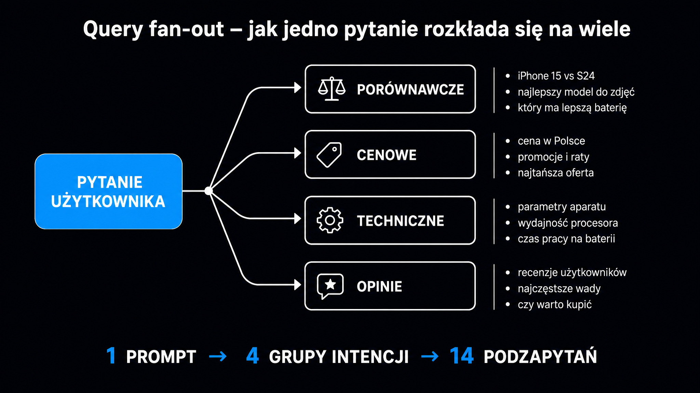

Klasyczne SEO przyzwyczaiło nas do prostego modelu: użytkownik wpisuje frazę, wyszukiwarka dopasowuje wyniki, a my optymalizujemy pod to treść. **Query fan-out (rozszczepienie zapytania) wywraca ten schemat do góry nogami.** Pomiędzy pytaniem a odpowiedzią pojawia się nowa warstwa. Rozbija ona jeden prompt na dziesiątki szczegółowych podzapytań i dopiero one trafiają do indeksu. **Jeśli Twoja strona pasuje do oryginalnej frazy, ale omija 30 wygenerowanych podzapytań, w odpowiedzi AI po prostu Cię nie ma.**

## Czym jest query fan-out?

Query fan-out (po polsku: rozszczepienie zapytania) to proces, w którym model językowy automatycznie rozbija pojedyncze pytanie użytkownika na wiele konkretnych podzapytań. Każde z nich trafia osobno do silnika pobierającego dane (klasycznego indeksu Google). Ten zwraca pasujące fragmenty. Na końcu model łączy wszystkie wycinki w jedną spójną odpowiedź.

Spójrz na praktyczny przykład – ktoś zadaje pytanie w Google AI Mode.

> *"Jaki CRM wybrać dla 5-osobowego zespołu sprzedaży B2B SaaS?"*

Model wcale nie szuka stron z tą dokładną frazą. Zamiast tego generuje 20–30 podzapytań w stylu *"najlepsze CRM-y dla małych zespołów"*, *"HubSpot vs Pipedrive cena"*, *"integracje CRM ze Slackiem"*, *"koszt CRM dla startupu"*. Każde z nich otrzymuje własną listę wyników. **Twoja strona musi pasować przynajmniej do kilku z nich, żeby algorytm uwzględnił ją w finalnej odpowiedzi.**

## Cztery etapy mechanizmu

Cały proces rozkłada się w ułamkach sekund na cztery wyraźne fazy. Każda z nich niesie konkretne implikacje dla struktury Twojego contentu.

| Etap | Co się dzieje | Wpływ na content |
|---|---|---|
| 1. Zrozumienie intencji | Model interpretuje, czego użytkownik naprawdę chce – informacja, porównanie, decyzja zakupowa | Tytuły i wstępy muszą jasno sygnalizować typ treści |
| 2. Generacja podzapytań | Model tworzy 20–40 wariantów, synonimów, podpytań uzupełniających i porównawczych | Trzeba opracować pełną grupę intencji wokół tematu |
| 3. Pobranie fragmentów | Każde podzapytanie idzie osobno do indeksu, system wyciąga konkretne fragmenty, nie całe strony | Struktura tekstu z podziałem na fragmenty 3-5 zdań, unikanie ścian tekstu |
| 4. Synteza i cytowanie | Model łączy fragmenty w odpowiedź, lista źródeł obok | Liczy się fragmentaryczna wartość, nie pozycja strony w rankingu jako całości |

W praktyce Twój blog może zajmować 50. miejsce w klasycznym Google na frazę główną. Jeśli jednak zawiera jeden mocny fragment odpowiadający na podzapytanie *"koszty napraw turbosprężarki Ford"*, to właśnie on trafi do odpowiedzi AI Mode. **Optymalizacja przesuwa się z poziomu całej domeny na poziom pojedynczego akapitu.**

## Konkretny przykład rozkładu

Weźmy pozornie proste pytanie: *"Czy warto kupować używanego Forda Mondeo z silnikiem Diesla po 2015?"*. Model błyskawicznie rozbija je na kilkadziesiąt podzapytań. Należą do nich między innymi –

- najczęstsze usterki Forda Mondeo Diesel po 2015
- żywotność silnika TDCi 2.0 Ford
- problemy z DPF Mondeo
- koszty serwisu Mondeo Diesel po 200 tys. km
- opinie użytkowników Forda Mondeo 2015–2018
- ranking używanych sedanów Diesel 2026
- alternatywy dla Mondeo Diesel
- przebieg, powyżej którego nie należy kupować Mondeo
- normy Euro 6 Mondeo wady
- skrzynia automatyczna PowerShift problemy
- zużycie paliwa Mondeo TDCi w mieście
- ceny używanych Mondeo 2015–2018 w Polsce

Do tego dochodzi kolejne 10–15 wariantów. Strona walcząca o cytowanie wcale nie musi zajmować pierwszego miejsca na żadne z tych podzapytań. **Wystarczy, że dostarczy kilka fragmentów trafiających do top 5 wyników w 5–8 z nich, a AI uzna ją za wartościowe źródło i prawdopodobnie zacytuje.**

## Co to znaczy dla SEO i GEO?

Z tego mechanizmu wynikają trzy fundamentalne zmiany w sposobie projektowania treści –

- **Pokrycie tematyczne zamiast jednej frazy** – dla każdego głównego zapytania komercyjnego opracuj mapę 20–40 podzapytań, na które sztuczna inteligencja prawdopodobnie rozszczepi zapytanie, i upewnij się, że na każde z nich masz przygotowany konkretny fragment z odpowiedzią
- **Fragmentaryczna wartość zamiast rankingu strony** – twoja ogólna pozycja w wynikach wyszukiwania ma drugorzędne znaczenie, bo liczy się wyłącznie to, czy konkretny akapit odpowiada na konkretne podzapytanie, najlepiej w pierwszych 30% tekstu
- **Pokrycie tematyczne ważniejsze od linków** – domena z 30 artykułami w jednej niszy będzie cytowana częściej niż domena z 3 artykułami i 200 backlinkami, ponieważ AI ufa źródłom, które „wiedzą wszystko" o danym temacie

Badania twardo potwierdzają tę trzecią zmianę. Kevin Indig przeanalizował 1,2 mln cytowań ChatGPT i wykazał, że [w kategorii porównań produktów top 10 domen zabiera 46% wszystkich cytowań](https://www.kevin-indig.com/). **Reszta domen walczy wyłącznie o rynkowe resztki.**

> **Princeton/KDD 2024 (Aggarwal et al.):** dodanie cytowań źródeł podnosi widoczność w LLM o 30–40%. Keyword stuffing obniża ją o 10% – to akademicka odwrotność klasycznego SEO.

<aside class="callout-fact">
  
✦

  

    
Ciekawostka

    
Query fan-out nie pojawił się dopiero z AI Mode. Mechanizm rozszczepiania zapytania na podpytania był testowany w Google już w MUM (2021) i BERT (2019), ale wówczas wyniki łączono w klasyczną listę 10 niebieskich linków. Dopiero zastosowanie modelu LLM jako warstwy syntezy ujawniło użytkownikowi, że <strong>silniki pobierające od dawna pracują na poziomie fragmentów, a nie stron</strong>.

  

</aside>

## Cztery taktyki optymalizacji pod kątem query fan-out

Istnieją konkretne działania, które realnie zwiększają szanse na cytowanie. Każde z nich funkcjonuje niezależnie. Możesz je wdrażać krok po kroku.

### Opracowanie mapy podzapytań przed pisaniem treści

Zanim napiszesz tekst na temat X, użyj narzędzia takiego jak `Qforia` (darmowe od iPullRank) lub własnego promptu w GPT-4: *"Wygeneruj 30 podzapytań, które Google AI Mode mógłby utworzyć na pytanie [X]"*. W ten sposób błyskawicznie otrzymasz gotowy plan nagłówków H2 i H3 dla swojego artykułu.

Każde podzapytanie musi otrzymać swój samodzielny fragment z odpowiedzią. **Nie wciskaj 30 podzapytań w jeden artykuł na siłę.** Jeśli dana grupa naturalnie pasuje do osobnego filaru (pillar page), po prostu ją wydziel.

### Wczesne sygnalizowanie kluczowej informacji

**Pierwsze 30% tekstu to strefa, w której AI najczęściej szuka cytatów.** Indig wykazał, że aż 44% wszystkich cytowań ChatGPT pochodzi właśnie z tego obszaru. W praktyce oznacza to kilka zasad –

- **Zacznij artykuł od konkretu** – umieść definicję, liczbę albo kluczowy wniosek już w pierwszych 2-3 zdaniach
- **Nie maskuj odpowiedzi historią branży** – długi, akademicki wstęp bezpowrotnie odsuwa cytowalny fragment poza strefę 30%
- **Pierwszy akapit po H1 powinien stanowić spójną całość** – model AI musi mieć możliwość wyciągnięcia go w pełnej izolacji od reszty tekstu

### Podział na fragmenty o długości 3-5 zdań

Każdy ważny fakt umieszczaj w samodzielnym akapicie z wyraźnie zarysowanym kontekstem. AI wcale nie analizuje całych stron. Zamiast tego wybiera pojedyncze wycinki tekstu o długości 3–5 zdań. **Jeśli Twój fragment mówi *"koszty napraw są wysokie"*, ale wymaga przeczytania trzech wcześniejszych akapitów do zrozumienia kontekstu, AI po prostu go zignoruje.**

### Format listy i porównań

Listy *"najlepszych X"*, porównania *"marka X vs Y"*, rankingi i sekcje FAQ to formaty wręcz optymalne pod query fan-out. Każdy element listy lub para porównawcza tworzy gotowy mini-fragment. Pasuje on idealnie pod konkretne podzapytanie. Artykuł *"10 najlepszych CRM-ów dla zespołów do 10 osób"* z 10 sekcjami po 200 słów to **10 osobnych fragmentów konkurujących o miejsce w odpowiedzi AI.**

<aside class="callout-expert">
  

  

    
Opinia eksperta

    
Najszybszy efekt w pierwszych 30 dniach po audycie daje odświeżenie trzech najsilniejszych artykułów na blogu klienta – dodanie do nich 5–8 nagłówków H3 odpowiadających na konkretne podzapytania z mapy fan-out. Nie nowy content, nie linkowanie, nie dane strukturalne (schema). Po prostu dopisanie 800–1200 słów ustrukturyzowanych i podzielonych na fragmenty. W dwóch projektach SaaS B2B zaobserwowaliśmy w ten sposób wzrost cytowań o 40–60% w ciągu 3 tygodni.

    
Tomasz Czechowski · Head of SEO, ICEA

  

</aside>

## Narzędzia do inżynierii wstecznej

Sprawdź trzy darmowe lub działające w modelu freemium narzędzia, które precyzyjnie pokazują, co AI Mode generuje na Twoje główne frazy –

- **Qforia** (iPullRank, darmowe) – narzędzie zaprojektowane wprost do inżynierii wstecznej query fan-out w Google AI Mode, gdzie wpisujesz frazę i dostajesz listę podzapytań, co stanowi najszybszą drogę do stworzenia struktury artykułu przed pisaniem
- **Google AI Mode** (jako narzędzie badawcze) – natywny interfejs świetnie sprawdza się do testowania własnych zapytań, wystarczy wpisać pytanie, kliknąć „pokaż więcej źródeł" i analizować domeny traktowane przez AI jako autorytety
- **Perplexity Pro w trybie badawczym (research)** – system pokazuje pełną listę zapytań wykonanych przez silnik wyszukiwania przed złożeniem odpowiedzi, co daje doskonały wgląd w logikę rozszczepienia w innym ekosystemie LLM

Logika rozszczepienia opiera się na technologii [osadzeń wektorowych (ang. word embeddings)](https://pl.wikipedia.org/wiki/S%C5%82owo_zanurzaj%C4%85ce) – matematycznych reprezentacji tekstu, które pozwalają modelowi mierzyć semantyczne podobieństwo między pytaniem a fragmentami w indeksie. **To dokładnie ten sam mechanizm, którego od lat używają systemy rekomendacyjne i wyszukiwarki semantyczne.**

## Co query fan-out zmienia w pracy nad treścią?

Query fan-out to nie kolejna prosta aktualizacja w stylu Panda czy Penguin. To całkowita zmiana modelu działania warstwy pobierania danych –

- **Z poziomu strony na poziom fragmentu** – modele AI cytują konkretne akapity, a nie całe adresy URL
- **Z jednej frazy na grupę podzapytań** – musisz kompleksowo pokryć cały temat, a nie tylko pojedynczą frazę kluczową
- **Z linkowania jako sygnału autorytetu na pokrycie tematyczne jako sygnał** – domena ekspercka w danej niszy wygrywa z domeną o silnym profilu linkowym, ale płytkim contencie

W praktyce oznacza to jedno. Content tworzony pod klasyczne SEO – długie wprowadzenia, jedna fraza w H1, słabe powiązania z resztą serwisu – będzie drastycznie tracił widoczność w AI Mode. **Wygrają krótsze, lepiej podzielone teksty, które wyczerpują temat i odpowiadają na każdą możliwą intencję użytkownika.**

W audycie widoczności AI w ICEA jednym z pierwszych kroków jest inżynieria wsteczna (reverse engineering) dla 30–50 priorytetowych pytań w Twojej branży. Jej wynik to precyzyjna mapa pokrycia. Pokazuje ona konkretne podzapytania, na które już udzielasz odpowiedzi, te zagospodarowane przez konkurencję oraz takie, których nie obsługuje jeszcze nikt. **Te ostatnie to białe plamy, które powinieneś zająć jako pierwszy.**

Jeśli chcesz zobaczyć, jak Twoja strona wypada pod kątem query fan-out dla zapytań Twoich klientów, przetestuj ją darmowym [Ocena cytowalności strony](/narzedzia/url-check/). Analizujemy tam strukturę fragmentów, wczesne sygnalizowanie kluczowych informacji i pokrycie tematyczne. Robimy to dokładnie według tych samych zasad, których używa silnik pobierający dane Google.
