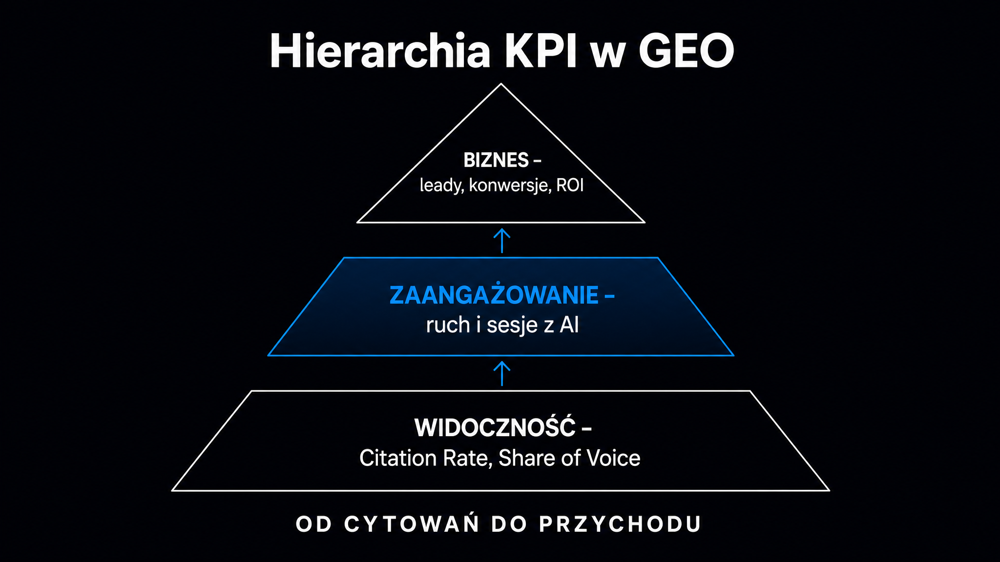

Mierzenie [zwrotu z inwestycji](https://pl.wikipedia.org/wiki/ROI) (ROI – *Return on Investment*) z działań GEO (*Generative Engine Optimization*, czyli optymalizacji dla generatywnych silników wyszukiwania) to dziś główne wyzwanie w marketingu B2B. Klasyczne narzędzia SEO – Google Search Console czy Ahrefs – są całkowicie ślepe na cytowania w modelach LLM (ang. *Large Language Models*, czyli dużych modelach językowych). Klienci widzą rosnący ruch z domen takich jak `chatgpt.com` czy `perplexity.ai`. Nie wiedzą jednak, co z tym zrobić. **Poniżej uporządkujesz hierarchię kluczowych wskaźników efektywności (KPI) i skonfigurujesz atrybucję w Google Analytics 4.** Poznasz też gotowy schemat raportu miesięcznego, który zarząd zrozumie bez tłumaczenia.

## Dlaczego stare KPI nie pasują do GEO?

Tradycyjne metryki SEO mierzą widoczność w świecie niebieskich linków. GEO operuje w zupełnie innym środowisku. Użytkownik często nie klika tu żadnego odnośnika – otrzymuje syntetyczną odpowiedź i kończy interakcję. **Mierzenie GEO wyłącznie przez pryzmat ruchu organicznego to jak ocenianie kampanii radiowej po liczbie wejść do sklepu.**

Problem jest prosty. Silniki takie jak ChatGPT, Gemini czy Perplexity cytują Twoją markę lub Twój adres URL, ale użytkownik szuka nazwy firmy w Google dopiero kilka godzin później. W klasycznym modelu atrybucji system przypisze tę transakcję do ruchu brandowego z wyników organicznych. Po rekomendacji AI nie zostanie nawet ślad. To zjawisko „atrybucji odłożonej", które badacze określają mianem *Branded Search Lift*.

Potrzebujesz zupełnie innego zestawu wskaźników – trójpoziomowego, dostosowanego do nowej logiki odkrywalności.

### Poziom 1 – wskaźniki ekspozycji w AI

Pierwsza warstwa mierzy obecność marki wewnątrz odpowiedzi generatywnych. To odpowiednik wyświetleń w kampaniach displayowych. Jest jednak znacznie trudniejszy do zebrania, bo wymaga systematycznego odpytywania modeli.

- **Citation Rate (wskaźnik cytowań)** – procent zapytań z zestawu testowego, w których odpowiedź AI zawiera adres URL lub nazwę marki ze źródłem
- **Mention Rate (wskaźnik wzmianek)** – liczba sytuacji, gdy marka pojawia się w odpowiedziach AI bez bezpośredniego linku; mierzy budowanie świadomości w modelach LLM
- **Share of Voice (SoV, udział głosu)** – procentowy udział wzmianek o Twojej marce w stosunku do wszystkich cytowanych konkurentów dla danego zestawu zapytań; to odpowiednik SoV z badań mediowych, przeniesiony na grunt AI

### Poziom 2 – wskaźniki jakości i kontekstu

Sama obecność w odpowiedzi AI to za mało. Liczy się kontekst. **Negatywna rekomendacja w ChatGPT jest gorsza niż żadna rekomendacja.**

- **User Sentiment Score (wynik analizy sentymentu)** – zagregowana ocena wydźwięku wzmianek o marce; pozytywny, neutralny lub negatywny
- **Prompt Alignment Efficiency** – miara dopasowania struktury treści strony do konwersacyjnych zapytań użytkowników; wysoki wynik oznacza, że fragmenty Twoich tekstów są ekstrahowane przez systemy RAG (*Retrieval-Augmented Generation*, generowanie wspomagane wyszukiwaniem informacji) dokładnie w odpowiedzi na zapytania z Twojej niszy
- **AI Crawler Crawling Rate** – częstotliwość wizyt botów takich jak `GPTBot`, `ClaudeBot` czy `PerplexityBot`, odczytywana z logów serwera

### Poziom 3 – wskaźniki finansowe

Tu wchodzimy w twarde liczby. Zarząd zrozumie je bez dodatkowego kontekstu.

- **AI Engagement Conversion Rate (AECR)** – współczynnik konwersji użytkowników przychodzących bezpośrednio z cytowań AI; w modelach B2B SaaS ruch z platform AI konwertuje średnio 12,8 razy lepiej niż klasyczny ruch organiczny
- **Branded Search Lift** – procentowy wzrost liczby wyszukiwań haseł brandowych w Google Search Console, skorelowany ze wzrostem widoczności w AI; mierzy pośredni wpływ cytowań na intencję zakupową
- **ROI<sub>GEO</sub>** – zwrot z inwestycji obliczony jako różnica przychodów przypisanych do AI i kosztów programu GEO, podzielona przez te koszty



## Tabela KPI – definicje i metodologia pomiaru

Przed wdrożeniem raportowania ustal ze swoim zespołem lub klientem, które metryki są priorytetowe i jak będą zbierane. **W projektach ICEA zawsze zaczynamy od skondensowanego zestawienia wskaźników.**

Każda metryka z kolumny „jak mierzyć" wymaga konkretnego narzędzia lub procesu. Nie da się ich zbierać z jednego panelu analitycznego bez dodatkowej konfiguracji.

| KPI | Definicja | Jak mierzyć |
|---|---|---|
| Citation Rate | % zapytań testowych, w których AI cytuje markę z adresem URL | Ręczne odpytywanie lub Otterly, Peec.ai, ZipTie.dev |
| Mention Rate | % zapytań, w których marka pojawia się z nazwy (bez linku) | Platformy monitoringu AI, np. Blazly GEO |
| Share of Voice (SoV) | Udział cytowań marki względem sumy cytowań konkurentów | Zestaw 20–50 zapytań, odpytywanych co 2 tygodnie |
| Sentiment Score | Wydźwięk wzmianek: pozytywny / neutralny / negatywny | Evertune, Profound.ai lub ręczna analiza próby |
| AI traffic (sesje) | Liczba sesji z domen AI w GA4 | GA4 – niestandardowa grupa kanałów `AI Search` |
| AECR | Konwersje przypisane do sesji z AI / wszystkie sesje z AI | GA4 – cel konwersji + filtr kanału AI |
| Branded Search Lift | Wzrost % zapytań brandowych w GSC po wzroście SoV | Google Search Console – zestawienie tygodniowe |
| ROI<sub>GEO</sub> | (Przychód z AI – koszt GEO) / koszt GEO × 100% | Obliczenie finansowe na podstawie GA4 + CRM |

## Jak skonfigurować atrybucję AI w Google Analytics 4?

**Domyślnie GA4 nie rozróżnia ruchu z ChatGPT od zwykłego ruchu odsyłającego.** Wejście z `chatgpt.com` ląduje w segmencie *Referral* obok każdego innego zewnętrznego linku. Tracisz przez to możliwość porównania go z tradycyjnym ruchem organicznym. Naprawienie tego wymaga trzech kroków.

### Krok 1 – niestandardowa grupa kanałów

W panelu administracyjnym GA4 przejdź do sekcji *Wyświetlanie danych* → *Grupy kanałów* i utwórz nową grupę. Nazwij kanał `AI Search`. Jako warunek przypisania ruchu ustaw wyrażenie regularne dla źródła sesji:

```
chatgpt\.com|chat\.openai\.com|gemini\.google\.com|perplexity(?:\.ai)?|copilot\.microsoft\.com|claude\.ai|deepseek\.com
```

**Kluczowa zasada kolejności: kanał `AI Search` musi znajdować się powyżej standardowego kanału `Referral` na liście reguł.** Inaczej GA4 dopasuje ruch do ogólnego ruchu odsyłającego, zanim w ogóle sprawdzi Twoją regułę.

Od maja 2026 roku GA4 samodzielnie klasyfikuje część botów konwersacyjnych jako `AI Assistant`. Automatyczne mapowanie nie obejmuje jednak wszystkich platform i nie działa wstecz. Własna grupa kanałów daje Ci pełną kontrolę nad historycznymi danymi.

### Krok 2 – wymiary niestandardowe dla głębszej analizy

Zarejestruj dwa wymiary niestandardowe o zakresie zdarzenia w zakładce *Administracja* → *Definicje niestandardowe*:

- **`ai_platform_source`** – konkretna nazwa asystenta generującego przejście (ChatGPT, Claude, Perplexity)
- **`ai_referred_content_type`** – kategoria treści, która uzyskała cytowanie (np. blog, strona produktu, porównanie)

### Krok 3 – UTM dla linków wysyłanych aktywnie

Jeśli dostarczasz linki do zewnętrznych kanałów (RSS, bazy wiedzy partnerów AI), stosuj ujednoliconą taksonomię UTM:

```
utm_source=ai_assistant&utm_medium=ai-referral&utm_campaign=geo-content
```

Spójna taksonomia pozwala porównywać dane miesiąc do miesiąca bez konieczności tłumaczenia rozbieżności.

<aside class="callout-fact">
  <div class="callout-icon">✦</div>
  <div class="callout-body">
    <div class="callout-label">Ciekawostka</div>
    <p>Ruch z platform AI wykazuje współczynnik konwersji średnio 12,8 razy wyższy niż tradycyjne wejścia z wyszukiwarek organicznych. <strong>Klienci, którzy trafili na stronę po cytowaniu przez ChatGPT lub Perplexity, są na dalszym etapie ścieżki zakupowej</strong> – przeczytali już syntezę tematu i szukają konkretnej oferty lub potwierdzenia decyzji.</p>
  </div>
</aside>

## Model obliczania ROI – od danych do liczby dla zarządu

Obliczenie ROI<sub>GEO</sub> wymaga zestawienia dwóch składowych. Musisz zderzyć pełne koszty programu po stronie inwestycji z przychodami przypisanymi do AI po stronie wpływów.

**Koszty programu GEO obejmują pięć kategorii.** Ich pominięcie zaniża całkowite nakłady i sztucznie zawyża wynik końcowy:

- **Narzędzia monitoringu** – licencje na platformy takie jak ZipTie.dev, Peec.ai, Profound.ai
- **Obsługa agencyjna** – koszt zewnętrznego partnera lub wewnętrznego działu GEO
- **Produkcja treści** – artykuły, przepisane strony produktowe, znaczniki JSON-LD
- **Wdrożenia techniczne** – praca programistyczna nad dostępnością dla botów AI, `llms.txt`, dane strukturalne (Schema.org)
- **Zasoby wewnętrzne** – czas pracy zespołu marketingu poświęcony na program

Po stronie przychodów modele B2B najczęściej stosują wzór oparty na kontaktach sprzedażowych (leadach):

*Przychód z GEO = liczba leadów z AI × średnia wartość kontraktu × współczynnik zamknięcia sprzedaży*

Dla klientów e-commerce wystarczy bezpośrednie śledzenie transakcji przypisanych do kanału `AI Search` w GA4. Dla modeli subskrypcyjnych B2B SaaS uwzględnij też wartość LTV (*lifetime value*). Jeden lead pozyskany z AI wart jest wielokrotności pierwszej transakcji.

**Dane branżowe pokazują, że pełna strategia GEO łącząca działania techniczne, treściowe i zewnętrzne daje po 3 latach ROAS (*return on ad spend*, zwrot z nakładów na kampanię) na poziomie 8–11.** To znacząco wyżej niż podstawowy content marketing (ROAS ok. 1,05). Czas osiągnięcia progu rentowności to zwykle 7–11 miesięcy, zależnie od sektora.

### Branded Search Lift – jak mierzyć efekt niewidoczny w GA4

Branded Search Lift to najważniejsza metryka dla kampanii GEO działających w środowisku bezklikowym. Użytkownik widzi rekomendację marki w ChatGPT, zamyka okno i godzinę później wpisuje nazwę firmy w Google. W GA4 sesja wygląda jak ruch organiczny obrandowany. W rzeczywistości to czysta konwersja z GEO.

Metodologia pomiaru jest prosta. Porównaj tygodniową liczbę zapytań brandowych w Google Search Console (filtr: brand + wariacje) z wynikami sprzed uruchomienia kampanii GEO. Skoreluj dynamikę jego wzrostu ze wzrostem SoV w AI. Jeśli oba wskaźniki rosną równocześnie, masz silną przesłankę do atrybucji. **W projektach obserwujemy 15–25% wzrost Branded Search Lift w ciągu pierwszych 3 miesięcy po podniesieniu Citation Rate o 20 punktów procentowych.**

Pełną metodologię audytu widoczności – wraz ze sposobem ustalenia punktu startowego przed pomiarem – opisuje [audyt widoczności marki](/geo/audyt-widocznosci-marki/).

## Struktura raportu miesięcznego GEO dla klienta

Dobry raport GEO nie jest tabelą danych. Jest dowodem obecności, komentarzem do kontekstu i rekomendacją na kolejny miesiąc. Klient, który dostaje plik z 40 metrykami bez narracji, nie zakomunikuje wartości działań zarządowi.

Zastosuj w raportach cztery kluczowe sekcje:

**Sekcja 1 – wizualne potwierdzenie obecności.** Zrzuty ekranu odpowiedzi ChatGPT i Perplexity na 3–5 kluczowych zapytań biznesowych klienta, z widoczną nazwą marki lub adresem URL. To jedyna forma dowodu, którą zarząd rozumie bez tłumaczenia. Narzędzia takie jak ZipTie.dev generują takie zrzuty automatycznie i umożliwiają śledzenie zmian w czasie.

**Sekcja 2 – analityka ruchu i konwersji.** Dane z GA4: liczba sesji z kanału `AI Search`, wskaźnik zaangażowania (czas sesji, strony na sesję) porównany do standardowego ruchu organicznego, liczba konwersji z atrybucją AI. Ta sekcja wprost przelicza ekspozycję na pieniądze.

**Sekcja 3 – monitoring reputacji semantycznej.** Analiza sentymentu wzmianek: z jakimi cechami i pojęciami modele AI kojarzą markę klienta? Jeśli ChatGPT opisuje firmę jako „drogie rozwiązanie dla dużych korporacji", a grupą docelową są MŚP – to sygnał do natychmiastowej korekty strategii treści.

**Sekcja 4 – luki tematyczne i rekomendacje.** Lista zapytań, w których modele AI rekomendują wyłącznie konkurentów, bez wzmianki o marce klienta. To gotowy backlog tematyczny na kolejny miesiąc. **Każda luka tematyczna to potencjał do przejęcia cytowań.** Wystarczy stworzyć treść lepiej odpowiadającą na dane zapytanie niż materiały konkurencji, które model aktualnie preferuje.

Jeśli chcesz zobaczyć, w jaki sposób monitorować wzmianki i zbierać dane do sekcji 3, sprawdź [narzędzia do monitoringu wzmianek](/geo/narzedzia-monitoring-wzmianek/). Znajdziesz tam omówienie dostępnych platform wraz z porównaniem ich funkcji i cen.

<aside class="callout-expert">
  <div class="callout-icon"></div>
  <div class="callout-body">
    <div class="callout-label">Opinia eksperta</div>
    <p>W raportach GEO, które przygotowuję dla klientów ICEA, największy problem to nie brak danych – to brak narracji łączącej dane z decyzjami biznesowymi. Klient dostaje wykres rosnącego Citation Rate i pyta: „i co z tego?". Dlatego każdy raport musi zawierać jedną liczbę przełożoną na przychód lub oszczędność – nawet jeśli jest to szacunek oparty na modelu. <strong>Zarząd nie zatwierdza budżetów na metryki. Zatwierdza je na ROI – i to jest jedyna liczba, którą musisz mieć gotową na spotkanie.</strong></p>
    <div class="callout-author">Mateusz Wiśniewski · Ekspert SEO/AI Search, ICEA</div>
  </div>
</aside>

## Share of Voice jako kompas strategii GEO

Share of Voice (SoV, udział głosu) to metryka, która przenosi logikę badań mediowych wprost do AI Search. Zamiast mierzyć, czy marka jest cytowana (tak/nie), SoV odpowiada na konkretne pytanie. Jaki procent całego „tortu cytowań" w danej niszy trafia do Ciebie, a jaki do konkurencji?

**Pomiar SoV wymaga ustalonego zestawu zapytań.** Minimum to 20 zapytań reprezentatywnych dla Twojej niszy i etapu ścieżki zakupowej – od świadomości („co to jest X") przez rozważanie („X vs. Y") po decyzję („najlepsza platforma do X"). Każde zapytanie odpytujesz ręcznie lub przez narzędzie monitoringu. Następnie notujesz wszystkie cytowane marki i obliczasz udział każdej z nich.

**Benchmark na start: jeśli Twój SoV w AI dla docelowego zestawu zapytań wynosi poniżej 10%, jesteś praktycznie niewidoczny dla użytkownika podejmującego decyzję w oknie chatbota.** Celem pierwszego kwartału powinno być przekroczenie 20% SoV dla zapytań ze środka i dołu lejka sprzedażowego.

Szczegółowy opis metodologii obliczania SoV i interpretacji wyników znajdziesz w artykule [Share of Voice w AI Search](/geo/share-of-voice/). Zanim zaczniesz mierzyć, sprawdź też, jak Twoja marka jest aktualnie postrzegana przez silniki AI. Darmowe narzędzie [Widoczność marki w AI](/narzedzia/brand-check/) odpyta cztery główne modele i pokaże, w jakich kontekstach pojawia się Twoja firma.

## Jak przekonać zarząd raportowaniem bez żargonu?

Zarząd zatwierdzający budżet na GEO nie potrzebuje wiedzy o mechanizmie RAG ani o różnicy między Citation Rate a Mention Rate. Potrzebuje odpowiedzi na trzy pytania. Ile wydajemy, ile zarabiamy i kiedy wrócimy z zyskiem.

Zastosuj trzy zasady komunikacji wyników GEO do zarządu:

- **Jeden numer na slajd** – zamiast tabeli z ośmioma metrykami, wstaw jedną główną liczbę (np. „+180% sesji z AI w Q1") i podaj kontekst porównawczy (benchmark branżowy lub wynik kwartał do kwartału)
- **Zawsze przelicz na pieniądze** – Citation Rate nie ma wartości bez przełożenia na liczbę leadów × wartość kontraktu; nawet przybliżona kalkulacja jest lepsza niż brak kalkulacji
- **Pokaż luki konkurencji** – zapytania, w których konkurent jest cytowany, a Twoja marka nie, mają natychmiastową siłę perswazji; zarząd rozumie ryzyko utraty pola bez dodatkowego tłumaczenia

Jeśli organizacja wdraża GEO w ramach szerszej strategii pozycjonowania w wyszukiwarkach AI, warto rozważyć pełny audyt zakresu i priorytetu działań. Sprawdź [zapytaj o audyt](/kontakt/?type=full-audit), żeby ustalić realny punkt startowy przed pierwszym raportem do zarządu.
