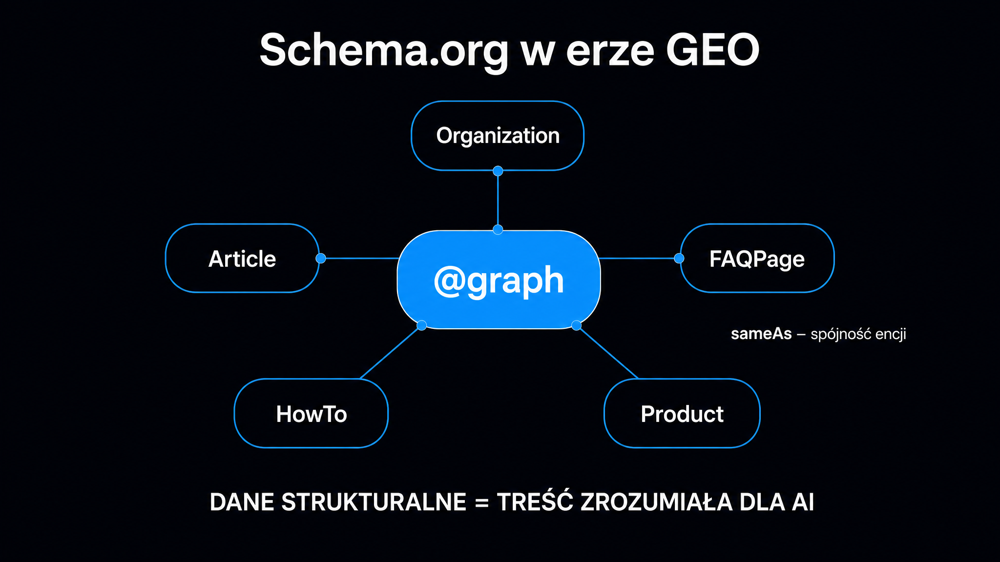

Dane strukturalne w formacie JSON-LD (JavaScript Object Notation for Linked Data) to coś więcej niż technika na gwiazdki w wynikach wyszukiwania. W erze GEO (Generative Engine Optimization, czyli optymalizacji pod generatywne silniki wyszukiwania) pomagają jednoznacznie opisać encje – marki, autorów, produkty – ale ich wpływ na cytowania przez LLM-y (Large Language Models, czyli duże modele językowe) jest pośredni. Google wprost zaznacza, że do obecności w AI Overviews i AI Mode nie trzeba dodawać żadnych specjalnych danych schema.org. Eksperyment Otterly.ai (grudzień 2025–marzec 2026) na jednej witrynie odnotował wzrost wyświetleń w AI Overviews o 1500%, ale autorzy wiążą go z poprawą klasycznego SEO, a nie z odczytywaniem schematu przez modele. Ten artykuł pokazuje, jak wdrożyć dane strukturalne krok po kroku i czego realnie się po nich spodziewać.

## Dlaczego silniki RAG potrzebują danych strukturalnych?

Systemy takie jak Google AI Overviews czy Perplexity nie czytają stron jak człowiek. Działają na zasadzie RAG (Retrieval-Augmented Generation, czyli generowania wspomaganego wyszukiwaniem) – dynamicznie pobierają fragmenty tekstu, zamieniają je w wektory liczbowe i wyszukują te, które semantycznie odpowiadają zapytaniu użytkownika.

Surowy HTML to dla parserów AI bariera. Bot musi poświęcić zasoby obliczeniowe na odróżnienie nagłówka nawigacyjnego od treści merytorycznej, reklamy od definicji, stopki od podsumowania artykułu. Schema.org w formacie JSON-LD działa jak interfejs semantyczny: eliminuje domysły i jednoznacznie etykietuje obiekty na stronie. **Nie jest to jednak bezpośredni sygnał cytowania** – większość platform AI nie odczytuje JSON-LD podczas generowania odpowiedzi, o czym niżej.

Istotna jest tu też architektura [Resource Description Framework](https://pl.wikipedia.org/wiki/Resource_Description_Framework) (RDF), na której opiera się standard schema.org. RDF definiuje dane jako trójki podmiot–predykat–obiekt, co pozwala modelom AI mapować encje na globalne identyfikatory zamiast interpretować je za każdym razem od nowa z kontekstu.

### Jak schema.org trafia do systemów RAG?

Bezpośrednia odpowiedź jest nieintuicyjna: większość platform AI (z wyjątkiem Gemini) nie odczytuje JSON-LD na żywo podczas generowania odpowiedzi. Eksperyment Otterly.ai – siedem platform testowanych przez 90 dni – wykazał, że 6 z 7 silników nie potrafi bezpośrednio zinterpretować kodu JSON-LD w oknie czatu. Jedynie Gemini ekstrahuje atrybuty schematu w czasie rzeczywistym.

Wpływ schema.org jest zatem pośredni. ChatGPT Search i Perplexity pobierają strony przez własne boty wyszukiwania (OAI-SearchBot, PerplexityBot), a Microsoft Copilot korzysta z indeksu Bing – i syntetyzują odpowiedzi na bazie stron, które trafiły do tych indeksów. **Schema.org może ułatwiać wyszukiwarkom klasyfikację strony i wspierać klasyczne SEO**, co pośrednio zwiększa szanse na trafienie do puli źródeł dla silnika AI. Autorzy eksperymentu Otterly.ai podsumowują to wprost: schema nie jest bezpośrednim sygnałem cytowań w AI.

## Typy encji i kiedy ich używać

Wybór właściwego typu schema to nie formalność – to instrukcja dla modelu, jak zaklasyfikować Twoją stronę i jakie pytania może ona obsłużyć. Poniższa tabela zbiera typy najistotniejsze z perspektywy GEO wraz z ich zastosowaniem.

Jedna zasada krytyczna przed tabelą: nie stosuj typów „na wyrost". `FAQPage` bez rzeczywistych par pytanie–odpowiedź w HTML-u lub `Product` bez ceny i dostępności łamią wytyczne Google dotyczące danych strukturalnych – oznaczanie treści niewidocznych dla czytelnika grozi utratą wyników rozszerzonych, a nawet działaniem ręcznym.

| Typ schema.org | Kiedy stosować | Najważniejsze atrybuty w GEO |
|---|---|---|
| `Organization` | Każda strona firmowa, strona główna | `name`, `url`, `sameAs`, `logo` |
| `Person` | Strony autorów, biogramy, profile ekspertów | `name`, `jobTitle`, `sameAs`, `worksFor` |
| `BlogPosting` / `Article` | Artykuły, wpisy blogowe, analizy | `headline`, `author`, `datePublished`, `about` |
| `FAQPage` | Strony z sekcją pytań i odpowiedzi (wyniki rozszerzone FAQ Google wygasił w maju 2026) | `mainEntity` z parami `Question`–`Answer` |
| `HowTo` | Przewodniki krokowe, tutoriale techniczne (wyniki rozszerzone HowTo wycofane w 2023) | `step` z `HowToStep`, `name`, `description` |
| `Product` | Karty produktów e-commerce | `name`, `offers`, `aggregateRating` |
| `WebPage` | Strony docelowe, landing page | `name`, `url`, `isPartOf`, `breadcrumb` |
| `BreadcrumbList` | Nawigacja okruszkowa | `itemListElement` z `ListItem` |

Szczególną uwagę zwróć na `BlogPosting` i `Article` – to podstawowe typy dla treści informacyjnych. Atrybut `author` z poprawnym `@id` wskazującym na encję `Person` porządkuje informację o autorze i łączy ją z resztą serwisu – pamiętaj jednak, że Google nie wymaga żadnej specjalnej schemy do obecności w AI Overviews.



## Implementacja @graph – spójna sieć encji

Największy błąd, jaki widujemy w audytach technicznych ICEA, to wdrożenie schema.org jako izolowanych bloków: jeden skrypt dla `Organization`, drugi dla `BlogPosting`, bez żadnych połączeń między nimi. Silniki AI budują zrozumienie stron na podstawie relacji – nie izolowanych tagów.

Format `@graph` pozwala zadeklarować wiele encji w jednym bloku JSON-LD i powiązać je przez unikalne identyfikatory `@id`. Każdy `@id` to globalnie unikalny URI – adres URL fragmentu strony lub encji – który model może zweryfikować i zapamiętać. Poniżej kompletny szablon dla artykułu blogowego:

```json
{
  "@context": "https://schema.org",
  "@graph": [
    {
      "@type": "Organization",
      "@id": "https://twojadomena.pl/#organization",
      "name": "Nazwa Firmy",
      "url": "https://twojadomena.pl",
      "logo": {
        "@type": "ImageObject",
        "url": "https://twojadomena.pl/assets/logo.png",
        "width": 512,
        "height": 512
      },
      "sameAs": [
        "https://www.wikidata.org/wiki/QXXXXXXX",
        "https://www.linkedin.com/company/nazwa-firmy",
        "https://pl.wikipedia.org/wiki/Nazwa_Firmy"
      ]
    },
    {
      "@type": "Person",
      "@id": "https://twojadomena.pl/autorzy/jan-kowalski/#author",
      "name": "Jan Kowalski",
      "jobTitle": "Head of SEO",
      "worksFor": {
        "@id": "https://twojadomena.pl/#organization"
      },
      "sameAs": [
        "https://www.linkedin.com/in/jan-kowalski-seo",
        "https://orcid.org/0000-0000-0000-0000"
      ]
    },
    {
      "@type": "BlogPosting",
      "@id": "https://twojadomena.pl/blog/przykladowy-artykul/#post",
      "isPartOf": {
        "@type": "WebPage",
        "@id": "https://twojadomena.pl/blog/przykladowy-artykul/"
      },
      "headline": "Tytuł artykułu – konkretny i oparty na pytaniu użytkownika",
      "description": "Opis meta 150–160 znaków z główną korzyścią dla czytelnika.",
      "datePublished": "2026-05-25T09:00:00+02:00",
      "dateModified": "2026-05-25T09:00:00+02:00",
      "author": {
        "@id": "https://twojadomena.pl/autorzy/jan-kowalski/#author"
      },
      "publisher": {
        "@id": "https://twojadomena.pl/#organization"
      },
      "about": {
        "@type": "Thing",
        "name": "Schema.org",
        "sameAs": "https://schema.org"
      },
      "inLanguage": "pl-PL"
    }
  ]
}
```

Zwróć uwagę na kilka kluczowych elementów. `worksFor` w encji `Person` wskazuje nie na URL, ale na `@id` encji `Organization` – model może wtedy połączyć autora z wydawcą jako jedną spójną sieć. `about` w `BlogPosting` opisuje temat artykułu jako encję z własnym `sameAs` – to czytelna dla maszyn informacja, o czym jest ta strona.

<aside class="callout-fact">
  <div class="callout-icon">✦</div>
  <div class="callout-body">
    <div class="callout-label">Ciekawostka</div>
    <p>Eksperyment Otterly.ai (grudzień 2025 – marzec 2026) objął 7 platform AI: ChatGPT, Google AI Overviews, Google AI Mode, Perplexity, Microsoft Copilot, Gemini i Claude. Po 90 dniach od wdrożenia pakietu schema.org na jednej witrynie – otterly.ai – funkcje SERP wzrosły o 377%, a wyświetlenia w AI Overviews o 1500%. <strong>Autorzy zastrzegają jednak, że schema nie jest bezpośrednim sygnałem cytowań w AI: w tym samym czasie widoczność rosła też konkurentom bez zmian w schemacie, a 6 z 7 platform nie odczytało JSON-LD.</strong></p>
  </div>
</aside>

## Atrybut sameAs – cyfrowy paszport encji

`sameAs` to najprawdopodobniej najbardziej niedoceniany atrybut w całym schema.org. **Dla wyszukiwarek jest wskazówką tożsamości:** mówi maszynie, że encja „Firma X" ze strony `twojadomena.pl` to ta sama encja, która jest opisana w Wikidata pod identyfikatorem `QXXXXXXX`, na Wikipedii pod nazwą „Firma X" i na LinkedIn pod adresem `/company/firma-x`.

Bez `sameAs` trudniej jednoznacznie połączyć Twoją markę z jej opisami w innych bazach – zwłaszcza gdy nazwa jest wieloznaczna lub podobna do nazw innych podmiotów.

Priorytetowe zewnętrzne bazy referencyjne dla `sameAs`:

- **Wikidata** – pierwszy wybór: otwarta, ustrukturyzowana baza encji z trwałymi identyfikatorami. Firma, osoba czy produkt może mieć tam swój wpis, o ile spełnia zasady projektu.
- **Wikipedia** – sygnał bardzo silny, ale wymaga encyklopedyczności (weryfikowalnej rozpoznawalności). Nie twórz wpisów, które mogą zostać usunięte.
- **LinkedIn** – dla encji `Person` i `Organization`; uwiarygodnia profesjonalny kontekst.
- **ORCID** – dla autorów naukowych i analityków; silny sygnał E-E-A-T w tematach wymagających wiedzy eksperckiej.
- **Crunchbase** – dla firm technologicznych i startupów.

Różne platformy AI korzystają z różnych indeksów i botów, więc to samo oznaczenie może działać na nie różnie. W eksperymencie Otterly.ai kod JSON-LD bezpośrednio odczytał tylko Gemini – na pozostałych platformach `sameAs` może pomagać co najwyżej pośrednio, przez klasyczne wyszukiwarki.

## FAQPage – porządek w parach pytanie–odpowiedź

Od 7 maja 2026 roku Google nie wyświetla wyników rozszerzonych FAQ, a 15 czerwca 2026 roku usunął ich dokumentację. `FAQPage` nie da więc rozszerzonego wyniku w Google. Eksperyment Otterly.ai nie potwierdził też, by platformy AI odpowiadały na podstawie danych z tego schematu – żadna nie odpowiedziała na podstawie informacji umieszczonej wyłącznie w tym schemacie. Jeśli stosujesz `FAQPage`, traktuj go jako uporządkowany opis widocznej sekcji FAQ, a nie dźwignię widoczności w AI Overviews.

Warunek konieczny: każda para pytanie–odpowiedź musi być obecna w widocznym HTML-u strony, nie tylko w JSON-LD. Wytyczne Google zabraniają oznaczania treści niewidocznych dla czytelnika. Jeśli JSON-LD deklaruje `FAQPage` z pięcioma pytaniami, a HTML zawiera tylko jedno, schemat jest niezgodny z treścią.

Poprawna implementacja `FAQPage` jako część `@graph`:

```json
{
  "@type": "FAQPage",
  "@id": "https://twojadomena.pl/blog/przykladowy-artykul/#faq",
  "mainEntity": [
    {
      "@type": "Question",
      "name": "Ile czasu zajmuje wdrożenie schema.org?",
      "acceptedAnswer": {
        "@type": "Answer",
        "text": "Podstawowy pakiet – Organization, BlogPosting, BreadcrumbList – można wdrożyć w jeden dzień roboczy dla istniejącej strony. Pełna implementacja z FAQPage i HowTo dla wszystkich kluczowych podstron to 2–4 tygodnie, zależnie od liczby szablonów CMS."
      }
    },
    {
      "@type": "Question",
      "name": "Czy schema.org wpływa bezpośrednio na cytowania w ChatGPT?",
      "acceptedAnswer": {
        "@type": "Answer",
        "text": "Wpływ jest co najwyżej pośredni. ChatGPT Search pobiera strony przez bota OAI-SearchBot, a w eksperymencie Otterly.ai ChatGPT nie odczytał kodu JSON-LD. Schema.org może wspierać klasyczne SEO, ale nie jest bezpośrednim sygnałem cytowania."
      }
    }
  ]
}
```

Odpowiedź w polu `text` powinna być tą samą zwięzłą odpowiedzią, którą czytelnik widzi na stronie – bez dopisków obecnych tylko w kodzie.

Jeśli chcesz sprawdzić, jak Twoja istniejąca treść wypada pod kątem cytowalności przed wdrożeniem schematu, [Ocena cytowalności strony](/narzedzia/url-check/) w kilkanaście sekund analizuje stronę pod kątem gotowości do cytowania przez silniki AI.

<aside class="callout-expert">
  <div class="callout-icon"></div>
  <div class="callout-body">
    <div class="callout-label">Opinia eksperta</div>
    <p>W audytach ICEA najczęściej spotykam dwa przeciwne błędy. Pierwszy: brak schema.org w ogóle – strona istnieje dla ludzi, ale nie dla maszyn. Drugi, paradoksalnie groźniejszy: znaczniki schema.org wdrożone przez wtyczkę, która generuje schematy niezgodne z treścią – inne daty, brakujące pola author, FAQPage bez odpowiadającego HTML-u. Google waliduje spójność i niezgodności traktuje gorzej niż brak schematu. <strong>Pierwsza zasada wdrożenia: schema.org odzwierciedla treść strony, nigdy jej nie zastępuje ani nie uzupełnia o dane niewidoczne dla użytkownika.</strong></p>
    <div class="callout-author">Michał Ziach · CTO, ICEA</div>
  </div>
</aside>

## Ścieżka wdrożenia i narzędzia diagnostyczne

Implementacja schema.org bez procesu weryfikacji prowadzi wprost do drugiego błędu opisanego powyżej. Prawidłowy protokół wdrożenia składa się z czterech etapów.

**Etap 1 – inwentaryzacja szablonów.** Zidentyfikuj wszystkie typy stron w witrynie: strona główna, strony kategorii, artykuły, strony autorów, strony produktów. Dla każdego szablonu zaplanuj odpowiedni typ schema – jeden szablon może generować dziesiątki lub setki podstron, więc błąd w szablonie mnoży się przez liczbę stron.

**Etap 2 – implementacja w jednym bloku `@graph`.** Zamiast wielu osobnych skryptów JSON-LD, twórz jeden blok `@graph` na stronę. Redukuje to ryzyko konfliktów między deklaracjami i ułatwia walidację.

**Etap 3 – walidacja w Google Rich Results Test.** Narzędzie dostępne pod adresem `search.google.com/test/rich-results` pokazuje, które typy schema zostały wykryte i czy dane zostaną zakwalifikowane do wyświetlenia jako wyniki rozszerzone. Błędy mogą zablokować wyniki rozszerzone, ale nie decydują o obecności w AI Overviews – Google nie wymaga do niej specjalnej schemy.

**Etap 4 – monitoring w Google Search Console.** Raport „Ulepszenia" w GSC agreguje błędy schema wykryte przez Googlebota na wszystkich zaindeksowanych stronach. Skonfiguruj alerty e-mail dla nowych błędów – zmiana szablonu CMS lub aktualizacja wtyczki często psuje schema.org bez żadnej widocznej zmiany w wyglądzie strony.

Narzędzia diagnostyczne warte uwagi w codziennej pracy:

- **Google Rich Results Test** – walidacja poszczególnych URL-i, bezpłatne
- **Schema Markup Validator** (`validator.schema.org`) – weryfikacja zgodności ze specyfikacją schema.org, niezależna od Google
- **Screaming Frog SEO Spider** – masowe skanowanie i ekstrakcja wszystkich bloków JSON-LD z całej witryny do CSV
- **GSC API** – automatyczny eksport błędów schema do monitoringu ciągłego

Szczegółowe zasady konfiguracji pliku `robots.txt` i zarządzania dostępem botów AI do Twojej witryny opisuje [artykuł o botach AI](/geo/boty-ai-przewodnik/) – warto zacząć od niego, zanim zainwestujesz czas w schema.org, bo blokada bota na poziomie `robots.txt` uniemożliwia indeksowanie i czyni schemat bezużytecznym.

## HowTo – struktura instrukcji krok po kroku

Google wycofał wyniki rozszerzone `HowTo` we wrześniu 2023 roku, więc ten typ nie da widocznego efektu w wynikach wyszukiwania. Nie ma też danych, by silniki AI korzystały z niego bezpośrednio – w eksperymencie Otterly.ai JSON-LD odczytał tylko Gemini. **`HowTo` może jednak pomóc uporządkować instrukcję typu „jak wdrożyć" czy „jak skonfigurować" – pod warunkiem, że te same kroki są widoczne w treści strony.**

Schemat `HowTo` wymaga listy kroków jako obiektów `HowToStep` z atrybutami `name` (nagłówek kroku), `text` (opis) i opcjonalnie `image` (zdjęcie lub ilustracja). Każdy krok powinien być samodzielny i zrozumiały bez czytania pozostałych.

```json
{
  "@type": "HowTo",
  "@id": "https://twojadomena.pl/blog/wdrozenie-schema/#howto",
  "name": "Jak wdrożyć schema.org w formacie JSON-LD",
  "description": "Krok po kroku: od inwentaryzacji szablonów do walidacji w Google Search Console.",
  "totalTime": "PT4H",
  "step": [
    {
      "@type": "HowToStep",
      "position": 1,
      "name": "Zinwentaryzuj typy stron w witrynie",
      "text": "Wypisz wszystkie unikalne szablony: strona główna, kategorie, artykuły, autorzy, produkty. Dla każdego szablonu przypisz typ schema.org z tabeli powyżej."
    },
    {
      "@type": "HowToStep",
      "position": 2,
      "name": "Zaimplementuj @graph w sekcji <head>",
      "text": "Wstaw jeden blok JSON-LD z deklaracją @graph na szablon. Połącz encje przez @id – Organization, Person i BlogPosting powinny tworzyć spójną sieć relacji."
    },
    {
      "@type": "HowToStep",
      "position": 3,
      "name": "Zwaliduj każdy szablon w Rich Results Test",
      "text": "Wklej URL do narzędzia Google Rich Results Test. Usuń wszystkie błędy krytyczne przed wdrożeniem produkcyjnym. Ostrzeżenia możesz stopniowo korygować."
    },
    {
      "@type": "HowToStep",
      "position": 4,
      "name": "Skonfiguruj monitoring w Google Search Console",
      "text": "Sprawdź raport Ulepszenia w GSC po 7–14 dniach od wdrożenia. Skonfiguruj powiadomienia e-mail dla nowych błędów schema. Monitoruj wzrost liczby stron zakwalifikowanych do Rich Results."
    }
  ]
}
```

Atrybut `totalTime` w formacie ISO 8601 (np. `PT4H` dla czterech godzin) opisuje czas wykonania instrukcji. Od wycofania wyników rozszerzonych HowTo Google nie pokazuje go w wynikach wyszukiwania.

Jeśli budujesz spójną strategię GEO wykraczającą poza dane strukturalne, kompleksowy [przewodnik GEO](/geo/przewodnik/) opisuje pełną metodykę – od audytu technicznego przez optymalizację treści po monitoring Share of Voice. Warto też zapoznać się z [artykułem o llms.txt](/geo/llms-txt/), który uzupełnia schema.org o bezpośredni kanał komunikacji z modelami AI odpytującymi Twoją domenę.

## Jak LLM-y różnie interpretują schema.org?

Nie istnieje jedna „poprawna" implementacja schema.org – różne silniki AI inaczej walidują i wykorzystują dane strukturalne. Rozumienie tych różnic pozwala ustalić priorytety wdrożenia.

Poniższa lista porządkuje zachowanie głównych platform – na podstawie eksperymentu Otterly.ai i dokumentacji botów:

- **Google Gemini** – w eksperymencie Otterly.ai jedyna platforma, która poprawnie odczytała JSON-LD bezpośrednio ze strony (AI Overviews korzysta ze schematu co najwyżej pośrednio, przez indeks Google).
- **ChatGPT Search (OAI-SearchBot)** – pobiera strony przez własnego bota wyszukiwania (GPTBot służy do zbierania danych treningowych, nie do wyszukiwania); w eksperymencie Otterly.ai nie odczytał JSON-LD bezpośrednio, więc schema.org działa tu najwyżej pośrednio.
- **Perplexity (PerplexityBot)** – indeksuje strony własnym botem; w eksperymencie Otterly.ai nie odczytał JSON-LD bezpośrednio. Aktualne `dateModified`, zgodne z widoczną datą aktualizacji, to po prostu dobra praktyka.
- **Microsoft Copilot** – korzysta z indeksu Bing; dane strukturalne mogą wspierać klasyfikację strony w Bing, ale w eksperymencie Otterly.ai Copilot nie odczytał JSON-LD bezpośrednio.
- **Claude (Claude-SearchBot)** – w trybie wyszukiwania odpytuje zewnętrzne źródła; schema.org wpływa przez jakość klasyfikacji w indeksach wejściowych. Więcej o tym, jak cytowania trafiają do odpowiedzi modeli, opisuje [artykuł o tym, jak LLM-y cytują źródła](/geo/jak-llm-cytuja-zrodla/).

**Priorytet: `Organization` z `sameAs` do Wikidata i `BlogPosting` z kompletnym `author`.** To podstawa czytelnego opisu encji dla większości witryn B2B i contentowych – i od niej warto zacząć. `FAQPage` stosuj tam, gdzie masz widoczną sekcję FAQ, ale bez oczekiwania wyników rozszerzonych czy bezpośredniego wpływu na cytowania w AI.
