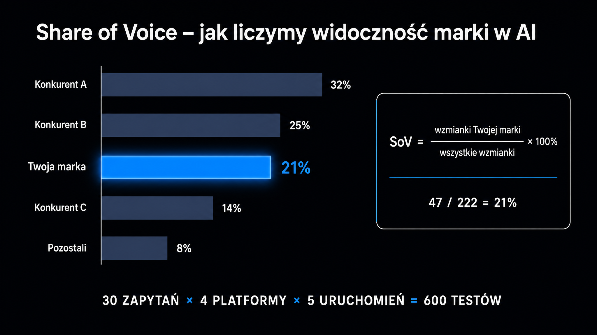

Klient pyta: *„Na której pozycji jesteśmy w ChatGPT?"*. **To pytanie nie ma odpowiedzi – i dlatego cały biznes klasycznego SEO zaczyna się rozsypywać przy próbie raportowania widoczności w AI.** Problem nie polega na tym, że nie potrafimy mierzyć. Ranking jako metryka po prostu przestał istnieć w sensie, w jakim znamy go z klasycznego Google.

## Dlaczego ranking w LLM-ach nie ma sensu?

Rand Fishkin (SparkToro) opublikował na początku 2026 roku [badanie](https://sparktoro.com/) na 600 ochotnikach, które powinno być punktem wyjścia każdej rozmowy o pomiarze widoczności w AI. Próba objęła 2961 testów, 12 zapytań × 3 platformy AI. Wynik jest jednoznaczny.

> **Mniej niż 1% powtarzalności.** Tylko mniej więcej raz na tysiąc uruchomień zobaczysz dwie identyczne listy źródeł w tej samej kolejności.

Powód jest techniczny i wynika wprost z natury LLM-ów. Każdy duży model językowy ma tak zwaną temperaturę – parametr decydujący o losowości wyboru kolejnych tokenów. **Nawet przy temperaturze ustawionej na 0 (deterministycznej w teorii) różnice w przetwarzaniu wsadowym i kolejności wczytywania fragmentów powodują, że odpowiedzi się różnią.** Dodatkowo każde zapytanie uruchamia rozszczepienie zapytania (ang. *query fan-out*) – generuje kilkadziesiąt podzapytań, których pula też jest niedeterministyczna.

W efekcie sprzedawanie klientowi raportu *„na frazę X jesteśmy na pozycji 3 w ChatGPT"* przypomina raportowanie *„dziś było średnio 14 stopni na ulicy"* – formalnie poprawne, ale praktycznie bezużyteczne. Klient po trzech miesiącach zauważy losowe skoki pozycji. Ma pełne prawo się wkurzyć.

## Trzy metryki, które naprawdę działają

Branża GEO ustaliła trzy metryki probabilistyczne – stabilne na przestrzeni dziesiątek lub setek uruchomień, a nie pojedynczych testów. **Razem dają obraz znacznie bliższy temu, co klient naprawdę chce wiedzieć: *„czy ludzie szukający w AI mnie zauważają?"*.**

| Metryka | Co liczy | Skąd się bierze | Dobry wynik (benchmark) |
|---|---|---|---|
| **Share of Voice (SoV)** | % zapytań ze wzmianką marki vs konkurencja | Pula 30 zapytań × 4 platformy × 5 uruchomień | 15–20% w rozdrobnionej niszy |
| **Citation Rate** | % zapytań, w których URL zacytowany jako źródło | Pobieranie (scraping) cytowanych URL-i | 12–18% (lider 25%+) |
| **Mention Rate** | % zapytań ze wzmianką marki w tekście (bez URL) | Analiza NLP odpowiedzi LLM | 3–5× wyższy niż Citation Rate dla ugruntowanych marek |

### Share of Voice – relacja, nie liczba absolutna

SoV to procent zapytań, w których Twoja marka pojawiła się w odpowiedzi (z URL lub bez), na tle wszystkich marek konkurencyjnych w tej puli. Bierzesz 30 reprezentatywnych pytań swoich klientów, każde uruchamiasz w 4 platformach AI po 5 razy i zliczasz wszystkie wzmianki. Twoja marka pojawiła się 47 razy, konkurent A – 78, konkurent B – 62, a długi ogon innych – 35 razy. SoV wynosi 47 / 222 = 21%.

Tę liczbę możesz swobodnie porównywać między audytami i obserwować realny trend.

### Citation Rate – mierzy techniczne SEO

Citation Rate różni się od SoV jednym szczegółem – tu liczy się tylko cytowanie z URL, a nie sama wzmianka marki w tekście. **To metryka stricte technicznego SEO – jeśli rośnie, Twoja strona jest faktycznie indeksowana i wybierana przez silnik pobierający dane.**

### Mention Rate – mierzy obecność w danych treningowych

Mention Rate to procent zapytań, w których Twoja marka pojawiła się tylko w tekście odpowiedzi, bez URL. Różnica w stosunku do Citation Rate jest znacząca i mówi o dwóch zupełnie różnych mechanizmach. Wzmianka bez linku wynika z obecności marki w danych treningowych modelu. AI po prostu „pamięta", że istniejesz, ale nie wskazuje konkretnego artykułu. **Cytat z linkiem oznacza z kolei, że konkretna strona została wczytana z indeksu w czasie odpowiedzi.**

Britney Muller spuentowała to lapidarnie: *„brand mentions are the new backlinks"*. Wzmianki budujesz przez PR, recenzje, zestawienia *„best of"* i cytowania w mediach – nigdy przez techniczne SEO.

<aside class="callout-fact">
  
✦

  

    
Ciekawostka

    
Share of Voice nie powstał w erze AI. Termin wymyśliły agencje reklamowe w latach 60., mierząc <strong>udział marki w nakładach reklamowych całej kategorii</strong>. Później przeszedł do mediów cyfrowych jako udział w zasięgu, w wyświetleniach, w wynikach wyszukiwania. Dziś trafia do GEO – i zaczyna mieć więcej wspólnego z oryginalnym znaczeniem niż jakakolwiek klasyczna metryka SEO.

  

</aside>

## Pięć kroków audytu Share of Voice

W ICEA każdy audyt SoV przebiega według tego samego schematu. Każdy krok przynosi konkretny rezultat.

1. **Zdefiniowanie puli zapytań** – wywiad z działem marketingu produktowego, analiza Search Console (które frazy przekładają się na konwersje), badanie słów kluczowych i transkrypcje rozmów sprzedażowych. Z tego wyodrębniamy 30–50 reprezentatywnych pytań w naturalnym języku.
2. **Zaprojektowanie liczebności próby** – każde pytanie uruchamiamy minimum 5 razy w każdej z 4 platform (ChatGPT, Claude, Gemini, Perplexity). Dla 30 pytań × 5 uruchomień × 4 platformy = 600 testów. To absolutne minimum, żeby wyniki probabilistyczne były stabilne.
3. **Pobieranie (scraping) i normalizacja danych** – każdą odpowiedź zapisujemy strukturalnie jako tekst, listę cytowanych URL-i, listę marek i wydźwięk. Normalizacja jest kluczowa – „Tesla" w odpowiedzi może odnosić się do firmy lub do Modelu 3, więc używamy NLP do rozróżnienia kontekstu.
4. **Porównanie z konkurencją** – SoV bez kontekstu nic nie znaczy. Wynik 21% w niszy, gdzie lider ma 28%, to świetny sygnał. Jednak 21% w niszy, gdzie lider ma 65%, to katastrofa. Zawsze raportujemy 5 największych konkurentów obok naszej marki.
5. **Monitorowanie w czasie** – pojedynczy pomiar to tylko punkt odniesienia. Realna wartość pojawia się przy trzecim lub czwartym pomiarze, kiedy wyraźnie widać trend. Miesięczny ponowny pomiar tej samej puli to rynkowy standard.

## Czego unikać przy raportowaniu

Poznaj trzy najczęstsze pułapki, w które wpadają agencje próbujące „dorobić" GEO do istniejących raportów SEO.

- **Raportowanie pozycji** – klasyczne narzędzia do śledzenia rankingu zaczęły obiecywać śledzenie AI Overviews i ChatGPT. To półprawda, bo pokazują pojedynczy obraz, a nie rozkład probabilistyczny. Klient, który dostaje raport *„na frazę X jesteś w AI Overview na pozycji 2"*, przy następnym sprawdzeniu zobaczy *„nie ma Cię w ogóle"* i zupełnie nie zrozumie dlaczego.
- **Mieszanie SoV z wyświetleniami** – Search Console pokazuje wyświetlenia w klasycznym Google. Niektórzy próbują tę metrykę przekładać na AI, twierdząc na przykład: *„mamy 10 000 wyświetleń miesięcznie z AI Overviews"*. To liczba, która nie ma żadnego znaczenia, dopóki nie zestawisz jej z wyświetleniami konkurencji. **SoV to relacja, a wyświetlenia to liczba absolutna – tylko relacja mówi coś o pozycji konkurencyjnej.**
- **Ignorowanie Mention Rate** – większość agencji GEO skupia się tylko na Citation Rate, bo to łatwo mierzalne za pomocą scrapera. Mention Rate wymaga analizy NLP, więc zostaje pomijany. Tymczasem dla marek B2C i ugruntowanych marek B2B Mention Rate jest często 3–5× wyższy niż Citation Rate, a pomijanie go całkowicie zafałszowuje obraz.

## Jak interpretować wyniki?

Pojedynczy SoV na poziomie 18% nic nie mówi. Interpretacja zależy od trzech zmiennych – branży, charakteru zapytań i kierunku zmiany.

### Branża i konkurencja

W niszach silnie zdominowanych przez 1–2 graczy (Stripe vs PayPal w fintechu, Salesforce vs HubSpot w CRM) SoV poniżej 10% jest realistyczny dla pretendenta i nie powinien wywoływać paniki. **W rozdrobnionych niszach (np. agencje SEO, software house'y, doradztwo) lider często ma SoV w okolicach 15–20%, więc 8% to wynik bardzo solidny.**

### Charakter zapytań

| Typ pytania | Przykład | Oczekiwany SoV |
|---|---|---|
| Brandowe | *„czy [Twoja marka] dobrze tłumaczy [coś]"* | powyżej 50% (test rozpoznawalności) |
| Kategorialne komercyjne | *„najlepsze CRM 2026"* | 8–20% (konkurencyjność rynku) |
| Definicyjne | *„czym jest GEO"* | 0–5% (autorytet edukacyjny) |

Mieszanie tych typów w jednej liczbie zafałszowuje obraz. **Zawsze raportujemy je oddzielnie.**

### Kierunek zmiany

**Trzy pomiary z trendem 12% → 15% → 18% przez kwartał to twardy dowód, że strategia GEO działa.** Z kolei trzy pomiary 22% → 19% → 16% w tym samym okresie to wyraźny alarm – konkurencja wdraża coś, czego my nie obsługujemy.

<aside class="callout-expert">
  

  

    
Opinia eksperta

    
Klienci korporacyjni często chcą jednej liczby – „jaki mamy SoV?". To pułapka. W praktyce u każdego klienta liczymy 3 oddzielne SoV: brandowy, kategorialny i edukacyjny. SoV brandowy wyższy niż 80% to znak, że marka jest rozpoznawalna. SoV kategorialny wyższy niż 15% to znak, że jesteśmy w gronie liderów. SoV edukacyjny wyższy niż 5% to znak, że budujemy autorytet tematyczny. Trzy różne historie, trzy różne plany działania.

    
Tomasz Czechowski · Head of SEO, ICEA

  

</aside>

## Przyszłość raportowania widoczności w AI

Branża SEO przechodzi przez fazę, w której narzędzia już istnieją (LLM-y, API, scraping), ale ustalonych standardów raportowania jeszcze nie ma. Każda agencja sprzedająca GEO definiuje własne KPI. Część z nich będzie sensowna i zostanie z nami na lata. Inne znikną, gdy klient zorientuje się, że proponowane metryki to tylko kosmetyka, a nie rzetelna diagnostyka.

Share of Voice, Citation Rate i Mention Rate – mierzone na rozsądnej liczebności próby, porównywalne z konkurencją i raportowane w trendzie – są dziś najsilniejszą propozycją, jaką agencja może postawić przed klientem. Nie są idealne. **Są jednak znacznie lepsze niż udawanie, że ranking w AI istnieje tak samo jak w klasycznym Google.**

W pełnym audycie widoczności w AI w ICEA każdy raport zawiera te trzy metryki w trzech ujęciach – Twoja marka, top 5 konkurencji oraz dynamika kwartalna. Do tego dochodzi szczegółowy podział na platformy, bo SoV w ChatGPT i SoV w Perplexity to zupełnie różne historie, które czasem drastycznie się różnią. Jeśli chcesz zobaczyć, jak wygląda Twoja marka w tym układzie, zacznij od darmowego narzędzia [Widoczność marki w AI](/narzedzia/brand-check/) – w 60 sekund dostaniesz pierwszy obraz SoV w 4 silnikach AI.
