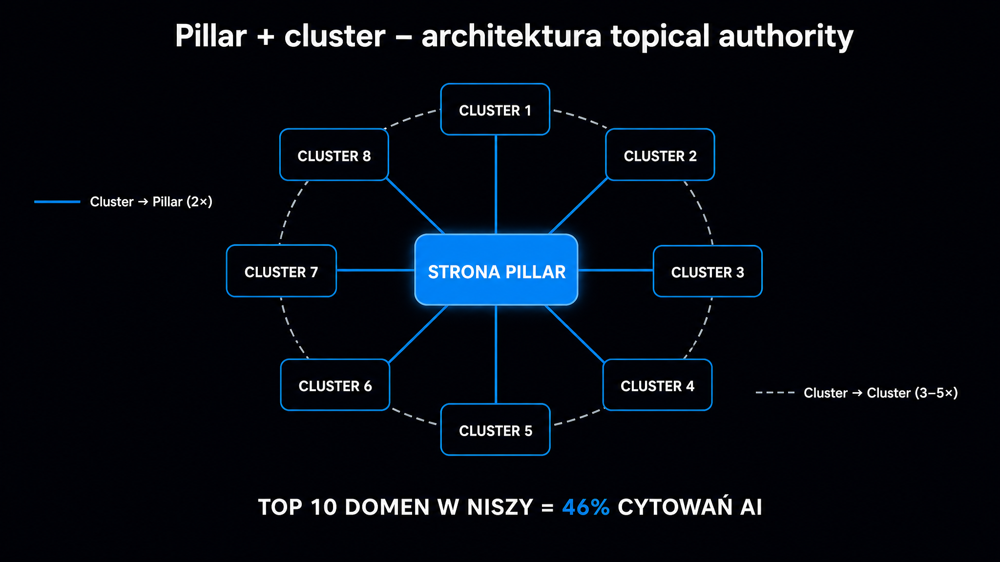

Większość stron wygrywających kiedyś w klasycznym SEO dzięki silnemu profilowi linkowemu **dziś przegrywa w AI Overviews**. Powód jest bolesny dla agencji link buildingowych: LLM-y nie patrzą na linki w taki sam sposób jak klasyczny algorytm. Zwracają uwagę na to, czy domena „wie wszystko" o danej niszy – a to mierzy się głębokością pokrycia, a nie liczbą backlinków. Dlatego koncepcja topical authority, znana w SEO od kilku lat, w erze GEO przestaje być miłym dodatkiem i staje się fundamentem.

## Co LLM-y rozumieją przez „autorytet"

Klasyczna wyszukiwarka Google opiera ocenę autorytetu na trzech filarach: linkach (PageRank), zachowaniu użytkowników (CTR, dwell time) i sygnałach E-E-A-T (autor, źródła, świeżość). LLM-y dodają do tego czwarty, znacznie ważniejszy filar:

> **Spójność pokrycia tematycznego.** Domena cytowana wielokrotnie w różnych podzapytaniach tego samego tematu jest traktowana jako autorytet w niszy.

<aside class="callout-fact">
  
✦

  

    
Ciekawostka

    
Pillar + cluster to nie wymysł ery LLM-ów. Architekturę wprowadził <strong>HubSpot w 2017 roku</strong> jako odpowiedź na semantyczne grupowanie wyników w klasycznym Google. Badacze z HubSpot pokazali, że strony zorganizowane w model pillar-cluster osiągają pozycje dla 4× więcej fraz długiego ogona niż strony zorganizowane chronologicznie po dacie publikacji. Dziewięć lat później ten sam mechanizm działa w warstwie pobierania informacji (retrieval) modeli językowych – tyle że stawka jest dużo wyższa.

  

</aside>

Mechanizm jest prosty, ale ma duże konsekwencje. Gdy silnik pobierający dane wyciąga fragmenty dla pojedynczego podzapytania, sprawdza, z jakiej domeny one pochodzą. Jeśli ta sama domena była wcześniej wybrana dla innych fragmentów w tej samej dziedzinie tematycznej, jej waga rośnie.

To nieformalny mechanizm, ale empirycznie potwierdzony. Kevin Indig pokazał na 1,2 mln cytowań ChatGPT, że **top 10 domen w danej niszy zabiera 46% wszystkich cytowań**. Reszta domen walczy o resztki.

LLM-y wykazują też tendencję do zaufania przez asocjację (ang. *domain trust by association*) – domena wielokrotnie cytowana razem z autorytatywnymi źródłami (Wikipedia, encyklopedie branżowe, publikacje akademickie) zaczyna być traktowana jako część tego samego klastra zaufania. To wzmacnia pozycję ugruntowanych graczy i utrudnia wejście nowym.

## Pillar + cluster – architektura, która spełnia te kryteria

Architektura pillar + cluster nie jest wymysłem ery GEO. Powstała w 2017 roku w HubSpot, oparta na badaniach ekspertów tej firmy, jako odpowiedź na rosnący nacisk Google na semantyczne grupowanie treści. Działa od dawna w klasycznym SEO, ale w erze LLM-ów jej wartość rośnie nieproporcjonalnie.

| Element | Rola | Długość | Intencja | Linkowanie |
|---|---|---|---|---|
| **Pillar page** | centralny hub tematyczny, kompleksowy przegląd | 3000–7000 słów | informacyjna, kategorialna | linkuje do 5–8 najważniejszych stron typu cluster |
| **Cluster pages** | szczegółowy aspekt głównego tematu | 1000–2500 słów | konkretne podzapytanie, transakcyjna | linkuje do pillara 2× + 3–5 innych stron w klastrze |

Dla LLM-ów ta struktura jest odczytywana jako: *„ta domena ma 10–25 artykułów silnie powiązanych tematycznie, wszystkie wskazują na centralny dokument"*. To bardzo silny sygnał autorytetu tematycznego. W zestawieniu z domeną mającą jeden samotny artykuł na ten sam temat, pillar + cluster wygrywa w ponad 80% przypadków – tak pokazują testy iPullRank na osadzeniach wektorowych (ang. embeddings) tekstu.

## Jak zaprojektować mapę tematów

Pierwszy krok jest najtrudniejszy: zdefiniować, co jest pillarem, a co clusterem. Najczęstsze błędy polegają na zbyt szerokim albo zbyt wąskim wyborze pillara. Oto dwie zasady, które realnie działają w niszach komercyjnych:

### Zasada 1 – pillar to fraza, którą klient wpisuje na początku poszukiwań (researchu)

Pillarem dla agencji SEO mogłoby być *„pozycjonowanie w AI"*, dla firmy księgowej *„księgowość dla startupów"*, dla dystrybutora samochodów *„używane samochody dostawcze"*. To pytania na poziomie kategorii, z dużym search volume i komercyjną intencją.

### Zasada 2 – cluster to konkretne podzapytanie z fazy decyzji

Dla pillara *„pozycjonowanie w AI"* clusterami są:

- *„czym GEO różni się od SEO"*
- *„jak optymalizować content pod ChatGPT"*
- *„llms.txt – co to jest i jak wdrożyć"*
- *„narzędzia do śledzenia (trackingu) wyszukiwań AI"*
- *„case study GEO B2B SaaS"*

Każdy z nich ma własną, konkretną intencję i strukturę.

### Praktyczny szablon mapowania

Używamy go w ICEA dla każdego klienta rozpoczynającego wdrożenie GEO:

1. **Wybierz 3–5 głównych pillarów** dla swojej niszy.
2. **Dla każdego pillara wygeneruj 30 podzapytań** – wykorzystując narzędzia takie jak Qforia, GPT-4 z odpowiednim promptem albo Search Console i analizę autocomplete.
3. **Z 30 podzapytań wybierz 12–18**, które poruszają różne aspekty (intencja, format, faza decyzji).
4. **Każde z nich staje się tytułem strony typu cluster**.
5. **Sprawdź pokrycie konkurencji** – ile z tych 12–18 podzapytań ma już dobre wyniki w AI Mode? Reszta to białe plamy do zajęcia.

## Trzy żelazne reguły linkowania wewnętrznego

Sama struktura pillar + cluster nie wystarczy, jeśli artykuły nie są ze sobą powiązane linkami. Większość zespołów contentowych pisze artykuły osobno, w różnym czasie, i zapomina o systematycznym linkowaniu wewnętrznym. Efekt: 20 dobrych tekstów, które na poziomie LLM wyglądają jak 20 niezależnych dokumentów.

| Reguła | Co | Dlaczego |
|---|---|---|
| **Cluster → Pillar (min. 2×)** | każda strona typu cluster linkuje do pillara minimum 2 razy: we wstępie (kontekst nadrzędny) + w zakończeniu (CTA do pełnego przewodnika) | buduje graf topologiczny z wyraźnym hubem |
| **Cluster → Cluster (3–5×)** | każda strona typu cluster linkuje do 3–5 innych stron w tym samym pillarze, najbardziej powiązanych tematycznie | zagęszcza klaster, sygnalizuje gęste pokrycie |
| **Pillar → Cluster (5–8×)** | pillar linkuje do 5–8 najważniejszych stron typu cluster (nie wszystkich) | naturalna hierarchia typu hub-and-spoke |

W praktyce: dla pillara z 12 stronami typu cluster prawidłowo zaprojektowane linkowanie wewnętrzne generuje 30–40 linków w obrębie tego klastra. To dużo i wymaga dyscypliny, ale **efekt na widoczność w AI Mode jest mierzalny – w naszych testach domeny po wdrożeniu pełnego linkowania wewnętrznego rosły w SoV o 5–8 punktów procentowych w 90 dni**.

<aside class="callout-expert">
  

  

    
Opinia eksperta

    
Najczęstszy błąd przy migracji do pillar+cluster: zespół content marketingu próbuje od razu zbudować 5 pillarów. To zabija projekt, bo każdy pillar wymaga 8–12 tygodni dyscypliny, a zespół robi pierwsze 3 i zostawia 2 niedokończone. <strong>Buduj jeden pillar do końca, mierz efekt na SoV przez kwartał, dopiero potem startuj drugi.</strong> Lepiej mieć jeden pillar na 100% niż pięć na 40%.

    
Piotr Wicenciak · SEO Operations Manager, ICEA

  

</aside>

## Teksty zakotwiczenia (anchory) pod LLM-y

LLM-y nie tylko liczą linki – analizują też kontekst, w którym link się pojawia. Anchor (tekst zakotwiczenia) *„kliknij tutaj"* nie daje żadnej informacji semantycznej. Anchor *„pełna definicja query fan-out"* przekazuje od razu, czego dotyczy linkowany zasób.

Reguły anchor textów pod LLM-y:

- **Maksymalnie 60 znaków**, zawiera kluczowe słowo lub frazę kluczową dla linkowanej strony.
- **Naturalny w kontekście zdania** – niewymuszony zasadą „wciśnij na siłę frazę".
- **Niepowtarzający się w obrębie jednego artykułu** – każdy link do tej samej strony powinien mieć inny anchor (sygnał różnorodności semantycznej).
- **Pojawia się we fragmencie, który sam ma sens** – LLM często wybiera fragment 3-5 zdań wokół linka jako część reprezentującą linkowaną stronę.

Praktyczny audyt do zrobienia raz na pół roku: wyciągnij wszystkie anchory dla każdej ze stron typu cluster i sprawdź, czy są zróżnicowane semantycznie. Jeśli 80% linków do strony X używa tego samego anchora, masz problem – dla LLM wygląda to jak monokultura semantyczna, która nie wzmacnia, a osłabia sygnał zaufania.

## Jak startować, gdy masz już chaos contentowy

Większość projektów GEO nie startuje od zera. Istnieje już strona z chaotyczną historią contentową, kilkadziesiąt rozproszonych artykułów, brak wyraźnej struktury. Restart strategii pillar + cluster wymaga inwentaryzacji i przesunięcia, a nie pisania wszystkiego od nowa.

Kolejność działań w takiej sytuacji (sprawdzona w ponad 7 projektach klientów ICEA):

1. **Tygodnie 1–2: audyt istniejącego contentu** – wyciągnij wszystkie artykuły z bloga, oznacz je tematami nadrzędnymi (pillar). Zidentyfikuj artykuły naturalnie nadające się na pillar (kompleksowe, długie) i te będące materiałem na cluster.
2. **Tygodnie 3–4: wybór 1 pillara jako prototypu** – nie próbuj zbudować 5 pillarów naraz, zacznij od jednego, najbardziej komercyjnego. Wybierz 8–12 stron typu cluster z istniejącej bazy lub zaplanuj te do dopisania.
3. **Tygodnie 5–8: optymalizacja pillara + dopisanie brakujących clusterów** – pillar często wymaga rozbudowy do 3000–5000 słów, dodania struktury H2/H3 zgodnej z podzapytaniami, dodania linkowania wewnętrznego.
4. **Tygodnie 9–12: linkowanie wewnętrzne i monitoring** – wdrożenie pełnej macierzy linkowania, danych strukturalnych [schema.org](https://pl.wikipedia.org/wiki/Schema.org) dla pillara i clusterów, monitoring wskaźników SoV i Citation Rate przez kolejne 4–6 tygodni.

## Jak mierzyć efekty wdrożenia

Topical authority w erze LLM-ów nie jest wyborem – jest minimalnym wymogiem dla każdej domeny chcącej być cytowaną w AI Overviews, ChatGPT i Perplexity. **Bez 8–15 powiązanych artykułów wokół jednego pillara statystycznie nie wchodzisz do top 10 domen w danej niszy, a top 10 zabiera 46% cytowań.**

Pillar + cluster to najczystsza, najprostsza i najlepiej udokumentowana metodyka budowania autorytetu tematycznego. Wdrożenie zajmuje 8–12 tygodni dla jednego klastra i wymaga dyscypliny w linkowaniu wewnętrznym, ale efekt – mierzony przez udział w głosie (Share of Voice) i wskaźnik cytowań (Citation Rate) – jest powtarzalny.

W audycie GEO w ICEA pierwszą rzeczą, którą sprawdzamy, jest mapa pokrycia tematycznego: czy klient ma istniejące struktury pillar + cluster, czy chaos rozproszonych artykułów, czy luki, których nikt jeszcze nie zajął. Mapa staje się punktem startowym planu działania (roadmapy) 30/60/90 – konkretnym planem, co napisać, co przepisać, co zlinkować, w jakiej kolejności. Jeśli chcesz sprawdzić, jak wygląda Twoje pokrycie pod kątem cytowalności, [Ocena cytowalności strony](/narzedzia/url-check/) analizuje pojedynczy URL pod kątem 5 czynników struktury, schemy i wczesnego sygnalizowania informacji (front-loading).
