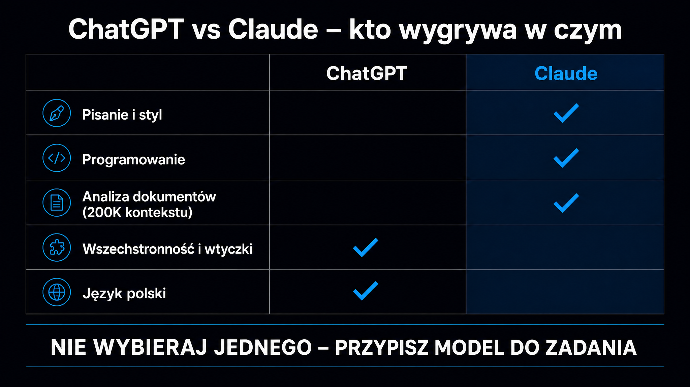

ChatGPT i Claude to dwa najczęściej używane duże modele językowe (LLM – Large Language Model) na rynku. Oba kosztują 20 dolarów miesięcznie w planie standardowym, oba są dostępne po polsku i oba potrafią pisać, kodować i analizować dokumenty. Jednak pod tymi podobieństwami kryją się fundamentalne różnice w filozofii działania, możliwości integracji i mocnych stronach. Żadne z tych narzędzi nie jest bezwzględnie lepsze – **właściwy wybór zależy od tego, co konkretnie chcesz z nim robić**. Poniższe zestawienie odpowiada na to pytanie bez zbędnych ogólników.

## Ceny i plany – co dostajesz za 20 USD

Oba modele stosują podobną strukturę planów, ale szczegóły się różnią. OpenAI rozbudowało swoją ofertę w 2026 roku o nowy poziom pośredni – ChatGPT Go – przez co lista stała się dłuższa i mniej przejrzysta niż u Anthropica.

Poniżej zestawienie planów konsumenckich i biznesowych obu platform – stan na maj 2026:

| Plan | ChatGPT (OpenAI) | Claude (Anthropic) |
|---|---|---|
| **Bezpłatny** | GPT‑5.5 Instant z limitem 16 K kontekstu, reklamy | Modele podstawowe z dziennym limitem, brak reklam |
| **Podstawowy (~8 USD)** | Go – 8 USD/mies., 10× więcej wiadomości niż w planie Free, reklamy | – (brak odpowiednika) |
| **Standard (20 USD/mies.)** | Plus – GPT‑5.5, GPT Image 1.5, generowanie obrazów, tryb głosowy | Pro – Claude Sonnet + Opus, Claude Code w terminalu, projekty, Google Workspace |
| **Premium (200 USD/mies.)** | Pro – dostęp do GPT‑5.5 Pro, okno 400 K tokenów | Max 20× – 20× więcej limitów niż Pro |
| **Zespołowy** | Business – 25–30 USD/os./mies., współdzielone przestrzenie | Team Standard – 25 USD/os./mies. (rocznie: 20 USD), min. 5 osób |
| **Enterprise** | Cena na żądanie, SOC 2, SSO, bez trenowania na danych | Cena na żądanie, HIPAA, SCIM, okno 500 K tokenów |

**Plan ChatGPT Go (oraz Free) od 2026 roku wyświetla reklamy użytkownikom w USA** – Claude w planie bezpłatnym tego nie robi. To drobna, ale widoczna różnica w codziennym użytkowaniu. Przy tej samej kwocie 20 dolarów za Plus/Pro dostajesz od ChatGPT generowanie obrazów wbudowane w model oraz tryb głosowy, a od Claude – głębszą integrację z IDE i Claude Code.

Różnice w API (dla deweloperów integrujących modele w produktach) uległy spłaszczeniu: flagowy Claude Opus kosztuje 5 USD za milion tokenów wejściowych i 25 USD za milion tokenów wyjściowych, a konkurencyjny GPT‑5.5 – odpowiednio 5 USD i 30 USD. Ceny w 2026 roku są do siebie bardzo zbliżone, więc wybór zależy w dużej mierze od preferencji ekosystemu.

## Pisanie i styl – gdzie jakość tekstu ma znaczenie

W zadaniach redakcyjnych i copywritingowych oba modele są solidne, ale mają wyraźnie inny charakter pisania.

**Claude produkuje bardziej zróżnicowany, płynny tekst** – zdania różnej długości, naturalne przejścia, mniejszy odsetek klisz językowych. W testach przeprowadzonych przez Zapier i NxCode w 2026 roku Claude konsekwentnie wypadał lepiej w ocenach jakości tekstu pod kątem naturalności i spójności stylu. ChatGPT pisze poprawnie, ale bardziej schematycznie – każdy akapit ma podobną długość, tempo jest jednostajne.

Kilka konkretnych obserwacji z zastosowań pisarskich:

- **Długi brief, długi dokument** – Claude utrzymuje spójność kontekstu przez całą sesję; GPT‑5.5 bywa mniej konsekwentny przy bardzo długich poleceniach
- **Kreatywna kampania, warianty tekstów** – ChatGPT generuje więcej wariantów szybciej i jest nieco swobodniejszy w eksperymentowaniu z tonem
- **Korekta i redakcja istniejącego tekstu** – oba modele są porównywalne, choć Claude jest nieco precyzyjniejszy w zachowaniu oryginalnego głosu autora

Jedno ograniczenie Claude jest warte odnotowania: **model nie generuje obrazów**. Jeśli Twój proces pracy łączy copywriting z generowaniem ilustracji do mediów społecznościowych, ChatGPT Plus (z wbudowanym generowaniem obrazów GPT Image 1.5, następcą DALL-E) obsłuży całość w jednym oknie.

<aside class="callout-fact">
  
✦

  

    
Ciekawostka

    
W grudniu 2025 roku OpenAI wycofało DALL-E 3 i zastąpiło je modelem GPT Image 1.5 wbudowanym bezpośrednio w ChatGPT. Jednocześnie firma zamknęła Sorę – model do generowania wideo – 26 kwietnia 2026 roku. <strong>ChatGPT Plus stracił możliwość generowania wideo, ale zyskał znacznie lepsze generowanie obrazów bez przełączania narzędzi.</strong>

  

</aside>

## Programowanie – kto pisze lepszy kod

Tutaj różnica jest zauważalna. W teście funkcjonalnym kodu, sprawdzającym, czy wygenerowany kod działa bez poprawek, Claude osiąga ~95% trafności, ChatGPT ~85% (dane Morphllm 2026). Na liście rankingowej Chatbot Arena w kategorii kodowania Claude Opus zajmuje pierwszą pozycję z wynikiem 1561 Elo – GPT‑5.5 plasuje się niżej.

**70% deweloperów preferuje Claude do zadań z kodem** – wynika z ankiety przeprowadzonej przez Pecollective.com w 2026 roku. Przywoływane powody to lepsze rozumienie wieloplikowych repozytoriów, trafniejszy refaktoring i mniejsza liczba wyhalucynowanych wywołań bibliotek.

Jednak nie zawsze Claude wygrywa. Kilka obszarów, gdzie ChatGPT radzi sobie bardzo dobrze:

- **Szybkie skrypty jednorazowe** – oba modele są podobne, ale ChatGPT szybciej odpowiada w planie Plus
- **Integracje z Microsoft 365 i Copilot** – jeśli pracujesz w ekosystemie Microsoft, ChatGPT (przez Copilot) jest znacznie głębiej zintegrowany
- **Debugowanie przez interfejs webowy bez IDE** – ChatGPT w trybie Codex Mobile dostępny jest bezpłatnie od maja 2026; Claude Code wymaga płatnego planu

Claude Code – narzędzie CLI pozwalające modelowi czytać i pisać pliki bezpośrednio w repozytorium – nie ma bezpośredniego odpowiednika w ofercie OpenAI dla użytkowników indywidualnych. Opisane jest szerzej w [przewodniku po Claude](/modele-llm/claude/).

## Analiza dokumentów – kontekst i precyzja

To jeden z obszarów, gdzie Claude ma techniczną przewagę – i jest to przewaga wyraźna.

Okno kontekstowe Claude w czacie na planach płatnych (Pro, Max, Team, Enterprise) wynosi **500 000 tokenów** (ok. 375 000 słów, czyli kilkaset stron A4), a w Claude Code i przez API dostępne jest pełne okno **1 miliona tokenów** dla modeli Opus 4.8 i Sonnet 4.6. Z kolei ChatGPT Plus operuje domyślnie na 32 000 tokenów dla modelu Instant (lub 256 000 tokenów przy ręcznym wyborze modelu Thinking), a okno 400 000 tokenów dostępne jest dopiero w planie Pro za 200 USD miesięcznie.

W praktyce: jeśli wczytujesz obszerne umowy, raporty finansowe, wielostronicowe specyfikacje techniczne lub chcesz jednocześnie porównać kilka dokumentów – Claude w planie Pro za 20 USD wystarczy do zadań, które w ChatGPT wymagałyby znacznie droższej subskrypcji.

Kilka zastosowań, gdzie rozmiar kontekstu ma bezpośredni wpływ:

- **Analiza prawna** – wczytanie pełnej 80-stronicowej umowy i pytania krzyżowe bez przycinania treści
- **Audyt treści** – przetwarzanie całej zawartości serwisu w jednej sesji
- **Research** – zestawienie kilku raportów branżowych i zadawanie pytań o sprzeczności

**[Ocena cytowalności strony](/narzedzia/url-check/) – narzędzie widocznosc.ai – w 30 sekund analizuje Twoją stronę pod kątem cytowalności przez modele LLM**, co jest dobrym testem sprawdzającym, czy Twój content jest strukturalnie gotowy na pobieranie przez silniki RAG (Retrieval-Augmented Generation, czyli generowanie wspomagane wyszukiwaniem).

## Język polski – kto mówi lepiej po polsku

Żaden zewnętrzny benchmark dla języka polskiego, specyficzny dla tych dwóch modeli, nie jest publicznie dostępny (stan na maj 2026). Na podstawie obserwacji polskich użytkowników i testów czat.ai można nakreślić obraz praktyczny.

**ChatGPT wyprzedza Claude w rzadszych językach** – potwierdzają to testy wielojęzyczności. W języku polskim oznacza to, że GPT‑5.5 rzadziej tworzy dziwne konstrukcje składniowe i naturalniej odmienia nazwy własne w trudniejszych przypadkach. Claude jest dostępny po polsku od 2024 roku i obsługuje interfejs w pełni w naszym języku, ale przy skomplikowanych poleceniach bywa mniej precyzyjny pod kątem fleksji.

W zastosowaniach content marketingowych w Polsce wygląda to następująco:

- **Proste posty i artykuły** – oba modele są porównywalne, wygenerowany tekst zawsze wymaga korekty
- **Zaawansowana redakcja i styl** – Claude jest płynniejszy w języku angielskim, natomiast GPT‑5.5 trafniejszy w polskim
- **Tłumaczenie EN → PL** – ChatGPT radzi sobie nieznacznie lepiej z typowymi frazami marketingowymi

Żadnego z modeli nie należy traktować jako edytora końcowego – każdy tekst wygenerowany przez AI wymaga przejrzenia przez człowieka, niezależnie od tego, kto go napisał.

<aside class="callout-expert">
  

  

    
Opinia eksperta

    
W projektach content marketingowych prowadzonych w ICEA korzystamy z obu modeli równolegle. Do briefów, długich analiz i pracy z obszernymi dokumentami domyślnie wybieramy Claude – przede wszystkim ze względu na zachowanie spójnego kontekstu przez całą sesję. Do polskojęzycznych postów i materiałów, gdzie naturalność fleksji jest krytyczna, Claude'owi zdarza się popełnić błąd, który GPT-5.5 potrafi ominąć. <strong>Najskuteczniejsza strategia to nie wybór jednego narzędzia, ale przypisanie każdego modelu do zadań, w których wypada lepiej.</strong>

    
Tomasz Czechowski · Head of SEO, ICEA

  

</aside>

## Wielka tabela porównawcza: ChatGPT vs Claude

Oto syntetyczne zestawienie kluczowych kryteriów. Gwiazdką ✦ oznaczam przewagę w danej kategorii – w przypadku remisu nie oznaczam żadnego modelu.

| Kryterium | ChatGPT (OpenAI) | Claude (Anthropic) |
|---|---|---|
| **Cena Free** | 0 USD, reklamy (USA) | 0 USD, bez reklam ✦ |
| **Plan Standard** | Plus – 20 USD/mies. | Pro – 20 USD/mies. |
| **Okno kontekstowe (Standard)** | 32 K (Instant) / 256 K (Thinking) | 500 000 tokenów (czat) ✦ |
| **Okno kontekstowe (Premium)** | 400 K tokenów (Pro, 200 USD) | 1 mln tokenów (Claude Code / API) ✦ |
| **Generowanie obrazów** | GPT Image 1.5, wbudowane ✦ | Brak |
| **Generowanie wideo** | Brak (Sora zamknięta w marcu 2026) | Brak |
| **Tryb głosowy** | Tak, pełnofunkcyjny ✦ | Ograniczony |
| **Jakość kodowania (SWE-bench Verified)** | ~88,7% | ~88,6% |
| **Jakość stylistyki (niezależne testy)** | Poprawna, schematyczna | Bardziej zróżnicowana ✦ |
| **Język polski** | Silniejszy ✦ | Dobry, drobne błędy fleksyjne |
| **Analiza długich dokumentów** | Limitowana (Standard) | Lepiej dopasowana ✦ |
| **Integracje enterprise** | Microsoft 365, Copilot ✦ | Google Workspace |
| **Agent terminalowy** | Codex Mobile (bezpłatny) | Claude Code (plan płatny) ✦ |
| **Filozofia bezpieczeństwa** | RLHF + moderacja | Constitutional AI ✦ |
| **Koszt API (flagship)** | 5 / 30 USD / 1 M tokenów | 5 / 25 USD / 1 M tokenów ✦ |
| **Ekosystem wtyczek / GPTs** | Szeroki, GPT Store ✦ | Ograniczony |

Ta tabela pokazuje jedną ważną rzecz: **żaden z modeli nie dominuje w więcej niż połowie kategorii**. Wybór zależy od priorytetów, a te są różne dla programisty, marketera i analityka.

## Werdykt per zastosowanie – który wybrać

Odpowiedź na pytanie „ChatGPT czy Claude" sprowadza się do tego, do czego konkretnie potrzebujesz narzędzia. Poniżej praktyczne rekomendacje – bez ogólników.

**Do pisania tekstów po polsku:**
ChatGPT Plus. Lepsza obsługa polskiej fleksji, mniejsze ryzyko niezręcznych konstrukcji gramatycznych. Claude radzi sobie dobrze, ale wymaga częstszej korekty w specyficznych przypadkach.

**Do programowania i pracy z kodem:**
Claude Pro. Wyższy wynik w testach funkcjonalnych, lepsze rozumienie repozytoriów wieloplikowych, wbudowany Claude Code jako terminal CLI. Wyjątek: jeśli pracujesz w środowisku Microsoft z Copilotem – ChatGPT jest z nim zintegrowany znacznie głębiej.

**Do analizy dokumentów i pracy z obszernymi kontekstami:**
Claude Pro. Stabilniejsze i większe okno kontekstowe bez dopłat. Dla naprawdę długich dokumentów jest to różnica decydująca.

**Do codziennego użytku z różnorodnymi zadaniami:**
ChatGPT Plus, jeśli ważna jest dla Ciebie wielofunkcyjność (obrazy, zaawansowany głos, integracje). Claude Pro, jeśli priorytetem jest najwyższa jakość odpowiedzi tekstowych i precyzja w kodowaniu.

**Do budowania produktów przez API:**
Wybór zależy od ekosystemu. Koszty generowania tokenów we flagowych modelach obu dostawców (GPT-5.5 oraz Claude Opus) są obecnie bardzo podobne. Warto rozważyć tańsze modele obu firm (np. GPT-4.1 Nano czy Claude Haiku) przy projektach wymagających przetwarzania dużych wolumenów danych.

Jeśli chcesz sprawdzić, jak Twoja marka pojawia się w odpowiedziach obu modeli, [Widoczność marki w AI](/narzedzia/brand-check/) odpyta ChatGPT, Claude i inne silniki AI jednocześnie – bez konieczności ręcznego testowania.

Szczegółowe omówienia każdego z modeli znajdziesz w artykułach o [ChatGPT](/modele-llm/chatgpt/) i [Claude](/modele-llm/claude/). Kontekst rynkowy – jak duże modele językowe oparte na [sieciach neuronowych](https://pl.wikipedia.org/wiki/Sie%C4%87_neuronowa) zmieniają wyszukiwanie i widoczność marki – opisuje [przewodnik po modelach LLM](/modele-llm/przewodnik/).
