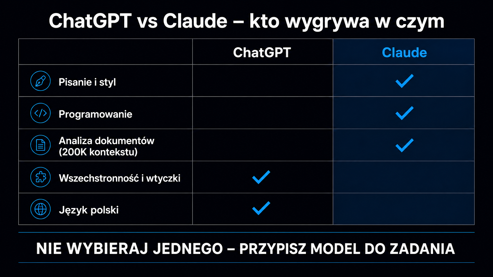

ChatGPT i Claude to dwa najpopularniejsze duże modele językowe (LLM – Large Language Model) na rynku. Oba kosztują 20 dolarów miesięcznie w planie standardowym. Oba mówią po polsku, piszą, kodują i analizują dokumenty. Pod tymi podobieństwami kryją się jednak fundamentalne różnice w filozofii działania, możliwościach integracji i mocnych stronach. **Żadne z tych narzędzi nie jest bezwzględnie lepsze, a właściwy wybór zależy od Twoich konkretnych potrzeb.** Poniższe zestawienie odpowiada na to pytanie bez zbędnych ogólników.

## Ceny i plany – co dostajesz za 20 USD

Oba modele stosują podobną strukturę planów, choć diabeł tkwi w szczegółach. OpenAI rozbudowało swoją ofertę w 2026 roku o nowy poziom pośredni. Wprowadzenie ChatGPT Go sprawiło, że cennik stał się dłuższy i mniej przejrzysty niż u Anthropica.

Zestawienie planów konsumenckich i biznesowych obu platform na wrzesień 2026 roku prezentuje się następująco.

| Plan | ChatGPT (OpenAI) | Claude (Anthropic) |
|---|---|---|
| **Bezpłatny** | GPT‑5.6 Luna, okno 27 K tokenów (Instant), reklamy | Claude Sonnet 5 z limitami, wyszukiwanie w sieci, Artifacts, brak reklam |
| **Podstawowy (~8 USD)** | Go – 8 USD/mies., wyższe limity niż w planie Free, reklamy | – (brak odpowiednika) |
| **Standard (20 USD/mies.)** | Plus – GPT‑5.6 Sol, Terra i Luna, ChatGPT Images 2.0, tryb głosowy | Pro – Claude Sonnet + Opus, Claude Code, projekty, Google Workspace |
| **Premium (100–200 USD/mies.)** | Pro – GPT‑5.6 Sol Pro, 5× lub 20× wyższe limity niż Plus, okno do 400 K tokenów | Max – 5× lub 20× wyższe limity niż Pro |
| **Zespołowy** | Business – 20 USD/os./mies. rocznie (25 USD miesięcznie), min. 2 osoby | Team Standard – 20 USD/os./mies. rocznie (25 USD miesięcznie), 2–150 osób |
| **Enterprise** | Cena na żądanie, SOC 2, SSO, bez trenowania na danych | 20 USD/miejsce rocznie + zużycie według stawek API, SCIM, logi audytowe |

**Plan ChatGPT Go (oraz Free) od 2026 roku wyświetla reklamy użytkownikom w USA, podczas gdy Claude w darmowej wersji tego unika.** To drobna, ale odczuwalna różnica w codziennej pracy. Przy tej samej kwocie 20 dolarów za Plus/Pro dostajesz od ChatGPT wbudowane generowanie obrazów oraz tryb głosowy. Claude w tej cenie oferuje głębszą integrację z IDE i Claude Code.

Różnice w API uległy wyraźnemu spłaszczeniu. Claude Opus 5 kosztuje 5 USD za milion tokenów wejściowych i 25 USD za milion tokenów wyjściowych (najmocniejszy Claude Fable 5.1 – 10/50 USD, Sonnet 5 – 2/10 USD). Konkurencyjny GPT‑5.6 Sol to wydatek rzędu odpowiednio 4 USD i 20 USD w cenie promocyjnej obowiązującej co najmniej do 21 listopada 2026 roku (tańsze warianty: Terra 2/12 USD, Luna 0,20/1,20 USD). **Ceny w 2026 roku są do siebie bardzo zbliżone, więc decyzja zależy głównie od preferowanego ekosystemu.**

## Pisanie i styl – gdzie jakość tekstu ma znaczenie

W zadaniach redakcyjnych i copywritingowych oba modele sprawdzają się solidnie, ale mają zupełnie inny charakter pisania.

**Claude produkuje bardziej zróżnicowany i płynny tekst, stosując zdania różnej długości, naturalne przejścia oraz mniejszy odsetek klisz językowych.** W testach przeprowadzonych przez Zapier i NxCode w 2026 roku konsekwentnie wypadał lepiej pod kątem naturalności i spójności stylu. ChatGPT pisze poprawnie, ale wysoce schematycznie. Każdy jego akapit ma podobną długość, a tempo narracji pozostaje jednostajne.

Zwróć uwagę na kilka konkretnych obserwacji z codziennych zastosowań pisarskich.

- **Długi brief i dokument** – Claude utrzymuje spójność kontekstu przez całą sesję, podczas gdy GPT‑5.6 bywa mniej konsekwentny przy bardzo długich poleceniach
- **Kreatywna kampania i warianty tekstów** – ChatGPT generuje więcej opcji w krótszym czasie i pozwala sobie na większą swobodę w eksperymentowaniu z tonem
- **Korekta i redakcja istniejącego tekstu** – oba modele prezentują podobny poziom, choć Claude wykazuje nieco większą precyzję w zachowaniu oryginalnego głosu autora

**Warto odnotować jedno kluczowe ograniczenie Claude, ponieważ ten model w ogóle nie generuje obrazów.** Jeśli Twój proces pracy łączy copywriting z tworzeniem ilustracji do mediów społecznościowych, ChatGPT Plus (z wbudowanym modelem ChatGPT Images 2.0) obsłuży całość w jednym oknie.

<aside class="callout-fact">
  
✦

  

    
Ciekawostka

    
Już w marcu 2025 roku generowanie obrazów w ChatGPT przestało opierać się na DALL-E 3, a w kwietniu 2026 roku OpenAI udostępniło model ChatGPT Images 2.0. W tym samym czasie firma wygaszała Sorę – aplikacja do generowania wideo została zamknięta 26 kwietnia 2026 roku, a API ma działać do 24 września 2026 roku. <strong>ChatGPT stracił możliwość generowania wideo, ale oferuje coraz lepsze generowanie obrazów bez przełączania narzędzi.</strong>

  

</aside>

## Programowanie – kto pisze lepszy kod

W tym obszarze różnica jest wyraźnie zauważalna. **W zestawieniu z maja 2026 roku Claude Opus 4.8 rozwiązywał 69,2% zadań trudnego benchmarku SWE-bench Pro, a GPT‑5.5 – 58,6%.** Od tego czasu obie firmy wydały nowsze modele (Claude Opus 5 i rodzinę GPT‑5.6), więc warto traktować ten wynik jako punkt odniesienia, a nie stałą przewagę.

Claude nie zawsze jednak wygrywa. Istnieje kilka obszarów, w których to ChatGPT radzi sobie zdecydowanie lepiej.

- **Szybkie skrypty jednorazowe** – oba modele prezentują zbliżony poziom, ale ChatGPT szybciej generuje odpowiedź w planie Plus
- **Integracje z Microsoft 365 i Copilot** – jeśli pracujesz w ekosystemie Microsoft, ChatGPT (przez Copilot) zapewnia znacznie głębszą integrację
- **Agent kodujący bez opłat** – Codex jest w ograniczonym zakresie dostępny także w planie Free, podczas gdy Claude Code wymaga płatnego planu

Claude Code to narzędzie CLI pozwalające modelowi czytać i pisać pliki bezpośrednio w repozytorium. Jego odpowiednikiem po stronie OpenAI jest Codex – dostępny jako CLI działające lokalnie, rozszerzenie IDE i usługa Codex cloud, która wykonuje zadania w chmurowych kontenerach. Szerzej ten temat opisuje [przewodnik po Claude](/modele-llm/claude/).

## Analiza dokumentów – kontekst i precyzja

To jeden z obszarów, w których Claude zyskał wyraźną przewagę techniczną.

**Okno kontekstowe Claude w czacie na planach płatnych (Pro, Max, Team, Enterprise) wynosi 1 milion tokenów dla modeli Fable 5.1, Opus 5 i Sonnet 5.** To samo okno jest dostępne w Claude Code i przez API. Z kolei ChatGPT Plus operuje na 54 000 tokenów w trybie Instant (lub 256 000 tokenów w trybie rozumowania). Okno 400 000 tokenów pojawia się tam dopiero w planie Pro (od 100 USD miesięcznie).

W praktyce oznacza to ogromną różnicę przy wczytywaniu obszernych umów, raportów finansowych czy wielostronicowych specyfikacji technicznych. **Claude w planie Pro za 20 USD bez problemu obsłuży zadania, które w ChatGPT wymagałyby znacznie droższej subskrypcji.**

Sprawdź kilka zastosowań, w których rozmiar kontekstu ma bezpośredni wpływ na jakość pracy.

- **Analiza prawna** – wczytanie pełnej 80-stronicowej umowy i zadawanie pytań krzyżowych bez ryzyka przycinania treści
- **Audyt treści** – przetwarzanie całej zawartości obszernego serwisu w ramach jednej sesji
- **Research** – zestawienie kilku raportów branżowych i weryfikowanie ewentualnych sprzeczności między nimi

**[Ocena cytowalności strony](/narzedzia/url-check/) to narzędzie widocznosc.ai, które w 30 sekund analizuje Twoją stronę pod kątem cytowalności przez modele LLM.** Stanowi to doskonały test sprawdzający, czy Twój content jest strukturalnie gotowy na pobieranie przez silniki RAG (Retrieval-Augmented Generation, czyli generowanie wspomagane wyszukiwaniem).

## Język polski – kto mówi lepiej po polsku

Żaden zewnętrzny benchmark dla języka polskiego, specyficzny dla tych dwóch modeli, nie jest publicznie dostępny (stan na maj 2026). Na podstawie obserwacji rodzimych użytkowników i testów czat.ai możemy jednak nakreślić bardzo praktyczny obraz sytuacji.

**Testy wielojęzyczności potwierdzają, że ChatGPT wyprzedza Claude w rzadszych językach.** W przypadku polskiego oznacza to, że GPT‑5.6 rzadziej tworzy nienaturalne konstrukcje składniowe i lepiej odmienia nazwy własne w trudniejszych przypadkach. Claude jest dostępny po polsku od 2024 roku i oferuje w pełni przetłumaczony interfejs, ale przy skomplikowanych poleceniach bywa mniej precyzyjny pod kątem fleksji.

W polskich realiach content marketingowych wygląda to następująco.

- **Proste posty i artykuły** – oba modele prezentują porównywalny poziom, a wygenerowany tekst zawsze wymaga ludzkiej korekty
- **Zaawansowana redakcja i styl** – Claude pisze płynniej w języku angielskim, natomiast GPT‑5.6 jest trafniejszy w polskim
- **Tłumaczenie EN → PL** – ChatGPT radzi sobie nieznacznie lepiej z przekładaniem typowych fraz marketingowych

**Żadnego z tych modeli nie należy traktować jako ostatecznego edytora.** Każdy tekst wygenerowany przez AI bezwzględnie wymaga weryfikacji przez człowieka, niezależnie od użytego narzędzia.

<aside class="callout-expert">
  

  

    
Opinia eksperta

    
W projektach content marketingowych prowadzonych w ICEA korzystamy z obu modeli równolegle. Do briefów, długich analiz i pracy z obszernymi dokumentami domyślnie wybieramy Claude – przede wszystkim ze względu na zachowanie spójnego kontekstu przez całą sesję. Do polskojęzycznych postów i materiałów, gdzie naturalność fleksji jest krytyczna, Claude'owi zdarza się popełnić błąd, który GPT-5.6 potrafi ominąć. <strong>Najskuteczniejsza strategia to nie wybór jednego narzędzia, ale przypisanie każdego modelu do zadań, w których wypada lepiej.</strong>

    
Tomasz Czechowski · Head of SEO, ICEA

  

</aside>

## Wielka tabela porównawcza: ChatGPT vs Claude

Poniżej znajdziesz syntetyczne zestawienie kluczowych kryteriów. Gwiazdką ✦ oznaczam przewagę w danej kategorii, a w przypadku remisu nie wyróżniam żadnego z modeli.

| Kryterium | ChatGPT (OpenAI) | Claude (Anthropic) |
|---|---|---|
| **Cena Free** | 0 USD, reklamy (USA) | 0 USD, bez reklam ✦ |
| **Plan Standard** | Plus – 20 USD/mies. | Pro – 20 USD/mies. |
| **Okno kontekstowe (Standard)** | 54 K (Instant) / 256 K (rozumowanie) | 1 mln tokenów (czat) ✦ |
| **Okno kontekstowe (Premium)** | 128 K (Instant) / 400 K (rozumowanie) w planie Pro | 1 mln tokenów (czat, Claude Code, API) ✦ |
| **Generowanie obrazów** | ChatGPT Images 2.0, wbudowane ✦ | Brak |
| **Generowanie wideo** | Brak (aplikacja Sora zamknięta w kwietniu 2026) | Brak |
| **Tryb głosowy** | Tak, pełnofunkcyjny ✦ | Ograniczony |
| **Jakość kodowania (SWE-bench Pro, maj 2026)** | 58,6% (GPT‑5.5) | 69,2% (Opus 4.8) ✦ |
| **Jakość stylistyki (niezależne testy)** | Poprawna, schematyczna | Bardziej zróżnicowana ✦ |
| **Język polski** | Silniejszy ✦ | Dobry, drobne błędy fleksyjne |
| **Analiza długich dokumentów** | Limitowana (Standard) | Lepiej dopasowana ✦ |
| **Integracje enterprise** | Microsoft 365, Copilot ✦ | Google Workspace |
| **Agent kodujący** | Codex – CLI, IDE, chmura (limitowany także w Free) | Claude Code – terminal, IDE, web (plany płatne) |
| **Filozofia bezpieczeństwa** | RLHF + moderacja | Constitutional AI ✦ |
| **Koszt API (flagship)** | 4 / 20 USD / 1 M tokenów (GPT‑5.6 Sol, cena promocyjna) ✦ | 5 / 25 USD / 1 M tokenów (Opus 5) |
| **Ekosystem wtyczek / GPTs** | Szeroki, GPT Store ✦ | Ograniczony |

**Z powyższego zestawienia płynie jeden kluczowy wniosek, ponieważ żaden z modeli nie dominuje w więcej niż połowie kategorii.** Ostateczny wybór zależy od Twoich priorytetów, które będą zupełnie inne dla programisty, marketera czy analityka danych.

## Werdykt per zastosowanie – który wybrać

Odpowiedź na pytanie „ChatGPT czy Claude" sprowadza się do tego, do czego konkretnie potrzebujesz danego narzędzia. Poznaj praktyczne rekomendacje pozbawione zbędnych ogólników.

**Do pisania tekstów po polsku wybierz ChatGPT Plus.** Zapewnia on lepszą obsługę polskiej fleksji i mniejsze ryzyko niezręcznych konstrukcji gramatycznych. Claude radzi sobie na tym polu dobrze, ale w specyficznych przypadkach wymaga częstszej korekty.

**Do programowania i pracy z kodem postaw na Claude Pro.** Modele Anthropic osiągały wyższe wyniki w SWE-bench Pro, lepiej rozumieją repozytoria wieloplikowe, a plan obejmuje Claude Code. Wyjątek stanowi praca w środowisku Microsoft z Copilotem, z którym ChatGPT jest zintegrowany znacznie głębiej.

**Do analizy dokumentów i pracy z obszernymi kontekstami najlepszy będzie Claude Pro.** Oferuje stabilniejsze i znacznie większe okno kontekstowe bez ukrytych dopłat. W przypadku naprawdę długich plików jest to różnica absolutnie decydująca.

**Do codziennego użytku z różnorodnymi zadaniami rozważ ChatGPT Plus, jeśli zależy Ci na wielofunkcyjności (obrazy, zaawansowany głos, integracje).** Wybierz z kolei Claude Pro, jeśli Twoim priorytetem pozostaje najwyższa jakość odpowiedzi tekstowych oraz precyzja w kodowaniu.

**Do budowania produktów przez API dobierz model pod swój ekosystem.** Koszty generowania tokenów we flagowych modelach obu dostawców (GPT-5.6 Sol oraz Claude Opus 5) są obecnie bardzo podobne. Przy projektach wymagających przetwarzania dużych wolumenów danych warto rozważyć tańsze warianty obu firm (np. GPT-5.6 Luna czy Claude Haiku 4.5).

Jeśli chcesz sprawdzić, jak Twoja marka pojawia się w odpowiedziach obu modeli, [Widoczność marki w AI](/narzedzia/brand-check/) odpyta ChatGPT, Claude i inne silniki AI jednocześnie. Zrobisz to szybko i bez konieczności ręcznego testowania każdego z nich.

Szczegółowe omówienia każdego z modeli znajdziesz w artykułach o [ChatGPT](/modele-llm/chatgpt/) i [Claude](/modele-llm/claude/). Szerszy kontekst rynkowy, pokazujący jak duże modele językowe oparte na [sieciach neuronowych](https://pl.wikipedia.org/wiki/Sie%C4%87_neuronowa) zmieniają wyszukiwanie i widoczność marki, dogłębnie opisuje [przewodnik po modelach LLM](/modele-llm/przewodnik/).
