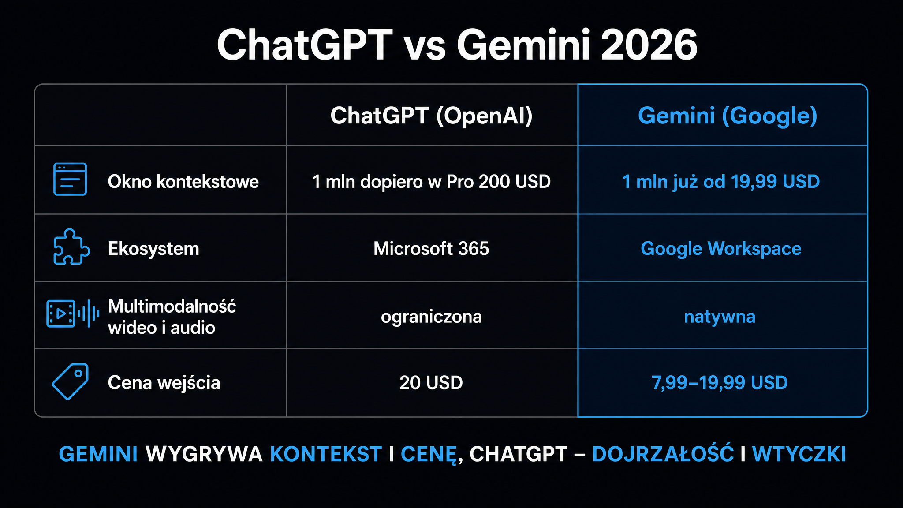

ChatGPT i Gemini to dziś dwa najszerzej używane interfejsy konwersacyjne oparte na dużych modelach językowych (LLM – *Large Language Model*). Oba ruszają z podobnego punktu – wpisujesz pytanie, model generuje odpowiedź – ale różnią się w każdym ważnym wymiarze: skąd czerpią wiedzę, ile kosztują, z czym się integrują i gdzie popełniają błędy. Jeśli wybierasz narzędzie do codziennej pracy lub rozważasz, który model wdrożyć w zespole, odpowiedź zależy głównie od jednego pytania: czy Twój przepływ pracy toczy się w ekosystemie Google, czy poza nim?

## Modele i możliwości – czym dysponujesz w 2026 roku

OpenAI i Google od 2023 roku przyspieszyły cykl wydań do niemal kwartalnego rytmu. Każda generacja przynosi znaczne poszerzenie możliwości, więc przy porównaniu ważna jest nie tylko nazwa modelu, ale i data, którą sprawdzasz.

**ChatGPT w planie Plus (20 USD/mies.) daje dziś dostęp do GPT-5.5 – flagowego modelu wydanego 23 kwietnia 2026 roku.** Plan Pro za 100 USD/mies., uruchomiony 9 kwietnia 2026 roku, stanowi bezpośrednią konkurencję dla planu Claude Max; plan Pro za 200 USD/mies. dodaje okno kontekstowe o wielkości 1 miliona tokenów i aż 250 sesji Deep Research miesięcznie. Plan Free pozostaje bezpłatny, choć dostęp do GPT-5.5 jest w nim racjonowany. Warto też wspomnieć o tanim planie Go za 8 USD/mies..

Po stronie Google obraz jest nieco bardziej rozbudowany. Model **Gemini 3.1 Pro** – z oknem kontekstowym 1 miliona tokenów i natywnym przetwarzaniem tekstu, obrazów, audio i wideo w jednym monicie – jest dostępny w planie AI Pro (wcześniej Gemini Advanced / Google One AI Premium) za 19,99 USD/mies.. Google ogłosiło również plan AI Ultra (od 100 USD/mies.), który odblokowuje m.in. asystenta Gemini Spark. Najniższy płatny próg – AI Plus za 7,99 USD/mies. – zapewnia dostęp do mniejszych i lżejszych modeli (np. Gemini 3.1 Flash-Lite) i 200 GB przestrzeni w Google Drive.

Na konferencji I/O 2026 (maj 2026) zapowiedziano nową generację modeli **Gemini 3.5 Flash** oraz **Gemini Omni**, a także ekosystem agentów Google Antigravity. Szersze wdrożenie tych nowości, wraz z asystentem Spark z całodobową integracją z Gmailem, zaplanowano na kolejne miesiące 2026 roku.

### Okna kontekstowe i multimodalność

Okno kontekstowe decyduje, jak dużo materiału możesz wrzucić do jednego zapytania bez dzielenia go na części.

- **GPT-5.5 (Plus)** – ok. 128 000 tokenów (standard); plan Pro (200 USD) rozszerza je do 1 mln tokenów
- **Gemini 3.1 Pro** – 1 milion tokenów w planie AI Pro
- **Gemini 3.5 Flash** – dostępny w nowych wdrożeniach agentowych, świetnie radzi sobie z długimi kontekstami przy bardzo niskim koszcie za token

**Gemini wygrywa tu kategorycznie: milionowy kontekst dostępny od 19,99 USD/mies. to możliwość wczytania całej dokumentacji projektu, kilkudziesięciu umów lub kilkugodzinnego nagrania wideo w jednej sesji.** ChatGPT osiąga ten próg dopiero w planie Pro za 200 USD/mies..

Multimodalność (obsługa wielu typów danych – tekstu, obrazu, dźwięku, wideo) jest w Gemini wbudowana na poziomie architektury modelu. ChatGPT obsługuje tekst i obraz natywnie; generowanie wideo wymaga użycia modelu Sora, wbudowanego od planu Plus.

<aside class="callout-fact">
  
✦

  

    
Ciekawostka

    
Gemini 3.1 Pro w wielu testach wydajności (benchmarkach) wyprzedza modele OpenAI w zadaniach agentycznych i natywnym przetwarzaniu kodu. <strong>To wyraźna przewaga flagowego modelu Google nad konkurencją w pierwszej połowie 2026 roku.</strong>

  

</aside>

## Integracja z ekosystemami – gdzie każdy model czuje się jak w domu

To kluczowy wymiar wyboru, który wiele zestawień pomija. Techniczne parametry modelu mają mniejsze znaczenie niż to, czy narzędzie wpisuje się w Twój codzienny zestaw aplikacji.

Gemini funkcjonuje wewnątrz produktów Google. W planie AI Pro asystent działa bezpośrednio w Gmailu (propozycje odpowiedzi, skrót wątku), Dokumentach (pisanie, streszczanie, przeformułowanie), Arkuszach (formuły, analiza danych), Prezentacjach i Google Meet. **Funkcja Deep Research w Gemini łączy się z Gmailem, Drive, Dokumentami i Chatem – model może przeszukiwać Twoje własne pliki i e-maile jako element procesu badawczego.** Dla zespołu pracującego w Google Workspace to realny wzrost produktywności, którego ChatGPT nie oferuje bez rozbudowanych integracji zewnętrznych.

ChatGPT jest silniejszy poza środowiskiem Workspace. Ekosystem OpenAI obejmuje DALL-E (generowanie obrazów), Sorę (generowanie wideo, dostępne od planu Plus), Whisper (transkrypcja mowy) i szybko rosnącą bibliotekę GPTs – wyspecjalizowanych asystentów tworzonych przez zewnętrznych deweloperów. Integracja z Microsoft 365 Copilot i bogata sieć konektorów API sprawiają, że ChatGPT lepiej wpisuje się w środowiska oparte na rozwiązaniach Microsoftu.

Przy wyborze sprawdź jeden parametr: czy Twoje pliki i e-maile są w Google Drive, czy w OneDrive / SharePoint? To zazwyczaj przesądza o wyborze.

## Głos i tryb mobilny – jak działają asystenci głosowi

Tryb głosowy to obszar, w którym obie platformy intensywnie inwestują, ale z różnymi priorytetami.

Zaawansowany tryb głosowy ChatGPT (Advanced Voice Mode) – dostępny od planu Plus – zapewnia dwukierunkową rozmowę z niskim opóźnieniem, możliwość płynnego przerywania wypowiedzi i naturalny rytm konwersacji. Działa na urządzeniach mobilnych i komputerach. **Tryb głosowy ChatGPT jest oceniany wyżej pod względem naturalności dialogu** – testy niezmiennie wskazują na wyższy komfort rozmowy.

Gemini Live (tryb głosowy Gemini) jest przede wszystkim mobilny, a od momentu wdrożenia asystenta Spark oferuje całodobową integrację ze skrzynką Gmail – model może aktywnie monitorować przychodzącą pocztę i proaktywnie alarmować o ważnych wiadomościach. To inne podejście: nieco mniej naturalny dialog, ale szersze możliwości działania w aplikacjach.

## Prywatność, dane treningowe i zgodność z regulacjami (compliance)

Różnice w podejściu do danych mają kolosalne znaczenie dla firm pracujących z informacjami wrażliwymi.

Kilka faktów:

- **ChatGPT Free i Plus** – rozmowy mogą być domyślnie wykorzystywane do trenowania modeli, jeśli użytkownik nie wyłączy tej opcji w ustawieniach prywatności. Plany Business i Enterprise domyślnie izolują dane od procesów treningowych
- **Gemini AI Pro (konsumencki)** – Google stosuje podobne podejście: dane z rozmów mogą być przeglądane i używane do poprawy usługi; w Workspace Enterprise stosowana jest pełna izolacja danych
- **OpenAI SOC 2 Type II, ISO 27001** – certyfikaty dostępne od planu Business; Enterprise dodaje logowanie SSO, SCIM i niestandardowe zasady retencji danych
- **Google Workspace Enterprise** – dostępne umowy BAA dla HIPAA, DLP (zapobieganie wyciekom danych) i pełna zgodność z RODO

Dla regulowanych branż (fintech, medtech, prawo) oba rozwiązania mają ścieżkę enterprise z odpowiednimi certyfikatami. Ważne jest jednak, żeby nie zakładać, że plany konsumenckie Plus / AI Pro chronią dane w ten sam sposób co pakiety Enterprise – tak nie jest.

<aside class="callout-expert">
  

  

    
Opinia eksperta

    
W projektach SEO i contentowych, które prowadzimy w ICEA, te dwa modele mają różne role. Gemini 3.1 Pro używamy do analizy dużych zbiorów URL, przetwarzania obszernych raportów Search Console i zadań wymagających wczytania całego korpusu treści jednocześnie. ChatGPT – do kreatywnych zadań pisarskich, generowania wariantów struktury artykułu i pracy z kodem. <strong>Jeśli masz wybrać jeden: sprawdź, czy Twój przepływ pracy zaczyna się od Google Drive, czy od pustego pola tekstowego.</strong>

    
Tomasz Czechowski · Head of SEO, ICEA

  

</aside>

## Duża tabela porównawcza – ChatGPT vs Gemini 2026

Poniżej zestawienie kluczowych parametrów dla obu platform. Dane odpowiadają stanowi na maj 2026 r.

| Parametr | ChatGPT | Google Gemini |
|---|---|---|
| **Producent** | OpenAI | Google DeepMind |
| **Plan Free** | Limitowany dostęp, brak wideo (Sora) | Dostęp do mniejszych modeli (np. Flash-Lite) |
| **Plan podstawowy płatny** | Plus – 20 USD/mies. | AI Pro – 19,99 USD/mies. |
| **Tani plan wejściowy** | Go – 8 USD/mies. | AI Plus – 7,99 USD/mies. |
| **Plan zaawansowany** | Pro – 100–200 USD/mies. | AI Ultra – od 100 USD/mies. |
| **Flagowy model (maj 2026)** | GPT-5.5 | Gemini 3.1 Pro / Gemini 3.5 Flash |
| **Okno kontekstowe (Plus/Pro)** | 128 tys. tokenów (Plus); 1 mln (Pro 200 USD) | 1 mln tokenów (AI Pro i wyżej) |
| **Multimodalność** | Tekst + obraz; wideo przez Sorę | Tekst + obraz + audio + wideo (natywnie) |
| **Generowanie wideo** | Sora (od planu Plus) | Veo 3.1 (od planu AI Pro) |
| **Generowanie obrazów** | DALL-E (od planu Plus) | Imagen (wbudowany) |
| **Tryb głosowy** | Advanced Voice Mode, desktop + mobile | Gemini Live; asystent Spark |
| **Integracja biurowa** | Przez Microsoft 365 Copilot | Natywna (Workspace: Gmail, Docs, Drive, Sheets) |
| **Deep Research** | Tak (np. 10 sesji/mies. w Plus, do 250 w Pro) | Tak (integracja z Drive/Gmail) |
| **Przeszukiwanie sieci** | Tak | Tak (natywne Google Search) |
| **Ochrona danych treningowych** | Od planu Business | Od planu Workspace Enterprise |
| **API (dostępność)** | OpenAI API | Google AI Studio / Vertex AI |

## Kody i wnioskowanie – gdzie modele różnią się merytorycznie

[Przetwarzanie języka naturalnego](https://pl.wikipedia.org/wiki/Przetwarzanie_j%C4%99zyka_naturalnego) (NLP – *Natural Language Processing*) to wspólny fundament obu modeli, ale każdy z nich wypracował inne mocne strony w praktycznych zastosowaniach.

GPT-5.5 i modele z serii o3/o4 z OpenAI dominują w benchmarkach matematycznych i kodowaniu sekwencyjnym – zadaniach, gdzie wieloetapowe wnioskowanie krok po kroku jest kluczowe. Modele te są niezmiennie oceniane wyżej w zadaniach kreatywnych – generowaniu wariantów tekstów, strukturyzowaniu argumentacji czy pracy z briefami.

Gemini 3.1 Pro z kolei wyróżnia się w zadaniach długokontekstowych – gdy analiza wymaga utrzymania uwagi przez milion tokenów bez „zapominania" wcześniejszych fragmentów dokumentu. Natywne przetwarzanie wideo i audio oznacza, że możesz wrzucić nagranie spotkania, transkrypcję rozmowy z klientem lub film instruktażowy i dostać od modelu streszczenie bez konwersji formatu. **W niezależnych testach długiego kontekstu Gemini 3.1 Pro bezbłędnie odnajdywał szczegóły z milionowego okna.**

Praktyczna reguła: jeśli Twoja praca to głównie pisanie, programowanie i analityka tekstowa – GPT-5.5 jest bezpieczniejszym wyborem. Jeśli regularnie pracujesz z dużymi dokumentami, nagraniami lub potrzebujesz modelu zintegrowanego z Google Workspace – Gemini 3.1 Pro wykonuje to zadanie szybciej i bez dodatkowej konfiguracji.

## Werdykt dla poszczególnych scenariuszy – kto powinien wybrać co

Nie ma jednego „lepszego" modelu. Wybór zależy od kontekstu użycia.

Wybierz **ChatGPT Plus**, jeśli:

- **Zajmujesz się kreatywnym pisaniem i copywritingiem** – GPT-5.5 generuje lepsze warianty i lepiej interpretuje brief
- **Programujesz** – szczególnie w językach takich jak Python, JavaScript, SQL; ekosystem OpenAI API jest najczęściej wybierany przez deweloperów
- **Pracujesz w środowisku Microsoft 365 / Teams** – integracja przez Copilot działa bez zaawansowanej konfiguracji
- **Korzystasz z niestandardowych GPTs** – biblioteka specjalistycznych asystentów OpenAI jest niezwykle bogata

Wybierz **Gemini AI Pro**, jeśli:

- **Twój cały przepływ pracy opiera się na Google Workspace** – asystent działa bezpośrednio w Gmailu, na Dysku i w Dokumentach
- **Analizujesz obszerne dokumenty i długi kontekst** – raporty, umowy, dokumentacja; milionowy kontekst dostępny jest już od 19,99 USD/mies.
- **Pracujesz z plikami wideo i audio** – natywna obsługa bez konwersji formatu i zewnętrznych wtyczek
- **Zwracasz uwagę na koszt za token w API** – modele z rodziny Flash kosztują znacznie mniej niż flagowe odpowiedniki OpenAI, co przy dużych wolumenach robi ogromną różnicę

**Jeśli używasz obu ekosystemów naprzemiennie – warto rozważyć oba plany bazowe.** Łączny koszt Plus + AI Pro to ok. 40 USD/mies., co dla profesjonalnej pracy jest uzasadnioną inwestycją.

Jak ChatGPT buduje swoją wiedzę i skąd czerpie dane o Twojej marce – opisuje [przewodnik po ChatGPT](/modele-llm/chatgpt). Szerszy kontekst tego, jak modele językowe różnią się architektonicznie, znajdziesz w [przewodniku po modelach LLM](/modele-llm/przewodnik).

Jeśli interesuje Cię, jak Twoja marka jest postrzegana przez ChatGPT i Gemini jednocześnie, narzędzie [brand check](/narzedzia/brand-check) wyśle zapytania do obu silników (i dwóch innych) za jednym razem – bez ręcznego testowania. Szerszą strategię widoczności pod kątem konkretnego modelu opisują strony [pozycjonowanie w ChatGPT](/pozycjonowanie-ai/chatgpt) i [pozycjonowanie w Gemini](/pozycjonowanie-ai/gemini).

## Jak sprawdzić model przed zakupem planu

Zanim zapłacisz abonament, wykonaj kilka kroków, które pozwolą Ci uniknąć rozczarowania:

- **Testuj na własnych zadaniach, a nie na przykładach z internetu** – wrzuć fragment swojego briefu lub dokumentu i sprawdź jakość odpowiedzi; ogólne testy syntetyczne niewiele mówią o Twoim konkretnym przypadku użycia
- **Sprawdź integracje w Twoim zestawie narzędzi** – jeśli korzystasz z platform takich jak Notion, Slack lub Asana, oba modele mają dedykowane konektory, ale różnią się głębokością integracji
- **Oceń tryb głosowy na urządzeniu, którego używasz na co dzień** – Gemini Live świetnie sprawdza się mobilnie, z kolei tryb głosowy ChatGPT oferuje doskonałe wrażenia na komputerach
- **Zweryfikuj politykę prywatności dla Twojej branży** – jeśli przetwarzasz dane klientów, koniecznie przed zakupem przeczytaj umowę powierzenia przetwarzania danych osobowych (DPA)

**Darmowe wersje obu platform są w zupełności wystarczające do oceny modelu przez 2–3 tygodnie.** Nie spiesz się z przejściem na plany Plus / AI Pro, dopóki nie zyskasz pewności, że podstawowe zadania są realizowane satysfakcjonująco.
