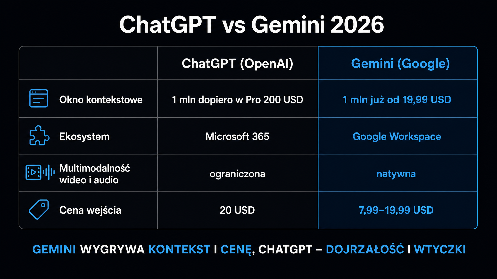

ChatGPT i Gemini to dziś dwa najpopularniejsze interfejsy konwersacyjne oparte na dużych modelach językowych (LLM – *Large Language Model*). Oba startują z tego samego poziomu – wpisujesz pytanie, a model generuje odpowiedź. Różnią się jednak w każdym kluczowym wymiarze: skąd czerpią wiedzę, ile kosztują, z czym się integrują i gdzie popełniają błędy. Jeśli wybierasz narzędzie do codziennej pracy lub rozważasz wdrożenie modelu w zespole, odpowiedź sprowadza się do jednego. Musisz ustalić, czy Twoje procesy toczą się w ekosystemie Google, czy poza nim.

## Modele i możliwości – czym dysponujesz w 2026 roku

OpenAI i Google od 2023 roku przyspieszyły tempo aktualizacji do niemal kwartalnego rytmu. Każda generacja drastycznie poszerza możliwości. Przy porównaniu liczy się więc nie tylko nazwa modelu, ale i konkretna data.

**ChatGPT w planie Plus (20 USD/mies.) daje dziś dostęp do GPT-5.6 Sol – flagowego modelu z rodziny GPT-5.6, dostępnej ogólnie od 9 lipca 2026 roku (zastąpiła GPT-5.5 z kwietnia).** Plan Pro za 100 USD/mies., uruchomiony 9 kwietnia 2026 roku, stanowi bezpośrednią konkurencję dla planu Claude Max. Pro daje 5× (100 USD) lub 20× (200 USD) wyższe limity niż Plus oraz większe okno kontekstowe – do 400 tysięcy tokenów w trybie rozumowania. Plan Free pozostaje bezpłatny, choć dostaje się w nim lżejszy wariant GPT-5.6 Luna z limitami. Warto też wspomnieć o tanim pakiecie Go za 8 USD/mies.

Po stronie Google obraz jest nieco bardziej skomplikowany. Model Gemini 3.1 Pro – z oknem kontekstowym 1 miliona tokenów i natywnym przetwarzaniem tekstu, obrazów, audio i wideo w jednym prompcie – jest dostępny w planie AI Pro (wcześniej Gemini Advanced / Google One AI Premium) za 19,99 USD/mies. Google oferuje również plan AI Ultra (od 99,99 USD/mies.) z priorytetowym dostępem do asystenta Gemini Spark. Najniższy płatny próg to AI Plus za 4,99 USD/mies. Zapewnia on dwukrotnie wyższe limity niż plan Free (oparty na Gemini 3.6 Flash) i 400 GB przestrzeni w Google Drive.

Na konferencji I/O 2026 (maj 2026) zapowiedziano nową generację modeli Gemini 3.5 Flash oraz Gemini Omni, a także ekosystem agentów Google Antigravity. Szersze wdrożenie tych nowości zaplanowano na kolejne miesiące 2026 roku. Obejmie ono również asystenta Spark z całodobową integracją z Gmailem.

### Okna kontekstowe i multimodalność

Okno kontekstowe decyduje o jednym. Określa, jak dużo materiału możesz wrzucić do zapytania bez dzielenia go na części.

- **ChatGPT Plus** – 54 000 tokenów w trybie Instant i 256 000 w trybie rozumowania; plan Pro rozszerza je do 128 000 i 400 000 tokenów (model GPT-5.6 Sol w API obsługuje 1,05 mln)
- **Gemini 3.1 Pro** – 1 milion tokenów w planie AI Pro
- **Gemini 3.6 Flash** – model planu Free, szybki i tańszy w przeliczeniu na token

**Gemini wygrywa tu kategorycznie – milionowy kontekst dostępny od 19,99 USD/mies. to możliwość wczytania całej dokumentacji projektu, kilkudziesięciu umów lub kilkugodzinnego nagrania wideo w jednej sesji.** W czacie ChatGPT nawet plan Pro kończy się na 400 tysiącach tokenów.

Multimodalność (obsługa wielu typów danych – tekstu, obrazu, dźwięku, wideo) jest w Gemini wbudowana na poziomie architektury modelu. ChatGPT obsługuje tekst i obraz natywnie, ale po zamknięciu aplikacji Sora (26 kwietnia 2026 roku) nie oferuje już generowania wideo.

<aside class="callout-fact">
  
✦

  

    
Ciekawostka

    
Gemini 3.1 Pro w wielu testach wydajności (benchmarkach) wyprzedza modele OpenAI w zadaniach agentycznych i natywnym przetwarzaniu kodu. <strong>To wyraźna przewaga flagowego modelu Google nad konkurencją w pierwszej połowie 2026 roku.</strong>

  

</aside>

## Integracja z ekosystemami – gdzie każdy model czuje się jak w domu

To kluczowy wymiar wyboru, który wiele zestawień po prostu pomija. Techniczne parametry modelu mają mniejsze znaczenie niż to, czy narzędzie wpisuje się w Twój codzienny zestaw aplikacji.

Gemini funkcjonuje wewnątrz produktów Google. W planie AI Pro asystent działa bezpośrednio w Gmailu (propozycje odpowiedzi, skrót wątku), Dokumentach (pisanie, streszczanie, przeformułowanie), Arkuszach (formuły, analiza danych), Prezentacjach i Google Meet. **Funkcja Deep Research w Gemini łączy się z Gmailem, Drive, Dokumentami i Chatem – model może przeszukiwać Twoje własne pliki i e-maile jako element procesu badawczego.** Dla zespołu pracującego w Google Workspace to realny skok produktywności. ChatGPT nie zaoferuje tego bez rozbudowanych integracji zewnętrznych.

ChatGPT jest znacznie silniejszy poza środowiskiem Workspace. Ekosystem OpenAI obejmuje ChatGPT Images 2.0 (generowanie obrazów), Whisper (transkrypcja mowy) i szybko rosnącą bibliotekę GPTs – wyspecjalizowanych asystentów tworzonych przez zewnętrznych deweloperów. Integracja z Microsoft 365 Copilot i bogata sieć konektorów API sprawiają, że ChatGPT idealnie wpisuje się w środowiska oparte na rozwiązaniach Microsoftu.

Przy wyborze sprawdź jeden kluczowy parametr. Ustal, czy Twoje pliki i e-maile leżą w Google Drive, czy w OneDrive i SharePoint. To zazwyczaj ostatecznie przesądza o decyzji.

## Głos i tryb mobilny – jak działają asystenci głosowi

Tryb głosowy to obszar, w którym obie platformy intensywnie inwestują. Mają tu jednak zupełnie inne priorytety.

Zaawansowany tryb głosowy ChatGPT (Advanced Voice Mode) – dostępny od planu Plus – zapewnia dwukierunkową rozmowę z minimalnym opóźnieniem. Daje możliwość płynnego przerywania wypowiedzi i zachowuje naturalny rytm konwersacji. Działa zarówno na urządzeniach mobilnych, jak i komputerach. **Tryb głosowy ChatGPT wygrywa pod względem naturalności dialogu – testy niezmiennie wskazują na wyższy komfort rozmowy.**

Gemini Live (tryb głosowy Gemini) jest z kolei przede wszystkim mobilny. Od momentu wdrożenia asystenta Spark oferuje całodobową integrację ze skrzynką Gmail – model potrafi aktywnie monitorować przychodzącą pocztę i proaktywnie alarmować o ważnych wiadomościach. To zupełnie inne podejście. Otrzymujesz nieco mniej naturalny dialog, ale znacznie szersze możliwości działania wewnątrz aplikacji.

## Prywatność, dane treningowe i zgodność z regulacjami (compliance)

Różnice w podejściu do prywatności danych mają kolosalne znaczenie. Szczególnie dla firm, które na co dzień pracują z informacjami wrażliwymi.

Oto najważniejsze fakty.

- **ChatGPT Free i Plus** – rozmowy mogą być domyślnie wykorzystywane do trenowania modeli, jeśli użytkownik nie wyłączy tej opcji w ustawieniach prywatności. Plany Business i Enterprise domyślnie izolują dane od procesów treningowych
- **Gemini AI Pro (konsumencki)** – Google stosuje podobne podejście. Dane z rozmów mogą być przeglądane i używane do poprawy usługi, natomiast w firmowych planach Google Workspace obowiązują osobne zasady ochrony danych
- **OpenAI SOC 2 Type II, ISO 27001** – certyfikaty dostępne od planu Business. Wersja Enterprise dodaje logowanie SSO, SCIM i niestandardowe zasady retencji danych
- **Google Workspace Enterprise** – dostępne umowy BAA dla HIPAA, DLP (zapobieganie wyciekom danych) i pełna zgodność z RODO

Dla regulowanych branż (fintech, medtech, prawo) oba rozwiązania mają ścieżkę enterprise z odpowiednimi certyfikatami. Ważne jest jednak jedno. **Nigdy nie zakładaj, że plany konsumenckie Plus i AI Pro chronią dane w ten sam sposób co pakiety Enterprise.**

<aside class="callout-expert">
  

  

    
Opinia eksperta

    
W projektach SEO i contentowych, które prowadzimy w ICEA, te dwa modele mają różne role. Gemini 3.1 Pro używamy do analizy dużych zbiorów URL, przetwarzania obszernych raportów Search Console i zadań wymagających wczytania całego korpusu treści jednocześnie. ChatGPT – do kreatywnych zadań pisarskich, generowania wariantów struktury artykułu i pracy z kodem. <strong>Jeśli masz wybrać jeden: sprawdź, czy Twój przepływ pracy zaczyna się od Google Drive, czy od pustego pola tekstowego.</strong>

    
Tomasz Czechowski · Head of SEO, ICEA

  

</aside>

## Duża tabela porównawcza – ChatGPT vs Gemini 2026

Poniżej znajdziesz zestawienie kluczowych parametrów dla obu platform. Dane odpowiadają stanowi na wrzesień 2026 r.

| Parametr | ChatGPT | Google Gemini |
|---|---|---|
| **Producent** | OpenAI | Google DeepMind |
| **Plan Free** | GPT-5.6 Luna z limitami, bez generowania wideo | Gemini 3.6 Flash, ograniczony dostęp do 3.1 Pro |
| **Plan podstawowy płatny** | Plus – 20 USD/mies. | AI Pro – 19,99 USD/mies. |
| **Tani plan wejściowy** | Go – 8 USD/mies. | AI Plus – 4,99 USD/mies. |
| **Plan zaawansowany** | Pro – 100–200 USD/mies. | AI Ultra – od 99,99 USD/mies. |
| **Flagowy model (wrzesień 2026)** | GPT-5.6 Sol | Gemini 3.1 Pro / Gemini 3.6 Flash |
| **Okno kontekstowe (Plus/Pro)** | 54 tys. / 256 tys. tokenów (Plus); 128 tys. / 400 tys. (Pro) | 1 mln tokenów (AI Pro i wyżej) |
| **Multimodalność** | Tekst + obraz | Tekst + obraz + audio + wideo (natywnie) |
| **Generowanie wideo** | Brak (aplikacja Sora zamknięta w kwietniu 2026) | Veo (od planu AI Plus; pełny dostęp do Veo 3.1 w Ultra) |
| **Generowanie obrazów** | ChatGPT Images 2.0 | Imagen (wbudowany) |
| **Tryb głosowy** | Advanced Voice Mode, desktop + mobile | Gemini Live; asystent Spark |
| **Integracja biurowa** | Przez Microsoft 365 Copilot | Natywna (Workspace: Gmail, Docs, Drive, Sheets) |
| **Deep Research** | Tak (pełny zakres od planu Plus) | Tak (integracja z Drive/Gmail) |
| **Przeszukiwanie sieci** | Tak | Tak (natywne Google Search) |
| **Ochrona danych treningowych** | Od planu Business | Plany firmowe Google Workspace |
| **API (dostępność)** | OpenAI API | Google AI Studio / Vertex AI |

## Kody i wnioskowanie – gdzie modele różnią się merytorycznie

[Przetwarzanie języka naturalnego](https://pl.wikipedia.org/wiki/Przetwarzanie_j%C4%99zyka_naturalnego) (NLP – *Natural Language Processing*) to wspólny fundament obu modeli. Mimo to każdy z nich wypracował zupełnie inne mocne strony w praktycznych zastosowaniach.

GPT-5.6 Sol i wcześniejsze modele rozumujące OpenAI dominują w benchmarkach matematycznych oraz kodowaniu sekwencyjnym. To zadania, w których wieloetapowe wnioskowanie krok po kroku jest absolutnie kluczowe. Modele te są również niezmiennie oceniane wyżej w zadaniach kreatywnych – generowaniu wariantów tekstów, strukturyzowaniu argumentacji czy pracy z briefami.

Gemini 3.1 Pro z kolei mocno wyróżnia się w zadaniach długokontekstowych. Błyszczy tam, gdzie analiza wymaga utrzymania uwagi przez milion tokenów bez „zapominania” wcześniejszych fragmentów dokumentu. Natywne przetwarzanie wideo i audio oznacza, że możesz wrzucić nagranie spotkania, transkrypcję rozmowy z klientem lub film instruktażowy, a model wygeneruje streszczenie bez konwersji formatu.
Istnieje tu prosta, praktyczna reguła. Jeśli Twoja praca to głównie pisanie, programowanie i analityka tekstowa – GPT-5.6 będzie bezpieczniejszym wyborem. Jeśli jednak regularnie pracujesz z dużymi dokumentami, nagraniami lub potrzebujesz modelu zintegrowanego z Google Workspace, to Gemini 3.1 Pro wykona to zadanie szybciej i bez dodatkowej konfiguracji.

## Werdykt dla poszczególnych scenariuszy – kto powinien wybrać co

Nie ma jednego „lepszego” modelu. Ostateczny wybór zawsze zależy od kontekstu użycia.

Wybierz ChatGPT Plus w następujących sytuacjach.

- **Zajmujesz się kreatywnym pisaniem i copywritingiem** – GPT-5.6 generuje lepsze warianty i trafniej interpretuje brief
- **Programujesz** – szczególnie w językach takich jak Python, JavaScript czy SQL. Ekosystem OpenAI API jest najczęściej wybierany przez deweloperów
- **Pracujesz w środowisku Microsoft 365 i Teams** – integracja przez Copilot działa tu od razu, bez zaawansowanej konfiguracji
- **Korzystasz z niestandardowych GPTs** – biblioteka specjalistycznych asystentów OpenAI jest niezwykle bogata

Postaw na Gemini AI Pro w poniższych przypadkach.

- **Twoje procesy opierają się na Google Workspace** – asystent działa bezpośrednio w Gmailu, na Dysku i w Dokumentach
- **Analizujesz obszerne dokumenty i długi kontekst** – raporty, umowy, dokumentacja. Milionowy kontekst dostępny jest już od 19,99 USD/mies.
- **Pracujesz z plikami wideo i audio** – zyskujesz natywną obsługę bez konwersji formatu i zewnętrznych wtyczek
- **Zwracasz uwagę na koszt za token w API** – modele z rodziny Flash kosztują znacznie mniej niż flagowe odpowiedniki OpenAI, co przy dużych wolumenach robi ogromną różnicę

**Jeśli używasz obu ekosystemów naprzemiennie, warto po prostu rozważyć oba plany bazowe.** Łączny koszt Plus i AI Pro to ok. 40 USD/mies., co w przypadku profesjonalnej pracy jest w pełni uzasadnioną inwestycją.

To, jak ChatGPT buduje swoją wiedzę i skąd czerpie dane o Twojej marce, szczegółowo opisuje [przewodnik po ChatGPT](/modele-llm/chatgpt/). Szerszy kontekst tego, jak modele językowe różnią się architektonicznie, znajdziesz z kolei w [przewodniku po modelach LLM](/modele-llm/przewodnik/).

Jeśli interesuje Cię, jak Twoja marka jest postrzegana przez ChatGPT i Gemini jednocześnie, narzędzie [Widoczność marki w AI](/narzedzia/brand-check/) wyśle zapytania do obu silników (i dwóch innych) za jednym razem. Zrobisz to bez żmudnego, ręcznego testowania. Szerszą strategię widoczności pod kątem konkretnego modelu opisują strony [pozycjonowanie w ChatGPT](/pozycjonowanie-ai/chatgpt/) i [pozycjonowanie w Gemini](/pozycjonowanie-ai/gemini/).

## Jak sprawdzić model przed zakupem planu?

Zanim zapłacisz abonament, wykonaj kilka kroków, które pozwolą Ci uniknąć rozczarowania.

- **Testuj na własnych zadaniach, a nie na przykładach z internetu** – wrzuć fragment swojego briefu lub dokumentu i sprawdź jakość odpowiedzi. Ogólne testy syntetyczne niewiele mówią o Twoim konkretnym przypadku użycia
- **Sprawdź integracje w Twoim zestawie narzędzi** – jeśli korzystasz z platform takich jak Notion, Slack lub Asana, oba modele mają dedykowane konektory. Różnią się jednak głębokością integracji
- **Oceń tryb głosowy na urządzeniu, którego używasz na co dzień** – Gemini Live świetnie sprawdza się mobilnie. Z kolei tryb głosowy ChatGPT oferuje doskonałe wrażenia na komputerach
- **Zweryfikuj politykę prywatności dla Twojej branży** – jeśli przetwarzasz dane klientów, koniecznie przed zakupem przeczytaj umowę powierzenia przetwarzania danych osobowych (DPA)

**Darmowe wersje obu platform są w zupełności wystarczające do oceny modelu przez 2–3 tygodnie.** Nie spiesz się z przejściem na plany Plus i AI Pro, dopóki nie zyskasz pewności, że podstawowe zadania są realizowane satysfakcjonująco.
