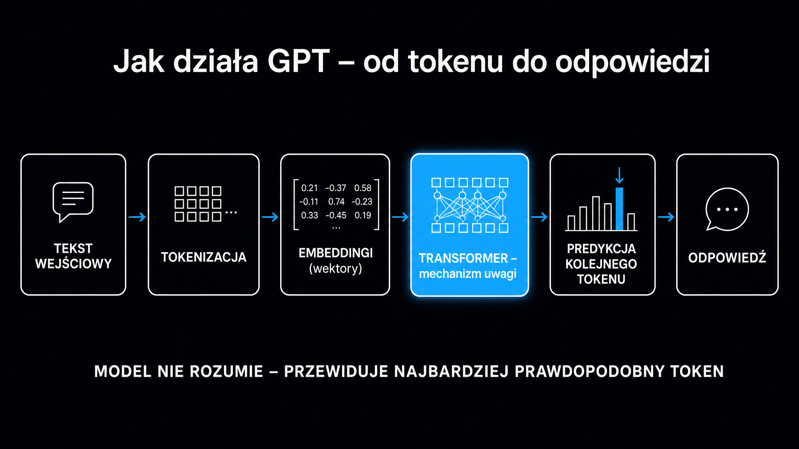

ChatGPT to interfejs konwersacyjny zbudowany na modelach z rodziny GPT (Generative Pre-trained Transformer) – dużych modelach językowych (LLM, Large Language Model) opracowanych przez OpenAI. Od swojego publicznego debiutu w listopadzie 2022 roku zgromadził milion użytkowników w pięć dni, a sto milionów w dwa miesiące – szybciej niż jakakolwiek inna aplikacja w historii. Jeśli dopiero zaczynasz pracę z AI lub chcesz wreszcie zrozumieć, co kryje się za tym interfejsem tekstowym, ten przewodnik wyjaśnia mechanizm, możliwości i realne ograniczenia – bez skrótów i bez żargonu, który więcej ukrywa, niż tłumaczy.

## Czym jest ChatGPT i jak wpisuje się w ekosystem OpenAI?

OpenAI to laboratorium badań nad sztuczną inteligencją założone w 2015 roku z misją rozwoju AI dla dobra ogółu. ChatGPT nie jest jedynym produktem firmy – to raczej najbardziej widoczna warstwa ekosystemu, który obejmuje modele, interfejsy programistyczne i wyspecjalizowane narzędzia.

Aby uporządkować te pojęcia na wstępie:

- **GPT** – seria modeli językowych (GPT-3, GPT-4, a obecnie rodzina GPT-5); sam model to „silnik", który przetwarza tekst
- **ChatGPT** – produkt konsumencki, interfejs czatu dostępny pod adresem chat.openai.com, napędzany aktualnym modelem GPT
- **OpenAI API** – programistyczny dostęp do modeli GPT, GPT Image i innych, używany przez deweloperów do budowy własnych aplikacji
- **GPT Image** – model do generowania obrazów z opisu tekstowego, wbudowany w ChatGPT (zastąpił DALL-E pod koniec 2025 roku)
- **Whisper** – model do transkrypcji i tłumaczenia mowy

ChatGPT jest dostępny w wersji przeglądarkowej i mobilnej, a od 2023 roku również jako wtyczka i element Microsoft 365 Copilot. **OpenAI udostępnia swoje modele przez API, co pozwala firmom zewnętrznym wbudowywać je we własne produkty** – dlatego ChatGPT pojawia się pośrednio w Bingu, w narzędziach do pisania, w obsłudze klienta i w dziesiątkach innych miejsc.

W kontekście widoczności marki w wyszukiwarkach AI: pełny obraz tego, co GPT „wie" o Twojej firmie i skąd czerpie tę wiedzę, opisuje [przewodnik po modelach LLM](/modele-llm/przewodnik/) – to dobry punkt wyjścia, zanim zaczniesz działania optymalizacyjne.

## Jak działa model GPT, od tokenów po odpowiedź?

**ChatGPT nie „szuka" odpowiedzi w bazie danych ani nie „pamięta" faktów jak encyklopedia.** Generuje tekst token po tokenie, przewidując za każdym razem, jaka sekwencja znaków jest najbardziej prawdopodobna w danym kontekście. To subtelna, ale fundamentalna różnica.

Model oparty jest na architekturze typu Transformer – typie [sieci neuronowej](https://pl.wikipedia.org/wiki/Sie%C4%87_neuronowa) zaprezentowanym w pracy „Attention is All You Need" (Vaswani et al., 2017). Wcześniejsze systemy przetwarzały tekst sekwencyjnie – słowo po słowie. Transformer przetwarza wszystkie tokeny wejścia równolegle, obliczając dla każdego z nich wagi mechanizmu uwagi względem pozostałych tokenów. Dzięki temu model potrafi śledzić relacje między słowami oddalonymi o setki pozycji w tekście.

### Tokenizacja i kontekst

Zanim model przetworzy zdanie, dzieli je na tokeny – podjednostki leksykalne mniejsze niż słowo (np. „pozycjonowanie" może być jednym lub kilkoma tokenami, zależnie od tokenizera). Flagowe modele z rodziny GPT-5 operują na oknie kontekstowym przekraczającym milion tokenów (wcześniejsze generacje GPT-4 były ograniczone do 128 000 tokenów). Milion tokenów to z grubsza obszerne repozytorium kodu albo kilka książek naraz. To oznacza, że model „widzi" całą bieżącą rozmowę naraz, bez konieczności „przypominania sobie" z poprzednich kroków.

Każdy token jest zamieniany na wektor liczbowy w wielowymiarowej przestrzeni. Mechanizm uwagi (ang. attention mechanism) oblicza dla każdej pary tokenów stopień ich semantycznej zależności. **Wynik to nie lista faktów, lecz matematyczna reprezentacja relacji między pojęciami** – dlatego model potrafi odpowiadać na pytania, których nigdy dosłownie nie widział w danych treningowych.

W uproszczeniu: kiedy piszesz „Jakie są zalety pracy zdalnej?", model nie sięga po gotową odpowiedź. Rozkłada zapytanie na tokeny, oblicza ich relacje ze wszystkimi kontekstami, jakie widział podczas treningu, i generuje odpowiedź jako ciąg tokenów o najwyższym łącznym prawdopodobieństwie w tym konkretnym kontekście. Każde słowo odpowiedzi wpływa na prawdopodobieństwo kolejnego. To dlatego modele są nieprzewidywalne przy powtórzeniu tego samego pytania – losowość jest wbudowana w mechanizm (parametr temperatury, ang. temperature, kontroluje, jak bardzo model „eksperymentuje" z rzadszymi tokenami).

### Trening i dostosowanie do rozmowy

Sam etap wstępnego trenowania (pre-training) na terabajtach tekstu z internetu, książek i kodu tworzy potężny silnik predykcyjny, który równie sprawnie generuje treści pomocne, co szkodliwe. OpenAI stosuje metodę RLHF (Reinforcement Learning from Human Feedback, czyli uczenie ze wzmocnieniem na podstawie ludzkich ocen), żeby ukierunkować model na generowanie użytecznych, bezpiecznych odpowiedzi.

Proces RLHF przebiega w trzech krokach. Po pierwsze, anotatorzy piszą przykładowe idealne odpowiedzi – model uczy się wzorca. Po drugie, ten sam model generuje kilka wariantów odpowiedzi na jedno pytanie, a anotatorzy je szeregują od najlepszej do najgorszej – na tej podstawie trenowany jest oddzielny model oceniający (reward model). Po trzecie, algorytm PPO (Proximal Policy Optimization) aktualizuje wagi modelu tak, żeby maksymalizował oceny modelu nagradzającego, jednocześnie nie odchodząc za daleko od wyjściowego rozkładu probabilistycznego.

Efekt: model, który nie tylko przewiduje prawdopodobny tekst, ale robi to w sposób, który ludzie oceniają jako pomocny i bezpieczny.

## Plany i możliwości – co oferuje każda wersja

ChatGPT dostępny jest w kilku planach. Poniższa tabela zestawia kluczowe różnice – stan na maj 2026:

| Plan | Cena | Dostęp do modeli | Kluczowe funkcje |
|---|---|---|---|
| Free | 0 USD/mies. | GPT-5.3 Instant (z limitem) | Czat, podstawowe generowanie obrazów, tryb głosowy; w niektórych krajach z reklamami |
| Go | 8 USD/mies. | Nielimitowany GPT-5.3 Instant | Plan dla codziennych użytkowników, wyższe limity niż Free |
| Plus | 20 USD/mies. | GPT-5.5, GPT-5.4 Thinking, GPT Image | Wyższe limity, Deep Research, Codex, priorytet w godzinach szczytu |
| Business | 25 USD/os./mies. | Jak Plus + priorytet dostępu | Przestrzeń zespołowa, izolacja danych od trenowania |
| Pro | 100–200 USD/mies. | GPT-5.5 Pro, Codex, brak limitów | Okno kontekstowe do 1 mln tokenów, rozszerzone limity Deep Research |
| Enterprise | Negocjowane | Jak Pro + opcje prywatne | SOC 2 Type II, SSO, niestandardowe retencje danych, wyższy limit kontekstu |

**Plan Free wystarczy do testowania i zadań sporadycznych.** Dla regularnej pracy – szczególnie gdy liczy się jakość i brak ograniczeń w dostępie do asystentów AI (tzw. copilotów) – Plus jest standardowym wyborem; daje dostęp do flagowego GPT-5.5, wydanego 23 kwietnia 2026 roku. Plany Pro (warianty 100 i 200 USD) celują w zaawansowanych profesjonalistów i programistów – rozszerzają okno kontekstowe do miliona tokenów i odblokowują GPT-5.5 Pro z najwyższym budżetem wnioskowania.

## Do czego używać ChatGPT – zastosowania w praktyce

Użytkownicy nierzadko traktują ChatGPT jako wyszukiwarkę. To błąd, który prowadzi do rozczarowań i ryzykownych decyzji. **ChatGPT sprawdza się tam, gdzie zadanie wymaga przetwarzania i transformacji tekstu, nie tam, gdzie potrzebne są sprawdzone, bieżące fakty.**

Obszary, w których model działa niezawodnie:

- **Pisanie i redakcja** – przeredagowanie tekstu, zmiana tonu, skracanie, tłumaczenie, korekta stylistyczna
- **Programowanie** – pisanie, debugowanie i tłumaczenie kodu; szczególnie mocne w popularnych językach (Python, JavaScript, SQL)
- **Analiza dokumentów** – wgranie pliku PDF lub arkusza i zadanie pytań o treść; ekstrakcja tabel, zestawień, kluczowych tez
- **Burza mózgów** – generowanie wariantów pomysłów, nazw, struktur artykułów, szkiców prezentacji
- **Nauka** – tłumaczenie skomplikowanych pojęć na prostszy język, generowanie przykładów, tworzenie fiszek

Obszary, w których należy zachować ostrożność:

- **Fakty i aktualne dane** – model ma datę odcięcia (cutoff date) i nie zna wydarzeń po niej; nawet przed datą odcięcia może „halucynować", czyli generować w przekonujący sposób informacje nieprawdziwe
- **Porady prawne, medyczne, finansowe** – użyteczne jako wstępny zarys, nie jako substytut specjalisty
- **Cytowania naukowe** – model może wygenerować bibliografię, która wygląda wiarygodnie, ale nie istnieje

Co ChatGPT potrafi, a co leży już poza nim – opisuje artykuł [co potrafi ChatGPT](/modele-llm/co-potrafi-chatgpt/), z praktycznymi testami przypadków brzegowych.

<aside class="callout-fact">
  
✦

  

    
Ciekawostka

    
ChatGPT osiągnął 100 milionów aktywnych użytkowników w ciągu dwóch miesięcy od debiutu – szybciej niż TikTok (9 miesięcy) i Instagram (2,5 roku). Dane z początku 2026 roku wskazują, że platforma obsługuje już ponad 900 milionów aktywnych użytkowników tygodniowo (WAU). <strong>To największa adopcja aplikacji konsumenckiej w historii.</strong>

  

</aside>

## Halucynacje – największe ograniczenie modelu

Halucynacja to sytuacja, w której model generuje odpowiedź syntaktycznie poprawną i sformułowaną w przekonujący sposób, ale merytorycznie błędną lub całkowicie wymyśloną. Termin wywodzi się z charakteru generowania: model nie szuka faktów – przewiduje prawdopodobny ciąg tokenów. Jeśli kontekst kieruje go w stronę rzadkiego obszaru przestrzeni wag, wygeneruje coś, co brzmi jak fakt, choć nim nie jest.

Halucynacje są szczególnie niebezpieczne, kiedy model podaje konkretne daty, nazwiska, tytuły publikacji lub ceny z pozorną pewnością. Kilka praktycznych reguł zmniejszających ryzyko:

- **Zawsze podawaj kontekst w pytaniu** – im bardziej precyzyjne zapytanie, tym mniejsza swoboda modelu
- **Weryfikuj liczby i cytowania zewnętrznie** – każde twierdzenie z liczbą sprawdź w niezależnym źródle przed użyciem
- **Wgrywaj dokumenty zamiast prosić o wiedzę z pamięci** – model operujący na wgranym pliku halucynuje znacznie rzadziej niż odpowiadający z danych treningowych
- **Stosuj technikę chain-of-thought** – poproś model, żeby „myślał głośno" krok po kroku; przekierowanie uwagi na rozumowanie redukuje błędy faktyczne

Generowanie wspomagane wyszukiwaniem (RAG – Retrieval-Augmented Generation) to architektoniczne rozwiązanie tego problemu stosowane przez Perplexity i Google AI Overviews: zamiast polegać wyłącznie na danych treningowych, model dynamicznie pobiera fragmenty stron i generuje na ich podstawie odpowiedź. ChatGPT z włączoną opcją wyszukiwania działa podobnie, choć mechanizm jest wewnętrznie inny.

## ChatGPT a pozycjonowanie Twojej marki w AI

Rosnąca liczba użytkowników, którzy zamiast Google wpisują pytania bezpośrednio w ChatGPT, tworzy nową kategorię widoczności. Dane Wall Street Journal z połowy 2025 roku pokazują, że 5,6% wszystkich zapytań w USA trafia już do LLM jako podstawowego narzędzia, a Gartner prognozuje, że do 2026 roku tradycyjne wyszukiwarki stracą 25% ruchu na rzecz interfejsów konwersacyjnych.

Jeśli potencjalny klient pyta „Które agencje SEO w Polsce specjalizują się w AI Search?" – to, czy Twoja marka pojawi się w odpowiedzi, zależy od kilku czynników: czy Twoje treści były w korpusie treningowym modelu, czy pojawiasz się w kontekście cytowań w wiarygodnych źródłach i czy inne modele (z dostępem do internetu) Cię „widzą". To zupełnie inne zmienne niż profil linków i zagęszczenie słów kluczowych, którymi rządzi się klasyczne SEO.

**To nie jest SEO. To oddzielna dyscyplina z własnymi metrykami – Citation Rate, Share of Voice i Mention Rate.**

Zrozumienie tych mechanizmów opisuje [przewodnik po GEO](/geo/przewodnik/) – optymalizacji pod generatywne wyszukiwarki. Jeśli interesuje Cię konkretna strona operacyjna – jak ChatGPT postrzega Twoją markę i jak to zmienić – wejdź na [pozycjonowanie w ChatGPT](/pozycjonowanie-ai/chatgpt/).

Zanim zaczniesz planować, sprawdź punkt startowy: darmowe narzędzie [Widoczność marki w AI](/narzedzia/brand-check/) zada zapytanie o Twoją markę czterem silnikom AI i pokaże, jak jesteś postrzegany na tle kategorii – bez ręcznego testowania.

<aside class="callout-expert">
  

  

    
Opinia eksperta

    
W projektach, które prowadzimy w ICEA, widzimy powtarzający się schemat: firmy dobrze zoptymalizowane pod Google nie pojawiają się w ChatGPT, bo ich treści są pisane pod słowa kluczowe, nie pod fakty. Model języka szuka gęstych, cytowalnych zdań z liczbami i nazwami badań – nie opisów ogólnych. <strong>Pierwsza rzecz, którą robię podczas audytu: szukam zdań, które mogłyby być zacytowane bez żadnego kontekstu. Jeśli ich nie ma, to problem numer jeden do naprawienia.</strong>

    
Tomasz Czechowski · Head of SEO, ICEA

  

</aside>
