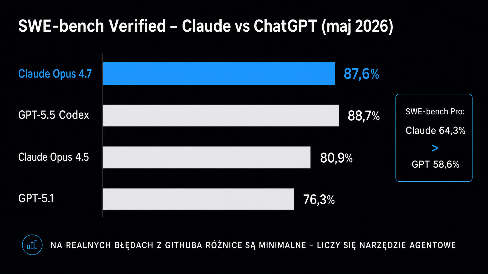

Jeśli piszesz kod produkcyjny z pomocą dużego modelu językowego (LLM – Large Language Model), wybór między Claude a ChatGPT przekłada się bezpośrednio na jakość kodu, koszty API i czas spędzony na poprawkach. Na syntetycznych zadaniach oba modele osiągają ponad 90% na HumanEval. Ten benchmark jest od lat nasycony. Prawdziwa różnica wychodzi na SWE-bench Verified, czyli zestawie realnych błędów z GitHuba, oraz w agentowych narzędziach Claude Code i Codex, które operują na całym repozytorium. Porównajmy oba ekosystemy technicznie, by wyłonić zwycięzców dla konkretnych scenariuszy.

## SWE-bench Verified – co mówi najbardziej wymagający punkt odniesienia

SWE-bench Verified to dziś najtrudniejsza publicznie dostępna miara zdolności kodowania modeli AI. Zamiast pisać nową funkcję od zera, model musi przeanalizować istniejące repozytorium Pythona, zlokalizować przyczynę błędu opisaną w zgłoszeniu (tickecie) z GitHuba i wygenerować łatkę. Ta musi przejść testy automatyczne. Z 500 zweryfikowanych przez człowieka problemów korzysta wiele niezależnych laboratoriów. Wyniki są więc w pełni porównywalne między firmami.

Wyniki opublikowane do maja 2026 roku pokazują silną przewagę Anthropic w tej kategorii. **Claude Opus 4.5 był pierwszym modelem, który przekroczył próg 80%, osiągając 80,9%.** Claude Opus 4.8, wydany 28 maja 2026 roku, uzyskał 88,6% (poprzedni Opus 4.7 – 87,6%; dane: [BenchLM.ai](https://benchlm.ai/benchmarks/sweVerified)), a niedostępny publicznie Claude Mythos Preview – 93,9% według Anthropic. Na trudniejszym SWE-bench Pro GPT-5.5 zanotował 58,6%, a Claude Opus 4.8 prowadził z wynikiem 69,2% (Opus 4.7 – 64,3%). Od tego czasu obie firmy wydały nowe modele – rodzinę GPT-5.6 (lipiec 2026) i GPT-6 Astra (w API od 3 września 2026) oraz Claude Sonnet 5 (czerwiec 2026), Opus 5 (lipiec 2026) i Fable 5.1 – ale Anthropic w zapowiedzi Opus 5 nie podał wyniku SWE-bench Verified, więc powyższe liczby trzeba traktować jako stan z maja 2026, a nie aktualny ranking.

Co te liczby znaczą w praktyce? SWE-bench wymaga analizy wielu plików jednocześnie. Model musi śledzić zależności między modułami, zrozumieć historię zmian i napisać łatkę, która nie wywali innych testów. **To dokładnie ten typ pracy, który zajmuje programistom długie godziny.**

<aside class="callout-fact">
  
✦

  

    
Ciekawostka

    
SWE-bench Verified powstał przy udziale OpenAI, które opublikowało metodologię weryfikacji w sierpniu 2024 roku. Paradoksalnie, to modele Anthropic konsekwentnie dominują w tym zestawieniu od połowy 2025 roku. <strong>Codex-1 – wyspecjalizowany model OpenAI zoptymalizowany pod kątem inżynierii oprogramowania – osiągnął w maju 2025 roku 72,1%, pokonując wtedy o3 (69,7%), a kilka miesięcy później Claude Opus 4.5 przekroczył już 80%.</strong>

  

</aside>

### HumanEval i MBPP – gdzie benchmarki przestają rozróżniać modele

Na HumanEval (generowanie funkcji Pythona z opisu w języku naturalnym) już w 2024 roku Claude 3.5 Sonnet i GPT-4o osiągały odpowiednio 92% i 90,2%. Przy takich wynikach różnica zaciera się w codziennym użyciu. **Dla prostych zadań generowania kodu oba modele są praktycznie równoważne – wybór zależy wtedy od ekosystemu, a nie od zdolności modelu.**

Nasycenie HumanEval przez wiodące modele sprawiło, że branża przeniosła się na trudniejsze benchmarki. Na SWE-bench Pro – zestawie bardziej złożonych, wieloplikowych problemów – rozstrzał między modelami rośnie. To właśnie tutaj widać rzeczywistą przewagę Claude'a w złożonym rozumowaniu nad kodem. Pełny profil możliwości modelu i jego historię opisuje [artykuł o Claude](/modele-llm/claude/), a odpowiednik po stronie OpenAI – [artykuł o ChatGPT](/modele-llm/chatgpt/).

## Claude Code vs Codex – dwa różne modele pracy agentowej

Claude Code i Codex (narzędzie OpenAI) to agentowe interfejsy CLI (interfejsy wiersza poleceń) do pracy z całym repozytorium. Oba modele potrafią czytać pliki, uruchamiać testy, tworzyć gałęzie i proponować pull requesty. Robią to jednak w fundamentalnie inny sposób.

**Claude Code działa przede wszystkim lokalnie.** Instalujesz go za pomocą natywnego skryptu instalacyjnego (zalecana metoda), programu `brew`, `winget`, menedżerów pakietów Linuksa lub `npm`. Wskazujesz katalog projektu, a narzędzie operuje bezpośrednio na Twoich plikach. Czyta całą strukturę repozytorium, uruchamia polecenia w powłoce systemowej, naprawia błędy kompilacji i zatwierdza zmiany (tworzy commity) do gita. Model ma pełny odczyt i zapis. Daje mu to kontekst niedostępny dla narzędzi bazujących na zrzutach ekranu czy selekcji fragmentów kodu.

**Codex łączy pracę lokalną i chmurową.** Codex CLI i rozszerzenie IDE działają na Twoim komputerze, natomiast w Codex cloud każde zadanie uruchamia się w izolowanym kontenerze po stronie OpenAI. To architektura preferowana przy równoległym delegowaniu wielu zadań. Codex cloud może obsługiwać kilka zgłoszeń jednocześnie, bez blokowania Twojego terminala. Operuje jednak na kopii repozytorium w kontenerze, a nie na Twoim rzeczywistym środowisku.

Różnice w praktyce (lokalny Claude Code kontra Codex cloud):

- **Kontekst środowiskowy** – lokalny Claude Code widzi Twoje zmienne środowiskowe, lokalne bazy danych i uruchomione serwisy, podczas gdy Codex cloud operuje w sandboxie izolowanym od lokalnej infrastruktury
- **Latencja** – praca lokalna nie wymaga przesyłania plików, natomiast Codex cloud przenosi repozytorium do kontenera i z powrotem
- **Bezpieczeństwo kodu** – Codex cloud nie widzi lokalnych kluczy API ani haseł w `.env`, za to lokalny agent ma dostęp do systemu plików w granicach nadanych uprawnień
- **Równoległość** – Codex cloud jest projektowany z myślą o wielu zadaniach uruchamianych równolegle w chmurze

Jeśli chcesz głębiej zrozumieć, jak agentowe narzędzia do kodowania wpisują się w szerszy ekosystem automatyzacji, [przewodnik po agentach AI](/agenci-ai/przewodnik/) opisuje architekturę wieloagentowych przepływów pracy.

## Tabela porównawcza – modele, narzędzia, ceny, benchmarki

Zestawienie najważniejszych parametrów obu ekosystemów ułatwia podjęcie decyzji. Ceny i okna kontekstowe dotyczą modeli aktualnych we wrześniu 2026 roku, a wyniki benchmarków – ostatnich opublikowanych porównań (maj 2026). Ceny API podane są dla wejścia i wyjścia w przeliczeniu na milion tokenów.

| Parametr | Claude (Anthropic) | ChatGPT / Codex (OpenAI) |
|---|---|---|
| **SWE-bench Verified (maj 2026)** | 88,6% (Opus 4.8) | – |
| **SWE-bench Pro (maj 2026)** | 69,2% (Opus 4.8) | 58,6% (GPT-5.5) |
| **HumanEval (mid-tier, 2024)** | 92% (Claude 3.5 Sonnet) | 90,2% (GPT-4o) |
| **Cena API – balans (in/out)** | $2/$10 za 1M tokenów (Sonnet 5) | $2/$12 za 1M tokenów (GPT-5.6 Terra) |
| **Cena API – flagship (in/out)** | $5/$25 za 1M tokenów (Opus 5) | $4/$20 za 1M tokenów (GPT-5.6 Sol, cena promocyjna) |
| **Cena API – najmocniejszy model (in/out)** | $10/$50 za 1M tokenów (Fable 5.1) | $10/$50 za 1M tokenów (GPT-6 Astra, tylko API) |
| **Cena API – ekonomiczny** | $1/$5 za 1M tokenów (Haiku 4.5) | $0,20/$1,20 za 1M tokenów (GPT-5.6 Luna) |
| **Okno kontekstowe** | 1 000 000 tokenów (Fable 5.1, Opus 5, Sonnet 5) | 1 050 000 tokenów (GPT-6 Astra, GPT-5.6) |
| **Agent do kodowania** | Claude Code (terminal, IDE, desktop, web) | Codex CLI i IDE (lokalnie) + Codex cloud (chmura) |
| **Tryb wykonania agenta** | głównie lokalny (filesystem) | hybrydowy (lokalny CLI + chmurowy kontener) |
| **Dostęp do narzędzi** | MCP (otwarty standard) | Function Calling, Responses API |
| **Plan subskrypcji z agentem** | Pro ($20/mies.) lub Max ($100–200/mies.) | ChatGPT Plus ($20/mies.) lub Pro (od $100/mies.; nowe zapisy na wariant $200 wstrzymane) |
| **Prompt caching (odczyt)** | $0,20/1M tokenów (Sonnet 5) | $0,20/1M tokenów (GPT-5.6 Terra) |

Warto doprecyzować kilka kwestii. W klasie zbalansowanej Sonnet 5 i GPT-5.6 Terra kosztują tyle samo na wejściu, a Sonnet jest nieco tańszy na wyjściu. U obu dostawców odczyt z cache kosztuje 10% ceny wejścia, więc przy długich sesjach agentowych, gdzie ten sam kontekst projektu przesyła się wielokrotnie, koszt pojedynczego żądania mocno spada. We flagowcach relacja się odwraca – GPT-5.6 Sol w cenie promocyjnej ($4/$20) jest tańszy od Claude Opus 5 ($5/$25). Na samej górze oferty cenniki się zrównują – GPT-6 Astra i Claude Fable 5.1 kosztują po $10/$50. **Rzeczywisty koszt miesięczny zależy bardziej od liczby i długości sesji agentowych niż od różnic w cennikach, dlatego warto go zmierzyć na własnym repozytorium.**

## Jakość kodu w praktyce – gdzie naprawdę widać różnicę

Benchmarki to mierzalny punkt wyjścia. W codziennej pracy programistów powtarzają się jednak inne obserwacje. Nie trafiają one do tabel, a bywają decydujące przy wyborze narzędzia.

**Claude wyróżnia się w złożonych refaktoryzacjach, gdzie konieczne jest śledzenie zależności przez wiele plików jednocześnie.** Milionowe okno kontekstowe to nie tylko marketing. Model potrafi wczytać całe repozytorium średniej wielkości (do ~700 tys. tokenów kodu), przeanalizować historię zmian i zaproponować refaktoryzację spójną z istniejącymi wzorcami. Warto jednak zaznaczyć, że w 2026 roku OpenAI nadrobiło te zaległości. Już GPT-5.5 dysponował oknem powyżej miliona tokenów, a obecne GPT-5.6 i GPT-6 Astra obsługują 1,05 mln (w przeciwieństwie do starszego GPT-4o, który bywał zmuszony do wycinania kontekstu lub korzystania ze strategii streszczania, przez co traciło się szczegóły).

Najmocniejszym modelem OpenAI jest od 3 września 2026 GPT-6 Astra (10/50 USD za 1M tokenów, okno 1,05 mln) – dostępny w API, ale nie w ChatGPT, gdzie najwyższą półkę nadal zajmuje GPT-5.6 Sol (w API 4/20 USD w cenie promocyjnej, okno 1,05 mln). Po stronie Anthropic domyślnie polecanym modelem jest Claude Opus 5 (5/25 USD, okno 1 mln), a do najbardziej wymagających zadań dostępny jest Claude Fable 5.1 (10/50 USD). Z kolei ChatGPT i GPT-5.6 pokazują przewagę przy generowaniu kodu szablonowego (boilerplate) i pracy z mniej popularnymi frameworkami. Ekosystem OpenAI jest rozleglejszy, a model widywał więcej różnorodnego kodu w danych treningowych. Jeśli piszesz szybki skrypt w niszowej bibliotece, Codex często proponuje działający prototyp już w pierwszej iteracji.

Przy pracy w językach innych niż angielski różnica jest mniejsza, ale wciąż widoczna. Modele OpenAI radzą sobie lepiej z generowaniem komentarzy i dokumentacji po polsku. Dla samego kodu (logika, algorytmy, architektura) język naturalny nie ma oczywiście żadnego znaczenia.

<aside class="callout-expert">
  

  

    
Opinia eksperta

    
W projektach, gdzie prowadzę analizę kodu w ICEA – audyty architektury, refaktoryzacje starszych systemów w Pythonie i TypeScript – Claude konsekwentnie wygrywa tam, gdzie sesja trwa ponad godzinę i dotyka dziesiątek plików. Modele OpenAI bywają szybsze przy izolowanych zadaniach: wygeneruj test, napraw jeden endpoint, dodaj walidację. <strong>Moja praktyczna reguła: Claude Code do pracy głębokiej (cała gałąź, cały sprint), ChatGPT/Codex do pracy punktowej (jedno zadanie, jeden kontekst).</strong>

    
Tomasz Czechowski · Head of SEO, ICEA

  

</aside>

## Agentowe przepływy pracy – MCP, Function Calling i integracje

Oba ekosystemy oferują mechanizmy łączenia modelu z zewnętrznymi narzędziami. Podchodzą jednak do tego problemu zupełnie inaczej.

Claude dostarcza MCP (Model Context Protocol) – otwarty standard, który pozwala modelowi łączyć się z zewnętrznymi źródłami danych i narzędziami przez ustrukturyzowany protokół. MCP jest niezależny od producenta. Możesz zbudować konektor MCP do własnej bazy danych, wewnętrznego narzędzia CI/CD czy systemu zgłoszeń i używać go z Claude'em bez modyfikacji. Coraz więcej platform (IDE, serwery CI, CRM-y) dostarcza gotowe konektory tego typu.

OpenAI idzie drogą Function Calling i Responses API. To ścieżka bardziej dojrzała technologicznie, z większą bazą gotowych integracji w zewnętrznych bibliotekach. Po stronie ChatGPT dostępny jest też GPT Store z wyspecjalizowanymi asystentami (GPTs).

**Kluczowa różnica dla zespołów budujących własne narzędzia sprowadza się do otwartości.** MCP jest przenośny między dostawcami, podczas gdy Function Calling to de facto standard branżowy z lepszym wsparciem w bibliotekach open source (LangChain, LlamaIndex, AutoGen). Jeśli Twój stos technologiczny (stack) opiera się na frameworkach agentowych, Function Calling zapewni Ci gotowe konektory. MCP jest nowszy i jego wsparcie rośnie, ale wciąż musi doganiać konkurencję.

Architekturę wieloagentowego przepływu pracy z użyciem obu ekosystemów opisuje szerzej [przewodnik po modelach LLM](/modele-llm/przewodnik/) – z omówieniem tego, kiedy warto mieszać modele zamiast polegać na jednym.

## Ceny API i koszt w agentowych sesjach

Surowe ceny tokenów to tylko część rachunku. Przy agentowych przepływach pracy model wykonuje dziesiątki zapytań na zadanie, a każde z nich zawiera pełny kontekst projektu w prefiksie. To właśnie tutaj mechanizmy buforowania (prompt caching) decydują o tym, ile naprawdę zapłacisz.

Anthropic oferuje prompt caching dla Sonnet 5 za $0,20/1M tokenów wejściowych (przy oryginalnej cenie $2). To 10-krotna redukcja kosztów dla tych samych tokenów kontekstowych. **W typowej sesji Claude Code, gdzie systemowy kontekst projektu (pliki konfiguracyjne, główne moduły) jest wielokrotnie przesyłany, większość tokenów wejściowych może być rozliczana po stawce z cache.**

Dla OpenAI cached input GPT-5.6 Terra kosztuje $0,20/1M tokenów, a GPT-5.6 Sol – $0,40/1M tokenów (w obu przypadkach 10% ceny standardowej). Po przeliczeniu rzeczywistego kosztu na sesję modele wychodzą więc bardzo blisko siebie.

Orientacyjny dobór modelu do intensywności pracy:

- **Lekkie użycie** (skrypty, eksperymenty) – wystarczą tańsze modele, np. Claude Haiku 4.5 lub GPT-5.6 Luna
- **Regularna praca** (daily coding assistant) – modele zbalansowane: Claude Sonnet 5 lub GPT-5.6 Terra
- **Intensywna praca z agentami** (Claude Code / Codex, cały dzień roboczy) – flagowce Claude Opus 5 lub GPT-5.6 Sol, często korzystniej w ramach subskrypcji niż w rozliczeniu za tokeny; po najdroższe Claude Fable 5.1 i GPT-6 Astra ($10/$50) warto sięgać tylko przy zadaniach, z którymi flagowce sobie nie radzą

Subskrypcja ChatGPT Pro (od $100/mies.; nowe zapisy na wariant za $200 są obecnie wstrzymane) obejmuje dostęp do Codex i modeli GPT-5.6 bez dodatkowych opłat za token. Dla zaawansowanych użytkowników narzędzi agentowych może to być znacznie korzystniejsze niż model płatności za zużycie (pay-as-you-go) w Anthropic. Claude oferuje analogicznie plan Max ($100–200/mies.) z wyższymi limitami, ale rozliczenia tokenowe nadal obowiązują przy przekroczeniu puli.

Pełny przegląd modeli i ich pozycjonowania cenowego – razem z alternatywami ekonomicznymi dla różnych wolumenów użycia – zestawia przewodnik po modelach LLM dostępny w sekcji powyżej.

## Werdykty dla poszczególnych scenariuszy

Oba narzędzia są wysoce kompetentne. Wybór zależy od charakteru pracy, a nie od tego, który model jest obiektywnie „lepszy".

Scenariusze, w których Claude wygrywa wyraźnie:

- **Duże refaktoryzacje wieloplikowe** – milionowe okno kontekstowe pozwala na pracę z całym projektem bez przycinania kontekstu (truncation), a SWE-bench Verified potwierdza przewagę w złożonej analizie kodu
- **Długie sesje analityczne** – analiza architektury, przegląd (review) całej gałęzi czy migracje między frameworkami to zadania, w których Claude utrzymuje spójność kontekstu przez długie godziny pracy
- **Praca z wewnętrznym stosem technologicznym** – Claude Code z MCP łatwo integruje się z wewnętrznymi narzędziami przez otwarty protokół i nie wymaga gotowych wtyczek z katalogu

Scenariusze, w których ChatGPT / Codex wygrywa lub remisuje:

- **Szybkie skrypty i kod szablonowy (boilerplate)** – modele OpenAI mają duże doświadczenie z różnorodnymi frameworkami, dzięki czemu prototyp w niszowej bibliotece często działa od razu
- **Równoległe zadania asynchroniczne** – Codex w trybie chmurowym obsługuje wiele zgłoszeń jednocześnie w izolowanych kontenerach, bez obciążania lokalnej maszyny
- **Zespoły w ekosystemie OpenAI** – jeśli używasz już GPT-5.6 w innych procesach, Codex CLI integruje się bez dodatkowej konfiguracji kont i kluczy API
- **Dokumentacja i komentarze w języku polskim** – modele z rodziny GPT generują czytelniejszy tekst w rzadszych językach

Przy budowaniu agentów AI opartych na [uczeniu maszynowym](https://pl.wikipedia.org/wiki/Uczenie_maszynowe) oba modele oferują wystarczające możliwości. Wybór modelu bazowego to znacznie mniej ważna decyzja niż architektura samego agenta.

Jeśli dopiero wybierasz model do nowego projektu, skonfiguruj tymczasowy dostęp do obu ekosystemów. Przetestuj je na reprezentatywnym zadaniu ze swojego repozytorium. **Różnica między modelami na Twoim konkretnym kodzie powie Ci więcej niż jakikolwiek benchmark.**
