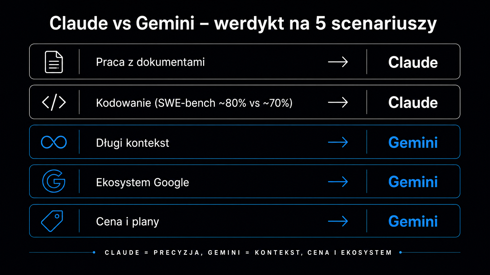

Claude i Gemini to dziś dwie najpoważniejsze alternatywy dla ChatGPT w codziennej pracy zawodowej – a różnica między nimi jest na tyle wyraźna, że zły wybór realnie spowalnia pracę. Claude od Anthropic wyróżnia się precyzją instrukcji i jakością pisania; Gemini od Google wygrywa integracją z ekosystemem Workspace i szerokim kontekstem. Ten artykuł dzieli porównanie na pięć konkretnych scenariuszy: praca z dokumentami, kodowanie, długi kontekst, środowisko Google oraz cena i plany – i dla każdego wskazuje wyraźnego zwycięzcę. Żadnych remisów na potrzeby dyplomacji.

## Szybkie zestawienie – Claude vs Gemini w tabelce

Zanim przejdziesz do szczegółów, ta tabela daje przekrój przez obie platformy. Dane aktualne na maj 2026 r. według oficjalnych cenników Anthropic i Google.

| Kryterium | Claude (Sonnet 4.6 / Opus 4.8) | Gemini (3.1 Pro) |
|---|---|---|
| Producent | Anthropic | Google DeepMind |
| Okno kontekstowe | do 1M (Sonnet i Opus) | 1M tokenów |
| SWE-bench Verified | ~80–89% | ~80,6% (3.1 Pro) |
| Cena API (input/output) | $3/$15 (Sonnet), $5/$25 (Opus) | $2/$12 (3.1 Pro, ≤200K) |
| Plan dla osób prywatnych | Claude.ai Pro – $20/mies. | Google AI Pro – $19,99/mies. |
| Plan premium | Claude.ai Max – $100–200/mies. | Google AI Ultra – $100–200/mies. |
| Integracja z Google Workspace | Brak natywnej | Natywna (Gmail, Docs, Drive) |
| Dostęp do sieci | Przez Computer Use / projekty | Natywny Google Search |
| Język interfejsu | Angielski + wielojęzyczny | Wielojęzyczny, PL dostępny |
| Mocna strona | Analiza, pisanie, kod, kontekst | Ekosystem Google, multimedia, cena |

**Flagowy Claude Opus 4.8 osiąga 88,6% na SWE-bench Verified – wyraźnie przed Gemini 3.1 Pro (80,6%).** W klasie średniej Claude Sonnet 4.6 (79,6%) i Gemini 3.1 Pro wypadają niemal równo, więc decydująca przewaga Claude w kodowaniu ujawnia się dopiero na poziomie modelu flagowego.

## Praca z dokumentami – kto głębiej analizuje

Analiza dokumentów to jeden z najczęstszych powodów, dla których firmy sięgają po modele AI w pracy. Liczy się nie tylko to, czy model przeanalizuje plik PDF, ale czy wyciągnie właściwe wnioski, nie pominie sprzeczności i nie wymyśli faktów.

**Claude wyróżnia się tutaj dokładnością i odpornością na halucynacje w tekstach pisanych.** W testach przeprowadzonych przez LumiChats (2026) na rzeczywistych dokumentach prawnych, artykułach naukowych i podręcznikach akademickich Claude konsekwentnie produkował głębszą analizę ze znacznie niższym wskaźnikiem błędów faktograficznych. Gemini radziło sobie lepiej przy zadaniach wymagających przetworzenia wielu dokumentów jednocześnie – szeroki kontekst był tu atutem.

Dla firm prawniczych i consultingowych, które potrzebują precyzji w pojedynczym dokumencie, wybór jest oczywisty: Claude. Kto musi przetworzyć setki plików naraz i nie zależy mu na każdym słowie, skorzysta z szerszego okna Gemini.

Kilka aspektów, w których Claude wygrywa przy dokumentach:

- **Śledzenie sprzeczności** – model sygnalizuje, gdy dwa fragmenty dokumentu są ze sobą niezgodne
- **Precyzja cytowań** – przy zapytaniu „znajdź zdanie o X" wskazuje konkretny ustęp, nie parafrazuje ogólnie
- **Instrukcje formatowania** – Claude stosuje się do szczegółowych wytycznych dotyczących struktury danych wyjściowych z bardzo wysoką konsekwencją

Gemini ma tu jedną konkretną przewagę: natywny dostęp do wyszukiwarki Google pozwala weryfikować fakty z dokumentu w czasie rzeczywistym podczas analizy. To przydatne przy plikach zawierających dane rynkowe czy daty.

<aside class="callout-fact">
  
✦

  

    
Ciekawostka

    
Duże modele językowe (LLM – ang. <em>Large Language Models</em>) są trenowane na danych liczonych w bilionach tokenów, ale zdolność do <strong>utrzymania spójności przez długi dokument</strong> to osobna umiejętność. Badania pokazują, że modele często „tracą uwagę" w środkowej części długiego kontekstu – zjawisko znane jako <strong>lost-in-the-middle</strong>. Claude Opus 4.7 osiąga 76% trafnych odpowiedzi na teście MRCR v2 przy milionowym kontekście; Sonnet poprzedniej generacji uzyskiwał zaledwie 18,5%.

  

</aside>

## Kodowanie – gdzie przewaga Claude rośnie wraz z klasą modelu

To obszar, w którym dane są najbardziej jednoznaczne. SWE-bench Verified to branżowy punkt odniesienia do pomiaru zdolności modeli w rozwiązywaniu rzeczywistych zgłoszeń błędów (bugów) w repozytoriach GitHub – nie zadań syntetycznych, ale prawdziwego kodu produkcyjnego.

**Flagowy Claude Opus 4.8 (wydany 28 maja 2026) uzyskuje 88,6% na SWE-bench Verified, wyprzedzając Gemini 3.1 Pro (80,6%) o ok. 8 punktów.** W klasie średniej Claude Sonnet 4.6 (79,6%) wypada niemal równo z Gemini 3.1 Pro – decydująca przewaga Claude leży więc w modelu flagowym, co potwierdzają też pomiary z LM Council (maj 2026).

W praktyce ta różnica oznacza mniej iteracji przy debugowaniu i większą szansę na poprawne działanie kodu za pierwszym razem. Przy stawce programisty seniorskiego czas to pieniądz – jeden zaoszczędzony cykl poprawek może uzasadnić wyższy koszt tokenów.

Gemini ma za to mocną pozycję w tworzeniu front-endu i interfejsów webowych, plasując się w czołówce rankingu WebDev Arena Leaderboard, mierzącego preferencje ludzkich oceniających przy budowaniu aplikacji internetowych (o szczyt tego zestawienia rywalizuje obecnie z modelami Claude). Jeśli tworzysz prototypy UI lub piszesz CSS/HTML, Gemini może być szybszą ścieżką do estetycznego wyniku.

Narzędzie Claude Code (interfejs wiersza poleceń, czyli CLI) idzie krok dalej niż samo generowanie kodu – obsługuje pełny cykl: odczyt repozytorium, uruchamianie testów, tworzenie gałęzi i Pull Requestów. Gemini nie ma odpowiednika tej głębokości integracji z terminalem poza ekosystemem Google Colab.

## Długi kontekst – kiedy masz 200 stron do przejrzenia

Okno kontekstowe decyduje o tym, ile danych możesz podać modelowi w jednym zapytaniu. Claude Sonnet 4.6 obsługuje 500 tysięcy tokenów w interfejsie czatu (ok. 375 000 słów, czyli kilka obszernych raportów naraz), a przez API i Claude Code – pełny milion. Claude Opus 4.8 również oferuje okno 1 miliona tokenów.

Gemini 3.1 Pro oferuje 1 milion tokenów jako standard w każdym planie, bez konieczności sięgania po najdroższą wersję modelu.

Co to oznacza w praktyce? Kilka scenariuszy:

- **Analiza całej bazy kodu** – przy projekcie liczącym 50 000+ linii kodu Gemini 3.1 Pro może wczytać całość za jednym razem; Claude Sonnet wymaga podziału na sesje
- **Przegląd dokumentacji technicznej** – specyfikacja produktu licząca 800+ stron mieści się w kontekście obu modeli flagowych
- **Transkrypty spotkań i notatki z całego kwartału** – tu wystarczy Sonnet z 200K tokenów dla większości firm

Warto pamiętać o jednym: duże okno kontekstowe to nie gwarancja dobrej jakości wnioskowania na całym materiale. Claude Opus uzyskuje 76% dokładności przy teście MRCR v2 (wydobywanie informacji z milionowego kontekstu), co jest wynikiem znacząco wyższym niż w przypadku wcześniejszych generacji modeli. Dla AI, które nie zostało zoptymalizowane pod tym kątem, szeroki kontekst bywa jedynie iluzją możliwości.

**Jeśli Twoja praca wymaga regularnego przetwarzania bardzo dużych zbiorów danych w jednym prompcie, Gemini 3.1 Pro daje ten sam rozmiar okna za niższą cenę tokenu.** Jeśli priorytetem jest jakość wnioskowania na długim dokumencie, Claude Opus jest bezpieczniejszym wyborem.

<aside class="callout-expert">
  

  

    
Opinia eksperta

    
W projektach analitycznych, które prowadzimy w ICEA – audytach treści, przeglądach setek adresów URL, analizie obszernych briefów klientów – regularnie sięgamy po oba modele na różnych etapach pracy. Gemini sprawdza się przy wstępnym przetwarzaniu dużych zbiorów danych i przy zadaniach zintegrowanych z Gmailem lub Docs. Claude jest naszym wyborem tam, gdzie liczy się jakość końcowego produktu: analizy, rekomendacje, treści. <strong>Złota reguła, którą stosuję: Gemini do szerokości, Claude do głębokości.</strong>

    
Tomasz Czechowski · Head of SEO, ICEA

  

</aside>

## Ekosystem Google vs Claude – zintegrowany kontra niezależny

Dla osób korzystających z Google Workspace na co dzień – Gmail, Dokumenty, Arkusze, Drive, Meet – Gemini jest trudne do pobicia z jednego powodu: natywna integracja. Model jest wbudowany bezpośrednio w interfejsy tych narzędzi. Możesz poprosić Gemini o podsumowanie wątku mailowego, zaproponowanie odpowiedzi na maila, przejrzenie dokumentu w Docs czy analizę danych w Arkuszach – bez kopiowania i wklejania treści do osobnego okna przeglądarki.

Claude nie ma takiej integracji natywnej. Do pracy z materiałami z Google Drive trzeba pobrać plik, wkleić treść lub skorzystać z zewnętrznych integracji przez protokół MCP (Model Context Protocol – otwarty standard Anthropic dla połączeń z zewnętrznymi narzędziami i źródłami danych). To działa, ale wymaga kilku dodatkowych kroków.

Kiedy sytuacja się odwraca? Kiedy używamy funkcji Claude Projects. Pozwala ona budować stałe środowisko robocze z wczytanymi dokumentami, instrukcjami i kontekstem, który utrzymuje się między sesjami. W dłuższych projektach – kampaniach marketingowych, analizach SEO, pracy z jednym klientem przez wiele tygodni – Projects daje spójność, której Gemini nie oferuje w tak przystępnej formie.

Podsumowanie różnic w integracji:

- **Gemini** – wygrywa, gdy jesteś głęboko w ekosystemie Google (Gmail, Docs, Meet, Colab), a większość Twojej pracy dzieje się w tych narzędziach
- **Claude** – wygrywa, gdy pracujesz na własnych plikach i dokumentach, chcesz precyzji i długoterminowego kontekstu projektu, a ekosystem Google nie jest centrum Twojej pracy

Warto też wspomnieć o [dużych modelach językowych](https://pl.wikipedia.org/wiki/Du%C5%BCy_model_j%C4%99zykowy) w kontekście biznesowym: zarówno Claude, jak i Gemini oferują plany Enterprise z obiecanymi gwarancjami zgodności z RODO i zerowym przechowywaniem danych po przetworzeniu. Claude Enterprise oferuje Zero Data Retention (ZDR); Google AI Ultra i Workspace Enterprise mają analogiczne klauzule dla klientów korporacyjnych. To istotna różnica wobec planów konsumenckich, gdzie dane mogą być używane do treningu modelu.

## Ceny i plany – co jest tańsze w praktyce

Oba modele mają zbliżone ceny planów konsumenckich: Claude.ai Pro kosztuje $20 miesięcznie, Google AI Pro – $19,99. To porównywalne pakiety. Różnica pojawia się w droższych planach.

Claude.ai Max zaczyna się od $100 i sięga $200 miesięcznie, w zależności od limitu użycia i dostępu do funkcji Computer Use. Google AI Ultra kosztuje $200 miesięcznie, ale obejmuje 30 TB przestrzeni w Google One, co dla użytkowników głęboko zakorzenionych w ekosystemie Google może oznaczać realne oszczędności na innych subskrypcjach.

Na poziomie API różnica jest wyraźna:

- **Claude Sonnet 4.6** – $3 za milion tokenów wejściowych / $15 za milion tokenów wyjściowych
- **Claude Opus 4.8** – $5 / $25 za milion tokenów
- **Gemini 3.1 Pro** – $2 / $12 za milion tokenów (dla kontekstu do 200K; powyżej $4 / $18)

Gemini jest znacznie tańsze w przeliczeniu na token. Przy wolumenach produkcyjnych – tysiące zapytań dziennie, przetwarzanie masowych zbiorów danych – ta różnica szybko rośnie do tysięcy dolarów miesięcznie. Dla aplikacji masowych najtańsze warianty Gemini Flash nie mają porównywalnego odpowiednika cenowego po stronie Anthropic.

Jeśli chcesz sprawdzić, jak Twoja obecna widoczność w modelach AI wygląda zanim zdecydujesz o strategii contentowej, [Widoczność marki w AI](/narzedzia/brand-check/) odpyta cztery silniki AI o Twoją markę i pokaże, gdzie jesteś cytowany, a gdzie Cię nie ma.

## Który model wybrać do poszczególnych zastosowań?

Zamiast jednego ogólnego werdyktu, przygotowaliśmy kilka konkretnych:

**Wybierz Claude'a, jeśli:**

- **Piszesz dużo** – raporty, analizy, artykuły, briefy; Claude ma wyraźnie wyższą jakość języka i lepiej przestrzega instrukcji formatowania
- **Kodujesz zawodowo** – wyniki SWE-bench są tu jednoznaczne; mniej iteracji, wyższy procent poprawnych odpowiedzi za pierwszym razem
- **Pracujesz z umowami lub dokumentami prawnymi** – niższy wskaźnik halucynacji faktograficznych i lepsze śledzenie sprzeczności
- **Chcesz agenta CLI** – Claude Code to dojrzałe narzędzie bez odpowiednika w Gemini (poza Colabem)

**Wybierz Gemini, jeśli:**

- **Cały Twój workflow toczy się w Google Workspace** – Gmail, Docs, Sheets, Drive; integracja natywna jest w tym przypadku niezastąpiona
- **Potrzebujesz aktualnych danych** – natywna weryfikacja danych w wynikach Google Search (grounding) w czasie rzeczywistym; Claude bez Computer Use ma datę odcięcia wiedzy
- **Budujesz aplikacje webowe lub UI** – ranking WebDev Arena Leaderboard jest tu wymowny
- **Masz duże wolumeny w API** – koszt tokenów Gemini 3.1 Pro jest ok. 1,5x niższy niż w przypadku Claude Sonnet; przy dużej skali robi to dużą różnicę

Pełniejszy przegląd możliwości każdego modelu znajdziesz w artykułach o [Claude](/modele-llm/claude/) i [Gemini](/modele-llm/gemini/), a szerszy kontekst rynku LLM opisuje [przewodnik po modelach językowych](/modele-llm/przewodnik/). Jeśli zastanawiasz się, jak pozycjonowanie w Gemini wpływa na widoczność marki, przydatna będzie strona [pozycjonowanie AI – Gemini](/pozycjonowanie-ai/gemini/).

**Nie musisz wybierać raz na zawsze.** Wielu profesjonalistów używa obu rozwiązań – Gemini do pracy w Workspace i researchu z dostępem do sieci, a Claude'a do pisania i kodowania tam, gdzie liczy się najwyższa jakość końcowa. Koszt obu planów Pro łącznie to $40 miesięcznie – to zazwyczaj mniej niż godzina pracy konsultanta.
