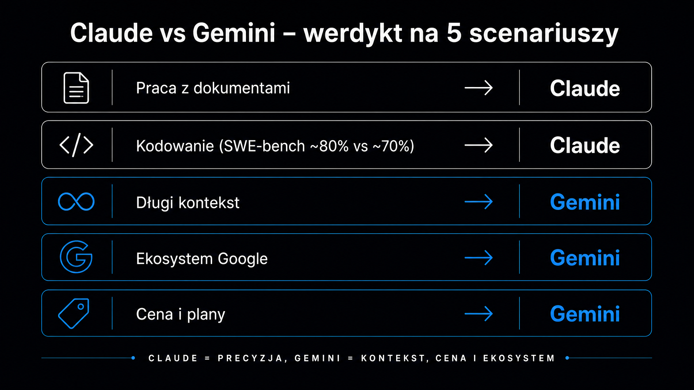

Claude i Gemini to dziś dwie najpoważniejsze alternatywy dla ChatGPT w codziennej pracy zawodowej. Różnica między nimi jest na tyle wyraźna, że zły wybór realnie spowalnia pracę. Claude od Anthropic wyróżnia się precyzją instrukcji i jakością pisania. Z kolei Gemini od Google wygrywa integracją z ekosystemem Workspace i szerokim kontekstem. Dzielimy to porównanie na pięć konkretnych scenariuszy: praca z dokumentami, kodowanie, długi kontekst, środowisko Google oraz cena i plany. Dla każdego wskazujemy wyraźnego zwycięzcę. Żadnych remisów na potrzeby dyplomacji.

## Szybkie zestawienie – Claude vs Gemini w tabelce

Zanim przejdziesz do szczegółów, rzuć okiem na przekrój przez obie platformy. Dane są aktualne na wrzesień 2026 r. według oficjalnych cenników Anthropic i Google (wyniki SWE-bench – ostatnie opublikowane dla danej rodziny).

| Kryterium | Claude (Sonnet 5 / Opus 5.5) | Gemini (3.1 Pro) |
|---|---|---|
| Producent | Anthropic | Google DeepMind |
| Najmocniejszy model | Claude Fable 5.1 ($10/$50 w API) | Gemini 3.1 Pro (w API w wersji preview) |
| Najnowszy szybki model | Claude Haiku 4.5 | Gemini 3.8 Flash |
| Okno kontekstowe | 1M tokenów (Fable, Sonnet i Opus, także w czacie) | 1M tokenów |
| SWE-bench Verified | 79,6% (Sonnet 4.6), 88,6% (Opus 4.8) | 80,6% (3.1 Pro) |
| Cena API (input/output) | $2/$10 (Sonnet 5), $4/$20 (Opus 5.5) | $2/$12 (3.1 Pro, ≤200K) |
| Plan dla osób prywatnych | Claude.ai Pro – $20/mies. | Google AI Pro – $19,99/mies. |
| Plan premium | Claude.ai Max – $100–200/mies. | Google AI Ultra – od $99,99/mies. |
| Integracja z Google Workspace | Brak natywnej | Natywna (Gmail, Docs, Drive) |
| Dostęp do sieci | Wbudowane wyszukiwanie w sieci | Natywny Google Search |
| Język interfejsu | Angielski + wielojęzyczny | Wielojęzyczny, PL dostępny |
| Mocna strona | Analiza, pisanie, kod, kontekst | Ekosystem Google, multimedia, cena |

**Claude Opus 4.8, flagowiec Anthropic do lipca 2026 roku, osiągał 88,6% na SWE-bench Verified – wyraźnie przed Gemini 3.1 Pro (80,6%).** W klasie średniej Claude Sonnet 4.6 (79,6%) i Gemini 3.1 Pro wypadały niemal równo. Decydująca przewaga Claude w kodowaniu ujawniała się zatem dopiero na poziomie modelu flagowego.

## Praca z dokumentami – kto głębiej analizuje

Analiza dokumentów to jeden z głównych powodów, dla których firmy sięgają po modele AI w codziennej pracy. Liczy się tu nie tylko sam fakt przetworzenia pliku PDF. Model musi wyciągnąć właściwe wnioski, wyłapać sprzeczności i powstrzymać się od zmyślania faktów.

**Claude wyróżnia się tutaj dokładnością i odpornością na halucynacje w tekstach pisanych.** W testach przeprowadzonych przez LumiChats (2026) na rzeczywistych dokumentach prawnych, artykułach naukowych i podręcznikach akademickich Claude konsekwentnie dostarczał głębszą analizę ze znacznie niższym wskaźnikiem błędów faktograficznych. Gemini radziło sobie lepiej przy zadaniach wymagających przetworzenia wielu plików jednocześnie. Szeroki kontekst był tu wyraźnym atutem.

Dla kancelarii prawnych i firm consultingowych, które potrzebują chirurgicznej precyzji w pojedynczym dokumencie, wybór jest oczywisty. To Claude. Z kolei ten, kto musi przetworzyć setki plików naraz i nie zależy mu na każdym słowie, chętniej skorzysta z Gemini.

Sprawdź kilka kluczowych aspektów, w których Claude wygrywa przy pracy z dokumentami:

- **Śledzenie sprzeczności** – model od razu sygnalizuje, gdy dwa fragmenty dokumentu są ze sobą niezgodne
- **Precyzja cytowań** – przy zapytaniu „znajdź zdanie o X" wskazuje konkretny ustęp, zamiast ogólnie go parafrazować
- **Instrukcje formatowania** – Claude z bardzo wysoką konsekwencją stosuje się do szczegółowych wytycznych dotyczących struktury danych wyjściowych

Gemini ma na tym polu jedną konkretną przewagę. Natywny dostęp do wyszukiwarki Google pozwala weryfikować fakty z dokumentu w czasie rzeczywistym już podczas analizy. To niezwykle przydatne przy plikach zawierających dynamiczne dane rynkowe czy daty.

<aside class="callout-fact">
  
✦

  

    
Ciekawostka

    
Duże modele językowe (LLM – ang. <em>Large Language Models</em>) są trenowane na danych liczonych w bilionach tokenów, ale zdolność do <strong>utrzymania spójności przez długi dokument</strong> to osobna umiejętność. Badania pokazują, że modele często „tracą uwagę" w środkowej części długiego kontekstu – zjawisko znane jako <strong>lost-in-the-middle</strong>. Claude Opus 4.6 osiągnął 76% trafnych odpowiedzi na teście MRCR v2 przy milionowym kontekście; Sonnet 4.5 uzyskiwał zaledwie 18,5%.

  

</aside>

## Kodowanie – gdzie przewaga Claude rośnie wraz z klasą modelu

To obszar, w którym dane są najbardziej jednoznaczne. SWE-bench Verified to branżowy punkt odniesienia do pomiaru zdolności modeli w rozwiązywaniu rzeczywistych zgłoszeń błędów (bugów) w repozytoriach GitHub. Nie mówimy tu o zadaniach syntetycznych, ale o pracy na prawdziwym kodzie produkcyjnym.

**Claude Opus 4.8 (wydany 28 maja 2026) uzyskał 88,6% na SWE-bench Verified, wyprzedzając Gemini 3.1 Pro (80,6%) o ok. 8 punktów.** W klasie średniej Claude Sonnet 4.6 (79,6%) wypadał niemal równo z Gemini 3.1 Pro. Decydująca przewaga Claude leżała więc w modelu flagowym. Następcy – Sonnet 5 (czerwiec 2026), Opus 5 (lipiec 2026) i Opus 5.5 (22 września 2026), a także Fable 5.1 – zastąpili te modele; aktualne są dziś Sonnet 5, Opus 5.5 i Fable 5.1, a Opus 5, Opus 4.8 i Sonnet 4.6 mają status legacy. Po stronie Google flagowy Gemini 3.1 Pro nadal ma w API status preview, a linię szybkich modeli zamyka dziś Gemini 3.8 Flash. Dla nowych modeli obu firm nie zestawiamy wyników SWE-bench, więc powyższe liczby opisują stan z połowy 2026 roku.

W praktyce ta różnica oznacza mniej iteracji przy debugowaniu i znacznie większą szansę na poprawne działanie kodu już za pierwszym razem. Przy stawce programisty seniorskiego czas to pieniądz. Jeden zaoszczędzony cykl poprawek potrafi z nawiązką uzasadnić wyższy koszt tokenów.

Gemini ma za to mocną pozycję w tworzeniu front-endu i interfejsów webowych. Plasuje się w czołówce rankingu WebDev Arena Leaderboard, mierzącego preferencje ludzkich oceniających przy budowaniu aplikacji internetowych (o szczyt tego zestawienia rywalizowało z modelami Claude). Jeśli tworzysz prototypy UI lub piszesz CSS/HTML, Gemini może okazać się szybszą ścieżką do estetycznego wyniku.

Narzędzie Claude Code (interfejs wiersza poleceń, czyli CLI) idzie krok dalej niż samo generowanie kodu. Obsługuje pełny cykl: odczyt repozytorium, uruchamianie testów, tworzenie gałęzi i Pull Requestów. Po stronie Google odpowiednikiem jest otwartoźródłowy agent Gemini CLI działający w terminalu oraz platforma agentowa Antigravity.

## Długi kontekst – kiedy masz 200 stron do przejrzenia

Okno kontekstowe decyduje o tym, ile danych możesz podać modelowi w jednym zapytaniu. Claude Sonnet 5, Claude Opus 5.5 i Claude Fable 5.1 obsługują 1 milion tokenów zarówno w interfejsie czatu na planach płatnych, jak i przez API oraz w Claude Code. Poprzednia generacja (Opus 4.8, Sonnet 4.6) miała w czacie 500 tysięcy tokenów.

Gemini 3.1 Pro oferuje 1 milion tokenów w planie AI Pro i wyższych.

Co to oznacza w praktyce? Zwróć uwagę na kilka konkretnych scenariuszy:

- **Analiza całej bazy kodu** – projekt liczący 50 000+ linii kodu zwykle mieści się w całości w oknie obu modeli, więc decyduje raczej jakość wnioskowania niż sam rozmiar kontekstu
- **Przegląd dokumentacji technicznej** – specyfikacja produktu licząca 800+ stron bez problemu mieści się w kontekście obu modeli flagowych
- **Transkrypty spotkań i notatki z całego kwartału** – w tym przypadku dla większości firm w zupełności wystarczy tańszy model średniej klasy, np. Sonnet 5

Warto pamiętać o jednym. Duże okno kontekstowe to nie gwarancja dobrej jakości wnioskowania na całym materiale. Claude Opus 4.6 uzyskał w lutym 2026 roku 76% dokładności przy teście MRCR v2 (wydobywanie informacji z milionowego kontekstu), co jest wynikiem znacząco wyższym niż w przypadku wcześniejszych generacji modeli. Dla AI, które nie zostało zoptymalizowane pod tym kątem, szeroki kontekst bywa jedynie iluzją możliwości.

**Jeśli Twoja praca wymaga regularnego przetwarzania bardzo dużych zbiorów danych w jednym prompcie, zwróć uwagę na cennik długiego kontekstu – Gemini 3.1 Pro powyżej 200 tys. tokenów podnosi stawkę do $4/$18, a Claude nalicza pełne okno 1 mln tokenów po standardowej cenie.** Jeśli priorytetem jest jakość wnioskowania na długim dokumencie, Claude Opus pozostaje bezpieczniejszym wyborem.

<aside class="callout-expert">
  

  

    
Opinia eksperta

    
W projektach analitycznych, które prowadzimy w ICEA – audytach treści, przeglądach setek adresów URL, analizie obszernych briefów klientów – regularnie sięgamy po oba modele na różnych etapach pracy. Gemini sprawdza się przy wstępnym przetwarzaniu dużych zbiorów danych i przy zadaniach zintegrowanych z Gmailem lub Docs. Claude jest naszym wyborem tam, gdzie liczy się jakość końcowego produktu: analizy, rekomendacje, treści. <strong>Złota reguła, którą stosuję: Gemini do szerokości, Claude do głębokości.</strong>

    
Tomasz Czechowski · Head of SEO, ICEA

  

</aside>

## Ekosystem Google vs Claude – zintegrowany kontra niezależny

Dla osób korzystających z Google Workspace na co dzień – Gmail, Dokumenty, Arkusze, Drive, Meet – Gemini jest trudne do pobicia z jednego powodu. To natywna integracja. Model jest wbudowany bezpośrednio w interfejsy tych narzędzi. Możesz poprosić Gemini o podsumowanie wątku mailowego, zaproponowanie odpowiedzi, przejrzenie dokumentu w Docs czy analizę danych w Arkuszach. Wszystko to bez kopiowania i wklejania treści do osobnego okna przeglądarki.

Claude nie ma takiej integracji natywnej. Do pracy z materiałami z Google Drive musisz pobrać plik, wkleić treść lub skorzystać z zewnętrznych integracji przez protokół MCP (Model Context Protocol – otwarty standard Anthropic dla połączeń z zewnętrznymi narzędziami i źródłami danych). To działa, ale wymaga kilku dodatkowych kroków.

Kiedy sytuacja się odwraca? Wtedy, gdy używamy funkcji Claude Projects. Pozwala ona budować stałe środowisko robocze z wczytanymi dokumentami, instrukcjami i kontekstem, który utrzymuje się między sesjami. W dłuższych projektach – kampaniach marketingowych, analizach SEO, pracy z jednym klientem przez wiele tygodni – Projects daje spójność, której Gemini nie oferuje w tak przystępnej formie.

Oto krótkie podsumowanie różnic w integracji obu narzędzi:

- **Gemini** – wygrywa, gdy jesteś głęboko w ekosystemie Google (Gmail, Docs, Meet, Colab), a większość Twojej pracy toczy się właśnie w tych narzędziach
- **Claude** – wygrywa, gdy pracujesz na własnych plikach i dokumentach, zależy Ci na precyzji oraz długoterminowym kontekście projektu, a ekosystem Google nie stanowi centrum Twojej pracy

Warto też wspomnieć o [dużych modelach językowych](https://pl.wikipedia.org/wiki/Du%C5%BCy_model_j%C4%99zykowy) w kontekście biznesowym. Zarówno Claude, jak i Gemini oferują plany Enterprise z obiecanymi gwarancjami zgodności z RODO i zerowym przechowywaniem danych po przetworzeniu. Claude Enterprise oferuje niestandardowe zasady retencji danych. Z kolei Google Workspace ma analogiczne klauzule dla klientów korporacyjnych. To niezwykle istotna różnica wobec planów konsumenckich, gdzie dane mogą być używane do treningu modelu.

## Ceny i plany – co jest tańsze w praktyce

Oba modele mają zbliżone ceny planów konsumenckich. Claude.ai Pro kosztuje $20 miesięcznie, a Google AI Pro – $19,99. To w pełni porównywalne pakiety. Różnica pojawia się dopiero w droższych planach.

Claude.ai Max zaczyna się od $100 i sięga $200 miesięcznie, w zależności od limitu użycia (5× lub 20× więcej niż w Pro). Google AI Ultra kosztuje od $99,99 miesięcznie (droższy wariant – $199,99) i obejmuje od 20 TB przestrzeni w Google One. Dla użytkowników głęboko zakorzenionych w ekosystemie Google może to oznaczać realne oszczędności na innych subskrypcjach.

Na poziomie API ceny modeli średniej klasy są dziś zbliżone:

- **Claude Sonnet 5** – $2 za milion tokenów wejściowych / $10 za milion tokenów wyjściowych
- **Claude Opus 5.5** – $4 / $20 za milion tokenów
- **Claude Fable 5.1** – $10 / $50 za milion tokenów
- **Gemini 3.1 Pro (preview)** – $2 / $12 za milion tokenów (dla kontekstu do 200K; powyżej $4 / $18)

Sonnet 5 i Gemini 3.1 Pro kosztują tyle samo na wejściu, a Sonnet jest nieco tańszy na wyjściu. Wyraźnie droższe są dopiero Opus 5.5 i najmocniejszy Fable 5.1. Przy wolumenach produkcyjnych – tysiące zapytań dziennie, przetwarzanie masowych zbiorów danych – różnice szybko rosną. Dla aplikacji masowych najtańsze warianty Gemini Flash-Lite (np. 3.1 Flash-Lite za $0,25/$1,50) są znacznie tańsze niż najtańszy Claude Haiku 4.5 ($1/$5).

Jeśli chcesz sprawdzić, jak Twoja obecna widoczność w modelach AI wygląda jeszcze zanim zdecydujesz o strategii contentowej, [Widoczność marki w AI](/narzedzia/brand-check/) odpyta cztery silniki AI o Twoją markę. Pokaże Ci dokładnie, gdzie jesteś cytowany, a gdzie w ogóle Cię nie ma.

## Który model wybrać do poszczególnych zastosowań?

Zamiast jednego ogólnego werdyktu, przygotowaliśmy kilka konkretnych rekomendacji:

**Wybierz Claude'a, jeśli:**

- **Piszesz dużo** – tworzysz raporty, analizy, artykuły, briefy; Claude ma wyraźnie wyższą jakość języka i lepiej przestrzega instrukcji formatowania
- **Kodujesz zawodowo** – wyniki SWE-bench są tu jednoznaczne; zyskujesz mniej iteracji i wyższy procent poprawnych odpowiedzi za pierwszym razem
- **Pracujesz z umowami lub dokumentami prawnymi** – model gwarantuje niższy wskaźnik halucynacji faktograficznych i lepsze śledzenie sprzeczności
- **Chcesz agenta CLI** – Claude Code to dojrzałe narzędzie obejmujące pełny cykl pracy z repozytorium

**Wybierz Gemini, jeśli:**

- **Cały Twój workflow toczy się w Google Workspace** – używasz Gmaila, Docs, Sheets, Drive; integracja natywna jest w tym przypadku absolutnie niezastąpiona
- **Potrzebujesz aktualnych danych** – zyskujesz natywną weryfikację danych w wynikach Google Search (grounding) w czasie rzeczywistym, bezpośrednio z indeksu Google
- **Budujesz aplikacje webowe lub UI** – ranking WebDev Arena Leaderboard jest w tym kontekście niezwykle wymowny
- **Masz duże wolumeny w API** – najtańsze modele Gemini Flash-Lite kosztują ułamek ceny Claude Haiku 4.5; przy dużej skali robi to gigantyczną różnicę

Pełniejszy przegląd możliwości każdego modelu znajdziesz w artykułach o [Claude](/modele-llm/claude/) i [Gemini](/modele-llm/gemini/), a szerszy kontekst rynku LLM opisuje [przewodnik po modelach językowych](/modele-llm/przewodnik/). Jeśli zastanawiasz się, jak pozycjonowanie w Gemini wpływa na widoczność marki, przydatna będzie strona [pozycjonowanie AI – Gemini](/pozycjonowanie-ai/gemini/).

**Nie musisz wybierać raz na zawsze.** Wielu profesjonalistów używa obu rozwiązań. Wybierają Gemini do pracy w Workspace i researchu z dostępem do sieci, a Claude'a do pisania i kodowania tam, gdzie liczy się najwyższa jakość końcowa. Koszt obu planów Pro łącznie to $40 miesięcznie. To zazwyczaj mniej niż jedna godzina pracy konsultanta.
