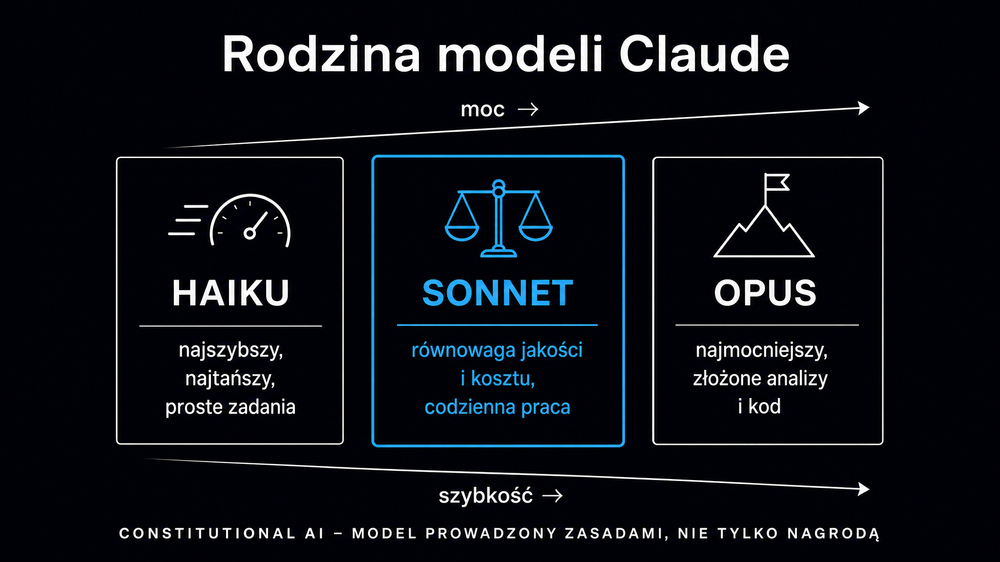

Claude to duży model językowy (LLM – *Large Language Model*) tworzony przez firmę Anthropic – założoną w 2021 roku przez byłych badaczy OpenAI, z Dario i Danielą Amodei na czele. W odróżnieniu od konkurentów, firma Anthropic zbudowała model Claude wokół koncepcji bezpieczeństwa jako fundamentu architektury, a nie jako warstwy nakładanej na gotowy produkt. Jeśli zastanawiasz się, czy Claude to coś więcej niż kolejny chatbot AI – odpowiedź brzmi: tak, i ten przewodnik wyjaśnia dokładnie, co i dlaczego.

## Kim jest Anthropic i skąd wziął się Claude

Geneza firmy Anthropic wynika wprost z konfliktu wartości. W 2021 roku Dario Amodei, ówczesny wiceprezes ds. badań w OpenAI, razem z grupą badaczy opuścił firmę z powodu narastających sporów o tempo komercjalizacji kosztem bezpieczeństwa. Wraz z siostrą Danielą i kilkoma współpracownikami – w tym Jaredem Kaplanem (dziś główny naukowiec) i Chrisem Olahiem (ekspert od interpretowalności sieci neuronowych) – zarejestrował Anthropic w San Francisco jako korporację pożytku publicznego (Public Benefit Corporation).

**Statutowym celem firmy jest odpowiedzialny rozwój sztucznej inteligencji dla długoterminowego dobra ludzkości.** To nie jest tylko tekst w dokumentach rejestracyjnych – firma odmówiła podpisania kontraktów wymagających usunięcia klauzul zakazujących wykorzystywania modeli Claude do masowej inwigilacji czy autonomicznych systemów uzbrojenia, co w 2026 roku doprowadziło do głośnego konfliktu z Departamentem Obrony USA.

Pierwszy model Claude wszedł do publicznego użytku w marcu 2023 roku. Wcześniej firma przez blisko rok prowadziła wewnętrzne testy bezpieczeństwa, zamiast – jak to bywa w branży – publikować model i reagować na problemy post factum. Wycena firmy osiągnęła w lutym 2026 roku ok. 380 miliardów dolarów.

## Jak działa Claude – Constitutional AI zamiast zwykłego RLHF

Większość modeli językowych jest dostrajana metodą uczenia ze wzmocnieniem na podstawie opinii ludzi (RLHF – *Reinforcement Learning from Human Feedback*). Tysiące ewaluatorów przegląda odpowiedzi modelu i ocenia je; model uczy się na tych ocenach. Przy wystarczająco złożonych zagadnieniach – takich jak specjalistyczny kod czy niuansowane dylematy etyczne – ludzka ocena staje się wąskim gardłem.

Firma Anthropic poszła inną drogą i zbudowała framework zwany **Constitutional AI** (CAI). Zamiast polegać wyłącznie na ludzkich ewaluatorach, model jest uczony z pomocą zestawu zasad – konstytucji – i koryguje własne odpowiedzi w oparciu o te zasady. Technicznie nazywa się to [uczeniem ze wzmocnieniem](https://pl.wikipedia.org/wiki/Uczenie_przez_wzmacnianie) na podstawie informacji zwrotnej od sztucznej inteligencji (RLAIF – *Reinforcement Learning from AI Feedback*).

Proces przebiega dwuetapowo. Najpierw model generuje ryzykowną odpowiedź, następnie ocenia ją względem konstytucji i pisze poprawioną wersję – ta para służy do dostrajania. Potem inny model ocenia pary odpowiedzi i generuje sygnał nagrody bez udziału człowieka. **Wynikiem jest model, który zamiast bezrefleksyjnie odmawiać, potrafi wyjaśnić swoje ograniczenia i w miarę możliwości pomóc w alternatywny sposób.**

Sama konstytucja Anthropic opiera się w ok. 50% na powszechnych zasadach praw człowieka, m.in. Powszechnej Deklaracji Praw Człowieka ONZ. Wyklucza reguły, co do których w społeczeństwie nie ma konsensusu.

### Model zaufania – Operator, Użytkownik, Anthropic

Claude rozróżnia trzy poziomy zaufania w każdej rozmowie:

- **Anthropic** – najwyższy poziom; zasady wbudowane w trening, nie w prompt systemowy
- **Operator** – firma lub deweloper korzystający z API; może rozszerzać lub zawężać domyślne zachowania Claude'a w ramach polityki Anthropic
- **Użytkownik końcowy** – osoba prowadząca rozmowę; domyślnie mniej zaufany niż Operator

Ma to praktyczne znaczenie dla integratorów: jeśli budujesz produkt na API Claude, możesz za pomocą promptu systemowego precyzyjnie określić, co model może robić w Twoim kontekście.

## Rodzina modeli Claude – Haiku, Sonnet, Opus

Anthropic strukturyzuje swoje modele według trzech klas, różnicując je szybkością, zdolnościami i ceną. Pozwala to dopasować model do konkretnego zadania bez płacenia za niepotrzebną moc obliczeniową.

Poniższa tabela pokazuje aktualne klasy modeli (bez numerów wersji, które zmieniają się wraz z kolejnymi wydaniami):

| Klasa modelu | Przeznaczenie | Charakterystyka |
|---|---|---|
| **Haiku** | Zadania masowe, szybkie interakcje | Najniższy koszt w przeliczeniu na token, najkrótszy czas odpowiedzi, dobry do klasyfikacji, ekstrakcji danych i prostych Q&A |
| **Sonnet** | Balans zdolności i ceny | Optymalny do większości zadań biznesowych – analiza dokumentów, pisanie, asystent w aplikacjach |
| **Opus** | Złożone zadania analityczne | Najwyższe zdolności rozumowania, droższy, przeznaczony do wieloetapowych zadań agentowych i inżynierii oprogramowania |

**Modele starsze o więcej niż dwie generacje są systematycznie wycofywane z API, co wymusza aktualizację integracji.** Tempo tego cyklu – nowa generacja co ok. 6 miesięcy – jest istotnym czynnikiem przy planowaniu wdrożeń produkcyjnych.

<aside class="callout-fact">
  
✦

  

    
Ciekawostka

    
W testach środowiskowych OSWorld – oceniających zdolność autonomicznego sterowania komputerem – Claude osiągnął wynik 14,9% poprawnie wykonanych zadań. <strong>Drugi w zestawieniu model miał wynik 7,7%. Człowiek osiąga ok. 75%.</strong> Przewaga dwukrotna przy jednoczesnej dużej luce do człowieka dokładnie opisuje, gdzie agenci AI są dziś użyteczni, a gdzie ich stosowanie nadal niesie ze sobą ryzyko.

  

</aside>

## Możliwości modelu Claude – co potrafi w praktyce

Claude w 2026 roku to znacznie więcej niż rozmowy tekstowe. Każda z poniższych możliwości ma implikacje dla tego, jak możesz go zintegrować w procesach firmowych.

### Artifacts – interaktywne dokumenty w przeglądarce

Artifacts (artefakty) to funkcja pozwalająca Claude'owi generować interaktywną zawartość bezpośrednio w oknie rozmowy – kod HTML/CSS/JS, który natychmiast się renderuje, diagramy, arkusze kalkulacyjne czy dokumenty. Zamiast kopiować wynik do innego narzędzia, widzisz działający prototyp w czasie rzeczywistym. Jest to szczególnie przydatne przy tworzeniu prostych kalkulatorów, raportów w formacie tabeli czy interaktywnych wizualizacji danych.

### Pojemne okno kontekstowe

Claude obsługuje okno kontekstowe rzędu 1 miliona tokenów. W praktyce oznacza to możliwość wczytania całej dokumentacji technicznej projektu, kilkudziesięciu stron umowy lub obszernego zbioru danych i prowadzenia z nimi spójnej rozmowy analitycznej. **To jeden z największych praktycznych kontekstów wśród komercyjnych modeli językowych na rynku.**

### Computer Use – sterowanie komputerem

Computer Use (sterowanie komputerem) pozwala Claude'owi obserwować ekran i symulować kliknięcia myszy oraz naciśnięcia klawiszy – bez konieczności integracji przez dedykowane API danej aplikacji. Model analizuje zrzut ekranu i podejmuje działania jak człowiek przy klawiaturze. Funkcja dostępna jest w planach Max i przez API; z powodów bezpieczeństwa celowo ograniczono ją na platformach wyborczych i serwisach rządowych.

### MCP – protokół kontekstu modelu

MCP (Model Context Protocol) to otwarty standard opracowany przez firmę Anthropic, który pozwala Claude'owi łączyć się z zewnętrznymi narzędziami i źródłami danych w sposób ustrukturyzowany. Dzięki MCP model może czytać pliki z dysku, odpytywać bazy danych, wywoływać zewnętrzne API – a wszystko to w ramach jednej spójnej sesji. MCP zastępuje wcześniejsze, niekompatybilne podejścia do integracji narzędzi; coraz więcej platform (IDE, serwery CI/CD, CRM-y) oferuje gotowe konektory MCP.

### Claude Code – agent programistyczny

Claude Code to narzędzie CLI (interfejs wiersza poleceń) pozwalające modelowi na pełen odczyt i zapis repozytorium kodu bezpośrednio z terminala lub z poziomu edytora (VS Code, JetBrains). Model analizuje zależności w projekcie, uruchamia polecenia powłoki, naprawia błędy kompilacji, pisze testy i tworzy gotowe gałęzie oraz żądania wciągnięcia (Pull Request). Jeśli szukasz przeglądu narzędzi agentowych do kodowania, [przewodnik po modelach LLM](/modele-llm/przewodnik) opisuje szerszy kontekst rynkowy.

<aside class="callout-expert">
  

  

    
Opinia eksperta

    
W projektach SEO i contentowych, które prowadzimy w ICEA, Claude wyróżnia się w zadaniach wymagających spójności kontekstu przez długą sesję – analizie setek URL, zestawianiu danych z wielu źródeł, pracy z obszernymi briefami. ChatGPT bywa kreatywniejszy w generowaniu wariantów tekstów, z kolei Perplexity jest szybszy przy wyszukiwaniu bieżących danych. <strong>Jeśli zadanie wymaga zachowania precyzji i kontekstu przez godzinę pracy – Claude to nasz pierwszy wybór.</strong>

    
Tomasz Czechowski · Head of SEO, ICEA

  

</aside>

## Plany Claude.ai – Free, Pro, Max, Team, Enterprise

Model Claude dostępny jest bezpośrednio przez interfejs claude.ai w kilku planach. Poniżej znajduje się zestawienie, które pomoże Ci wybrać właściwy poziom.

| Plan | Dostęp do modeli | Charakterystyka |
|---|---|---|
| **Free** | Modele podstawowe (z limitami) | Bezpłatny; ograniczony dzienny limit wiadomości; bez Artifacts i Computer Use |
| **Pro** ($20/mies.)| Sonnet i starsze wersje Opus | Wyższe limity, priorytet w kolejce, dostęp do Artifacts |
| **Max** ($100–200/mies.) | Pełny dostęp, w tym Computer Use | Najwyższe limity, Computer Use, rozszerzone myślenie (extended thinking), kredyty API |
| **Team** | Modele Pro/Max | Współdzielone przestrzenie robocze, zarządzanie dostępem, udostępnianie projektów |
| **Enterprise** | Negocjowane | SSO, brak retencji danych (Zero Data Retention), SLA, dedykowane wdrożenia, zgodność z HIPAA/GDPR |

Opcja braku retencji danych (Zero Data Retention) w planie Enterprise oznacza, że żadne dane z zapytań nie są przechowywane przez serwery Anthropic po przetworzeniu – co jest kluczowe dla organizacji objętych rygorystycznymi regulacjami branżowymi.

## Claude a konkurencja – mocne i słabe strony

Claude nie jest najlepszy we wszystkich kategoriach, a uczciwe porównanie pomaga podjąć decyzję o doborze modelu. Jeśli interesuje Cię zestawienie z ChatGPT, [artykuł o ChatGPT](/modele-llm/chatgpt) opisuje różnice w podejściu OpenAI do dostrajania i bezpieczeństwa. Perplexity jako silnik z dostępem do sieci w czasie rzeczywistym omówiony jest w [przewodniku po Perplexity](/modele-llm/perplexity).

Kilka mocnych stron Claude'a, które wynikają z realnych testów:

- **Długi kontekst z zachowaniem uwagi** – w testach MRCR v2 mierzących zdolność wydobywania szczegółów z milionowego kontekstu model Claude Opus osiągnął 76% trafnych odpowiedzi (Sonnet poprzedniej generacji – 18,5%)
- **Złożone rozumowanie wieloetapowe** – wyniki benchmarku Humanity's Last Exam (zestaw 2500 zadań na granicy poznania naukowego, opublikowany przez Scale AI i Center for AI Safety w czasopiśmie Nature w styczniu 2026 roku) plasują flagowe modele Anthropic w ścisłej czołówce
- **Bezpieczeństwo i transparentność** – technologia Constitutional AI redukuje fałszywe pozytywne odmowy; firma Anthropic co kwartał publikuje również raport o ryzykach swoich modeli

Gdzie Claude wypada gorzej na tle konkurentów:

- **Szeroka obsługa wielu języków** – GPT-4o wyprzedza Claude'a w przypadku rzadszych języków
- **Bieżące informacje** – Claude bez funkcji Computer Use posiada datę odcięcia wiedzy; Perplexity i Google AI Mode pobierają dane na żywo
- **Koszt modelu Opus** – najtańszym rozwiązaniem do masowego przetwarzania dużych wolumenów danych pozostaje Gemini Flash

## Jak Claude wpływa na widoczność marki w wynikach wyszukiwania AI

Jeśli Twoja marka pojawia się w odpowiedziach generowanych przez Claude'a – albo powinna, ale się nie pojawia – nie jest to kwestia przypadku. Claude, jak każdy model z dostępem RAG, pobiera treści ze stron internetowych i ocenia je pod kątem wiarygodności, spójności i gęstości informacji.

**Strony dobrze zoptymalizowane pod GEO (Generative Engine Optimization, czyli optymalizację pod generatywne silniki wyszukiwania) są cytowane przez Claude'a częściej niż strony z ogólnikową treścią bez twardych danych.** Mechanizm ten jest identyczny jak opisany w [przewodniku po GEO](/geo/przewodnik) – statystyki, cytowania źródeł i ustrukturyzowane fragmenty podnoszą wskaźnik cytowań o 30–115% (Aggarwal et al., KDD 2024).

Jeśli chcesz sprawdzić, jak Twoja marka jest postrzegana przez Claude'a i inne modele, [audyt marki (brand check)](/narzedzia/brand-check) odpyta cztery silniki AI jednocześnie i pokaże różnice w odpowiedziach. Pełniejsza strategia widoczności marki w modelu Claude opisana jest na stronie [pozycjonowanie AI – Claude](/pozycjonowanie-ai/claude).

## Bezpieczeństwo i Responsible Scaling Policy

Firma Anthropic formalnie zarządza ryzykiem za pomocą ram (frameworku) Responsible Scaling Policy (RSP), który w wersji 3.0 z 2026 roku definiuje progi bezpieczeństwa powiązane z możliwościami modelu.

System opiera się na poziomach ASL (AI Safety Level):

- **ASL-2** – standard dla wszystkich modeli komercyjnych: dokumentacja bezpieczeństwa, testy penetracyjne (red-teaming) pod kątem podatności, mechanizmy zgłaszania luk
- **ASL-3** – wdrażany, gdy model osiąga zdolności doradcze w dziedzinach CBRN (zagrożenia chemiczne, biologiczne, radiologiczne, jądrowe) lub gdy może autonomicznie replikować się bez nadzoru
- **ASL-4 i wyżej** – próg dla systemów, których niekontrolowany rozwój zagrażałby stabilności na skalę makroekonomiczną

**Raz na kwartał Anthropic publikuje raport o ryzykach wszystkich aktywnych modeli.** To bezprecedensowy poziom transparentności w branży, gdzie większość graczy traktuje testy bezpieczeństwa jako wewnętrzną tajemnicę. Firma wyznaczyła też osobę na stanowisko Responsible Scaling Officer, by koordynowała ten proces.

## Często zadawane pytania dotyczące Claude'a

### Czy Claude ma dostęp do internetu?

Standardowy Claude bez rozszerzeń bazuje na wiedzy z danych treningowych (z określoną datą odcięcia). Funkcja Computer Use pozwala mu przeglądać strony, a integracje przez standard MCP mogą podłączyć go do zewnętrznych źródeł danych – wymaga to jednak konfiguracji po stronie Operatora lub użytkownika.

### Czym różni się Claude od ChatGPT?

Oba to duże modele językowe, ale różnią się architekturą dostrajania, filozofią bezpieczeństwa i mocnymi stronami. Claude wyróżnia się długim kontekstem i precyzją w złożonych zadaniach analitycznych. ChatGPT ma z kolei szerszy ekosystem wtyczek i przewagę w szerokiej obsłudze wielu języków.

### Czy Claude nadaje się do pracy z danymi wrażliwymi?

Plan Enterprise z brakiem retencji danych (Zero Data Retention) spełnia wymagania HIPAA i GDPR. W planach niższych dane mogą być używane do treningu – co dla większości zastosowań biznesowych wymaga weryfikacji pod kątem zgodności z przepisami (compliance).

### Jak zacząć bez płacenia?

Plan Free na platformie claude.ai daje dostęp do podstawowych modeli z dziennym limitowanym oknem wiadomości. Do testowania API firma Anthropic oferuje kredyty startowe dla nowych kont. Używanie Claude Code wymaga aktywnego planu płatnego.
