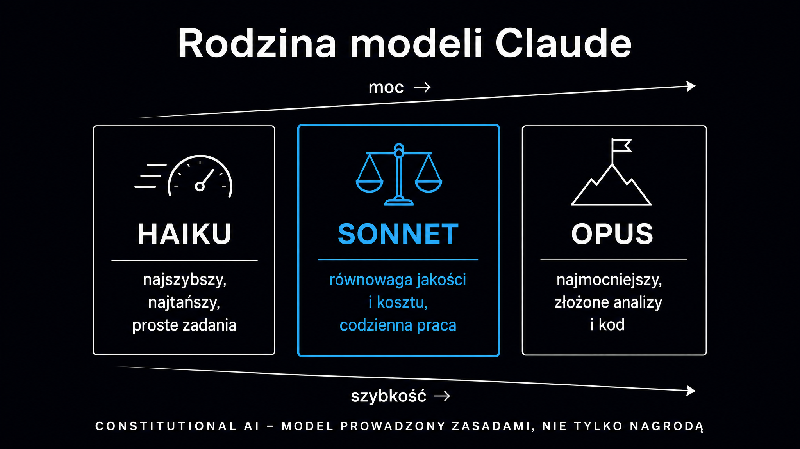

Claude to duży model językowy (LLM – *Large Language Model*) tworzony przez firmę Anthropic – założoną w 2021 roku przez byłych badaczy OpenAI, z Dario i Danielą Amodei na czele. **W odróżnieniu od konkurentów Anthropic zbudował Claude'a wokół koncepcji bezpieczeństwa jako fundamentu architektury, a nie tylko warstwy nakładanej na gotowy produkt.** Zastanawiasz się, czy to coś więcej niż kolejny chatbot AI? Odpowiedź brzmi twierdząco – ten przewodnik wyjaśnia dokładnie mechanizmy jego działania.

## Kim jest Anthropic i skąd wziął się Claude

Geneza firmy Anthropic wynika wprost z konfliktu wartości. W 2021 roku Dario Amodei, ówczesny wiceprezes ds. badań w OpenAI, opuścił firmę razem z grupą badaczy. Powód? Narastające spory o tempo komercjalizacji kosztem bezpieczeństwa. Wraz z siostrą Danielą i kilkoma współpracownikami – w tym Jaredem Kaplanem (dziś główny naukowiec) i Chrisem Olahiem (ekspert od interpretowalności sieci neuronowych) – zarejestrował Anthropic w San Francisco jako korporację pożytku publicznego (Public Benefit Corporation).

**Statutowym celem firmy jest odpowiedzialny rozwój sztucznej inteligencji dla długoterminowego dobra ludzkości.** To nie tylko pusty frazes w dokumentach rejestracyjnych. Firma stanowczo odmówiła podpisania kontraktów wymagających usunięcia klauzul zakazujących wykorzystywania modeli Claude do masowej inwigilacji czy autonomicznych systemów uzbrojenia. W 2026 roku doprowadziło to zresztą do głośnego konfliktu z Departamentem Obrony USA.

Pierwszy model Claude wszedł do publicznego użytku w marcu 2023 roku. Wcześniej firma przez blisko rok prowadziła wewnętrzne testy bezpieczeństwa. Zrezygnowała z branżowego standardu, czyli publikowania modelu i reagowania na problemy post factum. **Wycena Anthropic osiągnęła w lutym 2026 roku ok. 380 miliardów dolarów.**

## Jak działa Claude, czyli Constitutional AI zamiast zwykłego RLHF?

Większość modeli językowych jest dostrajana metodą uczenia ze wzmocnieniem na podstawie opinii ludzi (RLHF – *Reinforcement Learning from Human Feedback*). Tysiące ewaluatorów przegląda odpowiedzi algorytmu i ocenia je, a model uczy się na tych ocenach. **Przy wystarczająco złożonych zagadnieniach – takich jak specjalistyczny kod czy niuansowane dylematy etyczne – ludzka ocena staje się jednak wąskim gardłem.**

Firma Anthropic poszła inną drogą i zbudowała framework zwany Constitutional AI (CAI). Zamiast polegać wyłącznie na ludzkich ewaluatorach, model uczy się z pomocą zestawu zasad – konstytucji – i koryguje własne odpowiedzi w oparciu o te wytyczne. Technicznie nazywa się to [uczeniem ze wzmocnieniem](https://pl.wikipedia.org/wiki/Uczenie_przez_wzmacnianie) na podstawie informacji zwrotnej od sztucznej inteligencji (RLAIF – *Reinforcement Learning from AI Feedback*).

Proces przebiega dwuetapowo. Najpierw model generuje ryzykowną odpowiedź, następnie ocenia ją względem konstytucji i pisze poprawioną wersję – ta para służy do dostrajania. Potem inny model analizuje pary odpowiedzi i generuje sygnał nagrody bez udziału człowieka. **Wynikiem jest system, który zamiast bezrefleksyjnie odmawiać, potrafi wyjaśnić swoje ograniczenia i w miarę możliwości pomóc w alternatywny sposób.**

Sama konstytucja Anthropic czerpie m.in. z powszechnych zasad praw człowieka, w tym z Powszechnej Deklaracji Praw Człowieka ONZ. Świadomie wyklucza reguły, co do których w społeczeństwie nie ma jasnego konsensusu.

### Model zaufania – Operator, Użytkownik, Anthropic

Claude rozróżnia trzy poziomy zaufania w każdej rozmowie.

- **Anthropic** – najwyższy poziom, gdzie zasady są wbudowane w trening, a nie w prompt systemowy
- **Operator** – firma lub deweloper korzystający z API, który może rozszerzać lub zawężać domyślne zachowania Claude'a w ramach polityki Anthropic
- **Użytkownik końcowy** – osoba prowadząca rozmowę, domyślnie traktowana jako mniej zaufana niż operator

**Ma to ogromne znaczenie praktyczne dla integratorów.** Jeśli budujesz produkt na API Claude, możesz za pomocą promptu systemowego precyzyjnie określić, co model ma prawo robić w Twoim specyficznym kontekście.

## Rodzina modeli Claude – Haiku, Sonnet, Opus i Fable

Anthropic strukturyzuje swoje modele według klas, różnicując je szybkością, zdolnościami i ceną. Pozwala to precyzyjnie dopasować model do konkretnego zadania bez przepłacania za niepotrzebną moc obliczeniową.

Zestawienie aktualnych klas modeli ułatwia wybór odpowiedniego wariantu (bez numerów wersji, które zmieniają się wraz z kolejnymi wydaniami).

| Klasa modelu | Przeznaczenie | Charakterystyka |
|---|---|---|
| **Haiku** | Zadania masowe, szybkie interakcje | Najniższy koszt w przeliczeniu na token, najkrótszy czas odpowiedzi, dobry do klasyfikacji, ekstrakcji danych i prostych Q&A |
| **Sonnet** | Balans zdolności i ceny | Dobry wybór do wielu zadań biznesowych – analiza dokumentów, pisanie, asystent w aplikacjach |
| **Opus** | Złożone zadania analityczne | Wysokie zdolności rozumowania, droższy, przeznaczony do wieloetapowych zadań agentowych i inżynierii oprogramowania; Anthropic poleca go na start do większości zadań |
| **Fable** | Najbardziej wymagające zadania | Najmocniejsza i najdroższa klasa, do złożonego rozumowania i długich zadań agentowych |

We wrześniu 2026 roku aktualne modele to Claude Haiku 4.5, Sonnet 5 i Opus 5, a do najbardziej wymagającego rozumowania i długich zadań agentowych Anthropic oferuje ponadto Claude Fable 5.1 (w API 10 USD za milion tokenów wejściowych i 50 USD za wyjściowe, wobec 5/25 USD dla Opus 5 i 2/10 USD dla Sonnet 5). **Starsze modele trafiają do grupy legacy, a następnie są wycofywane z API według ogłoszonego harmonogramu, co wymusza regularną aktualizację integracji.** Przykładowo Opus 4.8 i Sonnet 4.6 mają już status legacy, a to stanowi kluczowy czynnik przy planowaniu wdrożeń produkcyjnych.

<aside class="callout-fact">
  
✦

  

    
Ciekawostka

    
W testach środowiskowych OSWorld z końca 2024 roku – oceniających zdolność autonomicznego sterowania komputerem – Claude (wówczas wersja 3.5) osiągnął 14,9% poprawnie wykonanych zadań, dwukrotnie wyprzedzając drugi model (7,7%). <strong>Od tego czasu wyniki gwałtownie wzrosły – według zestawienia Anthropic z czerwca 2026 roku Claude Sonnet 4.6 (dziś model legacy) osiągnął 78,5% w nowszym wariancie OSWorld-Verified.</strong> To pokazuje, jak szybko dojrzewa dziedzina, w której jeszcze niedawno autonomiczni agenci AI byli głównie eksperymentalni.

  

</aside>

## Możliwości modelu Claude – co potrafi w praktyce

Claude w 2026 roku to znacznie więcej niż proste rozmowy tekstowe. Każda z dostępnych funkcji niesie za sobą konkretne implikacje dla integracji modelu w procesach firmowych.

### Artifacts – interaktywne dokumenty w przeglądarce

Artifacts (artefakty) to funkcja pozwalająca Claude'owi generować interaktywną zawartość bezpośrednio w oknie rozmowy. Może to być kod HTML/CSS/JS, który natychmiast się renderuje, a także diagramy, arkusze kalkulacyjne czy dokumenty. Zamiast kopiować wynik do innego narzędzia, od razu widzisz działający prototyp w czasie rzeczywistym. **To rozwiązanie sprawdza się idealnie przy tworzeniu prostych kalkulatorów, raportów w formacie tabeli czy interaktywnych wizualizacji danych.**

### Pojemne okno kontekstowe

Claude obsługuje okno kontekstowe rzędu 1 miliona tokenów – w modelach Fable 5.1, Opus 5 i Sonnet 5 także w interfejsie czatu na planach płatnych, a ponadto przez API i w Claude Code (Haiku 4.5 – 200 000 tokenów). W praktyce oznacza to możliwość wczytania całej dokumentacji technicznej projektu, kilkudziesięciu stron umowy lub obszernego zbioru danych. Następnie możesz prowadzić z nimi spójną rozmowę analityczną. **To jeden z największych praktycznych kontekstów wśród komercyjnych modeli językowych na rynku.**

### Computer Use – sterowanie komputerem

Computer Use (sterowanie komputerem) pozwala Claude'owi obserwować ekran i symulować kliknięcia myszy oraz naciśnięcia klawiszy. Wszystko to bez konieczności integracji przez dedykowane API danej aplikacji. Model analizuje zrzut ekranu i podejmuje działania dokładnie tak, jak człowiek przy klawiaturze. **Funkcja dostępna jest przez API oraz w narzędziach agentowych Claude, takich jak Claude Code.**

### MCP – protokół kontekstu modelu

MCP (Model Context Protocol) to otwarty standard opracowany przez firmę Anthropic, który pozwala Claude'owi łączyć się z zewnętrznymi narzędziami i źródłami danych w sposób ustrukturyzowany. Dzięki MCP model potrafi czytać pliki z dysku, odpytywać bazy danych i wywoływać zewnętrzne API w ramach jednej spójnej sesji. **Protokół ten skutecznie zastępuje wcześniejsze, niekompatybilne podejścia do integracji narzędzi.** Coraz więcej platform (IDE, serwery CI/CD, CRM-y) oferuje już gotowe konektory MCP.

### Claude Code – agent programistyczny

Claude Code to narzędzie CLI (interfejs wiersza poleceń) pozwalające modelowi na pełen odczyt i zapis repozytorium kodu bezpośrednio z terminala lub z poziomu edytora (VS Code, JetBrains). Model samodzielnie analizuje zależności w projekcie, uruchamia polecenia powłoki i naprawia błędy kompilacji. Dodatkowo pisze testy i tworzy gotowe gałęzie oraz żądania wciągnięcia (Pull Request). Jeśli szukasz przeglądu narzędzi agentowych do kodowania, [przewodnik po modelach LLM](/modele-llm/przewodnik/) opisuje szerszy kontekst rynkowy.

<aside class="callout-expert">
  

  

    
Opinia eksperta

    
W projektach SEO i contentowych, które prowadzimy w ICEA, Claude wyróżnia się w zadaniach wymagających spójności kontekstu przez długą sesję – analizie setek URL, zestawianiu danych z wielu źródeł, pracy z obszernymi briefami. ChatGPT bywa kreatywniejszy w generowaniu wariantów tekstów, z kolei Perplexity jest szybszy przy wyszukiwaniu bieżących danych. <strong>Jeśli zadanie wymaga zachowania precyzji i kontekstu przez godzinę pracy – Claude to nasz pierwszy wybór.</strong>

    
Tomasz Czechowski · Head of SEO, ICEA

  

</aside>

## Plany Claude.ai – Free, Pro, Max, Team, Enterprise

Model Claude dostępny jest bezpośrednio przez interfejs claude.ai w kilku planach. Odpowiednie zestawienie parametrów pomoże Ci wybrać właściwy poziom subskrypcji.

| Plan | Dostęp do modeli | Charakterystyka |
|---|---|---|
| **Free** | Sonnet 5 (z limitami) | Bezpłatny; wyszukiwanie w sieci, pamięć, Artifacts; bez Claude Code |
| **Pro** ($20/mies., $17 rocznie)| Sonnet i Opus | Wyższe limity, Claude Code |
| **Max** (od $100/mies.) | Jak Pro | 5× lub 20× wyższe limity niż Pro, wcześniejszy dostęp do nowych funkcji |
| **Team** ($25/miejsce mies., $20 rocznie) | Jak Pro | Dla 2–150 osób; współdzielone przestrzenie robocze, zarządzanie dostępem |
| **Enterprise** ($20/miejsce rocznie + zużycie) | Rozliczenie według stawek API | SCIM, logi audytowe, niestandardowa retencja danych, funkcje zgodności |

**Niestandardowe zasady retencji danych w planie Enterprise pozwalają dopasować przechowywanie zapytań do wymogów organizacji.** To absolutnie kluczowe dla organizacji objętych rygorystycznymi regulacjami branżowymi.

## Claude a konkurencja – mocne i słabe strony

Claude nie jest najlepszy we wszystkich kategoriach, a uczciwe porównanie pomaga podjąć decyzję o doborze modelu. Jeśli interesuje Cię zestawienie z ChatGPT, [artykuł o ChatGPT](/modele-llm/chatgpt/) opisuje różnice w podejściu OpenAI do dostrajania i bezpieczeństwa. Z kolei Perplexity jako silnik z dostępem do sieci w czasie rzeczywistym omówiony jest w [przewodniku po Perplexity](/modele-llm/perplexity/).

Mocne strony Claude'a wynikające z realnych testów prezentują się następująco.

- **Długi kontekst z zachowaniem uwagi** – w testach MRCR v2 mierzących zdolność wydobywania szczegółów z milionowego kontekstu model Claude Opus 4.6 osiągnął w lutym 2026 roku 76% trafnych odpowiedzi (Sonnet 4.5 – 18,5%)
- **Złożone rozumowanie wieloetapowe** – w benchmarku Humanity's Last Exam (zestaw 2500 zadań na granicy poznania naukowego, opublikowany przez Scale AI i Center for AI Safety w czasopiśmie Nature w styczniu 2026 roku) Claude Opus 4.6 prowadził według danych Anthropic z lutego 2026 roku; ranking zmienia się jednak z każdą generacją modeli
- **Bezpieczeństwo i transparentność** – technologia Constitutional AI redukuje fałszywe pozytywne odmowy, a firma Anthropic co 3–6 miesięcy publikuje raport o ryzykach swoich modeli

Claude wypada jednak gorzej na tle konkurentów w kilku konkretnych obszarach.

- **Szeroka obsługa wielu języków** – modele OpenAI bywają oceniane wyżej w przypadku rzadszych języków
- **Bieżące informacje** – Claude korzysta z wyszukiwania w sieci, ale Perplexity i Google AI Mode są od podstaw zbudowane wokół pobierania danych na żywo
- **Koszt modelu Opus** – najtańszym rozwiązaniem do masowego przetwarzania dużych wolumenów danych pozostaje Gemini Flash

## Jak Claude wpływa na widoczność marki w wynikach wyszukiwania AI?

Jeśli Twoja marka pojawia się w odpowiedziach generowanych przez Claude'a – albo powinna, ale się nie pojawia – nie jest to kwestia przypadku. Claude, jak każdy model z dostępem RAG, pobiera treści ze stron internetowych. Następnie ocenia je pod kątem wiarygodności, spójności i gęstości informacji.

**Strony dobrze zoptymalizowane pod GEO (Generative Engine Optimization, czyli optymalizację pod generatywne silniki wyszukiwania) są cytowane przez Claude'a częściej niż witryny z ogólnikową treścią bez twardych danych.** Mechanizm ten działa identycznie jak ten opisany w [przewodniku po GEO](/geo/przewodnik/) – w badaniu Aggarwal et al. (KDD 2024) dodanie cytatów zwiększyło widoczność w odpowiedziach o 42,6%, statystyk – o 32,8%, a powoływanie się na źródła – o 27,7%.

Chcesz sprawdzić, jak Twoja marka jest postrzegana przez Claude'a i inne modele? Narzędzie [Widoczność marki w AI](/narzedzia/brand-check/) odpyta cztery silniki AI jednocześnie i pokaże różnice w odpowiedziach. Pełniejsza strategia widoczności marki w modelu Claude opisana jest na stronie [pozycjonowanie AI – Claude](/pozycjonowanie-ai/claude/).

## Bezpieczeństwo i Responsible Scaling Policy

Firma Anthropic formalnie zarządza ryzykiem za pomocą ram (frameworku) Responsible Scaling Policy (RSP). Dokument ten w wersji 3.0 z 2026 roku precyzyjnie definiuje progi bezpieczeństwa powiązane z możliwościami modelu.

System opiera się na poziomach ASL (AI Safety Level), czyli kolejnych zestawach zabezpieczeń.

- **ASL-2** – podstawowy, szczegółowo opisany zestaw zabezpieczeń dla modeli bez niebezpiecznych zdolności
- **ASL-3** – zabezpieczenia skupione na ryzyku, że model pomoże w pozyskaniu broni chemicznej lub biologicznej osobom o stosunkowo skromnych zasobach i wiedzy
- **ASL-4 i wyżej** – wyższe poziomy, które w pierwotnych wersjach polityki celowo pozostawiono w dużej mierze niezdefiniowane

**Co 3–6 miesięcy Anthropic publikuje raport o ryzykach (Risk Report).** To wysoki poziom transparentności w branży, gdzie większość graczy traktuje testy bezpieczeństwa jako pilnie strzeżoną tajemnicę.
