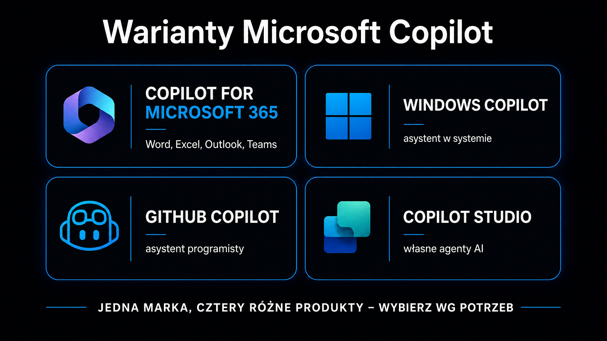

Microsoft Copilot nie jest prostym chatbotem doklejonym do pakietu biurowego. To wielowarstwowa platforma oparta na [dużych modelach językowych](https://pl.wikipedia.org/wiki/Du%C5%BCy_model_j%C4%99zykowy) (LLM – Large Language Model), która integruje wnioskowanie AI z danymi korporacyjnymi, systemem operacyjnym Windows i środowiskiem programistycznym GitHub. W 2026 roku ekosystem Copilota obejmuje co najmniej cztery odrębne produkty – Copilot for Microsoft 365, Copilot w Windows 11, GitHub Copilot i Copilot Studio – a każdy z nich działa według nieco innej logiki. Jeśli szukasz szerszego kontekstu rynkowego, [przewodnik po modelach LLM](/modele-llm/przewodnik/) zestawia usługę Copilot z innymi platformami AI dostępnymi dla firm. Poniższy artykuł wyjaśnia, jak działa każde z tych rozwiązań, czym się od siebie różnią i kiedy ich wdrożenie ma uzasadnienie finansowe.

## Czym jest Microsoft Copilot i jak działa jego architektura?

Copilot to marka parasolowa, pod którą firma Microsoft zebrała kilka powiązanych, ale odrębnych produktów opartych na sztucznej inteligencji. Wspólnym mianownikiem są modele z rodziny GPT firmy OpenAI (Microsoft jest ich największym inwestorem), choć w 2026 roku organizacje mogą w niektórych aplikacjach wybierać między modelami OpenAI a modelami Claude firmy Anthropic.

**Kluczowym elementem architektury jest Indeks Semantyczny (Semantic Index for Copilot) – wektorowa reprezentacja wiedzy korporacyjnej budowana na bazie usługi Microsoft Graph.** Zamiast klasycznego wyszukiwania za pomocą słów kluczowych, system generuje wielowymiarowe osadzenia wektorowe (ang. *embeddings*) dla dokumentów, wiadomości e-mail i spotkań. Obiekty o zbliżonym znaczeniu trafiają do sąsiadujących klastrów wektorowych – dzięki temu model rozumie intencję pytania, nawet jeśli użytkownik nie zna dokładnej nazwy pliku.

Architektura przetwarzania zapytania wygląda następująco:

- **Wstępne wzbogacenie kontekstu** – zanim prompt trafi do modelu, system odpytuje Microsoft Graph i Indeks Semantyczny, dołączając dziesiątki stron kontekstu z wiadomości e-mail, dysków i kalendarza
- **Ugruntowanie odpowiedzi** – model generuje treść ściśle osadzoną w danych organizacji, a nie wyłącznie na wiedzy ogólnej
- **Weryfikacja uprawnień** – każda odpowiedź jest filtrowana przez reguły RBAC (Role-Based Access Control); model nie może udostępnić danych, do których pytający nie ma dostępu
- **Szyfrowanie typu end-to-end** – dane klientów nie są wykorzystywane do trenowania modeli bazowych; firma Microsoft działa w tym przypadku jako podmiot przetwarzający dane, zgodnie z przepisami RODO

To odróżnia usługę Copilot for Microsoft 365 od publicznie dostępnego ChatGPT. Model GPT-5 w wariancie konsumenckim nie wie, co znajduje się na Twoim dysku OneDrive ani kto uczestniczył we wczorajszym spotkaniu. Copilot ma do tego dostęp – i potrafi połączyć tę wiedzę z zadanym pytaniem.

<aside class="callout-fact">
  
✦

  

    
Ciekawostka

    
Od 2019 roku Microsoft zainwestował w OpenAI łącznie ponad 13 miliardów dolarów. <strong>W zamian firma otrzymała wyłączne prawa do komercjalizacji modeli GPT w swoich produktach – to właśnie ta umowa jest technicznym fundamentem całego ekosystemu Copilota.</strong>

  

</aside>

## Copilot for Microsoft 365 – asystent w aplikacjach biurowych

To flagowy produkt z perspektywy organizacji. Copilot for Microsoft 365 osadza asystenta AI bezpośrednio w programach Word, Excel, PowerPoint, Outlook i Teams. Nie jest to jedynie okno czatu obok aplikacji – sztuczna inteligencja ma wgląd w aktualnie otwarty plik i może na nim operować.

W programie Word Copilot potrafi napisać pierwszy szkic na podstawie briefu, podsumować długi raport do dwóch stron albo zaproponować korekty stylistyczne z uwzględnieniem firmowego szablonu. **W programie Excel zadebiutowała natywna funkcja `=COPILOT()`, która pozwala osadzać żądania AI bezpośrednio w komórkach arkusza i przetwarzać całe kolumny tekstowe jednym promptem.** Dla działów analitycznych to realna zmiana – zamiast ręcznego kategoryzowania setek rekordów, wystarczy opisać pożądaną kategorię w języku naturalnym.

W programie PowerPoint Copilot potrafi wygenerować całą prezentację z pliku Word (do 24 MB), automatycznie dobierając zaaprobowane zdjęcia z firmowego zestawu identyfikacji wizualnej i dodając poprawne teksty alternatywne dla czytników ekranu.

Outlook i Teams to osobny rozdział. Copilot w programie Outlook potrafi samodzielnie identyfikować nakładające się spotkania i sugerować priorytety bez otwierania kalendarza. W komunikatorze Teams analizuje wcześniejsze wątki wiadomości podczas trwającej rozmowy wideo, by w czasie rzeczywistym uzupełnić kontekst negocjacyjny.

Poniższa tabela porównuje główne zastosowania usługi Copilot w poszczególnych aplikacjach pakietu:

| Aplikacja | Kluczowe zastosowanie | Wymagany kontekst |
|---|---|---|
| Word | Szkic, podsumowanie, korekta stylu | Dokument otwarty lub plik w OneDrive |
| Excel | Analiza danych, formuły, =COPILOT() | Arkusz lokalny lub chmurowy |
| PowerPoint | Generowanie prezentacji, brand kit | Plik Word jako źródło, SharePoint |
| Outlook | Zarządzanie kalendarzem, odpowiedzi na e-maile | Skrzynka i kalendarz użytkownika |
| Teams | Podsumowania spotkań, przeszukiwanie wątków | Nagranie lub transkrypcja spotkania |
| OneDrive | Szybkie pytania o zawartość pliku | Miniatura – prompt bez otwierania pliku |

### Cennik i wymagania licencyjne

Model biznesowy usługi Copilot for Microsoft 365 wymaga posiadania bazowej licencji Microsoft 365 (Business Standard, Business Premium lub Enterprise E3/E5). Sama usługa kosztuje 30 USD za użytkownika miesięcznie w wariancie Enterprise; dla mniejszych firm (do 300 użytkowników) dostępny jest plan w cenie od 18 do 25 USD przy zobowiązaniu rocznym.

**Bez bazowej licencji M365 nie można dokupić usługi Copilot – jest to twarde wymaganie techniczne**, a nie wyłącznie handlowe. Indeks Semantyczny potrzebuje danych z Microsoft Graph, który jest dostępny tylko w ramach subskrypcji M365.

## Windows 11 i Copilot jako system operacyjny oparty na agentach

Copilot wbudowany w Windows 11 to inny produkt niż ten w pakiecie biurowym. W tym przypadku celem jest integracja z samym systemem operacyjnym, a nie z konkretnymi plikami.

W 2026 roku Microsoft określa Windows z Copilotem mianem Agentic OS – systemu zdolnego do autonomicznego wykonywania wieloetapowych zadań. Kilka funkcji jest wartych wyodrębnienia:

- **Copilot Vision** – analizuje okno aktywnej aplikacji i może wyświetlić wskazówkę wizualną na ekranie (dosłownie wskazać kursorem, gdzie kliknąć), eliminując potrzebę korzystania ze statycznych podręczników wdrożeniowych
- **Pamięć długoterminowa** – trwały zapis historii operacji na plikach i powiadomień systemowych, który pozwala modelowi personalizować zachowanie asystenta przez wiele sesji
- **Agentic Actions** – asystent może asynchronicznie wypełnić formularz w tle lub zrealizować wieloetapowe zadanie bez przerywania bieżącej pracy użytkownika

Każda z tych funkcji wymaga jawnej zgody użytkownika (privacy opt-in). Microsoft wycofał się ze wcześniejszego podejścia, w którym powiadomienia Copilota były natrętnie umieszczane w różnych miejscach systemu – projekt o nazwie kodowej K2 porządkuje punkty styku, integrując je w scentralizowanym interfejsie.

Jeśli chcesz sprawdzić, jak modele AI postrzegają Twoją markę po wdrożeniu jej w nowych kanałach, darmowe narzędzie [Widoczność marki w AI](/narzedzia/brand-check/) odpyta cztery silniki AI i zaprezentuje wyniki w kilkadziesiąt sekund.

## GitHub Copilot – asystent w środowisku programistycznym

GitHub Copilot to najstarszy produkt z rodziny – działał jako narzędzie do autouzupełniania kodu w IDE już w 2021 roku. W 2026 roku to coś znacznie więcej niż autouzupełnianie: to rozproszony agent zdolny do samodzielnego przeglądu kodu, pisania testów, generowania opisów commitów i zarządzania żądaniami Pull Request bez opuszczania terminala.

**Kluczową zmianą architektoniczną jest integracja z protokołem MCP (Model Context Protocol), który pozwala agentowi czytać dokumentację projektową z pliku Word na SharePoincie podczas pisania kodu** – bez konieczności ręcznego kopiowania i wklejania kontekstu.

### Nowy model rozliczeń AI Credits

Od czerwca 2026 roku GitHub przechodzi od stałych opłat na model rozliczeń oparty na faktycznym zużyciu (ang. usage-based billing). Każda licencja ma przydzieloną pulę Kredytów AI (AI Credits) równą wartości planu:

- **Plan Free (0 USD)** – 50 zapytań premium miesięcznie (w tym dostęp do trybu agentowego) oraz 2000 autouzupełnień
- **Plan Pro (10 USD)** – pula 1000 kredytów AI (równowartość 10 USD) na koszty wnioskowania; nielimitowane autouzupełnianie składni
- **Plan Pro+ (39 USD)** – pula 3900 kredytów AI (równowartość 39 USD); pełny dostęp do narzędzia GitHub Spark i nieograniczone autouzupełnianie
- **Plan Business (19 USD/os.)** – możliwość łączenia niewykorzystanych kredytów między pracownikami (pooling)
- **Plan Enterprise (39 USD/os.)** – pełna pula z twardymi limitami budżetowymi narzucanymi przez dział IT

Zmiana modelu rozliczeń to reakcja na realne wydarzenia rynkowe: programiści z firmy Uber wyczerpali swój budżet na narzędzia AI w ciągu zaledwie czterech miesięcy (warto zaznaczyć, że całkowity budżet R&D firmy wynosił 3,4 mld USD, a wydatki na AI stanowiły jego istotną część). Microsoft wyciągnął z tego wnioski i wymusił na organizacjach wdrożenie praktyk kontroli kosztów – w literaturze branżowej określa się to terminem FinOps (Financial Operations) dla AI.

<aside class="callout-expert">
  

  

    
Opinia eksperta

    
W projektach, które prowadzimy w ICEA, GitHub Copilot przynosi największą wartość nie przy pisaniu nowego kodu, lecz przy dokumentowaniu i recenzowaniu istniejącego. W przypadku starszych repozytoriów z nieudokumentowaną logiką biznesową Copilot potrafi w kilkadziesiąt minut wygenerować opisy funkcji, których nikt już nie pamięta. <strong>Rekomendacja dla zespołów wdrażających: zacznij od trybu code review i generowania opisów commitów, nie od trybu agentowego – zwrot z inwestycji (ROI) jest widoczny natychmiast i nie wymaga drogich kredytów z wyższych planów.</strong>

    
Tomasz Czechowski · Head of SEO, ICEA

  

</aside>

## Copilot Studio – tworzenie własnych agentów AI

Copilot Studio to narzędzie, które wykracza poza tworzenie gotowych asystentów. Pozwala organizacjom tworzyć własnych agentów AI bez pisania kodu – za pomocą interfejsu low-code opartego na rozwiązaniach Power Platform.

Agent zdefiniowany w narzędziu Copilot Studio potrafi odpowiadać na pytania dotyczące firmowych procedur HR, automatycznie tworzyć zgłoszenia w systemie serwisowym po wykryciu problemu w aplikacji Teams lub obsługiwać klientów zewnętrznych za pośrednictwem wbudowanego widżetu na stronie internetowej.

Kilka praktycznych aspektów wdrożenia Copilot Studio:

- **Źródła wiedzy** – agent może być ugruntowany na plikach z SharePointa, PDF-ach, bazach wiedzy Dynamics 365 lub zewnętrznych stronach internetowych
- **Integracje MCP** – otwarte połączenia z zewnętrznymi systemami (ServiceNow, Salesforce, autorskie systemy CRM) przez serwery MCP
- **App Builder** – moduł do generowania lekkich mikroaplikacji bazodanowych z poziomu czatu; nie wymaga interwencji działu IT, ale działa bez dostępu do zewnętrznych API (celowe ograniczenie bezpieczeństwa)
- **Bezpieczeństwo** – etykiety wrażliwości z systemu Microsoft Purview są dziedziczone przez agentów; jeśli dokument jest oznaczony jako „Poufne", podsumowanie wygenerowane przez agenta automatycznie otrzymuje tę samą etykietę

Dostęp do Copilot Studio jest wliczony w licencję Microsoft 365 Copilot (Enterprise), ale tworzenie agentów na dużą skalę może generować dodatkowe koszty w modelu pay-per-message w połączeniu z Power Platform.

Warto spojrzeć na Copilot Studio w szerszym kontekście: to odpowiedź Microsoftu na rosnący rynek narzędzi low-code do budowania agentów AI. Szczegółowe porównanie z innymi platformami znajdziesz w [artykule o modelu Claude](/modele-llm/claude/).

## Usługa Copilot a pozycjonowanie marki w wynikach AI – co to zmienia dla SEO

W tym miejscu pojawia się wymiar, który interesuje specjalistów od widoczności w erze sztucznej inteligencji. Wariant Copilota w wyszukiwarce Bing – czyli darmowa edycja publiczna, dostępna bez licencji – jest silnikiem RAG (Retrieval-Augmented Generation, czyli generowania wspomaganego wyszukiwaniem) zbudowanym na danych Bing Search. Gdy użytkownik zadaje pytanie w przeglądarce Edge lub na stronie bing.com, model pobiera fragmenty stron i syntetyzuje odpowiedź.

**Dla marek oznacza to, że widoczność w narzędziu Bing Copilot zależy od tych samych czynników, co widoczność w Google AI Overviews** – od gęstości faktograficznej treści, struktury semantycznej i dostępności strony dla botów AI. Strony blokowane w pliku `robots.txt` dla bota `Bingbot` nie zostaną w żadnych okolicznościach zacytowane przez Copilota.

Szczegółowe zasady optymalizacji pod ten silnik opisuje nasz artykuł o [Bing Copilocie](/pozycjonowanie-ai/bing-copilot/). Szerszy kontekst – jak działają mechanizmy cytowania we wszystkich silnikach AI – znajdziesz w [przewodniku po GEO](/geo/przewodnik/).

Jeśli chcesz wiedzieć, jak Twoja strona wypada pod kątem cytowalności, nasze narzędzie [Ocena cytowalności strony](/narzedzia/url-check/) przeanalizuje ją w 30 sekund.

## Jak wybrać właściwy wariant Copilota dla swojej organizacji?

Wybór wariantu zależy od trzech czynników: rodzaju pracy dominującej w organizacji, istniejącej infrastruktury firmy Microsoft oraz dostępnego budżetu na użytkownika.

Punktem startowym dla większości firm jest Copilot for Microsoft 365. Jeśli organizacja już płaci za M365 Business Standard lub Enterprise, próg wejścia to dokupienie licencji Copilot – bez wdrażania nowej infrastruktury. Wartość jest najszybciej odczuwalna w programach Outlook i Teams, ponieważ tam ROI jest mierzalny przez oszczędność czasu na spotkaniach i redakcji wiadomości.

GitHub Copilot warto rozważyć niezależnie, nawet jeśli firma nie posiada licencji M365. Dla zespołów deweloperskich plan Pro (10 USD miesięcznie) zwraca się przy zaledwie kilku godzinach zaoszczędzonych tygodniowo.

Copilot Studio ma sens od momentu, gdy organizacja identyfikuje powtarzalny proces obsługi zapytań – wewnętrznych (HR, IT helpdesk) lub zewnętrznych (obsługa klienta). Budowa prostego agenta FAQ zajmuje kilka godzin i obywa się bez pisania kodu.

**Jeśli organizacja dopiero zaczyna przygodę z AI w pracy, najlepszą decyzją jest uruchomienie pilotażu z 20–50 użytkownikami przez trzy miesiące przed zakupem licencji dla całej firmy.** Microsoft oferuje okresy próbne – warto je wykorzystać, zanim podejmiesz roczne zobowiązanie finansowe.
