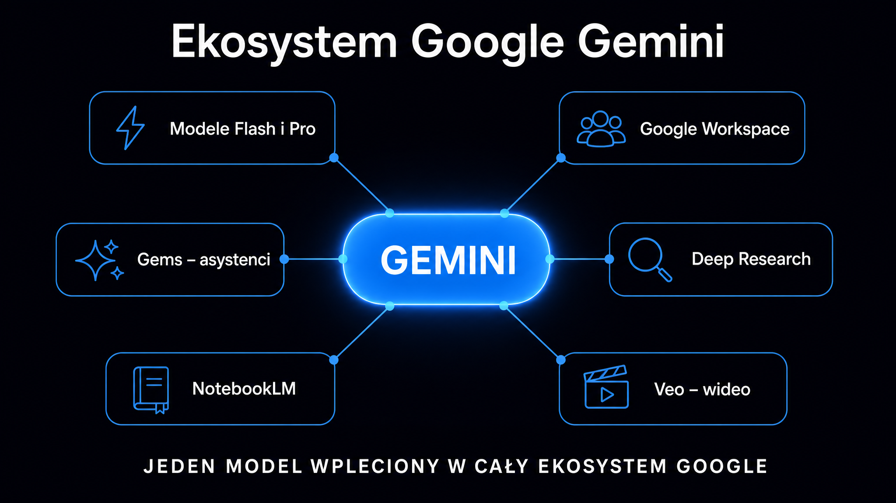

Gemini to rodzina dużych modeli językowych (LLM – Large Language Model) opracowana przez Google DeepMind, napędzająca zarówno asystenta w aplikacji gemini.google.com, jak i setki funkcji AI wbudowanych w aplikacje Gmail, Dokumenty, Arkusze, Prezentacje, Dysk i Meet. Google zadebiutowało z Gemini w grudniu 2023 roku, zastępując nim poprzednią linię PaLM 2, i od tamtej pory ekosystem rozrósł się do kilkunastu wariantów modeli, czterech planów abonamentowych dla konsumentów oraz głębokiej integracji z całym środowiskiem Workspace. Jeśli Twoja marka działa w przestrzeni, gdzie klienci coraz częściej zadają pytania w Google AI Mode, zamiast wpisywać frazy w tradycyjną wyszukiwarkę, ten przewodnik wyjaśnia mechanizm, możliwości i praktyczne implikacje – bez pomijania kontekstu biznesowego.

## Czym jest Gemini i jak wpisuje się w ekosystem Google?

Gemini to równocześnie nazwa rodziny modeli, aplikacji konsumenckiej i zestawu funkcji w Google Workspace. Żeby nie gubić się w terminologii, warto rozdzielić te trzy warstwy od samego początku.

Trzy poziomy ekosystemu Gemini:

- **Modele bazowe** – seria Gemini Flash, Pro i Ultra, trenowane przez Google DeepMind; stanowią fundament wszystkich produktów Gemini; dostępne przez Gemini API i Google AI Studio
- **Aplikacja Gemini** – interfejs konwersacyjny dostępny pod adresem gemini.google.com i jako aplikacja mobilna; odpowiednik ChatGPT czy Claude w modelu B2C; plany: Free, AI Plus, AI Pro, AI Ultra
- **Gemini w Workspace** – warstwa AI zintegrowana z aplikacjami Gmail, Dokumenty, Arkusze, Prezentacje, Dysk i Meet; dostępna w planach Business Standard i wyższych bez dopłaty; w 2025 roku Google przestało sprzedawać Gemini jako osobny dodatek i wbudowało go w każdy plan Workspace

Google DeepMind, dział badawczy stojący za modelami, jest wynikiem połączenia Google Brain i DeepMind w 2023 roku. **To właśnie DeepMind odpowiada za architekturę Gemini – multimodalną od podstaw, a nie jak wcześniejsze modele: tekstową z dodanym modułem wizyjnym.**

W kontekście widoczności marki w AI: cały ekosystem – od Google AI Mode po odpowiedzi Gemini w aplikacji – czerpie z tych samych modeli bazowych. Mechanizmy cytowania i wyszukiwania informacji (RAG) opisuje [przewodnik po modelach LLM](/modele-llm/przewodnik/) – to dobry punkt wyjścia, zanim zaczniesz optymalizować treści pod ten kanał.

## Jak działa model Gemini oparty na multimodalności?

Gemini od pierwszej wersji zaprojektowano jako model [przetwarzania języka naturalnego](https://pl.wikipedia.org/wiki/Przetwarzanie_j%C4%99zyka_naturalnego), który rozumie tekst, obraz, audio i wideo w ramach jednej architektury – nie przez łączenie osobnych modeli, lecz przez wspólny trening na danych różnych modalności.

To fundamentalna różnica w stosunku do pierwszej generacji ChatGPT czy wcześniejszego Barda. GPT-4 z funkcją analizy obrazu to model tekstowy rozszerzony o oddzielny koder obrazu. Gemini przetwarza token tekstowy i token wizualny w tej samej przestrzeni wagowej, co pozwala na wnioskowanie krzyżowe – model odpowiadający na pytanie o zdjęcie nie „opisuje obrazka", lecz łączy kontekst wizualny z tekstowym w jednym kroku rozumowania.

### Rodzina modeli – Flash, Pro i Ultra

Google strukturyzuje swoje modele według trzech klas, różnicując je pod względem szybkości, możliwości i ceny:

| Model | Charakterystyka | Typowe zastosowanie |
|---|---|---|
| **Gemini Flash Lite** | Najniższy koszt, najkrótszy czas odpowiedzi | Zadania masowe: klasyfikacja, ekstrakcja, proste pytania i odpowiedzi (Q&A) |
| **Gemini Flash** | Balans szybkości i jakości | Aplikacje z wymaganiami czasowymi, NotebookLM, agenci w Workspace |
| **Gemini Pro** | Zaawansowane wnioskowanie | Analiza dokumentów, złożone pytania, Deep Research |
| **Gemini Ultra** | Maksymalne możliwości | Wieloetapowe zadania badawcze, model dostępny w planie AI Ultra |

Aktualna generacja nosi oznaczenie 3.x (po debiucie Gemini 3 Pro w listopadzie 2025 roku i Gemini 3 Flash w grudniu 2025). Google stosuje sześciomiesięczny cykl wydań; starsze generacje są wycofywane z API, co wymaga ciągłej aktualizacji integracji.

**Gemini Flash Lite jest najtańszym modelem w koszyku Google: przy cenach API rzędu ułamka dolara za milion tokenów obsługuje masowe przepływy pracy przy minimalnym koszcie jednostkowym.** To właśnie Flash Lite zasila większość automatyzacji opartych na Gemini w środowisku Workspace.

### Okno kontekstowe 1 miliona tokenów

Modele Pro i Ultra operują na oknie kontekstowym wynoszącym 1 milion tokenów. W praktyce oznacza to możliwość wczytania całej dokumentacji technicznej projektu, kilkudziesięciu raportów lub obszernego zbioru danych i poddania ich spójnej analizie. To jeden z największych praktycznych kontekstów wśród komercyjnych modeli – dla porównania, GPT-4o obsługuje 128 000 tokenów, a Claude 3 Opus okno rzędu 200 000 w standardowej konfiguracji.

<aside class="callout-fact">
  
✦

  

    
Ciekawostka

    
Firma Google ogłosiła architekturę Gemini jako pierwszą od podstaw multimodalną rodzinę modeli – tekst, obraz, audio i wideo trenowane razem, nie jako osobne komponenty. Wcześniejsze modele Google (PaLM 2, Bard) były modelami językowymi z dodanym modułem wizyjnym. <strong>Gemini Ultra w benchmarku MMLU uzyskał wynik 90,0%, jako pierwszy model AI przekraczając osiągi ludzkich ekspertów wynoszące 89,8%.</strong>

  

</aside>

## Plany abonamentowe – Free, AI Plus, AI Pro, AI Ultra

Aplikacja Gemini dostępna jest w czterech planach konsumenckich. Poniżej zestawienie aktualne na maj 2026 roku – po zmianach ogłoszonych podczas Google I/O 2026:

| Plan | Cena | Modele | Kluczowe funkcje |
|---|---|---|---|
| **Free** | 0 USD/mies. | Gemini 3.5 Flash | Czat, tryb głosowy Gemini Live (z limitami), 5 raportów Deep Research/mies. |
| **AI Plus** | 7,99 USD/mies. | Gemini 3.5 Flash | Wyższe limity, dostęp do funkcji Workspace AI |
| **AI Pro** | 19,99 USD/mies. | Gemini 3.1 Pro (limity oparte na zużyciu) | 20 raportów Deep Research/dzień, okno 1M tokenów, Gems, NotebookLM Plus |
| **AI Ultra** | 99,99–200 USD/mies. | Gemini Ultra (limity oparte na zużyciu) | 200 raportów Deep Research/dzień, Veo do generowania wideo, priorytetowy dostęp, 30 TB przestrzeni |

**Plan AI Pro za 19,99 USD miesięcznie to standard dla osób pracujących z AI na co dzień.** Dostęp do 20 raportów Deep Research dziennie i okno kontekstowe 1 miliona tokenów pokrywają większość zastosowań analitycznych i badawczych bez konieczności przechodzenia na dużo droższy plan AI Ultra.

Workspace działa inaczej – Google wbudowało Gemini w plany Business Standard, Business Plus, Enterprise Starter i wyższe bez dodatkowych opłat, rezygnując z modelu osobnego dodatku w styczniu 2025 roku. Oznacza to, że każda firma płacąca za Google Workspace na poziomie Business Standard lub wyższym automatycznie ma dostęp do Gemini w aplikacjach Gmail, Dokumenty, Arkusze i Dysk.

## Gemini w Google Workspace – od asystenta do agenta

Gemini w Workspace to dziś znacznie więcej niż okienko do pisania e-maili. Google systematycznie przesuwa model z trybu asystenta (pytasz – odpowiada) w kierunku podejścia agentowego (model sam planuje, wykonuje kroki i wraca z gotowym wynikiem).

Najważniejsze integracje w poszczególnych narzędziach:

- **Gmail** – streszczanie długich wątków, szkice odpowiedzi z uwzględnieniem kontekstu poprzednich wiadomości, automatyczne etykiety i filtry przez Workspace Studio
- **Dokumenty** – przepisywanie, zmiana tonu, generowanie szkiców na podstawie opisu; funkcja „Pomóż mi pisać" dostępna z bocznego panelu
- **Arkusze** – generowanie formuł z opisu tekstowego, analiza danych za pomocą zapytań w języku naturalnym, automatyczne wykresy
- **Prezentacje** – propozycje układów, generowanie obrazów AI wbudowane bezpośrednio w kreator, przepisywanie tekstu na slajdach
- **Meet** – notatki ze spotkania w czasie rzeczywistym, podsumowania zadań do wykonania, tłumaczenie na żywo

Workspace Studio, uruchomione pod koniec 2025 roku, to osobna warstwa automatyzacji – użytkownik opisuje w zwykłym języku wieloetapowy przepływ pracy (np. „po każdym spotkaniu z klientem utwórz dokument z podsumowaniem i wyślij e-mail z listą zadań"), a Workspace tłumaczy to na działający proces bez konieczności pisania linijki kodu.

W kwietniu 2026 roku Google zaprezentowało Workspace Intelligence – semantyczną warstwę kontekstu, która łączy e-maile, pliki, rozmowy i aktywne projekty w jeden spójny obraz dla modelu. Celem jest przejście od zbioru osobnych narzędzi do systemu, który rozumie, co pracownik próbuje osiągnąć, i samodzielnie łączy potrzebne elementy. **To ambitna zmiana architektury, której skutki widać już w testach beta u klientów Enterprise – model "zna" kontekst projektu bez konieczności ręcznego wklejania go do każdego zapytania.**

## Gems – personalizowani asystenci AI

Gems to mechanizm tworzenia wyspecjalizowanych asystentów na bazie modeli Gemini. Użytkownik dostarcza zestaw instrukcji – rolę, styl odpowiedzi, zakres tematyczny, ewentualne pliki z dokumentacją – i zapisuje je w formie nazwanego Gema dostępnego z paska bocznego w Gemini lub Workspace.

Przykłady zastosowań dla Gems:

- **Analityk danych** – Gem z instrukcją analizowania arkuszy CSV w określonym formacie; po wgraniu pliku model automatycznie stosuje ustalone wzorce raportowania
- **Copywriter marki** – Gem z wgranym przewodnikiem po głosie i tonie komunikacji marki; każde zadanie copywriterskie uwzględnia ustalone reguły językowe bez konieczności ich ponownego wpisywania
- **Ekspert onboardingowy** – Gem zasilony wewnętrzną dokumentacją firmy; nowy pracownik pyta o procesy, a model odpowiada wyłącznie na podstawie dostarczonych materiałów

Gemy były początkowo dostępne wyłącznie w planach płatnych, ale od marca 2025 roku Google udostępniło je wszystkim użytkownikom wraz z możliwością wgrywania plików. We wrześniu 2025 roku Google umożliwiło udostępnianie Gemów między użytkownikami, co otworzyło rynek na gotowych, wyspecjalizowanych asystentów branżowych.

## Deep Research – agent badawczy Gemini

Deep Research to zaawansowany agent badawczy, dostępny w planie AI Pro oraz wyższych. Działa zupełnie inaczej niż standardowe zapytanie do modelu: zamiast generować odpowiedź od razu lub opierać się na pojedynczym wyszukiwaniu, przeprowadza autonomiczny proces badawczy trwający nierzadko kilka minut.

Mechanizm przebiega w czterech krokach. Najpierw model tworzy plan badania i przedstawia go użytkownikowi do zatwierdzenia lub modyfikacji – to element mocno odróżniający Deep Research od zwykłego wyszukiwania. Następnie agent przeszukuje dziesiątki, a w trybie Deep Research Max setki źródeł w sposób iteracyjny: każde znalezione źródło może wygenerować nowe pytania badawcze. Kolejny krok to synteza zebranych informacji w spójny raport, bogaty w cytowania. Na końcu raport można wyeksportować do Dokumentów Google za pomocą zaledwie jednego kliknięcia.

Deep Research Max, uruchomiony w 2026 roku na bazie modelu Gemini 3.1 Pro, dodaje również obsługę MCP (protokołu kontekstu modelu), dzięki czemu agent może sięgać nie tylko do zasobów publicznego internetu, ale też do prywatnych baz danych firmy czy wewnętrznych systemów dokumentacji. **To przekształca Deep Research z narzędzia do analizy rynku w pełnoprawny system do analizy danych wewnętrznych w skali korporacyjnej (enterprise).**

Jeśli chcesz sprawdzić, jak Twoja marka pojawia się w wynikach badań generowanych przez Gemini, bezpłatny audyt marki ([Widoczność marki w AI](/narzedzia/brand-check/)) potrafi odpytać cztery silniki AI jednocześnie i wskazać różnice w odpowiedziach – bez czasochłonnego, ręcznego testowania.

## NotebookLM – praca z własnymi dokumentami

NotebookLM to narzędzie do analizy dokumentów operujące wyłącznie na materiałach dostarczonych przez użytkownika. Model nie korzysta z danych treningowych przy formułowaniu odpowiedzi – bazuje bezpośrednio na wgranych plikach, takich jak PDF-y, Dokumenty Google, strony internetowe, a także pliki audio i wideo.

Wyróżnikiem, który przyniósł platformie NotebookLM ogólnoświatowy rozgłos we wrześniu 2024 roku, jest funkcja Audio Overview: generuje ona przypominającą podcast rozmowę dwóch wirtualnych prezenterów AI, którzy sprawnie omawiają wgrane materiały, wskazują kluczowe powiązania i formułują pytania. W 2025 roku Google rozszerzyło tę funkcję o 76 języków, opcję wyboru formatu audycji (rozmowa głęboka, skrót, debata, krytyka) oraz tryb interaktywny, w którym użytkownik może na żywo przerwać rozmowę AI i zadać prelegentom własne pytanie.

NotebookLM ma doskonałe zastosowanie bezpośrednio w content marketingu i procesach SEO:

- **Analiza transkryptów wywiadów** – wgraj kilkanaście rozmów z klientami i zapytaj o powtarzające się problemy badawcze; model wyciągnie wzorce i zacytuje fragmenty ze źródeł
- **Przygotowanie do audytu** – wgraj dokumentację techniczną oraz raporty analityczne; model precyzyjnie odpowiada na zadane pytania wraz z odsyłaczami do konkretnych sekcji dokumentu
- **Tworzenie briefów contentowych** – wgraj najnowsze raporty branżowe i badania rynkowe; poproś AI o strukturę docelowego artykułu wraz z kluczowymi tezami do rozwinięcia

<aside class="callout-expert">
  

  

    
Opinia eksperta

    
W projektach, które prowadzimy w ICEA, Gemini wyróżnia się w dwóch obszarach: analizie dużych zbiorów dokumentów dzięki milionowemu oknu kontekstowemu oraz integracji z Workspace, która eliminuje problem ciągłego przełączania kontekstu. Dla zespołów pracujących w całości w ekosystemie Google – Gmailu, Dokumentach, Meet – wdrożenie Gemini jest relatywnie najtańsze ze wszystkich liczących się na rynku modeli. Kwestią, którą jednak zawsze sprawdzam przy nowych klientach, jest to, czy ich treści są w ogóle widoczne w Google AI Mode. <strong>Firmy z dobrą pozycją w tradycyjnej wyszukiwarce często są całkowicie pomijane w AI Overviews, chociażby z tego względu, że ich treści mają charakter czysto opisowy, a nie faktograficzny. To pierwsze miejsce do poprawki przed jakimkolwiek zwiększaniem firmowego budżetu na nowe narzędzia AI.</strong>

    
Tomasz Czechowski · Head of SEO, ICEA

  

</aside>

## Veo i generowanie wideo w ekosystemie Gemini

Veo to rodzina modeli dedykowanych do generowania wideo wysokiej jakości z opisu tekstowego lub zestawu obrazów. Veo jest dostępna w planach AI Ultra oraz z poziomu API dla zewnętrznych deweloperów. Nowsze modele Veo 3.1 i Veo 3.1 Fast (wydane pod koniec 2025 roku) dają m.in. możliwość rozszerzenia raz wygenerowanego klipu oraz użycia aż trzech obrazów referencyjnych jako wizualnych punktów odniesienia dla AI.

W kontekście marketingowym Veo ma potężne zastosowanie przede wszystkim w produkcji krótkich formatów wizualnych do mediów społecznościowych, animacji produktowych i zajawek kampanii – a wszystko to bez konieczności angażowania pełnego studia produkcyjnego przy niskich wolumenach treści.

Z kolei środowisko Gemini Live API, uruchomione w marcu 2026 roku wraz z wersją Gemini 3.1 Flash Live, to równoległa warstwa technologiczna przeznaczona do budowania aplikacji obsługujących rozmowy głosowe w czasie rzeczywistym z niezwykle niskim opóźnieniem. Model ten na bieżąco przetwarza ciągły strumień audio i wideo, obsługuje naturalne przerwania rozmowy przez użytkownika i odpowiada głosem z opóźnieniem rzędu ułamków sekund. Deweloperzy wykorzystują to API do konstruowania interfejsów głosowych nowej generacji, inteligentnych asystentów sprzedażowych czy autonomicznych systemów obsługi klienta.

## Google AI Studio – platforma deweloperska

Google AI Studio (aistudio.google.com) to oficjalna, bezpłatna platforma do prototypowania przeznaczona dla deweloperów i badaczy. To tu z poziomu przeglądarki można bezpośrednio testować najnowsze modele Gemini, porównywać jakość odpowiedzi różnych wariantów, konfigurować zaawansowane parametry (takie jak temperatura modelu, instrukcja systemowa czy okno kontekstowe) oraz generować niezbędne klucze API.

AI Studio obsługuje tryb wielomodalny bezpośrednio z poziomu interfejsu graficznego: możesz wgrać tam zdjęcie, plik audio lub krótkie wideo i natychmiast przetestować, jak dokładnie model zinterpretuje przekazaną treść. Dla specjalistów z branży SEO i content marketerów to bardzo praktyczny sposób na błyskawiczne sprawdzenie, w jaki sposób Gemini analizuje docelową stronę produktową lub artykuł – zanim marketerzy zainwestują krwawicę i roboczogodziny w optymalizację takich zasobów.

Samo Gemini API wycenione jest klasycznie w oparciu o model pay-per-token. Gemini 3.5 Flash kosztuje obecnie około 1,50 USD za milion tokenów wejściowych i 9,00 USD za milion tokenów wyjściowych. W przypadku znacznie potężniejszego Gemini 3.1 Pro – ceny wynoszą 2,00 i 12,00 USD dla promptów do 200 000 tokenów (powyżej tego progu odpowiednio 4,00 i 18,00 USD). Dla zespołów deweloperskich projektujących dedykowane, własne integracje z Workspace lub firmowym systemem CRM daje to w pełni otwartą ścieżkę skalowania bez przymusu korzystania ze standardowych planów konsumenckich.

## Gemini a widoczność marki w Google AI Mode

Rosnący globalny udział Google AI Mode – czyli mechanizmu odpowiedzi generatywnych zastępujących tradycyjne listy linków organicznych – bezpowrotnie zmienia reguły gry dla współczesnych marketerów. Według danych branżowych zgromadzonych w 2025 roku, współczynnik klikalności (CTR) w przypadku zapytań generujących moduł AI Overviews spadł równo o 61% w stosunku do klasycznych wyników tekstowych (z okolic 1,76% do poziomu zaledwie 0,61%). W praktyce oznacza to tyle, że marka, która nie zdoła skutecznie pojawić się w syntezie i streszczeniu przygotowanym przez Gemini, drastycznie traci widoczność, i to pomimo utrzymywania bardzo dobrej pozycji w tradycyjnym, tekstowym SEO.

Co warte podkreślenia, cytowania wyświetlane w sekcji AI Overviews od Google mocno koncentrują się wokół bardzo wąskiej grupy najsilniejszych domen: zaledwie 20 czołowych serwisów odpowiada średnio za aż 66,18% wszystkich pojawiających się tam cytowań. Badania wykazują, że o wiele większą siłę predykcyjną dla widoczności w AI ma wcale nie gigantyczny profil linków zwrotnych, lecz gęsta i autorytatywna liczba wzmianek o marce (co-citations) – silna korelacja wzmiankowania z ostateczną widocznością w wynikach AI wynosi 0,334 (według zeszłorocznego raportu AI Visibility Report 2025).

Strukturalna optymalizacja pod Gemini oraz samo Google AI Mode to obecnie trzon szerszej dziedziny marketingu o nazwie GEO (Generative Engine Optimization – czyli organiczna optymalizacja bezpośrednio pod generatywne silniki wyszukiwania). Mechanizmy oceny cytowania, twarde wymagania co do technicznej struktury treści i realne taktyki skutecznie podnoszące wskaźnik uwzględnień w takich panelach szczegółowo opisuje [przewodnik po strategiach GEO](/geo/przewodnik/). Skuteczna strategia pozycjonowania dla konkretnego modelu, w tym przypadku rodziny Gemini, dostępna jest z kolei na dedykowanej stronie [pozycjonowanie AI – Gemini](/pozycjonowanie-ai/gemini/).

W celu trafnego zestawienia możliwości operacyjnych oraz samej biznesowej filozofii Gemini z jej największymi rywalami, warto sięgnąć także po inne opracowania: dedykowany [artykuł o specyfice ChatGPT](/modele-llm/chatgpt/) z perspektywy ekosystemu OpenAI oraz [kompleksowy przewodnik po modelu Claude](/modele-llm/claude/) prezentujący unikalne podejście firmy Anthropic do rygorystycznego bezpieczeństwa oraz koncepcji tzw. Constitutional AI.

Jeśli zależy Ci, aby zweryfikować realny punkt startowy widoczności cyfrowej własnej marki w gotowych odpowiedziach AI – między innymi za sprawą modelu Gemini – darmowe narzędzie audytu marki ([Widoczność marki w AI](/narzedzia/brand-check/)) błyskawicznie odpyta jednocześnie cztery wiodące silniki na rynku, pokazując czarno na białym, jak konkretnie algorytmy postrzegają Twój biznes na szerokim tle branży i konkurencji.
