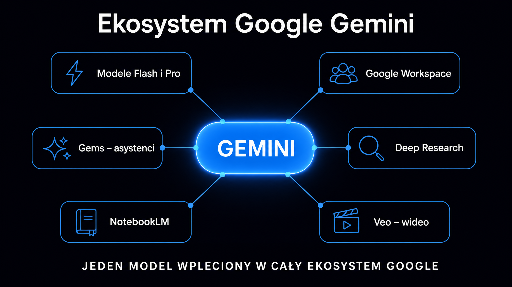

Gemini to rodzina dużych modeli językowych (LLM – Large Language Model) opracowana przez Google DeepMind. Napędza asystenta na gemini.google.com oraz setki funkcji AI wbudowanych w Gmail, Dokumenty, Arkusze, Prezentacje, Dysk i Meet. Google zadebiutowało z Gemini w grudniu 2023 roku, zastępując linię PaLM 2. Od tamtej pory ekosystem rozrósł się do kilkunastu wariantów modeli, czterech planów konsumenckich i głębokiej integracji z Workspace. Klienci coraz częściej zadają pytania w Google AI Mode, zamiast wpisywać frazy w tradycyjną wyszukiwarkę. Jeśli Twoja marka działa w tej przestrzeni, ten przewodnik wyjaśni Ci mechanizmy, możliwości i praktyczne implikacje Gemini w kontekście biznesowym.

## Czym jest Gemini i jak wpisuje się w ekosystem Google?

Gemini to równocześnie nazwa rodziny modeli, aplikacji konsumenckiej i zestawu funkcji w Google Workspace. Żeby nie gubić się w terminologii, rozdzielmy te trzy warstwy od samego początku.

Trzy poziomy ekosystemu Gemini:

- **Modele bazowe** – seria Gemini Flash, Pro i Ultra, trenowane przez Google DeepMind; stanowią fundament wszystkich produktów Gemini; dostępne przez Gemini API i Google AI Studio
- **Aplikacja Gemini** – interfejs konwersacyjny dostępny pod adresem gemini.google.com i jako aplikacja mobilna; odpowiednik ChatGPT czy Claude w modelu B2C; plany: Free, AI Plus, AI Pro, AI Ultra
- **Gemini w Workspace** – warstwa AI zintegrowana z aplikacjami Gmail, Dokumenty, Arkusze, Prezentacje, Dysk i Meet; dostępna w planach Business Starter i wyższych bez dopłaty; w 2025 roku Google przestało sprzedawać Gemini jako osobny dodatek i wbudowało go w każdy plan Workspace

Google DeepMind, dział badawczy stojący za modelami, powstał z połączenia Google Brain i DeepMind w 2023 roku. **To właśnie DeepMind odpowiada za architekturę Gemini – multimodalną od podstaw, a nie tekstową z doklejonym modułem wizyjnym.**

W kontekście widoczności marki w AI cały ekosystem – od Google AI Mode po odpowiedzi w aplikacji – czerpie z tych samych modeli bazowych. Mechanizmy cytowania i wyszukiwania informacji (RAG) opisuje [przewodnik po modelach LLM](/modele-llm/przewodnik/) – to doskonały punkt wyjścia, zanim zaczniesz optymalizować treści pod ten kanał.

## Jak działa model Gemini oparty na multimodalności?

Gemini od pierwszej wersji zaprojektowano jako model [przetwarzania języka naturalnego](https://pl.wikipedia.org/wiki/Przetwarzanie_j%C4%99zyka_naturalnego). Rozumie on tekst, obraz, audio i wideo w ramach jednej architektury. Nie łączy osobnych modeli, lecz przechodzi wspólny trening na danych różnych modalności.

To fundamentalna różnica w stosunku do pierwszej generacji ChatGPT czy Barda. GPT-4 z funkcją analizy obrazu to model tekstowy rozszerzony o oddzielny koder. Gemini przetwarza token tekstowy i token wizualny w tej samej przestrzeni wagowej. Pozwala to na wnioskowanie krzyżowe. **Model odpowiadający na pytanie o zdjęcie nie „opisuje obrazka", lecz łączy kontekst wizualny z tekstowym w jednym kroku rozumowania.**

### Rodzina modeli – Flash, Pro i Ultra

Google dzieli swoje modele na trzy klasy, różnicując je pod względem szybkości, możliwości i ceny:

| Model | Charakterystyka | Typowe zastosowanie |
|---|---|---|
| **Gemini Flash Lite** | Najniższy koszt, najkrótszy czas odpowiedzi | Zadania masowe: klasyfikacja, ekstrakcja, proste pytania i odpowiedzi (Q&A) |
| **Gemini Flash** | Balans szybkości i jakości | Aplikacje z wymaganiami czasowymi, NotebookLM, agenci w Workspace |
| **Gemini Pro** | Zaawansowane wnioskowanie | Analiza dokumentów, złożone pytania, Deep Research |
| **Gemini Ultra** | Maksymalne możliwości (pierwsza generacja) | Nazwa flagowca Gemini 1.0; dziś plan AI Ultra daje najwyższe limity modelu Gemini Pro |

Aktualna generacja nosi oznaczenie 3.x (po debiucie Gemini 3 Pro w listopadzie 2025 roku i Gemini 3 Flash w grudniu 2025). We wrześniu 2026 roku najnowszym stabilnym modelem Flash jest Gemini 3.8 Flash, który Google opisuje jako najinteligentniejszy model Flash, przeznaczony m.in. do długich zadań programistycznych i autonomicznych agentów. W API dostępne są też Gemini 3.7 Flash, 3.6 Flash, 3.5 Flash oraz lżejsze 3.5 Flash-Lite i 3.1 Flash-Lite, a linię Pro reprezentuje Gemini 3.1 Pro (w wersji preview). Starsze modele znikają z API – wyłączono już m.in. Gemini 2.0 Flash, 2.0 Flash-Lite i 3 Pro Preview – co wymusza ciągłą aktualizację integracji.

**Gemini Flash Lite to najtańszy model w koszyku Google: przy cenach API rzędu ułamka dolara za milion tokenów obsługuje masowe przepływy pracy przy minimalnym koszcie jednostkowym.** To właśnie on zasila większość automatyzacji w środowisku Workspace.

### Okno kontekstowe 1 miliona tokenów

Modele Gemini Pro operują na oknie kontekstowym wynoszącym 1 milion tokenów. W praktyce oznacza to możliwość wczytania całej dokumentacji technicznej projektu, kilkudziesięciu raportów lub obszernego zbioru danych. Model poddaje je spójnej analizie. Google jako jedno z pierwszych laboratoriów wprowadziło kontekst tej skali – jeszcze w 2024 roku GPT-4o obsługiwał 128 000 tokenów, a Claude 3 Opus okno rzędu 200 000. Dziś podobne okna oferują też konkurenci, np. GPT-6 Astra od OpenAI (1,05 mln tokenów).

<aside class="callout-fact">
  
✦

  

    
Ciekawostka

    
Firma Google ogłosiła architekturę Gemini jako pierwszą od podstaw multimodalną rodzinę modeli – tekst, obraz, audio i wideo trenowane razem, nie jako osobne komponenty. Wcześniejsze modele Google (PaLM 2, Bard) były modelami językowymi z dodanym modułem wizyjnym. <strong>Gemini Ultra w benchmarku MMLU uzyskał wynik 90,0%, jako pierwszy model AI przekraczając osiągi ludzkich ekspertów wynoszące 89,8%.</strong>

  

</aside>

## Plany abonamentowe – Free, AI Plus, AI Pro, AI Ultra

Aplikacja Gemini oferuje cztery plany konsumenckie. Poniżej zestawienie aktualne na wrzesień 2026 roku (ceny w USD):

| Plan | Cena | Modele | Kluczowe funkcje |
|---|---|---|---|
| **Free** | 0 USD/mies. | Gemini 3.6 Flash, ograniczony dostęp do 3.1 Pro | Czat, Gemini Live, Deep Research i Gems z limitami, 15 GB przestrzeni |
| **AI Plus** | 4,99 USD/mies. | Gemini 3.6 Flash, ograniczony dostęp do 3.1 Pro | 2× wyższe limity niż Free, Gemini w Gmailu i innych aplikacjach Google, Gemini Omni Flash w Google Flow, 400 GB przestrzeni |
| **AI Pro** | 19,99 USD/mies. | Gemini 3.1 Pro | 4× wyższe limity niż Free, szerszy dostęp do Deep Research, Deep Search, Deep Think (w wybranych krajach), okno 1M tokenów, więcej Audio Overviews w notatnikach, 5 TB przestrzeni |
| **AI Ultra** | od 99,99 USD/mies. (199,99 USD w wariancie z 20× limitami) | Gemini 3.1 Pro z najwyższymi limitami | Do 20× wyższe limity niż Free, najwyższy dostęp do Deep Research, Deep Think, Gemini Spark (w wybranych krajach), kredyty Google Flow do generowania wideo, priorytetowy dostęp do nowości, od 20 TB przestrzeni |

**Plan AI Pro za 19,99 USD miesięcznie to standard dla osób pracujących z AI na co dzień.** Szerszy dostęp do Deep Research i okno kontekstowe 1 miliona tokenów pokrywają większość zastosowań analitycznych. Nie musisz przechodzić na dużo droższy plan AI Ultra.

Workspace działa inaczej. Google wbudowało Gemini w plany Business Starter, Business Standard, Business Plus oraz Enterprise Starter i wyższe bez osobnego dodatku, rezygnując z tego modelu w styczniu 2025 roku. Każda firma płacąca za Workspace w planie Business lub Enterprise automatycznie zyskuje dostęp do AI w Gmailu, Dokumentach, Arkuszach i na Dysku.

## Gemini w Google Workspace – od asystenta do agenta

Gemini w Workspace to dziś znacznie więcej niż okienko do pisania e-maili. Google systematycznie przesuwa model z trybu asystenta (pytasz – odpowiada) w kierunku podejścia agentowego. Model sam planuje, wykonuje kroki i wraca z gotowym wynikiem.

Najważniejsze integracje w poszczególnych narzędziach:

- **Gmail** – streszczanie długich wątków, szkice odpowiedzi z uwzględnieniem kontekstu poprzednich wiadomości, automatyczne etykiety i filtry przez Workspace Studio
- **Dokumenty** – przepisywanie, zmiana tonu, generowanie szkiców na podstawie opisu; funkcja „Pomóż mi pisać" dostępna z bocznego panelu
- **Arkusze** – generowanie formuł z opisu tekstowego, analiza danych za pomocą zapytań w języku naturalnym, automatyczne wykresy
- **Prezentacje** – propozycje układów, generowanie obrazów AI wbudowane bezpośrednio w kreator, przepisywanie tekstu na slajdach
- **Meet** – notatki ze spotkania w czasie rzeczywistym, podsumowania zadań do wykonania, tłumaczenie na żywo

Workspace Studio, uruchomione pod koniec 2025 roku, to osobna warstwa automatyzacji. Użytkownik opisuje w zwykłym języku wieloetapowy przepływ pracy (np. „po każdym spotkaniu z klientem utwórz dokument z podsumowaniem i wyślij e-mail z listą zadań"). Workspace tłumaczy to na działający proces bez pisania choćby linijki kodu.

W kwietniu 2026 roku Google zaprezentowało Workspace Intelligence. To semantyczna warstwa kontekstu, która łączy e-maile, pliki, rozmowy i aktywne projekty w jeden spójny obraz. Celem jest przejście od zbioru osobnych narzędzi do systemu rozumiejącego intencje pracownika. **To ambitna zmiana architektury, której skutki widać już w testach beta u klientów Enterprise – model "zna" kontekst projektu bez ręcznego wklejania go do każdego zapytania.**

## Gems – personalizowani asystenci AI

Gems to mechanizm tworzenia wyspecjalizowanych asystentów na bazie modeli Gemini. Dostarczasz zestaw instrukcji – rolę, styl odpowiedzi, zakres tematyczny, ewentualne pliki z dokumentacją. Następnie zapisujesz je w formie nazwanego Gema, dostępnego z paska bocznego w Gemini lub Workspace.

Przykłady zastosowań dla Gems:

- **Analityk danych** – Gem z instrukcją analizowania arkuszy CSV w określonym formacie; po wgraniu pliku model automatycznie stosuje ustalone wzorce raportowania
- **Copywriter marki** – Gem z wgranym przewodnikiem po głosie i tonie komunikacji marki; każde zadanie copywriterskie uwzględnia ustalone reguły językowe bez konieczności ich ponownego wpisywania
- **Ekspert onboardingowy** – Gem zasilony wewnętrzną dokumentacją firmy; nowy pracownik pyta o procesy, a model odpowiada wyłącznie na podstawie dostarczonych materiałów

Gemy były początkowo dostępne wyłącznie w planach płatnych. Od marca 2025 roku Google udostępniło je wszystkim użytkownikom wraz z opcją wgrywania plików. We wrześniu 2025 roku wprowadzono udostępnianie Gemów między kontami. Otworzyło to rynek na gotowych, wyspecjalizowanych asystentów branżowych.

## Deep Research – agent badawczy Gemini

Deep Research to zaawansowany agent badawczy – z limitami dostępny także w planie Free, a w szerszym zakresie w planie AI Pro oraz wyższych. Działa zupełnie inaczej niż standardowe zapytanie do modelu. Zamiast generować odpowiedź od razu lub opierać się na pojedynczym wyszukiwaniu, przeprowadza autonomiczny proces badawczy. Trwa to nierzadko kilka minut.

Mechanizm przebiega w czterech krokach. Najpierw model tworzy plan badania i przedstawia go do zatwierdzenia lub modyfikacji. To mocno odróżnia Deep Research od zwykłego wyszukiwania. Następnie agent iteracyjnie przeszukuje dziesiątki, a w trybie Deep Research Max setki źródeł. Każde z nich może wygenerować nowe pytania badawcze. Kolejny krok to synteza zebranych informacji w spójny raport, bogaty w cytowania. Na końcu eksportujesz wynik do Dokumentów Google jednym kliknięciem.

Deep Research Max, uruchomiony w 2026 roku na bazie modelu Gemini 3.1 Pro, dodaje obsługę MCP (protokołu kontekstu modelu). Dzięki temu agent sięga nie tylko do zasobów publicznego internetu, ale też do prywatnych baz danych firmy czy wewnętrznych systemów dokumentacji. **To przekształca Deep Research z narzędzia do analizy rynku w pełnoprawny system do analizy danych wewnętrznych w skali korporacyjnej (enterprise).**

Jeśli chcesz sprawdzić, jak Twoja marka pojawia się w wynikach badań generowanych przez Gemini, wykorzystaj bezpłatny audyt marki ([Widoczność marki w AI](/narzedzia/brand-check/)). Narzędzie odpyta cztery silniki AI jednocześnie i wskaże różnice w odpowiedziach. Oszczędzasz czas na ręcznym testowaniu.

## NotebookLM – praca z własnymi dokumentami

NotebookLM to narzędzie do analizy dokumentów operujące wyłącznie na materiałach dostarczonych przez użytkownika. Model nie korzysta z danych treningowych przy formułowaniu odpowiedzi. Bazuje bezpośrednio na wgranych plikach: PDF-ach, Dokumentach Google, stronach internetowych, a także plikach audio i wideo.

Wyróżnikiem, który przyniósł platformie NotebookLM ogólnoświatowy rozgłos we wrześniu 2024 roku, jest funkcja Audio Overview. Generuje ona przypominającą podcast rozmowę dwóch wirtualnych prezenterów AI. Sprawnie omawiają oni wgrane materiały, wskazują kluczowe powiązania i formułują pytania. W 2025 roku Google rozszerzyło tę funkcję o kilkadziesiąt języków oraz opcję wyboru formatu audycji (rozmowa głęboka, skrót, debata, krytyka). Dodano też tryb interaktywny – możesz na żywo przerwać rozmowę AI i zadać prelegentom własne pytanie.

NotebookLM ma doskonałe zastosowanie w content marketingu i procesach SEO:

- **Analiza transkryptów wywiadów** – wgraj kilkanaście rozmów z klientami i zapytaj o powtarzające się problemy badawcze; model wyciągnie wzorce i zacytuje fragmenty ze źródeł
- **Przygotowanie do audytu** – wgraj dokumentację techniczną oraz raporty analityczne; model precyzyjnie odpowiada na zadane pytania wraz z odsyłaczami do konkretnych sekcji dokumentu
- **Tworzenie briefów contentowych** – wgraj najnowsze raporty branżowe i badania rynkowe; poproś AI o strukturę docelowego artykułu wraz z kluczowymi tezami do rozwinięcia

<aside class="callout-expert">
  

  

    
Opinia eksperta

    
W projektach, które prowadzimy w ICEA, Gemini wyróżnia się w dwóch obszarach: analizie dużych zbiorów dokumentów dzięki milionowemu oknu kontekstowemu oraz integracji z Workspace, która eliminuje problem ciągłego przełączania kontekstu. Dla zespołów pracujących w całości w ekosystemie Google – Gmailu, Dokumentach, Meet – wdrożenie Gemini jest relatywnie najtańsze ze wszystkich liczących się na rynku modeli. Kwestią, którą jednak zawsze sprawdzam przy nowych klientach, jest to, czy ich treści są w ogóle widoczne w Google AI Mode. <strong>Firmy z dobrą pozycją w tradycyjnej wyszukiwarce często są całkowicie pomijane w AI Overviews, chociażby z tego względu, że ich treści mają charakter czysto opisowy, a nie faktograficzny. To pierwsze miejsce do poprawki przed jakimkolwiek zwiększaniem firmowego budżetu na nowe narzędzia AI.</strong>

    
Tomasz Czechowski · Head of SEO, ICEA

  

</aside>

## Veo i generowanie wideo w ekosystemie Gemini

Veo to rodzina modeli przeznaczonych do generowania wideo wysokiej jakości z opisu tekstowego lub zestawu obrazów. Veo jest dostępna w planach AI Ultra oraz z poziomu API dla zewnętrznych deweloperów. Nowsze modele Veo 3.1 i Veo 3.1 Fast (wydane pod koniec 2025 roku) dają m.in. możliwość rozszerzenia raz wygenerowanego klipu. Pozwalają też użyć aż trzech obrazów referencyjnych jako wizualnych punktów odniesienia dla AI.

W marketingu Veo ma potężne zastosowanie przy produkcji krótkich formatów do mediów społecznościowych, animacji produktowych i zajawek kampanii. **Osiągasz to bez angażowania pełnego studia produkcyjnego przy niskich wolumenach treści.**

Z kolei środowisko Gemini Live API, uruchomione w marcu 2026 roku wraz z wersją Gemini 3.1 Flash Live, to równoległa warstwa technologiczna. Obecnie najnowsze modele tej linii to Gemini 3.8 Live oraz Gemini 3.8 Live Extended Thinking. Służy do budowania aplikacji obsługujących rozmowy głosowe w czasie rzeczywistym z niezwykle niskim opóźnieniem. Model na bieżąco przetwarza ciągły strumień audio i wideo. Obsługuje naturalne przerwania rozmowy i odpowiada głosem w ułamku sekundy. Deweloperzy wykorzystują to API do konstruowania interfejsów głosowych nowej generacji, inteligentnych asystentów sprzedażowych czy autonomicznych systemów obsługi klienta.

## Google AI Studio – platforma deweloperska

Google AI Studio (aistudio.google.com) to oficjalna, bezpłatna platforma do prototypowania dla deweloperów i badaczy. To tu z poziomu przeglądarki przetestujesz najnowsze modele Gemini i porównasz jakość odpowiedzi różnych wariantów. Skonfigurujesz też zaawansowane parametry (takie jak temperatura modelu, instrukcja systemowa czy okno kontekstowe) oraz wygenerujesz klucze API.

AI Studio obsługuje tryb wielomodalny bezpośrednio z poziomu interfejsu graficznego. Wgrywasz zdjęcie, plik audio lub krótkie wideo i natychmiast testujesz, jak model zinterpretuje treść. Dla specjalistów SEO i content marketerów to praktyczny sposób na błyskawiczne sprawdzenie, w jaki sposób Gemini analizuje docelową stronę produktową lub artykuł. Robisz to, zanim zainwestujesz roboczogodziny w optymalizację.

Samo Gemini API wyceniono klasycznie w oparciu o model pay-per-token. Najnowszy Gemini 3.8 Flash kosztuje 0,75 USD za milion tokenów wejściowych i 3,75 USD za milion tokenów wyjściowych (stawka obowiązująca do końca 2026 roku – od stycznia 2027 roku ceny rosną dwukrotnie). W przypadku potężniejszego Gemini 3.1 Pro ceny wynoszą 2,00 i 12,00 USD dla promptów do 200 000 tokenów (powyżej tego progu odpowiednio 4,00 i 18,00 USD). Dla zespołów projektujących własne integracje z Workspace lub firmowym systemem CRM daje to otwartą ścieżkę skalowania. Nie musisz korzystać ze standardowych planów konsumenckich.

## Gemini a widoczność marki w Google AI Mode

Rosnący globalny udział Google AI Mode – mechanizmu odpowiedzi generatywnych zastępujących tradycyjne listy linków – bezpowrotnie zmienia reguły gry. Według danych branżowych z 2025 roku organiczny współczynnik klikalności (CTR) dla zapytań generujących moduł AI Overviews spadł od czerwca 2024 do września 2025 roku o 61% (z 1,76% do zaledwie 0,61%). W praktyce oznacza to jedno. **Marka, która nie pojawi się w syntezie przygotowanej przez Gemini, drastycznie traci widoczność, pomimo świetnej pozycji w tradycyjnym SEO.**

Badania wykazują, że większą siłę predykcyjną dla widoczności w AI ma wcale nie gigantyczny profil linków zwrotnych, lecz liczba wzmianek o marce w sieci. **W analizie Ahrefs obejmującej 75 tys. marek korelacja wzmianek z widocznością w AI Overviews wyniosła 0,664, podczas gdy dla liczby linków zwrotnych – zaledwie 0,218.**

Strukturalna optymalizacja pod Gemini oraz samo Google AI Mode to obecnie trzon GEO (Generative Engine Optimization – optymalizacji pod generatywne silniki wyszukiwania). Mechanizmy oceny cytowania, twarde wymagania techniczne i taktyki podnoszące wskaźnik uwzględnień szczegółowo opisuje [przewodnik po strategiach GEO](/geo/przewodnik/). Skuteczna strategia pozycjonowania dla konkretnego modelu, w tym przypadku rodziny Gemini, czeka na Ciebie na stronie [pozycjonowanie AI – Gemini](/pozycjonowanie-ai/gemini/).

Żeby trafnie zestawić możliwości operacyjne i filozofię biznesową Gemini z rywalami, sięgnij po inne opracowania. Sprawdź [artykuł o specyfice ChatGPT](/modele-llm/chatgpt/) z perspektywy ekosystemu OpenAI oraz [kompleksowy przewodnik po modelu Claude](/modele-llm/claude/). Ten drugi prezentuje unikalne podejście firmy Anthropic do rygorystycznego bezpieczeństwa i koncepcji tzw. Constitutional AI.

Chcesz zweryfikować realny punkt startowy widoczności cyfrowej swojej marki w odpowiedziach AI? Darmowe narzędzie audytu marki ([Widoczność marki w AI](/narzedzia/brand-check/)) błyskawicznie odpyta cztery wiodące silniki na rynku, w tym Gemini. Zobaczysz czarno na białym, jak algorytmy postrzegają Twój biznes na tle branży i konkurencji.
