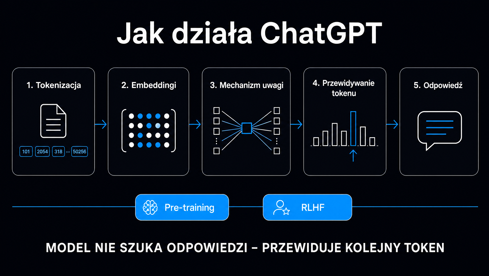

**ChatGPT nie wyszukuje odpowiedzi, nie sprawdza faktów w bazie danych i nie „wie” niczego w ludzkim sensie. Za każdym razem robi jedną rzecz: przewiduje, jaki fragment tekstu – token – jest najbardziej prawdopodobny jako kolejny.** Powtarza to kilkaset lub kilka tysięcy razy, aż powstanie cała odpowiedź. Cała reszta – rozumowanie krok po kroku, wyszukiwanie w sieci, pamięć między rozmowami, analiza plików – to warstwy zbudowane wokół tego jednego mechanizmu. Ten artykuł rozbiera go na części: od podziału tekstu na tokeny, przez architekturę Transformer i mechanizm uwagi, po trening RLHF i to, co naprawdę dzieje się, gdy ChatGPT „szuka w internecie”. Bez matematyki, ale z precyzją, która pozwala przewidzieć, kiedy modelowi wolno ufać, a kiedy nie.

## ChatGPT to interfejs, GPT to model – skąd bierze się różnica

Zacznijmy od uporządkowania nazw, bo w potocznym języku „ChatGPT” znaczy wszystko naraz. **GPT (Generative Pre-trained Transformer) to model – gigantyczna sieć neuronowa, czyli zbiór liczb (wag) wytrenowanych do przewidywania tekstu.** ChatGPT to produkt: aplikacja i strona, która przyjmuje Twoje wiadomości, dokleja do nich ukryte instrukcje, historię rozmowy i ewentualne wyniki wyszukiwania, wysyła całość do modelu i wyświetla to, co model wygenerował.

Rozróżnienie ma praktyczne skutki. Ten sam model GPT jest dostępny przez API OpenAI i napędza setki innych aplikacji, ale zachowuje się w nich inaczej niż w ChatGPT, bo dostaje inne instrukcje i inne narzędzia. Kiedy więc pytasz, „jak działa ChatGPT”, pytasz właściwie o trzy rzeczy:

- **Jak działa model językowy** – tokeny, sieć Transformer, przewidywanie kolejnego słowa
- **Jak model nauczył się odpowiadać jak asystent** – pre-training, fine-tuning, RLHF
- **Jak działa produkt wokół modelu** – okno kontekstu, pamięć, wyszukiwanie, narzędzia, tryb rozumowania

Przejdziemy przez wszystkie trzy warstwy po kolei. Aktualnie flagowym modelem OpenAI jest GPT-5.6 (następca GPT-5.5 z kwietnia 2026 roku); warianty modeli w ChatGPT (Instant, Thinking, Pro) różnią się głównie ilością obliczeń, jaką model może poświęcić na jedną odpowiedź – do tego wrócimy. Przegląd całego ekosystemu OpenAI, planów i cen znajdziesz w osobnym artykule o [ChatGPT i ekosystemie OpenAI](/modele-llm/chatgpt/).

## Krok 1: tokenizacja – model nie widzi słów

Pierwsza rzecz, która dzieje się z Twoją wiadomością, to podział na tokeny. **Token to podstawowa jednostka, na której operuje model: fragment słowa, całe krótkie słowo, znak interpunkcyjny albo spacja ze słowem.** Tokenizer OpenAI (rodzina algorytmów BPE, Byte Pair Encoding) buduje słownik około 200 tysięcy najczęstszych sekwencji znaków i każdy tekst zamienia na ciąg identyfikatorów z tego słownika.

Dla angielskiego jeden token to średnio około trzech czwartych słowa. Polski wypada gorzej: fleksja i rzadsze w korpusie treningowym sekwencje sprawiają, że przeciętne słowo rozpada się na dwa lub trzy tokeny. Słowo „pozycjonowanie” może być jednym tokenem w wersji podstawowej, ale „pozycjonowaniem” lub „pozycjonowaniu” – już dwoma lub trzema. Ma to trzy konsekwencje:

- **Ten sam tekst po polsku zajmuje więcej miejsca w oknie kontekstu** niż po angielsku, więc limity „w tokenach” po polsku oznaczają mniej treści
- **W API ten sam tekst kosztuje więcej**, bo rozliczenie idzie za tokeny
- **Model widzi ortografię inaczej niż człowiek** – stąd znane problemy z liczeniem liter w słowie czy rymowaniem: model operuje na kawałkach, nie na literach

Po tokenizacji Twoje pytanie „Jak działa ChatGPT?” to już nie zdanie, tylko lista kilkunastu liczb. Od tego momentu model nie ma kontaktu z tekstem – wyłącznie z liczbami.

## Krok 2: embeddingi – każdy token staje się punktem w przestrzeni znaczeń

Każdy identyfikator tokenu jest zamieniany na wektor: listę kilku lub kilkunastu tysięcy liczb. **Ten wektor – embedding – to wyuczona reprezentacja znaczenia tokenu.** Tokeny o podobnym znaczeniu i podobnych kontekstach użycia lądują blisko siebie w tej wielowymiarowej przestrzeni: „kot” blisko „kota” i „kocura”, „Warszawa” blisko „Kraków”, a „SEO” blisko „pozycjonowania”.

Wartości embeddingów nie są zaprojektowane przez ludzi. Wyłaniają się w trakcie treningu, bo sieć uczy się, że umieszczenie podobnych słów blisko siebie ułatwia przewidywanie tekstu. To dlatego model radzi sobie z synonimami, literówkami i parafrazami – nie dopasowuje słów kluczowych, tylko porównuje położenie w przestrzeni znaczeń.

Do embeddingu tokenu dodawana jest jeszcze informacja o pozycji w sekwencji (kodowanie pozycyjne). Bez niej sieć widziałaby wiadomość jako worek słów, nie wiedząc, co było przed czym – a w zdaniach „pies ugryzł człowieka” i „człowiek ugryzł psa” kolejność robi całą różnicę.

## Krok 3: Transformer i mechanizm uwagi – serce modelu

Ciąg wektorów trafia do sieci o architekturze Transformer, opisanej po raz pierwszy w pracy „Attention Is All You Need” (Vaswani i in., Google, 2017). Litera „T” w nazwie GPT to właśnie ona. **Kluczowy pomysł: zamiast czytać tekst słowo po słowie, sieć przetwarza wszystkie tokeny naraz i dla każdego z nich oblicza, na które pozostałe tokeny powinna „zwrócić uwagę”.**

Mechanizm uwagi (self-attention) działa w uproszczeniu tak: każdy token wysyła „zapytanie” (query), a wszystkie tokeny w kontekście oferują „klucze” (key) i „wartości” (value). Sieć porównuje zapytanie z kluczami, przypisuje wagi – im bardziej klucz pasuje do zapytania, tym wyższa waga – i buduje nową reprezentację tokenu jako ważoną sumę wartości. W zdaniu „Firma opublikowała raport, który zdobył cytowania” token „który” nauczy się mocno patrzeć na „raport”, a słabo na „firma”. Dokładnie tak rozwiązuje się zaimki, odniesienia i zależności oddalone o setki słów.

Transformer nie robi tego raz. Ma dziesiątki warstw, a w każdej warstwie wiele „głowic” uwagi pracujących równolegle – jedna może śledzić składnię, inna nazwy własne, kolejna relacje przyczynowe. Między warstwami uwagi są warstwy w pełni połączone (feed-forward), które badacze coraz częściej opisują jako miejsce, gdzie „przechowywana” jest wiedza faktograficzna modelu. Po przejściu przez wszystkie warstwy każdy token ma reprezentację nasyconą kontekstem całej rozmowy.

Trzy cechy tej architektury wyjaśniają większość zachowań ChatGPT:

- **Równoległość** – wszystkie tokeny wejścia są przetwarzane jednocześnie, dlatego trening na tysiącach procesorów graficznych był w ogóle możliwy i dlatego model „czyta” 100 stron w sekundę
- **Kontekst jest wszystkim** – model nie ma innego źródła informacji o bieżącej rozmowie niż to, co jest w oknie kontekstu; jeśli czegoś tam nie ma, dla modelu to nie istnieje
- **Koszt rośnie z długością** – uwaga porównuje każdy token z każdym, więc bardzo długie rozmowy są droższe i wolniejsze, a modele mają twardy limit kontekstu (w planie Pro – do miliona tokenów, w tańszych planach mniej)

## Krok 4: przewidywanie kolejnego tokenu – i dlaczego odpowiedzi są losowe

Po przejściu przez sieć ostatni token ma reprezentację, na podstawie której model oblicza rozkład prawdopodobieństwa nad całym słownikiem: dla każdego z ~200 tysięcy tokenów – jak bardzo pasuje jako następny. **Odpowiedź nie jest wybierana w całości. Model wybiera jeden token, dokleja go do kontekstu, przepuszcza całość przez sieć jeszcze raz i wybiera następny.** Odpowiedź o długości 500 słów to około 1000–1500 takich przebiegów, jeden po drugim. Dlatego tekst „pisze się” na ekranie strumieniowo – widzisz dosłownie kolejne decyzje modelu.

Wybór tokenu nie polega na braniu zawsze najbardziej prawdopodobnego. Zastosowane jest próbkowanie (sampling), sterowane głównie parametrem temperatury. Przy temperaturze zero model zawsze bierze najbardziej prawdopodobny token i staje się deterministyczny, ale monotonny i skłonny do zapętleń. Przy wyższej temperaturze częściej sięga po mniej oczywiste opcje – tekst jest bardziej urozmaicony, ale też bardziej ryzykowny. W ChatGPT temperatura jest ustawiona z góry na wartość dającą naturalny, zróżnicowany język.

To tłumaczy, dlaczego na to samo pytanie zadane dwa razy dostajesz dwie różne odpowiedzi. Losowanie różnicuje już pierwsze słowa, a każdy kolejny token zależy od poprzednich, więc ścieżki rozchodzą się jak gałęzie. Ma to znaczenie dla firm mierzących swoją obecność w odpowiedziach AI: **jeden test w ChatGPT to jedna próbka losowa, nie wynik.** Miarodajny obraz wymaga wielu powtórzeń i liczenia, w jakim odsetku odpowiedzi marka się pojawia – tak działa m.in. narzędzie [Widoczność marki w AI](/narzedzia/brand-check/).

<aside class="callout-fact">
  
✦

  

    
Warto wiedzieć

    
Generowanie każdego tokenu wymaga przepuszczenia przez sieć całego dotychczasowego kontekstu. Model nie „pamięta” obliczeń z poprzednich wiadomości w ludzkim sensie – silniki inferencyjne cache’ują część wyników (tzw. KV cache), żeby nie liczyć wszystkiego od zera. <strong>To właśnie ta optymalizacja sprawia, że długie rozmowy są w ogóle opłacalne, i dlatego dostawcy API rozliczają „cache’owane” tokeny wejścia dużo taniej.</strong>

  

</aside>

## Jak model zdobył wiedzę: pre-training, fine-tuning i RLHF

Wszystko powyżej opisuje działanie gotowej sieci. Skąd jednak biorą się wagi, które sprawiają, że przewidywania są sensowne? Z trzech etapów treningu.

### Pre-training – nauka przewidywania tekstu

**W pierwszym etapie model dostaje biliony tokenów tekstu – strony internetowe, książki, artykuły naukowe, kod, transkrypcje – i jedno zadanie: przewidzieć następny token.** Za każdy błąd wagi sieci są minimalnie korygowane. Po miesiącach tego procesu na dziesiątkach tysięcy procesorów graficznych sieć nauczyła się gramatyki, faktów, stylów, struktury kodu i – jako efekt uboczny dobrego przewidywania – zaskakująco wielu zdolności rozumowania. Nikt ich nie zaprogramował; okazały się potrzebne, żeby dobrze przewidywać tekst pisany przez ludzi, którzy rozumują.

Tu powstaje pojęcie daty odcięcia wiedzy (knowledge cutoff). Model wie tylko to, co było w danych do momentu zakończenia zbierania korpusu. Wydarzenia późniejsze nie istnieją w jego wagach – może je poznać wyłącznie przez kontekst, czyli przez wyszukiwanie lub przez to, co mu wkleisz.

Z perspektywy firmy to pierwszy z dwóch kanałów, którymi marka trafia do ChatGPT. Jeśli o Twojej firmie pisano w źródłach, które znalazły się w korpusie – w mediach branżowych, w Wikipedii, na forach, w katalogach – model „zna” ją bez żadnego wyszukiwania. Jeśli nie, w trybie bez wyszukiwania nie wymieni jej nigdy, choćby miała najlepszą stronę w Google.

### Fine-tuning i RLHF – z modelu tekstu w asystenta

Model po pre-treningu jest genialnym autouzupełnianiem, ale nie asystentem. Zapytany „Jak działa ChatGPT?” może równie dobrze odpowiedzieć, jak wygenerować dziesięć kolejnych podobnych pytań, bo tak wyglądały listy pytań w danych. Potrzebne są dwa kolejne etapy.

Najpierw fine-tuning nadzorowany (SFT): anotatorzy piszą tysiące przykładowych rozmów w formacie „pytanie – idealna odpowiedź”, a model douczany jest na nich, żeby przyjął rolę asystenta. Potem RLHF (Reinforcement Learning from Human Feedback, uczenie ze wzmocnieniem na podstawie ludzkich ocen), które przebiega w trzech krokach:

- **Zbieranie porównań** – model generuje kilka odpowiedzi na to samo pytanie, a ludzie szeregują je od najlepszej do najgorszej
- **Trening modelu nagrody** – osobna sieć uczy się przewidywać, którą odpowiedź człowiek oceni wyżej
- **Optymalizacja** – model językowy jest dostrajany tak, żeby maksymalizować ocenę modelu nagrody, z ograniczeniem, by nie oddalić się zbytnio od wersji wyjściowej

Efekt to model, który jest pomocny, trzyma się instrukcji, odmawia szkodliwych próśb i ma charakterystyczny „głos” ChatGPT. RLHF ma też skutki uboczne: model nagradzany za odpowiedzi, które ludzie lubią, uczy się brzmieć pewnie i wyczerpująco – również wtedy, gdy nie ma podstaw. Część problemu z halucynacjami jest właśnie efektem optymalizacji pod ludzką aprobatę, a nie pod prawdziwość.

## Okno kontekstu, instrukcje systemowe i pamięć – jak działa rozmowa

Model nie ma stanu. Każde wywołanie to czysta funkcja: wejście w postaci ciągu tokenów, wyjście w postaci kolejnego tokenu. **Wrażenie ciągłej rozmowy powstaje dlatego, że aplikacja ChatGPT z każdą Twoją wiadomością wysyła do modelu całą dotychczasową historię.** Kiedy rozmowa przekracza okno kontekstu, najstarsze fragmenty są ucinane lub streszczane – i model dosłownie „zapomina” początek.

Do historii aplikacja dokleja jeszcze elementy, których nie widzisz:

- **Instrukcję systemową** – kilkaset lub kilka tysięcy tokenów opisujących, kim model ma być, jak formatować odpowiedzi, kiedy używać narzędzi i czego nie robić; to tu zapisana jest aktualna data i zasady bezpieczeństwa
- **Twoje ustawienia** – tzw. custom instructions, czyli stałe wytyczne, które zdefiniowałeś w profilu
- **Wspomnienia (Memory)** – fakty zapisane z poprzednich rozmów: Twoje imię, branża, preferowany styl; ChatGPT wybiera te, które uzna za istotne, i dokleja do kontekstu
- **Wyniki narzędzi** – fragmenty stron z wyszukiwania, wyniki wykonania kodu, treść wgranych plików

Z punktu widzenia modelu wszystko to jest jednym długim tekstem. Nie ma technicznej różnicy między instrukcją od OpenAI, Twoją wiadomością i treścią strony pobranej z sieci – stąd cała klasa ataków typu prompt injection, gdzie złośliwa instrukcja ukryta na stronie internetowej może wpłynąć na zachowanie asystenta. Model po prostu przewiduje tekst na podstawie wszystkiego, co widzi.

## Tryb rozumowania – co robi ChatGPT, gdy „myśli”

Od 2024 roku modele OpenAI (seria o1, a potem tryby Thinking w GPT-5) dostały dodatkową warstwę: rozumowanie przed odpowiedzią. **Zamiast od razu generować odpowiedź, model najpierw generuje ukryty łańcuch myśli – setki lub tysiące tokenów, w których rozkłada problem, sprawdza założenia, próbuje różnych ścieżek i poprawia własne błędy – a dopiero potem pisze finalny tekst.**

Mechanicznie to nadal przewidywanie kolejnego tokenu. Różnica polega na tym, że model został wytrenowany metodą uczenia ze wzmocnieniem, by ten proces „myślenia na głos” prowadził do poprawnych odpowiedzi w zadaniach z weryfikowalnym wynikiem – matematyce, programowaniu, logice. Nagrodę dostawał nie za ładne brzmienie, lecz za poprawny wynik końcowy. W efekcie nauczył się strategii, które ludzie znają jako „sprawdź dwa razy”, „zacznij od prostszego przypadku” czy „wróć, jeśli utknąłeś”.

Warianty GPT-5.6 różnią się przede wszystkim budżetem na to rozumowanie. Instant odpowiada niemal natychmiast i praktycznie nie rozumuje. Thinking poświęca sekundy lub minuty. Pro może pracować wielokrotnie dłużej, uruchamiając równolegle kilka ścieżek i wybierając najlepszą. To tzw. skalowanie w czasie inferencji (test-time compute) – zamiast trenować większy model, pozwala się mniejszemu dłużej „myśleć”. W zwykłych pytaniach różnica jest mała; w wieloetapowych analizach, debugowaniu kodu czy zadaniach z liczbami – ogromna.

## Wyszukiwanie w sieci – jak ChatGPT znajduje aktualne informacje

Wszystko powyżej dotyczy wiedzy zamrożonej w wagach. Od końca 2024 roku ChatGPT ma jednak drugi tryb: wyszukiwanie (ChatGPT Search), które włącza się automatycznie, gdy model uzna, że pytanie wymaga aktualnych lub sprawdzalnych danych, albo gdy użytkownik wymusi je ręcznie. **To jedyna droga, którą do odpowiedzi trafiają informacje sprzed kilku dni, ceny, wydarzenia i większość wzmianek o mniejszych firmach.**

Przebieg w uproszczeniu wygląda tak:

- **Rozbicie pytania** – model przekształca Twoją wiadomość w jedno lub kilka zapytań do wyszukiwarki, często inaczej sformułowanych niż oryginał (to tzw. query fan-out; więcej o nim w artykule o [query fan-out](/geo/query-fan-out/))
- **Pobranie wyników** – zapytania trafiają do indeksu Bing i własnego indeksu OpenAI; system pobiera treść kilku–kilkunastu stron, a te, które odpowiadają zbyt wolno, są zwykle pomijane
- **Wybór fragmentów** – strony są dzielone na krótkie fragmenty; do kontekstu trafiają te, które najlepiej pasują do zapytań, z preferencją dla źródeł powtarzających się przy różnych wariantach pytania
- **Generowanie z przypisami** – model pisze odpowiedź, mając w kontekście wybrane fragmenty, i oznacza, z którego źródła pochodzi które zdanie

Ten schemat to praktyczne wdrożenie RAG (Retrieval-Augmented Generation): zamiast liczyć na pamięć modelu, podsuwa mu się aktualny materiał źródłowy i każe streścić. Za pobieranie stron na potrzeby wyszukiwania odpowiada robot OAI-SearchBot – inny niż GPTBot, który zbiera dane do treningu. Strona może być zablokowana dla jednego, a otwarta dla drugiego; więcej o tym w [przewodniku po botach AI](/geo/boty-ai-przewodnik/).

Dla widoczności marki to kanał kluczowy, bo działa w dniach, nie w miesiącach. Aby firma pojawiła się w odpowiedzi z wyszukiwaniem, jej strona musi: być dobrze widoczna w Bing, ładować się szybko, mieć treść, która da się wyciąć jako samodzielny, faktograficzny fragment, i nie blokować OAI-SearchBota. Jak to zrobić krok po kroku, opisuje strona o [pozycjonowaniu w ChatGPT](/pozycjonowanie-ai/chatgpt/).

<aside class="callout-expert">
  

  

    
Opinia eksperta

    
Najczęstszy błąd, jaki widzę w rozmowach z klientami, to traktowanie ChatGPT jako jednego systemu. To dwa różne kanały: wagi modelu, na które wpływa się przez obecność w źródłach latami, i wyszukiwanie, w którym liczy się to, co jest w Bingu dziś. Gdy firma pyta, „dlaczego ChatGPT nas nie zna”, pierwsze pytanie brzmi: w którym trybie sprawdzaliście? <strong>Bez wyszukiwania model wymienia marki, które istniały w korpusie treningowym – z wyszukiwaniem cytuje strony, które da się szybko pobrać i z których da się wyciąć konkretne zdanie z liczbą. To dwie osobne strategie i dwie osobne listy zadań.</strong>

    
Mateusz Wiśniewski · Ekspert SEO/AI Search, ICEA

  

</aside>

## Narzędzia: kod, pliki, obrazy – jak model wychodzi poza tekst

Sam model potrafi tylko generować tokeny. Wszystko, co wygląda na „robienie” czegoś, to wywołanie narzędzia. **Model został wytrenowany, by w odpowiednim momencie wygenerować specjalny, ustrukturyzowany fragment tekstu – wywołanie narzędzia z parametrami – który aplikacja przechwytuje, wykonuje i którego wynik wkleja z powrotem do kontekstu.** Model czyta wynik i kontynuuje odpowiedź.

Tak działają wszystkie „superzdolności” ChatGPT:

- **Interpreter kodu** – model pisze skrypt w Pythonie, aplikacja uruchamia go w izolowanym środowisku, a wynik (liczby, wykres, plik) wraca do kontekstu; dlatego obliczenia z interpretera są wiarygodne, a „z głowy” – nie
- **Analiza plików** – wgrany PDF lub arkusz jest zamieniany na tekst (w razie potrzeby z rozpoznawaniem obrazu) i wkładany do kontekstu w całości lub we fragmentach
- **Generowanie obrazów** – model przekazuje opis do osobnego modelu obrazowego (GPT Image) i dostaje z powrotem gotowy plik
- **Wyszukiwanie** – opisane wyżej, technicznie także zwykłe wywołanie narzędzia
- **Agenci i przeglądanie** – w trybach agentowych model wywołuje przeglądarkę, klika i czyta strony w pętli, aż wykona zadanie

Wniosek praktyczny: jeśli zależy Ci na wiarygodnym wyniku, spraw, żeby model użył narzędzia zamiast zgadywać. Prośba „policz to w Pythonie” lub „sprawdź w sieci” zmienia mechanizm z predykcji na wykonanie.

## Halucynacje – nie błąd, lecz konsekwencja mechanizmu

Skoro model zawsze generuje najbardziej prawdopodobny ciąg tokenów, to zrobi to także wtedy, gdy nie ma na dany temat rzetelnych danych. **„Prawdopodobne” oznacza wtedy „brzmi jak coś, co pojawiłoby się w takim miejscu w tekście” – a nie „jest prawdą”.** Model, który nigdy nie widział raportu firmy X za 2025 rok, poproszony o jego dane, wygeneruje liczby o formacie i rzędzie wielkości typowym dla takich raportów. Będą wyglądać wiarygodnie, bo właśnie wiarygodność wyglądu jest tym, co model optymalizuje.

Halucynacje mają przewidywalne miejsca występowania:

- **Liczby i daty** – model zna „kształt” statystyki, nie jej wartość
- **Nazwiska, tytuły, cytaty** – kombinacje prawdziwych elementów w nieprawdziwą całość
- **Adresy URL i bibliografia** – model generuje linki o poprawnej strukturze prowadzące donikąd
- **Fakty o mało opisanych bytach** – małe firmy, niszowe produkty, lokalne wydarzenia

Dwie rzeczy realnie ograniczają problem, i obie wynikają wprost z mechaniki: dostarczenie materiału do kontekstu (wyszukiwanie, wgrane dokumenty) oraz tryb rozumowania, w którym model ma szansę sam wychwycić niespójność. Halucynacje w wersji wyszukującej zdarzają się znacznie rzadziej, ale nie znikają – model może błędnie streścić poprawne źródło. Więcej o mechanizmach cytowania w artykule o tym, [jak LLM cytują źródła](/geo/jak-llm-cytuja-zrodla/).

## Co z tego wynika dla firm – widoczność marki w ChatGPT

Jeśli rozumiesz mechanizm, rozumiesz też, dlaczego klasyczne SEO nie przenosi się jeden do jednego na ChatGPT. **Model nie ma rankingu stron. Ma wagi – w których marka albo jest, albo jej nie ma – oraz kontekst z wyszukiwania, do którego trafiają fragmenty, nie strony.** Setki milionów osób tygodniowo pyta ChatGPT o produkty, usługi, porównania i rekomendacje; odpowiedź powstaje w opisany wyżej sposób, a marki, które w niej są, zyskują klienta, zanim ten otworzy Google.

Trzy wnioski, które wynikają bezpośrednio z tego, jak działa ChatGPT:

- **Obecność w źródłach ma znaczenie długoterminowe** – wzmianki w mediach, katalogach, Wikipedii i na forach trafiają do korpusu i kształtują to, co model „wie” bez wyszukiwania
- **Cytowalność fragmentu ma znaczenie krótkoterminowe** – w trybie wyszukiwania do kontekstu wchodzą krótkie, faktograficzne wycinki; akapit z liczbą, datą i jednoznacznym stwierdzeniem ma szansę, marketingowy wstęp – nie
- **Pomiar wymaga wielu próbek** – ze względu na losowość generowania jedna rozmowa niczego nie dowodzi; potrzebne są powtarzalne testy i metryki typu udział marki w odpowiedziach

To odrębna dyscyplina, którą opisujemy szerzej w przewodniku po [pozycjonowaniu pod LLM](/pozycjonowanie-ai/) – z audytem, optymalizacją treści pod modele językowe i monitoringiem cytowań. Punkt startowy sprawdzisz w minutę: darmowe narzędzie [Widoczność marki w AI](/narzedzia/brand-check/) zadaje pytanie o Twoją markę czterem silnikom AI i pokazuje, kto jest polecany zamiast Ciebie.
