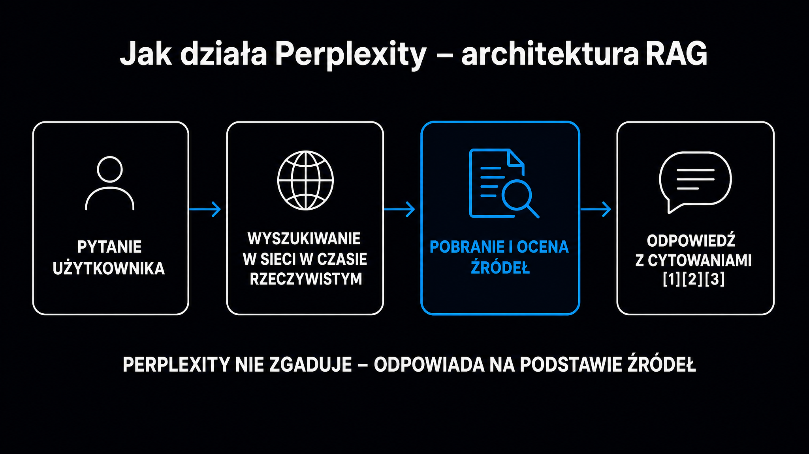

Perplexity to nie kolejny chatbot – to wyszukiwarka zbudowana wokół cytowań, która w czasie rzeczywistym przeczesuje internet, syntetyzuje dziesiątki źródeł i odpowiada z przypisami. Od założenia w sierpniu 2022 roku platforma urosła do ponad 100 milionów aktywnych użytkowników miesięcznie i wyceny 20 miliardów dolarów (stan na początek 2026 roku). Dla specjalistów SEO i marketerów B2B Perplexity to dziś jeden z najważniejszych kanałów cytowań: jeśli Twoja marka nie pojawia się w jego odpowiedziach, tracisz widoczność u osób, które aktywnie szukają rozwiązań w Twojej niszy. Ten artykuł wyjaśnia, jak Perplexity naprawdę działa, skąd czerpie źródła i co zrobić, żeby Twoja strona była przez niego cytowana.

## Czym jest Perplexity i czym różni się od ChatGPT?

Perplexity to silnik odpowiedzi (answer engine) – kategoria narzędzi, która stoi między klasyczną wyszukiwarką a asystentem AI. **Zamiast zwracać listę linków, Perplexity syntetyzuje informacje z kilku lub kilkunastu aktualnych źródeł i prezentuje jedną spójną odpowiedź z numerowanymi przypisami.**

Różnica w stosunku do [ChatGPT](/modele-llm/chatgpt/) i [Claude](/modele-llm/claude/) polega na architekturze. Tamte modele w trybie offline opierają się na wiedzy zamkniętej w parametrach sieci neuronowej – wiedzy ograniczonej datą zakończenia trenowania, która może mieć kilkanaście miesięcy opóźnienia. Perplexity za każdym razem uruchamia pobieranie danych z sieci, zanim wygeneruje odpowiedź. Każde zapytanie to żywy proces: szukaj → pobierz → zsyntetyzuj → zacytuj.

To właśnie ta architektura sprawia, że Perplexity jest kluczowe w kontekście [pozycjonowania w AI](/pozycjonowanie-ai/perplexity/). Twoja strona musi być technicznie dostępna dla `PerplexityBot` i zawierać treść, którą silnik może wyekstrahować jako odpowiedź – nie tylko jako tło.

### Krótka historia – od bota na Twitterze do 20 miliardów dolarów

Firma powstała w sierpniu 2022 roku w San Francisco. Założył ją Aravind Srinivas (wcześniej OpenAI i Google DeepMind) wraz z Denisem Yaratsem, Johnnym Ho i Andym Konwinskim. Pierwszym prototypem był zautomatyzowany bot na Twitterze, który odpowiadał na pytania z przypisami do źródeł. Trafił w punkt: użytkownicy chcieli odpowiedzi, nie linków.

Finansowanie rosło skokowo. We wrześniu 2022 roku zebrano 3,1 miliona dolarów w rundzie seed, a w grudniu 2024 roku wycena przekroczyła 9 miliardów dolarów przy rundzie prowadzonej przez IVP. Do początku 2026 roku spółka zebrała łącznie 1,5 miliarda dolarów, a do inwestorów dołączyły Nvidia, Jeff Bezos i SoftBank Vision Fund 2. **W maju 2026 roku powtarzalny przychód roczny (ARR) przekroczył 500 milionów dolarów, rosnąc o 335% rok do roku.**

<aside class="callout-fact">
  
✦

  

    
Ciekawostka

    
W maju 2025 roku Perplexity obsługiwało już <strong>780 milionów zapytań miesięcznie</strong>, a przeciętna sesja użytkownika trwała 7,2 minuty – niemal trzy razy dłużej niż typowa sesja w Google. Czas sesji to wskaźnik, który pokazuje, że użytkownicy traktują Perplexity jak narzędzie pracy, nie jak szybkie wyszukiwanie.

  

</aside>

## Jak działa architektura RAG w Perplexity?

Perplexity opiera się na architekturze [RAG – generowania wspomaganego wyszukiwaniem](https://pl.wikipedia.org/wiki/Retrieval-augmented_generation) (Retrieval-Augmented Generation). To podejście łączy klasyczny silnik wyszukiwania z modelem językowym: najpierw pobiera aktualne dane z sieci, potem generuje na ich podstawie odpowiedź.

Kiedy wpisujesz zapytanie, dzieje się kilka rzeczy naraz. Mniejszy model pomocniczy rozkłada je na zoptymalizowane frazy wyszukiwania. Własne boty indeksujące Perplexity (publikowane pod identyfikatorem `PerplexityBot`) oraz integracje z zewnętrznymi API wyszukiwarek przeszukują aktualne zasoby sieci. System wyodrębnia z pobranych stron krótkie, kontekstowo gęste fragmenty, zamienia je na reprezentacje wektorowe (tzw. embeddingi) i wybiera te, które semantycznie najlepiej odpowiadają pytaniu. Dopiero te wyselekcjonowane fragmenty trafiają do głównego modelu językowego jako kontekst, a model generuje końcową odpowiedź – z przypisami do oryginalnych źródeł.

**Kluczowe dla specjalistów SEO: Perplexity nie czyta strony jako całości. Dzieli tekst na fragmenty o długości 200–400 słów i ocenia każdy fragment osobno.** Fragmenty z liczbami, datami, definicjami i nazwami własnymi mają wyższy priorytet przy selekcji. To oznacza, że strona z ogólnikowymi opisami jest dla tego silnika bezużyteczna – nawet jeśli stoi wysoko w Google.

### Jakie modele LLM wykorzystuje Perplexity

Perplexity nie jest jednym modelem – to warstwa nadrzędna zarządzająca kilkoma zewnętrznymi modelami językowymi. W zależności od planu i trybu użytkownik może korzystać z modeli rodziny GPT (OpenAI), Claude (Anthropic), Gemini (Google) oraz własnych modeli Perplexity z serii Sonar. Modele Sonar bazują na architekturze open-source Llama od Meta, ale zostały dostrojone przez zespół Perplexity pod kątem odpowiedzi opartych na danych z sieci.

Dla marketerów i specjalistów SEO to ważna obserwacja: ta sama marka może być cytowana lub pomijana przez różne modele pracujące w tym samym interfejsie, ponieważ każdy model ma inne wzorce selekcji źródeł. Widoczność w Perplexity to w istocie widoczność w kilku silnikach jednocześnie.

## Plany i funkcje – czym się różni Free od Pro i Max

Perplexity oferuje trzy główne poziomy dostępu. Poniżej zestawienie kluczowych różnic:

| Plan | Cena (mies.) | Główne możliwości | Limit zapytań Pro |
|---|---|---|---|
| Free | 0 USD | Standardowe wyszukiwanie z przypisami, wybrane modele | ~5 zapytań Pro dziennie |
| Pro | 20 USD | Nieograniczone zapytania, GPT-4o / Claude 3.5, wgrywanie plików PDF | Bez limitu |
| Max | 200 USD | Model Council, Deep Research bez limitu, priorytetowy dostęp | Bez limitu + kredyty compute |
| Enterprise | Kontakt | RAG na prywatnych danych firmowych, prywatność danych, SSO | Indywidualny |

Plan Pro jest wystarczający dla większości marketerów i specjalistów SEO. Plan Max jest przeznaczony do zaawansowanych analiz – m.in. do funkcji Model Council (Rada Modeli), która wysyła zapytanie równolegle do trzech różnych modeli i porównuje ich odpowiedzi, wskazując punkty zgodności i rozbieżności.

### Deep Research – zautomatyzowana analiza wieloetapowa

Deep Research (głębokie badanie) to tryb, w którym Perplexity autonomicznie planuje i wykonuje serię podzapytań, przegląda kilkanaście do kilkudziesięciu źródeł i na koniec generuje raport z pełnym aparatem bibliograficznym. **Dla analityków B2B to narzędzie, które zastępuje kilka godzin manualnego przeglądania raportów i artykułów.**

W kontekście GEO Deep Research jest szczególnie interesujący: model cytuje proporcjonalnie więcej źródeł niż standardowe zapytanie. Jeśli Twoja strona jest wymieniana w kilku miejscach jako autorytatywne źródło w danej niszy, Deep Research ma dużą szansę ją zacytować.

## Spaces, Comet i ekosystem agentowy

Perplexity ewoluuje w kierunku platformy agentowej. Dwa elementy są szczególnie istotne dla użytkowników zaawansowanych.

**Spaces** (Przestrzenie) to wyspecjalizowane obszary robocze, w których można:

- **Zapisywać niestandardowe instrukcje** – np. „odpowiadaj jako konsultant B2B SaaS, używaj danych z europejskiego rynku"
- **Gromadzić kontekst projektowy** – dokumenty PDF, notatki, historia konwersacji w jednym miejscu
- **Współpracować zespołowo** – Spaces można udostępniać innym użytkownikom

**Comet** to przeglądarka webowa zbudowana przez Perplexity do obsługi zadań agentowych. Zamiast szukać informacji i czekać na polecenie, Comet może autonomicznie nawigować po stronach, wypełniać formularze i wykonywać sekwencje działań w imieniu użytkownika. W lutym 2026 roku Perplexity uruchomiło środowisko Computer – głębszą integrację asystenta z systemami operacyjnymi urządzeń mobilnych i desktopowych, z wielomodalną analizą otoczenia przez kamerę i zarządzaniem zadaniami między aplikacjami.

Dla specjalistów SEO ten kierunek oznacza jedno: Perplexity przestaje być tylko kanałem informacyjnym i staje się kanałem wykonawczym. Marki, które będą cytowane w Spaces i agentowych przepływach pracy, zyskają obecność na etapie decyzji zakupowej, nie tylko w fazie researchu.

<aside class="callout-expert">
  

  

    
Opinia eksperta

    
W projektach GEO, które prowadzimy w ICEA, Perplexity jest pierwszym silnikiem, od którego zaczynamy audyt widoczności. Powód jest prosty: jego architektura RAG jest przejrzysta – cytowania są widoczne w interfejsie, co pozwala sprawdzić dosłownie, czy i jak Twoja strona jest przywoływana. ChatGPT w trybie offline nie daje takiej przejrzystości. <strong>Rekomendacja na start: sprawdź, czy PerplexityBot ma dostęp do Twojej domeny, i odpytaj 10 zapytań z Twojej niszy. Jeśli Twoja marka nie pojawia się ani razu – masz konkretny problem do rozwiązania, zanim zaczniesz optymalizować treść.</strong>

    
Tomasz Czechowski · Head of SEO, ICEA

  

</aside>

## Jak Perplexity dobiera źródła i co wiemy o jego algorytmie selekcji?

Perplexity nie ujawnia pełnego algorytmu selekcji źródeł, ale z obserwacji praktycznych i dokumentacji technicznej wyłania się kilka reguł, które warto znać.

Pierwsza zasada to aktualność. Perplexity faworyzuje strony opublikowane lub zaktualizowane niedawno – szczególnie przy zapytaniach o aktualne wydarzenia, ceny lub dane rynkowe. Strona z datą modyfikacji sprzed kilku lat ma mniejszą szansę na cytowanie w odpowiedziach, gdzie data ma znaczenie.

Druga zasada to semantyczna zgodność fragmentu z zapytaniem. Boty nie indeksują stron jako całości – pobierają fragmenty i porównują ich reprezentacje wektorowe z wektorem zapytania. **Strona z jednym ogólnym artykułem o „marketingu AI" przegrywa z serią krótkich, konkretnych artykułów odpowiadających na jedno pytanie naraz.** Długość optymalnego fragmentu to 200–400 słów z wyraźnym nagłówkiem.

Trzecia zasada to autorytet domeny i wzajemne cytowania. Perplexity częściej sięga do źródeł, które są wzmiankowane przez inne indeksowane strony – na podobnej zasadzie jak Google ocenia PageRank. Obecność w raportach branżowych, Wikipedii czy prestiżowych mediach zwiększa szansę na uwzględnienie przez silnik.

Czwarta zasada to struktura tekstu. Fragmenty zawierające tabele, listy definicji, dane liczbowe z datą i źródłem są preferowane przez silniki RAG. Wynika to z badania [Aggarwala i in. (KDD 2024)](https://arxiv.org/abs/2311.09735), które udokumentowało wzrost wskaźnika cytowań o 30–41% po dodaniu statystyk i danych liczbowych do treści.

### Perplexity a prawa autorskie wydawców

Perplexity od 2024 roku zmaga się z pozwami wydawców. Dow Jones & Company (wydawca „Wall Street Journal") oraz grupy medialne takie jak BBC i „New York Times" twierdzą, że boty Perplexity pobierały treści z naruszeniem pliku `robots.txt` i reprodukowały obszerne fragmenty artykułów bez licencji. W sierpniu 2025 roku federalny sąd w Nowym Jorku odrzucił wnioski Perplexity o oddalenie sprawy na etapie formalnym – sprawa ma trafić do sądu przysięgłych. Perplexity buduje równolegle program podziału przychodów z wydawcami w proporcji 80/20 (80% dla wydawcy).

Dla marketerów konkluzja jest praktyczna: model prawny, na którym Perplexity operuje, jest wciąż niestabilny. Warto monitorować, jakie zmiany w polityce cytowań wynikną z orzeczeń sądowych, bo mogą one wpłynąć na to, które domeny są chętniej cytowane w wynikach.

## Perplexity jako kanał GEO – jak optymalizować pod ten silnik

Perplexity jest naturalnym mostem do GEO (Generative Engine Optimization, optymalizacja pod generatywne silniki wyszukiwania). Ponieważ każda odpowiedź zawiera widoczne cytowania, jest to jeden z nielicznych silników AI, w którym można empirycznie mierzyć wskaźnik cytowań (Citation Rate) własnej marki bez specjalistycznych narzędzi.

Cztery kroki do lepszej widoczności w Perplexity:

- **Dostęp techniczny** – sprawdź, czy `PerplexityBot` nie jest blokowany przez `robots.txt` ani przez reguły zapory sieciowej Cloudflare; możesz to zweryfikować w [Dostęp botów AI](/narzedzia/ai-bots-check/) w kilka sekund
- **Struktura fragmentów** – podziel treść na samodzielne bloki 200–400 słów, każdy z nagłówkiem jako pytaniem i odpowiedzią w pierwszym zdaniu; silnik RAG ocenia każdy fragment oddzielnie
- **Gęstość faktograficzna** – dodaj do każdej sekcji H2 co najmniej jedną liczbę z datą i źródłem; fragmenty z danymi liczbowymi mają wyższy priorytet przy selekcji wektorowej
- **Wzajemne wzmianki** – buduj obecność w miejscach, z których Perplexity chętnie czerpie: branżowe raporty, Wikipedia, fora Reddit, media B2B; to sygnał autorytetu dla algorytmu selekcji

Szczegółowe wskazówki dotyczące zwiększania wskaźnika cytowań znajdziesz w przewodniku po [tym, jak LLM-y cytują źródła](/geo/jak-llm-cytuja-zrodla/), a szeroką perspektywę na całą dyscyplinę GEO – w [kompletnym przewodniku GEO](/geo/przewodnik/).
