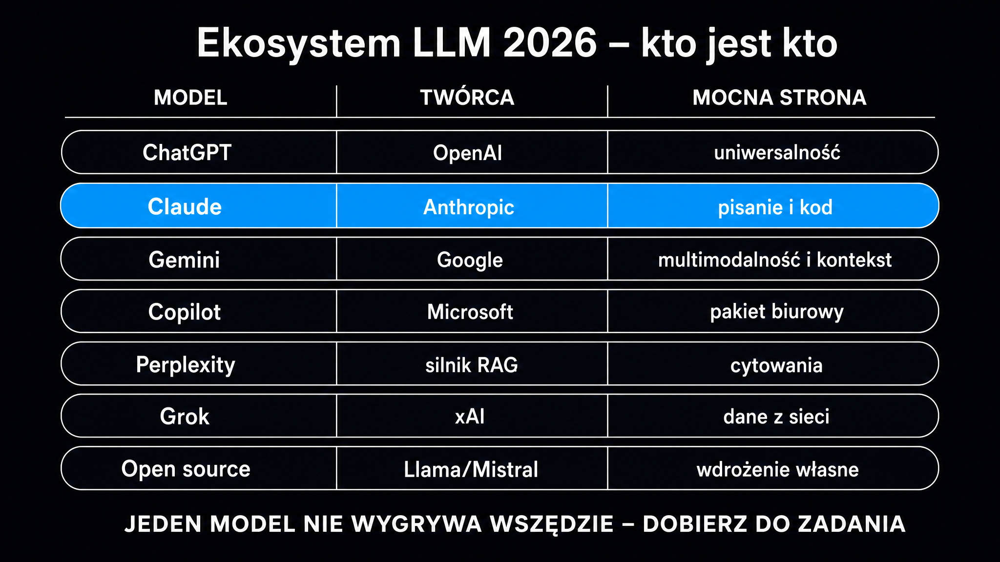

LLM (Large Language Model, czyli duży model językowy) to nie jeden produkt – to cały ekosystem kilkudziesięciu systemów, które różnią się architekturą, mocnymi stronami, ceną i tym, jak traktują Twoją markę jako potencjalne źródło cytowań. **Dziś niemal 80% firm korzysta z AI, a większość wdrożyła już generatywną AI w co najmniej jednym obszarze; użytkownicy coraz częściej zadają pytania o produkty i usługi bezpośrednio w ChatGPT, Perplexity czy w Gemini – zamiast wpisywać je w wyszukiwarkę.** Ten przewodnik pokazuje, jak działa każdy z głównych modeli, czym się od siebie różnią i co to oznacza dla widoczności Twojej marki w odpowiedziach AI.

## Jak działa duży model językowy?

Zanim przejdziesz do porównania konkretnych produktów, warto zrozumieć jeden wspólny mechanizm. Wszystkie modele omówione w tym przewodniku to [duże modele językowe](https://pl.wikipedia.org/wiki/Du%C5%BCy_model_j%C4%99zykowy) – systemy trenowane na miliardach dokumentów, które nauczyły się przewidywać kolejny token (fragment tekstu) na podstawie kontekstu. To fundamentalnie odróżnia je od klasycznych wyszukiwarek, które indeksują i tworzą ranking stron.

Kluczowe pojęcia, których będziesz używać w każdej rozmowie o LLM-ach:

- **Okno kontekstowe** – maksymalna ilość tekstu, którą model przetwarza w jednej sesji; wyrażana w tokenach (1 token ≈ 0,75 słowa angielskiego). Modele z oknem 1 000 000 tokenów mogą przetworzyć kilka książek naraz.
- **Wnioskowanie** (z ang. *reasoning*) – zdolność modelu do wieloetapowego rozwiązywania problemów: stawiania hipotez, weryfikacji spójności i cofania się przy błędnym kroku.
- **RAG** (Retrieval-Augmented Generation, generowanie wspomagane wyszukiwaniem) – architektura, w której model w chwili zapytania dynamicznie pobiera fragmenty z internetu lub bazy wiedzy i dopiero na ich podstawie generuje odpowiedź; stosowana w Perplexity, Bing Copilot i Google AI Overviews.
- **Temperatura modelu** – parametr sterujący losowością generowania; niska temperatura = bardziej przewidywalne, precyzyjne odpowiedzi; wysoka = bardziej kreatywne, zmienne.
- **Zanurzenia wektorowe** (reprezentacje wektorowe, ang. *embeddings*) – numeryczne reprezentacje tekstu, które model tworzy wewnętrznie; pozwalają mierzyć semantyczne podobieństwo między fragmentami.

**Modele AI nie czytają stron internetowych jak ludzie.** Dzielą tekst na fragmenty po 200–400 słów, zamieniają je na wektory i wybierają te, które semantycznie najlepiej odpowiadają zapytaniu. To znaczy, że Twoja strona musi być napisana tak, by każdy fragment samodzielnie odpowiadał na jedno pytanie.

### Co odróżnia modele podstawowe od asystentów AI?

W rozmowach o LLM-ach regularnie myli się dwie warstwy produktowe. Model podstawowy (np. GPT-5.5, Claude Sonnet, Gemini Pro) to sama warstwa językowa – przetwarza tekst i generuje odpowiedź. Asystent AI (ChatGPT, Claude.ai, Gemini.com, Copilot w przeglądarce) to produkt konsumencki zbudowany na modelu, z interfejsem, historią rozmów, integracjami narzędziowymi i własną polityką dotyczącą cytowań. **Dla widoczności marki w AI ważniejszy jest asystent, bo to z nim rozmawiają Twoi klienci – ale to model decyduje, co zostanie zacytowane.**

## Przegląd głównych modeli – tabela porównawcza

Poniższa tabela zestawia sześć dominujących ekosystemów w jednym miejscu. Dane dotyczą flagowych, publicznie dostępnych wariantów na maj 2026.

| Model / ekosystem | Twórca | Dostęp dla użytkownika | Mocna strona | Klucz dla widoczności marki |
|---|---|---|---|---|
| ChatGPT (GPT-5.5) | OpenAI | Freemium + API | Szeroki korpus treningowy, SearchGPT | Indeksowanie przez GPTBot; SearchGPT cytuje na żywo |
| Claude (Opus 4.8 / Sonnet 4.6) | Anthropic | Freemium + API | Długi kontekst, analiza dokumentów | ClaudeBot; silna w analizie B2B |
| Gemini (3.1 Pro / 3.5 Flash) | Google | Freemium + API | Integracja z Google Search, AI Overviews | Bezpośrednie powiązanie z indeksem Google |
| Copilot | Microsoft | Wbudowany w Windows/Edge + API | Integracja z Bing, Microsoft 365 | BingBot + Bing Search jako źródło |
| Perplexity AI | Perplexity | Freemium + API | RAG w czasie rzeczywistym z linkami źródłowymi | PerplexityBot; cytuje URL bezpośrednio |
| Modele open source | Meta, Mistral AI i in. | Pobieranie + API | Suwerenność danych, dostosowywalność | Brak własnego bota; używają cudzych indeksów |

Każdy z tych ekosystemów ma inny mechanizm pobierania informacji o Twojej marce – i inny wzorzec tego, jakie treści trafiają do odpowiedzi. Poniższe sekcje opisują każdy z nich z perspektywy praktycznej.

## ChatGPT i ekosystem OpenAI

ChatGPT jest punktem startowym dla zdecydowanej większości firm wchodzących w temat AI. To z nim rozmawiają Twoi klienci, kiedy pytają „który dostawca X jest najlepszy" albo „porównaj Y i Z". **Według danych OpenAI z początku 2026 roku z ChatGPT Enterprise korzysta dziewięciokrotnie więcej firm niż rok wcześniej.**

Model dostępny obecnie jako główny flagowiec w ChatGPT to GPT-5.5 – multimodalny system przetwarzający tekst, obraz i dźwięk. W wariancie z włączonym SearchGPT model w chwili zapytania przeszukuje internet, pobiera aktualne fragmenty i generuje odpowiedź z przypisami. To oznacza, że strony, do których ma dostęp `GPTBot`, mogą być cytowane w czasie rzeczywistym.

Kluczowe aspekty dla strategii widoczności:

- **`GPTBot`** – bot indeksujący OpenAI; jego dostęp do Twojej strony warunkuje pojawienie się w SearchGPT. Sprawdź plik `robots.txt` i upewnij się, że nie jest blokowany.
- **Tryb offline** – zapytania bez SearchGPT korzystają wyłącznie z danych treningowych (do tzw. daty odcięcia, ang. *cutoff*); marka, która nie była wzmiankowana przed tą datą, może nie istnieć dla modelu.
- **Kontekst 400 000 tokenów** – w GPT-5.5 pozwala na przetworzenie długich dokumentów, choć dla B2B ważniejsza jest jakość fragmentów niż sama objętość.
- **API OpenAI** – najpopularniejsze narzędzie do budowy własnych aplikacji AI; koszt modelu GPT-5.5 to ok. 5,00 USD za milion tokenów wejściowych.

Szczegółowe omówienie możliwości i ograniczeń znajdziesz w artykule o [ChatGPT](/modele-llm/chatgpt/) oraz o tym, [co potrafi ChatGPT](/modele-llm/co-potrafi-chatgpt/) w kontekście codziennej pracy marketera.

## Claude – model Anthropic

Claude to bezpośredni rywal ChatGPT, projektowany z naciskiem na bezpieczeństwo, interpretację długich dokumentów i precyzję w analizach B2B. Flagowym modelem Anthropic jest obecnie Claude Opus 4.8, ale to Claude Sonnet 4.6 pozostaje wyborem większości firm, które potrzebują modelu do automatyzacji procesów – przy koszcie ok. 3 USD za milion tokenów wejściowych oferuje doskonały stosunek jakości do ceny.

Wyróżniki architektury Anthropic:

- **Okno kontekstowe 1 000 000 tokenów** – Claude bez problemu przetworzy cały regulamin, kilkadziesiąt raportów PDF lub transkrypcję wielogodzinnego spotkania w jednej sesji.
- **Constitutional AI** – wewnętrzny protokół bezpieczeństwa; modele Opus potrafią autonomicznie zerwać rozmowę, jeśli wykryją złośliwe instrukcje.
- **`ClaudeBot`** – bot indeksujący Anthropic; jeśli Twoja strona go blokuje, dane o Twojej marce nie trafiają do systemu.

**Claude szczególnie dobrze sprawdza się przy analizie treści specjalistycznych** – dokumentacji technicznej, raportów finansowych, umów. Dla agencji i firm B2B SaaS, które tworzą takie materiały, budowanie widoczności w Claude oznacza przede wszystkim jakość i gęstość faktograficzną treści.

Pełny przegląd modeli Anthropic i ich zastosowań znajdziesz w artykule o [Claude](/modele-llm/claude/).

<aside class="callout-fact">
  
✦

  

    
Ciekawostka

    
Protokół bezpieczeństwa Anthropic – Constitutional AI – rozrósł się z dokumentu liczącego <strong>2 700 słów w 2023 roku do ponad 23 000 słów w 2026 roku.</strong> Modele klasy Opus potrafią autonomicznie zerwać rozmowę w przypadku wykrycia złośliwych instrukcji. To najdłuższy publiczny zbiór reguł bezpieczeństwa spośród wszystkich głównych dostawców LLM.

  

</aside>

## Gemini i sieć Google

Gemini to ekosystem, który jako jedyny jest bezpośrednio powiązany z algorytmem wyszukiwania Google. Oznacza to jedno: strony z silną pozycją organiczną mają naturalną przewagę w pojawianiu się w Google AI Overviews i odpowiedziach Gemini. Jednak sama pozycja SEO nie gwarantuje cytowania – treść musi spełniać warunki cytowalności.

Gemini 3.1 Pro obsługuje okno kontekstowe do 1 miliona tokenów. W praktyce pozwala to na przetworzenie całej dokumentacji produktowej, archiwum newsletterów lub historii rozmów z klientami w jednym prompcie. **W benchmarku wnioskowania logicznego (GPQA Diamond) Gemini 3.1 Pro osiąga 94,3%, plasując się w ścisłej czołówce modeli wnioskujących.**

Dla widoczności marki kluczowe są trzy mechanizmy Gemini:

- **AI Overviews w Google Search** – odpowiedź generowana przez Gemini bezpośrednio w wynikach wyszukiwania; cytuje strony z indeksu Google. Twoja strona nie musi robić nic specjalnego poza byciem dostępną dla bota Google.
- **Gemini.com** – osobny asystent z RAG w czasie rzeczywistym; szuka aktualnych danych przez Google Search API.
- **Vertex AI** – platforma dla deweloperów; firmy budują na niej własne aplikacje korzystające z modeli Gemini za pośrednictwem infrastruktury Google Cloud.

Jeśli Twoja strategia treści skupia się na [pozycjonowaniu AI](/pozycjonowanie-ai/), Gemini jest modelem, którego nie możesz ignorować – bo to Google decyduje, co trafi do AI Overviews dla Twoich potencjalnych klientów.

## Microsoft Copilot i Bing

Copilot to produkt Microsoftu zbudowany na modelach OpenAI, zintegrowany z wyszukiwarką Bing. Jest wbudowany w Windows, Edge, pakiet Microsoft 365 i Teams. Dla B2B to ważny ekosystem, bo użytkownicy korporacyjni spotykają się z nim codziennie – bez aktywnego wyboru, po prostu jako część środowiska pracy.

Architektura Copilot różni się od ChatGPT jednym kluczowym elementem: każda odpowiedź generowana przez Copilot z włączoną funkcją wyszukiwania korzysta z indeksu Bing. To oznacza, że `BingBot` musi mieć dostęp do Twojej strony. Firmy, które blokują Binga w `robots.txt`, nieświadomie wycinają się z odpowiedzi Copilot dla milionów użytkowników korporacyjnych.

Dwa segmenty Copilot istotne strategicznie:

- **Copilot w Edge / Windows** – odpyta Bing przy każdym zapytaniu wymagającym aktualnych danych; cytuje adresy URL z indeksu Bing.
- **Microsoft 365 Copilot** – wersja enterprise przeszukująca wewnętrzne dokumenty firmy (SharePoint, OneDrive, Outlook) i zestawiająca je z danymi z internetu; tu liczy się przede wszystkim treść wewnętrzna, nie Twoja strona.

Szczegółowe omówienie strategii widoczności w Copilot znajdziesz w artykule o [Copilot](/modele-llm/copilot/).

## Perplexity AI – silnik RAG z cytowaniami

Perplexity jest modelem, który ze wszystkich omawianych tutaj najagresywniej cytuje źródła. Każda odpowiedź zawiera numerowane przypisy do adresów URL, z których pochodzi informacja. Użytkownicy widzą, skąd wzięła się dana teza – i klikają w linki. To czyni Perplexity szczególnie wartościowym dla budowania ruchu bezpośredniego z AI.

**Perplexity obsługuje miliony zapytań dziennie – i każde z nich kończy się widocznymi linkami do konkretnych stron.** `PerplexityBot` indeksuje sieć agresywnie i w czasie rzeczywistym. Strony blokujące tego bota w `robots.txt` tracą jeden z niewielu kanałów AI, który faktycznie generuje kliknięcia.

Perplexity różni się od pozostałych modeli podejściem do pobierania danych – zamiast pytać swój własny model treningowy, każdorazowo uruchamia pełny cykl: wyszukiwanie, pobranie fragmentów, synteza. To architektura opisana w artykule o [Perplexity](/modele-llm/perplexity/) i o tym, [jak LLM-y cytują źródła](/geo/jak-llm-cytuja-zrodla/).

Strategicznie: jeśli chcesz, żeby Twoja marka pojawiała się z linkiem w odpowiedziach AI – Perplexity jest miejscem, gdzie efekty widać najszybciej i najwyraźniej.

<aside class="callout-expert">
  

  

    
Opinia eksperta

    
W audytach przeprowadzanych przez ICEA regularnie widzimy ten sam schemat: firma inwestuje w SEO i ma świetne pozycje w Google, ale w ChatGPT, Claude i Perplexity jest nieobecna. Powód jest prawie zawsze ten sam – treści pisane pod bota Google'a sprzed 2022 roku: ogólnikowe, bez liczb, bez cytowań, bez samodzielnych bloków tematycznych. <strong>Pierwsza rekomendacja jest zawsze ta sama: zanim cokolwiek zmienisz technicznie, sprawdź, czy PerplexityBot i ClaudeBot mają dostęp do Twojej strony w robots.txt. Blokada bota to koniec gry, zanim się zaczęła.</strong>

    
Tomasz Czechowski · Head of SEO, ICEA

  

</aside>

## Grok i alternatywne ekosystemy

Obok pięciu dominujących graczy rośnie kilka ekosystemów, których nie sposób pominąć przy pełnym przeglądzie.

**Grok** (xAI, Elon Musk) to model zintegrowany z platformą X (dawniej Twitter). Jego unikalna cecha to dostęp do strumienia w czasie rzeczywistym – Grok czyta tweety, posty i trendy na X w momencie zadawania pytania. Dla marek aktywnych na X i tematów, które „dzieją się teraz" – to niszowy, ale istotny kanał.

**Meta AI / Llama** to ekosystem open source opublikowany przez Meta. Modele z rodziny Llama 4 są dostępne do pobrania i uruchomienia lokalnie lub przez API. Meta AI jako asystent jest wbudowany w Instagram, WhatsApp i Messenger. Dla firm kierujących marketing do konsumentów przez te platformy – istotne. Dla B2B – marginalne.

Kilka ekosystemów specjalistycznych warto znać z nazwy:

- **DeepSeek R1** – chiński model wnioskujący, licencja MIT, koszt wnioskowania niższy o ok. 96% od OpenAI o3 przy zbliżonej precyzji logicznej; używany głównie przez deweloperów.
- **Mistral AI** – europejski lider modeli open source, z siedzibą we Francji; flagowy model Mistral Large 2512 kosztuje 0,50 USD za milion tokenów wejściowych przy oknie 262 000 tokenów; istotny dla firm wymagających suwerenności danych na terenie UE.
- **PLLuM / Bielik** – polskie modele językowe rozwijane przez konsorcjum NASK i społeczność SpeakLeash; optymalizowane pod język polski i specyfikę administracyjną; modele z rodziny Bielik (11B v2/v3) należą do najlepszych open source w testach kompetencji języka polskiego, choć wciąż ustępują czołowym modelom komercyjnym.

## Modele open source – kiedy warto odejść od chmury

Modele open source to nie alternatywa dla „małych firm bez budżetu". To świadomy wybór architektoniczny, który ma uzasadnienie w konkretnych scenariuszach. **Firmy wdrażające otwarte modele zyskują pełną kontrolę nad danymi, brak limitów API i możliwość dostrajania modelu na własnych danych** – bez ryzyka, że poufne informacje opuszczą infrastrukturę.

Kiedy wybór modelu open source ma sens:

- **Przetwarzanie danych wrażliwych** – dokumentacja medyczna, dane osobowe klientów, umowy; dane nie mogą opuścić infrastruktury.
- **Dostrajanie (fine-tuning) na danych branżowych** – model dostrojony na danych z konkretnej niszy (np. prawo, finanse, produkcja) działa lepiej w tej niszy niż ogólny model komercyjny.
- **Koszt przy skali** – przy milionach zapytań miesięcznie własna infrastruktura może być tańsza niż API; przy małej skali – drożej.

Najpopularniejsze otwarte modele na 2026 rok to:

- **Meta Llama 4 (Scout i Maverick)** – najchętniej pobierane modele open source; rewolucyjne okno kontekstowe i świetne wyniki w wielu językach.
- **Mistral Large 2512** – europejski standard, świetna wielojęzyczność, okno 262 000 tokenów.
- **Bielik-2.1** – najlepszy otwarty model dla języka polskiego; wyniki w testach językowych porównywalne z GPT-4.
- **Phi-4-mini (Microsoft)** – działa na urządzeniach brzegowych; dobry do prostych zadań bez połączenia z chmurą.

Ważne zastrzeżenie: modele open source nie mają własnych botów indeksujących. Ich wiedza pochodzi z danych treningowych, a nie z indeksowania na żywo. Widoczność marki w modelach open source wdrożonych przez klientów zależy od tego, czy Twoje treści trafiły do zbiorów treningowych (np. Common Crawl). To inny mechanizm niż w SearchGPT czy Perplexity.

## Jak wybrać model do strategii widoczności marki?

Nie istnieje jeden model, który wygrywa we wszystkich kategoriach. **Wybór zależy od tego, gdzie są Twoi klienci i jakie pytania zadają.** Poniższe kryteria pomagają zawęzić decyzję.

Jeśli Twoi klienci używają Google codziennie – Gemini i AI Overviews to priorytet. Twoja strona musi być technicznie dostępna dla bota Google i mieć treść, którą AI Overviews może wyekstrahować.

Jeśli Twoja firma sprzedaje B2B i klienci używają Microsoft 365 – Copilot jest w ich środowisku pracy. BingBot musi mieć dostęp, a treści muszą odpowiadać na pytania zakupowe.

Jeśli zależy Ci na cytowaniach z widocznym linkiem – Perplexity generuje ruch bezpośredni. Odblokowanie `PerplexityBot` to najszybsza wygrana.

Jeśli budujesz brand w kategorii, w której klienci porównują dostawców – ChatGPT z SearchGPT jest pierwszym miejscem, gdzie szukają. Treści porównawcze z danymi liczbowymi są tu najskuteczniejsze.

Strategię opartą na danych zamiast na domysłach buduje [pozycjonowanie AI](/pozycjonowanie-ai/) – metodyka GEO, która mierzy widoczność Twojej marki we wszystkich głównych modelach jednocześnie i wyznacza priorytety działań. Swój punkt startowy możesz sprawdzić przez [Widoczność marki w AI](/narzedzia/brand-check/), który odpyta cztery silniki AI o Twoją markę i pokaże, jak wypadasz na tle kategorii.
